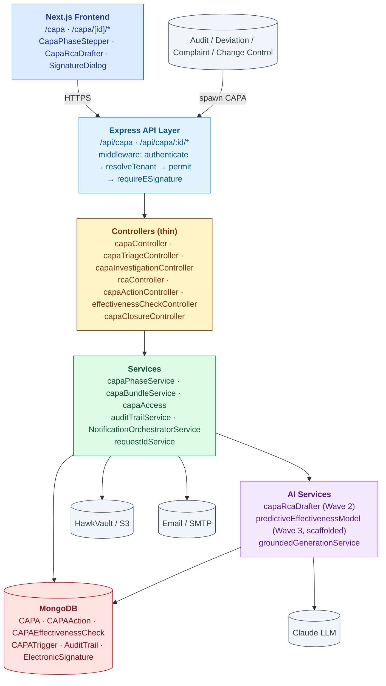
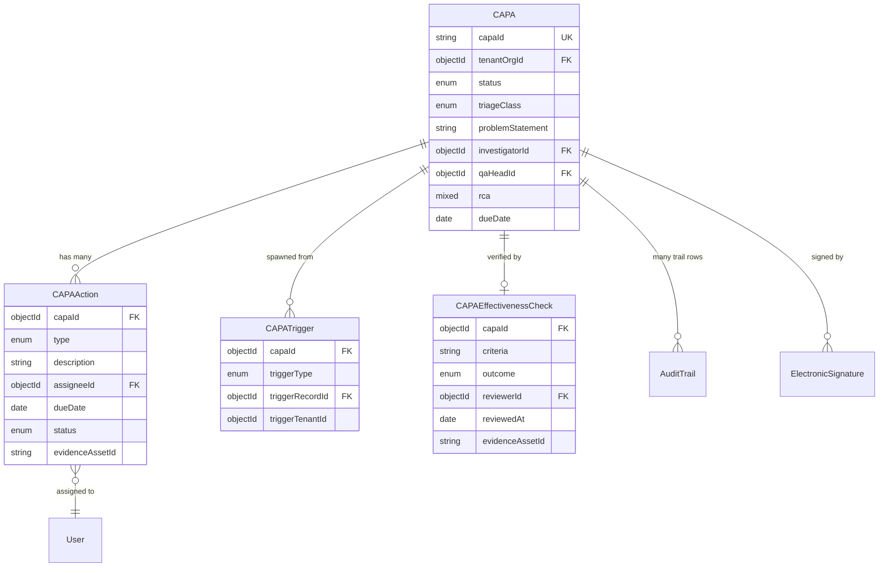
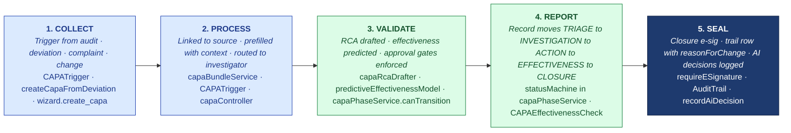

# ARCHITECTURE — CAPA

| Field | Value |
|---|---|
| Module | CAPA (Corrective + Preventive Action) |
| Depth | Executive overview with code path links for detail |
| Pairs with | [URS.md](URS.md) (requirements), [DESIGN.md](DESIGN.md) (UX) |
| Last updated | 2026-06-01 |

---

## 1. System Context

**Tier ownership:**
- **Frontend** — role-aware UI, e-sig modal capture, AI draft preview
- **API + middleware** — auth, tenant scoping, e-sig enforcement
- **Controllers** — route dispatch (thin)
- **Services** — phase transitions, bundle assembly, notifications
- **AI** — RCA scaffolding, predictive effectiveness (scaffolded), all routed through `groundedGenerationService`
- **External** — trigger sources (other modules), file storage, email, LLM

---

## 2. Data Model

### Primary entities

| Model | Purpose | Key fields | References |
|---|---|---|---|
| **CAPA** | Aggregate root | `capaId` (unique per tenant), `tenantOrgId`, `status`, `triageClass`, `problemStatement`, `investigatorId`, `qaHeadId`, `rca` (embedded), `dueDate` | `users`, `organizations` |
| **CAPAAction** | One action in the plan | `capaId`, `type` (CORRECTIVE/PREVENTIVE), `description`, `assigneeId`, `dueDate`, `status`, `evidenceAssetId`, `completedAt` | `CAPA`, `users` |
| **CAPAEffectivenessCheck** | Verification result | `capaId`, `criteria`, `outcome` (EFFECTIVE/NOT_EFFECTIVE/PARTIAL), `reviewerId`, `reviewedAt`, `evidenceAssetId` | `CAPA`, `users` |
| **CAPATrigger** | Link to upstream record | `capaId`, `triggerType` (AUDIT/DEVIATION/COMPLAINT/CHANGE/INTERNAL), `triggerRecordId`, `triggerTenantId` | `CAPA`, source-module records |
| **AuditTrail** (shared) | 21 CFR Part 11 log | `tenantId`, `entityType='capa'`, `entityId`, `action`, `reasonForChange`, `signatureId?`, `before`, `after` | All modules |
| **ElectronicSignature** (shared) | Part 11 e-sig | `recordType='capa'`, `recordId`, `signerId`, `signatureMeaning`, `authMethod`, `reasonForChange` | All modules |

### Indexes (key)

- `CAPA`: `(tenantOrgId, status)`, `capaId` (unique per tenant), `(tenantOrgId, dueDate)`
- `CAPAAction`: `(capaId, status)`, `(assigneeId, status)` (for dashboards)
- `CAPATrigger`: `(triggerType, triggerRecordId)` — cross-module lookups
- `AuditTrail`: `(tenantId, entityType, entityId)` — shared trail index

---

## 3. API Contract Catalog

All paths require `authenticate`; RBAC via `permit(...roles)`.

### List + read

| Endpoint | Roles | Notes |
|---|---|---|
| `GET /api/capa` | all (scoped) | Filterable by status, triageClass, assignee |
| `GET /api/capa/:id` | all (access-guarded) | Full record + actions + RCA |
| `GET /api/capa/:id/actions` | all (access-guarded) | Action plan |
| `GET /api/capa/:id/audit-trail` | all | Single-CAPA trail |

### Lifecycle

| Endpoint | Roles | Phase |
|---|---|---|
| `POST /api/capa` | qa, investigator, system (cross-module) | Create (INTAKE) |
| `POST /api/capa/:id/triage` | qa_head | TRIAGE → branch |
| `POST /api/capa/:id/investigation` | investigator, qa_head | INVESTIGATION |
| `POST /api/capa/:id/rca/draft` | investigator | RCA (AI) |
| `POST /api/capa/:id/rca/approve` | qa_head | RCA approved |
| `POST /api/capa/:id/actions` | investigator | Add action to plan |
| `POST /api/capa/:id/actions/:actionId/complete` | assignee | Mark action done + evidence |
| `POST /api/capa/:id/effectiveness-check` | qa_head | Record outcome |
| `POST /api/capa/:id/close` | qa_head | **E-sig gate (G-Close)** |
| `POST /api/capa/:id/reopen` | qa_head, tenant_admin | Re-open path |

### E-signature gates

| Endpoint | Meaning | Phase |
|---|---|---|
| `POST /api/capa/:id/close` | APPROVED | G-Close |

### AI

| Endpoint | Roles | Purpose |
|---|---|---|
| `POST /api/capa/:id/rca/draft` | investigator | AI-scaffolded 5-Why |
| `POST /api/capa/:id/effectiveness-predict` | investigator (planned) | Wave-3 predictive model (scaffolded; not wired to UI) |

### Cross-module

| Endpoint | Roles | Purpose |
|---|---|---|
| `GET /api/capa/by-trigger?type=audit&id=X` | all | Find CAPA from upstream record |
| `GET /api/audit-trail/by-entity?entityType=capa` | all | Cross-module trail |

---

## 4. RBAC Matrix

| Capability | Initiator | Investigator | Action Owner | Supplier QA | QA Head | Tenant Admin | Superadmin |
|---|---|---|---|---|---|---|---|
| Create CAPA | ✅ | ✅ | — | ✅ (supplier-side) | ✅ | ✅ | ✅ |
| List own CAPAs (scoped) | ✅ | ✅ | ✅ | ✅ | ✅ | ✅ | ✅ |
| Triage decision | — | — | — | — | ✅ | ✅ | ✅ |
| Investigation + RCA draft | — | ✅ | — | — | ✅ | ✅ | ✅ |
| Approve RCA | — | — | — | — | ✅ | ✅ | ✅ |
| Add/edit actions | — | ✅ | — | — | ✅ | ✅ | ✅ |
| Complete action + evidence | — | — | ✅ | ✅ (own) | ✅ | ✅ | ✅ |
| Effectiveness check | — | — | — | — | ✅ | ✅ | ✅ |
| Close CAPA (e-sig) | — | — | — | — | ✅ | ✅ | ✅ |
| Re-open | — | — | — | — | ✅ | ✅ | ✅ |
| Read audit trail | ✅ | ✅ | ✅ | ✅ | ✅ | ✅ | ✅ |

**Cross-tenant guards:**
- `canUserAccessCapa()` — role + affiliation check
- `buildCapaTenantScopeQuery()` — query-time `tenantOrgId` filter
- Supplier-side CAPAs scoped to supplier tenant; buyer view via affiliation only

---

## 5. AI Capabilities

All AI routes through `groundedGenerationService` (citations + confidence + skeleton fallback + audit-trailed via `recordAiDecision()`).

| Tool | Type | Read/Write | E-sig | Where used | Confidence floor | Status |
|---|---|---|---|---|---|---|
| **capaRcaDrafter** (Wave 2) | LLM 5-Why scaffolder | READ (returns draft) | NO (review then save) | `CapaRcaDrafter` component | 0.6 | ✅ live |
| **predictiveEffectivenessModel** (Wave 3) | ML classifier | READ | NO | Planned: action-plan builder | TBD | ⚠️ scaffolded, not wired |
| **wizard.create_capa** | App Wizard tool | WRITE | YES | App Wizard flow | n/a | ✅ live |
| **wizard.list_open_capas** | App Wizard tool | READ | NO | App Wizard query path | n/a | ✅ live |

### Grounding posture (same as audit module)

1. JSON-schema structured output
2. Citations required (`requireCitations: true`) — minimum 1
3. Confidence floor — below 0.6 → deterministic 5-Why skeleton
4. PII redaction before LLM send
5. `recordAiDecision()` writes feature, modelVersion, promptHash, retrievalSet, confidence, tokens, latency to AuditTrail

---

## 6. State Machine Implementation

Cross-reference [DESIGN §4](DESIGN.md#4-state-machine).

**Enforcement layer:**
- **Definition:** `backend/src/constants/capaStatuses.js`
- **Validation:** `services/capaPhaseService.js → canTransition()` — owner role, gate prerequisites, forward-only rule
- **Application:** `services/capaPhaseService.js → applyPhaseTransition()` — mutates status, writes AuditTrail
- **Re-open loop counter:** `CAPA.reopenCount` — UI surfaces escalation banner when ≥3

**Gate enforcement:**
- **G-Triage** — `capaTriageController` validates rationale ≥10 chars before transition
- **G-RCA** — `rcaController.approve()` requires `qa_head` role
- **G-Close** — `requireESignature` middleware accepts pre-signed `electronicSignatureId` OR inline `signaturePassword`; soft default, hard via `ENFORCE_ESIG=hard`

---

## 7. Compliance Traceability

| Feature | 21 CFR Part 11 | 21 CFR 820.100 | ICH Q10 | EU GMP Ch.1 | ISO 9001 |
|---|---|---|---|---|---|
| Intake + trigger linkage | §11.10(a) | (a)(1) | §3.2.2 | §1.4 | §10.2 |
| Triage + rationale | §11.10(e) | (a)(2) | §3.2.2 | §1.4 | §10.2 |
| Investigation + RCA | §11.10(b) authenticity | (a)(3) | §3.2.2 | §1.4 | §10.2 |
| Action plan + tracking | §11.10(e) | (a)(4)(5) | §3.2.2 | §1.4 | §10.2 |
| **Effectiveness verification** | §11.10(e) | **(a)(6) — most cited** | §3.2.2 | §1.4 | §10.2 |
| Closure e-signature | **§11.50 + §11.200** | (b) | §3.2.2 | §1.4 | §10.2 |
| Audit trail (cross-module) | **§11.10(e), §11.10(k)** | (b) | §6 records | §9 audit trail | §7.5 |
| RBAC + tenant isolation | §11.10(d) | — | §2 | §12 | §7.2 |
| AI decision audit trail | §11.10(b), §11.10(e) | — | §6 risk-based validation | — | §8.7 |

---

## 8. Operational Concerns

### Performance / scale targets
- CAPA list: < 500 ms for 5,000 CAPAs per tenant
- AuditTrail query for one CAPA: < 200 ms
- AI RCA draft: < 6 sec p95 (Claude Sonnet)
- Closure bundle assembly: < 5 sec for typical bundle (URS-B-004)

### Failure modes + recovery
- **LLM down** → deterministic 5-Why skeleton; UI surfaces "AI unavailable"
- **DB write failure mid-transition** → revert to prior status; AuditTrail row marked FAILED
- **Cross-tenant trigger record lookup fails** → snapshot of trigger context preserved on CAPA; banner shows degraded link
- **Action assignee removed** → reassignment flow available; orphaned actions surface in tenant_admin dashboard
- **E-sig password failure** → AuditTrail row marked SIGNATURE_FAILED; status unchanged
- **NOT_EFFECTIVE loop runaway** → hard escalation after 3 loops

### Observability
- Structured logs with correlation ID
- Per-tenant metrics: CAPAs in flight, mean-time-to-close, effectiveness rate, re-open rate, AI acceptance rate
- AuditTrail itself = regulatory observability

---

## 9. Known Gaps + Engineering Debt

1. **Predictive effectiveness AI** (URS-B-002) — Wave-3 model scaffolded, not wired to drafter UI.
2. **Cross-tenant CAPA chain** (URS-B-005) — not started; consent model TBD.
3. **Closure evidence bundle UX** (URS-B-004) — backend assembles, one-click export button deferred.
4. **RCA approval e-sig** (URS-A-024) — approval step exists, no e-sig wrapper yet.
5. **Trend surfacing at intake** (URS-B-003) — exists in Deviation module, not wired to CAPA intake.
6. **Hard/soft e-sig default** — same open question as audit module.
7. **RCA methods beyond 5-Why** — fishbone, fault tree not implemented.

---

## 10. Open Engineering Questions

1. **State machine library** — same question as audit module (XState?).
2. **Predictive effectiveness model deployment** — Bedrock-hosted vs internal microservice?
3. **Cross-module trigger fan-in performance** — when one deviation spawns 5 CAPAs across tenants, what's the cascade behavior?
4. **Bundle export format** — single PDF (rendered) vs ZIP of source records?
5. **Re-open semantics** — same CAPA with new actions vs new linked CAPA (today: in-place re-open).

---

## 11. Code Path Index

| Architectural concern | Primary code path |
|---|---|
| Routes | `backend/src/routes/capa*.js` |
| Controllers | `backend/src/controllers/capa*.js`, `effectivenessCheckController.js` |
| Services | `backend/src/services/capa*.js`, `services/ai/wave2/capaRcaDrafter.js` |
| Models | `backend/src/models/CAPA.js`, `CAPAAction.js`, `CAPAEffectivenessCheck.js`, `CAPATrigger.js` |
| Middlewares | `backend/src/middlewares/{authMiddleware,roleMiddleware,requireESignature}.js` |
| RBAC utils | `backend/src/utils/capaAccess.js` |
| Constants | `backend/src/constants/capaStatuses.js` |
| Shared audit trail | `backend/src/services/auditTrailService.js`, `models/AuditTrail.js` |
| AI grounding | `backend/src/services/groundedGenerationService.js`, `services/ai/audit-trail/recordAiDecision.js` |
| Frontend pages | `frontend/app/(console)/capa/**` |
| Frontend components | `frontend/components/capa/`, `frontend/components/ai/CapaRcaDrafter.tsx` |

---

## 12. The Five-Pillar Walkthrough

CAPA is one expression of Hawkeye's universal 5-pillar pipeline (**COLLECT → PROCESS → VALIDATE → REPORT → SEAL**). This section narrates how a corrective action walks the pillars from upstream trigger to closure, maps each pillar to the actual code, and notes the cross-module fan-in / fan-out. The same shape applies to every regulated workflow on the platform — see the MASTER-REFERENCE for the canonical pattern.

### 12.1 Narrative

A CAPA is **collected** when an upstream module emits a trigger event — `CAPATrigger` rows arrive from audits (per observation), deviations (`createCapaFromDeviation`), complaints, or change-control records — and the wizard tool `wizard.create_capa` is the manual entry path. It is **processed** by linking the new CAPA back to the source record (`triggerType` + `triggerRecordId`) and prefilling `problemStatement` with the source context (observation text, deviation disposition, complaint summary) so the investigator does not start from a blank page. It is **validated** through structured root-cause analysis — `capaRcaDrafter` (Wave 2) walks the investigator through a 5-Why with citations and confidence floor 0.6, `predictiveEffectivenessModel` (Wave 3, scaffolded) will score action-plan likelihood, and `capaPhaseService.canTransition()` enforces approval gates as the record moves through TRIAGE → INVESTIGATION → ACTION_PLAN → EFFECTIVENESS_CHECK → CLOSURE. The outcome is **reported** as the CAPA record itself moves through those approval states in the phase machine, with each action's evidence asset attached and `CAPAEffectivenessCheck` recording the verification verdict. Finally it is **sealed** at G-Close — `requireESignature` middleware captures the QA-Head e-signature with `signatureMeaning='APPROVED'`, `auditTrailService` writes the closure row with mandatory `reasonForChange`, and `recordAiDecision` rows for every RCA draft remain queryable for inspectors — and if the effectiveness check returns `NOT_EFFECTIVE` three times, the runaway-loop guard escalates and may spawn a new linked Deviation.

### 12.2 Pillar diagram

### 12.3 Cross-module fan-in / fan-out

CAPA is the canonical fan-in module — it consumes triggers from every upstream regulated workflow — but it also fans out on failure paths:

- **Fan-in (upstream)** — `CAPATrigger.triggerType` enumerates `AUDIT` (from `POST /api/audits/:auditId/report/observations/:obsId/capa`), `DEVIATION` (from `createCapaFromDeviation`), `COMPLAINT`, `CHANGE`, and `INTERNAL`. Each row preserves `triggerRecordId` so the investigator can one-click back to the source.
- **Fan-out on NOT_EFFECTIVE** — when an effectiveness check returns `NOT_EFFECTIVE`, the CAPA re-opens in-place; the 3-loop guard escalates to a new linked Deviation or change request when the same root cause keeps recurring.
- **Cross-module trail** — `AuditTrail` rows for the CAPA share the `(tenantId, entityType, entityId)` index with every other module, so `GET /api/audit-trail/by-entity?entityType=capa&entityId=X` returns the full thread including upstream and downstream records (URS-B-009).

### 12.4 Code path table

| Pillar | Code path | What it does in CAPA |
|---|---|---|
| 1. COLLECT | `models/CAPATrigger.js`, `services/capaBundleService.js`, `services/deviation/createCapaFromDeviation.js`, tools/`wizard.create_capa` | Receives trigger from upstream module (audit observation, deviation disposition, complaint, change) with `triggerType` + `triggerRecordId` |
| 2. PROCESS | `controllers/capaController.js` (create), `services/capaBundleService.js`, `models/CAPA.js` (`problemStatement` prefill) | Links new CAPA back to source; prefills problem statement with upstream context; routes to investigator queue |
| 3. VALIDATE | `services/ai/wave2/capaRcaDrafter.js`, `services/ai/wave3/predictiveEffectivenessModel.js` (scaffolded), `services/capaPhaseService.js`, `constants/capaStatuses.js` | AI-scaffolds 5-Why root cause with citations; (scaffolded) predicts effectiveness likelihood; `canTransition()` enforces owner role + gate prerequisites |
| 4. REPORT | `services/capaPhaseService.js` (state machine), `controllers/capaInvestigationController.js`, `controllers/capaActionController.js`, `controllers/effectivenessCheckController.js`, `models/CAPAEffectivenessCheck.js` | Walks the record through TRIAGE → INVESTIGATION → ACTION_PLAN → EFFECTIVENESS_CHECK → CLOSURE with evidence attached at each step |
| 5. SEAL | `middlewares/requireESignature.js`, `models/ElectronicSignature.js`, `models/AuditTrail.js`, `services/auditTrailService.js`, `services/ai/audit-trail/recordAiDecision.js` | QA-Head e-signature at G-Close with `signatureMeaning='APPROVED'`; append-only trail row with mandatory `reasonForChange`; one AI-decision row per RCA draft |

See also:
- [Doc_V2/02-platform/MASTER-REFERENCE.md](../../02-platform/MASTER-REFERENCE.md) — the canonical 5-pillar pattern
- [Doc_V2/06-modules/deviation/ARCHITECTURE.md §12](../deviation/ARCHITECTURE.md#12-the-five-pillar-walkthrough) — the most common upstream trigger source
- [Doc_V2/06-modules/audit-management/ARCHITECTURE.md §12](../audit-management/ARCHITECTURE.md#12-the-five-pillar-walkthrough) — the other major upstream trigger source
