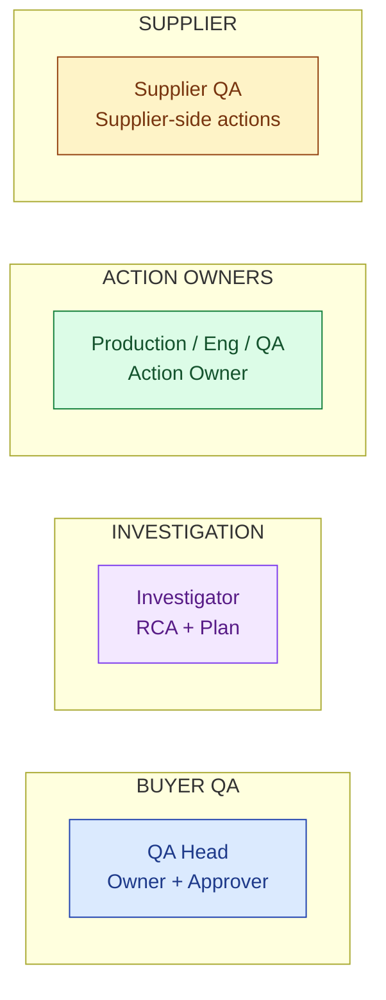
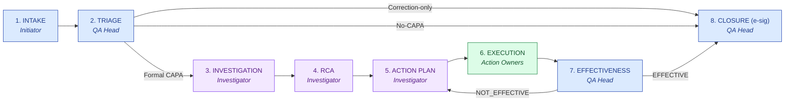
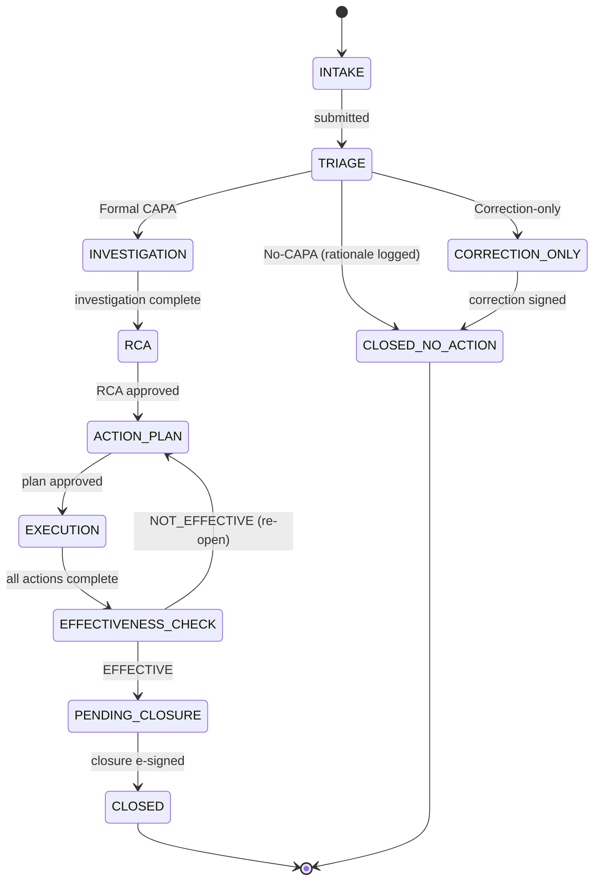

# DESIGN — CAPA

| Field | Value |
|---|---|
| Module | CAPA (Corrective + Preventive Action) |
| Depth | Executive overview (with pointers to code for detail) |
| Pairs with | [URS.md](URS.md) (requirements), [ARCHITECTURE.md](ARCHITECTURE.md) (technical) |
| Last updated | 2026-06-01 |

---

## 1. Personas (4 primary, 2 secondary)

Cross-reference [URS §2](URS.md#2-stakeholders-and-personas).



| # | Persona | Lane | Primary actions | Decisions |
|---|---|---|---|---|
| 1 | **QA Head** | Buyer QA | Triage, approve RCA, approve closure (e-sig) | Triage class, closure approval |
| 2 | **Investigator** | Investigation | Investigate, draft RCA (AI-assisted), build action plan | Root cause, action types |
| 3 | **Action Owner** | Execution | Execute assigned action + attach evidence | Execution approach |
| 4 | **Supplier QA** | Supplier | Respond to supplier-side CAPA actions | Per-action response |
| 5 | **Initiator** | (varies) | File CAPA intake (often from another module) | What to file |
| 6 | **Tenant Admin** | Platform | Configure triage matrix, approval routing | Per-tenant config |

---

## 2. End-to-End Journey



> 💡 **Triage decides the lane.** Most efficiency wins come from confident "No-CAPA" or "Correction-only" calls with documented rationale — not every problem deserves a full lifecycle.

### Journey snapshots per persona

#### QA Head
```
1. Inbox + triage queue   → /capa                    CAPAList (triage filter)
2. Open CAPA              → /capa/[id]                CapaDetail hub
3. Triage decision        → /capa/[id]/triage         TriageForm (rationale required)
4. Approve RCA            → /capa/[id]/rca            RcaApproval
5. Approve effectiveness  → /capa/[id]/effectiveness-check
6. Sign closure (e-sig)   → /capa/[id]/close          SignatureDialog [G-Close]
```

#### Investigator
```
1. Open assigned CAPA     → /capa/[id]               CapaDetail
2. Build investigation    → /capa/[id]/investigation IntelligenceForm + attachments
3. Draft RCA (AI)         → /capa/[id]/rca           CapaRcaDrafter (5-Why scaffolded)
4. Build action plan      → /capa/[id]/actions       ActionPlanBuilder
5. Track action progress  → /capa/[id]/actions       progress board
```

#### Action Owner
```
1. Notification           → email + dashboard
2. Open action            → /capa/[id]/actions/[actionId]
3. Complete + upload      → ActionCompleteForm (description + evidence)
```

---

## 3. Screen + Component Inventory

Pages live under `frontend/app/(console)/capa/`.

| Route | Purpose | Key components |
|---|---|---|
| `/capa` | List + filter (status / triage / due) | `CapaList`, `CapaTriageFilter` |
| `/capa/[id]` | Detail hub (default tab) | `CapaDetail`, `CapaPhaseStepper`, `CapaTabs` |
| `/capa/[id]/triage` | Triage decision | `TriageForm` |
| `/capa/[id]/investigation` | Investigation workspace | `InvestigationForm`, evidence upload |
| `/capa/[id]/rca` | RCA workspace + AI draft | `CapaRcaDrafter`, `RcaApproval` |
| `/capa/[id]/actions` | Action plan board | `ActionPlanBuilder`, `ActionCard` |
| `/capa/[id]/actions/[actionId]` | Action detail / complete | `ActionCompleteForm` |
| `/capa/[id]/effectiveness-check` | Effectiveness verification | `EffectivenessCheckForm` |
| `/capa/[id]/close` | Closure ceremony | `ClosureForm` + `SignatureDialog` |
| `/capa/[id]/audit-log` | 21 CFR Part 11 trail | `AuditLogTable` |

Cross-cutting components:
- `CapaPhaseStepper` — visual 8-state progress
- `SignatureDialog` — Part 11 e-sig (reused across modules)
- `CapaTriggerBadge` — shows source (Audit / Deviation / Complaint / Change Control)
- `CapaRcaDrafter` — AI 5-Why scaffolder

---

## 4. State Machine



**Transition rules** (enforced in `capaPhaseService.canTransition()`):
- Forward-only by default
- Triage branch points (No-CAPA / Correction-only / Formal) are one-way
- NOT_EFFECTIVE result re-opens to ACTION_PLAN (loops counted; >3 loops triggers escalation banner)
- Revert only by tenant_admin/superadmin with reasonForChange

### Decision gates

| Gate | Phase | Trigger | Enforcer | Audit-trail entry |
|---|---|---|---|---|
| **G-Triage** | TRIAGE | QA Head submits triage with rationale ≥10 chars | `capaTriageController` | `TRIAGED` |
| **G-RCA** | RCA → ACTION_PLAN | QA Head approves RCA | `rcaApprovalController` | `RCA_APPROVED` |
| **G-Effectiveness** | EFFECTIVENESS_CHECK | QA Head records outcome + evidence | `effectivenessCheckController` | `EFFECTIVENESS_RECORDED` |
| **G-Close** | PENDING_CLOSURE → CLOSED | QA Head e-signs (APPROVED) | `requireESignature` + `capaClosureController` | `SIGNED` + `CLOSED` |

---

## 5. Notifications and Reminders

| Event | Recipients | Channel |
|---|---|---|
| CAPA created (from trigger module) | QA Head, assigned investigator | Email + dashboard |
| Triage decision logged | Initiator | Email |
| Action assigned | Action owner | Email + dashboard task |
| Action overdue | Action owner + investigator | Email reminder (daily until done) |
| Effectiveness check due | QA Head | Email |
| CAPA closed | Initiator + trigger-record owner | Email |
| Re-opened (NOT_EFFECTIVE) | QA Head + investigator | Email (priority) |

---

## 6. Error and Edge Cases

| Scenario | Handling |
|---|---|
| **No CAPA records in list** | `CapaList` renders empty state |
| **Triage missing rationale** | Form-level error; cannot submit |
| **RCA AI low confidence** | `groundedGenerationService` returns deterministic 5-Why skeleton; UI shows "Confidence low — draft manually" |
| **Action assignee leaves company** | Reassignment flow available to investigator + tenant_admin; audit-trailed |
| **NOT_EFFECTIVE loop ≥3** | Hard banner + escalation notification to VP Quality |
| **Closure e-sig password wrong** | SignatureDialog stays open; "Password verification failed" |
| **Trigger record deleted upstream** | CAPA retains snapshot of trigger context; banner shows "Trigger record archived" |
| **Cross-tenant trigger** (supplier-side CAPA from buyer audit) | Two linked CAPA records (one per tenant), with redacted cross-reference |

---

## 7. Accessibility

- All forms keyboard-traversable
- ARIA labels on phase stepper, triage filter, action cards
- WCAG AA color contrast on status chips (Open amber / In Progress blue / Closed green / Re-opened red)
- SignatureDialog traps focus, returns to trigger on close
- Open gap: live region announcements on action-status changes

---

## 8. Open Design Questions

1. **Triage UX** — single screen vs guided wizard? Today single-screen form; wizard might raise quality of "No-CAPA" rationales.
2. **RCA method selection** — 5-Why only today; add fishbone / fault tree as selectable methods?
3. **Action plan template library** — pre-built action plans per common root cause? Could pair with predictive-effectiveness AI.
4. **Re-open vs new CAPA** — when NOT_EFFECTIVE, current default is re-open; should the threshold for "spawn new CAPA instead" be configurable per tenant?
5. **Closure bundle preview** — should the closure screen render a preview of what the evidence bundle will contain?
6. **Cross-module trigger surfacing** — should the CAPA detail header always show the trigger context inline, or link out?
