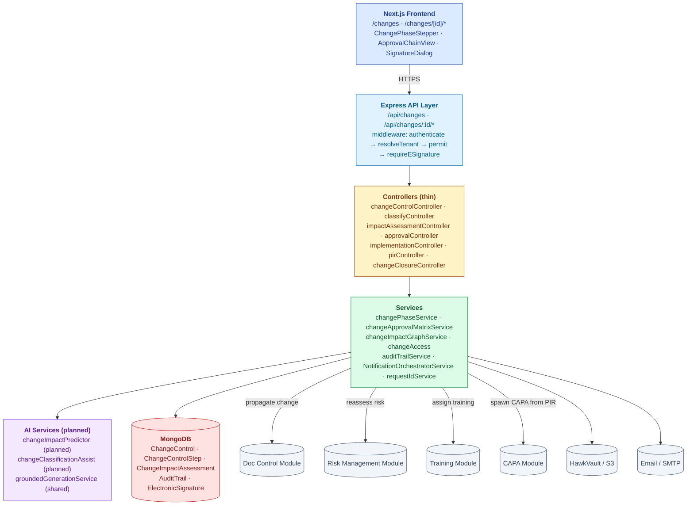
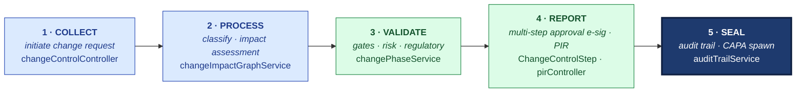
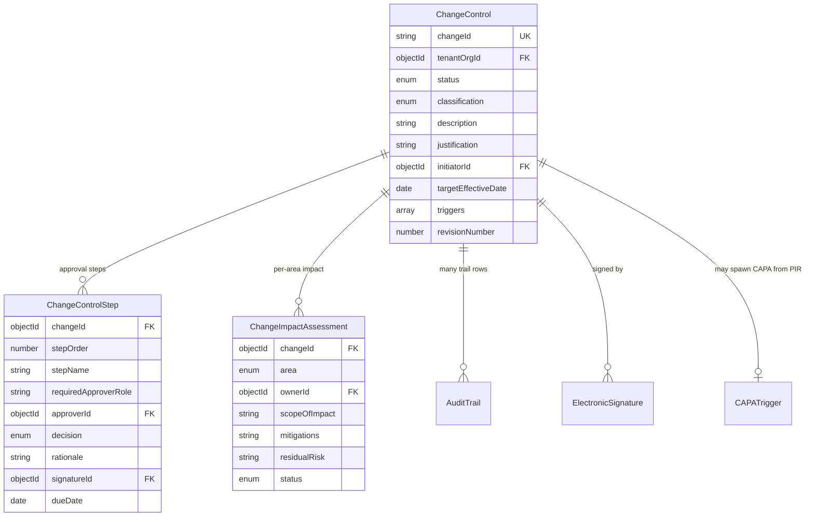

# ARCHITECTURE — Change Control

| Field | Value |
|---|---|
| Module | Change Control |
| Depth | Executive overview with code path links for detail |
| Pairs with | [URS.md](URS.md) (requirements), [DESIGN.md](DESIGN.md) (UX) |
| Last updated | 2026-06-01 |

---

## 1. System Context

**Tier ownership:**
- **Frontend** — phase stepper, approval chain visualization, e-sig modal capture
- **API + middleware** — auth, tenant scoping, e-sig enforcement on every approval + PIR
- **Controllers** — route dispatch (thin)
- **Services** — phase transitions, approval matrix resolution, cross-module propagation
- **AI** — planned (impact predictor + classification assist); not yet built
- **External** — Doc Control, Risk, Training, CAPA modules + file storage, email

---

## 2. The Five-Pillar Walkthrough

Change Control walks S.M.A.R.T. Hawk's universal pipeline end-to-end. A change is **collected** at intake (`changeControlController.create` accepts initiator description, justification, targetEffectiveDate, and triggers; classification — ROUTINE / MINOR / MAJOR — is set via `classifyController` backed by `changeApprovalMatrixService`). It is **processed** through impact analysis (`changeImpactGraphService` walks affected suppliers, sites, products, related quality records, and emits per-area `ChangeImpactAssessment` rows; `riskReassessmentRequest` links to the risk register). It is **validated** by the gated state machine (`changePhaseService.canTransition` enforces classification routing, validation-required flag, and regulatory-impact prerequisites). It is **reported** through a multi-step approval workflow (`ChangeControlStep` rows resolved from the per-tenant approval matrix; every step demands an `ElectronicSignature` via the `requireESignature` middleware; post-implementation review is signed via `pirController`). Finally every transition is **sealed** to an append-only `AuditTrail` with field-level diff and signature binding — and the PIR can spawn a downstream CAPA via `POST /api/changes/:id/spawn-capa`.

**Cross-module spawn:**
- **Doc Control** — approved SOP-affecting change emits `docControlReviewRequest` to fork the impacted document revision
- **Risk** — `riskReassessmentRequest` reopens the linked risk file for re-rating
- **Training** — new-procedure changes emit `trainingAssignmentRequest` to roster impacted operators
- **CAPA** — PIR review can call `POST /api/changes/:id/spawn-capa`, creating a `CAPATrigger` with `triggerType='CHANGE_CONTROL'`

**Code-path table**

| Pillar | Code path | What it does |
|---|---|---|
| 1 · Collect | `backend/src/controllers/changeControlController.js`, `controllers/classifyController.js` | Accepts intake form · sets classification + triggers |
| 2 · Process | `backend/src/services/changeImpactGraphService.js`, `services/changeApprovalMatrixService.js` | Computes per-area impact · resolves approval chain |
| 3 · Validate | `backend/src/services/changePhaseService.js`, `constants/changeStatuses.js` | `canTransition()` enforces gates · validation-required flag |
| 4 · Report | `backend/src/controllers/approvalController.js`, `controllers/pirController.js`, `middlewares/requireESignature.js` | Per-step e-sig · PIR sign-off |
| 5 · Seal | `backend/src/services/auditTrailService.js`, `models/AuditTrail.js`, `controllers/changeControlController.js#spawnCapa` | Field-level diff trail · optional CAPA spawn |

---

## 3. Data Model

### Primary entities

| Model | Purpose | Key fields | References |
|---|---|---|---|
| **ChangeControl** | Aggregate root | `changeId` (unique per tenant), `tenantOrgId`, `status`, `classification` (ROUTINE/MINOR/MAJOR), `description`, `justification`, `initiatorId`, `targetEffectiveDate`, `triggers[]`, `revisionNumber` | `users`, `organizations` |
| **ChangeControlStep** | One approval step | `changeId`, `stepOrder`, `stepName`, `requiredApproverRole`, `approverId`, `decision` (APPROVED/REJECTED/PENDING), `rationale`, `signatureId`, `dueDate` | `ChangeControl`, `users`, `ElectronicSignature` |
| **ChangeImpactAssessment** | Per-area impact record | `changeId`, `area` (DOCUMENTS/EQUIPMENT/SUPPLIERS/RISK/TRAINING/VALIDATION), `ownerId`, `scopeOfImpact`, `mitigations`, `residualRisk`, `status` | `ChangeControl`, `users` |
| **CAPATrigger** (shared with CAPA) | PIR-to-CAPA link | `capaId`, `triggerType='CHANGE_CONTROL'`, `triggerRecordId` | `CAPA` |
| **AuditTrail** (shared) | 21 CFR Part 11 log | `tenantId`, `entityType='change'`, `entityId`, `action`, `reasonForChange`, `signatureId?`, `meta.changeBrief.fields[]` (field-level diff) | All modules |
| **ElectronicSignature** (shared) | Part 11 e-sig | `recordType='change'`, `recordId`, `signerId`, `signatureMeaning`, `authMethod`, `reasonForChange` | All modules |

### Indexes (key)

- `ChangeControl`: `(tenantOrgId, status)`, `changeId` (unique per tenant), `(tenantOrgId, classification)`
- `ChangeControlStep`: `(changeId, stepOrder)`, `(approverId, decision)` — for approver inbox
- `ChangeImpactAssessment`: `(changeId, area)`, `(ownerId, status)`
- `AuditTrail`: shared `(tenantId, entityType, entityId)` index

---

## 4. API Contract Catalog

All paths require `authenticate`; RBAC via `permit(...roles)`.

### List + read

| Endpoint | Roles | Notes |
|---|---|---|
| `GET /api/changes` | all (scoped + role-filtered) | Filterable by status, classification, area, pending-my-approval |
| `GET /api/changes/:id` | all (access-guarded) | Full record + steps + assessments |
| `GET /api/changes/:id/impact-graph` | all | Cross-module propagation tree (URS-B-003) |
| `GET /api/changes/:id/audit-trail` | all | Single-change trail |

### Lifecycle

| Endpoint | Roles | Phase |
|---|---|---|
| `POST /api/changes` | all (any authenticated user) | Initiation |
| `POST /api/changes/:id/classify` | reviewer, qa, tenant_admin | Classification |
| `POST /api/changes/:id/impact-assessment` | area_owner, qa, tenant_admin | Per-area impact |
| `POST /api/changes/:id/review` | reviewer, qa | Mark review complete |
| `POST /api/changes/:id/step/:stepId/approve` | step-specific approver | **E-sig gate (G-Step) — approve** |
| `POST /api/changes/:id/step/:stepId/reject` | step-specific approver | **E-sig gate (G-Step) — reject** |
| `POST /api/changes/:id/implement` | implementer, qa | Implementation completion |
| `POST /api/changes/:id/pir` | pir_reviewer, qa_head | **E-sig gate (G-PIR)** |
| `POST /api/changes/:id/spawn-capa` | pir_reviewer, qa_head | Cross-module CAPA spawn |
| `POST /api/changes/:id/close` | system (auto) or qa_head | Closure |

### E-signature gates

| Endpoint | Meaning | Phase |
|---|---|---|
| `POST /api/changes/:id/step/:stepId/approve` | APPROVED (per step) | G-Step |
| `POST /api/changes/:id/step/:stepId/reject` | REJECTED (per step) | G-Step |
| `POST /api/changes/:id/pir` | APPROVED (PIR sign-off) | G-PIR |

### Cross-module

| Endpoint | Roles | Purpose |
|---|---|---|
| `POST /api/changes/:id/spawn-capa` | pir_reviewer, qa_head | Create linked CAPA |
| (event) `docControlReviewRequest.emit(...)` | system | Notify Doc Control module |
| (event) `riskReassessmentRequest.emit(...)` | system | Notify Risk module |
| (event) `trainingAssignmentRequest.emit(...)` | system | Notify Training module |
| `GET /api/audit-trail/by-entity?entityType=change` | all | Cross-module trail |

---

## 5. RBAC Matrix

| Capability | Initiator | Reviewer | Area Owner | QA Approver | Implementer | PIR Reviewer | Tenant Admin | Superadmin |
|---|---|---|---|---|---|---|---|---|
| Initiate change | ✅ | ✅ | ✅ | ✅ | ✅ | ✅ | ✅ | ✅ |
| List own/scope | ✅ | ✅ | ✅ | ✅ | ✅ | ✅ | ✅ | ✅ |
| Classify / reclassify | — | ✅ | — | ✅ | — | — | ✅ | ✅ |
| Submit own-area impact | — | — | ✅ | — | — | — | ✅ | ✅ |
| Approve/reject step (e-sig) | — | — | — | ✅ (own step) | — | — | ✅ | ✅ |
| Mark implementation complete | — | — | — | — | ✅ | — | ✅ | ✅ |
| Sign PIR (e-sig) | — | — | — | — | — | ✅ | ✅ | ✅ |
| Spawn CAPA from PIR | — | — | — | — | — | ✅ | ✅ | ✅ |
| Reassign approver | — | — | — | — | — | — | ✅ | ✅ |
| Configure approval matrix | — | — | — | — | — | — | ✅ | ✅ |
| Read audit trail | ✅ | ✅ | ✅ | ✅ | ✅ | ✅ | ✅ | ✅ |

**Cross-tenant guards:**
- `canUserAccessChange()` — affiliation check
- `buildChangeTenantScopeQuery()` — query-time `tenantOrgId` filter
- Step approver matches `requiredApproverRole` + tenant scope

---

## 6. AI Capabilities

> ⏳ **AI in Change Control is largely planned, not built.** The module today is workflow + e-sig + cross-module propagation. AI scaffolding lands in the next wave.

| Tool | Type | Read/Write | E-sig | Where used | Status |
|---|---|---|---|---|---|
| **changeImpactPredictor** (planned) | LLM + retrieval | READ | NO | Initiation form (similar past changes + effort + side effects) | 🚫 not started |
| **changeClassificationAssist** (planned) | LLM classifier | READ | NO | Classification form (suggest class + rationale + confidence) | 🚫 not started |
| **changeImpactGraph** | Backend service (heuristic) | READ | NO | `/changes/[id]/impact-graph` (UI deferred) | ✅ backend; UI deferred |

When AI lands, it will route through the shared `groundedGenerationService` (citations + confidence + skeleton fallback + `recordAiDecision()` audit-trailing).

---

## 7. State Machine Implementation

Cross-reference [DESIGN §4](DESIGN.md#4-state-machine).

**Enforcement layer:**
- **Definition:** `backend/src/constants/changeStatuses.js`
- **Validation:** `services/changePhaseService.js → canTransition()` — owner role, gate prerequisites, classification-routing
- **Application:** `services/changePhaseService.js → applyPhaseTransition()` — mutates status, writes AuditTrail row with field-level diff
- **Approval matrix resolution:** `services/changeApprovalMatrixService.js` → returns step sequence given (classification, tenant)
- **Revision tracking:** rejection at approval increments `revisionNumber`; prior signatures preserved but flagged INVALIDATED in audit trail

**Gate enforcement:**
- **G-Class** — `classifyController` requires reviewer role + rationale
- **G-Impact** — `impactAssessmentController` blocks transition until all areas submitted
- **G-Step** — `requireESignature` middleware on each step; step approver must match `requiredApproverRole`
- **G-Impl** — `implementationController` requires evidence
- **G-PIR** — `requireESignature` middleware; soft default, hard via `ENFORCE_ESIG=hard`

---

## 8. Compliance Traceability

| Feature | 21 CFR Part 11 | ICH Q7 | EU GMP Annex 11 | ISO 9001 | ICH Q10 |
|---|---|---|---|---|---|
| Initiation + traceability | §11.10(a) | **§13.10** | §10 | §6.3 | §3.2.3 |
| Classification w/ rationale | §11.10(e) | **§13.13** | §10 | §6.3 | §3.2.3 |
| Impact assessment per area | §11.10(e) | **§13.13** | §10 | §8.5.6 | §3.2.3 |
| Approval workflow (multi-step) | **§11.50 + §11.200** | **§13.13** | §10 | §6.3 + §8.5.6 | §3.2.3 |
| Implementation evidence | §11.10(e) | §13.13 | §10 | §8.5.6 | §3.2.3 |
| Post-implementation review | §11.50 | §13.13 | §10 | §8.5.6 | **§3.2.3** |
| Cross-module propagation (Docs, Risk, Training) | §11.10(e) | §13.13 | **§10** | §8.5.6 | §3.2.3 |
| Audit trail with field-level diff | **§11.10(e), §11.10(k)** | §6 records | **§9 audit trail** | §7.5 | — |
| RBAC + tenant isolation | §11.10(d) | §13 | §12 | §7.2 | §2 |

---

## 9. Operational Concerns

### Performance / scale targets
- Change list: < 500 ms for 5,000 changes per tenant
- Approval matrix resolution: < 50 ms
- Impact graph compute: < 1 sec for typical change (5–10 impacted records)
- AuditTrail query for one change: < 200 ms

### Failure modes + recovery
- **Cross-module event delivery failure** (Doc Control / Risk / Training) — retry queue (3x); surface in tenant admin dashboard if undelivered
- **Approval step approver removed mid-workflow** — Tenant Admin reassigns; audit-trailed; SLA clock paused
- **Implementation block due to downstream module failure** — UI surfaces blocking module + retry button
- **PIR window passes without sign-off** — escalating reminder cadence; eventually VP Quality alert; status stays PIR_PENDING
- **CAPA spawn from PIR fails** — Change stays in CAPA_SPAWNED state; retry available
- **Concurrent edit on impact assessment** — optimistic-lock conflict via `updatedAt`; "Stale — refresh"
- **E-sig password failure** — AuditTrail row marked SIGNATURE_FAILED; status unchanged

### Observability
- Structured logs with correlation ID
- Per-tenant metrics: changes in flight, mean-time-to-close per classification, approval SLA breach rate, rejection rate, PIR completion rate
- AuditTrail with field-level diffs = regulatory observability layer

---

## 10. Known Gaps + Engineering Debt

1. **AI features not started** (URS-B-001, URS-B-002) — impact predictor + classification assist planned but not built.
2. **Per-tenant approval matrix config UX** (URS-A-012, URS-B-006) — default matrix in code; no-code config UX deferred.
3. **Cross-module impact graph UI** (URS-B-003) — backend computes; UI rendering deferred.
4. **Parallel approval steps** (URS-A-033) — sequential only today; parallel TBD.
5. **Cross-tenant change notifications** (URS-B-005) — not started; consent model TBD.
6. **Doc Control cross-module wiring** — request emitted; downstream consumer wiring partial.
7. **Hard/soft e-sig default** — same shared question as audit/capa/deviation modules.
8. **Routine-class workflow depth** — open question whether Routine should skip impact assessment too (today: skips approval only).

---

## 11. Open Engineering Questions

1. **Approval matrix DSL** — YAML/JSON in code today; should it be a no-code form, a YAML editor, or both?
2. **Event bus for cross-module emit** — direct call today; broker (Kafka/NATS) when modules multiply?
3. **State machine library** — same shared question as audit/capa/deviation modules.
4. **Impact graph compute** — synchronous today; should it be async + cached for large tenants?
5. **Revision-number semantics** — increment on every rejection (today) vs only on substantive change?

---

## 12. Code Path Index

| Architectural concern | Primary code path |
|---|---|
| Routes | `backend/src/routes/changeControl*.js` |
| Controllers | `backend/src/controllers/changeControl*.js`, `classifyController.js`, `impactAssessmentController.js`, `approvalController.js`, `implementationController.js`, `pirController.js` |
| Services | `backend/src/services/change*.js`, `changeApprovalMatrixService.js`, `changeImpactGraphService.js` |
| Models | `backend/src/models/ChangeControl.js`, `ChangeControlStep.js`, `ChangeImpactAssessment.js` |
| Middlewares | `backend/src/middlewares/{authMiddleware,roleMiddleware,requireESignature}.js` |
| RBAC utils | `backend/src/utils/changeAccess.js` |
| Constants | `backend/src/constants/changeStatuses.js`, `changeApprovalMatrix.js` |
| Shared audit trail | `backend/src/services/auditTrailService.js`, `models/AuditTrail.js` |
| Event emitters (planned) | `backend/src/services/{docControlReviewRequest,riskReassessmentRequest,trainingAssignmentRequest}.js` |
| Frontend pages | `frontend/app/(console)/changes/**` |
| Frontend components | `frontend/components/changeControl/`, `frontend/components/eqms/SignatureDialog.tsx` |
