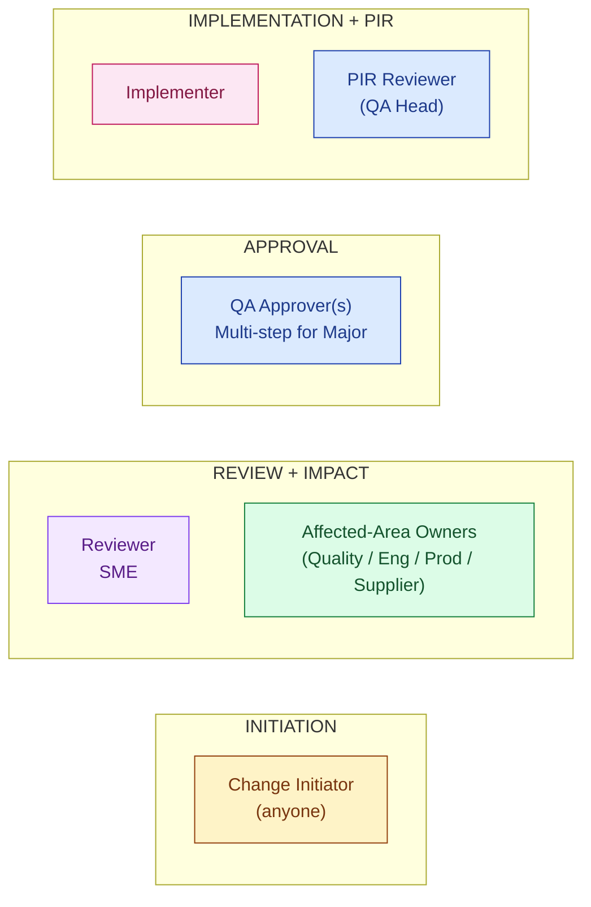
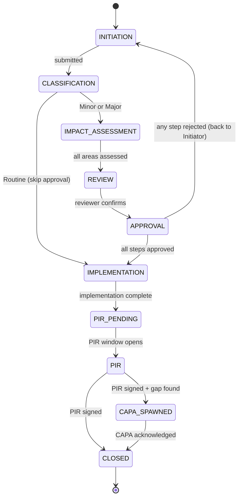

# DESIGN — Change Control

| Field | Value |
|---|---|
| Module | Change Control |
| Depth | Executive overview (with pointers to code for detail) |
| Pairs with | [URS.md](URS.md) (requirements), [ARCHITECTURE.md](ARCHITECTURE.md) (technical) |
| Last updated | 2026-06-01 |

---

## 1. Personas (5 primary, 2 secondary)

Cross-reference [URS §2](URS.md#2-stakeholders-and-personas).



| # | Persona | Lane | Primary actions | Decisions |
|---|---|---|---|---|
| 1 | **Change Initiator** | Origin | File change request | What to change, why |
| 2 | **Reviewer** (SME) | Review | Review classification + initial scope | Reclassify if needed |
| 3 | **Affected-Area Owner** | Review | Assess impact in own area | Scope of impact in area |
| 4 | **QA Approver** | Approval | E-sign step approval (per matrix) | Approve / reject per step |
| 5 | **Implementer** | Implementation | Execute + upload evidence | Execution approach |
| 6 | **PIR Reviewer** (QA Head) | PIR | E-sign PIR; spawn CAPA if gap | Outcome verified? CAPA needed? |
| 7 | **Tenant Admin** | Platform | Configure approval matrix | Per-tenant config |

---

## 2. End-to-End Journey

```mermaid
flowchart LR
    classDef init fill:#fef3c7,stroke:#92400e,color:#78350f
    classDef rev fill:#f3e8ff,stroke:#7c3aed,color:#581c87
    classDef qa fill:#dbeafe,stroke:#1e40af,color:#1e3a8a
    classDef impl fill:#fce7f3,stroke:#be185d,color:#831843

    INIT["1. INITIATION<br/><i>Initiator</i>"]:::init
    CLASS["2. CLASSIFICATION<br/><i>Reviewer</i>"]:::rev
    IMPACT["3. IMPACT ASSESSMENT<br/><i>Area Owners</i>"]:::rev
    REVIEW["4. REVIEW<br/><i>Reviewer</i>"]:::rev
    APPROVAL["5. APPROVAL (e-sig)<br/><i>QA Approver(s)</i>"]:::qa
    IMPL["6. IMPLEMENTATION<br/><i>Implementer</i>"]:::impl
    PIR["7. POST-IMPL REVIEW (e-sig)<br/><i>PIR Reviewer</i>"]:::qa
    CLOSE["8. CLOSURE<br/><i>System</i>"]:::qa

    INIT --> CLASS
    CLASS -->|Routine| IMPL
    CLASS -->|Minor| IMPACT
    CLASS -->|Major| IMPACT
    IMPACT --> REVIEW
    REVIEW --> APPROVAL
    APPROVAL -->|all steps approved| IMPL
    APPROVAL -->|rejected| INIT
    IMPL --> PIR
    PIR -->|gap found| CLOSE
    PIR -->|outcome verified| CLOSE
```



> 💡 **Classification drives everything.** Routine changes skip approval entirely (audit-trailed only). Major changes can require 3–5 sequential approvals depending on tenant matrix. Getting classification right is the highest-leverage decision.

### Journey snapshots per persona

#### Change Initiator
```
1. File request          → /changes/new            ChangeInitiationForm
2. Track status          → /changes/[id]            ChangeDetail (read-only after submit)
3. (If rejected) Revise  → /changes/[id]/revise    ReviseForm (new revision number)
```

#### Reviewer + Affected-Area Owners
```
1. Inbox                 → /changes                 ChangeList (filtered to assigned)
2. Open change           → /changes/[id]            ChangeDetail
3. Classify              → /changes/[id]/classify   ClassifyForm
4. Impact (own area)     → /changes/[id]/impact-assessment ImpactAreaForm
```

#### QA Approver
```
1. Approval queue        → /changes                 ChangeList (filtered to pending-my-approval)
2. Review step           → /changes/[id]/approve/[stepId]  StepApprovalForm
3. E-sign approve/reject → SignatureDialog          [G-Step]
```

#### Implementer
```
1. Implementation queue  → /changes                 ChangeList (filtered to implementation-assigned)
2. Execute               → /changes/[id]/implement  ImplementationForm + evidence
3. Mark complete         → same                     completion endpoint
```

#### PIR Reviewer (QA Head)
```
1. PIR queue             → /changes                 ChangeList (filtered to PIR-due)
2. PIR workspace         → /changes/[id]/pir        PIRForm
3. E-sign PIR            → SignatureDialog          [G-PIR]
4. (Optional) Spawn CAPA → spawn-CAPA button → CAPA module
```

---

## 3. Screen + Component Inventory

Pages live under `frontend/app/(console)/changes/`.

| Route | Purpose | Key components |
|---|---|---|
| `/changes` | List + filter (status / class / area / approver) | `ChangeList`, role-aware filters |
| `/changes/new` | Initiation form | `ChangeInitiationForm` |
| `/changes/[id]` | Detail hub | `ChangeDetail`, `ChangePhaseStepper`, `ChangeTabs` |
| `/changes/[id]/classify` | Classification | `ClassifyForm` |
| `/changes/[id]/impact-assessment` | Per-area impact | `ImpactAssessmentBoard`, `ImpactAreaForm` |
| `/changes/[id]/review` | Reviewer aggregate | `ReviewSummary` |
| `/changes/[id]/approve/[stepId]` | Step approval | `StepApprovalForm` + `SignatureDialog` |
| `/changes/[id]/implement` | Implementation | `ImplementationForm` |
| `/changes/[id]/pir` | Post-implementation review | `PIRForm` + `SignatureDialog` |
| `/changes/[id]/close` | Closure (auto-triggered) | `ClosureSummary` |
| `/changes/[id]/audit-log` | 21 CFR Part 11 trail | `AuditLogTable` |
| `/changes/[id]/impact-graph` | Cross-module propagation tree (deferred) | `ImpactGraphView` (stub) |

Cross-cutting components:
- `ChangePhaseStepper` — visual 8-state progress
- `ChangeClassificationBadge` — Routine/Minor/Major
- `ApprovalChainView` — visual approval-step chain
- `SignatureDialog` — Part 11 e-sig (shared)

---

## 4. State Machine



**Transition rules** (enforced in `changePhaseService.canTransition()`):
- Forward-only by default
- Routine class bypasses approval entirely (still audit-trailed)
- Any approval-step rejection returns change to INITIATION (Initiator must revise + resubmit; new revision number)
- PIR is mandatory before CLOSED for Minor + Major
- Revert only by tenant_admin/superadmin with reasonForChange

### Decision gates

| Gate | Phase | Trigger | Enforcer | Audit-trail entry |
|---|---|---|---|---|
| **G-Class** | CLASSIFICATION → IMPACT/IMPL | Reviewer commits classification | `classifyController` | `CLASSIFIED` |
| **G-Impact** | IMPACT → REVIEW | All area owners submit | `impactAssessmentController` | `IMPACT_COMPLETE` |
| **G-Step** | APPROVAL (per step) | Approver e-signs step | `requireESignature` + `approvalController` | `SIGNED` + `STEP_APPROVED` |
| **G-Impl** | IMPLEMENTATION → PIR_PENDING | Implementer uploads evidence + marks complete | `implementationController` | `IMPLEMENTED` |
| **G-PIR** | PIR → CLOSED | PIR Reviewer e-signs | `requireESignature` + `pirController` | `SIGNED` + `PIR_COMPLETE` |

---

## 5. Notifications and Reminders

| Event | Recipients | Channel |
|---|---|---|
| Change initiated | Reviewer + Initiator (confirmation) | Email + dashboard |
| Classified | Initiator + Affected-Area Owners | Email + dashboard |
| Impact area assigned | Specific area owner | Email + dashboard task |
| Impact assessment complete | Reviewer | Email |
| Approval step pending | Step approver | Email + dashboard task |
| Step approved | Next approver (if any) + Initiator | Email |
| Step rejected | Initiator (priority) | Email + dashboard banner |
| Step overdue | Step approver + tenant_admin (escalation) | Email reminder |
| Implementation assigned | Implementer | Email + dashboard task |
| Implementation complete | PIR Reviewer (scheduled for PIR window) | Email |
| PIR window opened | PIR Reviewer | Email + dashboard task |
| PIR signed | Initiator + all stakeholders (cc) | Email |
| CAPA spawned from PIR | CAPA module recipients | Email |
| Change closed | Initiator + all stakeholders (cc) | Email |

---

## 6. Error and Edge Cases

| Scenario | Handling |
|---|---|
| **Routine misclassified as Major (or vice versa)** | Reviewer reclassification audit-trailed with rationale; existing impact assessments preserved |
| **Approver leaves company mid-workflow** | Tenant Admin reassigns step approver; audit-trailed |
| **Approval step rejected** | Change returns to INITIATION as new revision; prior approvals invalidated; audit-trailed |
| **Impact area owner doesn't respond** | Escalation notification at SLA breach; tenant_admin can reassign |
| **Implementation evidence missing** | Backend blocks completion; UI surfaces "Evidence required" |
| **PIR window passes without sign-off** | Reminder cadence; eventually escalates to VP Quality; change stays in PIR_PENDING |
| **CAPA spawn from PIR fails downstream** | Change stays in CAPA_SPAWNED state; red error surfaced; retryable |
| **Concurrent edits on impact assessment** | Optimistic-lock conflict via `updatedAt` token; "Stale — refresh and retry" |
| **E-sig password failure** | SignatureDialog stays open; "Password verification failed" |
| **Cross-module impact propagation fails** (e.g., Doc Control unreachable) | Change blocked at IMPLEMENTATION; banner shows downstream error; retryable |

---

## 7. Accessibility

- Keyboard nav on all forms
- ARIA labels on classification badges (Routine green / Minor amber / Major red)
- WCAG AA color contrast on status chips; class distinguishable by shape + text
- SignatureDialog traps focus, returns on close
- Open gap: ApprovalChainView screen-reader announcement of step transitions

---

## 8. Open Design Questions

1. **Approval matrix configuration UX** (URS-B-006) — no-code matrix builder or YAML?
2. **Parallel approval step UX** — when do users need parallel (vs sequential) approval steps?
3. **Impact graph rendering** (URS-B-003) — interactive tree, force-directed graph, or sankey?
4. **Reject UX** — does rejection always send back to Initiator, or sometimes to prior step?
5. **PIR scheduling** — calendar-based reminder vs in-dashboard task?
6. **CAPA spawn preview** — preview pane showing what the spawned CAPA will contain?
7. **Initiator visibility during approval** — read-only view? Live status banner?
8. **Routine-class friction** — Routine skips approval but still requires impact assessment? Or is intake → complete the whole workflow?
