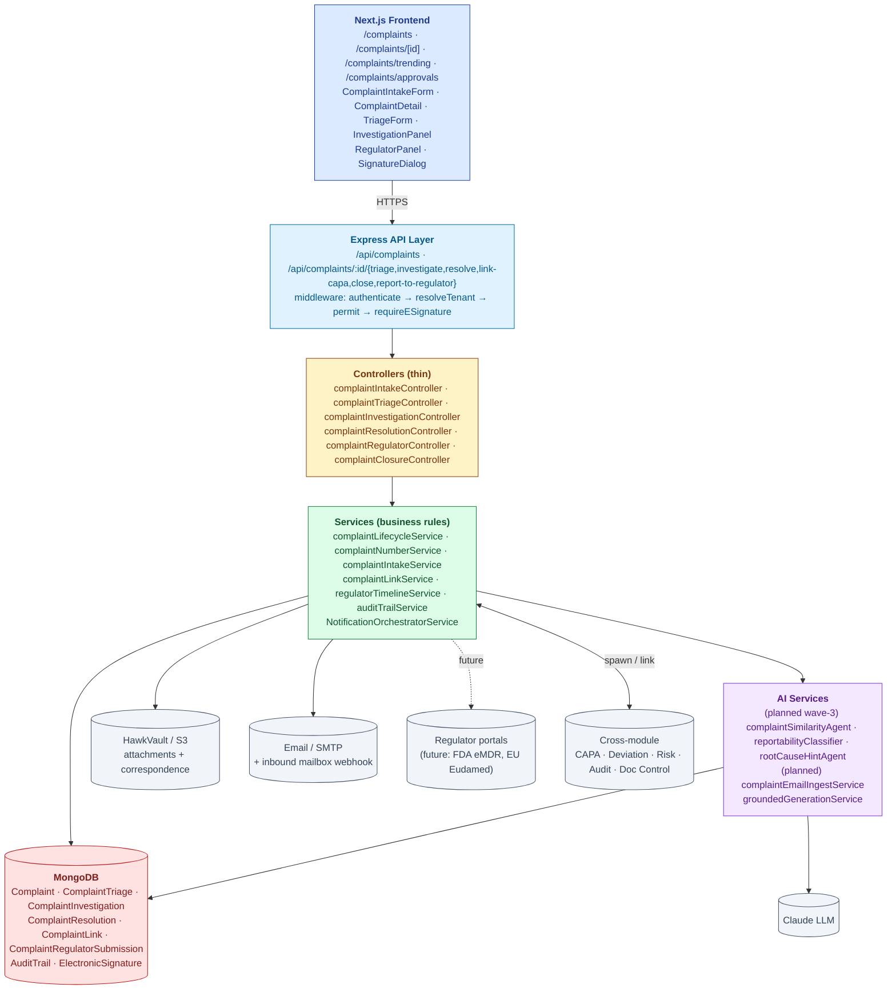
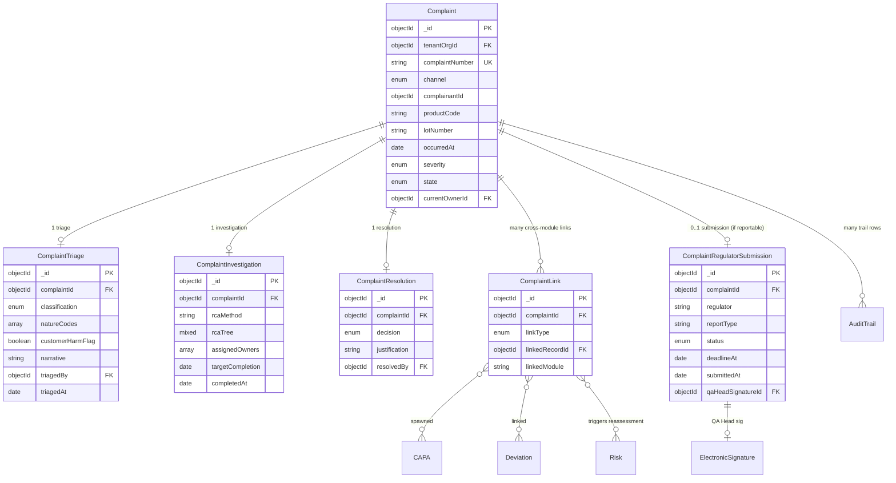
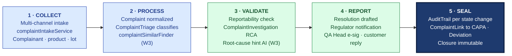

# ARCHITECTURE — Complaint Management

| Field | Value |
|---|---|
| Module | Complaint Management |
| Depth | Executive overview with code path links for detail |
| Pairs with | [URS.md](URS.md) (requirements), [DESIGN.md](DESIGN.md) (UX) |
| Last updated | 2026-06-01 |

---

## 1. System Context

**Tier ownership:**
- **Frontend** owns: rendering, role-aware UI, cockpit single-pane UX, e-sig modal
- **API + middleware** owns: auth, tenant scoping, RBAC, e-sig enforcement
- **Controllers** own: route dispatch (thin)
- **Services** own: lifecycle rules, classification routing, regulator timeline calculation, AI orchestration, cross-module spawning
- **Models** own: schema, indexes
- **External systems** own: file storage (S3), email (SMTP + inbound webhook), regulator portals (future), inference (Claude)

---

## 2. Data Model

### Primary entities

| Model | Purpose | Key fields | References |
|---|---|---|---|
| **Complaint** | Aggregate root | `complaintNumber` (unique per tenant), `channel`, `complainantId`, `productCode`, `lotNumber`, `occurredAt`, `severity`, `state`, `currentOwnerId` | `tenantOrgId`, `users` |
| **ComplaintTriage** | Classification snapshot | `complaintId`, `classification` (Reportable/Non-reportable/CS-only), `natureCodes[]`, `customerHarmFlag`, `narrative`, `triagedBy`, `triagedAt` | `Complaint`, `users` |
| **ComplaintInvestigation** | RCA + assignment | `complaintId`, `rcaMethod`, `rcaTree`, `assignedOwners[]`, `targetCompletion`, `completedAt` | `Complaint`, `users` |
| **ComplaintResolution** | Decision + justification | `complaintId`, `decision`, `justification`, `resolvedBy` | `Complaint`, `users` |
| **ComplaintLink** | Cross-module reference | `complaintId`, `linkType` (CAPA / Deviation / Risk / Audit / Doc), `linkedRecordId`, `linkedModule` | `Complaint`, cross-module records |
| **ComplaintRegulatorSubmission** | Regulator notification (reportable) | `complaintId`, `regulator`, `reportType` (MDR/MIR/etc.), `status`, `deadlineAt`, `submittedAt`, `qaHeadSignatureId` | `Complaint`, `ElectronicSignature` |
| **AuditTrail** (cross-module) | 21 CFR Part 11 log | shared | — |
| **ElectronicSignature** | Part 11 e-sig records | shared | — |

### Indexes (key)

- `Complaint`: `(tenantOrgId, complaintNumber)` unique, `(tenantOrgId, state)`, `(tenantOrgId, productCode)`, `(tenantOrgId, occurredAt)`
- `ComplaintTriage`: `(complaintId)` unique
- `ComplaintLink`: `(complaintId)`, `(linkedModule, linkedRecordId)` for reverse-lookup
- `ComplaintRegulatorSubmission`: `(complaintId)` unique, `(deadlineAt)` for countdown sweeps
- `AuditTrail`: `(tenantId, entityType='complaint', entityId)` for cross-module trail browser

---

## 3. API Contract Catalog (grouped)

All paths require `authenticate` middleware unless noted; RBAC enforced by `permit(...roles)`.

### Complaint lifecycle

| Group | Endpoints | Primary roles | Notes |
|---|---|---|---|
| List + read | `GET /api/complaints`, `GET /api/complaints/:id` | role-scoped | Tenant-scoped query |
| Create | `POST /api/complaints` | cs_rep, qa, tenant_admin | Generates `complaintNumber` |
| Update intake | `PATCH /api/complaints/:id` | cs_rep, qa | Allowed pre-triage |
| Triage | `POST /api/complaints/:id/triage` | qa, qa_head | Sets classification + severity |
| Re-triage | `PATCH /api/complaints/:id/triage` | qa, qa_head, tenant_admin | With reasonForChange |
| Investigate | `POST /api/complaints/:id/investigate` | qa, production_owner | Update RCA, assign owners |
| Resolve | `POST /api/complaints/:id/resolve` | qa | Resolution decision + justification |
| Link CAPA | `POST /api/complaints/:id/link-capa` | qa | Spawns CAPA record via CAPA module |
| Link Deviation | `POST /api/complaints/:id/link-deviation` | qa | Links existing or creates deviation |
| Close | `POST /api/complaints/:id/close` | qa | Final closure with justification |

### Regulator path (reportable)

| Endpoint | Role | Purpose |
|---|---|---|
| `POST /api/complaints/:id/report-to-regulator/draft` | reg_affairs | Draft notification (MDR / MIR / etc.) |
| `POST /api/complaints/:id/report-to-regulator/submit` (e-sig) | reg_affairs | Submit (requires QA Head e-sig) |
| `POST /api/complaints/:id/report-to-regulator/approve` (e-sig) | qa_head | E-sign APPROVED |
| `PATCH /api/complaints/:id/report-to-regulator/ack` | reg_affairs | Record regulator ack |

### Trending + AI (wave-3)

| Endpoint | Role | Purpose |
|---|---|---|
| `GET /api/complaints/trending` | qa, qa_head | Per-product trending dashboard data |
| `POST /api/complaints/:id/ai/similar` | qa | Similarity finder (planned) |
| `POST /api/complaints/:id/ai/reportability` | qa | Reportability classifier (planned) |
| `POST /api/complaints/:id/ai/rca-hints` | qa | RCA hint generator (planned) |

### Audit trail

| Endpoint | Role | Purpose |
|---|---|---|
| `GET /api/complaints/:id/audit-trail` | all | Per-complaint trail |
| `GET /api/audit-trail/by-entity?entityType=complaint&entityId=...` | all (tenant-scoped) | Cross-module trail |

---

## 4. RBAC Matrix

| Capability | CS Rep | QA Investigator | Production Owner | Reg Affairs | QA Head | Tenant Admin | Superadmin |
|---|---|---|---|---|---|---|---|
| Create complaint (intake) | ✅ | ✅ | — | — | — | ✅ | ✅ |
| Edit intake (pre-triage) | ✅ | ✅ | — | — | — | ✅ | ✅ |
| List complaints | ✅ | ✅ | ✅ (assigned) | ✅ (reportable) | ✅ | ✅ | ✅ |
| Triage / classify | — | ✅ | — | — | ✅ | ✅ | ✅ |
| Investigate | — | ✅ | ✅ | — | ✅ | ✅ | ✅ |
| Resolve | — | ✅ | — | — | ✅ | ✅ | ✅ |
| Link CAPA / Deviation | — | ✅ | — | — | ✅ | ✅ | ✅ |
| Close | — | ✅ | — | — | ✅ | ✅ | ✅ |
| Draft regulator notification | — | — | — | ✅ | ✅ | ✅ | ✅ |
| Sign APPROVED (regulator notification) | — | — | — | — | ✅ | — | — |
| Submit to regulator | — | — | — | ✅ | ✅ | ✅ | ✅ |
| Read audit trail | ✅ | ✅ | ✅ | ✅ | ✅ | ✅ | ✅ |

**Cross-tenant guards:** all complaint queries gated by `buildComplaintTenantScopeQuery()` (tenant_orgId filter).

---

## 5. AI Capabilities

All AI is grounded (citations + confidence floor + manual fallback) and audit-trailed (`recordAiDecision`). Per URS §A2/A3 and Part B differentiators.

### AI tools wired (or planned) into Complaint Management

| Tool | Type | Read/Write | E-sig | Where used | Status |
|---|---|---|---|---|---|
| **complaintSimilarityAgent** | Vector retrieval over historical complaints | READ | NO | TriageForm `SimilarComplaintsPanel` | ⏳ planned wave-3 |
| **reportabilityClassifier** | Classification w/ citations to 21 CFR 803 / EU MDR | READ | NO | TriageForm `ReportabilityAiPanel` | ⏳ planned wave-3 |
| **rootCauseHintAgent** | 5-Why starting points | READ | NO | InvestigationPanel `RcaAiHintPanel` | ⏳ planned wave-3 |
| **complaintEmailIngestService** | Inbound email → structured intake | WRITE (creates draft Complaint) | NO | Mailbox webhook handler | ⏳ planned (URS-B-008) |

### Grounding posture

Every LLM call routes through `groundedGenerationService.js`:
1. **Structured output** — JSON schema validation
2. **Citations required** — for reportability classifier (citations to 21 CFR 803 articles)
3. **Confidence floor** — minConfidence 0.65 for reportability (high-risk decision)
4. **PII redaction** — customer name/email/phone redacted before LLM call, unredacted on receipt
5. **AuditTrail row** — `recordAiDecision()` writes feature, modelVersion, promptHash, retrievalSet, confidence, tokens, latency
6. **Human-in-loop** — AI never auto-classifies; always presents suggestion for QA Investigator to accept/reject

### User-disposition feedback (active learning)

After every AI suggestion, the UI calls `POST /api/ai/decisions/outcome` with one of: `USER_ACCEPTED` / `USER_EDITED` / `USER_REJECTED`. Feeds the active-learning loop. Particularly important for reportability classifier — labelled true/false from final QA Head decision flows back as training signal.

---

## 6. State Machine Implementation

Cross-reference [DESIGN §4](DESIGN.md#4-state-machine-complaint-lifecycle).

**Enforcement layer:**
- **Definition:** `backend/src/constants/complaintStates.js` (enum)
- **Validation:** `services/complaintLifecycleService.js → canTransition()` — checks classification set, e-sig presence for SUBMITTED, justification length for CLOSED
- **Application:** `services/complaintLifecycleService.js → applyTransition()` — mutates `state`, writes AuditTrail row
- **Cross-module spawning:** `services/complaintLinkService.js` — calls CAPA module's API to create linked CAPA; rollback on failure

**Gate enforcement:**
- **G-INTAKE / G-TRIAGE / G-CLOSE** — field-level validation in controllers
- **G-REG (QA Head e-sig)** — `middlewares/requireESignature.js` accepts `electronicSignatureId` (pre-signed) OR inline `signaturePassword`; meaning=APPROVED
- **G-CAPA** — atomic spawn: complaint state advances to CAPA_LINK only after CAPA module confirms creation; if CAPA creation fails, complaint stays in RESOLUTION

**Regulator timeline:**
- `regulatorTimelineService.calculateDeadline(reportType, occurredAt, jurisdiction)` computes deadline (e.g., MDR serious-injury: 30 calendar days)
- Scheduled sweep job notifies T-7, T-3, T-1 via NotificationOrchestratorService

---

## 7. Compliance Traceability

| Feature | 21 CFR 820.198 (MDR) | 21 CFR 803 (eMDR) | ICH Q10 | EU GMP Ch.8 | ISO 13485 |
|---|---|---|---|---|---|
| Multi-channel intake | (a) | — | §3.2.1 | §8.30 | §8.2.2 |
| Triage + classification | (c) | §803.20 | §3.2.1 | §8.30 | §8.2.2 |
| Trending detection | **(e)** trending | — | §3.2.1 | §8.32 | §8.2.2 |
| Investigation | (c) | — | §3.2.1 | §8.32 | §8.2.2 |
| RCA structured capture | (c) | — | §3.2.1 | §8.32 | §8.5.2 |
| CAPA linkage | — | — | §3.2.2 | §8.32 | §8.5.2 |
| Reportable notification + e-sig | — | **§803.20 + §803.50** | — | — | §8.2.3 |
| Regulator submission timeline | — | **§803.20 timelines** | — | — | §8.2.3 |
| Audit trail (cross-module) | — | — | — | §8.32 | §4.2.5 |
| RBAC + tenant isolation | (a) records control | §803.18 | — | §12 personnel | §4.1 |
| AI decision audit trail (reproducibility) | — | — | — | §6 risk-based | §4.1.6 |

---

## 8. Operational Concerns

### Performance / scale targets
- Complaint list: < 500 ms for 10k complaints per tenant
- Trending dashboard: < 1.5 sec for per-product roll-up
- AI similarity finder: < 3 sec p95 (vector lookup + LLM rerank)
- AI reportability classifier: < 5 sec p95
- Regulator deadline sweep: hourly cron

### Failure modes + recovery
- **LLM provider down** → AI panels show "AI unavailable, classify manually"; lifecycle unaffected
- **CAPA spawn fails (cross-module)** → complaint stays in RESOLUTION; retry surfaced; AuditTrail row `CAPA_SPAWN_FAILED`
- **Regulator submission fails (when API integration arrives)** → submission status=DRAFT; retry queue; escalation to QA Head
- **E-sig password mismatch (QA Head approval)** → no state change; AuditTrail row `SIGNATURE_FAILED`; user retries
- **Inbound email parse failure** → falls back to raw-text intake; original email attached
- **DB write failure mid-transition** → state reverts; AuditTrail row marked FAILED
- **Cross-tenant query leak** (theoretical) → defense-in-depth: route-level RBAC + service-level tenant scope query

### Observability
- Per-tenant metrics: open complaints, mean-time-to-resolution, reportable-rate %, regulator-on-time-submission %, AI acceptance rate
- Trending dashboard surfaces emerging patterns (>2σ above baseline planned)
- Audit trail itself is the regulatory observability layer

---

## 9. Known Gaps + Engineering Debt

1. **Email ingestion pipeline (URS-B-008)** — design only; needs mailbox webhook + AI extractor (planned)
2. **AI similarity / reportability / RCA-hint agents (URS-B-001/2/3)** — planned wave-3; not yet implemented
3. **Regulator portal integration** (FDA eMDR API, EU Eudamed) — design only; currently manual submission with status tracking
4. **Trending auto-flag** (>2σ) — current trending widget shows charts; auto-flag + alert planned
5. **Customer-facing portal** — out-of-scope; planned as separate module
6. **Multi-jurisdiction reporting** — single-jurisdiction per complaint today; multi-jurisdiction parallel submissions needs design
7. **Cross-tenant complaint sharing** (industry-wide trending) — pure infosec gap; not on roadmap
8. **PII auto-redaction in attachments** — opt-in only; OCR redaction job not wired

---

## 10. Open Engineering Questions

1. **Vector DB for similarity** — Mongo-cosine vs pgvector vs dedicated vector store? Same question as Audit module.
2. **Regulator portal first integration** — FDA eMDR (highest volume) vs EU Eudamed (mandated 2026 for MDR)?
3. **Email ingestion provider** — Gmail API, IMAP, M365 Graph, or all three?
4. **Active learning auto-tuning** — when do we A/B-test prompt variants for reportability classifier?
5. **Multi-region deployment** — for EU MDR submission residency, do we need EU-region DB?
6. **Closure-CAPA dependency** — tenant config for "wait for CAPA closure" vs "close independently"?
7. **Trending dashboard depth** — per-product per-week vs per-product per-lot? Storage trade-off.

---

## 11. Code Path Index (Architecture ↔ Source)

| Architectural concern | Primary code path |
|---|---|
| Routes | `backend/src/routes/complaint*.js` |
| Controllers | `backend/src/controllers/complaint*.js` |
| Services | `backend/src/services/complaint*.js`, `services/regulatorTimelineService.js` |
| AI services (planned) | `backend/src/services/ai/complaintSimilarityAgent.js`, `reportabilityClassifier.js`, `rootCauseHintAgent.js`, `complaintEmailIngestService.js` |
| Models | `backend/src/models/{Complaint,ComplaintTriage,ComplaintInvestigation,ComplaintResolution,ComplaintLink,ComplaintRegulatorSubmission}.js` |
| Middlewares | `backend/src/middlewares/{authMiddleware,roleMiddleware,tenantMiddleware,requireESignature}.js` |
| Constants | `backend/src/constants/complaintStates.js`, `complaintNatureCodes.js` |
| Audit trail | `backend/src/services/auditTrailService.js`, `models/AuditTrail.js` |
| AI grounding | `backend/src/services/groundedGenerationService.js`, `services/ai/audit-trail/recordAiDecision.js` |
| Frontend pages | `frontend/app/(console)/complaints/**` |
| Frontend components | `frontend/components/complaints/`, `frontend/components/eqms/SignatureDialog.tsx` |
| Frontend hooks | `frontend/hooks/useComplaints.ts`, `hooks/useComplaintTrending.ts` |

---

## 12. The Five-Pillar Walkthrough

Complaint Management is the platform's primary inbound voice-of-customer engine, and it walks Hawkeye's universal pipeline end to end. **COLLECT** opens the funnel: complaints arrive via web form, phone, or (planned) inbound email webhook, with `complaintIntakeService` capturing complainant identity, product code, lot number, and free-text narrative, while attachments stream to HawkVault. **PROCESS** normalizes the raw intake into a `Complaint` aggregate plus a `ComplaintTriage` sub-document — classification (Reportable · Non-reportable · Customer-service-only), nature codes, and severity — with the planned `complaintSimilarFinder` linking related historical complaints. **VALIDATE** runs the reportability assessment against jurisdiction rules (21 CFR 803, EU MDR), drives the `ComplaintInvestigation` RCA workflow, and (in Wave-3) feeds AI root-cause hints; failures here keep the complaint in RESOLUTION pending evidence. **REPORT** drafts the customer resolution and — when reportable — generates the regulator notification packet behind a mandatory QA Head e-signature (meaning=APPROVED) before submission. **SEAL** writes an `AuditTrail` row on every state change and on closure spawns the cross-module `ComplaintLink` records (CAPA, Deviation) that propagate the signal outward.

### Cross-module spawn notes

- **SPAWNS CAPA** (frequent) — `complaintLinkService` creates a linked CAPA on closure when systemic action is required; atomic — complaint stays in RESOLUTION if CAPA creation fails
- **LINKS Deviation** — when investigation traces the complaint to a production deviation; bidirectional `ComplaintLink` plus reciprocal link from the Deviation side
- **TRIGGERS Change Control** — when the root cause requires a process or document change; spawned via the Change Control module's spawn API
- **TRIGGERS Risk reassessment** — every reportable complaint posts to `POST /api/risks/cross-module/trigger` so the linked product/process risk is re-scored
- **FEEDS MRM** — complaint trending counts and reportable-rate % flow into the Management Review dashboard

### Code-path table

| Pillar | Code path | What it does |
|---|---|---|
| 1 · COLLECT | `backend/src/services/complaintIntakeService.js`, `controllers/complaintIntakeController.js`, `services/ai/complaintEmailIngestService.js` (planned) | Multi-channel intake; generates `complaintNumber`; persists attachments to HawkVault |
| 2 · PROCESS | `services/complaintLifecycleService.js`, `controllers/complaintTriageController.js`, `services/ai/complaintSimilarityAgent.js` (W3) | Normalizes Complaint, writes ComplaintTriage, finds related historical complaints |
| 3 · VALIDATE | `services/ai/reportabilityClassifier.js` (W3), `controllers/complaintInvestigationController.js`, `services/regulatorTimelineService.js` | Reportability classification with citations; RCA workflow; jurisdiction-aware deadline calc |
| 4 · REPORT | `controllers/complaintResolutionController.js`, `controllers/complaintRegulatorController.js`, `middlewares/requireESignature.js` | Drafts resolution + regulator notification; enforces QA Head e-sig meaning=APPROVED |
| 5 · SEAL | `services/auditTrailService.js`, `services/complaintLinkService.js`, `models/AuditTrail.js`, `models/ComplaintLink.js` | Writes Part 11 audit row per transition; spawns cross-module links on closure |

