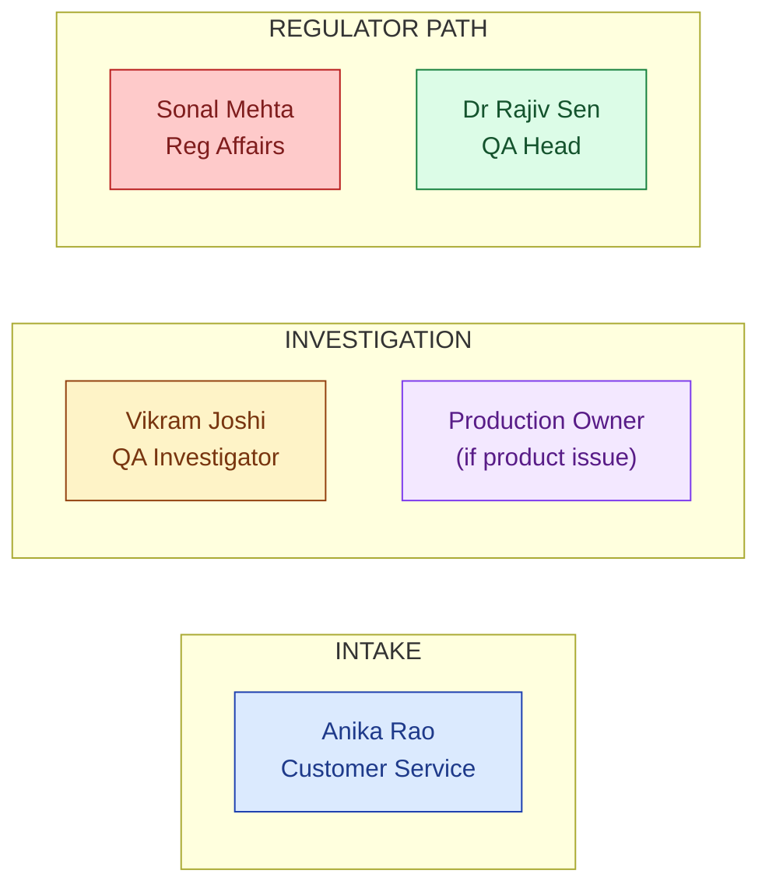
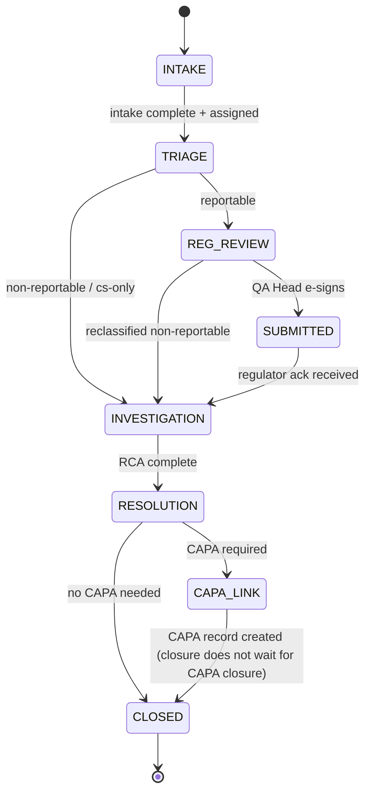

# DESIGN — Complaint Management

| Field | Value |
|---|---|
| Module | Complaint Management |
| Depth | Executive overview (with pointers to code for detail) |
| Pairs with | [URS.md](URS.md) (requirements), [ARCHITECTURE.md](ARCHITECTURE.md) (technical) |
| Last updated | 2026-06-01 |

---

## 1. Personas (5 primary, 1 secondary)

Cross-reference [URS §2](URS.md#2-stakeholders-and-personas).



| # | Persona | Primary actions | Decisions |
|---|---|---|---|
| 1 | **Customer Service Rep (Anika)** | Intake from email/phone/web, assign to triage | Initial channel + completeness |
| 2 | **QA Investigator (Vikram)** | Triage, classify, investigate, decide resolution | Reportable y/n, RCA, resolution path |
| 3 | **Production Owner** | Investigate production-side root cause when relevant | Manufacturing RCA |
| 4 | **Reg Affairs (Sonal)** | Draft regulator notification, track timeline | Submission content + timing |
| 5 | **QA Head (Dr Sen)** | E-sign regulator notification approval | Approve/reject submission |
| 6 | **Customer** (secondary) | (future) view status, satisfaction rating | — |

---

## 2. End-to-End Journey (lifecycle, 5 personas)

```mermaid
flowchart LR
    classDef cs fill:#dbeafe,stroke:#1e40af,color:#1e3a8a
    classDef qa fill:#fef3c7,stroke:#92400e,color:#78350f
    classDef reg fill:#fecaca,stroke:#b91c1c,color:#7f1d1d
    classDef head fill:#dcfce7,stroke:#15803d,color:#14532d
    classDef sys fill:#f1f5f9,stroke:#475569,color:#334155

    INTAKE["1. INTAKE<br/><i>CS Rep</i>"]:::cs
    TRIAGE["2. TRIAGE<br/><i>QA Investigator</i>"]:::qa
    INV["3. INVESTIGATION<br/><i>QA + Production</i>"]:::qa
    RES["4. RESOLUTION<br/><i>QA Investigator</i>"]:::qa
    LINK["5. CAPA_LINK<br/>(if needed)<br/><i>system</i>"]:::sys
    REG["5b. REG NOTIFY<br/>(if reportable)<br/><i>Reg + QA Head</i>"]:::reg
    CLOSE["6. CLOSURE<br/><i>QA Investigator</i>"]:::qa

    INTAKE -->|complaint logged| TRIAGE
    TRIAGE -->|non-reportable / cs-only| INV
    TRIAGE -->|reportable| REG
    REG -->|QA Head e-signs + submitted| INV
    INV -->|RCA complete| RES
    RES -->|CAPA needed| LINK
    RES -->|no CAPA| CLOSE
    LINK -->|CAPA created| CLOSE
```



### Journey snapshots per persona

#### CS Rep (Anika)

```
1. Inbox                 → /complaints                       ComplaintList (filter by status)
2. New complaint         → /complaints/new                   ComplaintIntakeForm (channel, product, narrative, attachments)
3. Assign to triage      → same (auto-route)                 RoutingRules engine assigns owner
4. Send ack email        → /complaints/[id]                  AckEmailButton (template)
```

#### QA Investigator (Vikram)

```
1. Triage queue          → /complaints?status=triage         ComplaintList (sorted by severity + age)
2. Open complaint        → /complaints/[id]                  ComplaintDetail (cockpit URS-B-005)
3. Review similar (AI)   → /complaints/[id]/triage           SimilarComplaintsPanel (wave-3)
4. Classify              → /complaints/[id]/triage           TriageForm (Reportable / Non-rep / CS-only)
5. Investigate           → /complaints/[id]/investigation    InvestigationPanel (RCA form, batch link, attachments)
6. Resolve               → /complaints/[id]/resolve          ResolutionDialog (decision tree)
7. Link CAPA             → same                              LinkCapaDialog (creates CAPA record)
8. Close                 → /complaints/[id]/closure          ClosureDialog (justification + comms record)
```

#### Reg Affairs (Sonal)

```
1. Reportable queue      → /complaints?reportable=true       ComplaintList (with deadline countdown)
2. Open complaint        → /complaints/[id]/regulator        RegulatorPanel
3. Draft notification    → same                              MDRDraftForm / VigilanceDraftForm (templated)
4. Send for approval     → same                              QA Head notification + e-sig request
5. Submit to regulator   → same                              SubmitButton (after QA Head e-signs)
6. Track ack             → /complaints/[id]/regulator        SubmissionStatusBoard
```

#### QA Head (Dr Sen)

```
1. Approval inbox        → /complaints/approvals             ApprovalQueue
2. Open notification     → /complaints/[id]/regulator        Read draft + investigation
3. Sign or reject        → same                              SignatureDialog (signatureMeaning=APPROVED)
```

---

## 3. Screen + Component Inventory

Pages under `frontend/app/(console)/complaints/`.

### Common pages
| Route | Purpose | Key components |
|---|---|---|
| `/complaints` | List (filter by status/severity/product/owner) | `ComplaintList`, `ComplaintFilterBar` |
| `/complaints/new` | Intake form | `ComplaintIntakeForm`, attachment uploader |
| `/complaints/[id]` | Cockpit (single-pane URS-B-005) | `ComplaintDetail`, `TimelineSidebar`, `LinkedRecordsTab` |
| `/complaints/[id]/triage` | Triage classification | `TriageForm`, `SimilarComplaintsPanel` (planned), `ReportabilityAiPanel` (planned) |
| `/complaints/[id]/investigation` | Investigation + RCA | `InvestigationPanel`, `RcaForm`, `RcaAiHintPanel` (planned) |
| `/complaints/[id]/resolve` | Resolution decision | `ResolutionDialog`, `LinkCapaDialog`, `LinkDeviationDialog` |
| `/complaints/[id]/regulator` | Regulator notification path | `RegulatorPanel`, `MDRDraftForm`, `VigilanceDraftForm`, `SubmissionStatusBoard`, `SignatureDialog` |
| `/complaints/[id]/closure` | Final closure | `ClosureDialog`, `CommsLog` |
| `/complaints/[id]/audit-log` | Audit trail | `AuditLogTable` |
| `/complaints/approvals` | QA Head approval inbox | `ApprovalQueue` |
| `/complaints/trending` | Per-product trending dashboard | `TrendingDashboard`, severity-weighted charts |

### Cross-cutting components
- `SignatureDialog` — Part 11 ceremony (reused)
- `ComplaintDetail` — single-pane cockpit
- `SimilarComplaintsPanel` (planned wave-3) — AI similarity finder
- `ReportabilityAiPanel` (planned) — AI reportability suggestion with citations
- `RcaAiHintPanel` (planned) — AI 5-Why starting points
- `RegulatorTimelineCountdown` — deadline countdown with escalation pills
- `LinkedRecordsTab` — cross-module linkage (CAPA, Deviation, Risk, Audit)

---

## 4. State Machine (Complaint Lifecycle)



**State ownership:**

| State | Owner | What happens |
|---|---|---|
| INTAKE | CS Rep | Complaint logged, ack sent, routed |
| TRIAGE | QA Investigator | Classification (Reportable / Non-rep / CS-only) |
| REG_REVIEW | Reg Affairs | Notification drafted |
| SUBMITTED | Reg Affairs | Sent to regulator; awaiting ack |
| INVESTIGATION | QA + Production | RCA, evidence, cross-functional |
| RESOLUTION | QA Investigator | Decision tree (CAPA / no CAPA / etc.) |
| CAPA_LINK | (system) | CAPA record spawned |
| CLOSED | QA Investigator | Closure justified + comms recorded |

**Transition rules** (enforced in `complaintLifecycleService`):
- Forward-only by default; triage reclassification is its own audited path
- Block triggers: missing severity (blocks TRIAGE exit), no resolution decision (blocks RESOLUTION exit), no QA Head e-sig (blocks SUBMITTED for reportable)
- Revert allowed only by tenant_admin/superadmin with reasonForChange logged
- Every transition writes an AuditTrail row

### Decision gates

| Gate | Phase | Trigger | Enforcer | Audit-trail entry |
|---|---|---|---|---|
| **G-INTAKE** Completeness | INTAKE exit | Required fields present | `complaintIntakeController` | `COMPLAINT_LOGGED` |
| **G-TRIAGE** Classification | TRIAGE exit | Severity + reportability set | `complaintTriageController` | `TRIAGED` (with classification) |
| **G-REG** QA Head e-sig | SUBMITTED entry | QA Head signs APPROVED | `requireESignature` middleware | `SIGNED` action, meaning=APPROVED |
| **G-CAPA** CAPA link | CAPA_LINK | Resolution=CAPA → spawn CAPA | `complaintLinkService` + CAPA module | `CAPA_SPAWNED` (linked CAPA ID) |
| **G-CLOSE** Justification | CLOSED entry | Closure justification ≥50 chars | `complaintClosureController` | `CLOSED` (with justification) |

---

## 5. Notifications and Reminders

| Event | Recipients | Channel |
|---|---|---|
| Complaint logged | Triage owner (default routing) | Email + dashboard |
| Triage assigned | Assigned QA Investigator | Email |
| Reportable classification | Reg Affairs + QA Head | Email + escalation |
| Regulator deadline T-7 / T-3 / T-1 | Reg Affairs + QA Head | Email + dashboard banner |
| Investigation overdue | Investigator + manager | Email + escalation |
| QA Head approval pending | QA Head | Email |
| Regulator ack received | Reg Affairs | Email |
| CAPA spawned | CAPA owner + investigator | Cross-module notification |
| Customer ack/closure | Complainant (if email known) | Email |

---

## 6. Error and Edge Cases

| Scenario | Handling |
|---|---|
| **No required intake fields** | Form-level validation blocks submit |
| **Triage reclassified Reportable → Non-reportable mid-flight** | Allowed with reasonForChange; regulator submission cancelled if not yet sent; full audit trail |
| **QA Head rejects regulator notification** | State returns to REG_REVIEW with rejection comment; Reg Affairs redrafts |
| **Regulator deadline passed without submission** | Escalation to VP Quality + tenant_admin; flag persists |
| **AI similarity finder returns no matches** | Panel shows "No similar complaints found in history" |
| **AI reportability classifier low confidence** | UI shows suggestion + "Confidence too low — verify manually" |
| **CAPA spawn fails** | Complaint stays in CAPA_LINK; retry option surfaced |
| **Duplicate complaint detected (same complainant + product + week)** | Soft warning at intake; CS Rep decides log-as-new vs link-to-existing |
| **Email ingestion (when wired) fails to parse** | Falls back to raw-text intake with attachment of original email |

---

## 7. Accessibility

- **Keyboard nav:** all forms tab-traversable; RCA form supports keyboard-only entry incl. attachments
- **Screen reader:** ARIA labels on state pills, deadline countdowns, severity chips
- **Color contrast:** severity colors (Low gray / Medium amber / High orange / Critical red) meet WCAG AA; verified for color-blind users via shape + label, not color alone
- **Focus management:** SignatureDialog traps focus; closes return focus to trigger button
- **Open gaps:** Deadline countdown updates need ARIA live-region polish

---

## 8. Open Design Questions

1. **Single-pane cockpit density** — how much do we cram into `/complaints/[id]` before it overwhelms? Current tabs: Detail / Triage / Investigation / Resolution / Regulator / Closure / Audit Log.
2. **Similarity AI surfacing** — show top-3 similar with similarity score, or expandable list? Today: top-3 designed.
3. **Reportability AI** — show suggestion as separate panel vs inline pre-fill on TriageForm? Today: planned as suggestion panel (not auto-pre-fill).
4. **Trending dashboard severity weighting** — fixed weights (Critical=10, High=5, Medium=2, Low=1) or per-tenant?
5. **Regulator template per jurisdiction** — how many templates ship at launch (FDA MDR, EU MIR, Health Canada, MHRA)?
6. **Customer portal scope** — read-only status + satisfaction rating only? No re-submission?
7. **Closure waiting on CAPA** — current design closes complaint independently; tenant config to require CAPA-closed?
8. **PII handling in attachments** — auto-OCR-redact customer PII before LLM processing? Today: opt-in.
