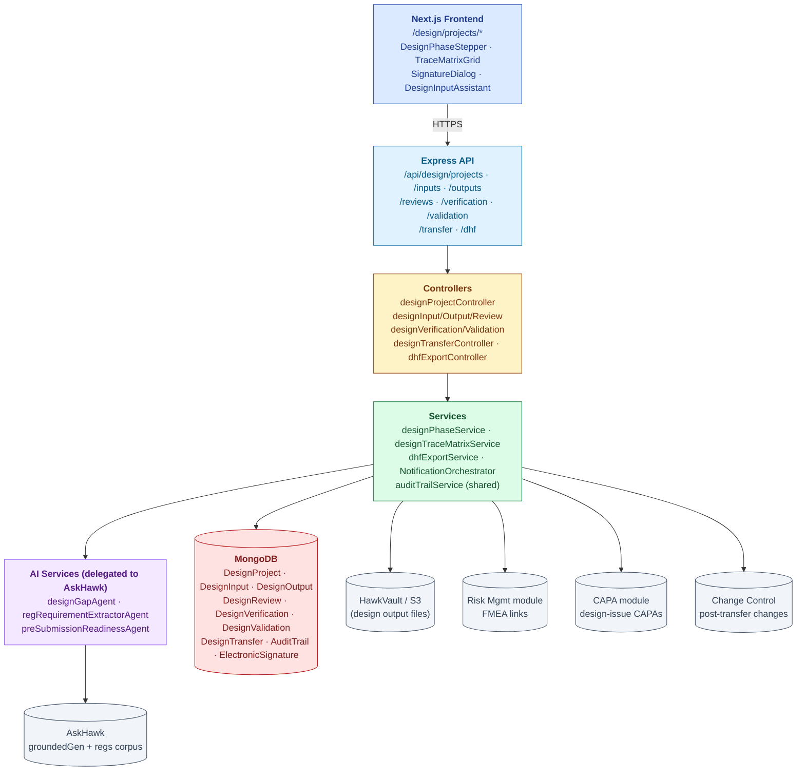
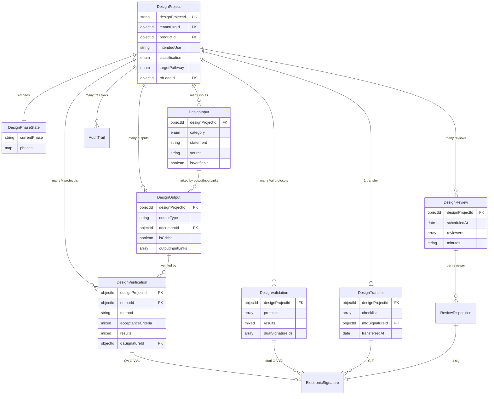
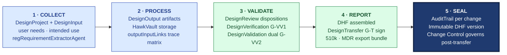

# ARCHITECTURE — Design Control

| Field | Value |
|---|---|
| Module | Design Control (med-device vertical pack) |
| Depth | Executive overview |
| Pairs with | [URS.md](URS.md), [DESIGN.md](DESIGN.md) |
| Last updated | 2026-06-01 |

---

## 1. System Context

**Tier ownership:**
- **Frontend** — phase stepper, trace-matrix grid, e-sig modal capture
- **API + middleware** — auth, RBAC, e-sig enforcement (`requireESignature`), independent-reviewer check
- **Controllers** — thin route dispatch
- **Services** — phase transitions, trace-matrix completeness, DHF export, notification orchestration
- **AI** — delegates to AskHawk's `groundedGenerationService` for input-gap and reg-requirement extraction
- **Cross-module** — Risk (FMEA), CAPA (design issues), Change Control (post-transfer), Document Control (file storage)

---

## 2. Data Model

### Primary entities

| Model | Purpose | Key fields |
|---|---|---|
| **DesignProject** | Aggregate root for a med-device design effort | `designProjectId`, `tenantOrgId`, `productId`, `intendedUse`, `classification` (I/II/III), `targetPathway` (510k/De Novo/PMA/MDR), `rdLeadId`, `phaseState` (embedded) |
| **DesignInput** | Single input statement | `designProjectId`, `category`, `statement`, `source`, `isVerifiable`, `priority` |
| **DesignOutput** | Single output artifact | `designProjectId`, `outputType` (drawing/spec/software/label/IFU/mfg-instruction), `documentId` (HawkVault), `isCritical`, `outputInputLinks[]` |
| **DesignReview** | Milestone review event | `designProjectId`, `scheduledAt`, `reviewers[]`, `minutes`, `actionItems[]`, `dispositions[]` |
| **DesignVerification** | V protocol + report | `designProjectId`, `outputId`, `method`, `acceptanceCriteria`, `results`, `qaSignatureId` |
| **DesignValidation** | Val protocol + report | `designProjectId`, `protocols[]`, `results`, `dualSignatureIds[]`, `usabilityEvidence` (IEC 62366) |
| **DesignTransfer** | Production handoff event | `designProjectId`, `checklist`, `mfgSignatureId`, `transferredAt` |
| **ReviewDisposition** | Per-reviewer sign | `reviewId`, `reviewerId`, `disposition` (APPROVED/APPROVED_W_ACTIONS/REJECTED), `signatureId` |
| **AuditTrail** (shared) | Cross-module 21 CFR Part 11 log | Standard fields + `entityType=DesignInput/Output/Review/...` |
| **ElectronicSignature** (shared) | Part 11 e-sig records | Reused across modules |

### Indexes

- `DesignProject`: `tenantOrgId`, `designProjectId` (unique)
- `DesignInput / DesignOutput`: `designProjectId`, `category`
- `DesignOutput.outputInputLinks`: multikey index — supports trace-matrix queries
- `AuditTrail`: cross-module; `(tenantId, designProjectId)` via `auditId` field

---

## 3. API Contract Catalog

All paths require `authenticate`; RBAC enforced by `permit(...roles)`.

### Project lifecycle
| Endpoint | Roles | Purpose |
|---|---|---|
| `GET /api/design/projects` | all design roles | List (tenant + role-scoped) |
| `POST /api/design/projects` | rd_lead, tenant_admin | Create project + charter |
| `GET /api/design/projects/:id` | all design roles | Project hub |
| `POST /api/design/projects/:id/phase/transition` | rd_lead, qa_reviewer | Forward transition |
| `POST /api/design/projects/:id/phase/revert` | rd_lead + qa_reviewer dual e-sig | Reverse |

### Inputs / Outputs
| Endpoint | Roles | Purpose |
|---|---|---|
| `GET/POST /api/design/projects/:id/inputs` | design_engineer, rd_lead | List/create |
| `POST /api/design/projects/:id/inputs/sign` | rd_lead (e-sig) | G-INP: approve input set |
| `GET/POST /api/design/projects/:id/outputs` | design_engineer | List/create |
| `POST /api/design/projects/:id/outputs/:outputId/link-inputs` | design_engineer | Link to inputs |
| `GET /api/design/projects/:id/trace-matrix` | all | Live completeness |

### Reviews
| Endpoint | Roles | Purpose |
|---|---|---|
| `GET/POST /api/design/projects/:id/reviews` | rd_lead | List/schedule |
| `POST /api/design/projects/:id/reviews/:rid/dispositions` | reviewers (e-sig) | Sign disposition |
| `POST /api/design/projects/:id/reviews/:rid/lock` | rd_lead | Lock minutes |

### V&V
| Endpoint | Roles | Purpose |
|---|---|---|
| `GET/POST /api/design/projects/:id/verification` | design_engineer, qa_reviewer | List/create protocols |
| `POST /api/design/projects/:id/verification/:vid/results` | design_engineer | Record results |
| `POST /api/design/projects/:id/verification/:vid/sign` | qa_reviewer (e-sig, independent) | **G-VV1** |
| `GET/POST /api/design/projects/:id/validation` | rd_lead, qa_reviewer | List/create |
| `POST /api/design/projects/:id/validation/:vid/sign` | rd_lead + qa_reviewer (dual e-sig) | **G-VV2** |

### Transfer + DHF
| Endpoint | Roles | Purpose |
|---|---|---|
| `POST /api/design/projects/:id/transfer` | rd_lead | Initiate transfer event |
| `POST /api/design/projects/:id/transfer/counter-sign` | mfg_eng (e-sig) | **G-T** |
| `GET /api/design/projects/:id/dhf` | all | DHF Index |
| `GET /api/design/projects/:id/dhf/readiness` | reg_affairs | Pre-submission gap report |
| `POST /api/design/projects/:id/dhf/export` | reg_affairs | Export 510k / MDR bundle |

### AI (delegated)
| Endpoint | Roles | Purpose |
|---|---|---|
| `POST /api/design/projects/:id/inputs/gap-analysis` | rd_lead, design_engineer | AskHawk-backed gap detection |
| `POST /api/design/regs/extract` | reg_affairs | Extract candidate inputs from a regulation |

---

## 4. RBAC Matrix

| Capability | Design Eng | RD Lead | QA Reviewer | Reg Affairs | Mfg Eng | Tenant Admin |
|---|---|---|---|---|---|---|
| Create project | — | ✅ | — | — | — | ✅ |
| Capture inputs | ✅ | ✅ | — | — | — | — |
| Sign inputs (G-INP) | — | ✅ | — | — | — | ✅ |
| Capture outputs / link | ✅ | ✅ | — | — | — | — |
| Schedule review | — | ✅ | — | — | — | ✅ |
| Sign review disposition | (if reviewer) | (chair) | (if reviewer) | (if reviewer) | (if reviewer) | — |
| Author V protocols | ✅ | ✅ | — | — | — | — |
| Sign G-VV1 (verification) | — | — | ✅ (independent) | — | — | — |
| Author Val protocols | ✅ | ✅ | — | — | — | — |
| Sign G-VV2 (dual) | — | ✅ | ✅ (independent) | — | — | — |
| Execute transfer | — | ✅ | — | — | — | ✅ |
| Counter-sign G-T | — | — | — | — | ✅ | — |
| DHF export | — | (read) | (read) | ✅ | — | ✅ |

**Independent-reviewer guard:** `designReviewerEligibilityService` rejects sign attempts where signer is in `project.teamMembers[]`.

**Cross-tenant guard:** `tenantOrgId` filter applied at query and at update time (defense-in-depth).

---

## 5. AI Capabilities

All AI delegates to AskHawk's `groundedGenerationService` (per [AI-ARCHITECTURE.md §3](../../04-engineering/07-ai/AI-ARCHITECTURE.md#3-the-grounded-generation-pattern-the-core-moat)).

| Tool | Type | R/W | E-sig | Where | Status |
|---|---|---|---|---|---|
| **designGapAgent** | Input-gap analysis | Read | No | `/inputs` page on-demand | ⏳ Planned |
| **regRequirementExtractorAgent** | Parse regulation → candidate inputs | Read | No | `/design/regs/extract` Reg Affairs tool | ⏳ Planned |
| **preSubmissionReadinessAgent** | DHF gap report vs target pathway | Read | No | `/dhf/readiness` | ⏳ Planned |

### Grounding posture
- Citations: mandatory (regulatory clauses + similar past projects)
- Confidence floor: 0.65 (higher than observation drafter — design inputs are bedrock)
- Skeleton fallback: returns category checklist + cited clauses; no fabricated inputs
- AuditTrail row per call via shared `recordAiDecision()`

---

## 6. State Machine Implementation

Cross-reference [DESIGN §4](DESIGN.md#4-state-machine-phase-lifecycle).

- **Definition:** `backend/src/constants/designPhases.js`
- **Validation:** `services/designPhaseService.js → canTransition()` — checks owner role, gate prerequisites, trace-matrix completeness for transfer, independent-reviewer constraint for V&V signs
- **Application:** `applyPhaseTransition()` mutates `phaseState`, writes AuditTrail
- **Gates:** all e-sig gates enforced via `requireESignature` middleware; independent-reviewer check is service-layer
- **No legacy bridge** (greenfield module — no `trackStatus` debt)

---

## 7. Compliance Traceability

| Feature | 21 CFR 820.30 | ISO 13485 §7.3 | EU MDR | FDA QMSR |
|---|---|---|---|---|
| Design planning | (a) | §7.3.2 | Annex II §6.1 | aligns 820.30 |
| Inputs | (c) | §7.3.3 | Annex I §1 | aligns 820.30 |
| Outputs | (d) | §7.3.4 | Annex II §6 | aligns 820.30 |
| Review | (e) | §7.3.5 | Annex II §6.2 | aligns 820.30 |
| Verification (G-VV1) | (f) | §7.3.6 | Annex I §5 + Annex II | aligns 820.30 |
| Validation (G-VV2) | (g) | §7.3.7 | Annex I §1 + §5, IEC 62366 | aligns 820.30 |
| Transfer (G-T) | (h) | §7.3.8 | Annex IX | aligns 820.30 |
| Changes | (i) | §7.3.9 | Annex IX §2.4 | aligns 820.30 |
| DHF | (j) | §7.3.10 | Annex II + III | aligns 820.30 |
| E-sig (all gates) | Part 11 §11.50/§11.200 | — | — | aligns Part 11 |
| Audit trail | Part 11 §11.10(e) | — | — | aligns Part 11 |

---

## 8. Operational Concerns

### Performance targets
- DesignProject list: < 500 ms for 100 projects per tenant
- Trace-matrix render: < 1 sec for 200 inputs × 400 outputs
- DHF export: < 60 sec for typical project (50-200 docs)
- AI gap analysis: < 5 sec p95

### Failure modes
- **HawkVault file missing on DHF export** → export aborts; row in AuditTrail with FAILED; user notified per-file
- **Independent reviewer constraint hit** → 403 with diagnostic envelope: "Signer is in project team; choose independent reviewer"
- **Phase transition with incomplete trace** → 422 with payload showing orphan IDs
- **AskHawk down (gap analysis)** → skeleton fallback returns category checklist
- **Dual-sig session timeout** → first signature persisted; second signer notified to complete; partial state visible

### Observability
- Per-project KPIs: completeness %, days-in-phase, gate-cycle-time, V&V failure rate
- Tenant KPIs: # projects, # transferred this Q, mean-time-to-transfer

---

## 9. Known Gaps + Engineering Debt

1. **Module is scaffold-stage** — most endpoints and UI under design; production rollout planned post med-device GTM. (URS marks ⏳ throughout.)
2. **AI agents not yet implemented** — `designGapAgent` and `regRequirementExtractorAgent` rely on AskHawk's groundedGen pipeline (live) but the domain prompts + retrieval-scope tuning is pending.
3. **Combination-product flow** (URS-B-004) — drug-device coordination with pharma stack is TBD.
4. **IEC 62304 software lifecycle** — handled as a documentation reference today; dedicated Software Design module is future.
5. **MDR vs 510k DHF export templates** — single template today; pathway-specific divergences not yet modeled.
6. **Trace-matrix scaling** — grid view degrades > 200×400; graph view candidate (URS open question).
7. **Cross-tenant pattern detection** (URS-B-005) — consent UI + privacy boundary not designed.
8. **Mobile V&V capture** — desktop-first today.

---

## 10. Open Engineering Questions

1. **State-machine library** — adopt XState for declarative phases, or continue ad-hoc?
2. **Trace-matrix storage** — denormalize completeness per save, or compute on read?
3. **DHF export format** — PDF binder vs hyperlinked HTML bundle vs eCTD-style folder structure for MDR?
4. **Reviewer pool selection** — should the picker prefer reviewers with relevant past projects (AI-assisted)?
5. **Cross-module Risk integration** — auto-pull FMEA top-N risks into Validation protocol scoping?
6. **Multi-region storage for EU MDR sovereignty** — EU customers may require EU-only data residency for design records?

---

## 11. Code Path Index (planned)

| Concern | Path |
|---|---|
| Routes | `backend/src/routes/design*.js` |
| Controllers | `backend/src/controllers/design*.js` |
| Services | `backend/src/services/{designPhaseService,designTraceMatrixService,dhfExportService}.js` |
| Models | `backend/src/models/Design{Project,Input,Output,Review,Verification,Validation,Transfer}.js` |
| Middlewares | `backend/src/middlewares/{requireESignature,designReviewerEligibility}.js` |
| Constants | `backend/src/constants/designPhases.js` |
| AI agents (delegate AskHawk) | `backend/src/services/ai/design/{gapAgent,regExtractorAgent,preSubmissionReadinessAgent}.js` |
| Frontend pages | `frontend/app/(console)/design/projects/**` |
| Frontend components | `frontend/components/design/{PhaseStepper,TraceMatrixGrid,InputAssistant,DhfIndex}.tsx` |
| Shared | `SignatureDialog`, `AuditLogTable`, `DocumentPicker`, `AskHawkDrawer` |

---

## 12. The Five-Pillar Walkthrough

Design Control is the long-horizon module of S.M.A.R.T. Hawk's med-device vertical pack — a single design project can run 12-36 months across multiple phases, and the five pillars walk repeatedly within each phase (Inputs → Outputs → V&V → Transfer). **Sense** happens when the R&D lead opens a `DesignProject` and the cross-functional team captures `DesignInput` records sourced from user needs, intended use, applicable standards, and regulatory requirements; the `regRequirementExtractorAgent` (planned) parses regulations into candidate inputs that the team curates. **Monitor** normalizes inputs against the `DesignInput` model, then design engineers produce `DesignOutput` artifacts (drawings, specs, software, labels, IFU, mfg instructions) stored in HawkVault and linked back to inputs via `outputInputLinks[]`. **Analyze** runs three independent checks: `DesignReview` events with multi-reviewer dispositions at each phase gate, `DesignVerification` protocols that prove outputs meet inputs (gated by independent QA e-sig, G-VV1), and `DesignValidation` protocols that prove the device meets user needs in real use (gated by dual R&D-Lead + QA e-sig, G-VV2). **Record** assembles the Design History File (DHF) as a hyperlinked binder of every input, output, review, V&V protocol, and `DesignTransfer` record — exportable as a 510(k) / De Novo / PMA / MDR submission packet. **Trace** writes an `AuditTrail` row per design change, review disposition, V&V signature, and transfer counter-sign; the DHF is immutable per project version, and post-transfer changes flow through Change Control with full traceability per 21 CFR 820.30(i).

### Cross-module spawn notes

- **TIGHTLY LINKED** to Document Control — every `DesignOutput.documentId` references a controlled document in HawkVault; DHF documents inherit doc-control versioning + approval state
- **SPAWNS** `CAPA` records when V&V failures, review-rejection dispositions, or post-transfer field issues surface design defects (via the CAPA module's create-from-design API)
- **TRIGGERS** Risk reassessment — design FMEA in the Risk Mgmt module is re-scored whenever a `DesignInput` is added/changed or a V&V protocol fails; high-priority risks feed back into Validation protocol scoping (open question #5)
- **TRIGGERS** Change Control for all post-transfer changes per 21 CFR 820.30(i) — once `DesignTransfer.transferredAt` is set, edits to inputs/outputs require an open `ChangeRequest`
- **CONSUMES** from AskHawk — `designGapAgent` and `preSubmissionReadinessAgent` ground on the regs corpus + similar past projects

### Code-path table

| Pillar | Code path | What it does |
|---|---|---|
| 1 · Sense | `backend/src/controllers/designProjectController.js` · `designInputController.js` · `models/DesignProject.js` · `DesignInput.js` | Creates project + captures inputs from user needs, intended use, regulatory requirements |
| 1 · Sense | `backend/src/services/ai/design/regExtractorAgent.js` (planned) | Parses regulation text into candidate `DesignInput` rows for team curation |
| 2 · Monitor | `backend/src/controllers/designOutputController.js` · `models/DesignOutput.js` · `services/designTraceMatrixService.js` | Captures outputs + maintains `outputInputLinks[]` trace matrix |
| 3 · Analyze | `backend/src/controllers/designReviewController.js` · `models/DesignReview.js` · `ReviewDisposition` | Multi-reviewer phase-gate reviews with per-reviewer e-sig dispositions |
| 3 · Analyze | `backend/src/controllers/designVerificationController.js` · `middlewares/requireESignature.js` · `designReviewerEligibilityService.js` | G-VV1 independent-QA e-sig on verification protocols |
| 3 · Analyze | `backend/src/controllers/designValidationController.js` (dual e-sig flow) | G-VV2 R&D-Lead + QA dual e-sig on validation protocols |
| 4 · Record | `backend/src/controllers/designTransferController.js` · `models/DesignTransfer.js` | G-T transfer event with Mfg Eng counter-sign |
| 4 · Record | `backend/src/controllers/dhfExportController.js` · `services/dhfExportService.js` | Assembles DHF bundle (510k · De Novo · PMA · MDR templates) |
| 5 · Trace | `backend/src/services/auditTrailService.js` (shared) | Per-change AuditTrail rows for design changes · reviews · V&V · transfer |
| 5 · Trace | `backend/src/services/designPhaseService.js → applyPhaseTransition()` | Phase-gate transitions enforce trace-matrix completeness + independent reviewer |
| 5 · Trace | Cross-module hooks into Change Control module | Post-transfer change governance per 21 CFR 820.30(i) |
