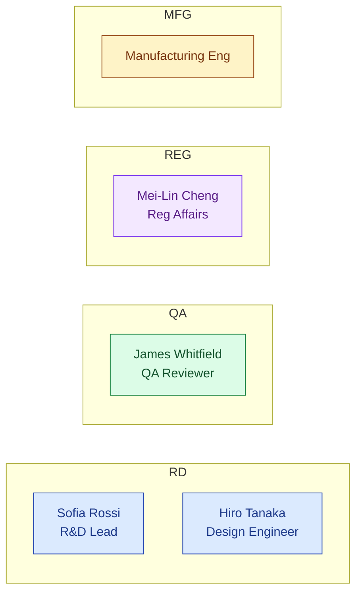
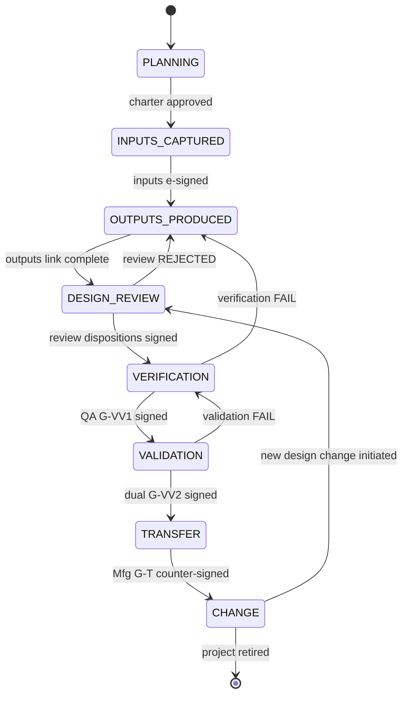

# DESIGN — Design Control

| Field | Value |
|---|---|
| Module | Design Control (med-device vertical pack) |
| Depth | Executive overview |
| Pairs with | [URS.md](URS.md), [ARCHITECTURE.md](ARCHITECTURE.md) |
| Last updated | 2026-06-01 |

---

## 1. Personas (5 primary, 1 secondary)

Cross-reference [URS §2](URS.md#2-stakeholders-and-personas). Design Control runs in a **3-lane swimlane**: R&D drives, QA gates, Reg Affairs exports.



| # | Persona | Lane | Primary actions | Decisions |
|---|---|---|---|---|
| 1 | **R&D Lead** (Sofia) | RD | Charter project, chair reviews, sign gates | Phase transitions, reviewer composition |
| 2 | **Design Engineer** (Hiro) | RD | Author inputs, outputs, V&V protocols + reports | Categorization, criticality, test method |
| 3 | **QA Reviewer — Design Control** (James) | QA | Independent gate signer (V&V, transfer) | Pass/fail on completeness + objectivity |
| 4 | **Regulatory Affairs** (Mei-Lin) | REG | DHF export, pathway alignment (510k / MDR) | Submission readiness |
| 5 | **Manufacturing Engineering** | MFG | Counter-sign transfer, validate production-readiness | Transfer acceptance |
| 6 | **Tenant Admin** | (platform) | Configure phase gates, reviewer matrix | Per-tenant config |

---

## 2. End-to-End Journey

```mermaid
flowchart LR
    classDef rd fill:#dbeafe,stroke:#1e40af,color:#1e3a8a
    classDef qa fill:#dcfce7,stroke:#15803d,color:#14532d
    classDef reg fill:#f3e8ff,stroke:#7c3aed,color:#581c87
    classDef mfg fill:#fef3c7,stroke:#92400e,color:#78350f

    PLAN["1. PLANNING<br/><i>RD Lead</i>"]:::rd
    INP["2. INPUTS<br/><i>Design Eng</i>"]:::rd
    OUT["3. OUTPUTS<br/><i>Design Eng</i>"]:::rd
    REV["4. REVIEW<br/><i>RD Lead</i>"]:::rd
    VER["5. VERIFICATION<br/><i>Design Eng + QA</i>"]:::qa
    VAL["6. VALIDATION<br/><i>RD Lead + QA</i>"]:::qa
    TRA["7. TRANSFER<br/><i>RD Lead + Mfg</i>"]:::mfg
    CHG["8. CHANGE<br/><i>RD Lead</i>"]:::rd

    PLAN -->|charter approved| INP
    INP -->|inputs approved e-sig| OUT
    OUT -->|outputs link to inputs| REV
    REV -->|dispositions signed| VER
    VER -->|QA G-VV1 e-sig| VAL
    VAL -->|dual G-VV2 e-sig| TRA
    TRA -->|Mfg counter-sign G-T| CHG
    CHG -.->|new change| REV
```



### Journey snapshots per persona

#### R&D Lead (Sofia)
```
1. Create DesignProject       → /design/projects (new)
2. Charter + classify         → /design/projects/[id]/charter
3. Chair design review        → /design/projects/[id]/reviews/[reviewId]
4. Sign validation (dual)     → /design/projects/[id]/validation     [G-VV2]
5. Execute transfer           → /design/projects/[id]/transfer       [G-T]
6. Initiate post-transfer chg → routed to Change Control module
```

#### Design Engineer (Hiro)
```
1. Capture inputs (per cat)   → /design/projects/[id]/inputs
2. Produce outputs            → /design/projects/[id]/outputs
3. Link outputs to inputs     → /design/projects/[id]/trace-matrix
4. Author verification protos → /design/projects/[id]/verification
5. Execute + record results   → same
```

#### QA Reviewer (James)
```
1. Inbox of pending gates     → /design/qa-inbox
2. Independent review         → /design/projects/[id]/verification (read + sign)
3. Sign verification (G-VV1)  → SignatureDialog (APPROVED)
4. Sign validation (G-VV2)    → SignatureDialog (APPROVED, dual)
```

#### Reg Affairs (Mei-Lin)
```
1. Open DHF Index             → /design/projects/[id]/dhf
2. Run pre-submission check   → /design/projects/[id]/dhf/readiness
3. Export DHF bundle          → "Export 510(k)" or "Export MDR Tech Doc"
```

---

## 3. Screen + Component Inventory

Pages live under `frontend/app/(console)/design/` (in scope; partial today).

| Route | Purpose | Key components |
|---|---|---|
| `/design/projects` | List of DesignProjects | `DesignProjectList`, status chips, classification badges |
| `/design/projects/[id]` | Project hub | `DesignPhaseStepper`, `DesignProjectTabs`, summary KPIs |
| `/design/projects/[id]/charter` | Project charter | classification picker, intended-use editor |
| `/design/projects/[id]/inputs` | Inputs by category | `DesignInputTable`, `DesignInputAssistant` (AI gap analysis) |
| `/design/projects/[id]/outputs` | Outputs + HawkVault links | `DesignOutputTable`, file picker |
| `/design/projects/[id]/trace-matrix` | Live trace matrix | `TraceMatrixGrid`, completeness % chip |
| `/design/projects/[id]/reviews` | Reviews list | `DesignReviewBoard`, disposition chips |
| `/design/projects/[id]/reviews/[reviewId]` | Single review | reviewer roster, action items, `SignatureDialog` |
| `/design/projects/[id]/verification` | V&V protocols + reports | `VerificationProtocolEditor`, result entry, sig gate |
| `/design/projects/[id]/validation` | Validation + dual sign | `ValidationReportEditor`, dual-sig modal |
| `/design/projects/[id]/transfer` | Transfer checklist + sign | `TransferChecklist`, mfg counter-sign |
| `/design/projects/[id]/dhf` | DHF Index + export | `DhfIndexTable`, "Export 510(k)" / "Export MDR" |
| `/design/projects/[id]/audit-log` | Cross-module audit trail | `AuditLogTable` (shared) |

### Cross-cutting (reused from platform)
- `SignatureDialog` (e-sig ceremony)
- `AuditLogTable` (cross-module trail)
- `DocumentPicker` (HawkVault file browser)
- `AskHawkDrawer` (regulatory Q&A side-panel)

---

## 4. State Machine (Phase Lifecycle)



**Phase ownership:**

| State | Owner | Gate |
|---|---|---|
| PLANNING | R&D Lead | Charter approval |
| INPUTS_CAPTURED | Design Engineer → R&D Lead sign | Inputs e-sig (APPROVED) |
| OUTPUTS_PRODUCED | Design Engineer | Output ↔ input link complete |
| DESIGN_REVIEW | R&D Lead (chair) | All dispositions signed |
| VERIFICATION | Design Engineer → QA Reviewer | **G-VV1** QA e-sig |
| VALIDATION | RD Lead + QA Reviewer | **G-VV2** dual e-sig |
| TRANSFER | R&D Lead → Mfg Eng counter-sign | **G-T** Mfg e-sig |
| CHANGE | R&D Lead | Each change routes to Change Control |

**Transition rules** (enforced in `designPhaseService.canTransition()`):
- Forward-only by default
- Reverts permitted from REVIEW/VERIFICATION/VALIDATION back to OUTPUTS on failure (logged)
- Every transition writes AuditTrail

### Decision gates

| Gate | Phase | Trigger | Enforcer |
|---|---|---|---|
| **G-INP** | INPUTS → OUTPUTS | RD Lead signs inputs | `requireESignature` + `designInputController` |
| **G-REV** | REVIEW → VERIFICATION | All reviewer dispositions signed | `designReviewController` |
| **G-VV1** | VERIFICATION → VALIDATION | QA Reviewer e-sig (independent reviewer enforced) | `designVerificationController` |
| **G-VV2** | VALIDATION → TRANSFER | RD Lead + QA Reviewer dual e-sig | `designValidationController` |
| **G-T** | TRANSFER → CHANGE | Mfg Eng counter-sign | `designTransferController` |

---

## 5. Notifications

| Event | Recipients | Channel |
|---|---|---|
| Project created | R&D Lead + Reg Affairs | Email |
| Inputs ready for sign | R&D Lead | Email + dashboard |
| Review scheduled | All reviewers | Email + calendar invite |
| Verification ready for QA sign | QA Reviewer | Email + dashboard |
| Validation requires dual sign | RD Lead + QA Reviewer | Email |
| Transfer awaiting Mfg counter-sign | Manufacturing Eng | Email + dashboard |
| Trace-matrix completeness < 100% before transfer | R&D Lead | Dashboard banner |
| DHF export complete | Reg Affairs | Email with bundle link |

---

## 6. Error and Edge Cases

| Scenario | Handling |
|---|---|
| **Output without linked input** | Trace-matrix shows orphan; transition to REVIEW blocked with "Output X has no input link" |
| **Independent reviewer constraint violated** | Reviewer picker filters out project-team members; if force-add attempted, hard-block with "Reviewer must be independent (820.30(e))" |
| **Verification failure on critical output** | Phase reverts to OUTPUTS_PRODUCED; CAPA suggested via cross-module link |
| **DHF export with hash mismatch** | Export aborts; user notified of which file's hash changed; AuditTrail row CRITICAL |
| **Concurrent review disposition edits** | Optimistic locking via `updatedAt`; second signer sees "Review state changed, refresh" |
| **Combination-product flagged** | Banner: "This product has drug + device elements; coordinate with CMC (link to pharma project) — TBD" |
| **AI gap analysis returns no findings** | Honest skeleton: "No gaps detected at confidence 0.6+; manual review recommended" |

---

## 7. Accessibility

- **Keyboard nav:** trace-matrix grid is fully keyboard-traversable; arrow keys + Enter to toggle link
- **Screen reader:** ARIA labels on phase stepper, gate status chips, signature meaning chips
- **Color contrast:** PASS/FAIL/PENDING colors meet WCAG AA; verified on red/green deficiency
- **Focus management:** SignatureDialog traps focus; dual-sig modal manages sequential focus across two signers
- **Open gaps:** trace-matrix grid needs ARIA live-region for completeness % updates

---

## 8. Open Design Questions

1. **Dual-sig UX** — for G-VV2 (RD Lead + QA Reviewer), do we wait for both signers in a single session, or sequential (first signs, notification, second signs later)?
2. **Trace matrix visualization** — at 200+ inputs × 400+ outputs the grid becomes unreadable. Should we offer a graph view (D3 force-directed)?
3. **Inputs categorization** — should categories be tenant-configurable or platform-fixed (per 820.30 / ISO 13485 norms)?
4. **DHF export size** — for large projects the PDF bundle can exceed 500 MB; do we ship a chunked / hyperlinked alternative?
5. **AskHawk integration depth** — does the input-gap-analysis run automatically on save, or only on-demand?
6. **Mobile design walkthroughs** — V&V evidence capture from a tablet during clinical/usability sessions?
7. **Change Control bidirectional link** — when a post-transfer change initiates, does the DesignProject phase revert to REVIEW, or stay in CHANGE while Change Control owns?
