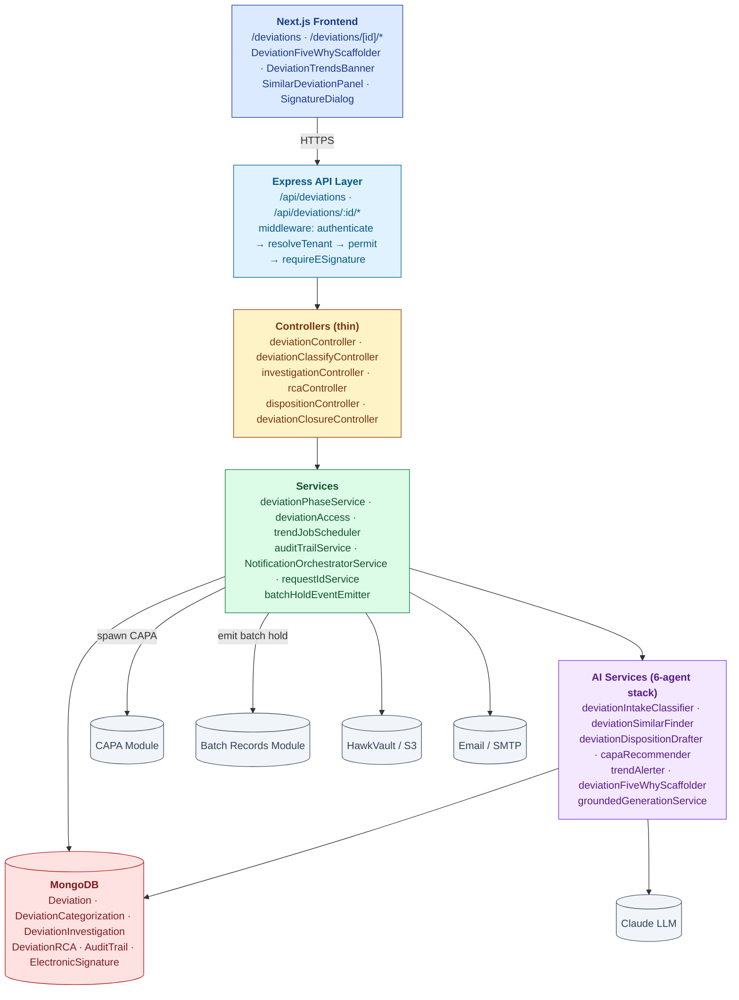
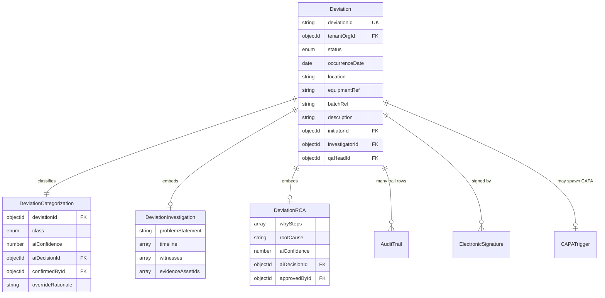
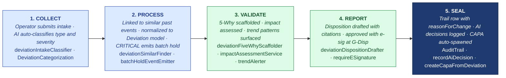

# ARCHITECTURE — Deviation

| Field | Value |
|---|---|
| Module | Deviation |
| Depth | Executive overview with code path links for detail |
| Pairs with | [URS.md](URS.md) (requirements), [DESIGN.md](DESIGN.md) (UX) |
| Last updated | 2026-06-01 |

---

## 1. System Context

**Tier ownership:**
- **Frontend** — intake form (mobile-friendly), AI panel previews, e-sig modal capture
- **API + middleware** — auth, tenant scoping, e-sig enforcement
- **Controllers** — route dispatch (thin)
- **Services** — phase transitions, trend job scheduling, cross-module event emission
- **AI** — 6 agents collaborating, all routed through `groundedGenerationService`
- **External** — CAPA spawn target, Batch Records hold consumer, file storage, email, LLM

---

## 2. Data Model

### Primary entities

| Model | Purpose | Key fields | References |
|---|---|---|---|
| **Deviation** | Aggregate root | `deviationId` (unique per tenant), `tenantOrgId`, `status`, `occurrenceDate`, `location`, `equipmentRef`, `batchRef`, `description`, `initiatorId`, `investigatorId`, `qaHeadId`, `disposition` | `users`, `organizations`, `batch-records` |
| **DeviationCategorization** | Classification record | `deviationId`, `class` (CRITICAL/MAJOR/MINOR), `aiConfidence`, `aiDecisionId`, `confirmedById`, `overrideRationale?` | `Deviation`, `users`, `AuditTrail` |
| **DeviationInvestigation** (embedded) | Investigation workspace | `problemStatement`, `timeline`, `witnesses`, `evidenceAssetIds[]` | — |
| **DeviationRCA** (embedded) | 5-Why result | `whySteps[]`, `rootCause`, `aiConfidence`, `aiDecisionId`, `approvedById` | `users`, `AuditTrail` |
| **CAPATrigger** (shared with CAPA module) | Cross-module link | `capaId`, `triggerType='DEVIATION'`, `triggerRecordId` | `CAPA` |
| **AuditTrail** (shared) | 21 CFR Part 11 log | `tenantId`, `entityType='deviation'`, `entityId`, `action`, `reasonForChange`, `signatureId?` | All modules |
| **ElectronicSignature** (shared) | Part 11 e-sig | `recordType='deviation'`, `recordId`, `signerId`, `signatureMeaning`, `authMethod`, `reasonForChange` | All modules |

### Indexes (key)

- `Deviation`: `(tenantOrgId, status)`, `deviationId` (unique per tenant), `(tenantOrgId, occurrenceDate)`, `(equipmentRef, occurrenceDate)`, `(batchRef)` — supports trend job
- `DeviationCategorization`: `(class, createdAt)` — supports Critical-class queues
- `AuditTrail`: shared `(tenantId, entityType, entityId)` index

---

## 3. API Contract Catalog

All paths require `authenticate`; RBAC via `permit(...roles)`.

### List + read

| Endpoint | Roles | Notes |
|---|---|---|
| `GET /api/deviations` | all (scoped) | Filterable by status, class, age, equipment |
| `GET /api/deviations/:id` | all (access-guarded) | Full record |
| `GET /api/deviations/trends` | qa, tenant_admin | Trend dashboard data |
| `GET /api/deviations/:id/audit-trail` | all | Single-deviation trail |

### Lifecycle

| Endpoint | Roles | Phase |
|---|---|---|
| `POST /api/deviations` | operator, prod_mgr, qa, supplier | Intake |
| `POST /api/deviations/:id/classify` | qa_investigator | Classification (confirm/override AI) |
| `POST /api/deviations/:id/investigate` | qa_investigator | Investigation |
| `POST /api/deviations/:id/rca` | qa_investigator | RCA draft + AI |
| `POST /api/deviations/:id/rca/approve` | qa_head | **E-sig gate (G-RCA)** |
| `POST /api/deviations/:id/disposition` | qa_head | **E-sig gate (G-Disp)** |
| `POST /api/deviations/:id/spawn-capa` | qa_investigator, qa_head | Cross-module CAPA creation |
| `POST /api/deviations/:id/close` | qa_head | Closure |

### E-signature gates

| Endpoint | Meaning | Phase |
|---|---|---|
| `POST /api/deviations/:id/rca/approve` | APPROVED (RCA) | G-RCA |
| `POST /api/deviations/:id/disposition` | APPROVED (disposition) | G-Disp |

### AI

| Endpoint | Roles | Purpose | Agent |
|---|---|---|---|
| `POST /api/deviations/:id/classify/ai` | system (auto on intake) | Auto-classify | `deviationIntakeClassifier` |
| `GET /api/deviations/:id/similar` | qa_investigator | Find similar | `deviationSimilarFinder` |
| `POST /api/deviations/:id/rca/draft` | qa_investigator | 5-Why scaffold | `deviationFiveWhyScaffolder` |
| `POST /api/deviations/:id/disposition/draft` | qa_investigator | Disposition suggestion | `deviationDispositionDrafter` |
| `POST /api/deviations/:id/capa/recommend` | qa_investigator | CAPA seed | `capaRecommender` |
| (cron) `runTrendAlerter()` | system | Nightly trend job | `trendAlerter` |

### Cross-module

| Endpoint | Roles | Purpose |
|---|---|---|
| `POST /api/deviations/:id/spawn-capa` | qa_investigator, qa_head | Create linked CAPA |
| (event) `batchHoldEventEmitter.emit('hold', {batchRef, deviationId})` | system | Notify batch-records module |
| `GET /api/audit-trail/by-entity?entityType=deviation` | all | Cross-module trail |

---

## 4. RBAC Matrix

| Capability | Operator | Prod Mgr | QA Investigator | QA Head | Supplier QA | Tenant Admin | Superadmin |
|---|---|---|---|---|---|---|---|
| File deviation | ✅ | ✅ | ✅ | ✅ | ✅ (supplier-side) | ✅ | ✅ |
| List own/scope (role-scoped) | ✅ | ✅ | ✅ | ✅ | ✅ | ✅ | ✅ |
| Confirm/override classification | — | — | ✅ | ✅ | — | ✅ | ✅ |
| Investigate + RCA draft | — | — | ✅ | ✅ | — | ✅ | ✅ |
| Approve RCA (e-sig) | — | — | — | ✅ | — | ✅ | ✅ |
| Sign disposition (e-sig) | — | — | — | ✅ | — | ✅ | ✅ |
| Spawn CAPA | — | — | ✅ | ✅ | — | ✅ | ✅ |
| Close deviation | — | — | — | ✅ | — | ✅ | ✅ |
| Acknowledge trend alert | — | — | — | ✅ | — | ✅ | ✅ |
| Read audit trail | ✅ | ✅ | ✅ | ✅ | ✅ | ✅ | ✅ |

**Cross-tenant guards:**
- `canUserAccessDeviation()` — affiliation check
- `buildDeviationTenantScopeQuery()` — query-time `tenantOrgId` filter
- Supplier-side deviations scoped to supplier tenant; buyer access via affiliation

---

## 5. AI Capabilities

All AI routes through `groundedGenerationService` (citations + confidence + skeleton fallback + audit-trailed via `recordAiDecision()`).

| Tool | Type | Read/Write | E-sig | Where used | Confidence floor | Status |
|---|---|---|---|---|---|---|
| **deviationIntakeClassifier** | LLM classifier | READ | NO (review) | Auto on intake; reviewed in `DeviationClassifyForm` | 0.6 | ✅ live |
| **deviationSimilarFinder** | Vector + LLM | READ | NO | `SimilarDeviationPanel` | n/a (top-K) | ✅ live |
| **deviationFiveWhyScaffolder** | LLM scaffolder | READ | NO | `DeviationFiveWhyScaffolder` | 0.6 | ✅ live |
| **deviationDispositionDrafter** | LLM drafter | READ | NO (sign separately) | `DispositionForm` | 0.7 (regulated weight) | ✅ live |
| **capaRecommender** | LLM recommender | READ | NO | Spawn-CAPA flow | 0.6 | ✅ live |
| **trendAlerter** | Heuristic + LLM | READ | NO | Nightly job → `DeviationTrendsBanner` | n/a | ✅ live; thresholds tunable |
| **wizard.classify_deviation** | App Wizard tool | READ | NO | Wizard flow | n/a | ✅ live |

### Grounding posture (same as audit/capa modules)

1. JSON-schema structured output
2. Citations required where applicable
3. Confidence floor → skeleton/manual fallback
4. PII redaction before LLM send
5. `recordAiDecision()` writes feature, modelVersion, promptHash, retrievalSet, confidence, tokens, latency to AuditTrail

### User-disposition feedback

Each AI panel calls `POST /api/ai/decisions/outcome` with `USER_ACCEPTED` / `USER_EDITED` / `USER_REJECTED` / `SUPERSEDED`. Feeds active-learning loop (shared with audit module).

---

## 6. State Machine Implementation

Cross-reference [DESIGN §4](DESIGN.md#4-state-machine).

**Enforcement layer:**
- **Definition:** `backend/src/constants/deviationStatuses.js`
- **Validation:** `services/deviationPhaseService.js → canTransition()`
- **Application:** `services/deviationPhaseService.js → applyPhaseTransition()` — mutates status, writes AuditTrail row
- **Critical-class side-effect:** `batchHoldEventEmitter.emit('hold', ...)` on classification commit if class=CRITICAL

**Gate enforcement:**
- **G-Class** — `deviationClassifyController` requires investigator role + override rationale if disagreeing with AI
- **G-RCA + G-Disp** — `requireESignature` middleware accepts pre-signed `electronicSignatureId` OR inline `signaturePassword`; soft default, hard via `ENFORCE_ESIG=hard`

---

## 7. Compliance Traceability

| Feature | 21 CFR Part 11 | 21 CFR 211.192 | ICH Q7 | EU GMP Ch.1 | ISO 9001 |
|---|---|---|---|---|---|
| Intake + traceability | §11.10(a) | applicable | §8 | §1.4 | §10.2 |
| Classification w/ AI + audit | §11.10(b)(e) | applicable | §8 | §1.4 | §10.2 |
| Critical batch hold | §11.10(e) | **applicable** | §8 | §1.4 | §8.7 |
| Investigation record | §11.10(e) | **applicable** | §8 | §1.4 | §10.2 |
| RCA approval e-sig | **§11.50 + §11.200** | applicable | §8 | §1.4 | §10.2 |
| Disposition e-sig | **§11.50 + §11.200** | applicable | §8 | §1.4 | §10.2 |
| Audit trail (cross-module) | **§11.10(e), §11.10(k)** | applicable | §6 | §9 audit trail | §7.5 |
| RBAC + tenant isolation | §11.10(d) | applicable | §13 | §12 | §7.2 |
| AI decision audit trail | §11.10(b)(e) | — | §6 risk-based | — | §8.7 |
| Trend monitoring | §11.10(e) | — | §8 + §16 | §1.4 | §9.1 |

---

## 8. Operational Concerns

### Performance / scale targets
- Deviation list: < 500 ms for 5,000 per tenant
- AI classification on intake: < 4 sec p95
- Similar-finder query: < 2 sec p95 (vector + post-filter)
- Trend job: completes within nightly window for 50k deviations / tenant
- 5-Why draft: < 6 sec p95

### Failure modes + recovery
- **LLM down** — classifier defaults to MAJOR pending review; RCA empty template; trends paused; UI surfaces "AI unavailable"
- **Critical hold event delivery failure** — retry queue; surface in tenant admin dashboard if undelivered after 3 attempts
- **CAPA spawn fails** — Deviation stays in CAPA_SPAWN state; red error surfaced; retryable
- **Trend false-positive flood** — threshold tuning per tenant; banner dismissible w/ rationale
- **E-sig password failure** — AuditTrail row marked SIGNATURE_FAILED; status unchanged

### Observability
- Structured logs with correlation ID
- Per-tenant metrics: deviations/day, classification distribution, AI acceptance rates per agent, mean-time-to-close, trend alert rate, batch-hold rate
- AuditTrail = regulatory observability layer

---

## 9. Known Gaps + Engineering Debt

1. **Trend threshold tuning** (URS-A-060) — defaults only; per-tenant configurability scaffolded.
2. **CAPA recommender accuracy validation** — no formal acceptance-rate KPI dashboard yet.
3. **Mobile intake** (URS-B-004) — responsive only; native UX deferred.
4. **Critical batch-hold release UX** — event emitted, release UX in batch-records module deferred.
5. **Cross-tenant similar-deviation surfacing** — consent model not designed.
6. **Trend dashboard tab** (`/deviations/trends`) — route stub; full dashboard deferred.
7. **Predictive CAPA effectiveness wiring** (URS-B-005) — shares Wave-3 scaffold with CAPA module; not wired.
8. **Disposition AI confidence floor** — 0.7 default; calibration pending.

---

## 10. Open Engineering Questions

1. **Vector DB choice for similar-finder** — Mongo cosine vs pgvector at scale?
2. **Trend job cadence** — nightly today; should we offer near-real-time for high-volume tenants?
3. **Event bus for cross-module emit** — direct call today; broker (Kafka/NATS) when modules multiply?
4. **AI cost ceiling per tenant** — 6 agents per deviation, ~$0.X each at scale; budget guardrails?
5. **State machine library** — same shared question as audit/capa modules.

---

## 11. Code Path Index

| Architectural concern | Primary code path |
|---|---|
| Routes | `backend/src/routes/deviation*.js` |
| Controllers | `backend/src/controllers/deviation*.js`, `dispositionController.js` |
| Services | `backend/src/services/deviation*.js`, `services/ai/wave2/deviation*.js`, `services/ai/wave2/capaRecommender.js`, `services/ai/wave2/trendAlerter.js` |
| Models | `backend/src/models/Deviation.js`, `DeviationCategorization.js`, embedded `DeviationInvestigation`, `DeviationRCA` |
| Middlewares | `backend/src/middlewares/{authMiddleware,roleMiddleware,requireESignature}.js` |
| RBAC utils | `backend/src/utils/deviationAccess.js` |
| Constants | `backend/src/constants/deviationStatuses.js` |
| Shared audit trail | `backend/src/services/auditTrailService.js`, `models/AuditTrail.js` |
| AI grounding | `backend/src/services/groundedGenerationService.js`, `services/ai/audit-trail/recordAiDecision.js` |
| Event emitter | `backend/src/services/batchHoldEventEmitter.js` |
| Frontend pages | `frontend/app/(console)/deviations/**` |
| Frontend components | `frontend/components/deviation/`, `frontend/components/ai/Deviation*.tsx` |

---

## 12. The Five-Pillar Walkthrough

Deviation is one expression of S.M.A.R.T. Hawk's universal 5-pillar pipeline (**SOURCE → MODEL → ASSESS → REPORT → TRACE**). This section narrates how a deviation walks the pillars from shop-floor intake to CAPA hand-off, maps each pillar to the actual code, and notes the cross-module spawn at close. The same shape applies to every regulated workflow on the platform — see the MASTER-REFERENCE for the canonical pattern.

### 12.1 Narrative

A deviation is **collected** when an operator submits an intake event through `POST /api/deviations` — the `deviationIntakeClassifier` AI auto-tags type (process / equipment / documentation / environmental) and severity (CRITICAL / MAJOR / MINOR) at the same time, and a `DeviationCategorization` row is written with the AI confidence. It is **processed** by `deviationSimilarFinder` (vector + LLM top-K) which links the new event to similar past deviations, normalizing it to the `Deviation` aggregate with embedded `DeviationInvestigation` and `DeviationRCA` sub-docs; if `class=CRITICAL` is committed, `batchHoldEventEmitter` fires a hold event to the Batch Records module. It is **validated** through structured root-cause analysis — `deviationFiveWhyScaffolder` walks the investigator through 5-Why with citations, `impactAssessmentService` evaluates batch / product / regulatory impact, and the nightly `trendAlerter` job surfaces cross-deviation patterns onto the trends banner. The disposition is **reported** by `deviationDispositionDrafter` (AI-drafted verdict with citations, confidence floor 0.7 given the regulated weight) and approved with an e-signature at G-Disp. Finally it is **sealed** in `AuditTrail` with mandatory `reasonForChange` plus per-AI-step `recordAiDecision` rows — and at close `createCapaFromDeviation` auto-spawns a CAPA seeded by `capaRecommender`, carrying the root cause and disposition forward into the next module.

### 12.2 Pillar diagram

### 12.3 Cross-module spawn

At closure the Deviation module is the canonical upstream of CAPA — and it also emits hold events sideways into Batch Records:

- **Deviation closes to CAPA** — `POST /api/deviations/:id/spawn-capa` (or the close hook) calls `createCapaFromDeviation`, which writes a `CAPATrigger` row with `triggerType='DEVIATION'` and `triggerRecordId` linking back. The CAPA arrives in the next module prefilled with the root cause from `DeviationRCA` and seeded action recommendations from `capaRecommender`.
- **Critical class emits to Batch Records** — on classification commit with `class=CRITICAL`, `batchHoldEventEmitter.emit('hold', {batchRef, deviationId})` fires; the Batch Records module places the lot on hold pending disposition.
- **Cross-module trail** — `AuditTrail` rows for the deviation share the `(tenantId, entityType, entityId)` index with every other module, so `GET /api/audit-trail/by-entity?entityType=deviation&entityId=X` returns the full thread including the downstream CAPA and any batch hold (URS-B-009).

### 12.4 Code path table

| Pillar | Code path | What it does in Deviation |
|---|---|---|
| 1. COLLECT | `controllers/deviationController.js` (intake), `services/ai/wave2/deviationIntakeClassifier.js`, `models/DeviationCategorization.js` | Operator submits intake event; AI auto-classifies type + severity (CRITICAL/MAJOR/MINOR) with confidence written to `DeviationCategorization` |
| 2. PROCESS | `services/ai/wave2/deviationSimilarFinder.js`, `models/Deviation.js` (aggregate + embedded sub-docs), `services/batchHoldEventEmitter.js` | Links to similar past deviations via vector + LLM; normalizes to `Deviation` model; emits batch-hold event when class=CRITICAL |
| 3. VALIDATE | `services/ai/wave2/deviationFiveWhyScaffolder.js`, `services/impactAssessmentService.js`, `services/ai/wave2/trendAlerter.js`, `controllers/rcaController.js` | AI-scaffolds 5-Why with citations; assesses batch/product/regulatory impact; nightly trend job surfaces cross-deviation patterns |
| 4. REPORT | `services/ai/wave2/deviationDispositionDrafter.js`, `controllers/dispositionController.js`, `middlewares/requireESignature.js` | AI-drafts disposition verdict with citations (confidence floor 0.7); QA-Head signs at G-Disp |
| 5. SEAL | `services/auditTrailService.js`, `models/AuditTrail.js`, `services/ai/audit-trail/recordAiDecision.js`, `services/deviation/createCapaFromDeviation.js`, `services/ai/wave2/capaRecommender.js` | Append-only trail with mandatory `reasonForChange`; AI-decision row per agent step; on close auto-spawns CAPA seeded by `capaRecommender` |

See also:
- [Doc_V2/02-platform/MASTER-REFERENCE.md](../../02-platform/MASTER-REFERENCE.md) — the canonical 5-pillar pattern
- [Doc_V2/06-modules/capa/ARCHITECTURE.md §12](../capa/ARCHITECTURE.md#12-the-five-pillar-walkthrough) — downstream CAPA walkthrough (the module Deviation spawns at close)
- [Doc_V2/06-modules/audit-management/ARCHITECTURE.md §12](../audit-management/ARCHITECTURE.md#12-the-five-pillar-walkthrough) — sibling audit walkthrough
