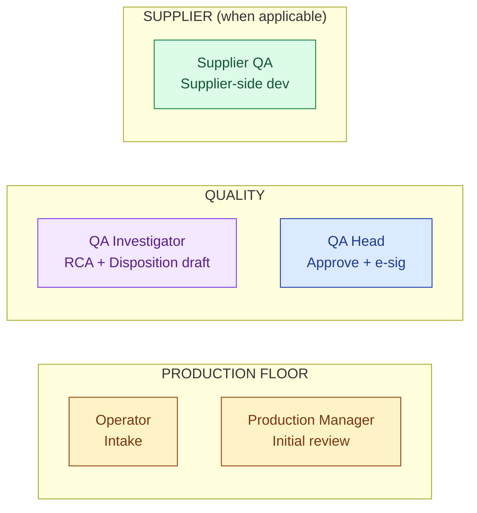
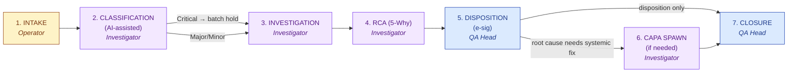
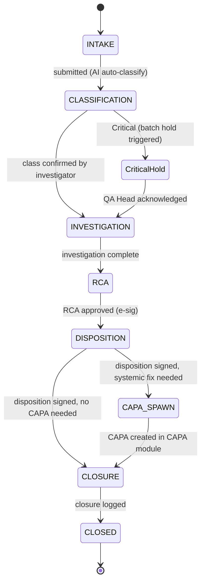

# DESIGN — Deviation

| Field | Value |
|---|---|
| Module | Deviation |
| Depth | Executive overview (with pointers to code for detail) |
| Pairs with | [URS.md](URS.md) (requirements), [ARCHITECTURE.md](ARCHITECTURE.md) (technical) |
| Last updated | 2026-06-01 |

---

## 1. Personas (4 primary, 2 secondary)

Cross-reference [URS §2](URS.md#2-stakeholders-and-personas).



| # | Persona | Lane | Primary actions | Decisions |
|---|---|---|---|---|
| 1 | **Production Operator** | Floor | File intake | Description, evidence |
| 2 | **Production Manager** | Floor | Initial review + escalation | Operator coaching, escalation timing |
| 3 | **QA Investigator** | Quality | Classify (review AI), investigate, draft RCA + disposition | Classification, root cause, recommended disposition |
| 4 | **QA Head** | Quality | Approve disposition (e-sig), approve RCA, acknowledge trends | Final disposition, batch-hold release |
| 5 | **Supplier QA** | Supplier | Respond to supplier-side deviations | Supplier-side actions |
| 6 | **Tenant Admin** | Platform | Configure severity rubric, trend thresholds | Per-tenant config |

---

## 2. End-to-End Journey



> 💡 **Critical classification = automatic batch hold.** The AI doesn't make the decision alone — the QA Head reviews — but the hold is precautionary and immediate.

### Journey snapshots per persona

#### Production Operator
```
1. Open intake form     → /deviations/new           DeviationIntakeForm (mobile-friendly)
2. Describe + attach    → same                       photo / voice / document
3. Submit               → backend assigns ID, runs AI classifier
```

#### QA Investigator
```
1. Dashboard inbox      → /deviations               DeviationList (filtered to assigned)
2. Open deviation       → /deviations/[id]           DeviationDetail hub
3. Review AI class      → /deviations/[id]/classify  DeviationClassifyForm
4. Check similar        → /deviations/[id]           SimilarDeviationPanel
5. Investigate          → /deviations/[id]/investigation
6. Draft RCA            → /deviations/[id]/rca       DeviationFiveWhyScaffolder
7. Draft disposition    → /deviations/[id]/disposition
8. Spawn CAPA (opt.)    → spawn-CAPA button → CAPA module
```

#### QA Head
```
1. Dashboard            → /deviations + trend banner
2. Acknowledge trend    → DeviationTrendsBanner.acknowledge
3. Approve disposition  → /deviations/[id]/disposition SignatureDialog [G-Disp]
4. Approve RCA          → /deviations/[id]/rca       SignatureDialog [G-RCA]
5. Close deviation      → /deviations/[id]/close     ClosureForm
```

---

## 3. Screen + Component Inventory

Pages live under `frontend/app/(console)/deviations/`.

| Route | Purpose | Key components |
|---|---|---|
| `/deviations` | List + filter (status / class / age / equipment) | `DeviationList`, `DeviationTrendsBanner` (header) |
| `/deviations/new` | Intake form | `DeviationIntakeForm` (mobile-friendly) |
| `/deviations/[id]` | Detail hub | `DeviationDetail`, `DeviationPhaseStepper`, `SimilarDeviationPanel` |
| `/deviations/[id]/classify` | Classification review | `DeviationClassifyForm` (AI suggestion + override) |
| `/deviations/[id]/investigation` | Investigation workspace | `InvestigationForm` |
| `/deviations/[id]/rca` | 5-Why scaffolder | `DeviationFiveWhyScaffolder` |
| `/deviations/[id]/disposition` | Disposition + e-sig | `DispositionForm` + `SignatureDialog` |
| `/deviations/[id]/close` | Closure | `ClosureForm` |
| `/deviations/[id]/audit-log` | 21 CFR Part 11 trail | `AuditLogTable` |
| `/deviations/trends` | Trend dashboard | `TrendsDashboard` (drill-down) |

Cross-cutting components:
- `DeviationPhaseStepper` — visual 7-state progress
- `DeviationTrendsBanner` — dashboard-wide emerging-pattern banner
- `SimilarDeviationPanel` — historical pattern surfacing
- `DeviationFiveWhyScaffolder` — AI RCA scaffolder
- `SignatureDialog` — Part 11 e-sig (shared)

---

## 4. State Machine



**Transition rules** (enforced in `deviationPhaseService.canTransition()`):
- Forward-only by default
- Critical class auto-emits batch-hold event before investigation can complete
- Disposition requires e-sig (G-Disp); CLOSURE requires both RCA + Disposition signatures
- Revert only by tenant_admin/superadmin with reasonForChange

### Decision gates

| Gate | Phase | Trigger | Enforcer | Audit-trail entry |
|---|---|---|---|---|
| **G-Class** | CLASSIFICATION | Investigator confirms (or overrides) AI class | `deviationClassifyController` | `CLASSIFIED` |
| **G-Critical** | CLASSIFICATION → CriticalHold | Class = Critical | `dispositionController` event emitter | `BATCH_HOLD_TRIGGERED` |
| **G-RCA** | RCA → DISPOSITION | QA Head signs RCA approval | `requireESignature` + `rcaController` | `SIGNED` + `RCA_APPROVED` |
| **G-Disp** | DISPOSITION → CAPA_SPAWN/CLOSURE | QA Head signs disposition | `requireESignature` + `dispositionController` | `SIGNED` + `DISPOSITIONED` |

---

## 5. Notifications and Reminders

| Event | Recipients | Channel |
|---|---|---|
| Deviation intake submitted | Production Manager + assigned investigator | Email + dashboard |
| AI classified as Critical | QA Head + Production Manager (priority) | Email + dashboard banner |
| Investigation overdue | Investigator + QA Head | Email reminder |
| RCA ready for approval | QA Head | Email + dashboard task |
| Disposition signed | Initiator + Production Manager | Email |
| Trend alert (new pattern) | QA Head, tenant_admin | Email + dashboard banner |
| CAPA spawned | CAPA module recipients (per CAPA notification spec) | Email + dashboard |
| Closure logged | All previously notified parties (cc) | Email |

---

## 6. Error and Edge Cases

| Scenario | Handling |
|---|---|
| **Operator submits without attachment** | Allowed; warning surfaced; QA Investigator can request later |
| **AI classifier low confidence** | UI shows AI suggestion with confidence; investigator forced to confirm with rationale (no silent accept) |
| **Critical class but no batch ref** | Hard error on intake validation; can't submit Critical without product/batch ref |
| **5-Why scaffolder LLM down** | Empty 5-Why template surfaces; investigator fills manually |
| **Trend alerter false-positive flood** | Tenant admin can adjust thresholds; acknowledge action audit-trailed |
| **Disposition e-sig password wrong** | SignatureDialog stays open; "Password verification failed" |
| **Concurrent classification override** | Optimistic-lock conflict via `updatedAt` token; "Stale — refresh and retry" |
| **CAPA spawn fails downstream** | Deviation remains in CAPA_SPAWN state; surfaced as red error; retryable |
| **Closure before all gates** | Backend blocks; UI greys out close button until RCA + Disposition signed |

---

## 7. Accessibility

- Mobile-first intake form (Operator persona)
- Keyboard nav on all forms; SmartQuestion-style attachment shortcuts
- ARIA labels on classification chips (Critical red / Major amber / Minor blue)
- Color contrast WCAG AA; classification distinguishable by shape + text, not color alone
- Open gap: voice-memo accessibility (transcript surfaced for screen reader)

---

## 8. Open Design Questions

1. **Mobile intake UX** (URS-B-004) — native app, PWA, or responsive web? Today responsive only.
2. **Classification override UX** — should override require explicit "I disagree because…" rationale, or is the implicit override action enough?
3. **Trend dashboard density** — single banner vs full dashboard tab? Today banner only; full `/deviations/trends` route stub.
4. **Critical-hold release** — UX for QA Head to release batch hold after investigation? Currently event-emitter only; UX deferred.
5. **CAPA spawn preview** — should the spawn button show a preview of what CAPA will be created (problem statement, suggested actions)?
6. **Similar-deviation cross-tenant** (URS open Q5) — opt-in panel per supplier, or always-off until tenant-admin enables?
