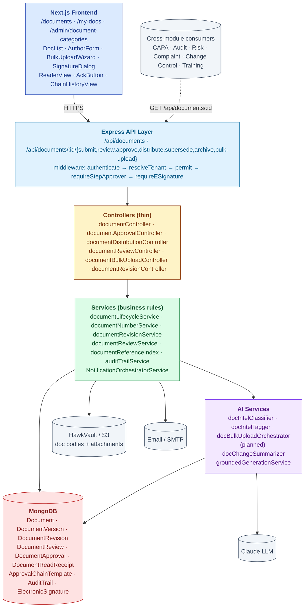
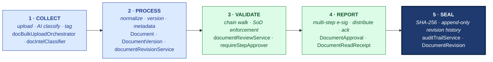
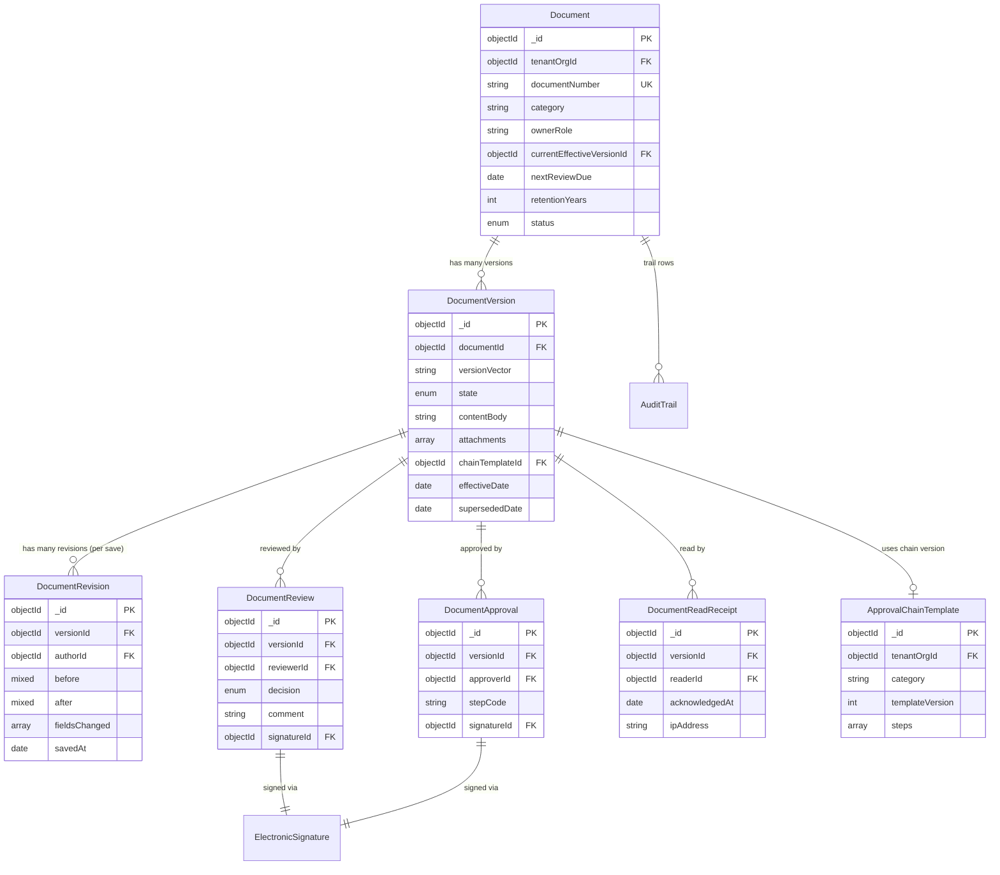

# ARCHITECTURE — Document Control

| Field | Value |
|---|---|
| Module | Document Control |
| Depth | Executive overview with code path links for detail |
| Pairs with | [URS.md](URS.md) (requirements), [DESIGN.md](DESIGN.md) (UX) |
| Last updated | 2026-06-01 |

---

## 1. System Context

**Tier ownership:**
- **Frontend** owns: rendering, role-aware UI gates, e-sig modal capture, bulk-upload wizard UX
- **API + middleware** owns: auth, tenant scoping, RBAC, SoD enforcement, e-sig enforcement
- **Controllers** own: route dispatch (thin)
- **Services** own: lifecycle rules, chain orchestration, revision diff computation, AI orchestration, notifications
- **Models** own: schema, indexes, chain template versioning
- **External systems** own: file storage (S3), email (SMTP), inference (Claude)

---

## 2. The Five-Pillar Walkthrough

Document Control walks Hawkeye's universal pipeline once per controlled document. Content is **collected** at the upload modal as a single draft (`documentController.create`) or as a multi-file plan via the AI bulk wizard (`docBulkUploadOrchestrator` — `docIntelClassifier` auto-classifies SOP / Procedure / Record, `docIntelTagger` adds persona and module tags, returns a reviewable plan). It is **processed** into the durable model (`Document` aggregate root with per-revision `DocumentVersion` rows; `documentRevisionService` extracts and normalizes metadata — title, doc type, effective date, retention rules — and writes a `DocumentRevision` row per save). It is **validated** by the chain enforcer (`documentReviewService` walks the per-tenant `ApprovalChainTemplate`; `requireStepApprover` middleware enforces Separation of Duties so an author cannot also be a reviewer or approver on the same version). It is **reported** through the multi-step approval workflow (`DocumentApproval` rows each bound to an `ElectronicSignature`; on EFFECTIVE the distribution targets are computed and notifications fire; the document can trigger Training assignments to all assigned readers). Finally everything is **sealed** to AuditTrail per version, per approval, and per distribution event; the version body is SHA-256 hashed; `DocumentRevision` history is append-only.

**Cross-module spawn:**
- **Training** — a new EFFECTIVE SOP emits `trainingAssignmentRequest` so impacted personas are rostered for read-and-understand
- **Change Control** — a doc revision tied to an open Change Control closes the loop on `docControlReviewRequest`
- **CAPA / Audit / Risk / Complaint** — referencing modules link back via `documentReferenceIndex`, so an SOP can serve as evidence in any quality record's audit trail

**Code-path table**

| Pillar | Code path | What it does |
|---|---|---|
| 1 · Collect | `backend/src/controllers/documentBulkUploadController.js`, `services/ai/docBulkUploadOrchestrator.js`, `services/ai/docIntelClassifier.js`, `services/ai/docIntelTagger.js` | Single upload or bulk wizard · AI classify and tag |
| 2 · Process | `backend/src/services/documentLifecycleService.js`, `services/documentRevisionService.js`, `models/{Document,DocumentVersion,DocumentRevision}.js` | Normalize to Document + Version · per-save revision diff |
| 3 · Validate | `backend/src/services/documentReviewService.js`, `middlewares/requireStepApprover.js`, `models/ApprovalChainTemplate.js` | Chain walk · SoD guard · per-tenant matrix |
| 4 · Report | `backend/src/controllers/documentApprovalController.js`, `controllers/documentDistributionController.js`, `middlewares/requireESignature.js` | Per-step e-sig · distribute · read receipts |
| 5 · Seal | `backend/src/services/auditTrailService.js`, `models/{AuditTrail,DocumentRevision}.js` | AuditTrail row per event · SHA-256 of body · append-only history |

---

## 3. Data Model

### Primary entities

| Model | Purpose | Key fields | References |
|---|---|---|---|
| **Document** | Aggregate root per documentNumber | `documentNumber` (unique per tenant), `category`, `currentEffectiveVersionId`, `nextReviewDue`, `retentionYears`, `status` | `tenantOrgId`, `currentEffectiveVersionId` |
| **DocumentVersion** | Versioned content + state | `versionVector` (e.g., 2.0), `state` (DRAFT/IN_REVIEW/APPROVED/EFFECTIVE/SUPERSEDED/ARCHIVED), `contentBody`, `attachments[]`, `chainTemplateId`, `effectiveDate`, `supersededDate` | `Document`, `ApprovalChainTemplate` |
| **DocumentRevision** | Per-save diff history (DRAFT) | `versionId`, `authorId`, `before`, `after`, `fieldsChanged[]`, `savedAt` | `DocumentVersion`, `users` |
| **DocumentReview** | Reviewer signature record | `versionId`, `reviewerId`, `decision` (APPROVED/REJECTED), `comment`, `signatureId` | `DocumentVersion`, `ElectronicSignature` |
| **DocumentApproval** | Approver signature record | `versionId`, `approverId`, `stepCode`, `signatureId` | `DocumentVersion`, `ElectronicSignature` |
| **DocumentReadReceipt** | Read attestation | `versionId`, `readerId`, `acknowledgedAt`, `ipAddress` | `DocumentVersion`, `users` |
| **ApprovalChainTemplate** | Per-category chain config (versioned) | `category`, `templateVersion`, `steps[]` (role, signatureMeaning, requiredCount) | `tenantOrgId` |
| **AuditTrail** (cross-module) | 21 CFR Part 11 log | shared across modules — see audit module ARCHITECTURE | — |
| **ElectronicSignature** | Part 11 e-sig records | shared | — |

### Indexes (key)

- `Document`: `(tenantOrgId, documentNumber)` unique, `(tenantOrgId, category)`, `(tenantOrgId, nextReviewDue)`
- `DocumentVersion`: `(documentId, versionVector)` unique, `(state)`, `(effectiveDate)`
- `DocumentReadReceipt`: `(versionId, readerId)` unique
- `AuditTrail`: `(tenantId, entityType='document', entityId)` for cross-module trail browser
- `ApprovalChainTemplate`: `(tenantOrgId, category, templateVersion)` unique

---

## 4. API Contract Catalog (grouped)

All paths require `authenticate` middleware unless noted; RBAC enforced by `permit(...roles)`.

### Document lifecycle

| Group | Endpoints | Primary roles | Notes |
|---|---|---|---|
| List + read | `GET /api/documents`, `GET /api/documents/:id`, `GET /api/documents/:id/versions` | role-scoped | Tenant-scoped query |
| Create | `POST /api/documents` | author roles | Generates `documentNumber` |
| Update draft | `PATCH /api/documents/:id` | author | Writes `DocumentRevision` row |
| Submit for review | `POST /api/documents/:id/submit` | author | DRAFT → IN_REVIEW |
| Review | `POST /api/documents/:id/review` (e-sig) | reviewer | Sign REVIEWED or REJECT |
| Approve | `POST /api/documents/:id/approve` (e-sig) | approver | APPROVED → EFFECTIVE on effective date |
| Distribute | `POST /api/documents/:id/distribute` | dco, tenant_admin | Sends notifications, creates distribution targets |
| Acknowledge | `POST /api/documents/:id/acknowledge` | any reader | Writes `DocumentReadReceipt` |
| Supersede | `POST /api/documents/:id/supersede` | dco, tenant_admin | Links new version; marks old SUPERSEDED |
| Archive | `POST /api/documents/:id/archive` | dco, tenant_admin | Only if retention elapsed |
| Periodic review | `POST /api/documents/:id/periodic-review` | dco | Extend or fork revision |

### Bulk + AI

| Endpoint | Role | Purpose |
|---|---|---|
| `POST /api/documents/bulk-upload/plan` | dco | AI orchestrator proposes plan (classify + tag + chain assignment) |
| `POST /api/documents/bulk-upload/execute` (batch e-sig) | dco | Execute approved plan; writes all drafts under one batch ID |
| `POST /api/documents/ai/classify` | author, dco | Single-file classify preview |
| `POST /api/documents/ai/tag` | author, dco | Single-file tag suggest |

### Admin

| Endpoint | Role | Purpose |
|---|---|---|
| `GET/POST/PATCH /api/admin/document-categories` | tenant_admin | Configure categories + retention + chain |
| `GET/POST/PATCH /api/admin/approval-chains` | tenant_admin | Manage chain templates (versioned on edit) |

### Audit trail

| Endpoint | Role | Purpose |
|---|---|---|
| `GET /api/documents/:id/audit-trail` | all | Per-document trail |
| `GET /api/audit-trail/by-entity?entityType=document&entityId=...` | all (tenant-scoped) | Cross-module trail |

---

## 5. RBAC Matrix

| Capability | Author | Reviewer | Approver | DCO | Reader | Tenant Admin | Superadmin |
|---|---|---|---|---|---|---|---|
| Create draft | ✅ | ✅ | ✅ | ✅ | — | ✅ | ✅ |
| Edit own draft | ✅ | ✅ | ✅ | ✅ | — | ✅ | ✅ |
| Submit for review | ✅ | ✅ | ✅ | ✅ | — | ✅ | ✅ |
| Sign REVIEWED | — | ✅ | — | — | — | ✅ | ✅ |
| Sign APPROVED/AUTHORIZED | — | — | ✅ | — | — | ✅ | ✅ |
| Distribute | — | — | — | ✅ | — | ✅ | ✅ |
| Acknowledge / read | ✅ | ✅ | ✅ | ✅ | ✅ | ✅ | ✅ |
| Supersede | — | — | — | ✅ | — | ✅ | ✅ |
| Archive | — | — | — | ✅ | — | ✅ | ✅ |
| Bulk upload | — | — | — | ✅ | — | ✅ | ✅ |
| Configure category/chain | — | — | — | — | — | ✅ | ✅ |
| Read audit trail | ✅ | ✅ | ✅ | ✅ | ✅ | ✅ | ✅ |

**Cross-tenant guards:** all document queries gated by `buildDocumentTenantScopeQuery()` (tenant_orgId filter).

**SoD guards** (URS-A-012): `requireStepApprover` middleware blocks a user from signing two different steps on the same version.

---

## 6. AI Capabilities

All AI is grounded (citations + confidence floor + manual fallback) and audit-trailed (`recordAiDecision`). Per URS §A5–A6.

### AI tools wired into Document Control

| Tool | Type | Read/Write | E-sig | Where used | Status |
|---|---|---|---|---|---|
| **docIntelClassifier** | Classification | READ | NO | Upload modal + bulk wizard | ✅ live |
| **docIntelTagger** | Tag generation | READ | NO | Upload modal + bulk wizard | ✅ live |
| **docBulkUploadOrchestrator** | Multi-file plan-then-execute | WRITE (on execute) | YES (batch) | `/documents/bulk-upload` | ✅ live |
| **docChangeSummarizer** | v(n) vs v(n+1) summary | READ | NO | Reviewer queue | ⏳ planned Q1 2027 |

### Grounding posture

Every LLM call routes through `groundedGenerationService.js`:
1. **Structured output** — JSON schema validation, re-ask on parse failure
2. **Confidence floor** — classifier minConfidence 0.6; below → manual classification
3. **PII redaction** — before send, unredact on receipt
4. **AuditTrail row** — `recordAiDecision()` writes feature, modelVersion, promptHash, retrievalSet, confidence, tokens, latency
5. **User disposition** — `POST /api/ai/decisions/outcome` captures USER_ACCEPTED / USER_EDITED / USER_REJECTED

### Bulk wizard plan-then-execute pattern

The `docBulkUploadOrchestrator` follows the App Wizard pattern:
1. **Plan phase** — upload files, AI classifies + tags + assigns chain → returns reviewable plan
2. **Approve phase** — DCO reviews and edits plan (override classification, change tags, swap chain)
3. **Execute phase** — single batch e-signature (reasonForChange captures import context) → all drafts written transactionally; failures surfaced per-file

---

## 7. State Machine Implementation

Cross-reference [DESIGN §4](DESIGN.md#4-state-machine-document-lifecycle).

**Enforcement layer:**
- **Definition:** `backend/src/constants/documentStates.js` (enum)
- **Validation:** `services/documentLifecycleService.js → canTransition()` — checks chain completion, e-sig presence, retention rules, SoD
- **Application:** `services/documentLifecycleService.js → applyTransition()` — mutates `state`, writes AuditTrail row
- **Chain enforcement:** `controllers/documentApprovalController.js` + `requireStepApprover` middleware

**Gate enforcement:**
- **G-REV / G-APR (e-sig)** — `middlewares/requireESignature.js` accepts `electronicSignatureId` (pre-signed) OR inline `signaturePassword`
- **G-SOD (segregation)** — `requireStepApprover` checks if the user has already signed any earlier step on this version
- **G-BULK (batch e-sig)** — wizard executor captures one signature covering the entire batch; per-file rows reference batch signatureId

---

## 8. Compliance Traceability

| Feature | 21 CFR Part 11 | EU GMP Ch.4 | EU GMP Annex 11 | ISO 9001 |
|---|---|---|---|---|
| Document creation + numbering | §11.10(k) | §4.1 | §10 docs | §7.5.2 |
| Version control + revision history | **§11.10(e) audit trail** | §4.2 | §10 | §7.5.3 |
| Multi-step approval e-sig | **§11.50 + §11.200 + §11.300** | §4.1 | §14 e-sig | §7.5 |
| SoD enforcement | §11.10(d) | §4.1 segregation | §12 personnel | §7.2 |
| Distribution + read receipts | §11.10(c) | §4.3 | §10 | §7.5.3 |
| Periodic review | §11.10(k) | **§4.4** | §10 | §9.1 |
| Retention enforcement | §11.10(c) | **§4.10** | §10 | §7.5.3 |
| Audit trail (cross-module) | **§11.10(e), §11.10(k)** | §4.9 records | §9 | §7.5 |
| AI classification reproducibility | §11.10(b) authenticity | — | §6 risk-based validation | §7.5 |

---

## 9. Operational Concerns

### Performance / scale targets
- Document list: < 500 ms for 10k effective docs per tenant
- Version diff: < 1 sec p95
- Bulk upload (100 files): < 2 min end-to-end including AI classification
- Cross-module reference count: < 1 sec per document

### Failure modes + recovery
- **LLM provider down** → bulk wizard degrades to manual classification per file; UI surfaces "AI unavailable"
- **S3 upload failure** → atomic per-file write; partial bulk uploads surface failed files for retry
- **DB write failure mid-transition** → state reverts; AuditTrail row marked FAILED
- **E-sig password mismatch** → no state change; AuditTrail row `SIGNATURE_FAILED`; user retries
- **SoD violation** → 403 with `SIGNATURE_DENIED_SOD`; UI shows which step user already signed
- **Concurrent reviewers** — last-write-wins on review record; chain advances only when all required reviewers have signed

### Observability
- Per-tenant metrics: docs-effective, docs-overdue-review, mean-time-to-effective, read-coverage %, AI classification acceptance rate
- Audit trail itself is the regulatory observability layer

---

## 10. Known Gaps + Engineering Debt

1. **Per-tenant retention enforcement** — field exists; automated purge gating planned Q1 2027
2. **Risk-weighted review cadence (URS-B-005)** — today flat per-category; Risk-module integration designed, not wired
3. **AI change summarizer (URS-B-006)** — planned Q1 2027
4. **Cross-module reference UI (URS-B-004)** — backend index exists; UI shows counts only, not deep links
5. **Persona-aware reader filter (URS-B-002)** — tagger emits persona/module tags; filter UI partial
6. **Chain builder UI** — today form-based; drag-drop deferred
7. **Mobile reader UX** — desktop-first; shop-floor mobile deferred
8. **External regulator access tokens** — design pending

---

## 11. Open Engineering Questions

1. **Document body storage** — Markdown today; do we add a rich-text editor (Tiptap)? Trade-offs on diff fidelity.
2. **Versioning scheme** — major.minor today; do we adopt SemVer-style breaking-vs-non-breaking semantics?
3. **Vector embedding for AskHawk corpus** — when do effective docs flow into AskHawk's RAG index? Today: manual indexing job.
4. **Retention enforcement** — soft (warn + block) or hard (purge)? Compliance vs storage-cost trade-off.
5. **Cross-tenant doc sharing** — supplier-shared SOP catalog? Design pending.

---

## 12. Code Path Index (Architecture ↔ Source)

| Architectural concern | Primary code path |
|---|---|
| Routes | `backend/src/routes/document*.js` |
| Controllers | `backend/src/controllers/document*.js` |
| Services | `backend/src/services/document*.js`, `services/ai/docIntel*.js`, `services/ai/docBulkUploadOrchestrator.js` |
| Models | `backend/src/models/{Document,DocumentVersion,DocumentRevision,DocumentReview,DocumentApproval,DocumentReadReceipt,ApprovalChainTemplate}.js` |
| Middlewares | `backend/src/middlewares/{authMiddleware,roleMiddleware,tenantMiddleware,requireESignature,requireStepApprover}.js` |
| Constants | `backend/src/constants/documentStates.js` |
| Audit trail | `backend/src/services/auditTrailService.js`, `models/AuditTrail.js` |
| AI grounding | `backend/src/services/groundedGenerationService.js`, `services/ai/audit-trail/recordAiDecision.js` |
| Frontend pages | `frontend/app/(console)/documents/**`, `frontend/app/(console)/my-docs/` |
| Frontend components | `frontend/components/documents/`, `frontend/components/ai/BulkUploadWizard.tsx`, `frontend/components/eqms/SignatureDialog.tsx` |
| Frontend hooks | `frontend/hooks/useDocuments.ts`, `hooks/useDocumentChain.ts` |
