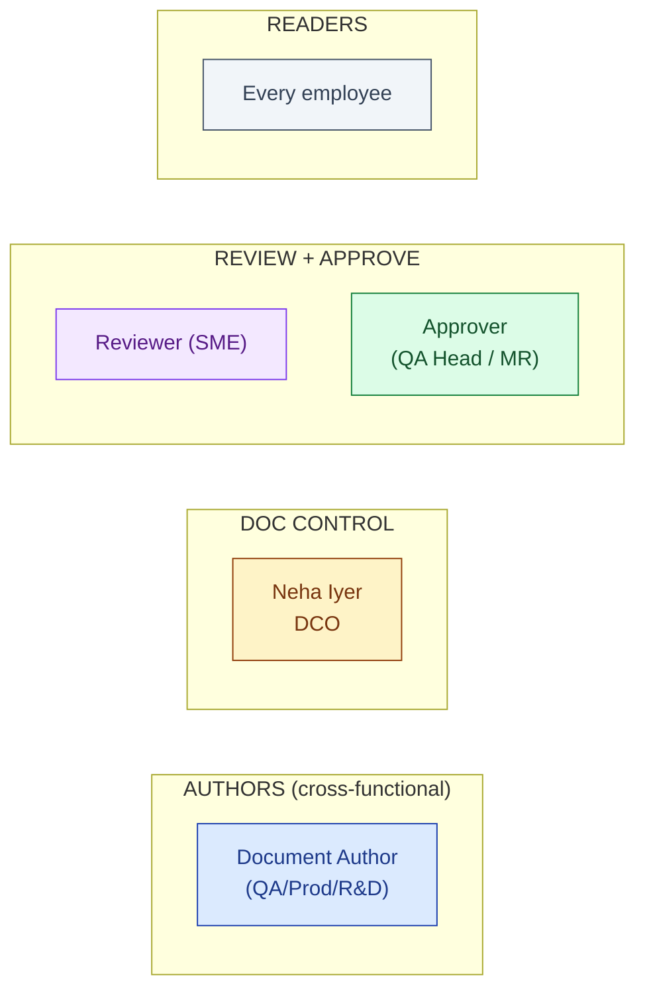
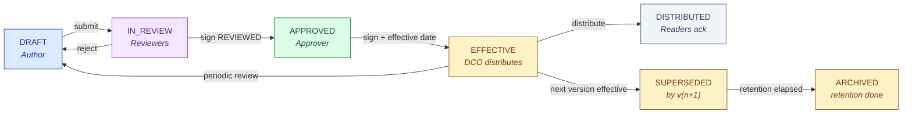
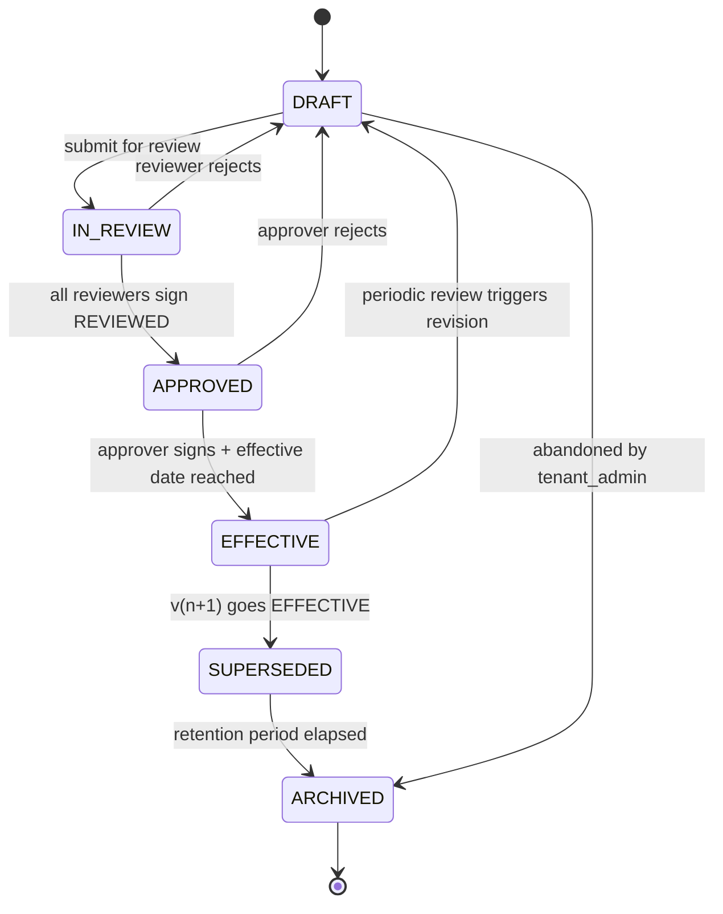

# DESIGN — Document Control

| Field | Value |
|---|---|
| Module | Document Control |
| Depth | Executive overview (with pointers to code for detail) |
| Pairs with | [URS.md](URS.md) (requirements), [ARCHITECTURE.md](ARCHITECTURE.md) (technical) |
| Last updated | 2026-06-01 |

---

## 1. Personas (5 primary)

Cross-reference [URS §2](URS.md#2-stakeholders-and-personas).



| # | Persona | Primary actions | Decisions |
|---|---|---|---|
| 1 | **Document Author** | Draft, attach, submit for review | Initial draft content, category |
| 2 | **DCO (Neha)** | Configure chains/categories, distribute, monitor effective inventory, periodic review | Distribution scope, retention extension |
| 3 | **Reviewer** | Review, comment, sign REVIEWED | Technical accuracy yes/no |
| 4 | **Approver** | Final approval, sign APPROVED/AUTHORIZED | Effective yes/no |
| 5 | **Reader** | Read effective version, acknowledge read receipt | (none — consume) |

---

## 2. End-to-End Journey (lifecycle, 5 personas)



### Journey snapshots per persona

#### Document Author

```
1. Inbox / dashboard      → /documents/my-drafts            DraftsList
2. New document           → /documents/new                  AuthorForm (template picker, AI classifier preview)
3. Save (auto-revision)   → same                            DocumentRevision row written
4. Attach evidence        → same                            S3 upload, AI tagger suggests tags
5. Submit for review      → /documents/[id]                 SubmitDialog (selects chain) → state IN_REVIEW
```

#### DCO (Neha)

```
1. Dashboard              → /documents                      DocList (effective + pending + overdue review)
2. Configure category     → /admin/document-categories      CategoryEditor (chain, retention, review cadence)
3. Bulk upload            → /documents/bulk-upload          BulkUploadWizard (plan → approve → execute, single batch e-sig)
4. Monitor review queue   → /documents?status=in_review     filtered DocList
5. Distribute             → /documents/[id]/distribute      DistributeDialog (groups, deep link)
6. Periodic review queue  → /documents?reviewDue=30d        ReviewQueue
7. Supersede              → /documents/[id]/supersede       SupersedeDialog (links new version)
```

#### Reviewer

```
1. Inbox                  → /documents/my-reviews           ReviewQueue
2. Open doc               → /documents/[id]                 DocViewer (read + diff vs prior version)
3. Comment inline         → same                            CommentThread
4. Sign REVIEWED          → /documents/[id]/review          SignatureDialog → next step in chain
```

#### Approver

```
1. Inbox                  → /documents/my-approvals         ApprovalQueue
2. Review chain history   → /documents/[id]/history         ChainHistoryView
3. Sign APPROVED          → /documents/[id]/approve         SignatureDialog (sets effective date)
```

#### Reader

```
1. Must-read inbox        → /my-docs                        MustReadInbox (filtered by persona/role)
2. Open doc               → /documents/[id]/read            ReaderView
3. Acknowledge            → same                            AckButton (writes DocumentReadReceipt)
```

---

## 3. Screen + Component Inventory

Pages under `frontend/app/(console)/documents/` (and `/my-docs` for reader inbox).

### Author/DCO/Reviewer pages
| Route | Purpose | Key components |
|---|---|---|
| `/documents` | Vault list (filter by status/category/owner) | `DocList`, `DocFilterBar` |
| `/documents/new` | Author form (with AI classifier preview) | `AuthorForm`, `AiClassifierPreview`, `AiTaggerSuggest` |
| `/documents/[id]` | Doc detail (versions, references, history) | `DocViewer`, `VersionVector`, `ReferencesTab` |
| `/documents/[id]/review` | Review + sign REVIEWED | `ReviewPanel`, `SignatureDialog` |
| `/documents/[id]/approve` | Sign APPROVED/AUTHORIZED + set effective date | `ApprovalPanel`, `SignatureDialog`, `EffectiveDatePicker` |
| `/documents/[id]/distribute` | Distribute to groups | `DistributeDialog`, `GroupSelector` |
| `/documents/[id]/history` | Approval chain history + diffs | `ChainHistoryView`, `DiffViewer` |
| `/documents/[id]/audit-log` | 21 CFR Part 11 audit trail | `AuditLogTable` |
| `/documents/[id]/supersede` | Link new version, mark old SUPERSEDED | `SupersedeDialog` |
| `/documents/bulk-upload` | AI bulk upload wizard | `BulkUploadWizard`, `WizardStepper`, batch `SignatureDialog` |
| `/documents/my-drafts` | Author's drafts inbox | `DraftsList` |
| `/documents/my-reviews` | Reviewer queue | `ReviewQueue` |
| `/documents/my-approvals` | Approver queue | `ApprovalQueue` |

### Reader pages
| Route | Purpose | Key components |
|---|---|---|
| `/my-docs` | Must-read inbox (persona-filtered) | `MustReadInbox` |
| `/documents/[id]/read` | Read + acknowledge | `ReaderView`, `AckButton` |

### Admin
| Route | Purpose | Key components |
|---|---|---|
| `/admin/document-categories` | Configure categories, chains, retention | `CategoryEditor`, `ChainBuilder` |

### Cross-cutting components
- `SignatureDialog` — Part 11 ceremony (shared across modules)
- `BulkUploadWizard` — AI orchestrator wizard with plan→approve→execute
- `AiClassifierPreview` / `AiTaggerSuggest` — AI suggestion panels with confidence indicator
- `VersionVector` — visual v(n) → v(n+1) timeline
- `ReferencesTab` — cross-module reference list (URS-B-004)

---

## 4. State Machine (Document Lifecycle)



**State ownership:**

| State | Owner | What happens |
|---|---|---|
| DRAFT | Author | Authoring; auto-revision per save |
| IN_REVIEW | Reviewers | Sequential or parallel reviews per chain |
| APPROVED | Approver | Final signature applied; awaits effective date |
| EFFECTIVE | DCO / Readers | Distributed; read-receipts collected |
| SUPERSEDED | DCO | Linked to successor; retention countdown started |
| ARCHIVED | DCO | Read-only; purge gated by retention policy |

**Transition rules** (enforced in `documentLifecycleService`):
- Forward-only by default
- Block triggers: incomplete chain (blocks APPROVED), missing e-sig (blocks any sign-step transition), retention not elapsed (blocks ARCHIVED purge)
- Revert allowed only by tenant_admin/superadmin with reasonForChange logged
- Every transition writes an AuditTrail row

### Decision gates

| Gate | Phase | Trigger | Enforcer | Audit-trail entry |
|---|---|---|---|---|
| **G-REV** Reviewer e-sig | IN_REVIEW step | Reviewer signs REVIEWED | `requireESignature` middleware | `SIGNED` action, meaning=REVIEWED |
| **G-APR** Approver e-sig | APPROVED entry | Approver signs APPROVED/AUTHORIZED | `requireStepApprover` + `requireESignature` | `SIGNED` action, meaning=APPROVED |
| **G-SOD** Segregation of duties | every sign step | Same user attempts second sign | `requireStepApprover` rejects | `SIGNATURE_DENIED_SOD` |
| **G-BULK** Batch e-sig (bulk upload) | bulk write | DCO signs batch | wizard executor + `requireESignature` | `BULK_IMPORT_SIGNED` with batchId |

---

## 5. Notifications and Reminders

| Event | Recipients | Channel |
|---|---|---|
| Doc submitted for review | Next reviewers in chain | Email + dashboard |
| Reviewer signs / rejects | Author + DCO | Email |
| Doc effective | Distribution group | Email + must-read inbox |
| Read-receipt overdue | Reader + their manager | Email |
| Periodic review T-30 | Owner + DCO | Email |
| Periodic review overdue | DCO + tenant_admin | Email + dashboard banner |
| Bulk import complete | DCO who initiated | Email |
| Reference doc updated | Modules citing the doc (CAPA owner, audit owner, etc.) | In-app notification |

---

## 6. Error and Edge Cases

| Scenario | Handling |
|---|---|
| **Approver tries to sign their own draft** | `requireStepApprover` rejects with "SoD violation: cannot approve your own authored document" |
| **Same user attempts review then approve** | Rejected with "SoD: already signed at step X" |
| **AI classifier low confidence (<0.6)** | UI shows "Manual classification required"; no auto-set |
| **Bulk upload partial failure** | Per-file status surfaced; succeeded files committed; failed surfaced for retry; batch e-sig covers successes only |
| **Concurrent edit on same draft** | Optimistic locking via `updatedAt`; conflict surfaces as "Stale draft — refresh" |
| **Retention not elapsed on purge attempt** | Backend rejects; UI shows "Retention period not yet elapsed (purge eligible 2030-06-01)" |
| **Reader acknowledges expired version** | Receipt records `expiredOnAck=true`; user prompted to read current effective |
| **Approval chain template changed mid-flight** | Existing in-flight docs continue on captured chain version (chain template versioned) |

---

## 7. Accessibility

- **Keyboard nav:** all forms tab-traversable; SignatureDialog supports password entry + reason capture
- **Screen reader:** ARIA labels on version vector, chain stepper, sign buttons
- **Color contrast:** state pills (DRAFT gray / REVIEW amber / EFFECTIVE green / SUPERSEDED dimmed) meet WCAG AA
- **Focus management:** wizard steps trap focus; AckButton confirms action with visible focus ring
- **Open gaps:** bulk upload wizard's progress region needs ARIA live-region polish

---

## 8. Open Design Questions

1. **Reader inbox density** — show all must-read docs flat, or grouped by category? Currently flat.
2. **Reference tab UX (URS-B-004)** — show counts per module, or list with deep links? Today: counts only.
3. **AI tagger UX** — show all suggested tags as chips with confidence, or only confidence > 0.7? Today: all with color-coded confidence.
4. **Mobile reader experience** — shop-floor operators need mobile-optimized read + ack. Today desktop-first.
5. **Chain builder UI** — drag-drop chain stages vs form? Today: form (drag-drop deferred).
6. **Persona-aware filtering (URS-B-002)** — UI surfacing not finalized.
7. **External regulator read-only access** — UX for time-limited token + scoped doc list?
