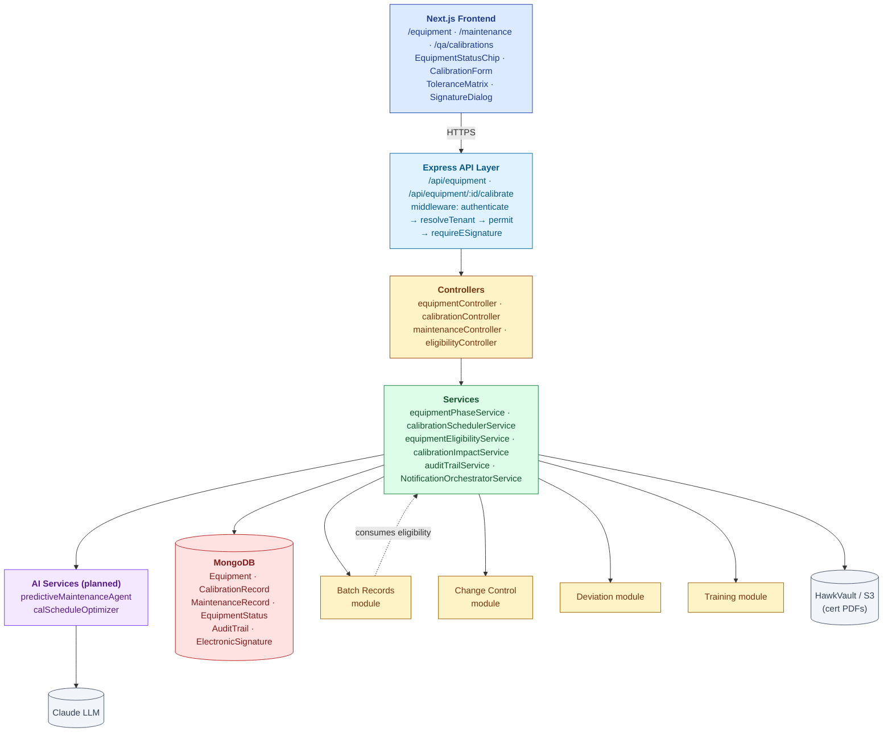
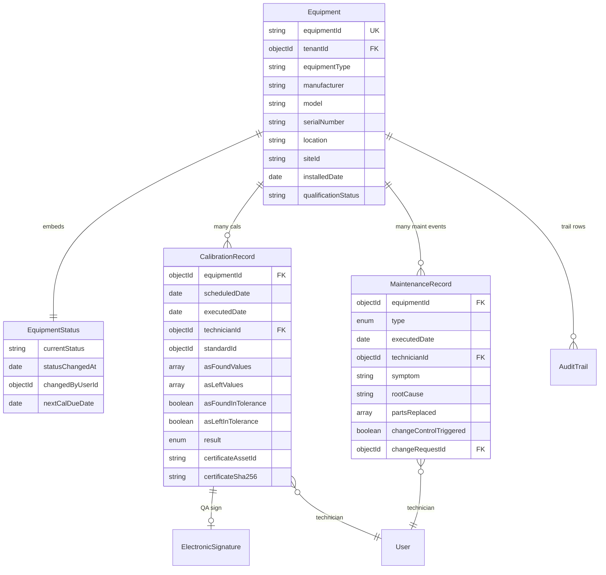
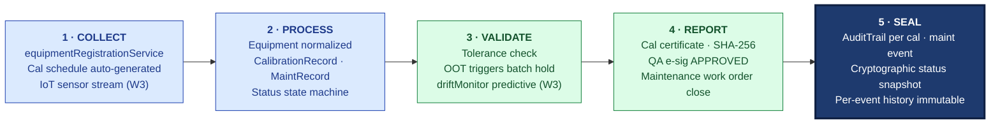

# ARCHITECTURE — Equipment Management

| Field | Value |
|---|---|
| Module | Equipment Management |
| Depth | Executive overview with planned code paths |
| Pairs with | [URS.md](URS.md), [DESIGN.md](DESIGN.md) |
| Last updated | 2026-06-01 |

---

## 1. System Context

**Tier ownership:**
- Frontend — equipment lists, cal forms, status chips, e-sig modal
- API + middleware — auth, RBAC, e-sig
- Controllers — thin
- Services — state transitions, scheduler logic, eligibility computation, impact analysis
- External modules — Batch Records (consumer), Change Control (sink for parts), Deviation (sink for OOT)

---

## 2. Data Model

### Primary entities

| Model | Purpose | Key fields | References |
|---|---|---|---|
| **Equipment** | Equipment master | `equipmentId`, `tenantId`, `equipmentType`, `manufacturer`, `model`, `serialNumber`, `location`, `siteId`, `installedDate`, `qualificationStatus`, `currentStatus` (embedded), `nextCalDueDate` | tenants, sites |
| **CalibrationRecord** | One cal event | `equipmentId`, `scheduledDate`, `executedDate`, `technicianId`, `standardId`, `asFoundValues[]`, `asLeftValues[]`, `asFoundInTolerance`, `asLeftInTolerance`, `result`, `certificateAssetId`, `certificateSha256` | Equipment, users, ElectronicSignature |
| **MaintenanceRecord** | One PM or CM event | `equipmentId`, `type` (PM/CM), `executedDate`, `technicianId`, `symptom`, `rootCause`, `partsReplaced[]`, `changeControlTriggered`, `changeRequestId?` | Equipment, users, Change Control |
| **EquipmentStatus** (embedded) | Current state | `currentStatus`, `statusChangedAt`, `changedByUserId`, `nextCalDueDate` | — |
| **AuditTrail** (cross-module) | Part 11 log | per platform schema | All |

### Indexes (key)

- `Equipment`: `(tenantId, currentStatus)`, `equipmentId` (unique), `(tenantId, siteId)`, `nextCalDueDate` (for due-soon queries)
- `CalibrationRecord`: `(equipmentId, executedDate)` desc; `(equipmentId, result)`; `asFoundInTolerance` (for OOT lookups)
- `MaintenanceRecord`: `(equipmentId, executedDate)` desc; `changeControlTriggered`

---

## 3. API Catalog (planned)

### Equipment master

| Endpoint | Roles | Purpose |
|---|---|---|
| `GET /api/equipment` | all (tenant-scoped) | List/filter |
| `GET /api/equipment/:id` | all | Detail |
| `POST /api/equipment` | maintenance_lead, tenant_admin | Create |
| `PATCH /api/equipment/:id` | maintenance_lead, tenant_admin | Update master |
| `GET /api/equipment/:id/eligibility` | all | Real-time eligibility (consumed by Batch Records) |
| `POST /api/equipment/:id/decommission` | qa | Move to OUT_OF_SERVICE (e-sig required) |

### Calibration

| Endpoint | Roles | Purpose |
|---|---|---|
| `POST /api/equipment/:id/calibrate` | maintenance_lead | Schedule new cal |
| `GET /api/equipment/:id/calibrations` | all | History |
| `POST /api/calibrations/:id/start` | technician | CAL_DUE → CAL_IN_PROGRESS |
| `POST /api/calibrations/:id/submit` | technician | Submit for QA review |
| `POST /api/calibrations/:id/approve` | qa | Sign APPROVED (e-sig) |
| `POST /api/calibrations/:id/reject` | qa | Reject with reason |
| `GET /api/equipment/:id/impact-analysis?calId=...` | qa, tenant_admin | List impacted batches (URS-B-004) |

### Maintenance

| Endpoint | Roles | Purpose |
|---|---|---|
| `POST /api/equipment/:id/maintain` | maintenance_lead | Schedule PM |
| `POST /api/equipment/:id/maintain/log` | technician | Log CM/PM execution |
| `GET /api/equipment/:id/maintenance` | all | History |

### Audit trail

| Endpoint | Roles | Purpose |
|---|---|---|
| `GET /api/equipment/:id/audit-trail` | all | Per-equipment trail |
| `GET /api/audit-trail/by-entity?type=Equipment&id=...` | all | Cross-module |

---

## 4. RBAC Matrix

| Capability | Technician | Maintenance Lead | QA | Production | Tenant Admin | Superadmin |
|---|---|---|---|---|---|---|
| Create equipment master | — | ✅ | — | — | ✅ | ✅ |
| Update master | — | ✅ | — | — | ✅ | ✅ |
| Schedule calibration | — | ✅ | — | — | ✅ | ✅ |
| Execute calibration | ✅ | — | — | — | ✅ | — |
| Sign-off calibration (e-sig) | — | — | ✅ | — | ✅ | — |
| Schedule maintenance | — | ✅ | — | — | ✅ | ✅ |
| Execute maintenance | ✅ | ✅ | — | — | ✅ | — |
| Decommission (e-sig) | — | ✅ | ✅ | — | ✅ | ✅ |
| Read eligibility | ✅ | ✅ | ✅ | ✅ | ✅ | ✅ |
| Read audit trail | ✅ | ✅ | ✅ | ✅ | ✅ | ✅ |

---

## 5. AI Capabilities

All AI routes through platform `groundedGenerationService` and is audit-trailed via `recordAiDecision`.

| Tool | Type | R/W | E-sig | Where | Status |
|---|---|---|---|---|---|
| **predictiveMaintenanceAgent** | Anomaly detection on cal drift | READ | NO | Dashboard widget + per-equipment trend panel | ⏳ planned Q3 2027 |
| **calScheduleOptimizer** | Recommend cadence adjustments per instance | READ | NO | Per-equipment "Suggested cadence" prompt | ⏳ planned |

### Grounding posture

Predictive maintenance grounds on actual cal history (no LLM hallucination — statistical drift model + LLM explanation only). Citations link to underlying cal records. `minConfidence: 0.7`. User disposition feedback feeds active-learning loop.

---

## 6. State Machine Implementation

Cross-reference [DESIGN §4](DESIGN.md#4-state-machine).

- **Definition:** `backend/src/constants/equipmentStatuses.js` (planned)
- **Validation:** `services/equipmentPhaseService.js → canTransition()`
- **Application:** `services/equipmentPhaseService.js → applyTransition()` — mutates `EquipmentStatus`, writes AuditTrail
- **Cadence scheduler:** `services/calibrationSchedulerService.js` — nightly cron computes which equipment moves to CALIBRATION_DUE
- **Eligibility:** `services/equipmentEligibilityService.js → isEligibleForBatch(equipmentId)` — returns boolean + reason; cached 30 sec

**Gate enforcement:**
- **G-QA-Cal** — `middlewares/requireESignature.js` on `/calibrations/:id/approve`
- **G-Decom** — `middlewares/requireESignature.js` on `/equipment/:id/decommission`

---

## 7. Compliance Traceability

| Feature | 21 CFR 211 | EU GMP | ICH Q7 | ISO 9001 | 21 CFR Part 11 |
|---|---|---|---|---|---|
| Equipment master | §211.105, §211.182 | Ch.3 | §5.1 | §7.1.5 | §11.10(b) |
| Calibration scheduling + execution | **§211.68** | **Ch.3, Annex 15** | §5.3 | §7.1.5.2 | §11.10(e) |
| Calibration QA e-sig | §211.68 | Ch.3 | §5.3 | §7.1.5.2 | **§11.50, §11.200** |
| As-found OOT → batch impact | §211.192 | Ch.1 | §6.7 | §10.2 | §11.10(e) |
| Maintenance records | §211.182 | Ch.3 | §5.2 | §7.1.5.3 | §11.10(b) |
| Part replacement → Change Control | — | Ch.3 §3.4 | §5.2 | §8.5.6 | §11.10(e) |
| Decommissioning + e-sig | §211.68 | Ch.3 | §5.2 | §7.1.5 | §11.50 |
| Cross-module audit trail | §211.180 | Ch.4 | §6.10 | §7.5 | **§11.10(e), §11.10(k)** |

---

## 8. Operational Concerns

### Performance targets
- Equipment list: < 500 ms for 5,000 records per tenant
- Eligibility lookup: < 100 ms p95 (called from Batch Records hot path)
- Cal-due dashboard: < 800 ms
- Impact analysis: < 5 sec for batches in last 90 days (URS-B-004)
- Calibration scheduler cron: nightly, complete in < 5 min per tenant

### Failure modes + recovery
- **Cal-cert PDF upload fails** → cal saved as PENDING_ATTACHMENT; retry queue
- **Scheduler cron fails** → next run picks up missed; alert if 2 consecutive failures
- **Eligibility cache stale on decommissioning** → cache TTL 30 sec; explicit invalidation on status change
- **Change Control auto-draft fails (part replacement)** → maintenance record saved, CR draft flagged as MISSING; manual followup
- **LLM provider down (predictive)** → predictive features hidden; cal scheduling still works
- **Concurrent cal edits** → optimistic lock via `updatedAt`

### Observability
- Per-tenant metrics: equipment count by status, cal compliance % (on-time vs late), mean cal cycle time, OOT rate
- Eligibility API p95/p99 latency (critical for Batch Records UX)
- Alerts: cal overdue ≥ 7 days; equipment in CAL_IN_PROGRESS > 5 days

---

## 9. Known Gaps + Engineering Debt

1. **IoT sensor ingest** — planned vertical pack, no commitment date
2. **Predictive maintenance AI** — planned Q3 2027
3. **Mobile shop-floor UX** — desktop-first today
4. **Equipment qualification (IQ/OQ/PQ) module** — separate Validation module (future)
5. **External standards traceability chain** — store cert IDs only today; chain modeling deferred
6. **Cleaning records** — to be modeled (211.182)
7. **Spare parts inventory** — out of scope v1
8. **Multi-tenant cron isolation** — currently single global cron loops tenants; performance acceptable < 1000 tenants

---

## 10. Open Engineering Questions

1. **Scheduler tech** — cron vs queue-driven (BullMQ)?
2. **Cache layer** for eligibility — in-process LRU vs Redis?
3. **Time-series for cal drift** — Mongo collection vs Influx (matters when predictive AI lands)?
4. **Cert PDF generation** — on-the-fly per request vs pre-generated and cached?
5. **Equipment hierarchy** (parent + children, e.g., HPLC system with detector + pump + autosampler) — should we model?
6. **Audit-trail volume** — calibrations are frequent; need archive strategy at 5y+ retention

---

## 11. Code Path Index (planned)

| Concern | Primary code path |
|---|---|
| Routes | `backend/src/routes/equipment*.js`, `calibration*.js`, `maintenance*.js` |
| Controllers | `backend/src/controllers/equipment*.js`, `calibration*.js`, `maintenance*.js` |
| Services | `backend/src/services/equipment*.js`, `calibrationSchedulerService.js`, `equipmentEligibilityService.js`, `calibrationImpactService.js` |
| Models | `backend/src/models/Equipment.js`, `CalibrationRecord.js`, `MaintenanceRecord.js` |
| Middlewares | `backend/src/middlewares/{authMiddleware,roleMiddleware,requireESignature}.js` |
| Constants | `backend/src/constants/equipmentStatuses.js` |
| AI | `backend/src/services/ai/predictiveMaintenanceAgent.js`, `calScheduleOptimizer.js` |
| Frontend pages | `frontend/app/(console)/equipment/**`, `maintenance/**`, `qa/calibrations/**` |
| Frontend components | `frontend/components/equipment/{EquipmentStatusChip,CalibrationForm,ToleranceMatrix,EligibilityBadge}.tsx` |
| Inter-module clients | `frontend/lib/clients/equipmentClient.ts` (consumed by Batch Records) |

---

## 12. The Five-Pillar Walkthrough

Equipment Management is the platform's calibration-and-fitness gatekeeper — when an instrument is out of calibration, batches stop. **COLLECT** opens with equipment-master registration via `equipmentRegistrationService` (`POST /api/equipment`), capturing manufacturer, model, serial, location, and qualification status; calibration and PM schedules auto-generate per equipment type, and (Wave-3) IoT sensor data streams in through `iotEquipmentFusion`. **PROCESS** normalizes the registration into an `Equipment` aggregate, links subsequent `CalibrationRecord` and `MaintenanceRecord` documents, and drives the embedded status state machine (`IN_SERVICE` → `CALIBRATION_DUE` → `CAL_IN_PROGRESS` → `CALIBRATED` → `OUT_OF_SERVICE`) advanced nightly by `calibrationSchedulerService`. **VALIDATE** is the load-bearing pillar: the technician records as-found and as-left values, the service checks tolerance per the per-equipment rubric, and an out-of-tolerance result fires `createBatchHoldFromOOT` to freeze any in-flight batches that used this instrument; predictive maintenance (Wave-3 `driftMonitor`) flags pre-failure drift. **REPORT** generates the calibration certificate, persists its SHA-256 hash to `certificateSha256`, and routes the record for QA e-signature (meaning=APPROVED) before status moves to CALIBRATED; maintenance work orders close with a similar approval path. **SEAL** writes an `AuditTrail` row per calibration and maintenance event and a cryptographic snapshot of equipment status — the immutable per-event history that 21 CFR Part 11 §11.68 requires for calibration records.

### Cross-module spawn notes

- **BLOCKS Batch Records** — `GET /api/equipment/:id/eligibility` on the Batch step-entry hot path; equipment not in `IN_SERVICE` or `CALIBRATED` returns NOT_ELIGIBLE and freezes the step
- **TRIGGERS Deviation** — out-of-tolerance as-found result automatically spawns a deviation (`createBatchHoldFromOOT` plus deviation creation) for every batch that used the instrument since the previous good calibration
- **TRIGGERS Change Control** — equipment modifications, part replacements (`MaintenanceRecord.changeControlTriggered=true`), and decommissioning create a linked `ChangeRequest`
- **FEEDS Risk** — equipment-related risks consume calibration history and OOT rate to weight equipment-process risk band
- **CONSUMES Training** — calibration technicians and equipment operators must be trained on the equipment's SOP; calls the Training eligibility API

### Code-path table

| Pillar | Code path | What it does |
|---|---|---|
| 1 · COLLECT | `backend/src/controllers/equipmentController.js`, `services/equipmentPhaseService.js`, `services/ai/iotEquipmentFusion.js` (W3) | Registers equipment master; auto-generates cal + PM schedules; IoT stream ingest |
| 2 · PROCESS | `services/calibrationSchedulerService.js`, `models/Equipment.js`, `models/CalibrationRecord.js`, `models/MaintenanceRecord.js`, `constants/equipmentStatuses.js` | Normalizes equipment; manages embedded status state machine; nightly cron transitions |
| 3 · VALIDATE | `controllers/calibrationController.js`, `services/calibrationImpactService.js → createBatchHoldFromOOT()`, `services/ai/predictiveMaintenanceAgent.js` (W3) | Tolerance check on as-found · as-left; OOT freezes impacted batches; predictive drift flag |
| 4 · REPORT | `controllers/calibrationController.js → approve`, `middlewares/requireESignature.js`, `services/calibrationCertificateService.js` | Generates cert PDF + SHA-256; enforces QA e-sig meaning=APPROVED; closes maintenance work orders |
| 5 · SEAL | `services/auditTrailService.js`, `models/AuditTrail.js`, `models/ElectronicSignature.js` | Writes Part 11 §11.68 audit row per cal + maintenance event; cryptographic snapshot of status |

