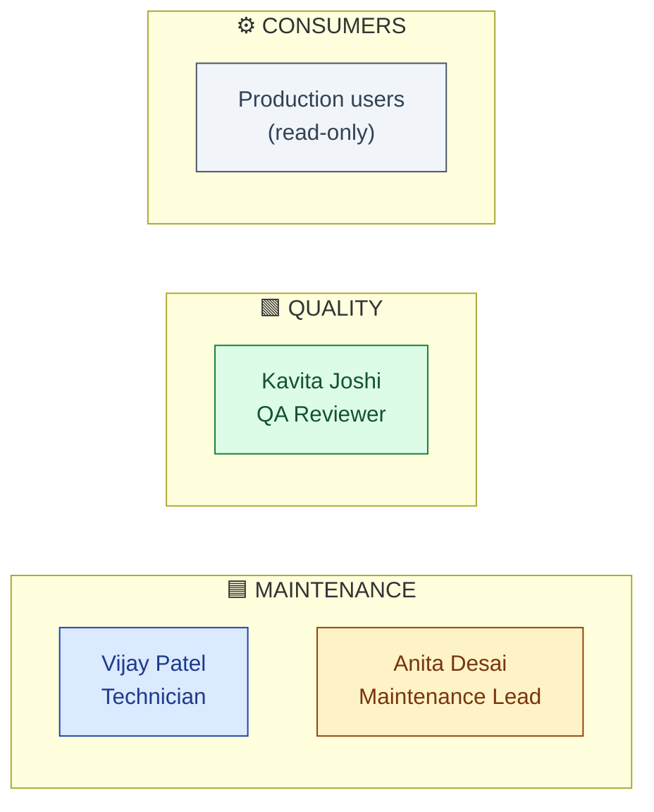
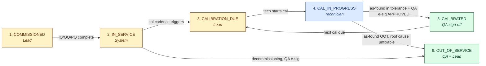
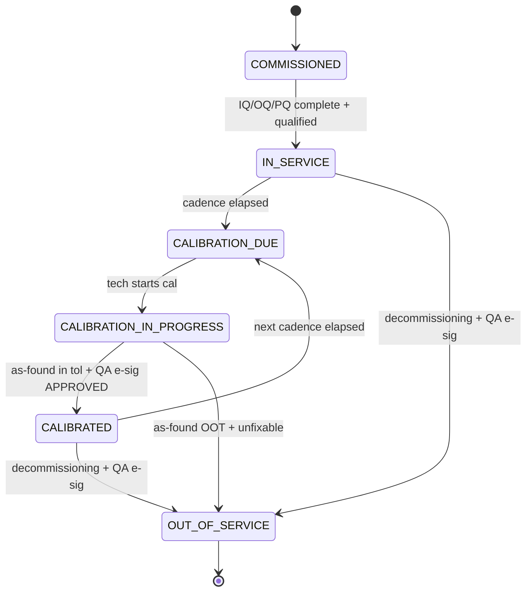

# DESIGN — Equipment Management

| Field | Value |
|---|---|
| Module | Equipment Management |
| Depth | Executive overview with pointers to planned code |
| Pairs with | [URS.md](URS.md), [ARCHITECTURE.md](ARCHITECTURE.md) |
| Last updated | 2026-06-01 |

---

## 1. Personas (3 primary, 2 secondary)



| # | Persona | Lane | Primary actions | Decisions |
|---|---|---|---|---|
| 1 | **Maintenance Technician** (Vijay) | 🟦 Maintenance | Execute cal/PM/CM; record results | Pass/fail per measurement |
| 2 | **Maintenance Lead** (Anita) | 🟦 Maintenance | Schedule cal + PM; assign tech; oversight | Cadence, tech allocation |
| 3 | **QA Reviewer** (Kavita) | 🟩 QA | Sign off calibration; approve decommissioning | APPROVED/REJECTED |
| 4 | Production users | ⚙️ Consumers | Check eligibility | None (read-only) |
| 5 | Tenant Admin | (platform) | Configure types, cadences, RBAC | Per-tenant config |

---

## 2. End-to-End Journey



### Journey snapshots

#### 🟦 Technician (Vijay)
```
1. Inbox          → /maintenance/queue          MyAssignedTasks
2. Open task      → /equipment/[id]/calibrations/[calId]   CalibrationForm
3. Scan equipment → barcode confirms instance
4. Record as-found values → SmartParameterInput (tolerance preview)
5. Perform calibration → record as-left values
6. Attach cert PDF → upload
7. Submit         → status: CAL_IN_PROGRESS → CALIBRATED_PENDING_QA
```

#### 🟦 Maintenance Lead (Anita)
```
1. Cal-due dashboard → /equipment?filter=due-soon       CalDueDashboard
2. Schedule cal      → SchedulerModal (pick date + tech)
3. Notify tech       → auto on assignment
4. Track completion  → CalQueueTable
```

#### 🟩 QA Reviewer (Kavita)
```
1. Inbox            → /qa/calibrations              QACalQueue
2. Open record      → /equipment/[id]/calibrations/[calId]/review
3. Review as-found vs spec → ToleranceMatrix
4. Sign APPROVED    → SignatureDialog (password + reason)  [QA gate]
5. Reject           → reason mandatory; cal stays IN_PROGRESS
```

---

## 3. Screen + Component Inventory

### Pages (planned, under `frontend/app/(console)/equipment/...`)

| Route | Purpose | Key components |
|---|---|---|
| `/equipment` | List + filter (status, type, location, due) | `EquipmentList`, `EquipmentStatusChip`, `CalDueChip` |
| `/equipment/[id]` | Detail hub | `EquipmentDetail`, `EquipmentStatusTimeline`, `EquipmentTabs` |
| `/equipment/[id]/calibrations` | Cal history | `CalibrationHistoryTable`, "Schedule" CTA |
| `/equipment/[id]/calibrations/[calId]` | Per-cal record | `CalibrationForm`, `ToleranceMatrix`, `SignatureDialog` |
| `/equipment/[id]/maintenance` | PM + CM history | `MaintenanceHistoryTable` |
| `/equipment/[id]/impact-analysis` | When as-found OOT, which batches affected | `ImpactAnalysisTable` (URS-B-004) |
| `/equipment/[id]/audit-log` | Part 11 trail | `AuditLogTable` |
| `/maintenance/queue` | Tech inbox | `MyAssignedTasks`, `CalQueueTable` |
| `/qa/calibrations` | QA review queue | `QACalQueue`, `QACalReviewPanel` |

### Cross-cutting components (planned)
- `EquipmentStatusChip` — color-coded status pill (6 states)
- `CalDueChip` — "Due in 5d" / "Overdue 3d"
- `ToleranceMatrix` — table of as-found / as-left / spec / pass-fail
- `EligibilityBadge` — for inline use in Batch Records (green/red)
- `SignatureDialog` — shared platform component

---

## 4. State Machine



**Ownership:**

| State | Owner | Notes |
|---|---|---|
| COMMISSIONED | Maintenance Lead | Awaiting qualification |
| IN_SERVICE | System | Normal operation |
| CALIBRATION_DUE | Maintenance Lead | Scheduled but not started |
| CAL_IN_PROGRESS | Technician | Doing the work |
| CALIBRATED | QA | QA signed off |
| OUT_OF_SERVICE | QA + Lead | Permanent (decommissioned) |

**Eligibility for batch execution:** only `IN_SERVICE` and `CALIBRATED` are eligible. All others block downstream batch step entry.

**Gates:**

| Gate | Trigger | Enforcer |
|---|---|---|
| **G-QA-Cal** | CAL_IN_PROGRESS → CALIBRATED | QA e-sig APPROVED |
| **G-Decom** | * → OUT_OF_SERVICE | QA e-sig + reason mandatory |

---

## 5. Notifications

| Event | Recipients | Channel |
|---|---|---|
| Calibration due in 14 / 7 / 1 days | Maintenance Lead | Email + dashboard |
| Calibration overdue | Lead + QA + tenant_admin | Email (escalation) |
| Cal assigned to tech | Technician | Email + dashboard |
| Cal submitted for QA review | QA queue | Dashboard |
| QA approved | Lead + Tech | Email |
| QA rejected | Tech (rework) | Email |
| Out-of-tolerance as-found | QA + Lead + downstream batch owners | Email (urgent) |
| Equipment decommissioned | Production users referencing it | Email |

---

## 6. Edge Cases

| Scenario | Handling |
|---|---|
| **Cal due during weekend/holiday** | Schedule grace period configurable per tenant; default 3 days |
| **Multiple technicians edit same cal record** | Optimistic lock; second editor sees stale-data error |
| **As-found OOT but as-left in tol** | Still passes cal AND creates retrospective batch-impact analysis |
| **Calibration standard expired** | Block cal entry; surface std-status |
| **Equipment moved between sites** | Location update audit-trailed; reassign to site-specific tech |
| **Decommissioning with open future cal scheduled** | Cancel cal; audit-trail the cancellation |
| **Tech not trained on this equipment type** | Block cal assignment; surface training gap |
| **Cert PDF upload fails** | Cal save allowed with retry-upload pending; status held PENDING_ATTACHMENT |

---

## 7. Accessibility

- Keyboard nav: all forms tab-traversable; barcode scanner triggers auto-focus
- Screen reader: ARIA labels on status chips, tolerance matrix cells
- Color contrast: status colors meet WCAG AA; also encoded with icons
- Mobile-responsive: cal form usable on tablet (shop floor)
- Focus management: SignatureDialog traps focus

---

## 8. Open Design Questions

1. **Mobile-first cal form** — full responsive vs dedicated mobile app?
2. **Cal cert PDF templates** — per-tenant or platform default?
3. **Impact analysis surface** — auto-create CAPA on confirmation or just produce list?
4. **Cleaning records UX** — separate tab or unified with maintenance?
5. **Calibration history timeline visualization** — drift chart? trend line?
6. **Predictive maintenance hints in CalibrationForm** — inline suggestion vs separate panel?
