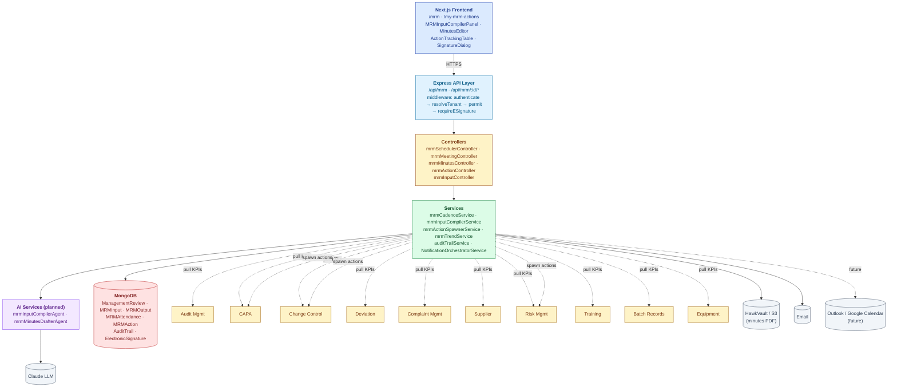
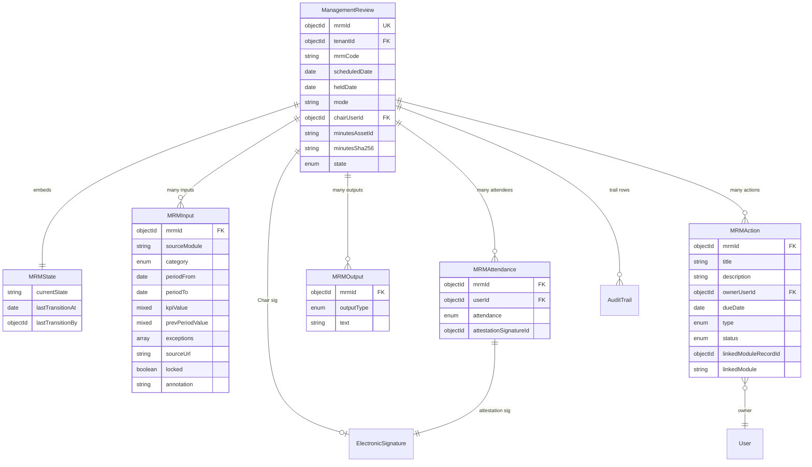
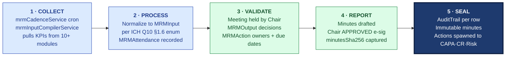

# ARCHITECTURE — Management Review (MRM)

| Field | Value |
|---|---|
| Module | Management Review |
| Depth | Executive overview with planned code paths |
| Pairs with | [URS.md](URS.md), [DESIGN.md](DESIGN.md) |
| Last updated | 2026-06-01 |

---

## 1. System Context

**Tier ownership:**
- Frontend — list/detail, compiler panel, minutes editor, action board, e-sig modal
- API + middleware — auth, RBAC, e-sig
- Controllers — thin
- Services — cadence cron, input aggregation, minutes lifecycle, action spawning, trend computation
- External modules — every operating module is both a KPI source (pull) AND a sink for spawned actions (CAPA/CR/Risk)

---

## 2. Data Model

### Primary entities

| Model | Purpose | Key fields | References |
|---|---|---|---|
| **ManagementReview** | MRM aggregate root | `mrmId`, `tenantId`, `mrmCode` (e.g., `MRM2026Q2`), `scheduledDate`, `heldDate`, `mode`, `chairUserId`, `minutesAssetId`, `minutesSha256`, `state` | tenants, users |
| **MRMInput** | One input row | `mrmId`, `sourceModule`, `category` (per ICH Q10 §1.6 enum), `periodFrom/To`, `kpiValue`, `prevPeriodValue`, `exceptions[]`, `sourceUrl`, `locked`, `annotation` | ManagementReview, source modules |
| **MRMAttendance** | Per-attendee record | `mrmId`, `userId`, `attendance` (PRESENT/ABSENT/APOLOGIES), `attestationSignatureId` | ManagementReview, users, ElectronicSignature |
| **MRMOutput** | Decision / output | `mrmId`, `outputType` (DECISION/IMPROVEMENT/RESOURCE/OBSERVATION), `text` | ManagementReview |
| **MRMAction** | Action item | `mrmId`, `title`, `description`, `ownerUserId`, `dueDate`, `type` (INFO/CAPA/CR/RISK/TRAINING), `status`, `linkedModuleRecordId`, `linkedModule` | ManagementReview, users, CAPA/CR/Risk |
| **AuditTrail** (cross-module) | Part 11 log | per platform schema | All |

### Indexes (key)

- `ManagementReview`: `(tenantId, scheduledDate desc)`, `(tenantId, state)`, `mrmCode` (unique per tenant)
- `MRMInput`: `(mrmId, category)`, `(sourceModule, periodFrom)`
- `MRMAction`: `(ownerUserId, status)` for inbox; `(mrmId, status)` for tracking; `dueDate` for overdue scans
- `MRMAttendance`: `(mrmId, userId)` unique

---

## 3. API Catalog (planned)

### Lifecycle

| Endpoint | Roles | Purpose |
|---|---|---|
| `GET /api/mrm` | all (tenant-scoped) | List with filter |
| `GET /api/mrm/:id` | all | Detail |
| `POST /api/mrm` | tenant_admin, qa_ops | Schedule ad-hoc MRM |
| `POST /api/mrm/:id/compile-inputs` | qa_ops | Trigger input aggregation (invokes compiler agent if AI enabled) |
| `POST /api/mrm/:id/lock-inputs` | qa_ops | INPUTS_COMPILED |
| `POST /api/mrm/:id/hold-meeting` | qa_ops | Mark MEETING_HELD post-event |
| `POST /api/mrm/:id/attendance` | attendee | Self-attest (e-sig ATTENDED) |
| `POST /api/mrm/:id/draft-minutes` | qa_ops | Submit MINUTES_DRAFTED (optionally invokes drafter agent) |
| `POST /api/mrm/:id/approve` | chair | E-sig APPROVED (G-Approve) |
| `POST /api/mrm/:id/close` | chair | CLOSED (G-Close, requires all actions resolved) |

### Inputs

| Endpoint | Roles | Purpose |
|---|---|---|
| `GET /api/mrm/:id/inputs` | all | List inputs |
| `POST /api/mrm/:id/inputs` | qa_ops | Add manual input |
| `PATCH /api/mrm/:id/inputs/:inputId` | qa_ops | Annotate / override (audit-trailed) |

### Actions

| Endpoint | Roles | Purpose |
|---|---|---|
| `GET /api/mrm/:id/actions` | all | List |
| `POST /api/mrm/:id/actions` | chair, qa_ops | Create (spawns linked CAPA/CR/Risk if type triggers) |
| `PATCH /api/mrm/actions/:actionId` | owner | Update status / evidence |
| `POST /api/mrm/actions/:actionId/close` | owner | Mark CLOSED with sign-off |
| `GET /api/my-mrm-actions` | any | Owner inbox |

### Trends

| Endpoint | Roles | Purpose |
|---|---|---|
| `GET /api/mrm/trends?category=...&periods=N` | all | Cross-MRM trend data |

### Audit trail

| Endpoint | Roles | Purpose |
|---|---|---|
| `GET /api/mrm/:id/audit-trail` | all | Per-MRM |
| `GET /api/audit-trail/by-entity?type=ManagementReview&id=...` | all | Cross-module |

---

## 4. RBAC Matrix

| Capability | Chair | Attendee | Action Owner | QA Ops | Tenant Admin | Superadmin |
|---|---|---|---|---|---|---|
| Schedule MRM | — | — | — | ✅ | ✅ | ✅ |
| Compile/lock inputs | — | — | — | ✅ | ✅ | — |
| View agenda + inputs | ✅ | ✅ | — | ✅ | ✅ | ✅ |
| Attendance attest (e-sig) | ✅ (self) | ✅ (self) | — | ✅ (self) | ✅ (self) | — |
| Draft minutes | — | — | — | ✅ | ✅ | — |
| Approve minutes (e-sig) | **✅** | — | — | — | ✅ | ✅ |
| Create action item | ✅ | — | — | ✅ | ✅ | ✅ |
| Update/close own action | — | — | ✅ | — | ✅ | — |
| Close MRM | ✅ | — | — | — | ✅ | ✅ |
| Read trends | ✅ | ✅ | — | ✅ | ✅ | ✅ |
| Read audit trail | ✅ | ✅ | ✅ | ✅ | ✅ | ✅ |

**Cross-tenant guards:** MRMs are strictly per-tenant; no cross-tenant access (sub-tenant rollup is open question #6).

---

## 5. AI Capabilities

All routes through platform `groundedGenerationService` and audit-trailed via `recordAiDecision`.

| Tool | Type | R/W | E-sig | Where | Status |
|---|---|---|---|---|---|
| **mrmInputCompilerAgent** | Aggregate inputs + draft executive summary per category | READ (drafts inputs + summaries) | NO | `MRMInputCompilerPanel` "Compile" CTA | ⏳ planned Q2 2027 |
| **mrmMinutesDrafterAgent** | Generate structured minutes from recording transcript | READ (draft) | NO (QA Ops + Chair review) | `MinutesEditor` "Draft from recording" CTA | ⏳ planned (transcription integration TBD) |

### Grounding posture

- `mrmInputCompilerAgent` — grounds on each module's input endpoint; citations link to source records; `minConfidence: 0.7`; skeleton fallback (raw KPIs without narrative) if confidence low
- `mrmMinutesDrafterAgent` — grounds on locked inputs + transcript; citations tie each minute statement to transcript timestamp + agenda item; QA Ops always edits before submitting; Chair always reviews before sign

### Active learning

Chair + QA Ops disposition (USER_ACCEPTED / USER_EDITED / USER_REJECTED) feeds the loop. High-rejection categories trigger prompt tuning review.

---

## 6. State Machine Implementation

Cross-reference [DESIGN §4](DESIGN.md#4-state-machine).

- **Definition:** `backend/src/constants/mrmStates.js` (planned)
- **Validation:** `services/mrmPhaseService.js → canTransition()`
- **Application:** `services/mrmPhaseService.js → applyTransition()` — mutates state, writes AuditTrail
- **Cadence cron:** `services/mrmCadenceService.js` — nightly job creates SCHEDULED MRMs per tenant cadence
- **Reminder cron:** `services/mrmReminderService.js` — daily job sends T-30/T-14/T-7 alerts

**Gate enforcement:**
- **G-Inputs** — `mrmInputController.lockInputs()` flips `locked=true` on every input; subsequent edits create new revisions
- **G-Approve** — `middlewares/requireESignature.js` with `signatureMeaning='APPROVED'`; signer must be the `chairUserId` (verified at controller)
- **G-Close** — `mrmPhaseService.canTransitionToClosed()` requires `MRMAction.find({mrmId, status: {$ne: 'CLOSED'}}).count() === 0` OR explicit carry-forward records
- **G-Attest** — `middlewares/requireESignature.js` with `signatureMeaning='ATTENDED'`; one attestation per attendee enforced via unique index

**Action spawning:** `services/mrmActionSpawnerService.js` — on action create with type CAPA/CR/RISK, calls the respective module's create-from-mrm API and stores `linkedModule` + `linkedModuleRecordId`. Closure events from spawned records flow back via webhook/event to mark MRMAction CLOSED.

---

## 7. Compliance Traceability

| Feature | ICH Q10 | ISO 9001 | EU GMP Ch.1 | 21 CFR Part 11 |
|---|---|---|---|---|
| Periodic management review cadence | **§1.6** | **§9.3** | **§1.7** | — |
| Standardized inputs (audit, CAPA, complaints, ...) | **§1.6** | **§9.3.2** | §1.7 | — |
| Documented outputs (decisions, improvements, resources) | **§1.6** | **§9.3.3** | §1.8 | — |
| Action items with owners + due dates | §1.6 | §9.3.3 | §1.9 | §11.10(e) |
| Chair sign-off on minutes (e-sig) | §1.6 | §9.3 | §1.7 | **§11.50, §11.200** |
| Attendee attestation | — | §9.3 | §1.7 | §11.50 |
| Immutable approved minutes (with hash) | §3.2.4 | §7.5 | §1.7 | §11.10(c) + §11.10(e) |
| Cross-module action linkage (closed-loop PQS) | **§1.6 + §1.4** | §9.3.3 | §1.8 | §11.10(e) |
| Audit trail | §3.2.4 | §7.5.3 | §1.9 | **§11.10(e), §11.10(k)** |
| Retention | §3.2.4 | §7.5 | §1.7 | §11.10(c) |

---

## 8. Operational Concerns

### Performance targets
- MRM detail load (with all inputs): < 1.5 sec
- Compile-inputs (auto): < 30 sec across 10 modules
- Trend chart (cross-MRM): < 2 sec for 12 MRMs × 10 categories
- Owner action inbox: < 500 ms

### Failure modes + recovery
- **Source module input endpoint down during compile** — show stale + warning; allow manual entry; retry job
- **Action spawn to CAPA module fails** — MRMAction created with `status=SPAWN_FAILED`; QA Ops retries from UI
- **Cadence cron skipped** — next nightly run picks up missed; alert on 2 consecutive failures
- **Chair e-sig password fail** — no state change; AuditTrail SIGNATURE_FAILED; retry
- **LLM provider down** — both AI tools fall back to raw aggregation (no narrative); nothing blocked
- **Concurrent minutes edits** — optimistic lock on `updatedAt`
- **Action item linked-module record deleted upstream** — MRMAction stays; flagged "linked record missing"; manual reconcile

### Observability
- Per-tenant metrics: MRMs scheduled/held/closed, time-to-close, action item closure %, on-time action rate, recurring categories
- Compile-inputs latency p95/p99
- Alerts: scheduled MRM ≥ 14 days past with no compile; minutes drafted ≥ 30 days without approval; action overdue ≥ 30 days

---

## 9. Known Gaps + Engineering Debt

1. **Auto-input compilation AI** — planned Q2 2027
2. **Recording transcription integration** — provider TBD
3. **Calendar integration** (Outlook / Google) — future
4. **Sub-tenant rollup** (corporate MRM consuming site MRMs) — out of scope v1
5. **Anonymous voting** — not supported
6. **Per-section RBAC on minutes** (confidentiality) — flat RBAC today
7. **External attendees** (guests, observers, regulators) — guest account model TBD
8. **Cross-MRM trend chart** — basic v1; advanced analytics deferred

---

## 10. Open Engineering Questions

1. **Event-driven action closure feedback** — when a spawned CAPA closes, how does it notify MRM? Webhook? Event bus? Polling?
2. **Standardized input contract across modules** — should we define a shared MRMInput envelope schema or accept per-module variation?
3. **Storage of input snapshots** — denormalize values into MRMInput or store reference + render live?
4. **Trend data computation** — pre-aggregate nightly vs compute on-demand?
5. **Minutes PDF generation** — server-side render vs headless browser?
6. **Multi-region deployment** — same as platform questions

---

## 11. Code Path Index (planned)

| Concern | Primary code path |
|---|---|
| Routes | `backend/src/routes/mrm*.js` |
| Controllers | `backend/src/controllers/mrm*.js` |
| Services | `backend/src/services/mrm*.js`, `mrmCadenceService.js`, `mrmInputCompilerService.js`, `mrmActionSpawnerService.js`, `mrmTrendService.js` |
| Models | `backend/src/models/ManagementReview.js`, `MRM*.js` |
| Middlewares | `backend/src/middlewares/{authMiddleware,roleMiddleware,requireESignature}.js` |
| Constants | `backend/src/constants/mrmStates.js`, `mrmInputCategories.js` |
| AI | `backend/src/services/ai/mrmInputCompilerAgent.js`, `mrmMinutesDrafterAgent.js` |
| Cron jobs | `backend/src/jobs/{mrmCadenceJob,mrmReminderJob,mrmTrendAggregatorJob}.js` |
| Inter-module clients (input endpoints) | `backend/src/clients/mrmInputClient/{auditClient,capaClient,...}.js` |
| Frontend pages | `frontend/app/(console)/mrm/**`, `my-mrm-actions/**` |
| Frontend components | `frontend/components/mrm/{MRMPhaseStepper,MRMInputCompilerPanel,MinutesEditor,ActionTrackingTable,InputCard}.tsx` |

---

## 12. The Five-Pillar Walkthrough

Management Review is the closed-loop apex of S.M.A.R.T. Hawk's PQS: it is the one module that consumes KPIs from every other module and re-emits actions back into them. The five pillars walk as follows: **Sense** happens via the `mrmCadenceService` cron that schedules periodic MRMs (typically quarterly per ICH Q10 §1.6) and the `mrmInputCompilerService` which aggregates inputs from every operating module — audit findings, CAPA effectiveness, complaint trends, deviation trends, risk register, training KPIs, supplier performance, change-control summary, regulatory updates (auto-compilation planned Q2 2027; manual today). **Monitor** normalizes each input into an `MRMInput` row tagged with ICH Q10 §1.6 / ISO 9001 §9.3 category enums, and records `MRMAttendance` per invitee. **Analyze** is the meeting itself: the chair walks the locked input set, decisions are recorded as `MRMOutput` rows, and action items get owners + due dates in `MRMAction`. **Record** assembles the minutes (auto-drafter from recording planned Wave-3), which the Chair signs with an APPROVED e-signature. **Trace** writes an `AuditTrail` row per input, output, attendance attestation, and Chair sign-off; the minutes PDF is hashed (`minutesSha256`) and stored immutably, and `mrmActionSpawnerService` distributes action items as live CAPA / Change Control / Risk records.

### Cross-module spawn notes

- **CONSUMES** KPIs from every operating module via `mrmInputClient/*` (audit, CAPA, change control, deviation, complaint, supplier, risk, training, batch records, equipment) — pull-mode at compile time
- **SPAWNS** `CAPA` records when an `MRMAction.type === 'CAPA'` (via `mrmActionSpawnerService` calling the CAPA module's create-from-mrm API)
- **SPAWNS** `ChangeRequest` records when `type === 'CR'`
- **SPAWNS** `RiskReview` records when `type === 'RISK'`
- **SPAWNS** `TrainingAssignment` records when `type === 'TRAINING'`
- Spawned records back-link to MRM via `linkedModule` + `linkedModuleRecordId`; closure events flow back via event/webhook to mark the parent `MRMAction` CLOSED (event-bus contract is open question #1)

### Code-path table

| Pillar | Code path | What it does |
|---|---|---|
| 1 · Sense | `backend/src/jobs/mrmCadenceJob.js` · `backend/src/services/mrmCadenceService.js` | Nightly cron creates SCHEDULED MRMs per tenant cadence |
| 1 · Sense | `backend/src/services/mrmInputCompilerService.js` · `backend/src/clients/mrmInputClient/*.js` | Aggregates KPIs from each operating module's input endpoint |
| 2 · Monitor | `backend/src/controllers/mrmInputController.js` · `backend/src/models/MRMInput.js` | Normalizes inputs into MRMInput rows; categories per `constants/mrmInputCategories.js` |
| 2 · Monitor | `backend/src/controllers/mrmMeetingController.js` · `backend/src/models/MRMAttendance.js` | Records per-attendee attestation with e-sig |
| 3 · Analyze | `backend/src/controllers/mrmMeetingController.js` · `backend/src/models/MRMOutput.js` · `MRMAction.js` | Captures decisions and action items during meeting |
| 4 · Record | `backend/src/controllers/mrmMinutesController.js` · `backend/src/services/ai/mrmMinutesDrafterAgent.js` | Drafts minutes (manual or AI-assisted from recording) |
| 4 · Record | `backend/src/middlewares/requireESignature.js` (`signatureMeaning='APPROVED'`) | Chair e-signature on minutes (G-Approve gate) |
| 5 · Trace | `backend/src/services/auditTrailService.js` | Writes AuditTrail row per input · output · attendance · sign-off |
| 5 · Trace | `backend/src/services/mrmActionSpawnerService.js` | Spawns CAPA · CR · Risk · Training records from MRMAction rows |
| 5 · Trace | `backend/src/services/mrmPhaseService.js → applyTransition()` (CLOSED) | Immutable closure with `minutesSha256` hash captured |
