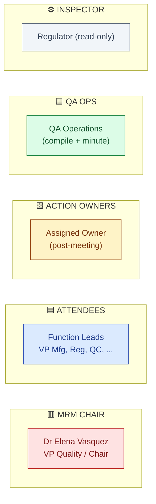
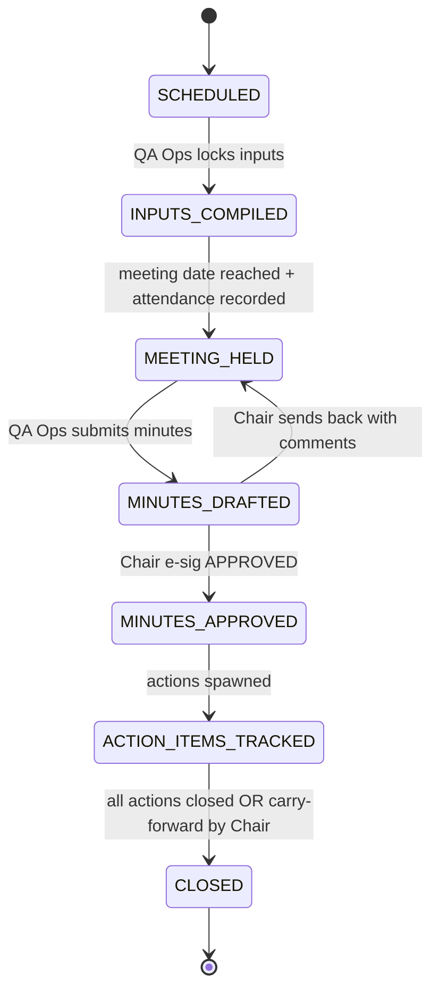

# DESIGN — Management Review (MRM)

| Field | Value |
|---|---|
| Module | Management Review |
| Depth | Executive overview with pointers to planned code |
| Pairs with | [URS.md](URS.md), [ARCHITECTURE.md](ARCHITECTURE.md) |
| Last updated | 2026-06-01 |

---

## 1. Personas (3 primary, 2 secondary)



| # | Persona | Lane | Primary actions | Decisions |
|---|---|---|---|---|
| 1 | **Chair** (Elena, VP Quality) | 🟥 Chair | Approve minutes (e-sig); decide on action items; close MRM | Decisions, action assignments, MRM close |
| 2 | **Attendees** (function leads) | 🟦 Attendees | Attend, attest attendance (e-sig); contribute discussion | Discussion + agreement |
| 3 | **Action Owner** | 🟨 Owner | Own action item; deliver evidence; close | Closure |
| 4 | **QA Ops** | 🟩 Ops | Compile inputs; draft agenda; record minutes | Operational |
| 5 | **Regulator** | ⚙️ Inspector | Read-only review | None |

---

## 2. End-to-End Journey

```mermaid
flowchart LR
    classDef sys fill:#f1f5f9,stroke:#475569,color:#334155
    classDef ops fill:#dcfce7,stroke:#15803d,color:#14532d
    classDef meet fill:#dbeafe,stroke:#1e40af,color:#1e3a8a
    classDef chair fill:#fee2e2,stroke:#b91c1c,color:#7f1d1d
    classDef owner fill:#fef3c7,stroke:#92400e,color:#78350f

    SCHED["1. SCHEDULED<br/><i>System (cron)</i>"]:::sys
    COMP["2. INPUTS_COMPILED<br/><i>QA Ops</i>"]:::ops
    HELD["3. MEETING_HELD<br/><i>Attendees</i>"]:::meet
    DRAFT["4. MINUTES_DRAFTED<br/><i>QA Ops</i>"]:::ops
    APPR["5. MINUTES_APPROVED<br/><i>Chair e-sig</i>"]:::chair
    TRACK["6. ACTION_ITEMS_TRACKED<br/><i>Owners</i>"]:::owner
    CLOSED["7. CLOSED<br/><i>Chair (when actions done)</i>"]:::chair

    SCHED -->|T-30d alert| COMP
    COMP -->|inputs locked| HELD
    HELD -->|attendance attested| DRAFT
    DRAFT -->|chair e-sig APPROVED| APPR
    APPR -->|actions spawned to CAPA/CR/Risk| TRACK
    TRACK -->|all closed or carry-forward| CLOSED
```



### Journey snapshots

#### 🟩 QA Ops
```
1. T-30 alert       → /mrm/upcoming               UpcomingMRMList
2. Open MRM         → /mrm/[id]                   MRMDetail
3. Click "Compile inputs" → MRMInputCompilerPanel  (one-click auto-pull from all modules)
4. Review + annotate inputs → InputEditor (per category)
5. Lock inputs      → confirms inputs are final
6. After meeting → /mrm/[id]/meeting → MinutesEditor
7. Submit for Chair approval
```

#### 🟦 Attendees (function leads)
```
1. T-7 calendar invite + link → /mrm/[id]/agenda  AgendaPreview (read-only inputs)
2. Attend meeting (in-person / remote)
3. Post-meeting: /mrm/[id]/attest → SignatureDialog (e-sig ATTENDED)
```

#### 🟥 Chair (Elena)
```
1. /mrm/[id]/minutes → MinutesReviewPanel  (full minutes + action items + linked inputs)
2. Edits / comments  → inline comments
3. Sign APPROVED     → SignatureDialog (password + reason)  [G-Approve gate]
4. Spawn actions     → CAPA/CR/Risk records auto-created (with MRM back-link)
5. Later: /mrm/[id]/actions → ActionTrackingTable (status of all)
6. When all closed   → Click "Close MRM"  [G-Close gate]
```

#### 🟨 Action Owner
```
1. /my-mrm-actions  → MyActionInbox  (mixed MRM + CAPA + CR)
2. Open action      → /mrm/[id]/actions/[actionId]
3. Add evidence + status updates
4. Mark COMPLETE    → with sign-off
5. (If CAPA-type) the underlying CAPA workflow drives closure; MRM action follows
```

---

## 3. Screen + Component Inventory

### Pages (planned, under `frontend/app/(console)/mrm/...`)

| Route | Purpose | Key components |
|---|---|---|
| `/mrm` | List of past + upcoming MRMs | `MRMList`, `MRMStateChip` |
| `/mrm/upcoming` | Pre-meeting work queue | `UpcomingMRMList`, T-N alerts |
| `/mrm/[id]` | Hub | `MRMDetail`, `MRMPhaseStepper`, `MRMTabs` |
| `/mrm/[id]/inputs` | Compiled inputs | `MRMInputCompilerPanel`, per-category `InputCard` |
| `/mrm/[id]/agenda` | Attendee-facing read-only preview | `AgendaPreview` |
| `/mrm/[id]/meeting` | Meeting record | `MeetingMetadataForm`, `AttendeeList`, `RecordingLink` |
| `/mrm/[id]/attest` | Attendance attestation | `SignatureDialog` (ATTENDED) |
| `/mrm/[id]/minutes` | Minutes draft + approval | `MinutesEditor`, `MinutesReviewPanel`, `SignatureDialog` (APPROVED) |
| `/mrm/[id]/actions` | Action item board | `ActionTrackingTable`, status chips |
| `/mrm/[id]/actions/[actionId]` | Per-action detail | `ActionDetail`, evidence upload |
| `/mrm/[id]/audit-log` | Part 11 trail | `AuditLogTable` |
| `/mrm/trends` | Cross-MRM trends | `TrendChart`, recurring-themes panel |
| `/my-mrm-actions` | Owner's inbox | `MyActionInbox` |

### Cross-cutting components (planned)
- `MRMStateChip` — 7-state pill
- `InputCard` — per-category KPI + trend + drill-in
- `MinutesEditor` — rich text + structured action items
- `ActionTrackingTable` — status with cross-module link indicator
- `SignatureDialog` — shared platform (variants: ATTENDED, APPROVED)
- `MRMPhaseStepper` — 7-phase visual

---

## 4. State Machine



**Ownership:**

| State | Owner | Notes |
|---|---|---|
| SCHEDULED | System (cron) | Auto-created per cadence |
| INPUTS_COMPILED | QA Ops | Inputs locked |
| MEETING_HELD | Attendees | Meeting completed + attendance attested |
| MINUTES_DRAFTED | QA Ops | Minutes ready for Chair |
| MINUTES_APPROVED | Chair | E-sig APPROVED |
| ACTION_ITEMS_TRACKED | Owners | Active tracking |
| CLOSED | Chair | All actions closed or carry-forward |

**Gates:**

| Gate | Trigger | Enforcer |
|---|---|---|
| **G-Inputs** | INPUTS_COMPILED entry | QA Ops "Lock inputs" CTA (audit-trailed) |
| **G-Approve** | MINUTES_DRAFTED → MINUTES_APPROVED | Chair e-sig APPROVED via `requireESignature` |
| **G-Close** | ACTION_ITEMS_TRACKED → CLOSED | All actions CLOSED OR Chair carry-forward with reason |
| **G-Attest** | per-attendee | Attendee e-sig ATTENDED |

---

## 5. Notifications

| Event | Recipients | Channel |
|---|---|---|
| T-30 / T-14 / T-7 before scheduled | Chair + QA Ops | Email |
| Inputs locked | Chair + attendees | Email + in-app |
| Meeting day | All attendees | Calendar reminder + in-app |
| Attendance ask (post-meeting) | Each attendee | Email + in-app |
| Minutes ready for Chair | Chair | Email + in-app (priority) |
| Minutes approved | Attendees + action owners | Email |
| Action assigned | Owner + manager | Email + in-app |
| Action due in 14 / 7 / 1 days | Owner | Email |
| Action overdue | Owner + Chair (escalation) | Email |
| MRM closed | All attendees | Email |

---

## 6. Edge Cases

| Scenario | Handling |
|---|---|
| **Quorum not met** | Chair can proceed with attestation note; or defer with reason (audit-trailed) |
| **Attendee unable to attest after meeting** | QA Ops can mark "absent" with reason; affects quorum count |
| **Input source module down during compile** | Show stale data with warning; allow manual entry; retry queue |
| **Minutes editing conflict** | Optimistic lock; second editor sees diff |
| **Chair edits minutes after approval** | Blocked; must create new revision with reason |
| **Action item type changed (info → CAPA) post-creation** | New CAPA spawned; old info-action archived; full audit trail |
| **All actions closed but Chair forgets to close MRM** | Auto-prompt at 30 days post-last-action-closed |
| **Carry-forward action without close** | Chair can roll to next MRM (creates linked action in next MRM record) |
| **Sub-tenant MRM rollup** | Out of scope v1 — open question #6 |

---

## 7. Accessibility

- Keyboard nav: agenda, minutes, action board all keyboard-navigable
- Screen reader: ARIA on state chips, KPI cards, action status, signature buttons
- Color contrast: WCAG AA; redundant text labels on status chips
- Focus management: SignatureDialog traps focus
- Print-friendly views for offline review (legacy regulator preference)

---

## 8. Open Design Questions

1. **Dashboard density for Chair** — how much to show on `/mrm` landing? 4 trend cards + upcoming MRM + open actions?
2. **Input override UX** — when QA Ops annotates a system-pulled KPI, how do we visually distinguish auto vs manual?
3. **Action item type at creation** — wizard that asks "is this info, CAPA, CR, Risk?" or single field?
4. **Cross-MRM trends visualization** — what's the right chart type? line per category? heatmap?
5. **Confidentiality / per-section RBAC** — needed when some content (regulator interactions) is restricted?
6. **Recording transcription UX** — single CTA "Draft minutes from recording" → review/edit → submit?
7. **Sub-tenant rollup UX** (open URS Q6) — corporate dashboard pulling site MRMs?
