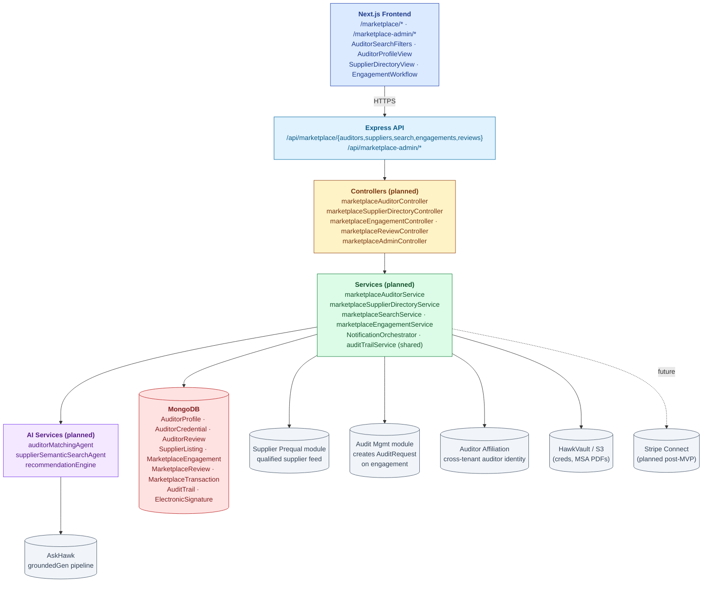
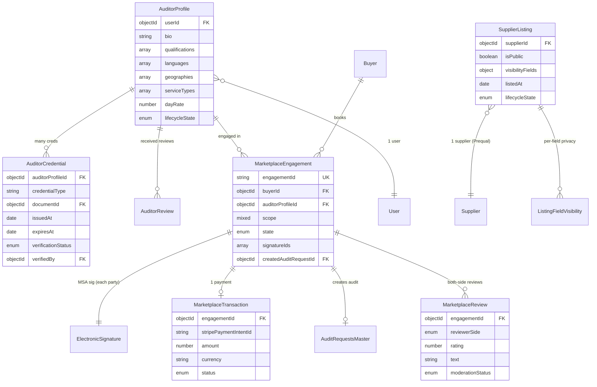
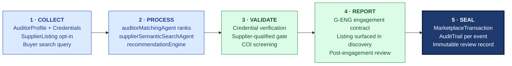

# ARCHITECTURE — Marketplace

| Field | Value |
|---|---|
| Module | Marketplace (v2) |
| Status | **PLAN STAGE** — partial backend scaffolding; most architecture aspirational |
| Depth | Executive overview |
| Pairs with | [URS.md](URS.md), [DESIGN.md](DESIGN.md) |
| Last updated | 2026-06-01 |

> ⚠️ Architecture below describes the **target state**. Today only catalog v2 models, org directory, engagement layer, and basic supplier-marketplace browse are scaffolded. See `backend/docs/marketplace-v2/IMPLEMENTATION_PLAN.md`.

---

## 1. System Context

**Tier ownership:**
- **Frontend** — search UI, profile views, engagement workflow, e-sig modal
- **API + middleware** — auth, RBAC (incl. marketplace_admin role), e-sig for MSA
- **Controllers** — thin (planned)
- **Services** — search ranking, engagement state machine, review moderation
- **AI** — matching, semantic search, recommendations (delegate to AskHawk)
- **External** — Stripe Connect (post-MVP), HawkVault for cred files
- **Cross-module** — Supplier Prequal (qualified list feed), Audit Mgmt (engagement → audit request), Auditor Affiliation (identity)

---

## 2. Data Model

### Primary entities

| Model | Purpose | Key fields |
|---|---|---|
| **AuditorProfile** | Auditor's marketplace listing | `userId`, `bio`, `qualifications[]`, `languages[]`, `geographies[]`, `serviceTypes[]`, `dayRate`, `lifecycleState` |
| **AuditorCredential** | Single credential record | `auditorProfileId`, `credentialType`, `documentId`, `issuedAt`, `expiresAt`, `verificationStatus`, `verifiedBy` |
| **AuditorReview** | Buyer review of auditor | `auditorProfileId`, `engagementId`, `rating`, `text`, `moderationStatus` |
| **SupplierListing** | Supplier's marketplace presence | `supplierId`, `isPublic`, `visibilityFields{}`, `lifecycleState` |
| **MarketplaceEngagement** | Booking record | `engagementId`, `buyerId`, `auditorProfileId`, `scope`, `state` (REQUESTED / NEGOTIATING / ACCEPTED / SIGNED / IN_PROGRESS / COMPLETED / CANCELLED), `signatureIds[]`, `createdAuditRequestId` |
| **MarketplaceReview** | Both-side review (buyer ↔ auditor) | `engagementId`, `reviewerSide`, `rating`, `text`, `moderationStatus` |
| **MarketplaceTransaction** | Payment record (post-Stripe) | `engagementId`, `stripePaymentIntentId`, `amount`, `currency`, `status` |
| **AuditTrail** (shared) | Cross-module log | Standard fields |
| **ElectronicSignature** (shared) | MSA + engagement contract sigs | Standard fields |

### Indexes

- `AuditorProfile`: `lifecycleState`, `(geographies, serviceTypes)`, `userId` (unique)
- `SupplierListing`: `(isPublic, lifecycleState)`, `supplierId` (unique)
- `MarketplaceEngagement`: `(buyerId, state)`, `(auditorProfileId, state)`, `engagementId` (unique)
- `MarketplaceReview`: `(auditorProfileId, moderationStatus)`, `engagementId`
- `AuditTrail`: shared cross-module indexes

---

## 3. API Contract Catalog (planned)

All paths require `authenticate`; RBAC via `permit(...roles)`.

### Buyer-side (search + booking)
| Endpoint | Roles | Purpose |
|---|---|---|
| `GET /api/marketplace/auditors/search` | buyer | Search auditors |
| `GET /api/marketplace/auditors/:id` | buyer (or public limited fields) | Profile |
| `GET /api/marketplace/suppliers/search` | buyer | Search suppliers |
| `GET /api/marketplace/suppliers/:id` | buyer | Supplier listing detail |
| `POST /api/marketplace/engagements` | buyer | Request engagement |
| `POST /api/marketplace/engagements/:id/counter` | buyer / auditor | Counter-propose |
| `POST /api/marketplace/engagements/:id/sign` | buyer + auditor (e-sig) | **G-ENG** MSA sign |
| `POST /api/marketplace/reviews` | buyer / auditor | Submit review |

### Auditor-side
| Endpoint | Roles | Purpose |
|---|---|---|
| `POST /api/marketplace/auditor/onboard` | auditor | Create profile |
| `GET/PATCH /api/marketplace/auditor/profile` | auditor | Edit |
| `POST /api/marketplace/auditor/credentials` | auditor | Upload cred |
| `GET /api/marketplace/auditor/engagements` | auditor | Inbox |
| `POST /api/marketplace/auditor/engagements/:id/accept` | auditor | Accept |
| `POST /api/marketplace/auditor/engagements/:id/decline` | auditor | Decline |

### Supplier-side
| Endpoint | Roles | Purpose |
|---|---|---|
| `POST /api/supplier/marketplace/listing/opt-in` | supplier | Opt in |
| `PATCH /api/supplier/marketplace/listing/visibility` | supplier | Privacy controls |
| `POST /api/supplier/marketplace/listing/opt-out` | supplier | Opt out |
| `GET /api/supplier/marketplace/analytics` | supplier (premium) | Views, leads, etc. |

### Admin
| Endpoint | Roles | Purpose |
|---|---|---|
| `GET /api/marketplace-admin/auditor-verifications` | marketplace_admin | Queue |
| `POST /api/marketplace-admin/auditors/:id/verify` | marketplace_admin | Approve/reject creds |
| `GET /api/marketplace-admin/disputes` | marketplace_admin | Dispute queue |
| `POST /api/marketplace-admin/reviews/:id/moderate` | marketplace_admin | Moderation decision |
| `POST /api/marketplace-admin/listings/:id/delist` | marketplace_admin | Delist |

### AI
| Endpoint | Roles | Purpose |
|---|---|---|
| `POST /api/marketplace/match/auditors` | buyer | AI-ranked auditor results |
| `POST /api/marketplace/match/suppliers` | buyer | Semantic supplier search |
| `GET /api/marketplace/recommendations/auditors` | buyer | "Auditors others used" |

---

## 4. RBAC Matrix

| Capability | Buyer | Auditor | Supplier | Marketplace Admin | Tenant Admin |
|---|---|---|---|---|---|
| Search auditors | ✅ | (own profile) | — | ✅ | ✅ |
| Search suppliers | ✅ | — | (own listing) | ✅ | ✅ |
| Create auditor profile | — | ✅ | — | — | — |
| Upload credentials | — | ✅ | — | — | — |
| Verify credentials | — | — | — | ✅ | — |
| Opt in/out supplier directory | — | — | ✅ | — | — |
| Configure visibility (supplier) | — | — | ✅ | — | — |
| Request engagement | ✅ | — | — | — | — |
| Accept/decline engagement | — | ✅ | — | — | — |
| Sign MSA (e-sig) | ✅ | ✅ | — | — | — |
| Submit review | ✅ (post-eng) | ✅ (post-eng) | — | — | — |
| Moderate reviews | — | — | — | ✅ | — |
| Delist | — | — | — | ✅ | — |

**Tenant boundary:**
- `marketplace_admin` is **platform-scoped** (cross-tenant) — distinct from tenant_admin
- Buyer queries scoped to: (a) own-tenant suppliers from Prequal + (b) cross-tenant suppliers per consent + (c) all listed auditors per COI clearance
- Auditor visibility cross-tenant by default (that's the marketplace value); COI filter applied at search

---

## 5. AI Capabilities (planned)

All AI delegates to AskHawk's `groundedGenerationService` per [AI-ARCHITECTURE.md](../../04-engineering/07-ai/AI-ARCHITECTURE.md).

| Tool | Type | R/W | E-sig | Where | Status |
|---|---|---|---|---|---|
| **auditorMatchingAgent** | Ranking algorithm | Read | No | `/marketplace/match/auditors` | ⏳ Plan |
| **supplierSemanticSearchAgent** | NL → listing match | Read | No | `/marketplace/match/suppliers` | ⏳ Plan |
| **recommendationEngine** | Collaborative filtering | Read | No | "Auditors others used" widget | ⏳ Plan |
| **auditorReputationScore** | Aggregate metric | Read | No | profile badge | ⏳ Plan |

### Grounding posture (planned)
- Matching: confidence floor 0.6; rationale ("ranked because of qualification fit X, availability Y, past-success Z") cited per rank
- Semantic search: embedding-based; relevance score per result
- All AI calls write `recordAiDecision()` row

---

## 6. State Machine Implementation (planned)

Cross-reference [DESIGN §4](DESIGN.md#4-state-machines-two).

- **Definition:** `backend/src/constants/marketplaceStates.js` (⏳)
- **Validation:** `services/marketplaceEngagementService.js → canTransition()` (⏳)
- **Application:** writes AuditTrail rows via shared service
- **Gates:** MSA e-sig via `requireESignature`; admin actions via `permit('marketplace_admin')`

---

## 7. Compliance Traceability

Limited direct regulatory mapping (commerce module). Indirect anchors:

| Feature | ICH Q7 | EU GMP | ISO 9001 | 21 CFR Part 11 |
|---|---|---|---|---|
| Auditor independence (COI) | §13.20 | Ch.1 §1.4 | — | — |
| Supplier listing references qualified status | §17.40 | Ch.7 | §8.4 | — |
| Engagement contract e-sig | — | — | — | §11.50 + §11.200 |
| Audit trail (all admin actions) | — | — | §7.5 | §11.10(e) |
| RBAC | — | — | §7.2 | §11.10(d) |
| Cross-buyer audit sharing (URS-B-004, future) | implicit Q&A | implicit | — | §11.10(b) authenticity preserved |

---

## 8. Operational Concerns

### Performance targets (planned)
- Auditor search: < 1 sec for 1k listed auditors with filters
- Semantic supplier search: < 2 sec p95 (embedding query)
- Engagement workflow state transitions: < 500 ms
- Marketplace analytics: < 3 sec for premium-tier supplier dashboard

### Failure modes
- **Stripe Connect down (post-MVP)** → engagement state stays at SIGNED awaiting payment; manual recovery path
- **Cross-module Audit Request creation fails** → engagement rollback; user notified; AuditTrail row CRITICAL
- **Search service down** → fallback to keyword-only search; banner: "Smart search unavailable"
- **AskHawk down (matching)** → fallback to rule-based ranking by filter + availability
- **HawkVault cred upload fail** → onboarding paused; user retries
- **Review moderation queue backlog** → SLA breach alert to Marketplace Admin lead

### Observability
- KPIs: # auditors listed, # suppliers in directory, # engagements/month, GMV (post-payments), search-to-engagement conversion, review submission rate
- Cold-start dashboard: liquidity metrics (supply/demand balance per geography + service type)
- Audit trail for admin actions (regulatory observability)

---

## 9. Known Gaps + Engineering Debt

> ⚠️ This module is **mostly gaps** by design — it's plan-stage. Below is honest scope.

1. **Auditor matching algorithm** (URS-B-001) — not built
2. **Supplier semantic search** (URS-B-002) — not built
3. **Recommendation engine** (URS-B-003) — not built
4. **Cross-buyer audit sharing** (URS-B-004) — long-term, post-Series-A
5. **Premium supplier tier** (URS-B-005) — not built; pricing model TBD
6. **Auditor Reputation Score** (URS-B-006) — not built
7. **Cold-start strategy execution** (URS-B-007) — bootstrap auditor pool not yet recruited
8. **Stripe Connect** — payments integration not built; manual invoicing post-MVP
9. **Engagement counter-proposal UX** — stalled-after-N-rounds handling not designed
10. **Dispute resolution workflow** — moderation queue + escalation paths
11. **COI declaration UI** — backend has Affiliation; declaration UX TBD
12. **Mobile experience** — desktop-first today (auditor side would benefit from mobile)
13. **Marketplace analytics for premium suppliers** — analytics infra not built
14. **Currency / VAT / tax handling per geography** — TBD
15. **GDPR / India DPDPA cross-border listing** — legal review needed

Already scaffolded (partial today):
- Catalog v2 models (`backend/src/models/productCatalogV2Models.js`)
- Org directory + engagement layer (`orgDirectoryRoutes`, `engagementRoutes`, `qualificationCaseRoutes`)
- Basic buyer-side supplier browse (`/supplier-marketplace`)
- Feature flags + module config service (`backend/src/{config/featureFlags,services/moduleConfigService}.js`)

---

## 10. Open Engineering Questions

1. **MVP cut** — what's the smallest set that produces a usable two-sided demo? (Working hypothesis: auditor onboarding + admin verification + buyer search + manual booking + post-engagement review; no payments, no AI matching, no semantic search)
2. **Cold-start economics** — auditor recruitment cost; supplier opt-in incentive
3. **Identity model** — auditor's marketplace User = audit-module User same identity (yes, current plan)
4. **Catalog v2 reuse** — how much of the existing `productCatalogV2Models` can power supplier directory unchanged?
5. **Embedding cost for semantic search** — at 5k+ supplier listings, what's the indexing cost cadence?
6. **State machine lib (XState?)** — same question as other modules; consistency wins
7. **Stripe Connect vs custom** — payment provider lock-in considerations
8. **EU vs US data residency** — listing data sovereignty per geography
9. **Review system anti-fraud** — fake review detection?
10. **Cross-buyer audit sharing tech architecture** (URS-B-004) — re-runnable signed artifact OR shared portal access?

---

## 11. Code Path Index

| Concern | Path (existing / planned) |
|---|---|
| **Existing scaffolding** | |
| Catalog v2 models | `backend/src/models/productCatalogV2Models.js` |
| Org directory routes | `backend/src/routes/orgDirectoryRoutes.js` |
| Engagement routes | `backend/src/routes/engagementRoutes.js` |
| Qualification case routes | `backend/src/routes/qualificationCaseRoutes.js` |
| Basic buyer supplier browse | `frontend/app/(console)/supplier-marketplace/**` |
| Feature flags | `backend/src/config/featureFlags.js` |
| Implementation plan | `backend/docs/marketplace-v2/IMPLEMENTATION_PLAN.md` |
| **Planned** | |
| Routes | `backend/src/routes/marketplace*.js` (⏳) |
| Controllers | `backend/src/controllers/marketplace*.js` (⏳) |
| Services | `backend/src/services/marketplace*.js` (⏳) |
| Models | `backend/src/models/{AuditorProfile,AuditorCredential,SupplierListing,MarketplaceEngagement,MarketplaceReview,MarketplaceTransaction}.js` (⏳) |
| AI agents | `backend/src/services/ai/{auditorMatchingAgent,supplierSemanticSearchAgent,recommendationEngine}.js` (⏳) |
| Frontend pages | `frontend/app/(console)/{marketplace,marketplace-admin,supplier/marketplace}/**` (⏳) |
| Frontend components | `frontend/components/marketplace/*` (⏳) |
| Cross-module integration | Supplier Prequal (qualified feed), Audit Mgmt (audit-request creation), Auditor Affiliation (identity) |

---

## 12. The Five-Pillar Walkthrough

Marketplace is the **plan-stage** network layer that sits on top of three already-real S.M.A.R.T. Hawk capabilities — supplier qualification, auditor affiliation, and audit execution — and turns them into a two-sided discovery + booking surface. Today this module is mostly **vision**: backend scaffolding exists for catalog v2, org directory, and engagement layer, but the differentiator surfaces (auditor matching, semantic supplier search, reputation, network economics) are unbuilt. The five-pillar walk below describes the **target state** of how a marketplace transaction will flow once the wedge modules earn the right by carrying paying customers; each pillar reuses platform plumbing (audit trail, e-sig, AskHawk grounded generation, RBAC) that's already real in other modules. **Source** captures supply (auditor profile + credentials, supplier listing opt-in) and demand (buyer search query); **Model** runs the matching algorithm and semantic search; **Assess** enforces credential verification, supplier-qualification gate, and COI screening; **Report** generates the engagement contract, surfaces the listing in discovery results, and records the post-engagement review; **Trace** writes a `MarketplaceTransaction` plus full `AuditTrail` and immutable review record.

### Cross-module spawn notes

- **WRAPS** Supplier Prequalification — only suppliers with `Supplier.status === 'APPROVED'` in the Prequal module are eligible to become a `SupplierListing` (opt-in flow); the directory is a presentation layer on top of qualified-supplier data
- **WRAPS** Auditor Affiliation — auditor engagement creates an `Affiliation` record in the Affiliation module and an `AuditRequest` in Audit Management; marketplace doesn't manage cross-tenant identity itself, it consumes it
- **SPAWNS** Audit Management — on `MarketplaceEngagement.state === 'SIGNED'` the system creates an `AuditRequest` with the auditor pre-assigned; the audit lifecycle then runs in the Audit Mgmt module
- **CONSUMES** Risk Management — auditor risk score and supplier risk score feed the ranking inputs (planned, post-Series-A); reputation aggregation pulls auditor on-time + report-quality metrics
- **FEEDS** Audit Management — qualified auditor pool + available time slots; marketplace is the **discovery and contracting** surface, audit execution stays in the Audit Mgmt module
- **FUTURE** — cross-buyer audit sharing (URS-B-004) lets a `MarketplaceTransaction` reference a previously delivered audit report with consent (post-Series-A); requires shared-portal access pattern + revenue-share calculation

### Code-path table

| Pillar | Code path (planned · partial scaffolding noted) | What it does |
|---|---|---|
| 1 · Collect | `backend/src/models/AuditorProfile.js` · `AuditorCredential.js` (⏳ Plan) | Auditor profile creation + credential document records |
| 1 · Collect | `backend/src/models/SupplierListing.js` (⏳ Plan) · reads from `Supplier` (Prequal) | Supplier listing record with per-field visibility |
| 1 · Collect | `backend/src/routes/orgDirectoryRoutes.js` · `engagementRoutes.js` (⚠️ Partial scaffolding) | Org + engagement surface that the new marketplace endpoints will extend |
| 1 · Collect | `backend/src/models/productCatalogV2Models.js` (⚠️ Partial scaffolding) | Canonical product + variant + claim + offer models reused by supplier listings |
| 2 · Process | `backend/src/services/ai/auditorMatchingAgent.js` (⏳ Plan) | Ranks auditors by qualification fit + availability + COI clearance + reputation + price |
| 2 · Process | `backend/src/services/ai/supplierSemanticSearchAgent.js` (⏳ Plan) | Embedding-based natural-language query to supplier listings |
| 2 · Process | `backend/src/services/ai/recommendationEngine.js` (⏳ Plan, post-Series-A) | Collaborative filtering across similar-buyer choices |
| 2 · Process | `backend/src/services/marketplaceSearchService.js` (⏳ Plan) | Filter pipeline + ranking dispatch; delegates AI calls to AskHawk groundedGen |
| 3 · Validate | `backend/src/controllers/marketplaceAdminController.js` (⏳ Plan) | Marketplace Admin verifies auditor credentials at G-VER gate |
| 3 · Validate | `services/marketplaceSupplierDirectoryService.js → ensureQualified()` (⏳ Plan) | Gate: only `Supplier.status === 'APPROVED'` can be listed |
| 3 · Validate | COI filter via `AuditorAffiliation` model lookup (⚠️ Partial · model exists in Audit Mgmt) | Auditors with active engagements at the buyer's org filtered out of search results |
| 4 · Report | `backend/src/controllers/marketplaceEngagementController.js` · `middlewares/requireESignature.js` (⏳ Plan) | G-ENG · buyer + auditor dual e-sig on Marketplace MSA + scope addendum |
| 4 · Report | Cross-module hand-off to `services/auditRequestService.js` (existing) | Signed engagement creates `AuditRequest` with `auditor_id` pre-assigned |
| 4 · Report | `backend/src/models/MarketplaceReview.js` (⏳ Plan) · `marketplaceReviewController.js` (⏳ Plan) | Post-engagement review submission + moderation pipeline |
| 5 · Seal | `backend/src/models/MarketplaceTransaction.js` (⏳ Plan) · Stripe Connect (post-MVP) | Transaction record · amount · currency · status |
| 5 · Seal | `backend/src/services/auditTrailService.js` (shared · existing) | AuditTrail row per engagement state change · admin action · review moderation · delisting |
| 5 · Seal | `MarketplaceReview.moderationStatus === 'PUBLISHED'` (⏳ Plan) | Once published, review is immutable; disputes route to Marketplace Admin without rewriting the record |
