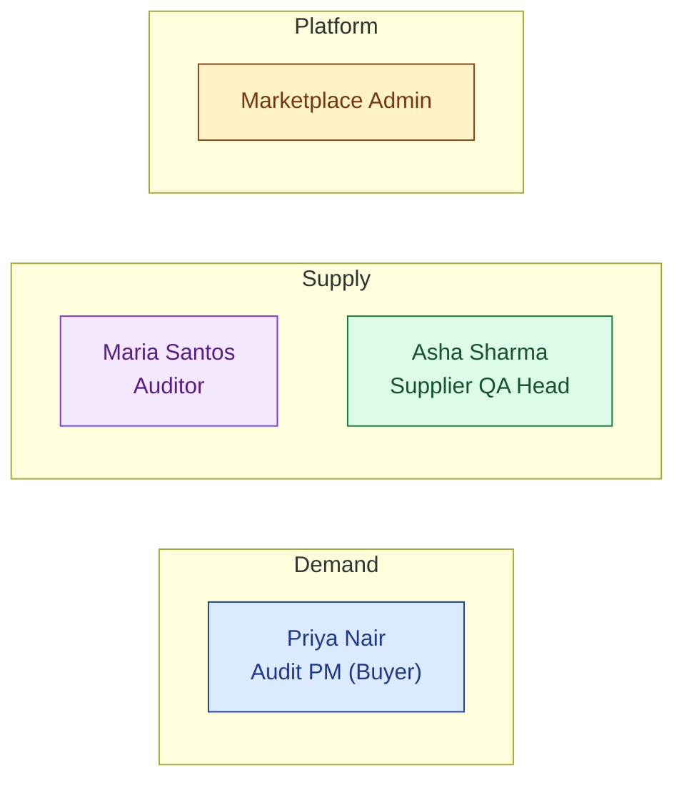
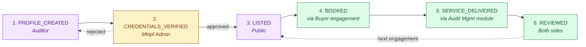
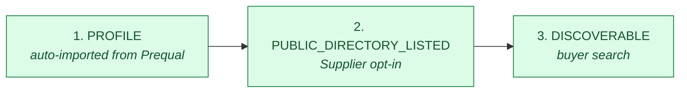
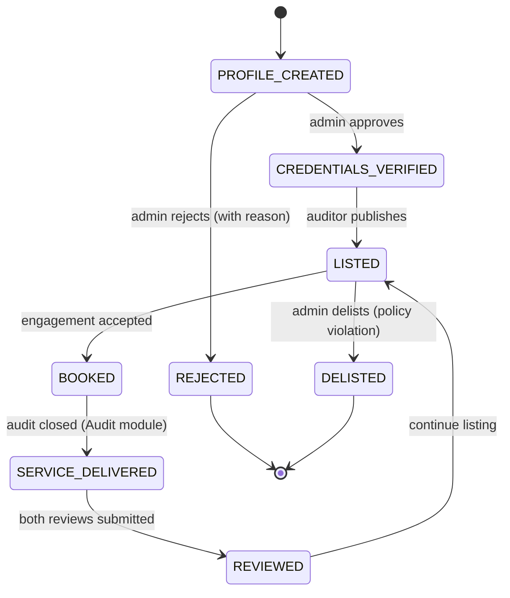
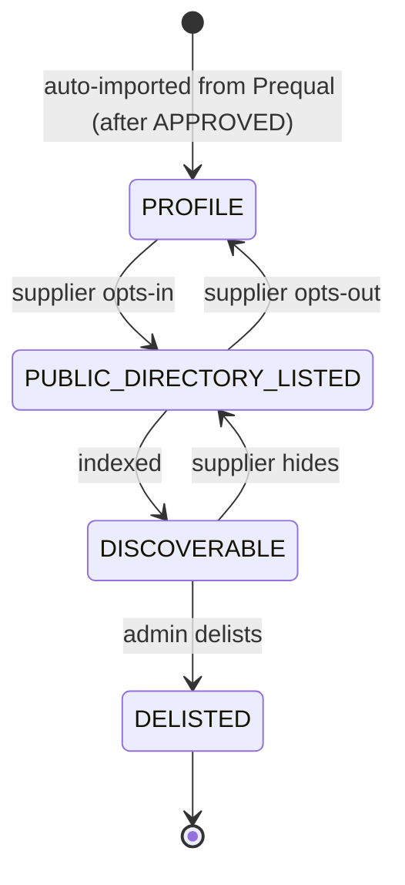

# DESIGN — Marketplace

| Field | Value |
|---|---|
| Module | Marketplace (v2) |
| Status | **PLAN STAGE** — designs aspirational, partial scaffold today |
| Depth | Executive overview |
| Pairs with | [URS.md](URS.md), [ARCHITECTURE.md](ARCHITECTURE.md) |
| Last updated | 2026-06-01 |

> ⚠️ Many UX surfaces shown here are **planned**, not built. The "Current state" column on URS items is the ground truth.

---

## 1. Personas (4 primary, 1 secondary)

Cross-reference [URS §2](URS.md#2-stakeholders-and-personas). Marketplace is **two-sided + admin** — buyer demand on one side, auditor + supplier supply on the other, with platform-side admin moderating.



| # | Persona | Side | Primary actions | Decisions |
|---|---|---|---|---|
| 1 | **Buyer / Audit PM** (Priya) | Demand | Search auditors / suppliers; book engagement; review | Whom to engage; rate negotiation |
| 2 | **Auditor** (Maria) | Supply | Create profile; manage availability; accept engagements; review buyer | Listing scope; accept/decline |
| 3 | **Supplier QA Head** (Asha) | Supply | Opt-in to directory; control public fields | Visibility level |
| 4 | **Marketplace Admin** | Platform | Vet auditors; moderate reviews; delist for violations | Approval; dispute outcome |
| 5 | **Tenant Admin (buyer side)** | (config) | Configure default discovery filters | Per-tenant config |

---

## 2. End-to-End Journey (Two Flows)

### Flow A: Auditor side



### Flow B: Supplier side



### Journey snapshots per persona

#### Buyer (Priya)
```
1. Open marketplace        → /marketplace
2. Search auditors         → /marketplace/auditors/search (filters: qual, language, geo, date, COI, price)
3. View auditor profile    → /marketplace/auditors/[id]
4. Request engagement      → "Engage" modal (scope, dates, rate)
5. Sign Marketplace MSA    → SignatureDialog
6. (Auto) audit request created in Audit module
7. After engagement: leave review → /marketplace/auditors/[id]/review
8. Search suppliers        → /marketplace/suppliers/search (parallel surface)
```

#### Auditor (Maria)
```
1. Onboard                 → /marketplace/auditor/onboard (profile + creds upload)
2. Wait for verification   → email when Mktpl Admin reviews
3. Manage profile          → /marketplace/auditor/profile
4. Manage availability     → /marketplace/auditor/availability (shared AvailabilityBlock)
5. Receive engagement req  → notification + /marketplace/auditor/engagements
6. Accept/decline/counter  → engagement workflow
7. Deliver service         → handled in Audit Mgmt module
8. Receive review          → public on profile after moderation
```

#### Supplier (Asha)
```
1. Already prequalified    → eligibility check via Prequal module
2. Opt-in to directory     → /supplier/marketplace/listing (toggle + privacy controls)
3. Configure public fields → field-level visibility toggle
4. View profile + analytics → /supplier/marketplace/profile (premium tier shows analytics)
```

#### Marketplace Admin
```
1. Pending verifications   → /marketplace-admin/auditor-verifications
2. Review credentials      → /marketplace-admin/auditor/[id]/verify
3. Approve/reject          → action with reason
4. Disputed reviews queue  → /marketplace-admin/disputes
5. Delist (policy violations) → /marketplace-admin/listings/[id]/delist
```

---

## 3. Screen + Component Inventory (planned)

### Public + Buyer surfaces (`/marketplace/...`)
| Route | Purpose | Key components |
|---|---|---|
| `/marketplace` | Landing + featured | hero, featured auditors, featured suppliers |
| `/marketplace/auditors/search` | Auditor search | `AuditorSearchFilters`, `AuditorResultCard`, `MatchingResultsPanel` (AI) |
| `/marketplace/auditors/[id]` | Auditor profile | `AuditorProfileView`, reviews section, "Engage" button |
| `/marketplace/suppliers/search` | Supplier search | `SupplierSearchFilters`, semantic search bar |
| `/marketplace/suppliers/[id]` | Supplier profile | `SupplierDirectoryView`, capability tags, "Add to my qualified list" |
| `/marketplace/engagement/[id]` | Engagement workflow | scope editor, e-sig, counter-proposal |

### Auditor surfaces (`/marketplace/auditor/...`)
| Route | Purpose | Key components |
|---|---|---|
| `/marketplace/auditor/onboard` | Profile creation | multi-step wizard, cred upload |
| `/marketplace/auditor/profile` | Edit own profile | `AuditorProfileEditor` |
| `/marketplace/auditor/availability` | Calendar | reuses `AvailabilityBlock` UI from Audit Mgmt |
| `/marketplace/auditor/engagements` | Inbox of requests | `EngagementRequestList` |

### Supplier surfaces (`/supplier/marketplace/...`)
| Route | Purpose | Key components |
|---|---|---|
| `/supplier/marketplace/listing` | Opt-in + privacy controls | toggle, field-level visibility |
| `/supplier/marketplace/profile` | View own profile + analytics | `SupplierDirectoryProfile` |

### Admin surfaces (`/marketplace-admin/...`)
| Route | Purpose | Key components |
|---|---|---|
| `/marketplace-admin/auditor-verifications` | Verification queue | list with cred preview |
| `/marketplace-admin/disputes` | Disputed reviews | review moderation |
| `/marketplace-admin/listings` | Listing management | search + delist actions |

### Cross-cutting (reused from platform)
- `SignatureDialog` (MSA + engagement contract sig)
- `AuditLogTable` (admin action trail)
- `AvailabilityBlock` calendar (auditor)
- `AskHawkDrawer` (e.g., "how do I evaluate an auditor for my audit?" persona-aware)

---

## 4. State Machines (Two)

### Auditor lifecycle



### Supplier directory lifecycle



**Phase ownership:**

| State | Owner | Notes |
|---|---|---|
| PROFILE_CREATED | Auditor | Awaiting admin |
| CREDENTIALS_VERIFIED | Marketplace Admin | After cred check |
| LISTED | Auditor | Publicly searchable |
| BOOKED | Buyer + Auditor | Active engagement |
| SERVICE_DELIVERED | (Audit Mgmt) | Cross-module hand-off |
| REVIEWED | Both | Public on profile |
| REJECTED / DELISTED | Marketplace Admin | Terminal |

### Decision gates

| Gate | State | Trigger | Enforcer |
|---|---|---|---|
| **G-VER** | PROFILE → VERIFIED | Admin reviews creds | `marketplaceAdminController` |
| **G-LIST** | VERIFIED → LISTED | Auditor publishes profile | `marketplaceAuditorController` |
| **G-ENG** | LISTED → BOOKED | Buyer + Auditor MSA e-sig | `marketplaceEngagementController` (requires e-sig) |
| **G-RVW** | DELIVERED → REVIEWED | Both reviews moderation-cleared | `marketplaceReviewController` |

---

## 5. Notifications (planned)

| Event | Recipients | Channel |
|---|---|---|
| Auditor profile submitted | Marketplace Admin | Email + dashboard |
| Auditor credentials approved/rejected | Auditor | Email |
| New engagement request | Auditor | Email + dashboard |
| Engagement accepted/declined/countered | Buyer | Email |
| MSA signed | Both + Marketplace Admin | Email |
| Audit complete (handoff) | Both | (cross-module) |
| Review posted | Counterparty | Email |
| Review disputed | Marketplace Admin | Email |
| Listing delisted | Listee | Email + dashboard |

---

## 6. Error and Edge Cases

| Scenario | Handling |
|---|---|
| **Auditor profile lacks valid creds** | Admin rejects with reason; auditor remains in PROFILE_CREATED to resubmit |
| **COI conflict on search** | Auditor not shown in this buyer's search; explanation surfaced only if buyer searches by exact name |
| **No auditors match buyer query** | "No exact matches — broaden criteria? Or invite an auditor to join?" CTA |
| **Engagement counter-proposal cycles** | After 3 rounds, system surfaces "stalled" badge; either party can escalate to Marketplace Admin |
| **Supplier opts out mid-engagement** | Existing engagements continue; new searches don't surface them |
| **Review with profanity / personal attack** | Auto-flagged; held pending Marketplace Admin moderation |
| **Cold-start: empty supply side** | Curated "featured auditors" list shown; cross-buyer audit sharing pitch (URS-B-004) |
| **Payment failure (post-Stripe)** | Engagement on hold; both parties notified; Marketplace Admin can resolve |

---

## 7. Accessibility

- **Keyboard nav:** search filters tab-traversable; result cards focusable
- **Screen reader:** ARIA labels on profile cards, rating stars, availability chips
- **Color contrast:** all status chips meet WCAG AA
- **Focus management:** SignatureDialog (MSA) traps focus; modal close returns focus
- **Open gaps:** semantic search results need ARIA live-region; rating-star widget needs accessible alternative input

---

## 8. Open Design Questions

1. **Search-first or browse-first landing?** — most marketplaces are search-first; given low listing count at launch, do we browse-first?
2. **Auditor day-rate display** — public, range, or "Request a quote"? Affects trust + cold-start.
3. **Supplier directory monetization** — free listing only, or premium tier from day 1?
4. **Match score transparency** — show buyer "this auditor scored 0.87 because of X+Y+Z" or hide the score?
5. **COI declaration UI** — auditor self-declares per buyer org, or system infers from past engagements?
6. **Marketplace MSA template** — single platform MSA + per-engagement addendum, or per-engagement standalone?
7. **Review moderation latency** — hold reviews 24h for moderation, or publish immediately + retroactive moderation?
8. **Cross-buyer audit sharing UX (URS-B-004)** — long-term; how does the consent prompt look at engagement time?
9. **Mobile experience priority** — auditors are highly mobile; mobile-first for auditor side?
10. **Demo/sandbox mode** — let prospect buyers explore marketplace with sample data?
