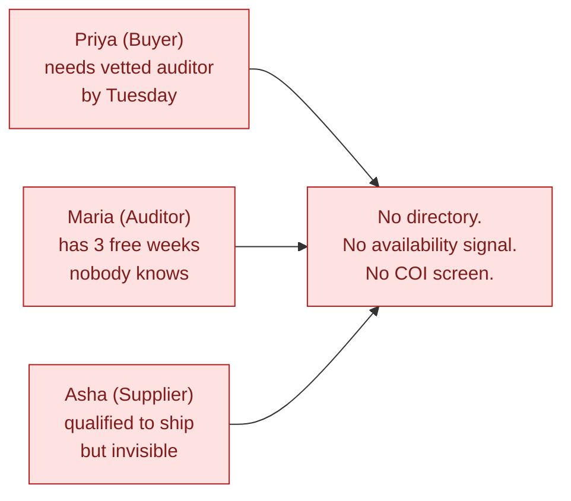
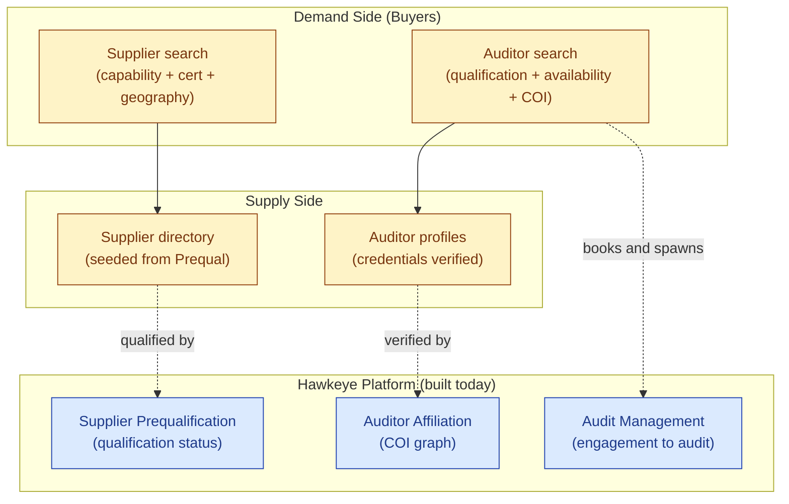
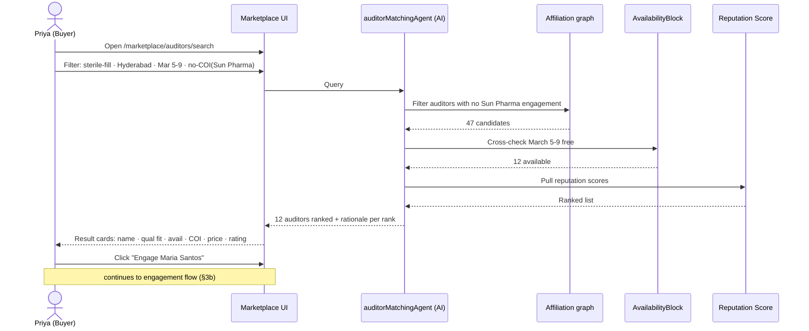
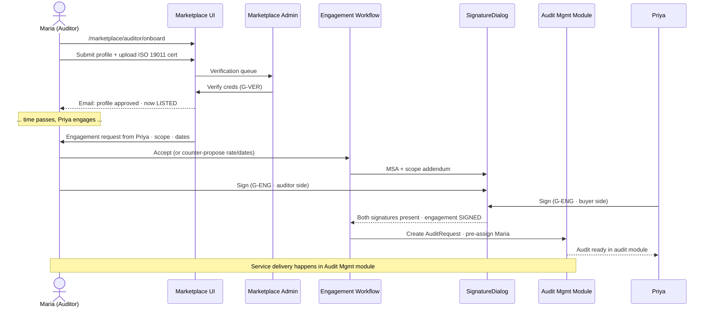
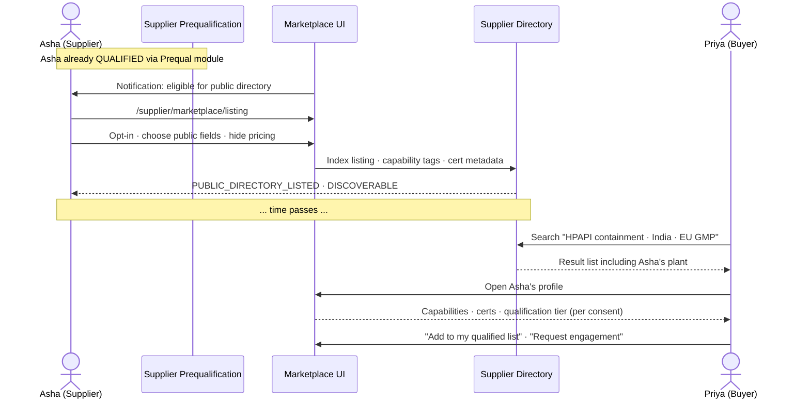
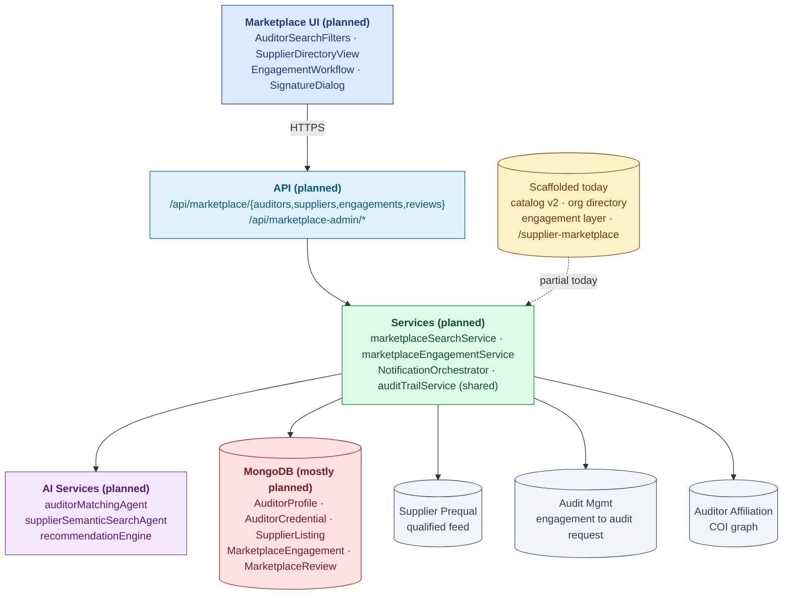
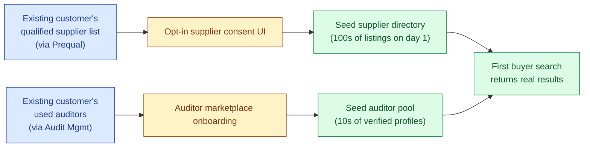
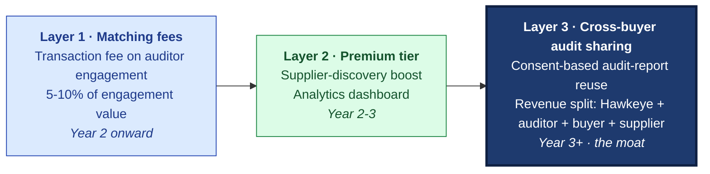

# Marketplace — The Storybook

| Field | Value |
|---|---|
| Audience | Pick your track in §0 |
| Length | 8-10 pages · 10 min read |
| Status | **PLAN STAGE** — vision document; most surfaces not yet built |
| Last updated | 2026-06-01 |
| Companion (reference) docs | [URS.md](URS.md) · [DESIGN.md](DESIGN.md) · [ARCHITECTURE.md](ARCHITECTURE.md) |

> ⚠️ **Honesty up front.** Marketplace is the youngest, least-built module in Hawkeye. This storybook describes the **vision and the cold-start plan** — not what ships today. Backend scaffolding exists for catalog v2, org directory, and engagement layer; the differentiator features (auditor matching, semantic supplier search, network economics) are **plan-stage**. We chose to write the story now because it's how we explain *why we're not building it yet* — and what we will build, in what order, once the platform earns the right.

---

## 0. Pick Your Track

| Audience | Read | Skip |
|---|---|---|
| 🪙 **Executive / Investor** | §1 Problem · §2 Vision · §6 Network economics · §7 What's Next | §4 Architecture · §5 Compliance |
| 🛠 **Engineer / CTO** | §1 Problem · §3 Flows (planned) · §4 Architecture (planned) · §7 What's Next | §6 Network economics |
| 📦 **QA Head / Practitioner** | §1 Problem · §2 Vision · §3 Flows (planned) | §4 Architecture · §6 Network economics |
| 💰 **Sales / GTM** | §1 Problem · §2 Vision · §6 Network economics · §7 What's Next | §4 Architecture · §5 Compliance |

---

# Beat 1 — The Problem

## §1. The two-sided pain

Marketplace doesn't exist because three different people, sitting in three different chairs, have versions of the same problem — and nobody is solving it for any of them at once.

### Why the market is broken — three angles

**Buyer pain (Priya, Audit Program Manager).** Priya has an FDA inspection in 90 days and needs an independent auditor for a Tier-1 supplier in Hyderabad. Her options today: email three former colleagues, post on LinkedIn, ask the QA Head WhatsApp group. She'll spend 2 weeks finding 3 candidates. She has no objective view of qualifications, no idea who has COI with which of her sites, and no read on availability until she gets to a phone call.

**Auditor pain (Maria, Independent Lead Auditor).** Maria is ISO 19011 certified, has 14 years of pharma GMP experience, and runs a 2-person practice. Her deal flow is 100% referral. She has 3 free weeks in March that will go unbilled because nobody who needs her work knows she's available. Her competitive advantage (experience in sterile fill-finish) isn't discoverable anywhere.

**Supplier pain (Asha, Supplier QA Head at a CDMO).** Asha's plant is qualified by Cipla, Lupin, and Dr Reddy's — but a US biotech looking for a Tier-2 fill-finish partner has no way to find her. She pays for trade-show booths and pharma directory listings that nobody actually searches. The capabilities that make her plant valuable (HPAPI containment, lyophilization capacity) aren't indexed anywhere a buyer can query them.

### The honest comparison

| Today's option | What it solves | What it doesn't |
|---|---|---|
| **LinkedIn / Email** | Some connectivity | No qualification filter; no COI screen; no availability signal; no trust |
| **Qualifyze** | Auditor marketplace | Doesn't span supplier discovery; doesn't connect to your internal audit workflow |
| **Trade directories (PharmaCompass, Drugbank)** | Supplier discovery | No qualification status; no capability semantic search; static listings |
| **Veeva** | EQMS workflow | No marketplace at all |

> 🚫 **The honest framing.** No platform today bridges buyer demand, auditor supply, and supplier visibility on top of a real qualification system. Hawkeye can — because we already run the qualification workflow upstream. The marketplace is the network layer **on top of** something we already have to be good at.

---

# Beat 2 — The Solution Vision

> ⚠️ **Everything in this section is planned, not shipped.** What follows is the target state — the marketplace we will build once the wedge modules (Audit, Supplier Prequalification, CAPA) have earned the right with paying customers.

## §2. What Marketplace v2 will be

A two-sided platform with three discoverability surfaces, all powered by the qualification + COI data already running in Hawkeye's other modules:

### Three things the platform must do

1. **Auditor matching** — buyer says "I need a sterile-fill auditor in Hyderabad, March 5-9, no COI with Sun Pharma"; system returns ranked auditors with availability + COI clearance + price + reputation
2. **Supplier discovery** — buyer says "I need a US-FDA-registered API supplier for cardiovascular generics, sub-$X/kg, EU GMP"; system returns qualified suppliers matching by capability + certification + geography
3. **Network economics** — over time, the marketplace gets smarter from the data it sees: which auditors do well on what kinds of audits, which suppliers get qualified by whom, which audit reports are reused across buyers (with consent)

> 💡 **The platform advantage.** Qualifyze is a marketplace. PharmaCompass is a directory. Neither runs the underlying qualification workflow. We do — which means our auditor profiles can carry **verified** credentials (not self-claimed), our supplier listings carry **real** qualification status (not "trust me"), and our auditor matching can run on the **real** COI graph (not a checkbox). That's the moat.

### The wedge logic — and why this is **not** the entry product

| Why audit lands first, marketplace later | Evidence |
|---|---|
| Acute pain → ROI is workflow, not network | Customer #1 will pay for audit relief. Marketplace alone has no acute pain. |
| Single-decider sale | QA Head buys audit. Marketplace requires platform-side trust + network. |
| Two-sided liquidity is hard | Marketplaces fail without supply or demand; we need both. Audit module gets us a path to supply (paying auditors) and demand (paying buyers). |
| Network effects compound late | Reputation, "auditors others used", cross-buyer sharing all need scale. We earn scale through the wedge. |

> ✅ **The bet.** Audit Management is the wedge. Within 18 months, paying customers create the latent demand and supply: their auditors become our auditor pool; their qualified suppliers become our supplier directory. Marketplace then **harvests** that liquidity. Cold-start is solved by being the EQMS first.

---

# Beat 3 — Key Flows (planned)

> ⏳ **All flows below are planned, not shipped.** They describe the target user experience.

## §3a. Buyer searches for an auditor ⏳ Planned

## §3b. Auditor lists services + accepts engagement ⏳ Planned

## §3c. Supplier appears in directory after qualification ⏳ Planned

---

# Beat 4 — Architecture (planned)

> 🛠 **For engineers / CTOs.** Most of what follows is target-state. See `backend/src/models/productCatalogV2Models.js`, `routes/orgDirectoryRoutes.js`, `routes/engagementRoutes.js`, and `frontend/app/(console)/supplier-marketplace/` for what's actually scaffolded today.

## §4a. System context (planned)

## §4b. The two-sided liquidity challenge

Every two-sided marketplace fails without both supply and demand at launch. Hawkeye's path through this:

| Problem | Hawkeye's lever |
|---|---|
| **Cold-start supply (auditors)** | Recruit 10-20 auditors from PoC partners; pay-per-engagement model; no listing fee at cold-start |
| **Cold-start supply (suppliers)** | Auto-populate from Supplier Prequalification — every qualified supplier in a paying customer's tenant becomes eligible (opt-in) |
| **Cold-start demand (buyers)** | Buyers are already on the platform for audit management; marketplace is an in-product surface, not a separate destination |
| **Trust deficit** | Credentials verified by Marketplace Admin (not self-claimed); reputation scored from real audit-module performance data |
| **Liquidity-by-geography** | Start US + EU + India in order; one geography at a time; don't promise global day 1 |

## §4c. Cold-start strategy in one picture

> ✅ **The harvest model.** Hawkeye doesn't need a "marketplace launch event" with paid acquisition. Every paying audit-module customer brings their qualified suppliers and used auditors with them. The marketplace **emerges** from the EQMS install base.

---

# Beat 5 — Compliance

> 🔍 **For regulators.** Marketplace has a lighter regulatory footprint than audit / CAPA / batch-records — it's a commerce surface, not a quality workflow. But contract management is real, and the connection to qualified status matters.

## §5. Compliance map (limited but real)

| Feature | Anchor | What it implements |
|---|---|---|
| **Auditor independence (COI)** | ICH Q7 §13.20 · EU GMP Ch.1 §1.4 | COI declaration + COI filter at search; auditors with declared conflict not surfaced to that buyer |
| **Supplier listings reference qualified status** | ICH Q7 §17.40 · EU GMP Ch.7 · ISO 9001 §8.4 | Only suppliers qualified via Prequal module appear in directory (opt-in); qualification tier optionally visible per buyer consent |
| **Engagement contract e-sig** | 21 CFR Part 11 §11.50 + §11.200 | Marketplace MSA + scope addendum dual-signed (buyer + auditor); reasonForChange + signature meaning captured |
| **Admin action audit trail** | 21 CFR Part 11 §11.10(e) · ISO 9001 §7.5 | All Marketplace Admin verifications, moderations, delistings write AuditTrail rows |
| **RBAC + tenant boundary** | 21 CFR Part 11 §11.10(d) | Roles: buyer, auditor, supplier, marketplace_admin (platform-scoped), tenant_admin |
| **Cross-buyer audit sharing** (URS-B-004, future) | implicit: §11.10(b) authenticity preserved | Shared report retains original signatures + integrity hash; consent recorded |

> 💡 **Three real-world contracts.** (1) Platform MSA — every auditor and buyer signs the marketplace terms once. (2) Engagement contract — one per booking, with scope addendum and dual e-sig. (3) Supplier listing terms — one per supplier, governs directory visibility and consent for cross-buyer sharing. Contract management is real even though the regulatory anchor is light.

---

# Beat 6 — Network Economics (the vision)

> 🪙 **For executives + investors.** This is the long-arc story — what marketplace becomes once liquidity exists. None of this monetizes at MVP. All of it is **possible** because of the qualification + COI + audit-trail platform built underneath.

## §6. Three revenue layers, three time horizons

### Layer 1 — Auditor matching fees (URS-B-001)

Transaction fee on each engagement. Standard two-sided marketplace economics. Expected TAM: a Tier-3 CDMO commissions ~$50K of third-party audit per year; a 7% take rate = $3.5K/year per customer at scale. With 100 customers, that's $350K/year — meaningful but not the headline number.

### Layer 2 — Premium supplier discovery (URS-B-005)

Suppliers pay for visibility boost in buyer searches + an analytics dashboard (who viewed my profile, conversion to engagement). Expected to be the **larger** revenue stream once supplier directory has 5,000+ active listings — TAM scales with directory size, not transaction count.

### Layer 3 — Cross-buyer audit sharing (URS-B-004) — *the moat*

The vision is simple, the legal complexity is real: if Cipla audits Sanpras in Q1, and Lupin needs the same audit data in Q2, the platform can broker a **consented** share. The original auditor stays in the loop. The supplier consents. Hawkeye takes a share. Lupin saves the cost of a redundant audit. Cipla optionally recovers cost.

**Why this only works with Hawkeye:**
- Audit reports come signed + integrity-hashed (Part 11 native)
- Supplier consent UI is part of the platform
- Auditor identity is verified
- COI is still enforced

> ✅ **The reason network economics is in §6 and not §2.** This is **the** flywheel. But it requires: paying customers (got them in audit-module wedge) + qualified suppliers in directory (got them via prequal module) + reputation graph (got it via audit-module performance data) + consent infra (got to build it). We're 18-24 months from L3. The architecture today is being built so this is **possible** later — not so it ships next quarter.

---

# Beat 7 — What's Next

## §7a. Today (May 2026) — plan-stage, partial scaffolding

✅ Scaffolded today (partial):
- Catalog v2 models (`backend/src/models/productCatalogV2Models.js`)
- Org directory routes (`orgDirectoryRoutes.js`)
- Engagement layer (`engagementRoutes.js`, `qualificationCaseRoutes.js`)
- Basic buyer-side supplier browse (`frontend/app/(console)/supplier-marketplace/`)
- AuditorAffiliation model (in Audit Mgmt — enables COI graph)
- Feature flags for marketplace surfaces

⏳ Not built:
- Auditor profile + credentials + verification workflow
- Public auditor directory + buyer search
- Engagement workflow + MSA e-sig
- Reviews + reputation scoring
- Supplier semantic search
- AI matching / recommendation engine
- Stripe Connect payments
- Marketplace Admin console

## §7b. Phase 1 — Post-Series-A (M12-M18)

Goal: launch the **auditor side** of the marketplace as the first usable surface.

- Public auditor directory + booking flow
- Auditor onboarding + credential verification
- Marketplace Admin console (verification queue, dispute moderation)
- Engagement workflow with MSA e-sig
- Manual booking (no payment processing yet — invoice out-of-band)
- Cold-start: recruit 10-20 auditors from PoC partners

## §7c. Phase 2 — M18-M24

Goal: light up the **supplier side** of the marketplace.

- Supplier opt-in flow (from Prequal module)
- Public supplier directory + capability search
- Buyer search across both auditors and suppliers
- Reviews + ratings (both sides)
- Auditor matching algorithm v1 (rule-based; ML in Phase 3)

## §7d. Phase 3 — M24-M30

Goal: revenue + scale.

- Stripe Connect payments (auditor engagements)
- Marketplace transaction layer (transaction fees)
- AI auditor matching (URS-B-001) — ML-ranked
- AI supplier semantic search (URS-B-002)
- Recommendation engine (URS-B-003) — "auditors others used"
- Premium supplier tier (URS-B-005)

## §7e. Phase 4 — Post-Series-B (M30+)

Goal: network economics.

- Auditor Reputation Score (URS-B-006) — aggregates audit-module performance metrics
- Cross-buyer audit sharing (URS-B-004) with consent
- Cross-tenant supplier intel surfacing (URS-B-006 prequal cross-reference)
- Multi-currency · VAT · tax handling
- Dispute resolution workflow at scale

## §7f. Known engineering gaps

> 🚫 **Marketplace today — the honest list:**
> - No auditor profile UI · no credential verification workflow · no public auditor directory
> - No buyer search across auditors (the core MVP feature)
> - No engagement workflow · no MSA contract · no e-sig integration
> - No payment processing (Stripe Connect deferred)
> - No reviews / ratings UI · no reputation scoring
> - No AI matching / semantic search / recommendation engine
> - No Marketplace Admin console
> - COI declaration UI not built (AuditorAffiliation backend model exists; UX TBD)
> - No mobile experience (desktop-first when built)
> - No GDPR / India DPDPA cross-border listing legal review
>
> Full list: [URS.md §8 Open Questions](URS.md#8-open-questions) · [ARCHITECTURE.md §9 Known Gaps](ARCHITECTURE.md#9-known-gaps--engineering-debt)

---

## Appendix — Where To Go Next

| If you want | Open |
|---|---|
| Full requirements contract (planned features) | [URS.md](URS.md) |
| UX flows + state machines (planned) | [DESIGN.md](DESIGN.md) |
| System architecture + data model (planned) | [ARCHITECTURE.md](ARCHITECTURE.md) |
| The wedge module that funds marketplace | [../audit-management/STORYBOOK.md](../audit-management/STORYBOOK.md) |
| The upstream module that seeds supplier directory | [../supplier-prequalification/URS.md](../supplier-prequalification/URS.md) |
| Pre-code analysis (backend legacy) | `backend/docs/marketplace-v2/IMPLEMENTATION_PLAN.md` |
| The full Hawkeye narrative | [../../HAWKEYE-STORY.md](../../HAWKEYE-STORY.md) |
| The platform-wide architecture (CTO) | [../../04-engineering/00-overview/PLATFORM-ENGINEERING.md](../../04-engineering/00-overview/PLATFORM-ENGINEERING.md) |

---

*Doc_V2 · Marketplace · Storybook · 6 beats · 4 audience cuts · plan-stage*
