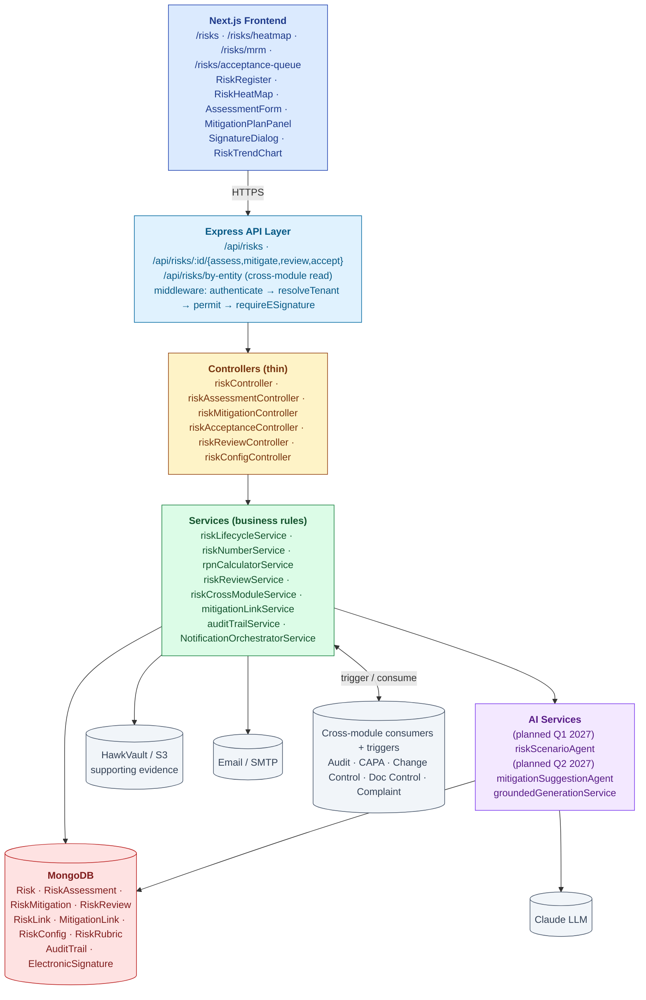
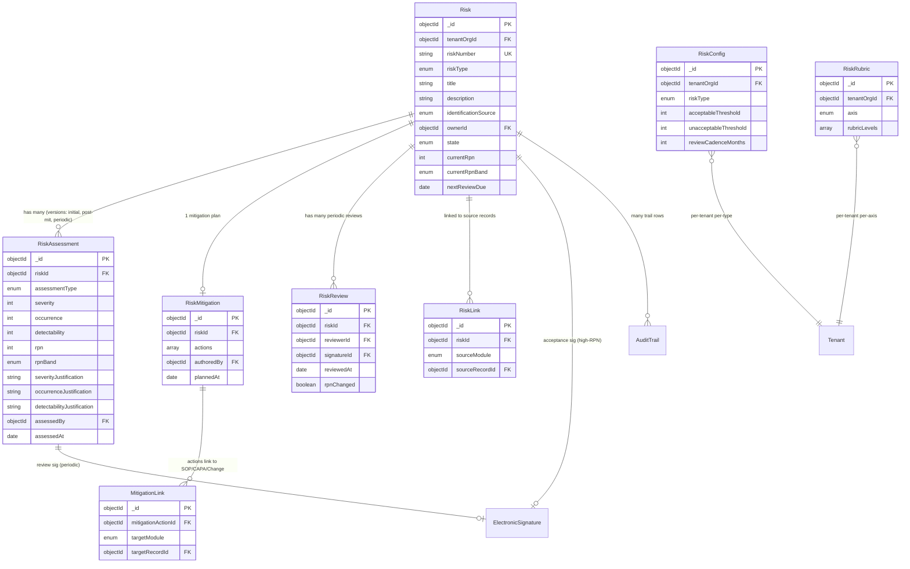
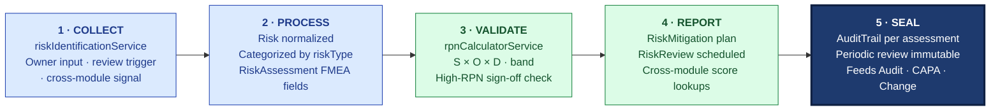

# ARCHITECTURE — Risk Management

| Field | Value |
|---|---|
| Module | Risk Management |
| Depth | Executive overview with code path links for detail |
| Pairs with | [URS.md](URS.md) (requirements), [DESIGN.md](DESIGN.md) (UX) |
| Last updated | 2026-06-01 |

---

## 1. System Context

**Tier ownership:**
- **Frontend** owns: rendering, role-aware UI, heat map visualization, e-sig modal capture
- **API + middleware** owns: auth, tenant scoping, RBAC, e-sig enforcement
- **Controllers** own: route dispatch (thin)
- **Services** own: lifecycle rules, RPN computation, cross-module orchestration, AI orchestration, notifications
- **Models** own: schema, indexes, per-tenant config/rubric versioning
- **External systems** own: file storage (S3), email (SMTP), inference (Claude); cross-module modules consume risk scores via API

---

## 2. Data Model

### Primary entities

| Model | Purpose | Key fields | References |
|---|---|---|---|
| **Risk** | Aggregate root | `riskNumber` (unique per tenant), `riskType` (Product/Process/Supplier/Regulatory/Operational), `identificationSource`, `ownerId`, `state`, `currentRpn`, `currentRpnBand`, `nextReviewDue` | `tenantOrgId`, `users` |
| **RiskAssessment** | FMEA scoring snapshot (versioned) | `riskId`, `assessmentType` (initial/post-mitigation/periodic), `severity`, `occurrence`, `detectability`, `rpn`, `rpnBand`, per-axis justifications, `assessedBy`, `assessedAt` | `Risk`, `users` |
| **RiskMitigation** | Mitigation plan | `riskId`, `actions[]` (action, owner, dueDate, type, status, effectiveness), `authoredBy`, `plannedAt` | `Risk`, `users` |
| **RiskReview** | Periodic review record | `riskId`, `reviewerId`, `signatureId`, `reviewedAt`, `rpnChanged` | `Risk`, `ElectronicSignature` |
| **RiskLink** | Identification source link (reverse: this risk came from X) | `riskId`, `sourceModule` (audit/complaint/deviation/change/proactive), `sourceRecordId` | `Risk`, cross-module records |
| **MitigationLink** | Mitigation action implementation vehicle | `mitigationActionId`, `targetModule` (doc/capa/change/training), `targetRecordId` | `RiskMitigation`, cross-module records |
| **RiskConfig** | Per-tenant thresholds + cadence per risk type | `tenantOrgId`, `riskType`, `acceptableThreshold`, `unacceptableThreshold`, `reviewCadenceMonths` | `tenantOrgId` |
| **RiskRubric** | Per-tenant scoring rubric per axis | `tenantOrgId`, `axis` (severity/occurrence/detectability), `rubricLevels[]` (1-10 descriptions) | `tenantOrgId` |
| **AuditTrail** (cross-module) | 21 CFR Part 11 log | shared | — |
| **ElectronicSignature** | Part 11 e-sig records | shared | — |

### Indexes (key)

- `Risk`: `(tenantOrgId, riskNumber)` unique, `(tenantOrgId, state)`, `(tenantOrgId, riskType)`, `(tenantOrgId, currentRpn)`, `(tenantOrgId, nextReviewDue)`
- `RiskAssessment`: `(riskId, assessedAt)` for chronological history
- `RiskLink`: `(sourceModule, sourceRecordId)` for reverse-lookup (e.g., "find all risks linked to this audit finding")
- `MitigationLink`: `(targetModule, targetRecordId)` for reverse-lookup (e.g., "find all risks where this SOP is the control")
- `AuditTrail`: `(tenantId, entityType='risk', entityId)` for cross-module trail browser

---

## 3. API Contract Catalog (grouped)

All paths require `authenticate` middleware unless noted; RBAC enforced by `permit(...roles)`.

### Risk lifecycle

| Group | Endpoints | Primary roles | Notes |
|---|---|---|---|
| List + read | `GET /api/risks`, `GET /api/risks/:id` | role-scoped | Tenant-scoped; Process Owner sees only owned |
| Create | `POST /api/risks` | risk_manager, qa_head, tenant_admin | Generates `riskNumber` |
| Update | `PATCH /api/risks/:id` | risk owner, risk_manager | Pre-CLOSED |
| Assess | `POST /api/risks/:id/assess` | risk_manager, process_owner | Writes RiskAssessment + computes RPN |
| Mitigate | `POST /api/risks/:id/mitigate` | risk_manager | Authors mitigation plan |
| Review (periodic) | `POST /api/risks/:id/review` (e-sig) | risk_manager | Periodic review with sig (meaning=REVIEWED) |
| Accept (high-RPN) | `POST /api/risks/:id/accept` (e-sig) | qa_head | QA Head e-sig (meaning=ACCEPTED) |
| Reject acceptance | `POST /api/risks/:id/reject-acceptance` | qa_head | Returns to CONTROL |
| Revoke acceptance | `POST /api/risks/:id/revoke-acceptance` | qa_head | With reasonForChange |

### Cross-module API

| Endpoint | Role | Purpose |
|---|---|---|
| `GET /api/risks/by-entity?module=...&recordId=...` | service-to-service, all roles | Returns risks linked to a source record (used by Audit / CAPA / Change to weight) |
| `GET /api/risks/scores?supplierId=...` | service-to-service | Aggregate risk score per supplier (used by Audit for scope weighting) |
| `POST /api/risks/cross-module/trigger` | service-to-service | Other modules signal risk reassessment trigger |

### Heat map + trends

| Endpoint | Role | Purpose |
|---|---|---|
| `GET /api/risks/heatmap` | all (tenant-scoped) | Heat map dataset (active risks with S/O/D + band) |
| `GET /api/risks/trend?riskId=...` | all | RPN-over-time series per risk |
| `GET /api/risks/mrm-rollup` | qa_head, mrm_chair, tenant_admin | MRM quarterly roll-up |

### Admin

| Endpoint | Role | Purpose |
|---|---|---|
| `GET/PATCH /api/admin/risk-config` | tenant_admin | Manage thresholds + cadence per risk type |
| `GET/PATCH /api/admin/risk-rubric` | tenant_admin | Manage scoring rubrics per axis |

### Audit trail

| Endpoint | Role | Purpose |
|---|---|---|
| `GET /api/risks/:id/audit-trail` | all | Per-risk trail |
| `GET /api/audit-trail/by-entity?entityType=risk&entityId=...` | all (tenant-scoped) | Cross-module trail |

---

## 4. RBAC Matrix

| Capability | Risk Manager | Process Owner | QA Head | MRM Chair | Tenant Admin | Superadmin |
|---|---|---|---|---|---|---|
| Create risk | ✅ | — | ✅ | — | ✅ | ✅ |
| Edit risk | ✅ | ✅ (owned) | ✅ | — | ✅ | ✅ |
| List risks (tenant-scoped) | ✅ | ✅ (owned only) | ✅ | ✅ | ✅ | ✅ |
| Assess (FMEA) | ✅ | ✅ (owned) | ✅ | — | ✅ | ✅ |
| Author mitigation | ✅ | — | ✅ | — | ✅ | ✅ |
| Update mitigation action status | ✅ | ✅ (own actions) | ✅ | — | ✅ | ✅ |
| Periodic review (e-sig REVIEWED) | ✅ | — | ✅ | — | ✅ | ✅ |
| Accept (e-sig ACCEPTED) | — | — | ✅ | — | — | — |
| Revoke acceptance | — | — | ✅ | — | — | ✅ |
| Configure thresholds / rubrics | — | — | — | — | ✅ | ✅ |
| View MRM roll-up | — | — | ✅ | ✅ | ✅ | ✅ |
| Read audit trail | ✅ | ✅ | ✅ | ✅ | ✅ | ✅ |
| Read risks via cross-module API | service-to-service (all consuming modules) | | | | | |

**Cross-tenant guards:** all risk queries gated by `buildRiskTenantScopeQuery()` (tenant_orgId filter).

**Process Owner scoping:** Process Owner role gets owned-only filter applied at service layer (`{ ownerId: req.user.id }` added to query).

---

## 5. AI Capabilities

All AI is grounded (citations + confidence floor + manual fallback) and audit-trailed (`recordAiDecision`). Per URS Part B.

### AI tools wired (or planned) into Risk Management

| Tool | Type | Read/Write | E-sig | Where used | Status |
|---|---|---|---|---|---|
| **riskScenarioAgent** | Scenario generation from regulatory corpus + historical patterns | READ | NO | `/risks/new` brainstorm panel | ⏳ Planned Q1 2027 |
| **mitigationSuggestionAgent** | Suggest control actions from proven library | READ | NO | `/risks/[id]/mitigate` suggest panel | ⏳ Planned Q2 2027 |
| **crossTenantBenchmarkingAgent** | Anonymized peer benchmarking | READ | NO | MRM dashboard | ⏳ Roadmap (consent model TBD) |

### Grounding posture

Every LLM call routes through `groundedGenerationService.js`:
1. **Structured output** — JSON schema validation
2. **Citations required** — scenario agent cites ICH Q9 / ISO 31000 / regulatory observations
3. **Confidence floor** — minConfidence 0.6; below → manual mode
4. **PII redaction** — supplier names / batch numbers redacted before LLM, unredacted on receipt
5. **AuditTrail row** — `recordAiDecision()` writes feature, modelVersion, promptHash, retrievalSet, confidence, tokens, latency
6. **Human-in-loop** — AI never auto-creates risks or auto-scores; always presents for Risk Manager review

### Active learning

After each AI suggestion, UI calls `POST /api/ai/decisions/outcome` with `USER_ACCEPTED` / `USER_EDITED` / `USER_REJECTED`. Particularly valuable for mitigation suggestions — accepted controls feed back into the control library.

---

## 6. State Machine Implementation

Cross-reference [DESIGN §4](DESIGN.md#4-state-machine-risk-lifecycle).

**Enforcement layer:**
- **Definition:** `backend/src/constants/riskStates.js` (enum)
- **Validation:** `services/riskLifecycleService.js → canTransition()` — checks assessment completeness, mitigation presence (if RPN > threshold), e-sig presence for ACCEPTANCE, justification length
- **Application:** `services/riskLifecycleService.js → applyTransition()` — mutates `state`, recomputes `currentRpn`/`currentRpnBand`, writes AuditTrail row
- **RPN compute:** `services/rpnCalculatorService.js → compute({severity, occurrence, detectability, config})` — returns `{rpn, band}` per per-tenant thresholds
- **Cross-module reopen:** `services/riskCrossModuleService.js → reopenForReassessment(riskId, sourceModule, sourceRecordId, reason)` — transitions CLOSED → ASSESSMENT with audit trail

**Gate enforcement:**
- **G-ASSESS / G-MIT / G-REV** — field-level + service-level validation in controllers/services
- **G-ACC (QA Head e-sig)** — `middlewares/requireESignature.js` accepts `electronicSignatureId` (pre-signed) OR inline `signaturePassword`; meaning=ACCEPTED
- **G-XMOD** — cross-module trigger writes `RISK_REOPENED_BY_XMOD` AuditTrail row with source attribution

**Cross-module orchestration:**
- **Complaint → Risk:** Complaint resolution flagged "new risk" calls `POST /api/risks` with `identificationSource=complaint`
- **Change Control → Risk:** Change Control approval calls `POST /api/risks/cross-module/trigger` with affected SOP/process; service finds linked risks via `MitigationLink.targetRecordId` and reopens them
- **Audit → Risk:** Audit finding can create risk via Audit module spawning + linking via `RiskLink`
- **Risk → consumers (Audit, CAPA, Change, Doc):** consumers GET `/api/risks/by-entity` and `/api/risks/scores` to weight their own workflows

---

## 7. Compliance Traceability

| Feature | ICH Q9 (R1 2023) | ISO 31000 | ICH Q10 | ISO 9001 | 21 CFR Part 11 |
|---|---|---|---|---|---|
| Risk identification + source linkage | §I.4 | §6.4 | §2.3 | §6.1 | — |
| FMEA assessment (S/O/D/RPN) | **§I.5.4** | §6.5 | §2.3 | §6.1.1 | — |
| Configurable thresholds + rubrics | §I.5.4 | §6.5 | — | §6.1.1 | — |
| Mitigation / control planning | **§I.5.5** | §6.5.3 | §2.3 | §6.1.2 | — |
| Residual risk reassessment | **§I.5.6** | §6.6 | §2.3 | §6.1.2 | — |
| Risk acceptance e-sig (high-RPN) | **§I.5.7** | §6.5.3 | §2.3 | §6.1.2 | **§11.50 + §11.200** |
| Periodic review + e-sig | §I.5.6 | §6.7 | §2.3 | §9.1.3 | §11.50 |
| Cross-module risk-weighted prioritization | §I.5.6 | §6.5 | §2.3 / §3.2 | §6.1 | — |
| Audit trail (cross-module) | — | — | §6.18 | §7.5 | **§11.10(e), §11.10(k)** |
| AI decision reproducibility | — | — | — | — | §11.10(b), §11.10(e) |

---

## 8. Operational Concerns

### Performance / scale targets
- Risk register list: < 500 ms for 5k risks per tenant
- Heat map dataset: < 1 sec for 5k risks
- RPN compute: synchronous, < 50 ms
- Cross-module risk score lookup (`GET /api/risks/by-entity`): < 200 ms p95 (called by Audit/CAPA/Change/Doc on each operation)
- Periodic review sweep: nightly cron
- MRM roll-up: < 3 sec for full-tenant aggregation

### Failure modes + recovery
- **LLM provider down** → AI panels show "AI unavailable, brainstorm manually"
- **Cross-module trigger fails** → trigger queued for retry; AuditTrail row `XMOD_TRIGGER_FAILED`
- **E-sig password mismatch (acceptance)** → no state change; AuditTrail row `SIGNATURE_FAILED`; user retries
- **DB write failure mid-transition** → state reverts; AuditTrail row marked FAILED
- **RPN threshold config missing for a risk type** → falls back to platform default (acceptable<60 / unacceptable>150) + warning
- **Concurrent assessment edits (RM + Process Owner)** → optimistic lock via `updatedAt`; conflict surfaces as "Stale — refresh"
- **Cross-tenant query leak** (theoretical) → defense-in-depth: route-level RBAC + service-level tenant scope query

### Observability
- Per-tenant metrics: active risks by band, mean-RPN by type, overdue reviews %, acceptance rate, mean-time-to-mitigation
- AI metrics: scenario-suggestion acceptance rate, mitigation-suggestion adoption rate
- Cross-module consumption: count of risk-score lookups per module per day (signals which consumers depend on us)
- Audit trail itself is the regulatory observability layer

---

## 9. Known Gaps + Engineering Debt

1. **AI scenario brainstormer (URS-B-001)** — planned Q1 2027; not yet implemented
2. **AI mitigation suggestion (URS-B-006)** — planned Q2 2027; needs control library data
3. **Cross-tenant benchmarking (URS-B-007)** — roadmap; consent model + anonymization design pending
4. **Doc Control review-cadence consumption (URS-A-054)** — risk-weighted cadence API exposed; Doc Control consumer wiring incomplete
5. **MRM packet PDF export** — dashboard exists; export-to-PDF planned
6. **Auto-trigger reassessment policy** — every Change Control fires reassessment today; "major-only" filter design pending
7. **HAZOP / HACCP overlays** — specialized workflows planned (vertical packs Q2-Q3 2027)
8. **Mitigation-action templates** — free-text today; library planned alongside URS-B-006
9. **Heat map keyboard navigation** — partial; full a11y pass pending

---

## 10. Open Engineering Questions

1. **RPN compute model** — classical S×O×D today; should we also support modified RPN (e.g., S+(O×D))? Per-tenant config?
2. **Vector store for scenario brainstormer** — same question across modules (Mongo-cosine vs pgvector vs dedicated)
3. **Cross-module trigger transport** — synchronous HTTP today; should we move to event bus (Kafka/Redis Streams) for resilience?
4. **Risk scoring caching** — cross-module lookups are read-heavy; do we add a per-risk score cache with invalidation on assessment?
5. **Multi-region** — risk register residency (EU GDPR / India DPDPA) — same question as Audit module
6. **Aggregate MRM roll-up** — materialize quarterly snapshots or compute on-demand?
7. **Anonymized cross-tenant benchmarking** — k-anonymity threshold? Min-cohort size?

---

## 11. Code Path Index (Architecture ↔ Source)

| Architectural concern | Primary code path |
|---|---|
| Routes | `backend/src/routes/risk*.js` |
| Controllers | `backend/src/controllers/risk*.js` |
| Services | `backend/src/services/risk*.js`, `services/rpnCalculatorService.js`, `services/mitigationLinkService.js` |
| AI services (planned) | `backend/src/services/ai/riskScenarioAgent.js`, `mitigationSuggestionAgent.js`, `crossTenantBenchmarkingAgent.js` |
| Models | `backend/src/models/{Risk,RiskAssessment,RiskMitigation,RiskReview,RiskLink,MitigationLink,RiskConfig,RiskRubric}.js` |
| Middlewares | `backend/src/middlewares/{authMiddleware,roleMiddleware,tenantMiddleware,requireESignature}.js` |
| Constants | `backend/src/constants/riskStates.js`, `riskTypes.js`, `rpnBands.js` |
| Audit trail | `backend/src/services/auditTrailService.js`, `models/AuditTrail.js` |
| AI grounding | `backend/src/services/groundedGenerationService.js`, `services/ai/audit-trail/recordAiDecision.js` |
| Frontend pages | `frontend/app/(console)/risks/**`, `frontend/app/(console)/admin/risk-config/` |
| Frontend components | `frontend/components/risks/`, `frontend/components/eqms/SignatureDialog.tsx` |
| Frontend hooks | `frontend/hooks/useRisks.ts`, `hooks/useRiskHeatMap.ts`, `hooks/useRiskTrend.ts` |

---

## 12. The Five-Pillar Walkthrough

Risk Management is S.M.A.R.T. Hawk's central nervous system — it both walks the universal pipeline itself and feeds risk-weighted signals into every other module's pipeline. **COLLECT** captures risks from three sources via `riskIdentificationService`: direct owner input (`/risks/new`), periodic-review triggers (nightly cron), and cross-module signals (audit findings, deviations, complaints) which arrive at `POST /api/risks/cross-module/trigger` carrying `sourceModule` + `sourceRecordId` provenance. **PROCESS** normalizes the raw input to a `Risk` aggregate, categorizes by `riskType` (Product · Process · Supplier · Regulatory · Operational), and populates a `RiskAssessment` sub-document with FMEA fields (Severity · Occurrence · Detectability). **VALIDATE** runs `rpnCalculatorService.compute()` to produce RPN and band, then `riskOrchestrator` checks the score against the per-tenant `RiskConfig` thresholds — high-RPN risks gate to QA Head e-signature (meaning=ACCEPTED) before they can exit assessment. **REPORT** authors the `RiskMitigation` plan with action vehicles linked via `MitigationLink` (SOP · CAPA · Change · Training), schedules the next `RiskReview`, and serves `riskCrossModuleService` lookups that weight Audit scope, CAPA priority, and Change-Control impact. **SEAL** writes an `AuditTrail` row per assessment + mitigation, and the periodic review is itself an immutable e-signed record feeding MRM rollups.

### Cross-module spawn notes

- **FEEDS Audit** — `GET /api/risks/by-entity` + `GET /api/risks/scores?supplierId=...` weight audit scope and supplier-audit cadence
- **FEEDS CAPA** — risk score on a linked source record drives CAPA priority class (high-RPN → expedited)
- **FEEDS Change Control** — change impact assessment fetches all linked risks via `MitigationLink.targetRecordId` reverse lookup
- **FEEDS Complaint** — severity classification consults product/process risk band
- **CONSUMES signals from all of these** — every consuming module that closes a finding/deviation/complaint/change can call `POST /api/risks/cross-module/trigger` to reopen a CLOSED risk for reassessment
- **FEEDS MRM** — quarterly heat map + risk-by-band trend powers the Management Review packet

### Code-path table

| Pillar | Code path | What it does |
|---|---|---|
| 1 · COLLECT | `backend/src/services/riskLifecycleService.js`, `controllers/riskController.js`, `controllers/riskAcceptanceController.js` (xmod trigger) | Captures risks from owner input, periodic-review cron, or cross-module trigger with source provenance |
| 2 · PROCESS | `services/riskLifecycleService.js`, `models/Risk.js`, `models/RiskAssessment.js`, `controllers/riskAssessmentController.js` | Normalizes Risk aggregate, categorizes by riskType, persists FMEA scoring fields |
| 3 · VALIDATE | `services/rpnCalculatorService.js`, `services/riskLifecycleService.js → canTransition()`, `middlewares/requireESignature.js` | Computes RPN + band against per-tenant config; gates high-RPN to QA Head e-sig ACCEPTED |
| 4 · REPORT | `controllers/riskMitigationController.js`, `services/mitigationLinkService.js`, `services/riskCrossModuleService.js`, `services/riskReviewService.js` | Authors mitigation plan, links action vehicles, schedules reviews, serves cross-module lookups |
| 5 · SEAL | `services/auditTrailService.js`, `models/RiskReview.js` (e-signed), `models/AuditTrail.js` | Writes Part 11 audit row per state change; periodic review is an immutable e-signed snapshot |

