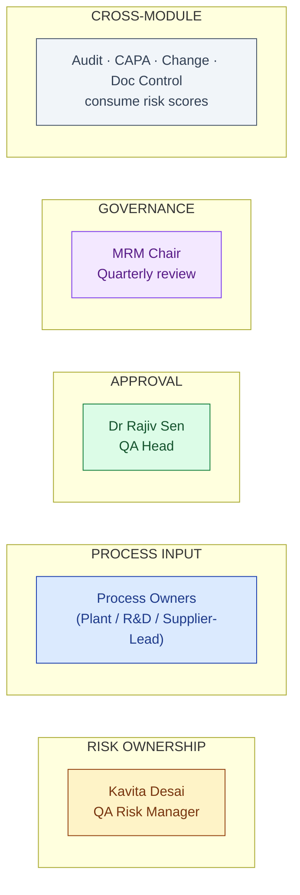
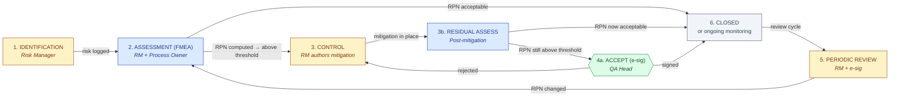
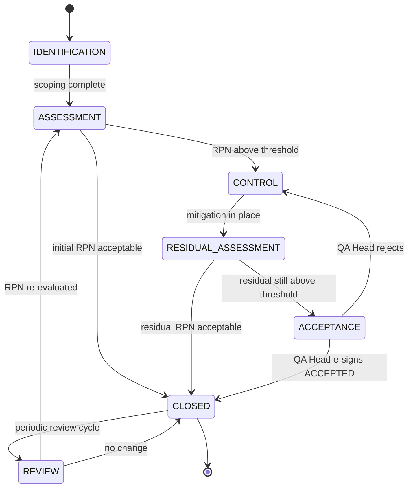

# DESIGN — Risk Management

| Field | Value |
|---|---|
| Module | Risk Management |
| Depth | Executive overview (with pointers to code for detail) |
| Pairs with | [URS.md](URS.md) (requirements), [ARCHITECTURE.md](ARCHITECTURE.md) (technical) |
| Last updated | 2026-06-01 |

---

## 1. Personas (4 primary, 1 secondary, 1 system)

Cross-reference [URS §2](URS.md#2-stakeholders-and-personas).



| # | Persona | Primary actions | Decisions |
|---|---|---|---|
| 1 | **QA Risk Manager (Kavita)** | Create/edit risk, orchestrate assessment, author mitigation, manage register | Risk identification + classification |
| 2 | **Process Owner** | Provide scoring input, review periodic | Severity / Occurrence / Detectability per their domain |
| 3 | **QA Head (Dr Sen)** | E-sign acceptance for high-RPN risks | Accept residual risk yes/no |
| 4 | **MRM Chair** | Review quarterly risk landscape | Programme-level escalations |
| 5 | **Tenant Admin** (secondary) | Configure thresholds, rubrics, review cadence | Per-tenant tuning |
| 6 | **Cross-module (auto)** | Read risk scores for audit/CAPA/change weighting | (none — consume) |

---

## 2. End-to-End Journey (lifecycle, 4 personas)



### Journey snapshots per persona

#### Risk Manager (Kavita)

```
1. Register dashboard     → /risks                          RiskRegister (filter by type/status/owner)
2. Heat map view          → /risks/heatmap                  RiskHeatMap
3. New risk               → /risks/new                      RiskCreateForm (AI scenario brainstormer panel — planned)
4. Identify source link   → /risks/new                      LinkSourceDialog (audit/complaint/deviation/change)
5. Open assessment        → /risks/[id]/assess              AssessmentForm (S/O/D + per-axis justification)
6. Author mitigation      → /risks/[id]/mitigate            MitigationPlanPanel (actions + owner + due date + link to SOP/CAPA)
7. Schedule review        → /risks/[id]                     ReviewSchedule widget
8. Periodic review        → /risks/[id]/review              ReviewDialog (sign REVIEWED)
```

#### Process Owner

```
1. My risks               → /risks?owner=me                 filtered RiskRegister
2. Provide scoring        → /risks/[id]/assess              AssessmentForm (collaborative; co-edit with RM)
3. Status update on control → /risks/[id]/mitigate          MitigationStatusUpdate (per action)
4. Periodic review        → /risks/[id]/review              acknowledge or escalate
```

#### QA Head (Dr Sen)

```
1. Acceptance inbox       → /risks/acceptance-queue         AcceptanceQueue (high-RPN awaiting decision)
2. Open risk              → /risks/[id]                     RiskDetail (full history)
3. Review assessment + mitigation history → /risks/[id]/history  AssessmentHistoryView
4. Accept or reject       → /risks/[id]/accept              SignatureDialog (meaning=ACCEPTED, justification ≥100 chars)
```

#### MRM Chair

```
1. MRM dashboard          → /risks/mrm                      MrmDashboard (quarterly roll-up)
2. Overdue reviews        → /risks?reviewOverdue=true       filtered RiskRegister
3. Trending risks         → /risks/mrm                      RiskTrendChart (aggregate)
4. Export packet          → /risks/mrm                      MrmExportButton (PDF for meeting)
```

---

## 3. Screen + Component Inventory

Pages under `frontend/app/(console)/risks/`.

### Common pages
| Route | Purpose | Key components |
|---|---|---|
| `/risks` | Risk register (filter by type/status/owner/RPN-band) | `RiskRegister`, `RiskFilterBar` |
| `/risks/heatmap` | Heat map (S × O, bubble = D, color = band) | `RiskHeatMap` |
| `/risks/new` | Create new risk | `RiskCreateForm`, `AiScenarioBrainstormPanel` (planned), `LinkSourceDialog` |
| `/risks/[id]` | Risk detail | `RiskDetail`, `AssessmentHistoryView`, `MitigationStatusView`, `LinkedRecordsTab` |
| `/risks/[id]/assess` | Assess / re-assess | `AssessmentForm`, `RpnCalculatorWidget`, `RubricHelpPanel` |
| `/risks/[id]/mitigate` | Mitigation planning | `MitigationPlanPanel`, `LinkMitigationToSopDialog`, `LinkMitigationToCapaDialog` |
| `/risks/[id]/accept` | High-RPN acceptance (QA Head) | `AcceptanceForm`, `SignatureDialog` |
| `/risks/[id]/review` | Periodic review | `ReviewDialog`, `SignatureDialog` (meaning=REVIEWED) |
| `/risks/[id]/audit-log` | Audit trail | `AuditLogTable` |
| `/risks/acceptance-queue` | QA Head approval inbox | `AcceptanceQueue` |
| `/risks/mrm` | MRM quarterly dashboard | `MrmDashboard`, `RiskTrendChart`, `MrmExportButton` |

### Admin
| Route | Purpose | Key components |
|---|---|---|
| `/admin/risk-config` | Thresholds + rubrics + cadence per risk type | `RiskConfigEditor`, `RubricEditor` |

### Cross-cutting components
- `SignatureDialog` — Part 11 ceremony (reused across modules)
- `RpnCalculatorWidget` — live RPN compute as user adjusts sliders
- `RiskHeatMap` — visualization (URS-B-004)
- `RiskTrendChart` — RPN over time (URS-B-005)
- `AiScenarioBrainstormPanel` (planned) — AI scenario suggestions with citations
- `LinkedRecordsTab` — cross-module references (audit findings, complaints, CAPAs, changes that link to this risk)

---

## 4. State Machine (Risk Lifecycle)



**State ownership:**

| State | Owner | What happens |
|---|---|---|
| IDENTIFICATION | Risk Manager | Risk logged + linked to source |
| ASSESSMENT | RM + Process Owner | FMEA scoring → RPN computed |
| CONTROL | Risk Manager | Mitigation actions assigned |
| RESIDUAL_ASSESSMENT | RM + Process Owner | Post-mitigation reassessment |
| ACCEPTANCE | QA Head | E-sig decision on residual |
| CLOSED | (system) | Risk closed or in monitoring |
| REVIEW | Risk Manager | Periodic review (annual default) |

**Transition rules** (enforced in `riskLifecycleService`):
- Forward-only by default
- Block triggers: incomplete assessment (blocks CONTROL exit), missing mitigation (blocks RESIDUAL_ASSESSMENT entry), no e-sig (blocks ACCEPTANCE → CLOSED), missing justification (blocks any transition with insufficient text)
- Revert allowed only by tenant_admin/superadmin with reasonForChange logged
- Every transition writes an AuditTrail row
- External triggers can reopen CLOSED → ASSESSMENT (e.g., Change Control approval, Complaint linkage)

### Decision gates

| Gate | Phase | Trigger | Enforcer | Audit-trail entry |
|---|---|---|---|---|
| **G-ASSESS** RPN compute | ASSESSMENT exit | All axes scored + justified | `riskAssessmentController` | `ASSESSED` (with RPN + band) |
| **G-MIT** Mitigation plan | CONTROL exit | At least one control action defined | `riskMitigationController` | `MITIGATION_PLANNED` |
| **G-ACC** QA Head e-sig | CLOSED entry (from ACCEPTANCE) | QA Head signs ACCEPTED | `requireESignature` middleware | `SIGNED` action, meaning=ACCEPTED |
| **G-REV** Periodic review e-sig | REVIEW exit | RM signs REVIEWED | `requireESignature` middleware | `SIGNED` action, meaning=REVIEWED |
| **G-XMOD** Cross-module trigger | ASSESSMENT (from CLOSED) | Change/Complaint flags risk reassessment | `riskCrossModuleService` | `RISK_REOPENED_BY_XMOD` |

---

## 5. Notifications and Reminders

| Event | Recipients | Channel |
|---|---|---|
| New risk identified | Risk Manager | Email + dashboard |
| Assessment requested | Process Owner | Email |
| RPN above threshold | Risk Manager + QA Head | Email + dashboard banner |
| Mitigation action overdue | Action owner + RM | Email + escalation |
| Acceptance pending | QA Head | Email |
| Periodic review T-30 | Owner + RM | Email |
| Periodic review overdue | RM + MRM Chair | Email + dashboard banner |
| Cross-module reassessment triggered | Risk owner + RM | Email + in-app |
| MRM quarterly digest | MRM Chair | Email + dashboard |

---

## 6. Error and Edge Cases

| Scenario | Handling |
|---|---|
| **Missing axis justification (<30 chars)** | Form blocks submit; field-level error |
| **RPN above threshold + RM tries to close without mitigation** | Backend rejects with "Mitigation required for RPN > threshold" |
| **Acceptance justification <100 chars** | Form blocks submit |
| **QA Head rejects acceptance** | State returns to CONTROL with rejection comment; RM authors revised mitigation |
| **Periodic review overdue** | Risk flagged "review-overdue"; MRM Chair sees in dashboard |
| **Cross-module trigger fires for closed risk** | Risk reopens to ASSESSMENT with trigger source logged |
| **AI scenario brainstormer returns empty** | Panel shows "No scenarios generated — start manual" |
| **Mitigation links to non-existent SOP** | Validation rejects; user guided to create SOP first |
| **Concurrent assessment edits (RM + PO)** | Optimistic lock via `updatedAt`; conflict surfaces as "Stale — refresh" |
| **Acceptance revoked after CLOSED** | Risk reopens to CONTROL; cross-module consumers re-notified |

---

## 7. Accessibility

- **Keyboard nav:** all forms tab-traversable; AssessmentForm sliders support arrow-key adjust
- **Screen reader:** ARIA labels on RPN compute, heat map cells, signature buttons
- **Color contrast:** RPN band colors (Green acceptable / Amber acceptable-with-control / Red unacceptable) meet WCAG AA; verified via shape + label, not color alone
- **Heat map**: bubble-size + position + color triple-encoding; screen-reader provides table fallback view
- **Focus management:** SignatureDialog traps focus
- **Open gaps:** RPN slider live updates need ARIA live-region polish; heat map keyboard navigation partial

---

## 8. Open Design Questions

1. **Heat map interaction** — click bubble → open risk detail vs hover → preview popover? Today: click.
2. **Scenario brainstormer UI** — surface as side panel on /risks/new, or separate `/risks/brainstorm` workspace? Today: side panel planned.
3. **Per-axis rubric help** — inline tooltips vs expandable side panel? Today: side panel.
4. **MRM packet export** — PDF vs deck (PPTX)? Today: PDF planned.
5. **Cross-module trigger transparency** — when Change Control auto-reopens a risk, do we always email RM, or only for high-RPN? Today: always email.
6. **Risk owner re-assignment** — UX for transferring ownership (e.g., role change)? Today: edit risk → change owner field.
7. **Mitigation action templates** — library of proven control patterns? Today: free-text; library planned with URS-B-006.
8. **Heat map filtering** — by type / owner / source? Today: by type only.
