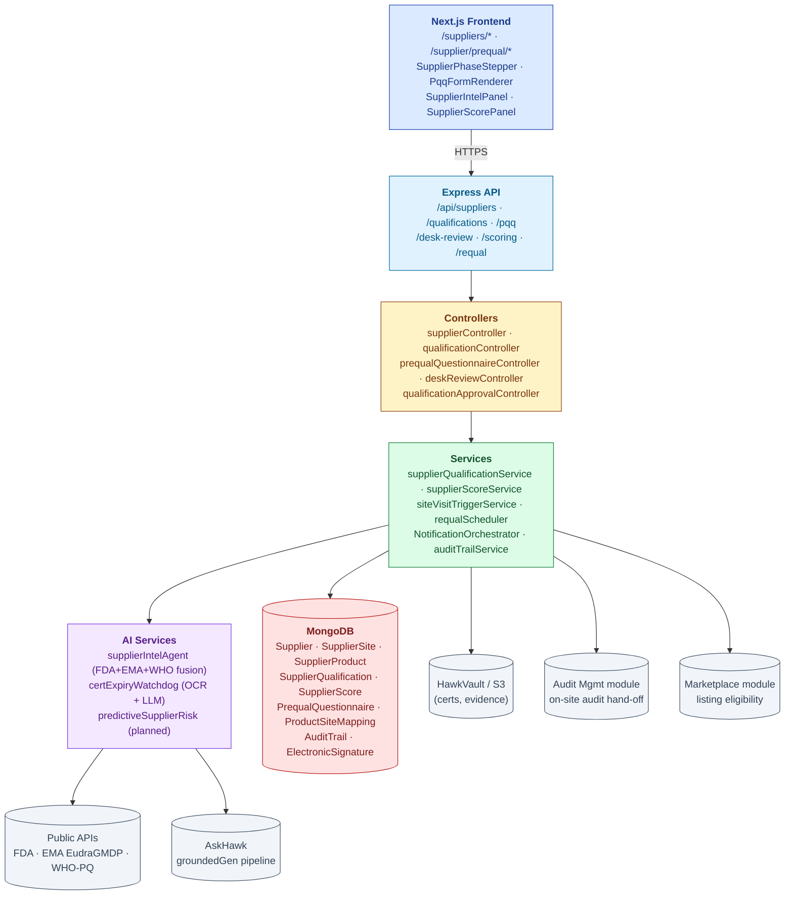
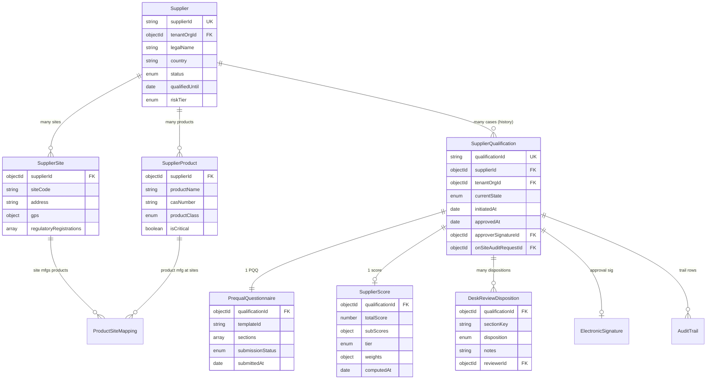
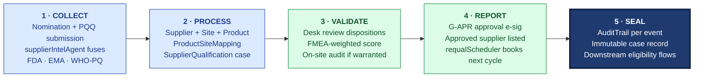

# ARCHITECTURE — Supplier Prequalification

| Field | Value |
|---|---|
| Module | Supplier Prequalification |
| Depth | Executive overview |
| Pairs with | [URS.md](URS.md), [DESIGN.md](DESIGN.md) |
| Last updated | 2026-06-01 |

---

## 1. System Context

**Tier ownership:**
- **Frontend** — phase stepper, PQQ form, score breakdown, e-sig modal
- **API + middleware** — auth, RBAC, e-sig enforcement, supplier-isolation guard
- **Controllers** — thin
- **Services** — qualification state machine, scoring algorithm, on-site trigger logic, requal cron
- **AI** — supplierIntelAgent (live), certExpiry watchdog (partial), predictive risk (planned)
- **External** — FDA/EMA/WHO APIs (rate-limited + cached), HawkVault (file storage)
- **Cross-module** — Audit (on-site hand-off), Marketplace (downstream eligibility), AskHawk (AI pipeline)

---

## 2. Data Model

### Primary entities

| Model | Purpose | Key fields |
|---|---|---|
| **Supplier** | Master record of a supplier organization | `supplierId`, `tenantOrgId`, `legalName`, `country`, `status` (NOMINATED/.../APPROVED/DISQUALIFIED), `qualifiedUntil`, `riskTier` |
| **SupplierSite** | Manufacturing/operational site | `supplierId`, `siteCode`, `address`, `gps`, `regulatoryRegistrations[]` (FDA FEI, EMA #, etc.) |
| **SupplierProduct** | Product the supplier offers | `supplierId`, `productName`, `casNumber`, `productClass` (API/Excipient/Packaging/Service), `isCritical` |
| **ProductSiteMapping** | Many-to-many: which site makes which product | `supplierId`, `siteId`, `productId`, `qualified` (per pair) |
| **SupplierQualification** | A single prequal case (history of cases per supplier) | `qualificationId`, `supplierId`, `currentState`, `approverSignatureId`, `onSiteAuditRequestId?` |
| **PrequalQuestionnaire** | Instance of PQQ template for one case | `qualificationId`, `templateId`, `sections[]`, `submissionStatus`, `submittedAt` |
| **SupplierScore** | Computed score for the case | `qualificationId`, `totalScore`, `subScores{}`, `tier`, `weights{}` (snapshot), `computedAt` |
| **DeskReviewDisposition** | Per-section review record | `qualificationId`, `sectionKey`, `disposition`, `notes`, `reviewerId` |
| **AuditTrail** (shared) | Cross-module 21 CFR Part 11 log | Standard fields |
| **ElectronicSignature** (shared) | Reused | Standard fields |

### Indexes

- `Supplier`: `(tenantOrgId, status)`, `supplierId` (unique)
- `SupplierQualification`: `(supplierId, currentState)`, `qualificationId` (unique)
- `ProductSiteMapping`: `(supplierId, productId, siteId)` (unique compound)
- `SupplierScore`: `qualificationId` (unique)
- `AuditTrail`: shared cross-module indexes

---

## 3. API Contract Catalog

All paths require `authenticate`; RBAC via `permit(...roles)`; tenant scope via `tenantMiddleware`.

### Supplier CRUD + lifecycle
| Endpoint | Roles | Purpose |
|---|---|---|
| `GET /api/suppliers` | all internal roles | List (tenant-scoped) |
| `POST /api/suppliers/nominate` | procurement, tenant_admin | Create + initiate qualification case |
| `GET /api/suppliers/:id` | all | Hub |
| `GET /api/suppliers/:id/sites`, `POST` | qa_prequal, supplier | Sites CRUD |
| `GET /api/suppliers/:id/products`, `POST` | qa_prequal, supplier | Products CRUD |
| `POST /api/suppliers/:id/products/:pid/site-mapping` | qa_prequal | Site mapping |

### Qualification case
| Endpoint | Roles | Purpose |
|---|---|---|
| `GET /api/suppliers/:id/qualifications` | all | List cases (history) |
| `POST /api/suppliers/:id/qualify` | qa_prequal | Initiate new case |
| `POST /api/suppliers/:id/qualification/transition` | qa_prequal, qa_approver | Forward transition |
| `POST /api/suppliers/:id/qualification/approve` | qa_approver (e-sig) | **G-APR** approve |
| `POST /api/suppliers/:id/qualification/reject` | qa_approver (e-sig) | **G-APR** reject |
| `POST /api/suppliers/:id/qualification/disqualify` | qa_approver (e-sig) | Ad-hoc disqualify |
| `POST /api/suppliers/:id/qualification/requalify` | qa_prequal | Start requal cycle |

### PQQ (Supplier-side + Buyer-side)
| Endpoint | Roles | Purpose |
|---|---|---|
| `GET /api/qualifications/:qid/pqq` | qa_prequal, supplier | Fetch |
| `POST /api/qualifications/:qid/pqq/sections/:key` | supplier, supplierUser | Save section |
| `POST /api/qualifications/:qid/pqq/submit` | supplier | Submit |
| `POST /api/qualifications/:qid/pqq/reuse-from/:priorQualId` | supplier | Clone previous |

### Desk review + scoring
| Endpoint | Roles | Purpose |
|---|---|---|
| `GET /api/qualifications/:qid/desk-review` | qa_prequal | Workspace |
| `POST /api/qualifications/:qid/desk-review/sections/:key` | qa_prequal | Sign disposition |
| `POST /api/qualifications/:qid/desk-review/lock` | qa_prequal | Lock |
| `GET /api/qualifications/:qid/score` | all | Computed score + breakdown |
| `POST /api/qualifications/:qid/score/recompute` | qa_prequal, tenant_admin | Force recompute |

### Periodic requal + scheduler
| Endpoint | Roles | Purpose |
|---|---|---|
| `GET /api/suppliers/requal-due` | qa_prequal | Upcoming queue |
| `POST /api/suppliers/:id/requal/initiate` | qa_prequal, cron | Open new cycle |

### AI dossier
| Endpoint | Roles | Purpose |
|---|---|---|
| `GET /api/suppliers/:id/intel` | qa_prequal, qa_approver | supplierIntelAgent dossier (cached) |
| `POST /api/suppliers/:id/intel/refresh` | qa_prequal | Force re-fetch from public sources |

---

## 4. RBAC Matrix

| Capability | Procurement | QA Prequal | QA Approver | Supplier | Supplier User | Tenant Admin |
|---|---|---|---|---|---|---|
| Nominate supplier | ✅ | ✅ | — | — | — | ✅ |
| Issue PQQ | — | ✅ | — | — | — | ✅ |
| Fill PQQ | — | — | — | ✅ | ✅ | — |
| Submit PQQ | — | — | — | ✅ | — | — |
| Desk review dispositions | — | ✅ | — | — | — | ✅ |
| Trigger on-site audit | — | ✅ | — | — | — | ✅ |
| Compute / view score | (view) | ✅ | (view) | — | — | ✅ |
| Approve / Reject (e-sig) | — | — | ✅ | — | — | ✅ |
| Disqualify (e-sig) | — | — | ✅ | — | — | ✅ |
| Initiate requal | — | ✅ | — | — | — | ✅ (or cron) |
| View AI dossier | (view) | ✅ | ✅ | — | — | ✅ |
| Configure templates / weights | — | — | — | — | — | ✅ |

**Cross-tenant guards:**
- `canSupplierAccessPrequal()` — supplier can only see their own qualification cases across all buyer tenants where they are listed
- `buildSupplierTenantScopeQuery()` — buyer queries filtered to `tenantOrgId`

---

## 5. AI Capabilities

All AI delegates to AskHawk's `groundedGenerationService` (per [AI-ARCHITECTURE.md](../../04-engineering/07-ai/AI-ARCHITECTURE.md)).

| Tool | Type | R/W | E-sig | Where | Status |
|---|---|---|---|---|---|
| **supplierIntelAgent** | Public-data fusion (FDA + EMA + WHO-PQ) | Read | No | `SupplierIntelPanel`; auto-feeds score sub-factor | ✅ live |
| **certExpiryWatchdog** | OCR + LLM cert date extraction | Read | No | PQQ submission + dashboard | ⚠️ Partial (OCR pipeline incomplete) |
| **predictiveSupplierRisk** | 12-mo failure prediction | Read | No | `/suppliers/[id]` risk panel | 🚫 Not built |

### Grounding posture
- **supplierIntelAgent** — confidence floor 0.55 (public-data noise tolerated); citations point to source records (Warning Letter #, inspection date, FEI #)
- **certExpiryWatchdog** — confidence floor 0.7 (false negatives have real cost); skeleton fallback returns "manual review needed"
- All AI calls write `recordAiDecision()` audit-trail row

### Cross-tenant intel (URS-B-006)
The supplierIntelAgent today fuses **public** sources only. Cross-tenant findings (one buyer's CAPA visible to another with consent) is deferred pending consent UI design.

---

## 6. State Machine Implementation

Cross-reference [DESIGN §4](DESIGN.md#4-state-machine).

- **Definition:** `backend/src/constants/supplierStates.js`
- **Validation:** `services/supplierQualificationService.js → canTransition()` — checks role, state prerequisites, score threshold
- **Application:** `applyStateTransition()` mutates Supplier + SupplierQualification, writes AuditTrail
- **Gates:** approval e-sig via `requireESignature`; score threshold via `supplierScoreService.checkBlockThreshold()`
- **Cron-driven transitions:** `requalScheduler.js` runs daily; opens new PERIODIC_REQUAL cases based on `qualifiedUntil` field

---

## 7. Compliance Traceability

| Feature | ICH Q7 §17 | EU GMP Ch.7 | ISO 9001 §8.4 | ISO 13485 §7.4.1 |
|---|---|---|---|---|
| Nomination + lifecycle | §17.40 | §7.1 | §8.4.1 | §7.4.1 |
| PQQ + evidence collection | §17.40 | §7.14 | §8.4.2 | §7.4.1 |
| Desk review | §17.42 | §7.14 | §8.4.2 | §7.4.1 |
| On-site trigger | §17.42 | §7.14 | §8.4.2(c) | §7.4.1 |
| Risk-based scoring | §17.40 risk-based | §7.4 | §8.4.1(d) | §7.4.1 |
| Approval e-sig (G-APR) | §17.40 | §7.14 | §8.4.1 | §7.4.1 |
| Periodic requalification | §17.40 ongoing | §7.16 | §8.4.2 | §7.4.1 |
| Disqualification | — | §7.16 | §8.4.1 | §7.4.1 |
| Audit trail (shared) | — | — | §7.5 | §4.2.5 |
| RBAC | — | §12 (personnel) | §7.2 | §6.2 |

Also: 21 CFR Part 11 §11.10 + §11.50 + §11.200 for e-sig ceremony.

---

## 8. Operational Concerns

### Performance
- Supplier list (1k suppliers): < 500 ms
- Score recompute: < 2 sec
- supplierIntelAgent dossier refresh: < 10 sec (cached 24h)
- PQQ form render (40+ sections): < 1.5 sec

### Failure modes
- **FDA / EMA API down** → cached dossier shown with "stale (last refreshed X days ago)" badge
- **Score computation error** → score withheld; QA Approver sees "score unavailable — investigate before approval"
- **HawkVault upload failure** → submit blocked; supplier sees per-file error
- **Cron requal scheduler failure** → next-day retry; on-call alert if 2 consecutive failures
- **E-sig password verification failure** → no state change; AuditTrail row SIGNATURE_FAILED

### Observability
- Tenant KPIs: # active suppliers, qualification cycle time, requal compliance %, AI dossier coverage
- Per-supplier: days-since-qualification, days-until-requal, cert expiry chips
- Audit trail = regulatory observability

---

## 9. Known Gaps + Engineering Debt

1. **Cross-buyer reuse consent UI** (URS-B-002, URS-B-006) — backend supports cross-tenant supplier identity, but consent flow not designed/implemented
2. **certExpiryWatchdog OCR pipeline** — partial (URS-B-003)
3. **Predictive supplier risk model** — not built (URS-B-004)
4. **Tier-1/Tier-N supply chain map** — not built (URS-B-005)
5. **Visual template editor for PQQ** — JSON-edit only today (open Q from DESIGN)
6. **Visual score-weight editor** — JSON-edit only today
7. **Mobile supplier portal** — desktop-first
8. **Disqualification appeals workflow** — not designed (open Q)
9. **ISO cert-body API integrations** — partial; FDA registration lookup live, ISO bodies vary
10. **Requal cron edge cases** — DST handling + global tenant timezones; needs hardening

---

## 10. Open Engineering Questions

1. **Cross-tenant supplier identity** — when buyer A and buyer B both have "Acme Pharma" listed, do we merge into one master record or keep separate? Current = separate per tenant.
2. **Public API rate limiting** — FDA limits to 240 req/min; with 1k+ tenants, cache strategy + rotation?
3. **Score weights versioning** — when a tenant changes weights, do we recompute historical scores (no) or snapshot weights per case (yes, current)?
4. **Vector DB for supplierIntel** — when do we move to pgvector for the fused dossier corpus?
5. **Webhook from FDA Warning Letter feed** — pull or push? Today daily pull.
6. **Multi-region (EU GDPR / India DPDPA / US)** — supplier data residency requirements?

---

## 11. Code Path Index

| Concern | Path |
|---|---|
| Routes | `backend/src/routes/supplier*.js`, `prequal*.js`, `qualification*.js` |
| Controllers | `backend/src/controllers/{supplierController,qualification*,deskReviewController,prequalQuestionnaireController}.js` |
| Services | `backend/src/services/{supplierQualificationService,supplierScoreService,siteVisitTriggerService}.js` |
| Models | `backend/src/models/{Supplier,SupplierSite,SupplierProduct,ProductSiteMapping,SupplierQualification,PrequalQuestionnaire,SupplierScore,DeskReviewDisposition}.js` |
| AI agents | `backend/src/services/ai/{supplierIntelAgent,certExpiryWatchdog}.js` |
| Cron | `backend/src/cron/requalScheduler.js` |
| Middlewares | shared `requireESignature`, `tenantMiddleware`; module `canSupplierAccessPrequal` |
| Constants | `backend/src/constants/{supplierStates,pqqTemplates}.js` |
| Frontend pages | `frontend/app/(console)/{suppliers,supplier/prequal}/**` |
| Frontend components | `frontend/components/suppliers/{SupplierPhaseStepper,PqqFormRenderer,SupplierIntelPanel,SupplierScorePanel,DeskReviewTable,ScoreBreakdown}.tsx` |

---

## 12. The Five-Pillar Walkthrough

Supplier Prequalification is the entry-gate module for Hawkeye's supply-chain quality program — every supplier that ships material into a regulated workflow walks the five pillars at least once, and re-walks them on the periodic requalification cadence. **Collect** happens when procurement nominates a new supplier and the `supplierIntelAgent` fuses public data from FDA, EMA EudraGMDP, and WHO-PQ (Warning Letters, inspection history, FEI registrations) into a starter dossier; the supplier then completes a `PrequalQuestionnaire` (PQQ) capturing capabilities, certifications, and past audit history. **Process** normalizes the submission into `Supplier` + `SupplierSite` + `SupplierProduct` + `ProductSiteMapping` records and resolves identity against the existing supplier-master; a `SupplierQualification` case is opened with state machine tracking the lifecycle. **Validate** runs in two layers: QA Prequal performs a desk review (cert validity, regulatory standing, completeness of evidence) via `DeskReviewDisposition` rows, and `supplierScoreService` computes a FMEA-weighted risk score; if the score warrants it, `siteVisitTriggerService` hands off to the Audit Management module to schedule an on-site visit. **Report** ends with the QA Approver issuing an Approved / Conditionally Approved / Not Qualified decision via APPROVED e-signature; the supplier moves to the approved list and `requalScheduler` books the next periodic requalification. **Seal** writes an `AuditTrail` row per qualification event, score change, disposition, and approval signature; the case is immutable, and downstream modules (Audit Management, Batch Records, Marketplace) consume the approved-supplier status as a gating eligibility check.

### Cross-module spawn notes

- **FEEDS** Audit Management — only qualified suppliers are eligible for the on-site audit workflow; `siteVisitTriggerService` hands off the audit-request envelope when the desk review warrants on-site verification
- **FEEDS** Batch Records — sourcing decisions in the batch-record module check `Supplier.status === 'APPROVED'` and `qualifiedUntil > now`
- **FEEDS** Marketplace — qualified suppliers become listable in the Hawkeye marketplace module (downstream eligibility gate)
- **SPAWNS** Audit Management workflow when on-site visit is needed (via `onSiteAuditRequestId` link)
- **SPAWNS** CAPA when desk review or on-site audit surfaces findings serious enough to warrant corrective action
- **CROSS-TENANT INTEL** (URS-B-006) — surfacing one buyer's findings to another with consent is deferred pending consent UI design; today supplierIntelAgent only fuses public sources

### Code-path table

| Pillar | Code path | What it does |
|---|---|---|
| 1 · Collect | `backend/src/controllers/supplierController.js` · `models/Supplier.js` | Nomination + supplier master record |
| 1 · Collect | `backend/src/controllers/prequalQuestionnaireController.js` · `models/PrequalQuestionnaire.js` | PQQ template instantiation and supplier-side data capture |
| 1 · Collect | `backend/src/services/ai/supplierIntelAgent.js` | Public-data fusion from FDA · EMA EudraGMDP · WHO-PQ |
| 2 · Process | `backend/src/controllers/qualificationController.js` · `models/SupplierQualification.js` · `SupplierSite.js` · `SupplierProduct.js` · `ProductSiteMapping.js` | Opens qualification case + normalizes site/product records |
| 2 · Process | `backend/src/services/supplierQualificationService.js → canTransition()` | State-machine gating per `constants/supplierStates.js` |
| 3 · Validate | `backend/src/controllers/deskReviewController.js` · `models/DeskReviewDisposition.js` | Per-section desk review dispositions by QA Prequal |
| 3 · Validate | `backend/src/services/supplierScoreService.js` · `models/SupplierScore.js` | FMEA-weighted scoring with snapshot weights per case |
| 3 · Validate | `backend/src/services/siteVisitTriggerService.js` | Hands off to Audit Management when on-site verification is warranted |
| 4 · Report | `backend/src/controllers/qualificationApprovalController.js` · `middlewares/requireESignature.js` (`signatureMeaning='APPROVED'`) | G-APR approval / rejection / disqualification e-sig by QA Approver |
| 4 · Report | `backend/src/cron/requalScheduler.js` | Daily cron books next PERIODIC_REQUAL case based on `qualifiedUntil` |
| 5 · Seal | `backend/src/services/auditTrailService.js` (shared) | AuditTrail per qualification event · score change · state transition · sign-off |
| 5 · Seal | `Supplier.status` + `qualifiedUntil` fields consumed by Audit · Batch Records · Marketplace | Downstream modules treat approved status as the gating eligibility check |
