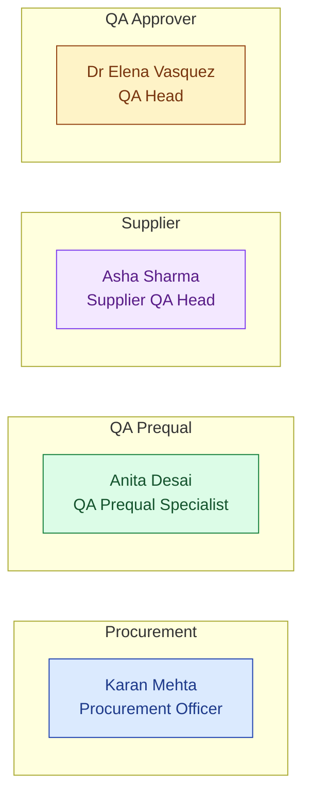
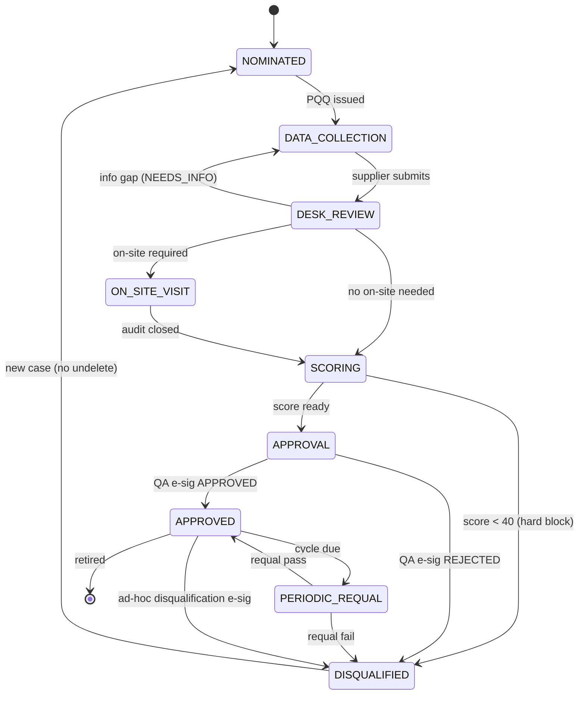

# DESIGN — Supplier Prequalification

| Field | Value |
|---|---|
| Module | Supplier Prequalification |
| Depth | Executive overview |
| Pairs with | [URS.md](URS.md), [ARCHITECTURE.md](ARCHITECTURE.md) |
| Last updated | 2026-06-01 |

---

## 1. Personas (4 primary, 1 secondary)

Cross-reference [URS §2](URS.md#2-stakeholders-and-personas). The flow is a **4-lane swimlane**: Procurement initiates, QA Prequal works the case, Supplier provides, QA Approver decides.



| # | Persona | Lane | Primary actions | Decisions |
|---|---|---|---|---|
| 1 | **Procurement Officer** (Karan) | Procurement | Nominate supplier; track status | Whom to nominate; urgency |
| 2 | **QA Prequal Specialist** (Anita) | QA Prequal | Issue PQQ; desk review; trigger on-site; recommend | Section dispositions; on-site need |
| 3 | **Supplier QA Head** (Asha) | Supplier | Submit PQQ; upload certs; respond to requal | Data accuracy + completeness |
| 4 | **QA Approver / QA Head** (Elena) | QA Approver | Final e-sig (approve / reject / disqualify) | Qualification outcome |
| 5 | **Tenant Admin** | (platform) | Configure PQQ templates, scoring weights, requal cadence | Per-tenant config |

---

## 2. End-to-End Journey

```mermaid
flowchart LR
    classDef proc fill:#dbeafe,stroke:#1e40af,color:#1e3a8a
    classDef qa fill:#dcfce7,stroke:#15803d,color:#14532d
    classDef supp fill:#f3e8ff,stroke:#7c3aed,color:#581c87
    classDef appr fill:#fef3c7,stroke:#92400e,color:#78350f
    classDef done fill:#dcfce7,stroke:#15803d,color:#14532d

    NOM["1. NOMINATED<br/><i>Procurement</i>"]:::proc
    DAT["2. DATA_COLLECTION<br/><i>Supplier</i>"]:::supp
    DSK["3. DESK_REVIEW<br/><i>QA Prequal</i>"]:::qa
    ONS["4. ON_SITE<br/><i>(optional, Audit Mgmt)</i>"]:::qa
    SCR["5. SCORING<br/><i>System</i>"]:::qa
    APR["6. APPROVAL<br/><i>QA Approver</i>"]:::appr
    OK["7. APPROVED<br/><i>Active</i>"]:::done
    REQ["8. PERIODIC_REQUAL<br/><i>Annual/Semi/Quarterly</i>"]:::supp
    DISQ["DISQUALIFIED<br/><i>Terminal-recoverable</i>"]

    NOM --> DAT
    DAT -->|PQQ submitted| DSK
    DSK -->|product class HIGH risk| ONS
    DSK -->|LOW risk| SCR
    ONS --> SCR
    SCR --> APR
    APR -->|e-sig APPROVED| OK
    APR -->|e-sig REJECTED| DISQ
    OK --> REQ
    REQ -->|on schedule| OK
    REQ -->|fail| DISQ
    DISQ -.->|new case| NOM
```



### Journey snapshots per persona

#### Procurement (Karan)
```
1. Nominate supplier         → /suppliers (new) → form: name, country, product scope
2. Track status              → /suppliers (filter: my-nominated)
3. View qualification record → /suppliers/[id]
4. (Later) Issue PO          → external ERP (S.M.A.R.T. Hawk is not the PO system)
```

#### QA Prequal Specialist (Anita)
```
1. Inbox of incoming cases   → /suppliers/prequal-inbox
2. Issue PQQ to supplier     → /suppliers/[id]/pqq → "Send to supplier"
3. Monitor submission        → /suppliers/[id] (section status board)
4. Desk review per section   → /suppliers/[id]/desk-review (PASS/FAIL/NEEDS_INFO)
5. Trigger on-site (if req)  → button creates Audit Request (Audit module)
6. Review computed score     → /suppliers/[id]/scoring (sub-score breakdown)
7. Recommend decision        → routes to QA Approver
```

#### Supplier QA Head (Asha)
```
1. Inbox                     → /supplier/prequal (incoming PQQs)
2. Open PQQ                  → /supplier/prequal/[id] (sectioned form)
3. Clone from last submission → "Reuse from <Buyer X>" (with consent prompt)
4. Upload certs              → per-question file picker (HawkVault)
5. Submit                    → state: supplier_submitted; notifies QA Prequal
6. Respond to requal         → /supplier/prequal/requal-due
```

#### QA Approver (Elena)
```
1. Approval queue            → /suppliers/awaiting-approval
2. Review case               → /suppliers/[id] (read-only summary + score + desk review)
3. Decide                    → APPROVE / REJECT / REQUEST_INFO
4. E-sign                    → SignatureDialog (reason ≥10 chars)
```

---

## 3. Screen + Component Inventory

### Buyer side (`/suppliers/...`)
| Route | Purpose | Key components |
|---|---|---|
| `/suppliers` | List + filter (qualified / pending / disqualified / requal-due) | `SupplierList`, status chips |
| `/suppliers/prequal-inbox` | QA Prequal's work queue | filtered list, SLA badges |
| `/suppliers/awaiting-approval` | QA Approver's queue | summary cards |
| `/suppliers/requal-due` | Periodic requal upcoming | due-date sort |
| `/suppliers/[id]` | Supplier hub | `SupplierPhaseStepper`, `SupplierIntelPanel`, `SupplierScorePanel`, tabs |
| `/suppliers/[id]/pqq` | PQQ viewer (buyer side) | `PqqSectionGrid`, section status |
| `/suppliers/[id]/desk-review` | Section-by-section disposition | `DeskReviewTable`, evidence preview |
| `/suppliers/[id]/scoring` | Score breakdown | `ScoreBreakdown`, factor weights |
| `/suppliers/[id]/sites` | Sites + per-site qualification | `SupplierSitesMap` |
| `/suppliers/[id]/products` | Products + site mapping | `SupplierProductTable` |
| `/suppliers/[id]/audit-log` | Cross-module audit trail | `AuditLogTable` |

### Supplier side (`/supplier/prequal/...`)
| Route | Purpose | Key components |
|---|---|---|
| `/supplier/prequal` | Inbox of incoming PQQs | list with buyer + due date |
| `/supplier/prequal/[id]` | Fill PQQ | `PqqFormRenderer`, evidence upload |
| `/supplier/prequal/requal-due` | Upcoming requal cycles | reuse last-submission action |

### Cross-cutting
- `SupplierPhaseStepper` — 8-phase visual
- `SupplierIntelPanel` — AI-augmented public-data dossier
- `SupplierScorePanel` — score + tier chip
- `SignatureDialog` — Part 11 e-sig (shared)
- `AuditLogTable` — shared cross-module
- `AskHawkDrawer` — for "how do I evaluate this supplier?" persona-aware playbook

---

## 4. State Machine



**State ownership:**

| State | Owner | Gate |
|---|---|---|
| NOMINATED | Procurement | Issue PQQ |
| DATA_COLLECTION | Supplier | Submit |
| DESK_REVIEW | QA Prequal | Section dispositions complete |
| ON_SITE_VISIT | QA Prequal → Audit module | Audit closure |
| SCORING | System (auto) | Score ≥ 40 |
| APPROVAL | QA Approver | E-sig APPROVE/REJECT |
| APPROVED | (active) | Periodic requal cycle |
| PERIODIC_REQUAL | Supplier + QA Prequal | Updated submission |
| DISQUALIFIED | (terminal-recoverable) | New case begins fresh |

**Transition rules** (in `supplierQualificationService.canTransition()`):
- Forward by default; revert to DATA_COLLECTION allowed from DESK_REVIEW (NEEDS_INFO)
- Reverts elsewhere require tenant_admin + reason
- Every transition writes AuditTrail

### Decision gates

| Gate | Phase | Trigger | Enforcer |
|---|---|---|---|
| **G-PQQ** | DATA → DESK | Supplier submit | `prequalQuestionnaireController.submit()` |
| **G-OSV** | DESK → ON_SITE | Auto-trigger (product class + score + geo) | `siteVisitTriggerService` |
| **G-SCORE** | SCORING entry | Auto-compute on desk + on-site complete | `supplierScoreService` |
| **G-APR** | APPROVAL | QA Approver e-sig | `requireESignature` + `qualificationApprovalController` |
| **G-REQUAL** | APPROVED → PERIODIC_REQUAL | Cron based on tier | `cron/requalScheduler.js` |

---

## 5. Notifications

| Event | Recipients | Channel |
|---|---|---|
| Supplier nominated | QA Prequal Specialist | Email + dashboard |
| PQQ issued | Supplier QA Head | Email |
| Supplier submits PQQ | QA Prequal Specialist | Email + dashboard |
| On-site triggered | Audit Mgmt notifies its actors | (handed off) |
| Score computed | QA Approver | Dashboard |
| Approval pending | QA Approver | Email |
| Qualification decision | Procurement + Supplier + QA Prequal | Email |
| Requal due (60/30/7 days) | Supplier + QA Prequal | Email |
| Cert expiring (90/60/30/7 days) | Supplier + QA Prequal | Email + dashboard |
| Disqualification | All downstream consumers (Procurement, Marketplace, Audit) | Email + system flag |

---

## 6. Error and Edge Cases

| Scenario | Handling |
|---|---|
| **Supplier never submits PQQ** | After SLA breach (configurable, default 30 days) → reminder cadence; auto-archive after 90 |
| **Score = 39 (just below block)** | Approval queue shows in red with breakdown; QA Approver may still REJECT explicitly, but cannot APPROVE without override (override = tenant_admin) |
| **On-site audit fails** | Score recomputed including audit findings; may drop below 40 → auto-DISQUALIFIED |
| **Cert uploaded but expired** | OCR flags; supplier blocked from submit until updated cert provided |
| **Disqualified supplier in active PO** | Procurement banner: "Supplier disqualified on <date> for <reason>. Existing POs continue per quality agreement; no new POs permitted." |
| **Cross-buyer reuse without consent** | Modal: "Share your prequal data with <Buyer Y>? You may revoke at any time." (URS-B-002, deferred) |
| **AskHawk supplierIntelAgent fails** | Score computed from internal factors only; dossier panel shows "AI dossier unavailable; using internal data" |

---

## 7. Accessibility

- **Keyboard nav:** all forms tab-traversable; section navigator supports Page-Up/Down
- **Screen reader:** ARIA labels on score breakdown bars, tier chips, status pills
- **Color contrast:** tier colors (LOW green / MED amber / HIGH orange / BLOCK red) meet WCAG AA
- **Focus management:** SignatureDialog traps focus
- **Open gaps:** site map (URS-A-070) — need ARIA alt-text for marker clusters

---

## 8. Open Design Questions

1. **PQQ template editor UI** — today templates are JSON-edited by tenant admin; should we ship a visual template editor?
2. **Score weight editor** — same — JSON today; visual?
3. **Cross-buyer reuse UX** — consent granularity (per-buyer, per-field, blanket); supplier-side mental model?
4. **Site map visualization** — clustering at country level vs city; offline support for slow networks?
5. **Disqualification appeals** — UI flow for supplier to formally appeal? Today only re-nomination.
6. **Mobile supplier portal** — many supplier QA heads in emerging markets are mobile-first; current is desktop-optimized
7. **AskHawk "How do I evaluate this supplier?"** — persona-aware playbook surfacing in `SupplierIntelPanel`?
