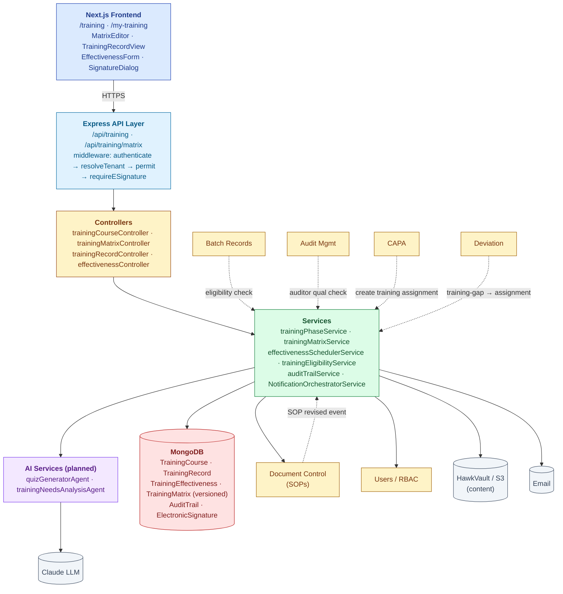
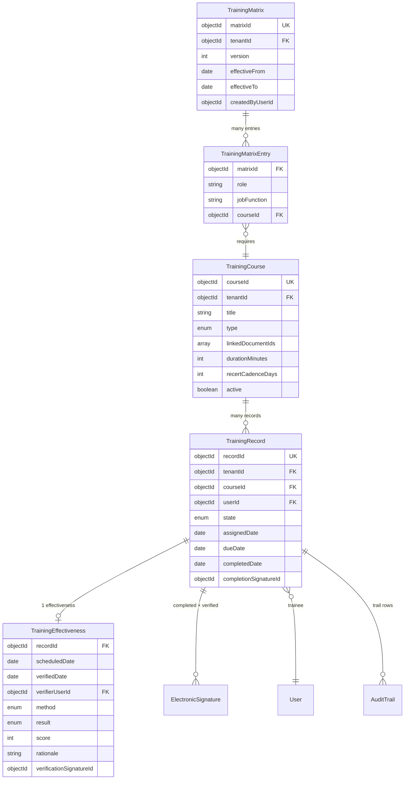
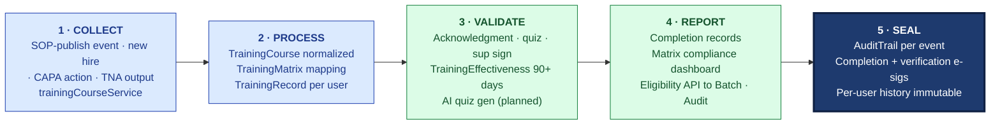

# ARCHITECTURE — Training

| Field | Value |
|---|---|
| Module | Training |
| Depth | Executive overview with planned code paths |
| Pairs with | [URS.md](URS.md), [DESIGN.md](DESIGN.md) |
| Last updated | 2026-06-01 |

---

## 1. System Context

**Tier ownership:**
- Frontend — inboxes, catalog/matrix editors, content viewer, e-sig modal
- API + middleware — auth, RBAC, e-sig
- Controllers — thin
- Services — state, scheduling, matrix versioning, eligibility, AI orchestration
- External modules — Doc Control (SOPs), Users (roles), Batch/Audit (eligibility consumers), CAPA/Deviation (assignment sources)

---

## 2. Data Model

### Primary entities

| Model | Purpose | Key fields | References |
|---|---|---|---|
| **TrainingCourse** | Catalog entry | `courseId`, `tenantId`, `title`, `type` (SOP_READ/CLASSROOM/ONLINE/OJT/QUIZ), `linkedDocumentIds[]`, `durationMinutes`, `recertCadenceDays`, `active` | Doc Control documents |
| **TrainingMatrix** (versioned) | Snapshot of role-requirement mapping | `matrixId`, `tenantId`, `version`, `effectiveFrom/To` | tenants, users |
| **TrainingMatrixEntry** | Single row in matrix | `matrixId`, `role`, `jobFunction`, `courseId` | TrainingMatrix, TrainingCourse |
| **TrainingRecord** | Per-user-per-course | `recordId`, `tenantId`, `courseId`, `userId`, `state`, `assignedDate`, `dueDate`, `completedDate`, `completionSignatureId` | TrainingCourse, users, ElectronicSignature |
| **TrainingEffectiveness** | Effectiveness check | `recordId`, `scheduledDate`, `verifiedDate`, `verifierUserId`, `method` (QUIZ/OBS/INTERVIEW), `result` (PASS/FAIL), `score`, `rationale`, `verificationSignatureId` | TrainingRecord, users, ElectronicSignature |
| **AuditTrail** (cross-module) | Part 11 log | per platform schema | All |

### Indexes (key)

- `TrainingRecord`: `(tenantId, userId, state)`, `(tenantId, courseId, state)`, `dueDate` (overdue queries), `(userId, courseId, completedDate desc)` — used by eligibility lookup hot path
- `TrainingCourse`: `(tenantId, active)`, `linkedDocumentIds` (for SOP-revised reassignment fanout)
- `TrainingMatrix`: `(tenantId, effectiveFrom desc)` — find current
- `TrainingEffectiveness`: `scheduledDate` (for nightly scheduler)

---

## 3. API Catalog (planned)

### Catalog

| Endpoint | Roles | Purpose |
|---|---|---|
| `GET /api/training/courses` | all | List/filter |
| `POST /api/training/courses` | coordinator, tenant_admin | Create |
| `PATCH /api/training/courses/:id` | coordinator, tenant_admin | Update |
| `POST /api/training/courses/:id/generate-quiz` | coordinator | Invoke quizGeneratorAgent |

### Matrix

| Endpoint | Roles | Purpose |
|---|---|---|
| `GET /api/training/matrix` | all | Current version |
| `GET /api/training/matrix/versions` | coordinator, tenant_admin | All versions |
| `POST /api/training/matrix` | coordinator, tenant_admin | New version (audit-trailed) |
| `GET /api/training/matrix/:roleId` | all | Per-role requirements |

### Records

| Endpoint | Roles | Purpose |
|---|---|---|
| `POST /api/training/:courseId/assign` | coordinator, system | Create assignment(s) |
| `GET /api/training/records/me` | trainee | My inbox |
| `GET /api/training/records/:id` | trainee, manager, coord | Detail |
| `POST /api/training/records/:id/complete` | trainee | E-sig COMPLETED |
| `POST /api/training/records/:id/verify-effectiveness` | qa verifier | E-sig VERIFIED |
| `POST /api/training/records/:id/defer` | coordinator | Deferred with reason |

### Eligibility (consumed cross-module)

| Endpoint | Roles | Purpose |
|---|---|---|
| `GET /api/training/user/:userId/eligibility?sopId=...` | all | Boolean + reason |
| `GET /api/training/user/:userId/matrix-status` | manager, coord | All required + status |

### Audit trail

| Endpoint | Roles | Purpose |
|---|---|---|
| `GET /api/training/records/:id/audit-trail` | all | Per-record |
| `GET /api/audit-trail/by-entity?type=TrainingRecord&id=...` | all | Cross-module |

---

## 4. RBAC Matrix

| Capability | Trainee | Trainer | Coordinator | QA Verifier | Manager | Tenant Admin | Superadmin |
|---|---|---|---|---|---|---|---|
| View catalog | ✅ | ✅ | ✅ | ✅ | ✅ | ✅ | ✅ |
| Create/edit course | — | — | ✅ | — | — | ✅ | ✅ |
| Edit matrix (new version) | — | — | ✅ | — | — | ✅ | ✅ |
| Assign training | — | — | ✅ | — | — | ✅ | ✅ |
| Complete (e-sig) | ✅ (self) | ✅ (self) | ✅ (self) | ✅ (self) | ✅ (self) | ✅ (self) | — |
| Verify effectiveness (e-sig) | — | — | — | ✅ | — | ✅ | ✅ |
| Defer assignment | — | — | ✅ | — | — | ✅ | ✅ |
| Read team compliance | — | — | ✅ | ✅ | ✅ | ✅ | ✅ |
| Read audit trail | ✅ | ✅ | ✅ | ✅ | ✅ | ✅ | ✅ |

**Segregation-of-Duties:** Manager cannot self-attest on behalf of trainee; trainee cannot self-verify their own effectiveness.

---

## 5. AI Capabilities

All routes through platform `groundedGenerationService` and audit-trailed via `recordAiDecision`.

| Tool | Type | R/W | E-sig | Where | Status |
|---|---|---|---|---|---|
| **quizGeneratorAgent** | Generate effectiveness quiz from SOP content | READ (generates draft) | NO (coord publishes) | Course editor "Generate Quiz" CTA | ⏳ planned |
| **trainingNeedsAnalysisAgent** | Recommend new training based on deviation/CAPA patterns | READ | NO | `/training/insights` panel | ⏳ planned |

### Grounding posture

- `quizGeneratorAgent` — grounds on SOP text from Doc Control; cites SOP sections per question; `minConfidence: 0.7`; skeleton fallback (1-2 generic questions) if confidence low; coordinator always edits before publishing
- `trainingNeedsAnalysisAgent` — grounds on aggregate deviation + CAPA records (last N months); citations link to source records; coordinator reviews recommendations before acting

### Active learning

Coordinator disposition of AI-generated quizzes (USER_ACCEPTED / USER_EDITED / USER_REJECTED) feeds the loop.

---

## 6. State Machine Implementation

Cross-reference [DESIGN §4](DESIGN.md#4-state-machine).

- **Definition:** `backend/src/constants/trainingStates.js` (planned)
- **Validation:** `services/trainingPhaseService.js → canTransition()` — checks role + prereqs
- **Application:** `services/trainingPhaseService.js → applyTransition()` — mutates state, writes AuditTrail
- **Effectiveness scheduler:** `services/effectivenessSchedulerService.js` — nightly cron, scans COMPLETED records with `completedDate + recertCadenceDays <= today`
- **SOP-revised fanout:** Doc Control publishes `sop.published` event; this module's subscriber enumerates `TrainingCourse.linkedDocumentIds` and creates new ASSIGNED records for affected users
- **Role-change fanout:** Users module publishes `user.role-changed` event; subscriber recomputes matrix delta and creates new assignments

**Gate enforcement:**
- **G-Complete** — `middlewares/requireESignature.js` with `signatureMeaning='COMPLETED'`; signer must be the trainee
- **G-Verify** — `middlewares/requireESignature.js` with `signatureMeaning='VERIFIED'`; signer must not be the trainee (SoD)

---

## 7. Compliance Traceability

| Feature | 21 CFR 211 | EU GMP | ICH Q10 | ISO 9001 | ISO 13485 | 21 CFR Part 11 |
|---|---|---|---|---|---|---|
| Training catalog + matrix | **§211.25** | Ch.2 §2.10 | §3.2.4 | §7.2 / §7.3 | §6.2 | — |
| Per-user records | §211.25 | Ch.2 | §3.2.4 | §7.2 | §6.2 | §11.10(b) |
| Trainee completion e-sig | — | Ch.2 | §3.2.4 | §7.2 | §6.2 | **§11.50, §11.10(i)** |
| Effectiveness verification | — | Ch.2 §2.13 | §3.2.4 | §7.2 (d) | §6.2 (d) | §11.50 |
| SOP-revised reassignment | — | Ch.4 | §3.2.4 | §7.5 | §4.2 | §11.10(e) |
| Audit trail | §211.180 | Ch.4 | §3.2.4 | §7.5.3 | §4.2.5 | **§11.10(e), §11.10(k)** |
| Eligibility gating cross-module | §211.25 + §211.188 | Ch.2 | §3.2.4 | §7.2 | §6.2 | §11.10(d) |
| Matrix versioning | — | Ch.2 | §3.2.4 | §7.5 | §4.2 | §11.10(e) |

---

## 8. Operational Concerns

### Performance targets
- Eligibility lookup: **< 100 ms p95** (called from Batch step entry hot path)
- Trainee inbox: < 500 ms
- Matrix editor save: < 1 sec
- Compliance report (per role): < 2 sec
- SOP-revised fanout: < 60 sec for 5,000 users

### Failure modes + recovery
- **SOP-revised fanout fails partially** — idempotent assignment creation; retry queue
- **Effectiveness scheduler skip** — next nightly run picks up missed; alert on 2 consecutive failures
- **Email delivery fails** — in-app notification fallback; retry queue
- **LLM provider down (quiz gen)** — UI shows "AI quiz unavailable, build manually"; nothing blocked
- **Concurrent matrix edits** — optimistic lock on matrix version; conflict prompts merge view
- **Trainee tries to e-sig completion without reading content (online courses)** — content viewer must reach end before e-sig button enabled

### Observability
- Per-tenant metrics: trainings-assigned, completion rate, overdue %, effectiveness pass rate, mean time to completion
- Eligibility API p95/p99 latency
- Alerts: completion rate < 80% for any role; effectiveness fail rate > 20% for any course

---

## 9. Known Gaps + Engineering Debt

1. **External LMS integration** — SuccessFactors / Cornerstone / Workday Learning — planned
2. **SCORM 1.2 / 2004 content** — deferred
3. **Mobile / tablet UX** — desktop-first today
4. **Multi-language content** — single language v1
5. **AI quiz generator + TNA** — planned, not built
6. **Cross-tenant portability** — export wizard planned (URS-B-006)
7. **Live in-person training calendar** — future
8. **Onboarding workflow beyond training** — out of scope

---

## 10. Open Engineering Questions

1. **Eligibility cache** — in-process LRU vs Redis vs Mongo (TTL 5 min)?
2. **Matrix versioning storage** — full snapshots vs delta?
3. **Event bus for cross-module fanout** — Kafka / BullMQ / Mongo change streams?
4. **Content storage** — S3 with signed URLs vs in-app proxy?
5. **Quiz state during in-progress** — Mongo doc per attempt vs session storage?
6. **Audit-trail volume** — assignments fanout can be large; archive strategy at 5y+?

---

## 11. Code Path Index (planned)

| Concern | Primary code path |
|---|---|
| Routes | `backend/src/routes/training*.js` |
| Controllers | `backend/src/controllers/training*.js`, `effectivenessController.js` |
| Services | `backend/src/services/training*.js`, `effectivenessSchedulerService.js`, `trainingEligibilityService.js` |
| Models | `backend/src/models/Training*.js` |
| Middlewares | `backend/src/middlewares/{authMiddleware,roleMiddleware,requireESignature}.js` |
| Constants | `backend/src/constants/trainingStates.js` |
| AI | `backend/src/services/ai/quizGeneratorAgent.js`, `trainingNeedsAnalysisAgent.js` |
| Event subscribers | `backend/src/subscribers/sopPublishedHandler.js`, `userRoleChangedHandler.js` |
| Frontend pages | `frontend/app/(console)/training/**`, `my-training/**` |
| Frontend components | `frontend/components/training/{MatrixEditor,TrainingRecordView,EffectivenessForm,EligibilityBadge,TrainingStateChip}.tsx` |
| Inter-module clients | `frontend/lib/clients/trainingClient.ts` (consumed by Batch/Audit) |

---

## 12. The Five-Pillar Walkthrough

Training Management is downstream of nearly every other quality module — when a new SOP publishes, a CAPA needs an action, or an audit finds a competency gap, training is the closing mechanism. **COLLECT** receives the trigger through one of four channels: a new SOP from Doc Control (via `sop.published` event), a new hire from the Users module (`user.role-changed` event), a CAPA action item, or a training-needs analysis output; `trainingCourseService` and the matrix subscribers fan the trigger out to affected users. **PROCESS** normalizes the requirement into a `TrainingCourse` (or reuses an existing one), maps it to the role through the versioned `TrainingMatrix`, and creates per-user `TrainingRecord` assignments with due dates. **VALIDATE** runs completion verification — the trainee e-signs (meaning=COMPLETED) after acknowledgment / quiz / supervisor sign-off, and then `effectivenessSchedulerService` schedules a `TrainingEffectiveness` check 90+ days later requiring a separate verifier e-signature (SoD enforced). **REPORT** issues completion records, surfaces matrix-compliance dashboards, and serves the cross-module eligibility API (< 100 ms p95) that gates Batch step entry and audit-team formation. **SEAL** writes an `AuditTrail` row per training event plus two e-signatures (completion + effectiveness), giving each user an immutable per-employee training history per Part 11 §11.10(i).

### Cross-module spawn notes

- **TRIGGERED BY Doc Control** — `sop.published` event fanout creates new ASSIGNED records for every user whose role requires that SOP
- **TRIGGERED BY CAPA** — CAPA action of type "training" auto-creates a `TrainingRecord` for the assigned users
- **TRIGGERED BY Audit** — audit findings with competency-gap classification spawn training assignments via the Audit module
- **FEEDS Batch Records** — `GET /api/training/user/:userId/eligibility?sopId=...` is on the Batch step-entry hot path; not-trained users cannot execute steps
- **FEEDS MRM** — completion rate, overdue %, effectiveness pass rate flow into Management Review KPI tiles
- **NOT a spawner** — Training is a terminal closing module; it does not create downstream records, it closes them

### Code-path table

| Pillar | Code path | What it does |
|---|---|---|
| 1 · COLLECT | `backend/src/subscribers/sopPublishedHandler.js`, `subscribers/userRoleChangedHandler.js`, `services/trainingCourseService.js` | Receives SOP-publish · role-change · CAPA · TNA triggers; fans out to affected users |
| 2 · PROCESS | `services/trainingMatrixService.js`, `controllers/trainingMatrixController.js`, `models/TrainingMatrix.js`, `models/TrainingRecord.js` | Maps role to required courses via versioned matrix; creates per-user TrainingRecord assignments |
| 3 · VALIDATE | `services/trainingPhaseService.js`, `services/effectivenessSchedulerService.js`, `middlewares/requireESignature.js`, `services/ai/quizGeneratorAgent.js` (planned) | Trainee completion e-sig; verifier effectiveness e-sig 90+ days later; SoD enforced |
| 4 · REPORT | `services/trainingEligibilityService.js`, `controllers/effectivenessController.js`, `frontend/lib/clients/trainingClient.ts` | Issues completion records; serves eligibility API to Batch/Audit; matrix compliance reports |
| 5 · SEAL | `services/auditTrailService.js`, `models/AuditTrail.js`, `models/ElectronicSignature.js` | Writes Part 11 audit row per training event + binds both e-sigs to immutable per-user history |

