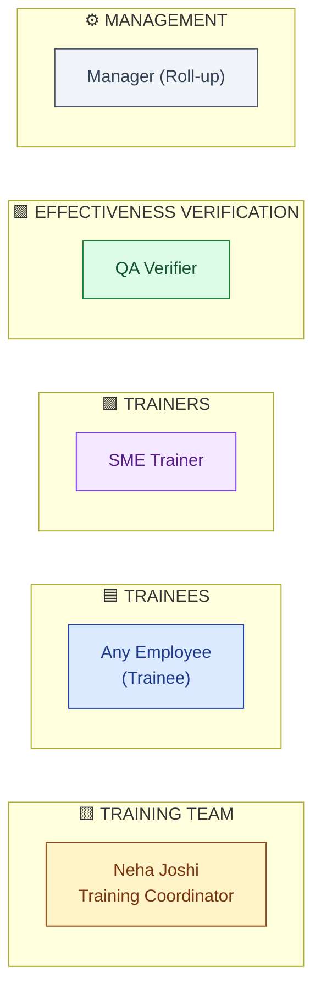
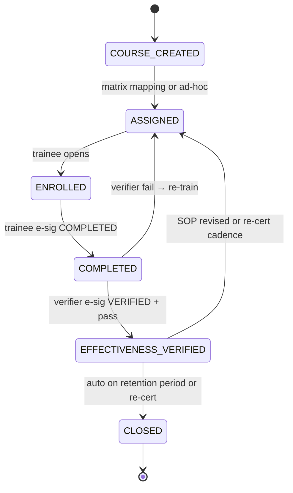

# DESIGN — Training

| Field | Value |
|---|---|
| Module | Training |
| Depth | Executive overview with pointers to planned code |
| Pairs with | [URS.md](URS.md), [ARCHITECTURE.md](ARCHITECTURE.md) |
| Last updated | 2026-06-01 |

---

## 1. Personas (4 primary, 2 secondary)



| # | Persona | Lane | Primary actions | Decisions |
|---|---|---|---|---|
| 1 | **HR/Training Coordinator** (Neha) | 🟨 Training Team | Manage catalog + matrix; assignments; reports | Matrix updates, cadence |
| 2 | **Trainee** (any employee) | 🟦 Trainee | Enroll, study, attest, take quiz | Completion attestation |
| 3 | **Trainer / SME** | 🟪 Trainer | Deliver content, attend records | Attendance record |
| 4 | **QA Verifier** | 🟩 Effectiveness | Verify effectiveness 90 days post | Pass/fail |
| 5 | Manager | ⚙️ Mgmt | Read-only team compliance dashboard | None |
| 6 | Tenant Admin | (platform) | RBAC + role + matrix config | Per-tenant config |

---

## 2. End-to-End Journey

```mermaid
flowchart LR
    classDef hr fill:#fef3c7,stroke:#92400e,color:#78350f
    classDef sys fill:#f1f5f9,stroke:#475569,color:#334155
    classDef trainee fill:#dbeafe,stroke:#1e40af,color:#1e3a8a
    classDef qa fill:#dcfce7,stroke:#15803d,color:#14532d

    CREATED["1. COURSE_CREATED<br/><i>Coordinator</i>"]:::hr
    ASSIGNED["2. ASSIGNED<br/><i>System auto or Coord</i>"]:::sys
    ENROLLED["3. ENROLLED<br/><i>Trainee</i>"]:::trainee
    COMPLETED["4. COMPLETED<br/><i>Trainee e-sig</i>"]:::trainee
    VERIFIED["5. EFFECTIVENESS_VERIFIED<br/><i>QA Verifier e-sig</i>"]:::qa
    CLOSED["6. CLOSED<br/><i>System</i>"]:::sys

    CREATED -->|matrix mapping| ASSIGNED
    ASSIGNED -->|trainee opens| ENROLLED
    ENROLLED -->|content done + attestation| COMPLETED
    COMPLETED -->|+90 days cadence| VERIFIED
    VERIFIED -->|pass| CLOSED
    VERIFIED -->|fail| ASSIGNED
```



### Journey snapshots

#### 🟨 Coordinator (Neha)
```
1. Manage catalog       → /training/catalog            CatalogList + CourseEditor
2. Update matrix        → /training/matrix             MatrixEditor (role × course)
3. Assign ad-hoc        → /training/assign             AssignmentWizard (pick users + course)
4. Reports              → /training/reports            ComplianceReport (per role / team)
```

#### 🟦 Trainee (employee)
```
1. Inbox                → /my-training                 MyTrainingInbox
2. Open assignment      → /training/records/[id]       TrainingRecordView (content embedded)
3. Read SOP / watch video / take quiz
4. Click "I attest"     → SignatureDialog (e-sig COMPLETED)
5. Wait 90 days, then receive effectiveness invite
6. Take effectiveness quiz / interview slot → submit
```

#### 🟪 Trainer (SME)
```
1. Open scheduled session → /training/sessions/[id]    SessionView
2. Mark attendance        → attendee checklist
3. Submit session record  → goes to coordinator for record creation
```

#### 🟩 QA Verifier
```
1. Inbox            → /training/effectiveness-queue   EffectivenessQueue
2. Open record      → /training/records/[id]/verify   EffectivenessForm
3. Choose method    → quiz / manager-obs / interview
4. Mark pass/fail   → with rationale + e-sig VERIFIED
```

---

## 3. Screen + Component Inventory

### Pages (planned, under `frontend/app/(console)/training/...`)

| Route | Purpose | Key components |
|---|---|---|
| `/training/catalog` | Course list + filter | `CatalogList`, `CourseTypeChip` |
| `/training/catalog/[id]` | Course editor / viewer | `CourseEditor`, `QuizBuilder` |
| `/training/matrix` | Role × course matrix grid | `MatrixEditor` (versioned) |
| `/training/matrix/[roleId]` | Per-role view | `RoleRequirementsList` |
| `/training/assign` | Bulk assign | `AssignmentWizard` |
| `/training/effectiveness-queue` | QA verifier queue | `EffectivenessQueue` |
| `/training/records/[id]` | Trainee record view | `TrainingRecordView`, content viewer |
| `/training/records/[id]/verify` | Verifier action | `EffectivenessForm`, `SignatureDialog` |
| `/training/records/[id]/audit-log` | Part 11 trail | `AuditLogTable` |
| `/training/reports` | Compliance dashboards | `ComplianceReport`, role × % current matrix |
| `/training/insights` | TNA AI panel | `TrainingNeedsAnalysisPanel` |
| `/my-training` | Trainee inbox | `MyTrainingInbox`, `TrainingDueChip` |

### Cross-cutting components (planned)
- `TrainingStateChip` — 6-state pill
- `TrainingDueChip` — "Due 14d" / "Overdue 5d"
- `EligibilityBadge` — for inline use in Batch/Audit
- `SignatureDialog` — shared platform
- `MatrixDiffViewer` — what changed between matrix versions

---

## 4. State Machine



**Ownership:**

| State | Owner | Notes |
|---|---|---|
| COURSE_CREATED | Coordinator | Catalog entry |
| ASSIGNED | System or Coordinator | Per matrix or ad-hoc |
| ENROLLED | Trainee | Trainee started |
| COMPLETED | Trainee | Attested via e-sig |
| EFFECTIVENESS_VERIFIED | QA | Pass — current |
| CLOSED | System | End-of-life (re-cert cycle or retention) |

**Gates:**

| Gate | Trigger | Enforcer |
|---|---|---|
| **G-Complete** | ENROLLED → COMPLETED | Trainee e-sig COMPLETED |
| **G-Verify** | COMPLETED → VERIFIED | QA e-sig VERIFIED + pass mark |
| **G-Eligibility** | Real-time read | `trainingEligibilityService.isCurrentOnSOP(userId, sopId)` |

---

## 5. Notifications

| Event | Recipients | Channel |
|---|---|---|
| Training assigned | Trainee + manager | Email + in-app |
| Due in 14 / 7 / 1 days | Trainee | Email |
| Overdue | Trainee + manager + coordinator | Email (escalation) |
| Completion attested | Manager + coordinator | In-app |
| Effectiveness due | Verifier queue + trainee | Email |
| Effectiveness failed | Trainee + manager + coordinator | Email (escalation) |
| SOP revised → reassignment | Affected trainees | Email + in-app |
| Re-certification due | Trainee | Email |

---

## 6. Edge Cases

| Scenario | Handling |
|---|---|
| **User changes role** | Recompute matrix; old records archived (not deleted); new assignments created |
| **SOP revised mid-training** | Existing assignment stays on old version; new version triggers fresh assignment |
| **Trainee on leave when training due** | Coordinator can defer with reason (audit-trailed) |
| **Trainee leaves company** | Records retained per regulatory retention period; user marked inactive |
| **Effectiveness quiz auto-fails (score < threshold)** | State → ASSIGNED (re-train); deviation may be triggered |
| **Manager attempts self-attest** | Backend 403; UI explains "Manager cannot complete on behalf of trainee" |
| **Course retired** | Existing records stay; new assignments blocked; matrix gets warning |
| **Matrix version conflict during edit** | Optimistic lock; second editor sees diff and merge prompt |

---

## 7. Accessibility

- Keyboard nav: catalog + matrix navigable; quiz keyboard-only operable
- Screen reader: ARIA on state chips, quiz options, matrix cells
- Color contrast: state colors WCAG AA; redundant text labels
- Video/audio: captions required for video content
- Quiz timing: pause/resume support for accessibility accommodations

---

## 8. Open Design Questions

1. **Matrix UX for hundreds of roles × courses** — what's the right pagination/grouping?
2. **Trainee mobile experience** — fully responsive vs mobile app?
3. **Multi-language content** — support per course or per tenant?
4. **Quiz-builder UX** — manual builder vs AI-only (URS-B-001)?
5. **Compliance dashboard density** — per role / per team / per individual?
6. **Cross-tenant portability UX** — export wizard? consent flow?
