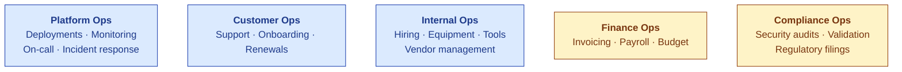
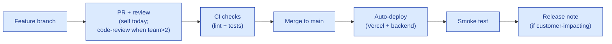

# Operations Charter

| Field | Value |
|---|---|
| Owner | CTO + Ops (when hired) |
| Status | DRAFT v1.0 |
| Last updated | 2026-05-31 |

---

## 1. Operations scope (pre-Series A)

At pre-seed scale, "operations" = the small set of recurring activities that keep the platform running + the team productive. Not a dedicated function yet.

## 2. Recurring operational cadence

| Cadence | Activity | Owner |
|---|---|---|
| **Daily** | Deploy reviews; on-call check; customer ticket triage | Eng + CSM |
| **Weekly** | Engineering sprint plan + retro; pipeline review; customer health check | Eng + Sales + CS |
| **Bi-weekly** | Product review; finance review (when CFO) | Founders |
| **Monthly** | Investor update; team all-hands; customer-success review | Founders + CSM |
| **Quarterly** | Roadmap re-prioritization; team OKR setting; financial close | Founders |
| **Annually** | Strategy refresh; org-design review; salary review; security audit | Founders + Board |

## 3. Core operational runbooks (planned)

### Live (or scaffolded)
- Customer incident response (see [SUPPORT-MODEL §8](../../10-customer-success/support-runbooks/SUPPORT-MODEL.md#8-sev-1-incident-response))
- Customer onboarding ([ONBOARDING.md](../../10-customer-success/onboarding-guides/CUSTOMER-ONBOARDING.md))
- Sales handoff ([SALES-PLAYBOOK §10](../../09-sales-marketing/pitch-materials/SALES-PLAYBOOK.md#10-post-close-handoff-to-customer-success))

### TBD (templates to be filled)
- **Deploy procedure** (frontend / backend)
- **Database backup + restore test** (annual)
- **Security incident response** (SEV-1 breach)
- **Disaster recovery** (full platform restoration)
- **On-call rotation** (when team > 4 engineers)
- **Vendor termination + replacement** (LLM provider, hosting, etc.)
- **Employee onboarding** (Day 1 + Week 1 + Month 1)
- **Employee offboarding** (access revocation, equipment return, exit interview)
- **Customer offboarding** (data export, deprovisioning, exit survey)

## 4. Tooling stack

| Function | Tool | Notes |
|---|---|---|
| Code repository | GitHub (private) | Standard |
| CI/CD | GitHub Actions + Vercel | Auto-deploy on push to main |
| Project mgmt | Linear | Engineering issues + sprints |
| Docs (operational) | Notion + Doc_V2 (markdown) | Hybrid |
| Communication | Slack | Internal + customer (Slack Connect for Enterprise) |
| Email | Google Workspace | Founders + team |
| Customer support | Help Scout (planned) | Today: founders@hawkeye.io |
| Monitoring | Sentry + custom audit-trail | Errors + product analytics |
| Status page | TBD (Statuspage.io or BetterStack) | Customer-facing |
| Calendaring | Google Calendar | Standard |
| Video | Zoom + Google Meet | Customer demos |
| Sales CRM | HubSpot free tier | Light tracking; upgrade when pipeline > 50 |
| Payroll | Razorpay Payroll | India-resident team |
| Banking | ICICI / HDFC (business) + Wise (USD receivables) | Standard |
| Accounting | Zoho Books | India compliance |
| Cloud infra | Vercel + Render/Railway + MongoDB Atlas + AWS S3 | Multi-vendor (avoid lock-in) |
| LLM | Anthropic + OpenAI + Google (multi-LLM gateway) | Provider abstraction |

## 5. Release management

| Release type | Cadence | Notification |
|---|---|---|
| Patches (bug fixes) | Ad-hoc; auto-deploy | None unless major bug |
| Minor (small features) | Weekly | Changelog updated |
| Major (significant new functionality) | Monthly | Email to all customers + blog post |
| Breaking changes | Quarterly max | 30-day notice + migration guide |

## 6. Vendor management

| Vendor | Why we use them | Switching cost | Review |
|---|---|---|---|
| Anthropic | Primary LLM (Claude) | Medium (gateway abstracts) | Quarterly |
| OpenAI | Secondary LLM (GPT-4) + embeddings | Medium | Quarterly |
| Google (Gemini) | Tertiary LLM | Low | Quarterly |
| Vercel | Frontend hosting | Low-medium | Annual |
| Render/Railway | Backend hosting | Low | Annual |
| MongoDB Atlas | Primary DB | High (data migration) | Annual |
| AWS S3 | File storage | Medium | Annual |
| GitHub | Code + CI | High (workflow + integrations) | Stable |
| Google Workspace | Email + docs | High | Stable |
| Slack | Communication | High | Stable |

## 7. Equipment + access management

| Equipment | Standard issue |
|---|---|
| Laptop | MacBook Pro 14" M3 (engineering) / MacBook Air M3 (non-eng) |
| Monitor | External 27" (if WFH) |
| Software | GitHub seat, Linear seat, Slack seat, Notion seat, Vercel seat |
| Phone | Personal (no company-issued phones at this stage) |

| Access | Granted at hire | Reviewed |
|---|---|---|
| GitHub repos | Day 1 (with role-appropriate access) | Quarterly |
| Production DB | CTO + senior eng only | Quarterly |
| AWS console | CTO only | Quarterly |
| Customer data | CSM + assigned engineer only | Per-incident |
| Financial systems | CEO + ops/finance only | Quarterly |

## 8. Security operations

| Cadence | Activity |
|---|---|
| Continuous | Sentry monitoring; dependency vulnerability scanning |
| Weekly | npm audit review; access log review |
| Monthly | Security patch review; password reset reminders |
| Quarterly | Pen test (post-Series A); access review; vendor security review |
| Annually | SOC 2 audit (post-M12); ISO 27001 audit (post-M30); third-party pen test |

See [SECURITY.md §13](../../04-engineering/06-security/SECURITY.md#13-threat-model--what-we-worry-about) for threat model.

## 9. Business continuity

| Scenario | Plan |
|---|---|
| Founder unavailable for >1 week | Documented handoff procedures; backup decision-maker per function |
| Single engineer leaves | Pair-programming + code documentation prevents knowledge silos |
| Cloud provider outage | Multi-vendor strategy; failover documented |
| LLM provider outage | Multi-LLM gateway routes around |
| MongoDB Atlas outage | Backup + point-in-time recovery; failover region (planned M18) |
| GitHub outage | Code mirrored to backup; rare so no special plan |
| Office / WFH disruption | Fully remote-capable; no physical dependency |
| Founder departure | Founders' agreement covers buyout + vesting |

## 10. Operating cost summary (M12)

| Category | $/mo |
|---|---|
| Team salaries | $35K |
| AI/LLM infra | $4.5K |
| Cloud + storage | $1.5K |
| SaaS tools | $0.8K |
| Office + legal + accounting | $2.5K |
| Compliance + security | $1K |
| Marketing + GTM | $1.5K |
| **Total** | **$47K** |

---

## See also

- [RUNBOOK-TEMPLATE.md](RUNBOOK-TEMPLATE.md) — template for new runbooks
- [SUPPORT-MODEL.md](../../10-customer-success/support-runbooks/SUPPORT-MODEL.md) — customer support runbooks
- [SECURITY.md §12](../../04-engineering/06-security/SECURITY.md#12-incident-response) — incident response
- [BUSINESS-PLAN.md](../../02-fundraising/business-plan/BUSINESS-PLAN.md) — operating cost projections
