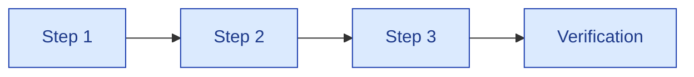

# Runbook Template

| Field | Value |
|---|---|
| Owner | (Function lead) |
| Status | TEMPLATE |
| Last updated | 2026-05-31 |
| Use this template for | Any operational procedure that needs to be documented for repeat execution |

---

> ℹ️ **How to use this template.** Copy this file, replace placeholders, save under appropriate `07-operations/` subfolder. Keep runbooks under 4 pages — if longer, split into multiple.

---

## Runbook: `<Procedure Name>`

| Field | Value |
|---|---|
| Owner | [Role / Person] |
| Trigger | [What initiates this procedure] |
| Frequency | [Ad-hoc / Weekly / Monthly / Annual / On-incident] |
| SLA | [Time-to-complete target] |
| Severity if procedure fails | [Low / Medium / High / Critical] |

### 1. Purpose

In 2-3 sentences: what this procedure achieves + why it matters.

### 2. When to use this runbook

| Condition | Use this runbook? |
|---|---|
| [Condition 1] | Yes |
| [Condition 2] | No (use [different runbook]) |
| [Edge case] | Escalate first |

### 3. Pre-requisites

Before starting:
- [ ] [Access required]
- [ ] [Tool installed]
- [ ] [Information needed]
- [ ] [Approval obtained, if any]

### 4. Procedure



#### Step 1: [Name]
[Detailed instructions]

```bash
# Commands or example payloads
$ command --flag value
```

#### Step 2: [Name]
[Detailed instructions]

#### Step 3: [Name]
[Detailed instructions]

#### Step 4: Verification
How to confirm the procedure worked:
- [ ] [Check 1]
- [ ] [Check 2]
- [ ] [Check 3]

### 5. Rollback / Recovery

If the procedure fails OR causes problems:
- [Rollback step 1]
- [Rollback step 2]
- [Contact: who to escalate to]

### 6. Common failures + remediation

| Symptom | Likely cause | Fix |
|---|---|---|
| [Error message] | [Cause] | [Steps to fix] |
| [Symptom] | [Cause] | [Steps to fix] |

### 7. Logging + documentation

After completing the procedure:
- [ ] Log execution in [system/sheet]
- [ ] Notify [stakeholders]
- [ ] Update [related document] if needed

### 8. Related runbooks

- [Link to related runbook 1]
- [Link to related runbook 2]

### 9. Change log

| Date | Author | Change |
|---|---|---|
| YYYY-MM-DD | [Author] | Initial version |
| YYYY-MM-DD | [Author] | [Change description] |

---

## Runbook checklist (when creating)

- [ ] Owner clearly named
- [ ] Trigger condition specific (not vague)
- [ ] Pre-requisites listed
- [ ] Each step is unambiguous (anyone can execute, not just the author)
- [ ] Verification steps included
- [ ] Rollback procedure documented
- [ ] Common failures documented (anticipated, not just historical)
- [ ] Diagram (Mermaid) for non-trivial flows
- [ ] Linked to related runbooks
- [ ] Change log started

## Runbook quality criteria

> ✅ **A good runbook satisfies these.**
> 1. **Reproducible** — a new team member can execute it without asking the author
> 2. **Time-bounded** — clear SLA + estimated duration per step
> 3. **Recoverable** — explicit rollback procedure
> 4. **Logged** — execution gets recorded somewhere queryable
> 5. **Versioned** — change log shows evolution

## Runbooks to be filled (TBD)

| Runbook | Owner | Priority |
|---|---|---|
| Production deploy procedure | CTO | High |
| Database backup + restore test | CTO | High |
| Security incident response (SEV-1) | CTO | High |
| Customer SEV-1 incident response | CSM (when hired) | High |
| Disaster recovery (full platform) | CTO | Medium |
| On-call rotation procedure | Eng leads | Medium (when team > 4 engineers) |
| LLM provider failover | CTO | Medium |
| Customer onboarding kickoff | CSM | High (today; founder-led) |
| Customer offboarding + data export | CSM | Medium |
| Employee onboarding (Day 1 / Week 1 / Month 1) | CEO | Medium |
| Employee offboarding (access revocation) | CTO | Medium |
| Vendor termination + replacement | CEO | Low |
| Annual security audit | CTO + Security advisor | Annual |
| Annual financial close | Founders + CFO | Annual |

---

## See also

- [OPERATIONS-CHARTER.md](OPERATIONS-CHARTER.md) — overall operations framework
- [SUPPORT-MODEL.md](../../10-customer-success/support-runbooks/SUPPORT-MODEL.md) — customer-facing runbooks
- [SECURITY.md](../../04-engineering/06-security/SECURITY.md) — security procedures
