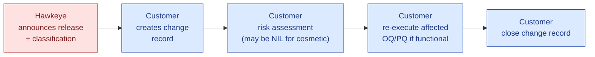

# GAMP 5 Category 4 Compliance Reference

## Hawkeye AI-Native EQMS Platform

---

> **Prepared for**
> The QA Director, Validation Lead, IT Compliance Lead, and Supplier-Qualification team of any customer evaluating Hawkeye
>
> **Prepared by**
> Hawkeye Transact Pvt. Ltd.
>
> **Reference:** `HK-GAMP-CAT4-v1.0`
> **Issued:** 2026-06-05
> **Status:** Canonical — this is the authoritative GAMP Cat 4 compliance reference for Hawkeye
> **Companion:** [GAMP-CAT-4-BRIEF.md](../09-sales-marketing/pitch-materials/GAMP-CAT-4-BRIEF.md) (customer-facing summary)
> **Confidential** — for the sole use of the addressee under NDA

---

## Document Control

| Version | Date | Author | Reviewer | Change |
|---|---|---|---|---|
| 1.0 | 2026-06-05 | Hawkeye Engineering + Compliance | Founder Lead | Initial issue |

This document is reviewed annually and on any material change to Hawkeye's vendor-side validation posture, the regulatory landscape (ISPE GAMP, FDA, EMA, MHRA, WHO, EC), or the Hawkeye product architecture.

---

## Purpose & Scope

### Purpose

This document is the **canonical statement of Hawkeye's GAMP 5 Category 4 conformance posture**. It is intended to be used by a customer's QA Director, Validation Lead, and Supplier-Qualification team to:

1. Confirm Hawkeye's GAMP 5 classification before procurement.
2. Plan the customer-side validation lifecycle with Hawkeye's vendor evidence already in hand.
3. Conduct supplier audits (initial and periodic) using pre-prepared evidence.
4. Map Hawkeye controls to 21 CFR Part 11, EU GMP Annex 11, ALCOA+, FDA CSA, ICH Q9, and ICH Q10.
5. Validate AI-augmented workflows (Layer 3) within the same Cat 4 framework.

### Scope

This document covers:

- The Hawkeye SaaS platform (multi-tenant cloud deployment; optional sovereign deployment).
- All 15 default EQMS modules (Audit Management · Document Control · CAPA · Change Control · Deviation & Event · Training · Risk · Supplier Quality · Management Review · Asset & Equipment Management · Chain of Custody · Transaction Review · Regulatory Intelligence · AskHawk · RFQ & Procurement).
- All five architectural layers (Trust · Data · AI Gateway · Domain Engine · Experience).
- AI capabilities of Layer 3 (multi-LLM routing, grounded generation, cite-or-fallback, AI audit trail).

This document does NOT cover:

- The customer's own infrastructure or non-Hawkeye systems.
- Workflows the customer chooses to build outside Hawkeye's configuration surface (which would push the workflow to GAMP Cat 5; see §3 below).
- Hardware qualification (Hawkeye is delivered as SaaS; underlying cloud infrastructure is qualified by the hyperscaler).

### Intended audience

| Role | What you'll get from this document |
|---|---|
| QA Director | Classification statement + responsibility matrix + cross-standard mapping |
| Validation Lead | V-model deliverable matrix + Validation Accelerator Package contents + worked example |
| Supplier-Qualification Lead | Pre-filled Vendor Assessment Questionnaire (Annex A) + audit procedure |
| IT Compliance Lead | SDLC posture + security controls + AI governance |
| Regulatory Affairs | Cross-standard mapping (Part 11 · Annex 11 · ALCOA+ · CSA · ICH) |
| Internal Audit | Periodic vendor audit procedure (Annex 11 §3) |

---

## Table of Contents

**Part 1 — Classification**
1. GAMP 5 Category 4 Classification Statement
2. Cat 3 vs Cat 4 vs Cat 5 — Decision Matrix
3. Configuration vs Customization — the Rule Book

**Part 2 — Vendor SDLC & Quality Posture**
4. Hawkeye SDLC Overview
5. Vendor Quality Manual Summary
6. Configuration Management & Release Process
7. Vendor-Side Validation of the Product

**Part 3 — Vendor / Customer Validation Responsibility Matrix**
8. The Responsibility Split (RACI)
9. The Validation Accelerator Package — Full Inventory

**Part 4 — V-Model Lifecycle Mapping**
10. URS — User Requirements Specification
11. FRS — Functional Requirements Specification
12. Configuration Specification
13. IQ — Installation Qualification
14. OQ — Operational Qualification
15. PQ — Performance Qualification
16. Traceability Matrix
17. Validation Summary Report

**Part 5 — Operational Compliance**
18. Change Management for Vendor Releases
19. Periodic Vendor Audit Procedure
20. Periodic Evaluation (Annex 11 §11)
21. Incident Management

**Part 6 — Cross-Standard Mapping**
22. 21 CFR Part 11 — Clause-by-Clause
23. EU GMP Annex 11 — All 17 Clauses
24. MHRA / WHO ALCOA+ — 9 Attributes
25. FDA CSA — Risk-Based Assurance
26. ICH Q9 / Q10 Alignment

**Part 7 — AI-Specific Validation (Layer 3)**
27. AI as a Cat 4 Configuration Element
28. AI Audit Trail Validation
29. FDA GMLP, EMA AI Reflection Paper, ISPE Validation 4.0 Mapping

**Part 8 — Customer Resources**
30. Worked Example — Audit Management Module Validation
31. Validation Template Library
32. Validation FAQ
33. Glossary

**Annexes**
- Annex A — Pre-Filled Vendor Assessment Questionnaire
- Annex B — Primary Regulatory Citations
- Annex C — Document Control & Change Log

---

# Part 1 — Classification

## 1. GAMP 5 Category 4 Classification Statement

> 📜 **Formal Classification Statement.** Hawkeye Transact Pvt. Ltd. classifies the Hawkeye AI-Native EQMS Platform as a **GAMP 5 Category 4 — Configured Product** per the ISPE *GAMP 5: A Risk-Based Approach to Compliant GxP Computerized Systems, 2nd Edition* (July 2022). This classification is reviewed annually and on any material architectural change.

### 1.1 Basis for classification

The Hawkeye Platform meets the GAMP 5 Category 4 criteria in full:

| GAMP 5 Cat 4 criterion | Hawkeye conformance |
|---|---|
| Software is a commercial off-the-shelf (COTS) product | Yes — Hawkeye is delivered as a SaaS COTS product to all customers from a common code base |
| Business logic can be tailored via built-in tools | Yes — `vocabularyService`, `standardRegistryService`, `universalModuleConfigService`, `WorkflowDefinitionService` provide configuration without code change |
| Configuration is achieved without modifying source code | Yes — all customer-tailorable behavior is data-driven, stored in tenant-scoped configuration records |
| Vendor maintains a managed SDLC | Yes — documented Vendor Quality Manual, semantic versioned releases, peer review, automated testing, security testing |
| Vendor produces product-level validation evidence | Yes — see the Validation Accelerator Package (§9) |
| Vendor supports periodic supplier audits | Yes — annual right-to-audit; documented audit pack (§19) |

### 1.2 Comparable EQMS products in the same classification

The following EQMS products are also industry-recognized as GAMP 5 Cat 4 — confirming Hawkeye's classification is in line with industry practice:

| Product | Vendor | Cat |
|---|---|---|
| Veeva Vault QMS | Veeva Systems | 4 |
| MasterControl Quality Excellence | MasterControl Inc. | 4 |
| Sparta TrackWise (now Honeywell) | Honeywell | 4 |
| ETQ Reliance | Hexagon | 4 |
| **Hawkeye** | **Hawkeye Transact Pvt. Ltd.** | **4** |

*Sources: GoValidation industry classification guides (2026); PQMS validation-classification references; ISPE 2nd-Ed appendix examples.*

### 1.3 What this classification means for the customer

| Outcome | Detail |
|---|---|
| Customer validation effort is **~60% less** than a Cat 5 bespoke build | Industry consultant consensus; specific Hawkeye estimates in §8 |
| Customer can **leverage Hawkeye's vendor SDLC evidence** under the GAMP 5 supplier-leverage clause + FDA CSA's risk-based framework | See §25 |
| Customer **does NOT need to perform source-code review** of the Hawkeye product | Source-code review is a Cat 5 obligation; Cat 4 leverages vendor SDLC evidence |
| Customer **owns its configuration validation** | URS, configuration-specific FRS, configuration-specific OQ, PQ — see §10–§15 |
| Customer **must perform supplier qualification** of Hawkeye as a vendor | Annual right-to-audit; supplier assessment per Annex 11 §3 — see §19 |

---

## 2. Cat 3 vs Cat 4 vs Cat 5 — Decision Matrix

| Aspect | Cat 3 — Non-configured | **Cat 4 — Configured (Hawkeye)** | Cat 5 — Custom/Bespoke |
|---|---|---|---|
| **Definition** | COTS used as-installed | COTS configured via built-in tools | Custom-built or extensively code-modified |
| **Source code modification** | None | None | Yes |
| **Customer access to source** | Not applicable | Not required | Required (review obligation) |
| **Typical examples** | Simple instrument firmware · basic ladder logic · uncustomized text editor used for GxP | **EQMS · ERP · LIMS · EDMS · MES · CDS configured for site SOPs** | Custom-coded module · bespoke automation · in-house quality system |
| **Customer-side V-model deliverables** | Install + UAT | URS · Configuration Spec · Risk Assessment · IQ · OQ · PQ · Trace Matrix · VSR | Full SDLC (URS · FS · DS · code · unit tests · integration tests · vendor SDLC audit · IQ · OQ · PQ · trace · VSR) |
| **Vendor SDLC evidence leveraged** | Minimal | **Extensive** (per GAMP 5 supplier-leverage clause + FDA CSA) | Limited (vendor SDLC must be customer-audited even if it exists) |
| **Source-code review by customer** | Not required | Not required | **Required** |
| **Typical validation effort (relative)** | 10–15% | **30–40%** | 100% (baseline) |
| **Typical cycle time** | 1–2 weeks | 6–12 weeks | 6–12 months |
| **Loaded cost (Tier-3 customer)** | ₹3–6L | **₹18–30L** (₹0 if Validation Accelerator accepted as-is) | ₹50–150L |
| **Periodic vendor audit** | Optional | **Required (annual)** | Required (annual + post-change) |
| **Re-validation triggered by vendor release** | Rarely | **Risk-based per change classification** | Yes (any material change) |

### 2.1 Why Hawkeye is not Cat 3

Hawkeye is not Cat 3 because every customer deployment requires meaningful configuration:

- Vocabulary configuration (batch / lot / part / sample) per tenant
- Standards configuration (which regulatory frameworks apply: ICH Q7 · 21 CFR · ISO 9001 · etc.)
- Workflow configuration (per-module state machines, approval chains, role permissions)
- Module enablement (which of the 15 modules are in scope per tenant)
- Template configuration (audit checklists, document templates, report formats)

A "Cat 3" Hawkeye would mean a customer who installs and uses Hawkeye **without any configuration** — which contradicts the product's design purpose. Hence Cat 4.

### 2.2 Why Hawkeye is not Cat 5

Hawkeye is not Cat 5 because:

- The customer does NOT receive or modify source code.
- All customer-tailorable behavior is configured via data records, not code.
- The product is supplied from a common code base to all customers (not bespoke per customer).
- Configuration does not extend the product's core capabilities — it tunes them.

A workflow that requires custom-coded extensions outside Hawkeye's configuration surface would push **that workflow** (not the whole platform) to Cat 5. See §3 for the rule book.

---

## 3. Configuration vs Customization — The Rule Book

This section defines what counts as **configuration** (stays Cat 4) versus **customization** (would push that workflow to Cat 5). The customer's validation team uses this rule book to keep their Hawkeye deployment within Cat 4 scope.

### 3.1 The rule (one sentence)

> 💡 **A change is configuration (Cat 4) if it is achieved by editing values inside Hawkeye's data model. A change is customization (Cat 5) if it requires writing or modifying code — including JavaScript, Python, custom CSS rules, custom hooks, or custom integrations beyond the documented API.**

### 3.2 What stays Cat 4 (configuration)

| Activity | How it's done in Hawkeye |
|---|---|
| Renaming "batch" to "lot" for your tenant | `vocabularyService` — config record |
| Enabling/disabling EQMS modules | `universalModuleConfigService` — boolean flags |
| Selecting which regulatory standards apply | `standardRegistryService` — standard library selection |
| Authoring workflow state machines (approval chains, role gates, transitions) | `WorkflowDefinitionService` — versioned JSON workflow definitions |
| Authoring document templates (audit checklist, SOP template, report layout) | Template editor in admin console |
| Authoring AI prompt templates per module | Prompt-template config in AI Gateway admin |
| Configuring role-based access at module + record level | RBAC admin console |
| Mapping users to roles via SSO group claims | SAML/OIDC attribute mapping |
| Selecting data residency (IN / US / EU) | Tenant provisioning |
| Selecting LLM provider per workflow type | AI Gateway config |
| Enabling/disabling per-tenant features (e.g., DigiLocker import) | Feature-flag config |
| Setting retention periods per record type | Retention policy config |
| Configuring notification/email templates | Template editor |
| Configuring report formats and exports | Report-builder config |
| Configuring the supplier portal branding | Tenant branding config |
| Authoring custom dashboards from the metric library | Dashboard builder |

### 3.3 What requires customization (Cat 5)

If you need any of the following, the workflow that uses it becomes Cat 5 for your customer-side validation purposes — and Hawkeye Engineering will scope it as a separate engagement:

| Activity | Why it's Cat 5 |
|---|---|
| Custom code that modifies Hawkeye's product behavior | By definition not configuration |
| Custom server-side scripts that intercept Hawkeye events | Code modification |
| Custom AI model fine-tuning on customer data | Goes beyond product surface |
| Custom integrations with proprietary internal systems beyond Hawkeye's published API | Code outside Hawkeye |
| Modifications to the audit-trail format | Affects the compliance spine; not configurable |
| Custom e-signature ceremonies beyond §11.50 + §11.200 | Affects regulatory compliance posture |
| Patches to Hawkeye source code at customer request | By definition modification of vendor product |

### 3.4 Hybrid case: documented API integrations

A customer-authored integration that uses Hawkeye's published REST API or webhook events is **Cat 4** as far as Hawkeye is concerned (no Hawkeye code is modified). The integration itself, if it's custom-built by the customer's IT team, may be Cat 5 for the customer's validation — but that is a customer-side classification, not a Hawkeye-side one.

### 3.5 Maintaining Cat 4 status

To keep your Hawkeye deployment cleanly in Cat 4:

1. Achieve all customer-specific behavior through Hawkeye's configuration surface (§3.2).
2. Avoid requesting custom code modifications from Hawkeye Engineering.
3. Route any business need that seems to require customization through Hawkeye's product roadmap (it may already exist or be on the roadmap as native configuration).
4. Document the configuration scope in your Configuration Specification (§12) so a future auditor can see what stays Cat 4.

---

# Part 2 — Vendor SDLC & Quality Posture

## 4. Hawkeye SDLC Overview

This section gives the customer's IT Compliance / QA team visibility into how Hawkeye's product is built and released. Combined with §5 (Vendor QM) and §6 (Configuration Management), this constitutes Hawkeye's vendor-side validation evidence — the foundation of GAMP Cat 4 supplier leverage.

### 4.1 Lifecycle stages

```mermaid
flowchart LR
    classDef stage fill:#DBEAFE,stroke:#1E40AF,color:#1E3A8A
    classDef gate fill:#FEF3C7,stroke:#92400E,color:#78350F

    R["Requirement<br/>Customer feedback<br/>Roadmap"]:::stage
    D["Design<br/>Architecture review<br/>API contract"]:::stage
    C["Code<br/>Feature branch<br/>Peer review"]:::stage
    T["Test<br/>Unit · Integration<br/>E2E · Security"]:::stage
    QG["Quality Gate<br/>All tests pass<br/>+ 2 approver review"]:::gate
    S["Stage<br/>Pre-prod environment<br/>UAT"]:::stage
    REL["Release<br/>Semantic version<br/>Release notes"]:::stage
    PR["Production<br/>Multi-region deploy<br/>Monitoring"]:::stage

    R --> D --> C --> T --> QG --> S --> REL --> PR
```



### 4.2 Engineering standards

| Standard | Implementation |
|---|---|
| Coding standards | TypeScript strict mode (frontend) · JS strict (backend) · documented style guide |
| Version control | Git with GitHub; signed commits; branch protection on `main` |
| Peer review | Pull request with ≥2 reviewer approvals; CI must pass; no self-merge |
| Issue tracking | All changes tied to GitHub Issue + Jira ticket; traceable from commit to release notes |
| Automated testing | Unit (Jest, Mocha) · Integration (supertest) · E2E (Playwright) · Coverage tracked |
| Security testing | Dependabot weekly · SAST (CodeQL) on every PR · annual external pentest |
| Performance testing | Load testing for new endpoints handling >100 req/s baseline |
| Documentation | Inline JSDoc / TSDoc · architecture decision records (ADRs) · runbooks |

### 4.3 Release classification

Every Hawkeye release is classified into one of three buckets, which determines the customer's re-validation obligation (see §18):

| Class | Definition | Customer re-validation? |
|---|---|---|
| **Functional** | New feature, behavior change, workflow change | Risk-based assessment per customer SOP; configuration-specific OQ may need re-execution if affected |
| **Security** | Vulnerability patch, dependency upgrade with security implication | Smoke test only; no full re-validation |
| **Cosmetic** | UI styling, label change, documentation, non-functional refactor | No customer action |

Release classification is published in every Release Note. Customer is notified per the SLAs in §18.2.

### 4.4 ISO 9001 alignment

Hawkeye's engineering QMS is aligned to ISO 9001:2015 (and 2026 revision as released). Formal ISO 9001 certification is targeted for 2027.

---

## 5. Vendor Quality Manual Summary

The full Vendor Quality Manual is a separate ~30-page document, supplied to customers under NDA. This section summarizes its structure for QA Director review.

### 5.1 Sections of the Vendor QM

| § | Section | Summary |
|---|---|---|
| 1 | Organization & Responsibility | Org chart · roles & responsibilities · escalation paths |
| 2 | Quality Policy | Documented Quality Policy signed by Founder/CEO; reviewed annually |
| 3 | Document Control | All controlled docs versioned in Git; review cycle defined; approvers named |
| 4 | Training | Engineer onboarding includes SDLC, security, GxP basics; tracked records |
| 5 | Internal Audits | Quarterly internal audit; findings tracked to closure |
| 6 | Management Review | Quarterly management review with documented inputs/outputs |
| 7 | Corrective & Preventive Actions | CAPA system tracks defects, complaints, and improvement opportunities |
| 8 | Risk Management | Product-level risk register; ICH Q9 framework |
| 9 | Customer Feedback | Channel via Customer Success; integrated into roadmap |
| 10 | Continual Improvement | Quarterly retrospective on metrics, incidents, customer NPS |

### 5.2 How to obtain the full Vendor QM

The full Vendor Quality Manual is provided to customers at PoC kickoff and on subsequent supplier audits. To request it under NDA, contact `compliance@hawkeye.io`.

---

## 6. Configuration Management & Release Process

### 6.1 Version control

| Aspect | Implementation |
|---|---|
| Source code repository | Git (GitHub), with signed commits |
| Branching model | `main` (protected) · feature branches · release branches · hotfix branches |
| Release tagging | Semantic versioning (MAJOR.MINOR.PATCH) |
| Release notes | Published per release in `RELEASES.md`; classified per §4.3 |
| Configuration code | Hawkeye's own configuration (workflow definitions, standard library, prompt templates) is versioned alongside code |

### 6.2 Release cadence

| Class | Cadence | Customer notification |
|---|---|---|
| Major (MAJOR.x.x) | 1–2 per year | 90 days advance notice |
| Minor (x.MINOR.x) | Monthly | 30 days advance notice |
| Patch (x.x.PATCH) | As needed (security weekly; bugfix monthly) | 7 days advance (security: immediate) |

### 6.3 Rollback capability

| Scenario | Recovery |
|---|---|
| Bad release | One-click rollback to prior version (database migrations are forward-compatible for 1 minor version) |
| Data corruption | Restore from daily snapshot (7-day rolling window during PoC; 30-day in production) |
| Tenant-specific issue | Tenant-level rollback to last known good config snapshot |

### 6.4 Customer change-control integration

Hawkeye release notifications are designed to integrate with the customer's change-control system. See §18 for the full procedure.

---

## 7. Vendor-Side Validation of the Product

### 7.1 What Hawkeye validates (so the customer does not have to)

Hawkeye Engineering executes the following validation activities at the **product** level before any release reaches a customer tenant. These are documented in the Validation Accelerator Package (§9):

| Activity | Evidence |
|---|---|
| Code review (≥2 approvers per PR) | GitHub PR records (audit-trail-grade) |
| Unit test execution (coverage ≥80% on critical paths) | CI test reports |
| Integration test execution | CI test reports |
| End-to-end (E2E) test execution | Playwright reports |
| Security scan (SAST, dependency, secrets) | Tool reports |
| Performance benchmark (key endpoints) | Performance test reports |
| User acceptance testing in staging | Stage UAT records |
| Functional Specification (FRS) accuracy check | FRS vs implementation review |
| Configuration Specification update | Config Spec versioning |
| Release Note classification + content | RELEASES.md |
| Sign-off by named release manager | Signed release record |

### 7.2 Vendor-executed IQ/OQ scripts

For each release, Hawkeye runs:

- **Installation Qualification (IQ)** in our staging environment — confirms the product installs correctly per documented procedure
- **Operational Qualification (OQ)** in our staging environment — confirms each module's documented functionality operates as specified

The customer **re-executes IQ in their tenant environment** (smoke tests) and **executes configuration-specific OQ** (their workflows). The base OQ scripts Hawkeye provides accelerate this dramatically.

### 7.3 Security validation

| Activity | Frequency | Output |
|---|---|---|
| Static Application Security Testing (SAST) | Every PR | Per-build report |
| Software Composition Analysis (Dependabot) | Weekly | Issue queue; SLA per severity |
| Dynamic Application Security Testing (DAST) | Quarterly | Report shared with customers under NDA |
| External penetration test | Annual | Executive summary shared with customers under NDA |
| Cloud configuration scanning (CSPM) | Continuous | Internal dashboard |
| Bug bounty program | Continuous | Targeted invitation-only |

---

# Part 3 — Vendor / Customer Validation Responsibility Matrix

## 8. The Responsibility Split (RACI)

This is the master responsibility matrix that drives every other section of this document. Every validation deliverable is mapped to who Owns it, who Contributes, and who is Informed.

**Legend:** R = Responsible (does the work) · A = Accountable (signs off) · C = Consulted · I = Informed

| # | Validation Deliverable | Customer Validation Lead | Customer QA Director | Customer IT | Hawkeye CS Engineer | Hawkeye Founder Lead | Hawkeye Pharma SME |
|---|---|---|---|---|---|---|---|
| 1 | Validation Plan | R | A | I | C | I | C |
| 2 | Risk Assessment (FMEA) | R | A | I | C | I | C |
| 3 | URS — User Requirements Specification | R | A | I | C (template + examples) | I | C |
| 4 | FRS — Functional Spec (product level) | C (review) | I | I | **R** (delivered) | A | I |
| 5 | FRS — Configuration-specific | R | A | I | C | I | C |
| 6 | Design Specification (product) | Not required (Cat 4 leverage) | I | I | **R** (delivered as evidence) | A | I |
| 7 | Configuration Specification | R | A | C | C (template) | I | C |
| 8 | IQ (vendor-product, pre-executed) | I | I | I | **R** (delivered) | A | I |
| 9 | IQ (customer environment) | R | A | C | C (script) | I | I |
| 10 | OQ — base functional (vendor-executed) | I | I | I | **R** (delivered) | A | I |
| 11 | OQ — configuration-specific | R | A | I | C | I | C |
| 12 | PQ — Performance Qualification | R | A | I | C | I | C |
| 13 | Traceability Matrix | R | A | I | C (template + product rows pre-populated) | I | C |
| 14 | Validation Summary Report | R | A | I | C | I | C |
| 15 | Vendor Quality Manual | I | I | I | **R** (delivered) | A | I |
| 16 | SDLC Evidence | I | I | I | **R** (delivered) | A | I |
| 17 | Security Testing Summary | I | I | C | **R** (delivered annually) | A | I |
| 18 | Vendor Assessment Questionnaire | C (reviewer) | A | I | **R** (pre-filled) | A | I |
| 19 | Release Notes per version | I | I | I | **R** (published) | A | I |
| 20 | Periodic Vendor Audit Pack | C (auditor) | A | C | **R** (annual) | A | I |

**Reading the matrix:**

- **Customer R/A on items 1–3, 5, 7, 9, 11–14:** these are the items the customer's validation team owns and signs off. Hawkeye provides templates and examples, but the customer is accountable.
- **Hawkeye R on items 4, 6, 8, 10, 15–20:** these are the items Hawkeye produces as part of the Validation Accelerator Package. The customer reviews and leverages them.
- **The customer's effective scope** is items 1–3, 5, 7, 9, 11–14 only. Items 4, 6, 8, 10 are leveraged from Hawkeye. **This is what makes Cat 4 ~60% less effort than Cat 5.**

---

## 9. The Validation Accelerator Package — Full Inventory

The Validation Accelerator Package is the bundle of vendor evidence and templates Hawkeye delivers to every customer at PoC kickoff (or contract signing for direct paid customers). Its content is designed to satisfy GAMP 5's supplier-leverage clause and FDA CSA's risk-based assurance framework.

| # | Artifact | Format | Purpose | Updated |
|---|---|---|---|---|
| 1 | **Vendor Quality Manual** | PDF (~30 pages) | Demonstrates ISO 9001 / GAMP-aligned SDLC + QMS | Annually |
| 2 | **SDLC Evidence Pack** | PDF + sample artifacts | Coding standards · peer-review records · branch protection rules · CI/CD pipeline description · automated test coverage reports | Quarterly |
| 3 | **Functional Specification (FRS) — Product Level** | PDF (~50 pages per module) | Defines vendor-product behavior at functional level | Per minor release |
| 4 | **Configuration Specification — Template** | DOCX / MD | Customer authors their configuration-specific Config Spec from this template | At PoC kickoff |
| 5 | **IQ Scripts — Vendor Pre-Executed** | PDF + script files | Proof Hawkeye product installs correctly in staging | Per minor release |
| 6 | **IQ Scripts — Customer Environment** | DOCX template | Customer re-executes in their tenant; smoke tests | At PoC kickoff |
| 7 | **OQ Scripts — Base Functional (Vendor-Executed)** | PDF + script files | Proof each module's documented functionality operates | Per minor release |
| 8 | **OQ Scripts — Configuration-Specific Template** | DOCX template | Customer authors per their workflow configuration | At PoC kickoff |
| 9 | **PQ Plan Template** | DOCX | Customer adapts to their SOPs | At PoC kickoff |
| 10 | **Traceability Matrix Template** | XLSX | Pre-populated with product features; customer extends with config | At PoC kickoff |
| 11 | **Validation Summary Report Template** | DOCX | Customer adapts | At PoC kickoff |
| 12 | **Security Testing Summary** | PDF | Annual external pentest executive summary + SAST/Dependabot evidence | Annually |
| 13 | **Vendor Assessment Questionnaire — Pre-Filled** | DOCX (~100 questions answered) | Reduces customer's supplier-qualification effort | Annually |
| 14 | **Release Notes Archive** | MD index + per-release files | Change history with classification (functional · security · cosmetic) | Per release |
| 15 | **Periodic Vendor Audit Pack** | PDF | Pre-prepared for customer's annual right-to-audit | Annually |
| 16 | **Compliance Cross-Standard Mapping** | This document (Part 6) | Part 11 · Annex 11 · ALCOA+ · CSA · ICH | This document |
| 17 | **Data Processing Agreement** | PDF | GDPR · DPDP · HIPAA | At contract |
| 18 | **AI Governance Statement** | PDF | Cite-or-fallback · AI Audit Trail · GMLP/EMA alignment | Annually |

### 9.1 Delivery

The Validation Accelerator Package is delivered as:

- A shared folder (Hawkeye Customer Portal or customer's preferred drive)
- Indexed PDF for review by procurement / legal
- Refreshed annually + per material release

### 9.2 How to use the package

| Step | Customer action |
|---|---|
| 1 | Review Vendor QM + SDLC Evidence + Security Testing Summary as supplier-qualification evidence |
| 2 | Use pre-filled VAQ in your supplier-qualification process |
| 3 | Adapt URS template to your use cases |
| 4 | Use product-level FRS as input to your configuration-specific FRS |
| 5 | Adapt Configuration Specification template to your tenant |
| 6 | Re-execute IQ in your tenant using the template |
| 7 | Adapt + execute configuration-specific OQ |
| 8 | Author + execute PQ |
| 9 | Populate Traceability Matrix |
| 10 | Author Validation Summary Report citing all leveraged vendor evidence |
| 11 | Conduct annual periodic vendor audit using the Audit Pack |
| 12 | Receive Release Notes per release; assess re-validation per §18 |

---

# Part 4 — V-Model Lifecycle Mapping

This part walks each V-model deliverable end-to-end, showing exactly what Hawkeye supplies and what the customer authors.

## 10. URS — User Requirements Specification

**Who owns it:** Customer (R/A). Hawkeye provides template + examples.

**Contents:**

| URS section | Description | Hawkeye support |
|---|---|---|
| 1. Purpose & Scope | Why the customer is deploying Hawkeye | Template + sector examples |
| 2. User Roles | Personas using the system | Standard Hawkeye personas (QA Head, QA Analyst, Operations, Auditor, Auditee, Sponsor) as starting point |
| 3. Business Process Requirements | What workflows must the system support | Pre-mapped to Hawkeye 15 modules |
| 4. Functional Requirements | What the system must do | Cross-referenced to Hawkeye FRS |
| 5. Regulatory Requirements | Which standards apply | Pre-mapped: Part 11 / Annex 11 / ALCOA+ / ICH / etc. |
| 6. Data Requirements | What data is processed; retention | Aligned to Hawkeye data model |
| 7. Interface Requirements | SSO · APIs · external systems | Hawkeye integration catalog |
| 8. Performance Requirements | Throughput · response time | Hawkeye SLA matrix |
| 9. Security Requirements | Access · encryption · audit | Cross-referenced to Layer 1 controls |
| 10. Availability Requirements | Uptime · DR | Hawkeye SLA |

**Hawkeye accelerator:** template URS authored from the perspective of a typical Tier-3 CDMO, pre-populated with 80% of common requirements. Customer adapts the remaining 20% to their specifics.

## 11. FRS — Functional Requirements Specification

**Two layers:**

### 11.1 Product-level FRS (Hawkeye-authored)

Hawkeye produces the product-level FRS for each module — what the product as built does at the functional level. The customer reviews but does not author this.

**Structure** (per module, ~50 pages):

- Module purpose
- User roles + permissions
- Workflows (states, transitions, gates)
- Functional capabilities (with screen references)
- Configuration surface (what's configurable)
- API surface
- Data model
- Reports + exports
- Error conditions + handling
- AI capabilities + governance

### 11.2 Configuration-specific FRS (customer-authored)

The customer authors a Configuration-specific FRS describing **how they have configured** their Hawkeye deployment — which workflows, which roles, which gates, which AI prompts, which reports.

**Hawkeye accelerator:** the Configuration Specification template (§12) doubles as the input to Configuration-specific FRS authoring.

## 12. Configuration Specification

**Who owns it:** Customer (R/A). Hawkeye provides template.

A Configuration Specification is a controlled document that records every configuration setting in the customer's Hawkeye tenant, with rationale and version. It is the source of truth for the customer's auditor.

**Structure:**

| Section | Content |
|---|---|
| 1. Tenant Configuration | Vocabulary · standards selected · modules enabled |
| 2. Workflow Configuration | Per-module workflow definitions with version |
| 3. Role Configuration | RBAC role definitions with permissions |
| 4. User Provisioning Configuration | SSO mapping · default roles · MFA policy |
| 5. Template Configuration | Document templates · report templates · email templates |
| 6. AI Configuration | Per-workflow LLM choice · prompt templates · confidence thresholds |
| 7. Data Configuration | Retention periods · backup policy · residency election |
| 8. Integration Configuration | Custom integrations · webhook subscriptions · API consumers |
| 9. Change Log | Every change to configuration with reason · approver · date |

**Hawkeye accelerator:** the Hawkeye admin console can export the live configuration as a Configuration Specification snapshot (PDF + JSON) on demand — eliminating the manual transcription burden.

## 13. IQ — Installation Qualification

### 13.1 Vendor-executed IQ

For each Hawkeye release, Hawkeye Engineering executes IQ in our staging environment per the documented IQ procedure. Evidence is delivered as Item #5 in the Validation Accelerator Package.

The customer can leverage this as evidence under GAMP 5 supplier-leverage — the customer does not need to re-prove that the Hawkeye product can be installed.

### 13.2 Customer-environment IQ

The customer still needs to confirm the **customer-specific tenant** is provisioned correctly. This is the customer-side IQ — substantially smaller scope than a Cat 5 IQ.

**Customer IQ scope (using Hawkeye's IQ template):**

| Item | Test |
|---|---|
| Tenant URL reachable | URL responds with login page |
| SSO authentication works | Test SSO login per IdP |
| All named users provisioned | User list query matches expectation |
| All modules enabled per Configuration Spec | Module visibility check per role |
| Data residency correct | Region check via API |
| Backup configured | Backup job verifies completion |
| Audit trail capturing actions | Smoke test: 3 actions captured |
| E-signature ceremony works | Test e-sig per Part 11 §11.50 |
| Critical workflows traversable | Smoke test 1 audit + 1 doc lifecycle |
| Reports generate correctly | Test report exports |

**Effort:** typically 4–8 hours for a customer Validation Lead.

## 14. OQ — Operational Qualification

### 14.1 Vendor-executed base OQ

Hawkeye Engineering executes OQ in staging for every release, covering all documented functional capabilities of each module. Evidence is Item #7 in the Validation Accelerator Package.

The customer leverages this as evidence that Hawkeye's product as supplied operates per its FRS.

### 14.2 Configuration-specific OQ (customer)

The customer authors and executes OQ for their **configured workflows** — testing the specific paths their users will follow.

**Example:** if the customer has configured a supplier audit workflow with a specific approval chain (QA Manager → QA Director → e-sign), the customer's OQ tests that exact chain executes correctly per their Configuration Specification.

**Hawkeye accelerator:** the OQ template (Item #8 in the package) includes 50+ pre-authored test cases for common workflow patterns. The customer typically adapts 10–20 of these per module.

**Effort:** typically 2–5 days for a customer Validation Lead per module.

## 15. PQ — Performance Qualification

**Who owns it:** Customer (R/A) — PQ is inherently customer-side because it ties to the customer's SOPs.

**PQ scope:** demonstrate that the customer's actual end-users, using their actual SOPs, can successfully perform their GxP workflows on Hawkeye in their actual operating environment.

**Typical PQ activities:**

- Trained end-users execute a full audit cycle per the customer's SOP
- Trained end-users execute a full CAPA cycle per the customer's SOP
- Multiple users execute concurrently
- Test cases include happy-path + error-handling + edge cases per SOP

**Hawkeye accelerator:** PQ planning consultation with Hawkeye's Pharma SME (included in PoC kickoff and ongoing engagement).

**Effort:** typically 1–2 weeks of customer-side execution time per module.

## 16. Traceability Matrix

**Who owns it:** Customer (R/A). Hawkeye provides pre-populated template.

The Traceability Matrix shows every URS requirement traced through FRS → DS → IQ → OQ → PQ → VSR. For Cat 4 supplier-leverage, the customer's matrix can reference Hawkeye's product-level rows directly.

**Hawkeye accelerator:** the Traceability Matrix template (Item #10) is pre-populated with rows for every Hawkeye product feature, mapped to the corresponding Hawkeye FRS section + product-level IQ/OQ test case. The customer extends with rows for their configuration-specific requirements.

**Effort:** typically 1–3 days for a customer Validation Lead.

## 17. Validation Summary Report

**Who owns it:** Customer (R/A). Hawkeye provides template.

The Validation Summary Report is the customer's signed conclusion that the Hawkeye deployment is validated and fit for intended use. It cites all evidence leveraged from Hawkeye + all customer-authored evidence.

**Structure (template provided):**

| Section | Content |
|---|---|
| 1. Executive Summary | Pass/fail outcome |
| 2. Scope | What was validated (modules, sites, users) |
| 3. Approach | Cat 4 leveraged-vendor-evidence approach per GAMP 5 + FDA CSA |
| 4. Validation Lifecycle Activities | Reference each deliverable (URS through PQ) |
| 5. Vendor Evidence Leveraged | List items from Validation Accelerator Package + leverage rationale |
| 6. Risk Assessment Outcome | Residual risks accepted |
| 7. Deviations & CAPAs | Any deviations during validation + closure |
| 8. Conclusion | Approval to release to production |
| 9. Approvals | Signatures of customer's QA Director, IT, Validation Lead |

---

# Part 5 — Operational Compliance

## 18. Change Management for Vendor Releases

### 18.1 Hawkeye's commitment

Hawkeye notifies every customer of every release with:

- Version (semver)
- Classification (functional · security · cosmetic) per §4.3
- Detailed change list
- Recommended customer action
- Re-validation guidance (if any)
- Rollback window (if applicable)

### 18.2 Notification SLAs

| Release class | Advance notice |
|---|---|
| Major (MAJOR.x.x) | 90 days |
| Minor (x.MINOR.x) | 30 days |
| Patch — functional bugfix | 7 days |
| Patch — security | Immediate (≤24 hrs); deployed first to staging for customer testing if customer chooses |
| Cosmetic | At release |

### 18.3 Customer's change-control integration

The customer's change-control process can integrate Hawkeye releases at four touchpoints:



### 18.4 Re-validation decision matrix

| Release class | Customer re-validation effort |
|---|---|
| Major | Risk assessment + selective OQ re-execution (typically 1–3 days) |
| Minor — affecting configured workflows | OQ re-execution for affected workflows (typically 0.5–2 days) |
| Minor — not affecting configured workflows | Smoke test + change record (typically 2 hours) |
| Patch — functional | Smoke test (typically 1 hour) |
| Patch — security | Verification of fix in staging if customer chooses; otherwise just change record |
| Cosmetic | Change record only |

### 18.5 Skipping releases

The customer **cannot** skip security patches (deployed automatically). The customer **can** elect to skip non-security minor releases for one cycle (defer 30 days) for change-control alignment.

---

## 19. Periodic Vendor Audit Procedure

### 19.1 Right to audit

Per the Data Processing Agreement and this document, the customer has the **right to audit Hawkeye annually**, on reasonable notice (typically 30 days), via:

- **Remote audit** (default) — video call + screen-shared review of evidence pack
- **On-site audit** (at customer cost) — visit to Hawkeye's office in `[HAWKEYE ADDRESS]`

### 19.2 Audit scope (annual)

| Scope item | Evidence reviewed |
|---|---|
| 1. SDLC & QMS conformance | Vendor QM · SDLC Evidence Pack · sample PR records · sample release notes |
| 2. Security posture | Annual pentest summary · SAST/Dependabot reports · incident log |
| 3. Configuration & change management | Sample release records · customer notification logs |
| 4. Customer support & incident management | Incident log · response SLA evidence |
| 5. Data residency & privacy | DPA conformance · data residency election logs · deletion certificates |
| 6. AI governance | AI Audit Trail samples · GMLP/EMA alignment review |
| 7. Personnel training | Training records for engineers |
| 8. Internal audits | Recent internal audit findings + CAPAs |
| 9. Sub-processor changes | Sub-processor list + customer notifications |
| 10. Roadmap of compliance improvements | Forward plan |

### 19.3 The Pre-Prepared Audit Pack

To minimize customer audit-prep burden, Hawkeye maintains a **Pre-Prepared Audit Pack** updated annually. It contains all of the above evidence in one indexed PDF + supplementary files.

The customer's auditor can typically complete a remote vendor audit in **4–6 hours** using the Pre-Prepared Audit Pack — versus 2–3 days from a cold start.

### 19.4 Audit findings & CAPA

Audit findings are logged. Major findings trigger a Hawkeye CAPA tracked to closure with customer visibility.

---

## 20. Periodic Evaluation (Annex 11 §11)

Annex 11 §11 requires the customer to periodically review the validated state of the computerized system. Hawkeye supports this by providing:

| Annual evaluation input | Hawkeye-supplied |
|---|---|
| Validation status update | Confirmation of current Cat 4 classification + Validation Accelerator Package version |
| Deviation log (vendor side) | Incident summary + CAPA closure status |
| Change log | Release history with classification |
| Security incidents | Disclosed per DPA |
| Access review | User provisioning audit log (customer pulls from tenant) |
| Configuration drift | Configuration Spec snapshot vs prior year |
| Backup / DR test outcomes | Hawkeye's monthly restore test reports |

The customer compiles this with their own internal evidence (training records, internal incidents, periodic reviews) into the annual Periodic Evaluation report.

---

## 21. Incident Management

### 21.1 Severity classification

| Severity | Definition | Notification SLA |
|---|---|---|
| P1 — Critical | Platform unreachable · data integrity at risk | Immediate (≤1 hr) to all affected customers |
| P2 — High | Major feature broken · workaround painful | ≤4 hrs to affected customers |
| P3 — Medium | Minor feature broken · workaround acceptable | ≤24 hrs in incident report |
| P4 — Low | Cosmetic · enhancement | Logged; published in release notes |

### 21.2 Data breach notification

Per DPA + India DPDP + GDPR: any breach involving customer data is notified to the affected customer within **72 hours** of confirmation, with:

- Nature of breach
- Categories + approximate number of records affected
- Likely consequences
- Containment + mitigation measures
- Contact for further information

### 21.3 Post-incident report

Every P1/P2 incident triggers a Post-Incident Report shared with affected customers within 14 days, containing:

- Timeline
- Root cause
- Customer impact
- Corrective + preventive actions
- Closure evidence

---

# Part 6 — Cross-Standard Mapping

## 22. 21 CFR Part 11 — Clause-by-Clause

This section maps each 21 CFR Part 11 requirement to the Hawkeye implementation and the evidence the customer's auditor can request.

### 22.1 Subpart B — Electronic Records

| Clause | Requirement (verbatim/paraphrased) | Hawkeye implementation | Evidence available |
|---|---|---|---|
| §11.10(a) | Validation of systems for accuracy, reliability, consistent intended performance, ability to discern invalid/altered records | GAMP Cat 4 configured product per this document; vendor-side validation per §7; customer-side validation per Part 4 | Validation Accelerator Package items 1–11 |
| §11.10(b) | Ability to generate accurate, complete human-readable + electronic copies for FDA | PDF + CSV + JSON export at record + audit level; audit-trail-grade PDF | Demo on demand |
| §11.10(c) | Protection of records for accurate + ready retrieval throughout retention | SHA-256 record hashing · ≥10-year retention configurable · daily backups · monthly restore tests | Backup test logs |
| §11.10(d) | Limit access to authorized individuals | SSO (SAML/OIDC) · MFA · RBAC at record level | RBAC config evidence; access review log |
| §11.10(e) | **Secure, computer-generated, time-stamped audit trails to record creation, modification, deletion**; retain ≥ as long as the record | Every state change logged with user · UTC timestamp · session · IP · reason; cannot be disabled by any role; retained per record lifetime | Live audit-trail demo; export sample |
| §11.10(f) | Operational system checks to enforce sequence + permissions | State machine enforcement at workflow layer; cannot bypass via UI or API | Workflow definition evidence |
| §11.10(g) | Authority checks — only authorized users sign/alter/operate | RBAC enforced at API + UI; tested per OQ | RBAC test evidence |
| §11.10(h) | Device checks where appropriate | API + UI both authenticate every action | Auth log evidence |
| §11.10(i) | Documented training of personnel | Hawkeye-side: engineer training records (§5.1, training §4); Customer-side: customer responsibility | Training records on request |
| §11.10(j) | Documented written policies for accountability | Vendor QM §1 (responsibilities); customer's own SOPs | Vendor QM |
| §11.10(k) | Appropriate controls over systems documentation | Vendor QM §3 (document control); Validation Accelerator Package versioning | Version logs |

### 22.2 Subpart B — Open Systems (§11.30)

| Clause | Requirement | Hawkeye implementation |
|---|---|---|
| §11.30 | Open-system controls = closed-system controls + encryption + digital signatures | Hawkeye is delivered as a **closed system** (only authorized users via SSO) so §11.30 enhancements are not strictly required, but TLS 1.3 + AES-256 + signature-record cryptographic linking are provided regardless |

### 22.3 Subpart C — Electronic Signatures

| Clause | Requirement | Hawkeye implementation | Evidence |
|---|---|---|---|
| §11.50(a) | Signed records show printed name + date/time + meaning | Every signed record displays printed name + UTC date/time + meaning (review/approval/authorship/responsibility) | Demo + sample export |
| §11.50(b) | Subject to controls of §11.10 | Yes — signed records inherit §11.10 controls | — |
| §11.70 | E-signature linked to record; cannot be excised/copied/transferred to falsify another record | E-signature cryptographically linked to SHA-256 snapshot hash of signed record | Cryptographic linking documentation |
| §11.100(a) | Unique to one individual | One signature account per person, never reassigned | User provisioning policy |
| §11.100(b) | Identity verified before issuance | SSO-based provisioning verifies via customer's IdP | SSO setup procedure |
| §11.100(c) | Written certification to FDA equivalent to handwritten | Customer's responsibility (certification letter); Hawkeye supports with technical evidence | Customer's letter template available |
| §11.200(a)(1) | Non-biometric e-sigs use ≥2 distinct identification components | Password + Reason on every signing event | Demo + audit log sample |
| §11.200(a)(2) | First signing of continuous session uses all components; subsequent signings in same session use one | Session-boundary rule enforced | Session log demo |
| §11.200(a)(3) | When not in continuous session, use all components | Yes | — |
| §11.200(b) | Biometric e-sigs only by genuine owner | Hawkeye does not currently offer biometric e-sig | — |
| §11.300(a) | Maintain ID/password uniqueness | Enforced by user-provisioning service | — |
| §11.300(b) | Periodic ID/password aging | Password expiry policy configurable per tenant | — |
| §11.300(c) | Loss-management procedures | Password reset + account lockout procedures | — |
| §11.300(d) | Unauthorized-use safeguards (lockout, alerting) | Failed-attempt audit log + lockout after configurable threshold | — |
| §11.300(e) | Periodic testing of devices (tokens, cards) | Hawkeye does not currently use hardware tokens | — |

---

## 23. EU GMP Annex 11 — All 17 Clauses

| § | Requirement (paraphrased) | Hawkeye implementation |
|---|---|---|
| 1 — Risk Management | Apply throughout lifecycle; scale validation to patient safety, data integrity, product quality | Documented risk management per ICH Q9; customer's risk assessment leverages Hawkeye Cat 4 classification |
| 2 — Personnel | Defined roles and cooperation between process owners, system owners, QPs, IT | Vendor QM §1 + customer-side roles defined in URS |
| 3 — Suppliers & Service Providers | Formal written agreement; assess competence and reliability; right to audit | DPA + Vendor Assessment Questionnaire + Annual Right to Audit (§19) |
| 4 — Validation | URS · lifecycle · traceability · configuration management | Validation Accelerator Package (§9) |
| 5 — Data | Secure data exchange with other systems | TLS 1.3 + API authentication + audit trail of data exchanges |
| 6 — Accuracy Checks | Additional check (second user or validated electronic means) for critical data | Workflow configuration supports two-person review + e-sig gates |
| 7 — Data Storage | Protect from damage; backups; verify accessibility + integrity over retention | Daily snapshots · 7-day rolling retention (PoC) / 30-day (production) · monthly restore tests |
| 8 — Printouts | Clear printed copies; for batch release, indicate changes since original entry | PDF export shows version + audit-trail markers |
| 9 — **Audit Trails** | Capture user · time · **reason** for change/deletion; reviewed regularly | Built-in; cannot be disabled by any user role; review e-sig gate at batch release |
| 10 — Change & Configuration Management | Controlled, documented changes per defined procedure | §6 + §18 of this document |
| 11 — Periodic Evaluation | Periodic review of validation, deviations, changes, security | §20 of this document |
| 12 — Security | Physical/logical access control + provisioning records | SSO/MFA/RBAC + provisioning audit log |
| 13 — Incident Management | Log, root cause, act on system failures + data errors | §21 of this document |
| 14 — Electronic Signature | Equivalent to handwritten; permanently linked; show name/date/time/meaning | Per Part 11 §11.50 (above) |
| 15 — Batch Release | Certified person uses validated system to release/reject | Workflow + e-sig + audit-trail-review gate built into release workflow |
| 16 — Business Continuity | Documented arrangements for system failures affecting GMP processes | 99.5% PoC / 99.9% production SLA · DR runbook · backup PDF export available at any moment |
| 17 — Archiving | Data archived with continued readability, integrity, accessibility | Configurable retention · SHA-256 hashing · annual restore verification |

### 23.1 Annex 11 — 2025 Draft Revision + Annex 22 (AI) — readiness

The EC published a draft revision of Annex 11 on **7 July 2025**, with a new companion **Annex 22 — Artificial Intelligence** expected to be finalized alongside Annex 11 in 2026. Hawkeye's design anticipates the draft's tightened cloud/SaaS provisions and AI/ML governance requirements. Re-attestation against the final text will be issued via an updated version of this document.

---

## 24. MHRA / WHO ALCOA+ — 9 Attributes

**Source:** MHRA *GxP Data Integrity Definitions and Guidance for Industry* (March 2018, Rev 1); WHO *TRS 1033 Annex 4* (2021).

| Attribute | Definition | Hawkeye enforcement |
|---|---|---|
| **A**ttributable | Data linked to the originator | Every action linked to unique user via SSO + audit log; no shared accounts permitted |
| **L**egible | Data readable and permanent | Human-readable export at record + audit level; PDF + CSV formats |
| **C**ontemporaneous | Data recorded at the time of activity | UTC timestamps captured at action moment; no back-dating possible |
| **O**riginal | Data preserved in its original form (or true copy) | Original record preserved; versions append, never overwrite |
| **A**ccurate | Data correctly reflects observed/measured value | Validation gates + reviewer e-signature enforce accuracy |
| **C**omplete | All data including repeat/reanalysis | Audit trail captures full action context (not just outcome); metadata complete |
| **C**onsistent | Data sequenced + chronological | UTC timestamps + sequence enforcement + canonical data model |
| **E**nduring | Data preserved over its lifetime | Per-record SHA-256 + ≥10-year retention configurable; tamper-evident |
| **A**vailable | Data accessible for review and audit | 24×7 access; offline export on demand |

### 24.1 Metadata as data

Per MHRA 2018: "Metadata is data that describes the attributes of other data and provides context and meaning… the audit trail required for GxP-relevant records is one form of metadata."

Hawkeye treats metadata (audit trail, e-signature manifestations, version history, AI Audit Trail entries) with the **same retention, integrity, and ALCOA+ enforcement as the underlying record**.

---

## 25. FDA CSA — Risk-Based Assurance

**Source:** FDA *Computer Software Assurance for Production and Quality System Software* — Final Guidance issued 24 September 2025, re-issued 3 February 2026 alongside QMSR Final Rule.

### 25.1 What CSA replaces

CSA replaces the document-heavy CSV (Computer System Validation) mindset of the 2002 *General Principles of Software Validation* with a **risk-based, leverage-vendor-evidence framework**.

### 25.2 The 5-step decision

| Step | Question | Hawkeye perspective |
|---|---|---|
| 1 | Is the software used in production or QMS? | Yes — Hawkeye is an EQMS |
| 2 | What's the intended use + process risk? | Customer assesses per workflow |
| 3 | High-risk function? → scripted testing | Per Cat 4 OQ/PQ for high-risk workflows |
| 4 | Low/medium-risk function? → **unscripted/ad-hoc testing + vendor evidence** | Customer leverages Hawkeye Validation Accelerator Package |
| 5 | Document only what's needed to support assurance | Per customer's risk-based decision |

### 25.3 Why Hawkeye Cat 4 is a fit for CSA

CSA explicitly encourages leveraging vendor SDLC evidence for low-risk functions. Hawkeye's Validation Accelerator Package (§9) was designed for exactly this leverage:

- Vendor QM + SDLC Evidence → satisfies CSA's "trusted vendor" criterion
- Vendor-executed IQ/OQ → leveraged for low-risk functional validation
- Security testing summary → leveraged for security assurance
- Pre-filled VAQ → satisfies supplier qualification

### 25.4 Outcome: shorter cycle time

Industry-reported CSA adoption shows **30–80% reduction in validation cycle time** for low/medium-risk functions versus traditional CSV. The customer's risk-based assessment determines how much of this saving applies to their specific deployment.

---

## 26. ICH Q9 / Q10 Alignment

### 26.1 ICH Q9 — Quality Risk Management

Hawkeye's Risk Management module operationalizes ICH Q9 principles:

- Risk register at site / process / product level
- FMEA + risk matrix tools
- Risk-based prioritization of CAPAs, audits, change controls
- Periodic risk review integrated into Management Review module

### 26.2 ICH Q10 — Pharmaceutical Quality System

Hawkeye's 13 modules collectively implement ICH Q10 process elements:

| ICH Q10 element | Hawkeye module |
|---|---|
| Process Performance & Product Quality Monitoring | Reports + dashboards across modules |
| Corrective & Preventive Action | CAPA module |
| Change Management | Change Control module |
| Management Review | Management Review module |

---

# Part 7 — AI-Specific Validation (Layer 3)

## 27. AI as a Cat 4 Configuration Element

Hawkeye's AI Gateway (Layer 3) is part of the Cat 4 configured product. The AI features that affect customer workflows are **configurable** (Cat 4), not customizable (Cat 5):

| Element | Cat 4 or Cat 5 | Notes |
|---|---|---|
| LLM provider selection per workflow type | Cat 4 | Configurable in AI Gateway admin |
| Prompt template per module action | Cat 4 | Configurable; versioned |
| Confidence threshold per action | Cat 4 | Configurable; default thresholds documented |
| Cite-or-fallback behavior | Cat 4 | Not configurable away (built-in product guarantee) |
| AI Audit Trail capture | Cat 4 | Not configurable away (built-in product guarantee) |
| Custom AI workflows beyond product surface | Cat 5 | Triggers separate customization engagement |
| Customer-specific model fine-tuning on customer data | Cat 5 | Currently not offered; would be separate engagement |

### 27.1 The two guarantees that cannot be configured away

| Guarantee | Why it's structural, not configurable |
|---|---|
| **Cite-or-fallback** | If retrieval confidence is below threshold, AI returns "insufficient evidence" rather than answer. Built into AI Gateway code; no admin can disable. |
| **Human commits the record** | AI drafts; AI suggests; AI scores. AI never executes a record-state-change action. Built into workflow layer. |

---

## 28. AI Audit Trail Validation

Every AI call captures:

| Field | Purpose |
|---|---|
| `modelProvider` (anthropic / openai / gemini / local) | Provenance of inference |
| `modelVersion` (e.g., `claude-opus-4-7`) | Reproducibility |
| `promptHash` (SHA-256 of full prompt) | Prompt integrity |
| `retrievalSet` (IDs + hashes of retrieved sources) | Evidence lineage |
| `outputText` (full AI response) | What was returned |
| `confidence` (model + retrieval confidence) | Decision support |
| `userId` + `tenantId` | Attribution |
| `userDisposition` (accepted / edited / rejected) | Human-in-the-loop record |
| `timestamp` (UTC) | When |

This satisfies:

- ALCOA+ Attributable + Contemporaneous + Original + Accurate + Complete + Consistent + Enduring + Available
- 21 CFR §11.10(e) audit-trail requirement extended to AI actions
- Annex 11 §9 audit-trail-with-reason for AI outputs
- FDA GMLP Principle 10 (monitoring deployed models)

### 28.1 Validation of AI Audit Trail

The customer's OQ for AI-enabled workflows includes:

| Test | Expected result |
|---|---|
| Make an AI-assisted call | AI Audit Trail row written with all fields populated |
| Inspect retrieval set | All cited sources accessible via referenced IDs |
| Reproduce the call 30 days later | Same input → same model version → bit-equivalent output (within sampling variance) |
| Confirm tamper-evidence | Hash of AI Audit Trail row matches at write + at read |

---

## 29. FDA GMLP, EMA AI Reflection Paper, ISPE Validation 4.0 Mapping

### 29.1 FDA Good Machine Learning Practice — 10 Principles (Oct 2021)

| # | Principle | Hawkeye alignment |
|---|---|---|
| 1 | Multidisciplinary expertise throughout lifecycle | Engineering + Pharma SME + Compliance roles in product team |
| 2 | Good software-engineering + security practices | §4 SDLC + §7 vendor-side validation |
| 3 | Represent intended patient population in data | N/A directly — Hawkeye is process software, not patient-impacting ML |
| 4 | Training data independent of test data | When/if Hawkeye trains its own models, this is enforced; current product uses third-party LLMs |
| 5 | Best-available methods for reference data | Customer data is retrieval source, not training; reference data is regulatory corpus |
| 6 | Model design tailored to data + use | Cite-or-fallback design + per-workflow prompt configuration |
| 7 | Focus on human–AI team performance | Human commits the record; AI is decision support |
| 8 | Testing under clinically relevant conditions | OQ in customer environment with real workflows |
| 9 | Clear, essential information to users | Every AI output shows source + confidence + "AI-assisted" label |
| 10 | Monitor deployed models for performance | AI Audit Trail + drift monitoring + model-version pinning |

### 29.2 EMA AI Reflection Paper (CHMP/CVMP adopted Sept 2024)

| EMA tenet | Hawkeye alignment |
|---|---|
| Human oversight | Human commits the record; AI is decision support |
| Data integrity for model development | Customer data is not used for training; reference data is governed corpus |
| Generalisability to target population/context | Retrieval-augmented + tenant-scoped to customer's own SOPs |
| Risk-based validation | CSA-style assurance + Cat 4 framework |
| GxP applies to AI components | AI Audit Trail + ALCOA+ enforcement + Cat 4 classification |

### 29.3 ISPE Validation 4.0 (Good Practice Guide: Digital Validation, April 2025)

| ISPE V4.0 tenet | Hawkeye alignment |
|---|---|
| Pharma 4.0 operating model | Cloud-native, multi-tenant, API-first |
| Critical thinking + risk-based | CSA + Cat 4 leverage |
| Knowledge management | Validation Accelerator Package + Periodic Vendor Audit Pack |
| Data integrity by design | Layer 1 enforcement (ALCOA+) |
| Digital validation tooling | Configuration Specification auto-export · audit-trail-grade reports · trace matrix templates |

---

# Part 8 — Customer Resources

## 30. Worked Example — Audit Management Module Validation

This section walks the full V-model trace for the Audit Management module, demonstrating how all the parts of this document come together in practice.

### 30.1 Scenario

- **Customer:** Tier-3 CDMO, 3 sites, 5 QA staff, 30 audits/year
- **Module:** Audit Management
- **Goal:** Validate the customer's Hawkeye Audit Management deployment for GxP production use

### 30.2 URS extract (customer authors)

```
URS-AUDIT-001: The system shall support the full lifecycle of a hosted supplier audit
              from intake through closeout, including evidence collection,
              section assignments, AI-assisted finding drafting, e-signature
              of findings, and CAPA spawning.

URS-AUDIT-002: The system shall enforce a 2-stage approval (QA Manager →
              QA Director) on every signed finding per the Customer's SOP-QA-014.

URS-AUDIT-003: All AI-drafted findings shall include source citations; if
              no source is available, the system shall not produce a draft.

URS-AUDIT-004: All actions shall be captured in an audit trail per 21 CFR
              §11.10(e) and EU GMP Annex 11 §9.
```

### 30.3 FRS trace

| URS | Hawkeye Product FRS section | Customer Configuration-FRS section |
|---|---|---|
| URS-AUDIT-001 | FRS-AUDIT-§3 Lifecycle States | Config-FRS-§2 Customer State Map |
| URS-AUDIT-002 | FRS-AUDIT-§5 Workflow Configuration Surface | Config-FRS-§3 Customer Approval Chain |
| URS-AUDIT-003 | FRS-AUDIT-§7 AI Capabilities + Cite-or-Fallback | Config-FRS-§4 Customer AI Prompt Templates |
| URS-AUDIT-004 | FRS-AUDIT-§11 Audit Trail | (vendor evidence leveraged; no customer-side FRS needed) |

### 30.4 Configuration Specification extract

```
CONFIG-AUDIT-001: Approval chain: Auditor → QA Manager → QA Director
CONFIG-AUDIT-002: AI prompt: use "supplier-audit-finding-v2" template
CONFIG-AUDIT-003: Confidence threshold for AI finding: 0.75 minimum
CONFIG-AUDIT-004: Standards selected: ICH Q7 + 21 CFR + WHO PQ
CONFIG-AUDIT-005: Retention: 10 years
```

### 30.5 IQ (customer environment)

Re-execute Hawkeye's IQ template in customer tenant:

| Test | Result |
|---|---|
| Tenant URL reachable | PASS |
| SSO authentication works (Customer's Okta) | PASS |
| 5 named QA users provisioned | PASS |
| Audit Management module enabled | PASS |
| Data residency: India (Mumbai) | PASS |
| ICH Q7 + 21 CFR + WHO PQ standards loaded | PASS |
| Approval chain "Auditor → QA Mgr → QA Dir" loaded | PASS |
| Audit trail captures actions | PASS (verified with 3 test actions) |
| E-signature ceremony works | PASS |

### 30.6 OQ (configuration-specific) — sample test cases

| OQ-TC# | Test | Pass criteria | Result |
|---|---|---|---|
| OQ-AUDIT-001 | Auditor creates new audit | New audit created in "Draft" state | PASS |
| OQ-AUDIT-002 | Auditor assigns sections to auditees | Sections assigned; auditees notified | PASS |
| OQ-AUDIT-003 | Auditor invokes AI finding draft | Draft produced with citation; OR "insufficient evidence" | PASS (citation produced) |
| OQ-AUDIT-004 | Auditor edits AI draft | Draft updated; AI Audit Trail records "userDisposition: edited" | PASS |
| OQ-AUDIT-005 | Auditor submits finding for QA Manager review | Finding state → "Pending QA Mgr"; QA Mgr notified | PASS |
| OQ-AUDIT-006 | QA Manager attempts to skip approval chain (escalate to closure) | System rejects; workflow gate enforced | PASS |
| OQ-AUDIT-007 | QA Manager signs (password + reason) | E-signature captured per §11.50; finding state → "Pending QA Dir" | PASS |
| OQ-AUDIT-008 | QA Director signs | E-signature captured; finding state → "Closed" | PASS |
| OQ-AUDIT-009 | Audit trail review | All actions captured with user · UTC · session · IP · reason | PASS |
| OQ-AUDIT-010 | CAPA spawn | CAPA record created and linked to finding | PASS |

### 30.7 PQ

Customer's QA team executes 3 real audits end-to-end using their SOP. All 3 close successfully on Hawkeye. Customer-side audit-trail review at batch release executes per SOP.

### 30.8 Traceability Matrix extract

| URS | FRS | Config Spec | IQ | OQ | PQ | VSR |
|---|---|---|---|---|---|---|
| URS-AUDIT-001 | FRS-AUDIT-§3 + Config-FRS-§2 | CONFIG-AUDIT-001 | IQ-PASS | OQ-AUDIT-001 to 010 | PQ-3 real audits | VSR-§4.1 |
| URS-AUDIT-002 | FRS-AUDIT-§5 + Config-FRS-§3 | CONFIG-AUDIT-002 | IQ-PASS | OQ-AUDIT-005, 006, 007, 008 | PQ-3 real audits | VSR-§4.2 |
| URS-AUDIT-003 | FRS-AUDIT-§7 + Config-FRS-§4 | CONFIG-AUDIT-003 | IQ-PASS | OQ-AUDIT-003 | PQ-3 real audits | VSR-§4.3 |
| URS-AUDIT-004 | FRS-AUDIT-§11 | (vendor leveraged) | IQ-PASS | OQ-AUDIT-009 | PQ-3 real audits | VSR-§4.4 |

### 30.9 Validation Summary Report — conclusion

> "The Hawkeye Audit Management module deployment at [Customer Site] has been validated per the GAMP 5 Category 4 supplier-leveraged approach. All URS items trace through FRS, Configuration Specification, IQ, OQ, and PQ. Residual risks assessed and accepted. Approved for production GxP use."
>
> Signed by QA Director, Validation Lead, IT Compliance Lead.

### 30.10 Total customer effort for this module

| Activity | Effort |
|---|---|
| URS authoring | 2 days |
| Configuration Specification authoring | 1 day |
| IQ execution | 0.5 day |
| OQ execution | 3 days |
| PQ execution (3 real audits over 4 weeks) | 4 weeks elapsed; ~2 days focused effort |
| Traceability Matrix completion | 1 day |
| Validation Summary Report authoring + signoff | 1 day |
| **Total customer-side validation effort** | **~10.5 days over ~5 weeks** |

A Cat 5 equivalent (same scope, custom-built) would typically take 8–12 weeks of focused validation effort.

---

## 31. Validation Template Library

The following templates are delivered as part of the Validation Accelerator Package and are also available on request to `compliance@hawkeye.io`:

| # | Template | Format |
|---|---|---|
| 1 | URS template (per module) | DOCX |
| 2 | Configuration Specification template | DOCX |
| 3 | Risk Assessment (FMEA) template | XLSX |
| 4 | IQ template (customer environment) | DOCX |
| 5 | OQ template (configuration-specific) per module | DOCX |
| 6 | PQ template | DOCX |
| 7 | Traceability Matrix template | XLSX |
| 8 | Validation Summary Report template | DOCX |
| 9 | Vendor Audit Report template | DOCX |
| 10 | Periodic Evaluation template | DOCX |

---

## 32. Validation FAQ

**Q1: Do we have to re-validate after every Hawkeye release?**
A: No. Risk-based per §18.4. Cosmetic releases require no action; security patches require smoke test only; functional releases require selective OQ re-execution for affected configured workflows.

**Q2: How do we validate AI features?**
A: AI is a Cat 4 configuration element (§27). Validate the AI Audit Trail per §28.1 and the cite-or-fallback behavior per §27.1. The AI itself does not commit records; the human always does — so the workflow validation gates remain the same as for non-AI workflows.

**Q3: What if our regulator asks for source code review?**
A: Source code review is a Cat 5 obligation, not a Cat 4 one. For Cat 4, regulators accept vendor SDLC evidence + supplier qualification (per ISPE GAMP 5 + FDA CSA). If a regulator specifically demands source review, Hawkeye can arrange a secure on-site review under NDA — but this is rare and is typically a misunderstanding of GAMP categorization.

**Q4: Can we audit Hawkeye on-site?**
A: Yes — §19.1. Remote audit is default; on-site is at customer cost.

**Q5: What happens if Hawkeye's SOC 2 certification slips?**
A: Hawkeye's SOC 2 Type I is targeted Q3 2026, Type II Q1 2027. If timelines slip, customers are notified. SOC 2 is a complement to (not replacement for) the GAMP Cat 4 + Validation Accelerator Package evidence.

**Q6: What if we want to use a custom AI model?**
A: That moves the AI use case to Cat 5 and triggers a separate customization engagement. Discuss with Hawkeye Engineering before scoping.

**Q7: Can we leverage Hawkeye's OQ scripts without re-executing them?**
A: For low-risk functions per CSA, yes — the customer can leverage vendor-executed OQ as evidence with documented risk assessment. For high-risk functions (e-signature, audit trail, AI-assisted findings), the customer should re-execute the relevant subset of OQ scripts in their own environment.

**Q8: What if Hawkeye stops supporting a module?**
A: Per DPA + SLA: 12 months advance notice + data export + migration support. Customer's Validation Summary Report would need to be revised.

**Q9: How do we handle data integrity for backups?**
A: Hawkeye performs daily backups with monthly restore tests (§7.3). The customer's Periodic Evaluation (§20) can leverage Hawkeye's restore-test reports as evidence of backup integrity.

**Q10: What about validation for the multi-LLM gateway — does each LLM need separate validation?**
A: No. The AI Gateway abstracts LLM choice into a configuration setting. The customer validates the **workflow** + the **AI Audit Trail**; the LLM choice itself is a configuration choice within the validated product surface.

---

## 33. Glossary

| Term | Definition |
|---|---|
| **GAMP** | Good Automated Manufacturing Practice — ISPE framework for computer system validation in regulated industries |
| **GAMP Category 4** | Configured products (e.g., EQMS, ERP, LIMS); the classification for Hawkeye |
| **GAMP Category 5** | Custom/bespoke software requiring full SDLC validation |
| **ISPE** | International Society for Pharmaceutical Engineering — publisher of GAMP 5 |
| **CSA** | Computer Software Assurance — FDA's risk-based replacement philosophy for traditional CSV |
| **CSV** | Computer System Validation — the document-heavy validation approach CSA replaces |
| **URS** | User Requirements Specification — customer's stated requirements |
| **FRS** | Functional Requirements Specification — what the system does |
| **DS** | Design Specification — how the system is built (Cat 5 only) |
| **IQ** | Installation Qualification — verification that the system is correctly installed |
| **OQ** | Operational Qualification — verification that the system operates per FRS |
| **PQ** | Performance Qualification — verification that the system performs in actual use |
| **VSR** | Validation Summary Report — customer's signed conclusion |
| **VAQ** | Vendor Assessment Questionnaire — supplier qualification document |
| **DPA** | Data Processing Agreement |
| **DPDP** | India's Digital Personal Data Protection Act, 2023 |
| **GDPR** | EU General Data Protection Regulation |
| **GMLP** | Good Machine Learning Practice (FDA) |
| **GxP** | Good Practice (umbrella for GMP, GLP, GCP, GDP, GVP) |
| **ALCOA+** | Attributable, Legible, Contemporaneous, Original, Accurate + Complete, Consistent, Enduring, Available (9 data-integrity attributes) |
| **RACI** | Responsible, Accountable, Consulted, Informed |
| **SAST** | Static Application Security Testing |
| **SBOM** | Software Bill of Materials |
| **SSO** | Single Sign-On (SAML / OIDC) |
| **MFA** | Multi-Factor Authentication |
| **RBAC** | Role-Based Access Control |
| **BYOK** | Bring Your Own Key (encryption) |

---

# Annexes

## Annex A — Pre-Filled Vendor Assessment Questionnaire (Extract)

The full Vendor Assessment Questionnaire contains 100+ standardized questions, all pre-filled by Hawkeye. Extract:

| # | Question | Hawkeye answer |
|---|---|---|
| 1 | What is the vendor's legal name + registration? | Hawkeye Transact Pvt. Ltd., registered in India |
| 2 | Years in business | 2 (founded 2024) |
| 3 | GAMP classification of the product | **Category 4 — Configured Product** per ISPE GAMP 5 2nd Ed (Jul 2022) |
| 4 | Number of customers | [TO BE FILLED PER UPDATE] |
| 5 | Reference customers (under NDA) | Available on request |
| 6 | Vendor Quality Manual available? | Yes — under NDA |
| 7 | SDLC documented? | Yes — see Validation Accelerator Package §2 |
| 8 | Coding standards | TypeScript strict + JS strict; documented |
| 9 | Peer review on every change? | Yes — ≥2 approvers per PR |
| 10 | Automated testing? | Yes — unit, integration, E2E |
| 11 | Test coverage on critical paths? | ≥80% |
| 12 | Security testing? | SAST (CodeQL) every PR · Dependabot weekly · Annual external pentest |
| 13 | Vulnerability response SLA? | Critical: 7 days; High: 30 days |
| 14 | SOC 2 status? | Type I Q3 2026; Type II Q1 2027 |
| 15 | ISO 27001 status? | Target 2027 |
| 16 | Multi-tenant isolation? | Yes — row-level isolation at query layer |
| 17 | Per-tenant encryption keys? | Available on Enterprise tier (BYOK) |
| 18 | Data residency options? | India (Mumbai) · US-East · EU-Frankfurt |
| 19 | TLS version? | TLS 1.3 |
| 20 | At-rest encryption? | AES-256 |
| 21 | SSO support? | SAML 2.0 + OIDC |
| 22 | MFA support? | Yes; enforceable per tenant |
| 23 | RBAC at record level? | Yes |
| 24 | Audit trail capture user/time/action/reason? | Yes — per Annex 11 §9 |
| 25 | E-signature per Part 11 §11.50? | Yes — printed name + UTC + meaning |
| 26 | E-signature two distinct components per §11.200? | Yes — password + reason |
| 27 | Audit trail tamper-evident? | Yes — SHA-256 hashing |
| 28 | Backup frequency? | Daily snapshot |
| 29 | Backup retention? | 7 days (PoC) / 30 days (production) |
| 30 | Restore test cadence? | Monthly |
| 31 | DR documented? | Yes — DR runbook |
| 32 | Uptime SLA? | 99.5% (PoC) / 99.9% (production Enterprise) |
| 33 | Incident notification SLA? | Critical: 1 hr; Breach: 72 hrs |
| 34 | Sub-processors disclosed? | Yes — in DPA |
| 35 | Right to audit? | Yes — annual, in DPA + this document |
| 36 | Data export at termination? | Yes — within 7 business days |
| 37 | Data deletion at termination? | Yes — within 30 days; certificate provided |
| 38 | Customer data used for AI training? | **Never** without explicit written consent |
| 39 | Sub-LLM provider training opt-out? | Configured at vendor level; no training |
| 40 | DPDP / GDPR readiness? | DPDP Data Processor obligations met; GDPR DPA available |

[Full 100-question VAQ available in Annex of the supplied Validation Accelerator Package.]

---

## Annex B — Primary Regulatory Citations

| Standard | Source URL |
|---|---|
| ISPE GAMP 5 Guide, 2nd Edition (Jul 2022) | https://ispe.org/publications/guidance-documents/gamp-5-guide-2nd-edition |
| 21 CFR Part 11 (eCFR) | https://www.ecfr.gov/current/title-21/chapter-I/subchapter-A/part-11 |
| 21 CFR Part 11 (Cornell LII) | https://www.law.cornell.edu/cfr/text/21/11.10 |
| FDA CSA Final Guidance (Sep 2025, re-issued Feb 2026) | https://www.fda.gov/regulatory-information/search-fda-guidance-documents/computer-software-assurance-production-and-quality-management-system-software |
| EU GMP Annex 11 (2011 text) | https://health.ec.europa.eu/system/files/2016-11/annex11_01-2011_en_0.pdf |
| EC Annex 11 Revision Consultation (Jul 2025) | https://health.ec.europa.eu/consultations/ |
| MHRA GxP Data Integrity Guidance (Mar 2018) | https://www.gov.uk/government/publications/guidance-on-gxp-data-integrity |
| WHO TRS 1033 Annex 4 (2021) | https://cdn.who.int/media/docs/default-source/medicines/norms-and-standards/guidelines/inspections/trs1033-annex4-guideline-on-data-integrity.pdf |
| FDA Good Machine Learning Practice (Oct 2021) | https://www.fda.gov/medical-devices/software-medical-device-samd/good-machine-learning-practice-medical-device-development-guiding-principles |
| EMA Reflection Paper on AI in Medicinal Product Lifecycle (Sep 2024) | https://www.ema.europa.eu/en/documents/scientific-guideline/reflection-paper-use-artificial-intelligence-ai-medicinal-product-lifecycle_en.pdf |
| ISPE Good Practice Guide: Digital Validation (Apr 2025) | https://ispe.org/publications/guidance-documents/good-practice-guide-validation-40 |
| India DPDP Act 2023 | https://www.meity.gov.in/data-protection-framework |
| EU GDPR | https://gdpr-info.eu/ |

---

## Annex C — Document Control & Change Log

| Version | Date | Author | Reviewer | Change |
|---|---|---|---|---|
| 1.0 | 2026-06-05 | Hawkeye Engineering + Compliance | Founder Lead | Initial issue — comprehensive GAMP 5 Cat 4 compliance reference |

**Review cycle:** Annual + on any material change to product, regulatory landscape, or compliance posture.

**Next review due:** 2027-06-05.

---

## Contact

For questions on this document or to request the full Validation Accelerator Package:

**Compliance team** — `compliance@hawkeye.io`
**Founder direct** — `[FOUNDER EMAIL]` · `[FOUNDER PHONE]`

---

## Companion documents

- **Customer-facing summary:** [GAMP-CAT-4-BRIEF.md](../09-sales-marketing/pitch-materials/GAMP-CAT-4-BRIEF.md)
- **Related compliance framework documents:** [PART-11.md](frameworks/PART-11.md) · [EU-GMP.md](frameworks/EU-GMP.md) · [PLATFORM-CONTROLS.md](platform-controls/PLATFORM-CONTROLS.md)
- **Engineering reference:** [PLATFORM-OVERVIEW.md](../04-engineering/00-overview/PLATFORM-OVERVIEW.md)
- **PoC engagement package:** [POC-PROPOSAL.md](../09-sales-marketing/pitch-materials/POC-PROPOSAL.md) · [POC-AGREEMENT.md](../09-sales-marketing/pitch-materials/POC-AGREEMENT.md) · [POC-IMPLEMENTATION-PLAN.md](../09-sales-marketing/pitch-materials/POC-IMPLEMENTATION-PLAN.md)

---

*Hawkeye Transact Pvt. Ltd. · GAMP 5 Category 4 Compliance Reference · v1.0 · 2026-06-05 · Confidential*
