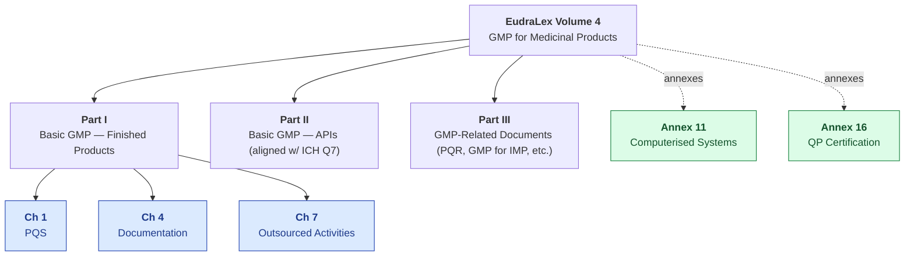
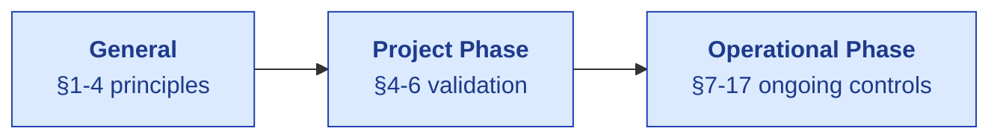

# EU GMP — Compliance Mapping

| Field | Value |
|---|---|
| Owner | Compliance + Product |
| Status | v1.0 |
| Last updated | 2026-05-31 |
| Scope | EU GMP EudraLex Volume 4 — Chapters 1, 4, 7 + Annexes 11, 16 |

---

## 1. EU GMP structure overview

| Section | Topic | S.M.A.R.T. Hawk coverage |
|---|---|---|
| **Chapter 1** | Pharmaceutical Quality System | Full EQMS module suite |
| **Chapter 4** | Documentation | Doc Control module + audit trail |
| **Chapter 7** | Outsourced Activities | Supplier Prequal + Audit + Contract Mfg |
| **Annex 11** | Computerised Systems | **The primary computerized-system regulation** — see §3 below |
| **Annex 16** | QP Certification + Batch Release | Batch Records module + QP sign-off |

## 2. Chapter 1 — Pharmaceutical Quality System (full EQMS coverage)

| §1.X | Topic | S.M.A.R.T. Hawk control |
|---|---|---|
| §1.4 | Quality assurance, GMP, and quality risk management are interrelated and concurrently | Cross-module audit-trail showing trace |
| §1.8 | Quality risk management is a systematic process | Risk module + ICH Q9 framework integration |
| §1.9 | Management Review | MRM module |
| §1.10 | Documentation system | Doc Control + audit trail |
| §1.11 | Pharmaceutical Quality System is appropriately resourced | Tenant config (roles + permissions) |
| §1.12-13 | Performance monitoring + product quality monitoring | Batch Records + Deviation + trends |

## 3. Annex 11 — Computerised Systems (the most-cited annex for SaaS)

| §11.X | Requirement | S.M.A.R.T. Hawk control |
|---|---|---|
| **§1** Principles | Risk management approach proportional to system risk | Per-tenant risk classification at onboarding |
| **§2** Personnel | Defined responsibilities + training | Tenant_admin RBAC + Training module |
| **§3** Suppliers + service providers | Formal agreements with system supplier; ongoing assessment | Customer MSA + Service Level Agreement; S.M.A.R.T. Hawk annual review |
| **§4** Validation | Documented evidence that system is fit for intended use | Validation Summary doc + IQ/OQ/PQ scripts per tenant |
| **§4.4** | Updated business process map | Customer responsibility; S.M.A.R.T. Hawk provides template |
| **§4.5** | System inventory | Per-tenant audit trail of system configuration |
| **§4.6** | Change management process | S.M.A.R.T. Hawk release notes + customer-side change impact assessment |
| **§4.8** | User Requirements Specification (URS) | Per-module URS in `Doc_V2/06-modules/` |
| **§5** Data | Data exchanges should include appropriate built-in checks | Schema validation + integration checks |
| **§6** Accuracy checks | Critical data — manual + electronic verification | Audit-trail review + e-sig on critical actions |
| **§7** Data storage | Data should be secured by physical + electronic means | MongoDB Atlas + S3 encryption + backups |
| **§7.2** | Regular backups + restore tests | Atlas backup + planned annual restore test |
| **§8** Printouts | Clear copies of electronically stored data possible | Export-to-PDF supported in every module |
| **§9** **Audit trails** | System with audit trail; documented changes/deletions/critical entries; review of audit trails | `AuditTrail` model (cross-module, immutable, queryable in <2 sec) ✅ |
| **§10** Change + configuration management | Documented change control | S.M.A.R.T. Hawk internal change control + customer-side change impact assessments |
| **§11** Periodic evaluation | Periodic evaluation of computerised systems | Annual customer review + S.M.A.R.T. Hawk platform updates |
| **§12** Security | Physical + logical controls | Hosting security + RBAC + e-sig |
| **§12.1** | Access controls | RBAC matrix per module |
| **§12.2** | Authority checks | `permit(...)` middleware + `requireESignature` |
| **§12.3** | Restriction of access | Tenant isolation + role-based UI gates |
| **§12.4** | Audit trail of access | Login + RBAC denial events in audit trail |
| **§13** Incident management | Incidents recorded + assessed | Audit-trail captures incidents; planned per-tenant incident dashboard |
| **§14** **Electronic signature** | Equivalent to handwritten; permanently linked to record; date+time; meaning | `ElectronicSignature` model + linkage to record + Part 11 alignment ✅ |
| **§15** Batch release | Automated batch release should be in line with QP responsibilities | Batch Records module + QP e-sig (Annex 16 cross-ref) |
| **§16** Business continuity | Provisions for system breakdown | Atlas multi-region (planned) + S3 replication + customer-side BCP |
| **§17** Archiving | Data archived + readable | Indefinite retention; per-tenant policy (planned M18) |

## 4. Chapter 4 — Documentation

| §4.X | Topic | S.M.A.R.T. Hawk control |
|---|---|---|
| §4.1 | Documentation is essential part of GMP | Doc Control module |
| §4.2-4.4 | Document control: review, approval, distribution | Doc Control workflow (review → approve → distribute) |
| §4.5-4.7 | Document retention | Per-tenant retention policy (planned) |
| §4.8 | Generation + control of documentation | All S.M.A.R.T. Hawk-generated docs (batch records, audit reports) versioned + audit-trailed |
| §4.9 | Electronic records — referenced to Annex 11 | See §3 above |
| §4.10-4.13 | Specification documents (raw materials, intermediates, finished) | Doc Control templates + version control |
| §4.14-4.16 | Manufacturing formulae + processing instructions | Batch Records module + Doc Control linkage |
| §4.17-4.18 | Batch processing + packaging records | Batch Records module |
| §4.20 | SOPs (procedures + records for various activities) | Doc Control + AskHawk SOP library |
| §4.21-4.28 | Specific SOPs (release, recall, complaint, change, deviation, training, audit, calibration) | All covered by respective EQMS modules |
| §4.29 | Logbooks | Audit trail per module |

## 5. Chapter 7 — Outsourced Activities

| §7.X | Topic | S.M.A.R.T. Hawk control |
|---|---|---|
| §7.1 | Outsourced activities defined + agreed | Supplier Prequal + Contract templates |
| §7.2-7.4 | Contract Giver responsibilities | Supplier Prequal + Audit + ongoing oversight |
| §7.5-7.9 | Contract Acceptor responsibilities | Supplier-side workflows (in S.M.A.R.T. Hawk supplier persona) |
| §7.10-7.13 | The Contract | Doc Control for MSA + change-control workflow |
| §7.14-7.15 | Documentation of work + transfer | Cross-tenant audit trail (where consent exists) |

## 6. Annex 16 — QP Certification + Batch Release

| §16.X | Topic | S.M.A.R.T. Hawk control |
|---|---|---|
| §16.1 | QP responsibility for batch certification | Batch Records module + QP e-sig role |
| §16.2 | Reliance on others (incl. contract mfrs) | Cross-tenant batch chain in S.M.A.R.T. Hawk |
| §16.3 | Information to be evaluated before certification | Batch Record completeness check + deviation review + CAPA closure check |
| §16.4 | Certification process | QP-only e-sig with `signatureMeaning=APPROVED` and meaning="QP_BATCH_RELEASE" |
| §16.5-16.7 | Specific situations (e.g., import, parallel mfg) | Vertical configurations |

## 7. EU vs US: where they align / diverge

| Concept | FDA (21 CFR + Part 11) | EU (GMP + Annex 11) | S.M.A.R.T. Hawk approach |
|---|---|---|---|
| Electronic signatures | 21 CFR Part 11 Subpart C | Annex 11 §14 | Single implementation satisfies both |
| Audit trail | Part 11 §11.10(e) | Annex 11 §9 | Single AuditTrail model |
| Computerised systems | Part 11 (general) | Annex 11 (specific) | Annex 11 is more prescriptive; S.M.A.R.T. Hawk builds to Annex 11 (covers Part 11) |
| Batch release | (Part 211 cGMP) | Annex 16 QP | Both supported; QP-role e-sig with explicit meaning |
| Contract mfg | (21 CFR 200.10) | Ch 7 + Annex 16 | Cross-tenant chain in S.M.A.R.T. Hawk |
| Data integrity | MHRA + FDA guidance (ALCOA+) | EU PIC/S PI 041-1 | ALCOA+ implemented end-to-end |

## 8. Known gaps + roadmap

| Gap | Section | Plan |
|---|---|---|
| Multi-region EU hosting for data localization | §7 + GDPR | Q3 2027 (post-Series A); single-region today |
| QP role formalization (Annex 16) | §16.4 | Q4 2026 — explicit QP role + QP_BATCH_RELEASE meaning enum |
| Periodic system evaluation report template | §11 | Q1 2027 |
| Automated business-continuity test runbook | §16 | Q2 2027 |

## 9. References

- [EudraLex Volume 4 (EU GMP Guidelines)](https://health.ec.europa.eu/medicinal-products/eudralex/eudralex-volume-4_en)
- [Annex 11 - Computerised Systems](https://health.ec.europa.eu/system/files/2016-11/annex11_01-2011_en_0.pdf)
- [Annex 16 - Certification by a Qualified Person](https://health.ec.europa.eu/system/files/2016-11/2015_10_v9_annex16_en_0.pdf)
- [PIC/S PI 011 - Good Practices for Computerised Systems](https://picscheme.org/)
- [PIC/S PI 041-1 - Good Practices for Data Management and Integrity](https://picscheme.org/)

---

## See also

- [PART-11.md](PART-11.md) — US equivalent for electronic records + signatures
- [ICH-Q-SERIES.md](ICH-Q-SERIES.md) — Q7 / Q9 / Q10
- [ISO-9001.md](ISO-9001.md) — general quality management
- [PLATFORM-CONTROLS.md](../platform-controls/PLATFORM-CONTROLS.md) — S.M.A.R.T. Hawk implementation map
- [SECURITY.md](../../04-engineering/06-security/SECURITY.md) — security details
