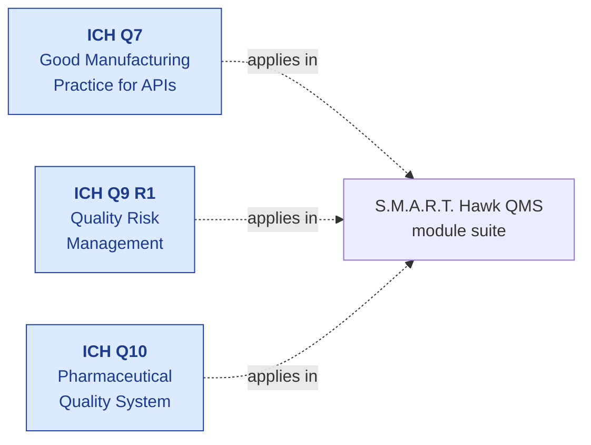
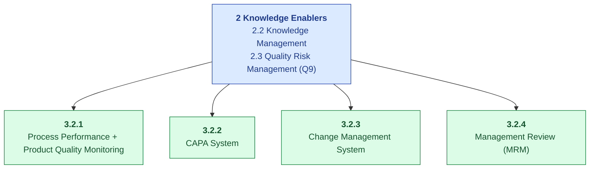

# ICH Q-Series — Compliance Mapping

| Field | Value |
|---|---|
| Owner | Compliance + Product |
| Status | v1.0 |
| Last updated | 2026-05-31 |
| Scope | S.M.A.R.T. Hawk platform — pharma manufacturing & supplier-quality controls |
| Standards covered | ICH Q7 (APIs), Q9 (Risk), Q10 (PQS) |

---

## 1. Overview of ICH Q-Series

| Guideline | Year | Scope | S.M.A.R.T. Hawk coverage |
|---|---|---|---|
| **ICH Q7** | 2000 | GMP for Active Pharmaceutical Ingredients (APIs) | Audit + supplier qual + CAPA + change control |
| **ICH Q9 R1** | 2023 | Quality Risk Management (FMEA, FMECA, fault tree) | Risk module + risk-weighted audit scope |
| **ICH Q10** | 2008 | Pharmaceutical Quality System (PQS) — full QMS framework | Full EQMS module suite |

## 2. ICH Q7 — API GMP

Most-cited sections for audit/supplier-quality workflows:

| Section | Topic | S.M.A.R.T. Hawk control |
|---|---|---|
| **§2** | Quality Management | All EQMS modules; especially MRM |
| **§3** | Personnel | Training module |
| **§4** | Buildings + Facilities | Equipment + Calibration module |
| **§5** | Process Equipment | Equipment + Maintenance |
| **§6** | Documentation + Records | Doc Control + HawkVault |
| **§7** | Materials Management | Supplier Prequalification + Audit + Batch Records |
| **§8** | Production + In-Process Controls | Batch Records + Deviation |
| **§9** | Packaging + Labeling | Batch Records (extension) |
| **§10** | Storage + Distribution | (Out of EQMS scope; ERP) |
| **§11** | Laboratory Controls | (Out of EQMS scope; LIMS integration) |
| **§12** | Validation | Per-tenant validation packages |
| **§13** | **Change Control** | **Change Control module + e-sig** |
| **§14** | Rejection + Re-use of Materials | Disposition tracking in Deviation + Batch |
| **§15** | Complaints + Recalls | Complaint Management module |
| **§16** | Contract Manufacturers (incl. Labs) | Supplier Audit + CAPA |
| **§17** | Agents, Brokers, Traders, etc. | Supplier Prequalification |
| **§18** | Specific Guidance for APIs Manufactured by Cell Culture / Fermentation | (Vertical pack — TBD) |
| **§19** | APIs for Use in Clinical Trials | (Vertical pack — TBD) |

### Key §13 — Change Control (most-cited in audits)

| §13.X | Requirement | S.M.A.R.T. Hawk |
|---|---|---|
| §13.10 | A formal change control system shall be in place | Change Control module ✅ |
| §13.11 | Procedures should be defined for identification, documentation, appropriate review, and approval of changes | Step-based workflow with approvers per change category ✅ |
| §13.12 | Any proposals for GMP-relevant changes should be drafted, reviewed, and approved by appropriate organizational units and reviewed and approved by the quality unit | Multi-step approval (proposer + QA reviewer + QA approver + e-sig) ✅ |
| §13.13 | The potential impact of the proposed change on the quality of the intermediate or API should be evaluated | Impact assessment template + risk weighting per change ✅ |
| §13.14 | A classification procedure may help in determining the level of testing, validation, and documentation needed | Critical / Major / Minor classification at intake ✅ |
| §13.15 | Proposed changes should be classified | Classification mandatory at intake ✅ |
| §13.16 | Where appropriate, changes should be evaluated for their potential to impact qualified suppliers | Cross-link to Supplier module for impact ✅ |
| §13.17 | After implementation, an evaluation of the first batches produced or tested under the change should be done | Post-implementation review step in workflow ✅ |
| §13.18 | When such consequences are identified, the change procedure should ensure they are documented and addressed | Audit-trail captures every step + reason ✅ |

## 3. ICH Q9 R1 — Quality Risk Management

The 2023 revision (R1) strengthens emphasis on **subjectivity reduction** and **risk-based decisions throughout product lifecycle**.

| Q9 Section | Topic | S.M.A.R.T. Hawk control |
|---|---|---|
| **§4.1** | Risk Assessment (Identification, Analysis, Evaluation) | Risk module + FMEA template |
| **§4.2** | Risk Control (Reduction, Acceptance) | Risk mitigation tracking |
| **§4.3** | Risk Communication | Risk-register visible to relevant personas |
| **§4.4** | Risk Review | Scheduled risk reviews + MRM input |
| **§5** | Risk Management Methodology | FMEA, FMECA, fault tree (planned) |
| **§II** Annex II | Application to Quality Management | Risk-weighted audit scope; risk-driven CAPA prioritization |

### Implementation notes

- Risk register supports FMEA scoring (Severity × Occurrence × Detectability)
- Risk findings cross-linked to audits, deviations, CAPAs, complaints
- AI-assisted risk scenario brainstorming (planned via `riskScenarioAgent`)
- Risk-weighted PAQ drafting in audit module (uses risk score to prioritize questions)

## 4. ICH Q10 — Pharmaceutical Quality System

ICH Q10 is the **PQS framework that wraps all the other guidelines**.

### Q10 Element coverage in S.M.A.R.T. Hawk

| Q10 §3.2.x | Element | S.M.A.R.T. Hawk module |
|---|---|---|
| §3.2.1 | Process Performance & Product Quality Monitoring | Batch Records + Deviation + Trends |
| §3.2.2 | CAPA System | CAPA module (full lifecycle) |
| §3.2.3 | Change Management System | Change Control module |
| §3.2.4 | Management Review of Process Performance and Product Quality | MRM (Management Review Meeting) module |

### Q10 Enablers in S.M.A.R.T. Hawk

| Enabler | S.M.A.R.T. Hawk implementation |
|---|---|
| §2.2 Knowledge Management | AskHawk (Regulations Q&A, SOPs, workflow playbooks); cross-module audit trail |
| §2.3 Quality Risk Management | Risk module + risk-weighted decisions across audit/deviation/change |

### Q10 across product lifecycle

| Stage | S.M.A.R.T. Hawk supports |
|---|---|
| Pharmaceutical Development | (Out of scope — handled by ELN/PLM tools; Design Control module for med-device) |
| Technology Transfer | Change Control + Doc Control for tech-transfer protocols |
| Commercial Manufacturing | **Full EQMS coverage** — audit, batch, deviation, CAPA, change, training |
| Product Discontinuation | Doc Control retention + audit-trail preservation |

## 5. Cross-Q traceability (where ICH guidelines reinforce each other)

| Concept | Q7 | Q9 | Q10 |
|---|---|---|---|
| Change control | §13 (specific procedures) | §II.3 (risk-based change) | §3.2.3 (system-level) |
| CAPA | §2.16 (deviation investigation) | (risk-driven) | §3.2.2 (system-level) |
| Risk management | §13.13-14 (change risk assessment) | **Full framework** | §2.3 (enabler) |
| Knowledge management | §6 (documentation) | §1 (informed decisions) | §2.2 (enabler) |
| Supplier management | §16 (contract manufacturers) | §II.7 (supplier risk) | §3.2.1 (process performance) |

S.M.A.R.T. Hawk treats these as **one integrated system**, not separate modules — every CAPA can be triggered by a risk assessment, every change references its CAPA outcomes, every audit finds gaps that feed risk + CAPA + change.

## 6. Audit-readiness checklist (ICH-focused)

When an inspector asks ICH-related questions, the answer comes from these S.M.A.R.T. Hawk queries:

| Inspector question | S.M.A.R.T. Hawk answer source |
|---|---|
| "Show me all changes to your API manufacturing process in the last 12 months" | Change Control module → filtered list + per-change full audit trail |
| "How is risk being managed across your supplier base?" | Risk module + per-supplier risk scores + risk-driven audit frequency |
| "What's the CAPA effectiveness rate?" | CAPA module → effectiveness check completion rate |
| "Show me the management review of process performance for Q1" | MRM module → meeting record + signed minutes |
| "How do you ensure supplier compliance?" | Supplier Prequal + Audit + CAPA cross-module trail |
| "What's your change control approval workflow?" | Change Control workflow diagram + step-by-step audit trail |
| "Are knowledge management practices in place per Q10 §2.2?" | AskHawk corpus (regulatory + SOPs) + cross-module audit trail |

## 7. Known gaps + roadmap

| Gap | Section | Plan |
|---|---|---|
| Annex II (cell culture / fermentation specifics) | Q7 §18-19 | Future vertical pack |
| Process Analytical Technology (PAT) integration | Q10 §3.2.1 | Customer-driven; LIMS/PLC integration roadmap |
| Real-time release testing support | Q10 supplementary | Q3 2027 — batch module extension |
| Q11 (Development & Manufacture of Drug Substances) | Q11 | Out of scope (development phase, not commercial QMS) |
| Q12 (Lifecycle Management) | Q12 | Lifecycle change tracking — partial coverage today |

## 8. References

- [ICH Q7 Good Manufacturing Practice for APIs](https://www.ich.org/page/quality-guidelines)
- [ICH Q9 R1 Quality Risk Management (2023 revision)](https://www.ich.org/page/quality-guidelines)
- [ICH Q10 Pharmaceutical Quality System](https://www.ich.org/page/quality-guidelines)
- [FDA Guidance for Industry: Q7](https://www.fda.gov/regulatory-information/search-fda-guidance-documents)
- [PIC/S Guide to Good Manufacturing Practice for Medicinal Products](https://picscheme.org/)

---

## See also

- [PART-11.md](PART-11.md) — electronic records + signatures
- [EU-GMP.md](EU-GMP.md) — EU equivalent of GMP
- [ISO-9001.md](ISO-9001.md) — general quality management
- [PLATFORM-CONTROLS.md](../platform-controls/PLATFORM-CONTROLS.md) — S.M.A.R.T. Hawk implementation map
- [06-modules/audit-management/URS.md](../../06-modules/audit-management/URS.md) — audit module requirements traced to ICH
