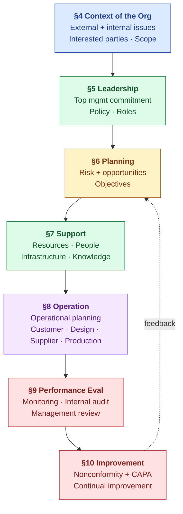

# ISO 9001:2015 — Compliance Mapping

| Field | Value |
|---|---|
| Owner | Compliance |
| Status | v1.0 |
| Last updated | 2026-05-31 |
| Scope | Hawkeye platform as ISO 9001 QMS foundation; relevant for non-pharma verticals (food, auto, aero) |

---

## 1. Why ISO 9001 matters for Hawkeye's strategy

> 💡 **The macro tailwind.** ISO 9001 is being revised for 2026; aerospace AS9100 → IA9100 aligns to it; automotive IATF 16949:2027 stays aligned. The industry is converging onto a **common ISO 9001 spine with vertical clause-packs on top** — which is exactly the engine-plus-config architecture Hawkeye has. ISO 9001 isn't just compliance; it's the **horizontal substrate that lets us expand from pharma into food, automotive, aerospace**.

## 2. ISO 9001 clause structure

## 3. Hawkeye coverage by clause

| Clause | Topic | Hawkeye control |
|---|---|---|
| **§4.1-4.4** | Context + interested parties + QMS scope | Per-tenant configuration; org chart |
| **§5.1-5.3** | Leadership + policy + roles | Tenant_admin RBAC + MRM module |
| **§6.1** | **Risk + opportunities** | Risk module |
| **§6.2** | Quality objectives | (Custom configuration per tenant) |
| **§6.3** | Planning of changes | Change Control module |
| **§7.1** | Resources (people, infra, environment, monitoring devices, knowledge) | Equipment module + Training + Doc Control |
| **§7.2** | Competence | Training module + Training Effectiveness |
| **§7.3** | Awareness | Training records per role |
| **§7.4** | Communication | Notification system + MRM |
| **§7.5** | **Documented information** | Doc Control module + audit trail |
| **§8.1** | Operational planning + control | Cross-module workflows |
| **§8.2** | Requirements for products + services | (Customer-specific configurations) |
| **§8.3** | Design + development | Design Control module (med-device focused) |
| **§8.4** | **Control of externally provided processes (suppliers)** | Supplier Prequal + Audit module |
| **§8.5** | Production + service provision | Batch Records + Equipment + SOPs |
| **§8.6** | Release of products | Batch Records + Annex 16 QP sign-off |
| **§8.7** | **Control of nonconforming outputs** | Deviation + CAPA modules |
| **§9.1** | Monitoring + measurement | KPI dashboards + trends |
| **§9.2** | **Internal audit** | Audit module (internal-audit type) |
| **§9.3** | **Management review** | MRM module |
| **§10.1-10.3** | Improvement + nonconformity + corrective action + continual improvement | CAPA module + trend analysis |

## 4. Where ISO 9001 + GxP overlap (the architectural opportunity)

| Concept | ISO 9001 | GxP (FDA / EMA) | Hawkeye reuse |
|---|---|---|---|
| Document control | §7.5 | 21 CFR 211.180 / Annex 11 + Ch 4 | **Single Doc Control module** |
| Supplier qualification | §8.4 | ICH Q7 §16 / EU Ch 7 | **Single Supplier Prequal + Audit module** |
| Corrective action | §10.2 | 21 CFR 820.100 (med-device) / ICH Q10 §3.2.2 | **Single CAPA module** |
| Internal audit | §9.2 | (implied across GxP) | **Single Audit module (with internal-audit type)** |
| Management review | §9.3 | ICH Q10 §1.6 / EU Ch 1 | **Single MRM module** |
| Risk management | §6.1 | ICH Q9 | **Single Risk module** |
| Change control | §6.3 / §8.5.6 | ICH Q7 §13 / EU Annex 11 §4 | **Single Change Control module** |

> ✅ **This is the architectural moat.** A pharma EQMS that ALSO satisfies ISO 9001 (via configuration) can serve non-pharma verticals (food, cosmetics, auto) without forking. Vertical incumbents (Greenlight Guru in med-device, TraceGains in food) own their lane but can't cross over.

## 5. Vertical clause-packs (the configuration layer)

For each vertical, additive ISO clauses + sector-specific standards:

| Vertical | Base | Sector overlay | Additional clauses |
|---|---|---|---|
| **Pharma** | ISO 9001 | ICH Q-series + EU GMP + Part 11 | Batch release (Annex 16), API §13 change control |
| **Med-device** | ISO 9001 | **ISO 13485** (replaces 9001 in this sector) + FDA QMSR (2026) + MDR | Design history, complaint, recall, vigilance |
| **Food** | ISO 9001 | **FSSC 22000** + HACCP + FDA FSMA | Critical control points, recall, lot traceability |
| **Cosmetics** | ISO 9001 | **ISO 22716** GMP for cosmetics | Batch lite, claim substantiation |
| **Automotive** | ISO 9001 | **IATF 16949** + APQP + PPAP | PPAP, FMEA, FAI |
| **Aerospace** | ISO 9001 | **AS9100** → IA9100 + NADCAP | First Article Inspection (FAI), special processes |

## 6. ISO 9001:2026 revision (active development)

| Anticipated change | Impact on Hawkeye |
|---|---|
| Stronger emphasis on **climate change as context factor** | Tenant context capture broadened |
| Tighter integration with **ISO 31000 (risk)** | Risk module already maps to ISO 31000 vocabulary |
| Updates to **§7.1.4 (environment for operation of processes)** | Equipment module captures environment |
| Possible new explicit clause on **digital technologies + AI in QMS** | We're already ahead — AI grounded gen + audit trail is ready |

## 7. Audit-readiness checklist (ISO 9001-focused)

| Inspector question | Hawkeye answer |
|---|---|
| "Show your QMS scope statement" | Tenant config doc |
| "How do you handle nonconforming outputs?" | Deviation module → CAPA → effectiveness check trail |
| "Show your last management review" | MRM module → signed minutes + action items |
| "How do you qualify suppliers?" | Supplier Prequal + Audit module → per-supplier history |
| "Document control system?" | Doc Control + per-doc audit trail |
| "Training effectiveness?" | Training module → Effectiveness verification records |
| "Internal audit program?" | Audit module → internal audits filtered + signed reports |
| "How is risk assessed + managed?" | Risk module → FMEA + risk-weighted decisions cross-module |

## 8. References

- [ISO 9001:2015 Quality Management Systems](https://www.iso.org/standard/62085.html)
- [ISO 9000:2015 Fundamentals and Vocabulary](https://www.iso.org/standard/45481.html)
- [ISO 9001:2026 (revision in progress)](https://www.iso.org/)
- [ISO/TC 176/SC 2 (the committee maintaining 9001)](https://committee.iso.org/sc176sc2)

---

## See also

- [ICH-Q-SERIES.md](ICH-Q-SERIES.md) — pharma overlay
- [EU-GMP.md](EU-GMP.md) — EU pharma overlay
- [PART-11.md](PART-11.md) — US electronic records
- [PLATFORM-CONTROLS.md](../platform-controls/PLATFORM-CONTROLS.md) — Hawkeye implementation
- [MARKET-ANALYSIS.md](../../01-strategy/market-analysis/MARKET-ANALYSIS.md) — vertical expansion strategy underpinned by ISO 9001 convergence
