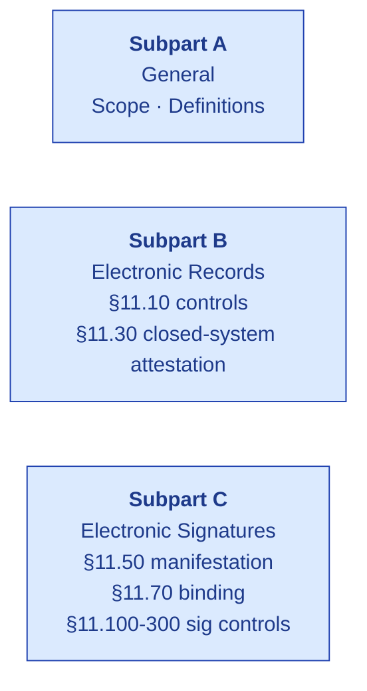
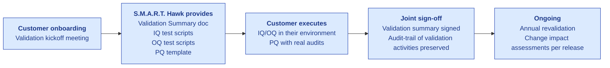

# 21 CFR Part 11 — Compliance Matrix

| Field | Value |
|---|---|
| Owner | Compliance + Engineering |
| Status | v1.0 (self-assessed; customer-led validation per tenant) |
| Last updated | 2026-05-31 |
| Scope | S.M.A.R.T. Hawk platform; all modules with electronic records or e-signatures |

---

## 1. Background

21 CFR Part 11 governs **electronic records and electronic signatures** in FDA-regulated industries (pharma, biotech, med-device, food, blood/tissue). Originally published 1997; FDA's 2003 Scope and Application guidance clarified the risk-based interpretation. Industry treats Part 11 as table-stakes for any GxP-aware system.

## 2. Compliance matrix — Subpart B (Electronic Records)

| Section | Requirement | S.M.A.R.T. Hawk control | Status |
|---|---|---|---|
| **§11.10(a)** | Validation: ensure accuracy, reliability, consistent intended performance, and discern invalid/altered records | Per-tenant validation summary (CSV/IQ/OQ/PQ); schema validation; integrity hashes on PDF artifacts | ✅ Self-assessed; customer-led CSV per tenant |
| **§11.10(b)** | Generation of accurate and complete copies (human-readable + electronic form) | Export to JSON/CSV/PDF supported; audit-trail browser cross-module | ✅ |
| **§11.10(c)** | Protection of records to enable accurate and ready retrieval throughout retention period | MongoDB Atlas backups + point-in-time recovery; S3 lifecycle for evidence files; per-tenant retention config (planned M18) | ⚠️ Partial — per-tenant retention config TBD |
| **§11.10(d)** | Limiting system access to authorized individuals | 4-layer middleware chain (authenticate + resolveTenant + permit + e-sig); RBAC matrix per module | ✅ |
| **§11.10(e)** | **Secure, computer-generated, time-stamped audit trail** that records date+time of operator entries and actions creating/modifying/deleting records; old + new values preserved; not obscure previously recorded information; available throughout retention period | `AuditTrail` model with timestamp + actorId + before/after; immutable (append-only at service layer); cross-module queryable in <2 sec | ✅ |
| **§11.10(f)** | Use of operational system checks to enforce permitted sequencing of steps and events | State machines per module (forward-only by default); `auditPhaseService.canTransition()` enforces gate prerequisites | ✅ |
| **§11.10(g)** | Use of authority checks to ensure only authorized individuals can use the system, sign records, alter records, etc. | RBAC + e-sig per action; service-layer guards (`canUserAccessAudit`) | ✅ |
| **§11.10(h)** | Use of device (e.g., terminal) checks where appropriate | Session capture of IP + User-Agent in audit trail + e-sig records | ✅ |
| **§11.10(i)** | Persons developing/maintaining the system have appropriate education, training, experience | Internal training records (engineering team); SME consultant on staff | ✅ documented in [00-company/](../../../00-company/) |
| **§11.10(j)** | Establishment of and adherence to written policies that hold individuals accountable for actions initiated under their electronic signatures, deterring record falsification | Customer-side acceptable-use policy template provided; mandatory `reasonForChange` on every state change | ✅ template provided; tenant-specific enforcement is customer's |
| **§11.10(k)(1)** | Use of appropriate controls over systems documentation (distribution of, and access to, documentation) | Doc_V2 + per-tenant validation packs; access-controlled | ✅ |
| **§11.10(k)(2)** | Revision and change-control procedures to maintain an audit trail that documents time-sequenced development and modification of systems documentation | Git history + per-doc changelog in frontmatter; semantic versioning | ✅ |
| **§11.30** | Closed-system attestation: persons using closed systems shall employ procedures and controls designed to ensure authenticity, integrity, and confidentiality of electronic records | Customer-side attestation supported via per-tenant configuration + validation summary | ⚠️ Tenant declares closed-system status; S.M.A.R.T. Hawk provides infrastructure |

## 3. Compliance matrix — Subpart C (Electronic Signatures)

| Section | Requirement | S.M.A.R.T. Hawk control | Status |
|---|---|---|---|
| **§11.50(a)** | Signed electronic records shall contain information indicating: printed name of signer, date+time of signature, meaning of signature (e.g., review, approval) | `ElectronicSignature` schema captures signerId → name, signedAt, signatureMeaning enum (APPROVED / AUTHORED / WITNESSED / REVIEWED / REJECTED) | ✅ |
| **§11.50(b)** | Above info shall be subject to same controls as electronic records and included as part of any human-readable form of the electronic record | E-sig fields rendered in PDF artifacts (audit-closure cert, signed reports); preserved in audit trail | ✅ |
| **§11.70** | Electronic signatures and handwritten signatures executed to electronic records shall be linked to their respective electronic records to prevent excision, copying, or transfer | `ElectronicSignature.recordType + recordId` is foreign-key linked; cannot be detached without DB-level integrity violation | ✅ |
| **§11.100(a)** | Each electronic signature shall be unique to one individual and shall not be reused by, or reassigned to, anyone else | Per-user; bound to `userId` (immutable once created); no shared accounts | ✅ |
| **§11.100(b)** | Before establishing/assigning/certifying electronic signatures, identity of the individual shall be verified | Email-verified at onboarding; tenant_admin invitation flow | ⚠️ Email verification only today; ID verification depends on tenant policy |
| **§11.100(c)** | Persons using electronic signatures shall certify to FDA (in non-repudiation form) that they intend signatures to be legally binding equivalent of handwritten | Customer-side certification statement at onboarding (per-tenant) | ✅ template provided |
| **§11.200(a)(1)** | Electronic signatures not based on biometrics shall employ at least two distinct identification components such as identification code + password | Email (ID code) + password (bcrypt-verified); MFA roadmap M12 | ⚠️ ID + password today; MFA roadmap |
| **§11.200(a)(2)** | Be used only by their genuine owners | Per-user; password verified at every e-sig event | ✅ |
| **§11.200(a)(3)** | Be administered and executed to ensure attempted use by anyone other than genuine owner requires collaboration of two or more individuals | Tenant_admin password reset requires multi-step verification (planned UI improvement) | ⚠️ Partial — relies on tenant password reset policies |
| **§11.300(a)** | Maintain uniqueness of each combined identification code and password | Email uniqueness enforced at DB level | ✅ |
| **§11.300(b)** | Ensure identification code/password issuances are periodically checked, recalled, or revised | Tenant_admin manages user lifecycle; password policy enforcement (planned per-tenant policy M12) | ⚠️ Manual today |
| **§11.300(c)** | Loss management procedures | Tenant_admin password reset flow + audit-trail entries | ✅ |
| **§11.300(d)** | Use of transaction safeguards to prevent unauthorized use of passwords | Rate-limited login attempts; bcrypt; HTTPS-only | ✅ |
| **§11.300(e)** | Initial and periodic testing of devices that bear or generate ID code/password information | Internal CI tests; planned annual third-party pentest | ⚠️ Pentest roadmap |

## 4. Implementation evidence

For each section above, the live code path:

| Control area | Code path |
|---|---|
| Authentication | `backend/src/middlewares/authMiddleware.js` |
| Authorization (RBAC) | `backend/src/middlewares/roleMiddleware.js`; per-module `permit(...)` |
| Tenant isolation | `backend/src/middlewares/tenantMiddleware.js`; `services/auditAccess.js` |
| Audit trail | `backend/src/services/auditTrailService.js`; `models/AuditTrail.js` |
| E-signature | `backend/src/middlewares/requireESignature.js`; `models/ElectronicSignature.js` |
| State machine + gates | `backend/src/services/auditPhaseService.js`; `constants/auditPhases.js` |
| Frontend SignatureDialog | `frontend/components/eqms/SignatureDialog.tsx` |
| Validation summaries | `Doc_V2/06-modules/<module>/ARCHITECTURE.md` (compliance trace section) |

## 5. Known gaps + remediation roadmap

| Gap | Section | Severity | Plan |
|---|---|---|---|
| MFA not yet shipped | §11.200(a)(1) | Medium | Q3 2026 (TOTP) |
| ID verification beyond email | §11.100(b) | Low | Q1 2027 (SSO via Okta/Azure AD) |
| Per-tenant retention policy enforcement | §11.10(c) | Medium | Q4 2026 |
| Periodic password rotation enforcement | §11.300(b) | Low | Q1 2027 (per-tenant policy) |
| Annual third-party pentest | §11.300(e) | Medium | Q1 2027 |
| Closed-system attestation default | §11.30 | Low (customer-declared) | Doc template provided |
| Soft-mode e-sig default | §11.200 | Low (PoC phase) | Q4 2026 — flip to hard for prod tenants |

## 6. Validation packages (per tenant)

For each customer requiring Part 11 validation:

| Deliverable | Source | Cost to customer |
|---|---|---|
| Validation Summary doc | Per-tenant generated from template | Included in implementation |
| IQ (Installation Qualification) scripts | Standard template | Included |
| OQ (Operational Qualification) scripts | Standard template | Included |
| PQ (Performance Qualification) template | Customer-led with S.M.A.R.T. Hawk support | Customer effort |
| Validation Sign-Off Certificate | Joint sign-off | Joint |
| Annual revalidation summary | S.M.A.R.T. Hawk provides change log | Annual review |

## 7. What's NOT in Part 11 scope (often confused)

> ℹ️ **Part 11 governs records + signatures.** It does NOT directly require:
>
> - Validation method (your QMS defines it; Part 11 just requires THAT you validate)
> - Specific MFA tech (§11.200 says "two distinct components" — password + ID is sufficient at the letter of the law; MFA is industry best practice)
> - Specific retention period (your QMS defines it; Part 11 just requires THAT retention exists)
> - Cloud vs on-prem (deployment model is your call)
> - Specific encryption standard (your security policy defines it)
> - Closed vs open system distinction at platform level (customer-declared per [§11.30](https://www.fda.gov/regulatory-information/search-fda-guidance-documents/part-11-electronic-records-electronic-signatures-scope-and-application))

## 8. References

- [FDA 21 CFR Part 11](https://www.accessdata.fda.gov/scripts/cdrh/cfdocs/cfcfr/CFRSearch.cfm?CFRPart=11)
- [FDA Guidance: Part 11, Scope and Application (2003)](https://www.fda.gov/regulatory-information/search-fda-guidance-documents/part-11-electronic-records-electronic-signatures-scope-and-application)
- [ISPE GAMP 5 (Risk-based approach to computer system validation)](https://ispe.org/publications/guidance-documents/gamp-5)
- [PIC/S PI 041-1 (Good Practices for Data Management and Integrity)](https://picscheme.org/)

---

## See also

- [PLATFORM-CONTROLS.md](../platform-controls/PLATFORM-CONTROLS.md) — how S.M.A.R.T. Hawk implements each requirement
- [SECURITY.md](../../04-engineering/06-security/SECURITY.md) — auth + RBAC + e-sig details
- [DATA-INTEGRITY](../data-integrity/) (ALCOA+) — TBD
- [DESIGN-AND-DEVELOPMENT-PLAN.md](../validation/DESIGN-AND-DEVELOPMENT-PLAN.md) — GAMP Cat 4 design-control plan (820.30 / IEC 62304 / Part 11)
- [06-modules/audit-management/ARCHITECTURE.md §7](../../06-modules/audit-management/ARCHITECTURE.md#7-compliance-traceability) — per-feature compliance trace
