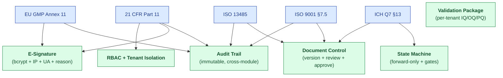
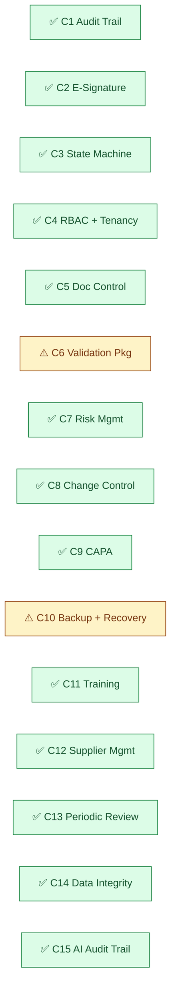
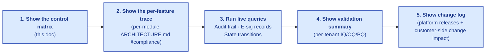

# Platform Controls — How Hawkeye Implements Each Regulation

| Field | Value |
|---|---|
| Owner | Compliance + Engineering |
| Status | v1.0 |
| Last updated | 2026-05-31 |
| Purpose | Cross-regulation traceability — answer "where in Hawkeye does X get satisfied?" |

---

## 1. The control matrix

Every regulatory requirement is implemented by one or more Hawkeye platform controls. This document is the **single source of truth** for "where does X get satisfied?"

## 2. Master control list

| # | Control | Implementation | Regulatory references |
|---|---|---|---|
| **C1** | **Audit Trail** (cross-module, immutable, queryable) | `AuditTrail` model + `auditTrailService.writeAuditTrail()` | Part 11 §11.10(e); Annex 11 §9; ISO 9001 §7.5; ALCOA+ |
| **C2** | **Electronic Signature** (password + reason + IP + UA + meaning) | `ElectronicSignature` model + `requireESignature` middleware | Part 11 §11.50/11.70/11.100/11.200; Annex 11 §14; ISO 13485 §4.2.5 |
| **C3** | **State Machine** (forward-only + gate enforcement + reason for revert) | `auditPhaseService.canTransition()`; per-module service layer | Part 11 §11.10(f); ICH Q7 §13.12; ISO 9001 §8.5 |
| **C4** | **RBAC + Tenant Isolation** (4-layer middleware + service guards + query helpers) | `authenticate` + `resolveTenant` + `permit` middleware; `canUserAccessAudit` etc. | Part 11 §11.10(d)(g)(h); Annex 11 §12; ISO 9001 §5.3 |
| **C5** | **Document Control** (version + review + approve + retention) | Doc Control module | EU GMP Ch 4; Annex 11 §10; ISO 9001 §7.5; ISO 13485 §4.2.4 |
| **C6** | **Validation Package** (per-tenant IQ/OQ/PQ + validation summary) | Customer-led per tenant; Hawkeye-provided templates | Part 11 §11.10(a); Annex 11 §4; GAMP 5 |
| **C7** | **Risk Management** (FMEA + risk register + risk-weighted decisions) | Risk module | ICH Q9; ISO 9001 §6.1; ISO 31000 |
| **C8** | **Change Control** (formal workflow + impact assessment + approval) | Change Control module | ICH Q7 §13; ISO 9001 §6.3, §8.5.6; EU Annex 11 §10 |
| **C9** | **CAPA System** (intake + investigation + RCA + action + effectiveness + closure) | CAPA module | 21 CFR 820.100; ISO 9001 §10.2; ICH Q10 §3.2.2 |
| **C10** | **Backup + Recovery** (DB backups + restore tests + S3 versioning) | MongoDB Atlas + S3 + planned restore tests | Annex 11 §7.2; ISO 9001 §7.1; GAMP 5 |
| **C11** | **Training Records** (per-user training + effectiveness verification) | Training module | Part 11 §11.10(i); ISO 9001 §7.2; ISO 13485 §6.2 |
| **C12** | **Supplier Management** (prequalification + audit + ongoing oversight) | Supplier Prequal + Audit modules | ICH Q7 §16; EU GMP Ch 7; ISO 9001 §8.4 |
| **C13** | **Periodic Review** (system + change + product quality reviews) | MRM module + Annual Product Review template | ICH Q10 §3.2.1, §3.2.4; Annex 11 §11; ISO 9001 §9.3 |
| **C14** | **Data Integrity (ALCOA+)** | Cross-cutting: implemented via C1+C2+C4+C5 | PIC/S PI 041-1; MHRA Data Integrity Guidance |
| **C15** | **AI Decision Audit Trail** (modelVersion + promptHash + retrievalSet + confidence + disposition) | `recordAiDecision()` extends `AuditTrail` | (Industry-best-practice; pre-emptive for upcoming AI regulations) |

## 3. Cross-control reference (when one control satisfies many regs)

### Example: a single audit-trail row satisfies multiple regulators

When a CAPA is closed:

| Regulator | Specific requirement | Audit-trail field satisfying it |
|---|---|---|
| FDA Part 11 | §11.10(e) — secure time-stamped audit trail | `createdAt`, `actorId`, `before`, `after` |
| EU Annex 11 | §9 — audit trail with all changes documented | Same row |
| ICH Q7 | §13.18 — change consequences documented | `reasonForChange` + `meta.changeBrief` |
| ISO 9001 | §7.5.3 — control of documented information | Same row + linked `Document` history |
| ICH Q10 | §3.2.2 — CAPA system audit | Same row + CAPA-specific fields |
| PIC/S PI 041-1 | ALCOA+ "Attributable, Contemporaneous, Original" | `actorId`, `createdAt`, immutability guarantee |

> 💡 **One implementation, many regulators satisfied.** This is the architectural payoff of unified controls.

## 4. Per-module control mapping

| Module | Primary controls | Per-module compliance trace |
|---|---|---|
| Audit | C1, C2, C3, C4, C12 | [audit ARCHITECTURE §7](../../06-modules/audit-management/ARCHITECTURE.md#7-compliance-traceability) |
| CAPA | C1, C2, C3, C9 | TBD |
| Deviation | C1, C3, C7 | TBD |
| Change Control | C1, C2, C3, C8 | TBD |
| Document Control | C1, C2, C5 | TBD |
| Batch Records | C1, C2, C3 | TBD |
| Complaint | C1, C9 | TBD |
| Risk Management | C7 | TBD |
| Training | C1, C11 | TBD |
| Equipment | C1, C10 | TBD |
| MRM | C1, C2, C13 | TBD |
| Supplier Prequal | C1, C12 | TBD |
| Design Control | C1, C2, C3, C5 (ISO 13485) | TBD |

## 5. Control maturity (today)

| Control | Status | Gap (if any) | Plan |
|---|---|---|---|
| C1 Audit Trail | ✅ Live | — | — |
| C2 E-Signature | ✅ Live | Soft-mode default; MFA not yet | Q3 2026 hard mode + MFA |
| C3 State Machine | ✅ Live | Dual status fields (`trackStatus` + `phaseState`) | Q4 2026 cleanup |
| C4 RBAC + Tenancy | ✅ Live | No MFA, no SSO yet | Q3 2026 |
| C5 Doc Control | ✅ Live | Per-tenant retention policy not enforced | Q1 2027 |
| C6 Validation Pkg | ⚠️ Partial | Per-tenant IQ/OQ scripts incomplete | Q4 2026 |
| C7 Risk Mgmt | ✅ Live | AI scenario brainstorming planned | Q1 2027 |
| C8 Change Control | ✅ Live | — | — |
| C9 CAPA | ✅ Live | Predictive effectiveness AI in progress | Q3 2026 |
| C10 Backup + Recovery | ⚠️ Partial | Annual restore test not yet scheduled | Q4 2026 |
| C11 Training | ✅ Live | — | — |
| C12 Supplier Mgmt | ✅ Live | Cross-tenant intel UI deferred | Q2 2027 |
| C13 Periodic Review | ✅ Live | — | — |
| C14 Data Integrity (ALCOA+) | ✅ Live | TSA cryptographic anchor not yet | Q2 2027 |
| C15 AI Audit Trail | ✅ Live | Active-learning auto-tuning deferred | Q1 2027 |

## 6. Customer-side controls (out of our scope, into theirs)

Some regulatory requirements are **customer-policy-driven** even though Hawkeye provides the platform:

| Customer responsibility | Hawkeye supports via |
|---|---|
| Closed-system attestation (Part 11 §11.30) | Per-tenant declaration in config |
| Acceptable Use Policy + password policy | Tenant-configurable settings |
| Periodic password rotation | Per-tenant policy enforcement (planned) |
| ID verification for new users beyond email | Customer's onboarding process |
| Specific retention durations per record type | Per-tenant retention config (planned) |
| Validation execution (IQ/OQ/PQ) per the customer's QMS | Hawkeye-provided templates |
| Customer-side staff training on Hawkeye use | Training materials provided |
| Annual self-audit + management review of QMS | MRM module supports the process |

## 7. The audit-readiness "1-page answer"

When a regulator asks "show me your compliance posture":

---

## See also

- [PART-11.md](../frameworks/PART-11.md)
- [ICH-Q-SERIES.md](../frameworks/ICH-Q-SERIES.md)
- [EU-GMP.md](../frameworks/EU-GMP.md)
- [ISO-9001.md](../frameworks/ISO-9001.md)
- [DATA-INTEGRITY](../data-integrity/) (ALCOA+) — TBD
- [VALIDATION / DESIGN-AND-DEVELOPMENT-PLAN.md](../validation/DESIGN-AND-DEVELOPMENT-PLAN.md) (CSV / GAMP 5 / 820.30 design controls)
- [04-engineering/06-security/SECURITY.md](../../04-engineering/06-security/SECURITY.md)
- [06-modules/audit-management/ARCHITECTURE.md §7](../../06-modules/audit-management/ARCHITECTURE.md#7-compliance-traceability)
