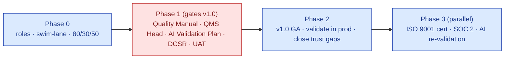

# QMS Readiness — Meeting Gap Analysis & Action Plan

> **Source:** Compliance working session with **Debashish Panda** (pharma QMS/compliance advisor) and **Uma Akundi** (UAT + pharma process compliance), with **S.M.A.R.T. Hawk Transact**. This document maps every point raised in that session against what is **already in the documentation set** versus what is **missing**, and converts the gaps into an owned, prioritized plan — explicitly balancing compliance rigor against go-to-market speed (as the team agreed).

| Field | Value |
|---|---|
| Document | `HK-QMS-GAP-v1.0` |
| Owner | Founder (S.M.A.R.T. Hawk) → to transition to **QMS Head** once appointed |
| Status | v1.0 — action plan for review at the 06:30 follow-up |
| Date | 2026-06-14 |
| Advisors | Debashish Panda (QMS/risk/design-control guidance) · Uma Akundi (UAT + pharma process) |
| Related | [DESIGN-AND-DEVELOPMENT-PLAN.md](validation/DESIGN-AND-DEVELOPMENT-PLAN.md) · [SDLC-PROCESS-AND-DOCUMENTATION-STANDARD.md](sdlc/SDLC-PROCESS-AND-DOCUMENTATION-STANDARD.md) · [GAMP-CAT-4-COMPLIANCE.md](GAMP-CAT-4-COMPLIANCE.md) · [POSITIONING-AND-MARKET-STUDY-2026.md](../01-strategy/vision-and-positioning/POSITIONING-AND-MARKET-STUDY-2026.md) |

---

## 0. How to read this

Legend used throughout:

| Symbol | Meaning |
|---|---|
| ✅ **Incorporated** | A controlled document/artifact already exists and substantially covers the point |
| ⚠️ **Partial** | Some coverage exists but a named gap remains |
| ❌ **Missing** | No artifact exists; must be created |

**Bottom line up front:** the **design-control, SDLC, Part-11/Annex-11, GAMP Cat 4 and positioning foundations are now built** (largely in the last cycle). The remaining gaps are **QMS-level governance artifacts** — a true Quality Manual, an ISO 9001 certification plan, the QMS org/roles, a customer-facing Design Control Summary Report, a formal AI Validation Plan, and a few positioning refinements Debashish asked for. None of these block a *controlled pilot*; several **gate the v1.0 GA release** and supplier-qualification credibility.

---

## 1. Scorecard — meeting themes vs current state

| # | Theme (from the session) | Status | Where it lives / what's missing |
|---|---|---|---|
| 1 | QMS established before v1.0 (ISO 9001 baseline) | ⚠️ Partial | ISO-9001 *mapping* exists; **no Quality Manual, no QMS master plan, no cert roadmap** |
| 2 | Quality Manual + master plan (change mgmt, comms) | ❌ Missing | Referenced as "Vendor QM" but **not authored** |
| 3 | QMS Head role + compliance lifecycle owner + swim lane/org | ❌ Missing | No QMS-role definition, no swim lane, no compliance-lifecycle owner named |
| 4 | Living compliance docs (continuously updated) | ✅ Incorporated | DDP §2 review cycle; SDLC Phase 11 periodic review; needs an explicit *living-document register* |
| 5 | Risk assessment per ICH Q9 **and ISO 31000** | ⚠️ Partial | DDP/risk cover ICH Q9 + ISO 14971; **ISO 31000 named but no standalone Risk Management Plan SOP** |
| 6 | Design verification (test env) vs validation (commercial env) | ✅ Incorporated | DDP §11.6 V&V; **sharpen the "validation in commercial env" statement** |
| 7 | Design Control Summary Report (DCSR) for customers | ❌ Missing | DDP + GAMP package exist; **the named DCSR artifact does not** |
| 8 | Beyond Part 11 — 21 CFR 820, DHF, design history | ✅ Incorporated | DDP maps 820.30 + DHF; Part-11 matrix exists |
| 9 | AI validation — false negatives, black-box controls, FDA AI guidance | ⚠️ Partial | AI governance (cite-or-fallback, AI audit trail) exists; **no formal AI Validation Plan addressing false-negative detection & regulator-facing AI design evidence** |
| 10 | Positioning: audit vs supplier-qual vs EQMS, buyer view | ✅ Incorporated | Positioning & Market Study delivered |
| 11 | Positioning: explicit 80% / 30% / 50% coverage + gaps | ❌ Missing | **Coverage-percentage table not yet in the positioning doc** (action item) |
| 12 | Audit ↔ Supplier-Qualification delineation + API integration | ⚠️ Partial | Module docs treat both; **no explicit module-boundary + integration spec** |
| 13 | URS-aligned testing / UAT before commercial release | ⚠️ Partial | SDLC Phase 6 + DDP V&V; **UAT protocol + URS v4.0 trace to test cases not formalized** |
| 14 | Continuous lifecycle mgmt (feedback, patches, versioning) | ✅ Incorporated | SDLC Phases 9–11; change control; periodic review |
| 15 | Balance rigor vs GTM speed | ✅ (principle) | Addressed in this plan's phasing (§3) |

**Tally: 6 Incorporated · 5 Partial · 4 Missing.** The four ❌ Missing items (Quality Manual, QMS roles/org, DCSR, 80/30/50 positioning) are the priority creations.

---

## 2. Detailed gap analysis (by theme)

### A. QMS establishment before v1.0 — ⚠️ / ❌
**Said:** robust QMS is a precondition for v1.0; ISO 9001 (or equivalent) certification is a **baseline expectation for supplier qualification by pharma clients**; need a master plan covering change management, internal/external communications, and a **Quality Manual**.

**Already incorporated:** [ISO-9001.md](frameworks/ISO-9001.md) clause-mapping; [SDLC standard](sdlc/SDLC-PROCESS-AND-DOCUMENTATION-STANDARD.md) (change management, version control, periodic review); [GAMP Cat 4](GAMP-CAT-4-COMPLIANCE.md) (vendor SDLC + validation).

**Gaps:**
- ❌ **No Quality Manual** — the apex QMS document (quality policy, scope, process map, interactions, exclusions). The GAMP doc *refers* to a "Vendor Quality Manual" but it has never been authored.
- ❌ **No QMS Master Plan** — the program plan that sequences QMS build before v1.0 (incl. internal/external communication procedure).
- ❌ **No ISO 9001 certification roadmap** — gap assessment → documentation → internal audit → Stage 1 / Stage 2 registrar audit → certificate.

> 🩺 **Advisor's point is correct and commercially material:** pharma clients' supplier-qualification questionnaires routinely ask "Is your QMS ISO 9001 certified?" Today the honest answer is "aligned, certification targeted 2027." A **Quality Manual + cert roadmap** turns that into a credible, dated answer.

### B. Roles, expertise & org — ❌
**Said:** QMS Head needs **ISO 9001 certification / quality-management knowledge** (not necessarily pharma or IT), acts as **final certifier**; continuous oversight even if consultants assist. Role split: **Uma → UAT + pharma process compliance**; **Subham → technical IT QA**; a **company placeholder** must own the compliance lifecycle and liaise with auditors.

**Gaps:**
- ❌ No **QMS Head / Quality Unit** role defined with the stated qualification (ISO 9001 lead-auditor or equivalent).
- ❌ No **compliance-lifecycle owner** (the internal touchpoint for auditors and continuous doc updates).
- ❌ No **swim-lane + org chart** mapping QMS, compliance, software QA, UAT (the explicit action item).

### C. Compliance documentation lifecycle — ✅ / ⚠️
**Said:** design & dev docs, risk assessments, V&V data must be **living documents** updated with user feedback; risk per **ICH Q9 and ISO 31000**.

**Incorporated:** DDP review cycle; SDLC Phase 11 (periodic review, living docs); change control.
**Gap:** ⚠️ a **standalone Risk Management Plan SOP** explicitly anchored to **ICH Q9 + ISO 31000** (today risk is embedded in the DDP under ICH Q9 + ISO 14971; ISO 31000 is named but not operationalized as a procedure). Add a **living-document register** so "which docs are living and who updates them on feedback" is explicit.

### D. Design control & the DCSR — ✅ / ❌
**Said:** pharma customers expect a **Design Control Summary Report (DCSR)** that details software design for audits/submissions **without exposing confidential details**; anticipate auditor questions (esp. AI).

**Incorporated:** the **DDP** (full 820.30 design controls, DHF, design reviews, V&V) and the GAMP validation package — these are the *internal* design-control evidence.
**Gap:** ❌ the **DCSR itself** — a *customer/auditor-facing summary* derived from the DHF that can be shared under NDA without exposing IP. This is a distinct, named deliverable pharma QA teams request. **Create it as a template + first instance.**

### E. Beyond 21 CFR Part 11 — ✅
**Said:** Part 11 is only e-records/e-sig (minimal); broader compliance (21 CFR **820**, design history files, possibly **letters of authorization** for hardware integration) is needed.

**Incorporated:** the DDP explicitly maps **820.30 design controls**, the **DHF**, IEC 62304, ISO 14971; the Part-11 matrix is separate and complete. **This is now well covered** — the meeting's concern that "Part 11 alone is insufficient" is already answered by the DDP + GAMP package.
**Minor gap:** ⚠️ **letters of authorization / Master File reference** for any hardware-integration scenario — niche; add a one-line procedure if hardware integration becomes in-scope.

### F. AI validation — ⚠️ (the highest-substance gap)
**Said:** AI "black box" complicates validation; auditors will demand **evidence of controls over AI decision-making** and **mechanisms to detect false negatives** (critical errors); cited real cases of unvalidated AI audit tools causing regulatory concern; vendor must provide **AI design documentation directly to regulators**; FDA AI/ML guidance applies.

**Incorporated:** strong AI *governance* foundation — cite-or-fallback (non-configurable), AI decision audit trail (C15: model version, prompt hash, retrieval set, confidence, human disposition), human-commits-the-record, multi-LLM gateway; ADR-003.

**Gaps:**
- ⚠️ **No formal AI Validation Plan** as a controlled document that an auditor/regulator can be handed. It must explicitly address:
  - **False-negative / false-positive analysis** per AI feature (e.g., a missed critical observation, a mis-classified deviation) with detection + mitigation controls.
  - **Intended-use & risk classification** of each AI feature (decision-support vs decision-making — *we are always decision-support; human signs*).
  - **Ground-truth evaluation sets, acceptance thresholds, drift monitoring, and re-validation triggers.**
  - **GMLP / FDA AI guidance** alignment and **EU Annex 22 (draft)** readiness.
  - A **regulator-facing AI design summary** (subset of the DCSR) explaining controls without exposing model IP.

> 🩺 **This is the single most important new document.** Debashish is right that AI is where audits will probe hardest. The good news: the *controls already exist in code* (cite-or-fallback, AI audit trail) — what's missing is the **validation plan and evidence package that names false-negative handling explicitly.**

### G. Positioning — ✅ / ❌
**Said (Hawkeye):** identify market pain first; estimate current coverage at **~80% supplier-audit, ~30% supplier-qualification, ~50% EQMS**; produce a positioning doc reflecting the three modules and their overlap. **Said (Debashish):** define positioning upfront; clarify *which audits* (supplier/internal/contractor/lab); from the **buyer's perspective**; clarify integration with existing QMS platforms; avoid commoditization.

**Incorporated:** the [Positioning & Market Study](../01-strategy/vision-and-positioning/POSITIONING-AND-MARKET-STUDY-2026.md) already resolves the four-category overlap, takes the buyer's perspective, maps competitors and white space, and recommends the "supplier-quality system of record" frame. **This substantially satisfies the positioning debate.**

**Gaps:**
- ❌ The explicit **80% / 30% / 50% coverage-with-gaps table** Hawkeye asked for (and is an action item) — add it to the positioning doc as a "self-assessed coverage vs target" section.
- ⚠️ A short **"which audit types we support"** clarifier (supplier / internal / contractor / external-lab, multi-tenant) and the **audit ↔ supplier-qualification module boundary + API integration** diagram.

### H. Development & validation process — ⚠️
**Said:** software is **pre-testing**; need thorough **URS-aligned testing + controlled UAT** before commercial release; **verification in test env, validation in commercial env**; **risk assessment first**; continuous lifecycle.

**Incorporated:** SDLC Phases 6–8 (test/V&V/validation), DDP V&V, traceability.
**Gaps:**
- ⚠️ A **UAT Protocol** (Uma-led) tracing **URS v4.0** requirements → test cases → evidence, with pre-agreed acceptance criteria.
- ⚠️ An explicit **V&V environment policy** statement: verification in `staging`, **validation/PQ in production (commercial) with real use cases + user feedback.**

### I. Rigor vs GTM speed — ✅ (principle, operationalized in §3)
**Said:** excessive documentation skepticism could hamper launch; prioritize critical compliance, enable iterative improvement.
**Answer:** the plan below **gates only the minimum on v1.0** (Quality Manual, QMS Head named, AI Validation Plan, DCSR template, UAT pass) and pushes full ISO 9001 certification and breadth to a parallel track — so compliance does not block the pilot.

---

## 3. The plan — phased, owned, rigor-balanced

### Phase 0 — Immediately (this week; pre-follow-up)
| Action | Owner | Output | Meeting action-item ref |
|---|---|---|---|
| Assign **placeholder roles** for QMS Head, Compliance-Lifecycle Owner, Software QA (Subham), UAT (Uma) | Hawkeye | Role placeholder list | Hawkeye AI-1 |
| Draft **swim-lane + org chart** for compliance & development responsibilities | Hawkeye | Org/swim-lane diagram | Hawkeye AI-2 |
| Add **80/30/50 coverage-with-gaps** section to positioning doc | Hawkeye | Updated positioning doc | Hawkeye AI-3 |
| Circulate this gap-plan + notes ahead of 06:30 follow-up | Hawkeye | Shared docs | Hawkeye AI-4/5 |

### Phase 1 — Pre-v1.0 GA gating (the minimum QMS to release credibly)
| Action | Owner | Output | Priority |
|---|---|---|---|
| Author **Quality Manual** (policy, scope, process map, interactions) | QMS Head + advisor | `HK-QM-v1.0` | **P0** |
| Author **QMS Master Plan** (incl. change-mgmt + internal/external communications procedure) | QMS Head | `HK-QMS-PLAN` | **P0** |
| Appoint/contract **QMS Head** (ISO 9001 lead-auditor or equivalent) as final certifier | Hawkeye | Signed role + JD | **P0** |
| Author **AI Validation Plan** (false-negative analysis, intended-use/risk class, eval sets, thresholds, drift, GMLP/Annex-22) | AI Lead + advisor | `HK-AIVP-v1.0` | **P0** |
| Author **Design Control Summary Report (DCSR)** template + first instance (IP-safe) | Architect + QMS | `HK-DCSR-v1.0` | **P0** |
| **UAT Protocol** tracing URS v4.0 → test cases → evidence | Uma | `HK-UAT-PROTOCOL` | **P0** |
| **Risk Management Plan SOP** (ICH Q9 + ISO 31000) + first product risk assessment | QMS + advisor | `HK-SOP-QRM` + RA | **P1** |
| **V&V environment policy** statement (verify=staging, validate=production) | Eng Lead | Addendum to DDP/SDLC | **P1** |
| **Living-document register** (which docs update on feedback, owners, cadence) | QMS | Register | **P1** |
| **Audit ↔ Supplier-Qualification boundary + API integration** spec | Product | Module-boundary doc | **P1** |

### Phase 2 — v1.0 GA → first customers
| Action | Owner | Output |
|---|---|---|
| Execute UAT + validation (PQ) in commercial env with first design partners | Uma + Eng | Validation Summary (D-80) |
| Close the two trust gaps (hard-mode e-sig default, MFA) per SDLC §11 | Security | Release records |
| Begin **internal audits** + management review cadence | QMS Head | Audit + MRM records |

### Phase 3 — Parallel certification track (does NOT block v1.0)
| Action | Owner | Output |
|---|---|---|
| **ISO 9001 certification roadmap**: gap assessment → docs → internal audit → Stage 1 → Stage 2 | QMS Head + registrar | Certificate (target 2027) |
| **SOC 2 Type I → II** (per SDLC standard) | Security/Compliance | SOC reports |
| Continuous AI re-validation + drift monitoring operational | AI Lead | Re-validation records |

---

## 4. Action-item tracker (from the session)

| # | Action item | Owner | Maps to | Status |
|---|---|---|---|---|
| H-1 | Assign placeholder roles (QMS, compliance, software QA) | Hawkeye | Phase 0 | ⏳ To do |
| H-2 | Swim-lane + org chart for compliance & dev roles | Hawkeye | Phase 0 | ⏳ To do |
| H-3 | Positioning doc with audit/supplier-qual/EQMS coverage % + gaps | Hawkeye | Positioning doc update (80/30/50) | ⚠️ Positioning doc exists; **add coverage table** |
| H-4 | Share meeting notes with participants | Hawkeye | — | ⏳ To do |
| H-5 | Schedule 06:30 follow-up | Hawkeye | — | ⏳ To do |
| U-1 | Compliance validation process flow (design/dev docs + UAT alignment) | Uma | UAT Protocol + V&V policy | ⚠️ SDLC/DDP exist; **author UAT protocol** |
| U-2 | Review URS v4.0 + compliance comments; feedback | Uma | URS review | ⏳ To do |
| U-3 | Confirm follow-up availability | Uma | — | ⏳ To do |
| D-1 | Review/guide QMS framework, risk mgmt, design-control docs | Debashish | DDP + new QM + QRM SOP | ✅ Foundation built; **advisor review** |
| D-2 | Advise on QMS-head qualifications/certs | Debashish | Phase 1 role | ⏳ To do |
| D-3 | Refine URS + design docs to pharma standards | Debashish | URS + DDP | ✅ DDP built; **advisor refine** |
| D-4 | Review positioning + gap analysis | Debashish | Positioning + this doc | ✅ Ready for review |
| D-5 | Confirm follow-up availability | Debashish | — | ⏳ To do |

---

## 5. What's already strong (so we lead the follow-up from confidence)

The foundation the advisors asked for **largely exists** as controlled documents and can be put in front of them at the follow-up:
- **Design controls (820.30 / IEC 62304 / ISO 14971 / DHF):** [DESIGN-AND-DEVELOPMENT-PLAN.md](validation/DESIGN-AND-DEVELOPMENT-PLAN.md)
- **SDLC + change management + SoD + SOX ITGC:** [SDLC-PROCESS-AND-DOCUMENTATION-STANDARD.md](sdlc/SDLC-PROCESS-AND-DOCUMENTATION-STANDARD.md)
- **GAMP Cat 4 + validation package + Part 11/Annex 11 mapping:** [GAMP-CAT-4-COMPLIANCE.md](GAMP-CAT-4-COMPLIANCE.md) · [PART-11.md](frameworks/PART-11.md) · [PLATFORM-CONTROLS.md](platform-controls/PLATFORM-CONTROLS.md)
- **Positioning (audit vs supplier-qual vs EQMS, buyer view, white space):** [POSITIONING-AND-MARKET-STUDY-2026.md](../01-strategy/vision-and-positioning/POSITIONING-AND-MARKET-STUDY-2026.md)
- **AI governance controls (cite-or-fallback, AI audit trail):** [AI-ARCHITECTURE.md](../04-engineering/07-ai/AI-ARCHITECTURE.md) · [ADR-003-cite-or-fallback.md](../04-engineering/08-adrs/ADR-003-cite-or-fallback.md)

**The four net-new creations** (Quality Manual, QMS roles/org, AI Validation Plan, DCSR) — plus the positioning coverage table and UAT protocol — close the gap to a v1.0-credible QMS **without stalling go-to-market.**

---

## 6. Revision history
| Version | Date | Author | Reason |
|---|---|---|---|
| 1.0 | 2026-06-14 | Strategy/Compliance | Initial gap analysis & plan from advisor session |
