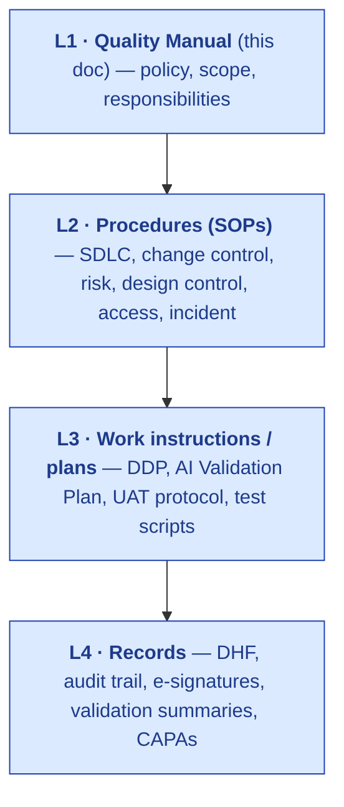
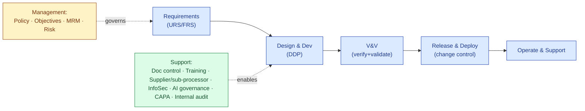
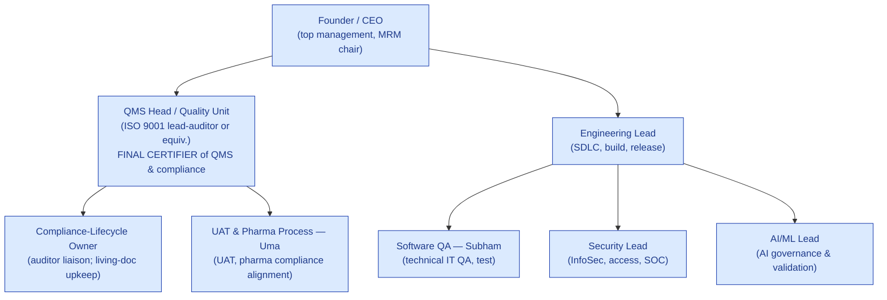

# Quality Manual

## S.M.A.R.T. Hawk Transact Pvt. Ltd. — Quality Management System

> The apex document of the S.M.A.R.T. Hawk Quality Management System (QMS). It states the quality policy, defines the QMS scope and processes, assigns responsibilities, and references the controlled procedures that implement each requirement. Structured to **ISO 9001:2015**, extended to satisfy **ISO 13485 §4.2.2** (for the medical-device vertical), **ICH Q10**, **GAMP 5 / FDA CSA**, **21 CFR Part 11 / 820**, **EU GMP Annex 11**, **SOC 2 / ISO 27001**.

| Field | Value |
|---|---|
| Document number | `HK-QM-v1.0` |
| Record type | `QM` (Document Control module) |
| Owner | **QMS Head (Quality Unit)** — accountable; Founder — sponsor |
| Effective date | 2026-06-14 |
| Review cycle | Annual + on material change to scope, structure, or regulatory landscape |
| Approval | Author (QMS Head) → Reviewer (Founder/CTO) → Approver (Founder/CEO), under Part 11 e-signature |
| Retention | Life of organisation + 10 years |
| Supersedes | None (initial issue) |

---

## 1. Introduction & company overview

S.M.A.R.T. Hawk Transact Pvt. Ltd. designs, develops, validates, delivers and supports the **S.M.A.R.T. Hawk AI-Native EQMS Platform** — software supplied to regulated (GxP) supply chains, pharmaceuticals and medical devices first. As a **software supplier to regulated customers**, our quality system must withstand our customers' supplier-qualification audits and underwrite their computer-system validation. This Quality Manual is the apex of the documentation hierarchy:

## 2. Scope of the QMS

**In scope:** the end-to-end lifecycle of the S.M.A.R.T. Hawk platform — requirements, design & development, build, verification & validation, release, deployment, operation, support, change, and decommissioning — plus the supporting processes (document control, risk management, supplier/sub-processor management, training, internal audit, management review, CAPA, AI governance, information security).

**Justified exclusions / non-applicability:**
- *ISO 9001 §8.3 design & development* — **applicable** (we design software). Not excluded.
- *ISO 9001 §8.5.1 production* — interpreted as software build/release.
- *Physical product preservation (§8.5.4)* — limited applicability (digital artifacts; covered by data-integrity controls).
- *ISO 13485 medical-device clauses* — applied **only** for the medical-device vertical pack; pharma/SaaS scope applies the GAMP/GxP set.

## 3. Normative references

ISO 9001:2015 · ISO 13485:2016 (device vertical) · ISO/IEC 27001:2022 · ISO 14971:2019 · ISO 31000:2018 · IEC 62304 · ISPE GAMP 5 (2nd Ed.) · FDA 21 CFR Part 11 · FDA 21 CFR Part 820 / QMSR · FDA CSA (2025/26) · FDA GMLP (2021) · EU GMP Annex 11 (+ draft Annex 22) · ICH Q9(R1) / Q10 · AICPA SOC 2 Trust Services Criteria.

## 4. Context of the organisation

### 4.1 Internal & external issues
External: regulated-customer audit expectations; evolving AI regulation (CSA/Annex 22); SMB price sensitivity; data-residency law (DPDP/GDPR). Internal: small team, pre-revenue, breadth still maturing — the QMS must be **right-sized** (rigor where it matters, speed elsewhere).

### 4.2 Interested parties & their requirements
| Party | Key requirement |
|---|---|
| Pharma/CDMO customers | ISO 9001 (or equiv.) certified supplier; validatable (GAMP Cat 4); Part 11/Annex 11; auditable AI |
| Regulators (FDA/EMA, via customers) | Design controls; DHF; reproducible AI; data integrity (ALCOA+) |
| Customers' CSV/IT teams | Vendor SDLC evidence; SOC 1/2; security controls |
| Employees | Clear roles, competence, training |
| Sub-processors (cloud, LLM) | Qualification + data-protection agreements |

### 4.3 QMS scope statement
*"The design, development, validation, delivery, and support of the S.M.A.R.T. Hawk AI-native EQMS software for regulated supply chains."*

### 4.4 QMS processes (process map)

## 5. Leadership

### 5.1 Leadership & commitment
Top management (Founder/CEO) is accountable for QMS effectiveness, resources, and the quality policy, and chairs Management Review.

### 5.2 Quality Policy
> **S.M.A.R.T. Hawk is committed to delivering AI-native quality software that is inspector-ready by design.** We build under controlled design and SDLC processes; our AI cites its evidence and a human commits every record; we protect customer data; we comply with applicable GxP, data-integrity, and information-security requirements; and we continually improve our QMS to merit the trust of regulated customers. *Quality is a precondition of release, not a trade-off against it.*

### 5.3 Roles, responsibilities & authorities (the QMS org)

| Role | Key responsibilities | Qualification |
|---|---|---|
| **QMS Head / Quality Unit** | Owns the QMS; **final certifier** of QMS documentation & compliance; chairs internal audits; independent of development | **ISO 9001 lead-auditor or equivalent QM knowledge** (pharma/IT expertise not required) |
| Compliance-Lifecycle Owner | Keeps living documents current with feedback/regulation; **single touchpoint for customer/regulator auditors** | Compliance/regulatory background |
| Engineering Lead | SDLC execution, release management, configuration management | Senior engineering |
| **Software QA (Subham)** | Technical IT QA, test design/execution, CI quality gates | IT QA / SDET |
| **UAT & Pharma Process (Uma)** | UAT protocol & execution, pharma-process compliance alignment | Pharma QA / process |
| Security Lead | InfoSec controls, logical access, SOC 1/2, pentest | Security |
| AI/ML Lead | AI governance, AI Validation Plan, drift monitoring | ML engineering |

> External consultants may **assist** with documentation and certification, but the **QMS Head retains accountability and final sign-off** (continuous oversight, not outsourced).

## 6. Planning

### 6.1 Risk & opportunities
Quality risk is managed per the **Risk Management Plan SOP (ICH Q9 + ISO 31000)**; product/AI risk per **ISO 14971 + the AI Validation Plan**. Risks and opportunities are reviewed at Management Review.

### 6.2 Quality objectives (initial)
| Objective | Target |
|---|---|
| Changes with complete evidence chain | 100% |
| Critical/high SAST findings unresolved at release | 0 |
| AI citation completeness (decision-support outputs) | 100% |
| UAT pass before commercial release | Mandatory |
| Customer audit findings (critical) | 0 |
| QMS doc on-time review | ≥95% |

### 6.3 Planning of changes
Changes to the QMS and the product follow controlled change management (see §8.5 and the SDLC/Change-Control SOPs); the QMS Master Plan sequences QMS build before v1.0 GA.

## 7. Support

### 7.1 Resources
Top management provides people, tooling (Git, CI/CD, Document Control module), and infrastructure (multi-region cloud) sufficient for the QMS.

### 7.2 Competence & 7.3 Awareness
Role-based competence requirements (§5.3); onboarding includes SDLC, security, GxP basics; training records maintained in the Training module.

### 7.4 Communication (internal & external)
| Channel | Internal | External |
|---|---|---|
| Routine | Stand-ups; design reviews; MRM | Release notes; customer notifications (per SLA) |
| Quality events | CAPA notifications; incident reviews | Customer incident & breach notifications (72h) |
| Audits | Internal-audit reports | Auditor liaison via Compliance-Lifecycle Owner |
| Regulatory | Reg-change log → impact assessment | Responses to customer/regulator queries |

### 7.5 Documented information (document control)
All controlled documents are versioned, reviewed, approved (e-signed), distributed with read receipts, and retained per policy in the **Document Control module (HawkVault)**, mirrored in Git. Procedure: Document Control SOP. **Living documents** (DDP, risk assessments, V&V data, AI Validation Plan) are flagged in the living-document register and updated on user feedback/regulatory change.

## 8. Operation

| Clause | Process | Implementing document |
|---|---|---|
| 8.1 Operational planning | Release planning, risk-scaled rigor | SDLC Standard §0, §5.1 |
| 8.2 Requirements | URS/FRS, customer requirements review | SDLC Phase 1; module URS |
| **8.3 Design & development** | Full design controls (planning→inputs→outputs→review→V&V→transfer→changes→DHF) | **DDP (`HK-DDP-v1.0`)** |
| 8.4 Control of external providers | Sub-processor (cloud, LLM) qualification + DPAs; **and the product's own supplier-qualification capability for customers** | Supplier/Sub-processor SOP |
| 8.5 Production & service provision | Build, configuration, release, deployment | **SDLC Standard (`HK-SOP-SDLC`)** |
| 8.5.6 Control of changes | Change control + CAB | SDLC Phase 7/10; Change-Control SOP |
| 8.6 Release of products | Validation sign-off before GA | DDP §11.6; SDLC Phase 8 |
| 8.7 Nonconforming outputs | Defects, incidents, recalls/hotfixes | Incident & CAPA SOPs |

## 9. Performance evaluation

- **9.1 Monitoring & measurement:** quality objectives (§6.2); KPIs in SDLC §10.
- **9.2 Internal audit:** scheduled internal audits of the QMS by the Quality Unit; findings → CAPA.
- **9.3 Management Review:** at least quarterly; inputs = audit results, customer feedback, nonconformities/CAPA, KPI status, risk changes, regulatory changes; outputs = improvement actions, resource decisions. Minutes e-signed (`D-01`).

## 10. Improvement

- **10.2 Nonconformity & CAPA:** managed in the CAPA module per the CAPA SOP (root cause, action, effectiveness).
- **10.3 Continual improvement:** retrospectives, KPI trends, audit findings feed the improvement backlog and MRM.

## 11. QMS documentation architecture (clause → document map)

| Need | Controlled document |
|---|---|
| Apex policy & scope | **This Quality Manual (`HK-QM-v1.0`)** |
| QMS program sequencing | QMS Master Plan |
| SDLC & change/access/operations | [SDLC Standard](../sdlc/SDLC-PROCESS-AND-DOCUMENTATION-STANDARD.md) |
| Design controls | [DDP](../validation/DESIGN-AND-DEVELOPMENT-PLAN.md) |
| AI validation | [AI Validation Plan](../validation/AI-VALIDATION-PLAN.md) |
| Customer-facing design summary | [DCSR](../validation/DESIGN-CONTROL-SUMMARY-REPORT.md) |
| GAMP Cat 4 / Part 11 / controls | [GAMP-CAT-4](../GAMP-CAT-4-COMPLIANCE.md) · [PART-11](../frameworks/PART-11.md) · [PLATFORM-CONTROLS](../platform-controls/PLATFORM-CONTROLS.md) |
| Quality risk management | Risk Management Plan SOP (ICH Q9 + ISO 31000) — *to author* |
| Document/record control | Document Control SOP — *to author* |
| Supplier/sub-processor | Supplier & Sub-processor SOP — *to author* |
| Incident & CAPA | Incident SOP · CAPA SOP — *to author* |

## 12. Revision history
| Version | Date | Author | Reason |
|---|---|---|---|
| 1.0 | 2026-06-14 | QMS Head | Initial issue of the Quality Manual |
