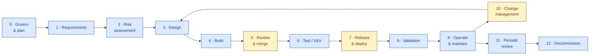
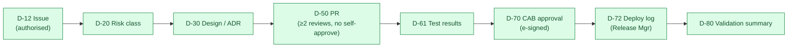

# SDLC Process & Documentation Standard

## S.M.A.R.T. Hawk — Software Development Life Cycle (controlled SOP)

> **Audit-filable standard.** This document defines the controlled Software Development Life Cycle (SDLC) for the S.M.A.R.T. Hawk platform and the documentation produced at every step. It is written to satisfy, simultaneously, **SOX IT General Controls (ITGC)**, **GAMP 5 / FDA Computer Software Assurance (CSA)**, **21 CFR Part 11**, **EU GMP Annex 11**, **SOC 1 (ITGC) & SOC 2 (Trust Services Criteria)**, **ISO/IEC 27001**, **ISO 9001**, **ISO 13485 §7.3 / IEC 62304** (for medical-device customers), and **ICH Q10**.

| Field | Value |
|---|---|
| Document number | `HK-SOP-SDLC-v1.0` |
| Record type | `SOP` (Document Control module) |
| Owner | Engineering Lead (process owner) · Head of QA (Quality Unit, accountable) |
| Effective date | 2026-06-14 |
| Review cycle | Annual, and on any material change to the toolchain, org structure, or regulatory landscape |
| Retention | Life of product + 7 years (SOX) / + 10 years (GxP) — whichever is longer |
| Approval | Captured under Part 11 e-signature in Document Control (Author → Reviewer → QA Head) |
| Supersedes | None (initial issue); extends [GAMP-CAT-4-COMPLIANCE.md §4–§7](../GAMP-CAT-4-COMPLIANCE.md) |

---

## 0. How to read this document

The body defines **twelve lifecycle phases**. The heart of the document is **§6 — the per-step Input → Activity → Control → Output mapping** — which is what an auditor (SOX, SOC, or GxP) will trace. Supporting sections define roles and **segregation of duties** (§4), the **master document register** (§7), the **SOX ITGC control matrix** (§8), and the framework cross-map (§3).

> ⚖️ **A note on "filing for SOX."** A software *vendor* does not file SOX. Three things are true and this SOP serves all three:
> 1. **As a service organisation**, when a public-company (SEC registrant) customer relies on S.M.A.R.T. Hawk for data that flows to financial reporting, that customer's SOX programme relies on our **IT General Controls** — evidenced to them through a **SOC 1 Type II (SSAE 18 / ISAE 3402)** report. This SOP defines those ITGCs.
> 2. **As a future SEC registrant** ourselves, the same ITGCs become part of our own **Internal Control over Financial Reporting (ICFR)** under SOX §404.
> 3. **As a GxP vendor**, the identical lifecycle controls also satisfy GAMP 5 / CSA / Part 11 / Annex 11. *One SDLC, many attestations.*

---

## 1. Purpose

To define a single, controlled, repeatable, and **evidence-producing** SDLC such that every change to the S.M.A.R.T. Hawk platform is **authorised, risk-assessed, designed, built under segregation of duties, tested, independently reviewed, approved, released under change control, operated under monitoring, and traceable end-to-end** — with the documentation set required to pass a SOX ITGC audit, a SOC 1/SOC 2 examination, and a GxP supplier audit without bespoke preparation.

## 2. Scope

**In scope:** all S.M.A.R.T. Hawk product software (backend services, frontend, APIs), platform configuration shipped by the vendor, infrastructure-as-code, database schema/migrations, AI/ML components (prompts, models, gateways), CI/CD pipelines, and the documentation/records produced across the lifecycle.

**Out of scope:** customer-side tenant configuration validation (covered by the customer's own CSV under [GAMP-CAT-4-COMPLIANCE.md](../GAMP-CAT-4-COMPLIANCE.md)); customer infrastructure; end-user SOPs.

---

## 3. Applicable frameworks — what each demands of the SDLC

| Framework | Relevant control area | What it requires from this SDLC |
|---|---|---|
| **SOX ITGC** (COSO-based) | Change Management; Logical Access; Program Development (SDLC); Computer Operations | Authorised, tested, approved, segregated changes; access provisioning + periodic review; documented SDLC methodology; backup/monitoring/incident; **auditable evidence (IPE) for each** |
| **SOC 1 Type II** (SSAE 18) | ITGC for service organisations | The above ITGCs operating effectively over a period, examined by an auditor for customer SOX reliance |
| **SOC 2** (Trust Services Criteria) | CC6 (access), **CC8 (change management)**, CC7 (operations/monitoring), A1 (availability), PI1 (processing integrity) | Same change + access + operations controls, plus security/availability/processing-integrity |
| **GAMP 5 (2nd Ed.)** | Risk-based computerised system validation; V-model; supplier leverage | Risk-scaled requirements → design → V&V → release with traceability; vendor evidence package |
| **FDA CSA (2025/26)** | Risk-based assurance; explicit AI/ML scope | Critical-thinking, risk-based test rigour; AI/ML treated as part of the regulated system |
| **21 CFR Part 11** | Electronic records & signatures | SDLC records that are records are attributable, time-stamped, audit-trailed; approvals e-signed |
| **EU GMP Annex 11** | Computerised systems lifecycle | Validation, change/config management, periodic evaluation, supplier agreements |
| **ISO/IEC 27001:2022** | A.8.25–A.8.34 (secure development, change, separation of environments, test data) | Secure SDLC, environment separation, change control, security testing |
| **ISO 9001:2015** | 8.3 design & development; 8.5.6 control of changes | Planned, reviewed, verified, validated, change-controlled development |
| **ISO 13485 §7.3 / IEC 62304** | Design & development; software lifecycle / safety classes | For med-device customers: design controls + software lifecycle processes |
| **ICH Q10** | Pharmaceutical Quality System | CAPA, change management, management review feeding continual improvement |

> 🔑 **The convergence insight:** SOX Change Management ≈ SOC 2 CC8 ≈ Annex 11 §10 ≈ ISO 27001 A.8.32 ≈ GAMP change control. We implement **one change-control process** and map it to all of them (§8). The same is true for access (SOX Logical Access ≈ SOC 2 CC6 ≈ Annex 11 §12 ≈ Part 11 §11.10(d)).

---

## 4. Roles, responsibilities & segregation of duties (SoD)

### 4.1 RACI

| Activity | Developer | Eng Lead | QA / Test | Security | Release Mgr | Product Owner | QA Head (Quality Unit) |
|---|---|---|---|---|---|---|---|
| Requirements (URS/FRS) | C | C | C | C | I | **R** | A |
| Risk assessment | C | C | C | **R** | I | C | A |
| Design (ADR/DS) | **R** | A | C | C | I | C | I |
| Code | **R** | C | I | C | I | I | I |
| Peer review / approve merge | C | **R** (or peer) | C | C | I | I | I |
| Test / V&V (IQ/OQ) | C | C | **R** | C (sec tests) | I | C | A |
| Change approval (CAB) | I | C | C | C | **R** | C | **A** |
| Deploy to production | I | I | I | I | **R** | I | I |
| Validation summary | C | C | **R** | C | I | C | **A** |
| Access provisioning | I | C | I | **R** | I | I | A |
| Periodic access review | I | C | I | **R** | I | I | **A** |

### 4.2 Segregation-of-duties rules (SOX-critical — tested directly by auditors)

| # | SoD rule | Enforcement |
|---|---|---|
| SoD-1 | **A developer SHALL NOT approve their own change.** | GitHub branch protection: ≥2 reviewers, no self-approval, no self-merge |
| SoD-2 | **The person who develops a change SHALL NOT be the sole person who deploys it to production.** | Deployment restricted to Release Manager role; CI/CD requires approved PR + release record |
| SoD-3 | **Developers SHALL NOT have standing write access to production data or infrastructure.** | Production access via break-glass, time-boxed, logged, approved; no shared accounts |
| SoD-4 | **Access provisioning is requested by manager, approved by QA Head/Security, executed by Security** — three distinct parties. | Access request workflow; quarterly review |
| SoD-5 | **Emergency (break-glass) changes** require post-hoc review and approval within 2 business days. | Emergency change record + retroactive CAB |

---

## 5. The SDLC model

S.M.A.R.T. Hawk runs an **Agile delivery cadence governed by a GAMP V-model and ITGC change controls** — iterative build, but every change passes the same authorised → designed → built-under-SoD → tested → reviewed → approved → released → operated gates. Risk class scales the rigour (CSA / GAMP risk-based assurance).

### 5.1 Change risk classification (drives rigour at every step)

| Class | Definition | Examples | Rigour |
|---|---|---|---|
| **Functional / Major** | New feature, workflow/behaviour change, schema change, AI behaviour change, security-relevant change | New module; e-sig logic change; data-model migration | Full lifecycle; CAB approval; full V&V; customer 30–90 day notice |
| **Standard / Minor** | Bug fix, dependency upgrade, non-breaking enhancement | Fix validation message; library patch | Peer review + targeted tests + standard change approval |
| **Cosmetic** | UI styling, copy, docs, non-functional refactor | Label change; comment | Peer review; smoke test |
| **Emergency** | Urgent production fix / security patch | P1 incident hotfix; zero-day patch | Expedited; **retroactive CAB ≤2 business days**; full evidence |

---

## 6. Per-step process — Input → Activity → Control → Output (the core)

For each phase: the **input documents** consumed, the **activities** performed, the **controls** that make it auditable, the **output documents/records** produced, and the **frameworks** each output satisfies. Output IDs reference the Master Document Register (§7).

### Phase 0 — Governance & Planning
| | |
|---|---|
| **Inputs** | Product roadmap; Vendor Quality Manual (`HK-VQM`); this SOP; regulatory-change log |
| **Activities** | Maintain the QMS; define release calendar; assign roles; resource the lifecycle; management review |
| **Controls** | Documented QMS; named role owners; SoD matrix (§4); annual management review |
| **Outputs** | **D-00** Quality/SDLC plan & release calendar · **D-01** Management Review minutes (e-signed) · RACI register |
| **Frameworks** | SOX (control environment) · SOC 2 CC1 · ISO 9001 §5/§9.3 · ICH Q10 · GAMP governance |

### Phase 1 — Requirements
| | |
|---|---|
| **Inputs** | Customer feedback / complaints; roadmap item; regulatory requirement; **D-00** |
| **Activities** | Author User Requirements (URS) and Functional Requirements (FRS); define acceptance criteria; link to a tracked issue |
| **Controls** | Every requirement has a unique ID + acceptance criteria; reviewed for completeness/non-conflict; traceable to an issue/ticket |
| **Outputs** | **D-10** URS · **D-11** FRS · **D-12** Issue/ticket (system of record) with requirement trace |
| **Frameworks** | GAMP (design input) · CSA (intended use) · ISO 9001 §8.3.3 · 820.30(c)/62304 §5.2 · SOX SDLC (authorisation) |

### Phase 2 — Risk Assessment
| | |
|---|---|
| **Inputs** | **D-10/D-11**; threat model; data-classification; change-risk class (§5.1) |
| **Activities** | Assess patient-safety/data-integrity/product-quality risk (GxP), security risk (STRIDE), **and SOX/financial-reporting impact**; determine test rigour and approval path; classify change |
| **Controls** | Risk assessment recorded and signed off before build; risk class drives V&V depth (CSA); AI components risk-assessed per AI governance |
| **Outputs** | **D-20** Risk Assessment & Change Classification record · updated **D-12** with risk class |
| **Frameworks** | GAMP/CSA (risk-based) · ICH Q9 · ISO 14971 (device) · SOC 2 CC3 · SOX (scoping) · ISO 27001 A.8.25 |

### Phase 3 — Design
| | |
|---|---|
| **Inputs** | **D-11** (FRS); **D-20**; architecture standards; ADR index |
| **Activities** | Produce architectural & detailed design; record significant decisions as ADRs; design security & data-integrity controls; define schema/migration; identify "essential outputs" |
| **Controls** | Design reviewed against requirements (independent reviewer); ADR captured; security-by-design + privacy-by-design checklist |
| **Outputs** | **D-30** Design Specification / module ARCHITECTURE.md · **D-31** ADR(s) · **D-32** Data-model/migration design · **D-33** API contract |
| **Frameworks** | GAMP (design output) · 820.30(d)/62304 §5.3–5.4 · ISO 9001 §8.3.5 · SOC 2 CC8 · ISO 27001 A.8.27 |

### Phase 4 — Build / Implementation
| | |
|---|---|
| **Inputs** | **D-30/D-31/D-32/D-33**; coding standards; secure-coding guidelines |
| **Activities** | Implement on a feature branch; write unit tests; inline documentation; database migration scripts; feature-flag where needed |
| **Controls** | Coding standards (TS strict / JS strict); **signed commits**; branch protection; secrets never committed; environments separated (dev/stage/prod) |
| **Outputs** | **D-40** Source code (versioned, signed commits) · **D-41** Unit tests · **D-42** Migration scripts · inline docs |
| **Frameworks** | 62304 §5.5 · ISO 27001 A.8.28/A.8.31 · SOC 2 CC8 · GAMP build |

### Phase 5 — Code Review & Merge (SoD gate)
| | |
|---|---|
| **Inputs** | **D-40/D-41**; pull request; CI results |
| **Activities** | Peer review (≥2 approvers); automated CI (lint, type-check, unit, integration, **SAST/CodeQL**, dependency/secrets scan); resolve findings |
| **Controls** | **SoD-1 (no self-approval), no self-merge**; CI must pass (quality gate); review comments resolved; PR linked to issue |
| **Outputs** | **D-50** Pull-request record (reviewers, approvals, CI status — immutable, IPE) · **D-51** CI/security-scan reports |
| **Frameworks** | **SOX Change Mgmt (authorisation, SoD)** · SOC 2 CC8.1 · ISO 27001 A.8.32 · Annex 11 §10 |

### Phase 6 — Test / Verification & Validation
| | |
|---|---|
| **Inputs** | Merged change; **D-11** acceptance criteria; **D-20** risk class; IQ/OQ scripts |
| **Activities** | Execute integration + E2E (Playwright); performance tests (where applicable); **DAST**; UAT in staging; **vendor-executed IQ/OQ** in staging per risk class |
| **Controls** | Test cases trace to requirements; pass/fail recorded with evidence; defects logged & retested; coverage thresholds; risk-scaled depth (CSA) |
| **Outputs** | **D-60** Test plan & cases · **D-61** Test execution results / IQ-OQ records · **D-62** Traceability matrix (req → design → test) · **D-63** Defect log |
| **Frameworks** | GAMP/CSA (verification) · 820.30(f)/62304 §5.6–5.7 · SOC 2 PI1 · ISO 9001 §8.3.4 · SOX (testing evidence) |

### Phase 7 — Release & Deployment (change-control gate)
| | |
|---|---|
| **Inputs** | **D-50/D-61/D-62**; release candidate; change-risk class |
| **Activities** | Assemble release; classify (Functional/Standard/Cosmetic/Emergency); **Change Advisory Board (CAB) review & approval**; semantic version tag; publish release notes; deploy via CI/CD by Release Manager; customer notification per SLA |
| **Controls** | **Authorised before deploy (CAB)**; **SoD-2 (developer ≠ sole deployer)**; deployment automated + logged; **rollback plan**; immutable release record |
| **Outputs** | **D-70** Change/Release request & CAB approval (e-signed) · **D-71** Release notes + version tag · **D-72** Deployment log · **D-73** Rollback plan |
| **Frameworks** | **SOX Change Mgmt (approval, migration, SoD)** · SOC 2 CC8.1 · Annex 11 §10 · GAMP release · 62304 §5.8 (release) |

### Phase 8 — Validation (fitness for intended use)
| | |
|---|---|
| **Inputs** | **D-61/D-62**; user needs (**D-10**); production deployment |
| **Activities** | Confirm the release meets user needs/intended use (PQ/UAT outcome); compile validation summary; QA Head sign-off |
| **Controls** | Independent QA approval; residual-risk acceptance; validation summary references all leveraged evidence |
| **Outputs** | **D-80** Validation Summary Report (e-signed) · updated Validation Accelerator Package |
| **Frameworks** | GAMP/CSA (validation) · 820.30(g) · Annex 11 §4 · ISO 9001 §8.3.4 · Part 11 §11.10(a) |

### Phase 9 — Operate & Maintain (Computer Operations)
| | |
|---|---|
| **Inputs** | Live release; monitoring config; backup policy; SLAs |
| **Activities** | Monitor (Sentry/logs/uptime); run backups; restore tests; manage incidents & problems; manage access; patch |
| **Controls** | Automated backups + **periodic restore test**; alerting; incident severity + SLA; **quarterly logical-access review**; privileged-access logging |
| **Outputs** | **D-90** Backup & restore-test logs · **D-91** Incident & problem records · **D-92** Monitoring/uptime evidence · **D-93** Access-review records |
| **Frameworks** | **SOX Computer Operations & Logical Access** · SOC 2 CC6/CC7/A1 · Annex 11 §7/§12/§13 · ISO 27001 A.8.13/A.8.15/A.8.16 |

### Phase 10 — Change Management (the governing loop)
| | |
|---|---|
| **Inputs** | Any proposed change (feature, fix, infra, config, emergency) |
| **Activities** | Raise change request; classify & risk-assess; route through Phases 1–8 at risk-scaled depth; CAB approve; for **emergency**, expedite with retroactive CAB ≤2 days |
| **Controls** | No production change without an approved change record; full traceability request→deploy; emergency-change post-review |
| **Outputs** | **D-100** Change register (all changes, status, approver, evidence links) |
| **Frameworks** | **SOX Change Mgmt** · SOC 2 CC8 · Annex 11 §10 · ISO 9001 §8.5.6 · ICH Q10 §3.2.3 |

### Phase 11 — Periodic Review & Continuous Compliance
| | |
|---|---|
| **Inputs** | Change register; incident log; access reviews; security-test results; prior periodic review |
| **Activities** | Periodic system & process review; confirm validated state; review deviations/CAPAs; SOC examination support; management review |
| **Controls** | Documented periodic evaluation; CAPA for findings; annual external pentest; SOC 1/2 audit cadence |
| **Outputs** | **D-110** Periodic Review report · **D-111** CAPA records · **D-112** SOC 1/SOC 2 report · **D-113** Pentest summary |
| **Frameworks** | Annex 11 §11 · SOC 1/2 · SOX (monitoring) · ISO 27001 §9 · ICH Q10 §3.2.4 |

### Phase 12 — Decommission / Retirement
| | |
|---|---|
| **Inputs** | Retirement decision; data-retention policy |
| **Activities** | Plan decommission; migrate/export data; preserve records per retention; revoke access; certify destruction |
| **Controls** | Approved decommission plan; data export integrity; retention honoured; access revoked |
| **Outputs** | **D-120** Decommission plan & data-disposition certificate |
| **Frameworks** | Annex 11 §17 (archiving) · SOX (records retention) · ISO 27001 A.8.10 · GDPR/DPDP |

---

## 7. Master SDLC Document Register

Every controlled SDLC document/record, its owner, when produced, retention, system of record, whether it requires e-signature, and the frameworks it serves.

| ID | Document / Record | Produced in | Owner | e-sig? | System of record | Retention | Serves |
|---|---|---|---|---|---|---|---|
| D-00 | Quality/SDLC plan & release calendar | P0 | Eng Lead | — | Doc Control | Life+7y | SOX, ISO 9001, GAMP |
| D-01 | Management Review minutes | P0 | QA Head | ✅ | Doc Control | Life+10y | ISO 9001 §9.3, ICH Q10 |
| D-10 | User Requirements (URS) | P1 | Product Owner | ✅ | Doc Control / Git | Life+10y | GAMP, 820.30(c), SOX SDLC |
| D-11 | Functional Requirements (FRS) | P1 | Product/Eng | ✅ | Doc Control / Git | Life+10y | GAMP, CSA |
| D-12 | Issue/ticket (requirement trace) | P1 | Eng Lead | — | Issue tracker | Life+7y | SOX (authorisation), traceability |
| D-20 | Risk Assessment & Change Classification | P2 | Security/QA | ✅ | Doc Control | Life+10y | CSA, ICH Q9, SOX scoping |
| D-30 | Design Specification / ARCHITECTURE | P3 | Architect | ✅ | Git / Doc Control | Life+10y | GAMP, 820.30(d), ISO 27001 |
| D-31 | Architecture Decision Record (ADR) | P3 | Architect | — | Git | Life+7y | GAMP, ISO 9001 |
| D-32 | Data-model / migration design | P3 | Eng | — | Git | Life+7y | SOX (data integrity), GAMP |
| D-33 | API contract | P3 | Eng | — | Git | Life+7y | GAMP, integration |
| D-40 | Source code (signed commits) | P4 | Eng | — (commit-signed) | Git | Life+7y | SOX SDLC, ISO 27001 |
| D-41 | Unit tests | P4 | Eng | — | Git/CI | Life+7y | CSA, SOC 2 PI1 |
| D-42 | Migration scripts | P4 | Eng | — | Git | Life+7y | SOX data integrity |
| D-50 | Pull-request record (reviews/approvals/CI) | P5 | Eng Lead | — (PR-attested) | Git/GitHub | Life+7y | **SOX Change Mgmt, SOC 2 CC8** |
| D-51 | CI / SAST / dependency-scan reports | P5 | Security | — | CI artifact store | Life+7y | SOC 2, ISO 27001, SOX |
| D-60 | Test plan & cases | P6 | QA/Test | ✅ (plan) | Doc Control / CI | Life+10y | GAMP, CSA |
| D-61 | Test results / IQ-OQ records | P6 | QA/Test | ✅ | Doc Control / CI | Life+10y | GAMP, SOX testing evidence |
| D-62 | Traceability matrix | P6 | QA | — | Doc Control | Life+10y | GAMP, SOX, audit |
| D-63 | Defect log | P6 | QA | — | Issue tracker | Life+7y | CSA, ISO 9001 |
| D-70 | Change/Release request & CAB approval | P7 | Release Mgr | ✅ | Change register | Life+7y | **SOX Change Mgmt** |
| D-71 | Release notes + version tag | P7 | Release Mgr | — | Git/RELEASES | Life+7y | Annex 11 §10, SOX |
| D-72 | Deployment log | P7 | Release Mgr | — | CI/CD | Life+7y | **SOX (migration), SoD-2** |
| D-73 | Rollback plan | P7 | Release Mgr | — | Doc Control | Life+7y | SOC 2 A1, SOX ops |
| D-80 | Validation Summary Report | P8 | QA Head | ✅ | Doc Control | Life+10y | GAMP, Part 11 §11.10(a) |
| D-90 | Backup & restore-test logs | P9 | DevOps | — | Ops tooling | Life+7y | **SOX Computer Ops**, SOC 2 A1, Annex 11 §7 |
| D-91 | Incident & problem records | P9 | DevOps/QA | ✅ (closure) | Incident tooling / CAPA | Life+7y | SOC 2 CC7, Annex 11 §13, SOX |
| D-92 | Monitoring / uptime evidence | P9 | DevOps | — | Monitoring | Life+7y | SOC 2 A1, SOX ops |
| D-93 | Access-review records (quarterly) | P9 | Security | ✅ | IAM / Doc Control | Life+7y | **SOX Logical Access**, SOC 2 CC6 |
| D-100 | Change register | P10 | Release Mgr | — | Change tooling | Life+7y | **SOX Change Mgmt**, SOC 2 CC8 |
| D-110 | Periodic Review report | P11 | QA Head | ✅ | Doc Control | Life+10y | Annex 11 §11, SOX monitoring |
| D-111 | CAPA records | P11 | QA | ✅ | CAPA module | Life+10y | ICH Q10, ISO 9001 §10.2 |
| D-112 | SOC 1 / SOC 2 report | P11 | Compliance | — | Compliance repo | Life+7y | **SOX (customer reliance)**, SOC |
| D-113 | External pentest summary | P11 | Security | — | Compliance repo | Life+7y | SOC 2, ISO 27001 |
| D-120 | Decommission plan & data-disposition cert | P12 | Eng Lead | ✅ | Doc Control | Life+10y | Annex 11 §17, SOX retention |

> 📌 **Records vs documents.** Items marked **e-sig ✅** are *records* (Part 11 / SOX evidence) and are approved under electronic signature in the Document Control module with full audit trail. Code/CI artifacts are version-controlled and commit-/PR-attested (Git history is the attributable, time-stamped audit trail).

---

## 8. SOX ITGC control matrix (what a SOX/SOC 1 auditor tests)

Control statements an auditor will sample. Each names the control, owner, frequency, and the **evidence (IPE)** they will request.

### 8.1 Change Management
| Ctrl | Control statement | Owner | Freq | Evidence (IPE) |
|---|---|---|---|---|
| CM-1 | All production changes are requested and **authorised** before development. | Product/Eng Lead | Per change | D-12 issue, D-70 change request |
| CM-2 | Changes are **tested**; results retained. | QA | Per change | D-61 test results, D-51 CI |
| CM-3 | Changes are **independently reviewed and approved** (≥2 approvers; no self-approval). | Eng Lead | Per change | D-50 PR record |
| CM-4 | Changes are **approved by CAB** before production release. | Release Mgr / QA Head | Per release | D-70 CAB approval (e-signed) |
| CM-5 | Migration to production is performed by **authorised personnel only** (SoD-2). | Release Mgr | Per deploy | D-72 deployment log |
| CM-6 | **Emergency changes** follow expedited authorisation with retroactive review ≤2 days. | Release Mgr | Per emergency | D-70 emergency record |
| CM-7 | A **complete change register** is maintained and reconcilable to deployments. | Release Mgr | Continuous | D-100 register vs D-72 logs |

### 8.2 Logical Access
| Ctrl | Control statement | Owner | Freq | Evidence |
|---|---|---|---|---|
| LA-1 | Access is **provisioned via approved request** (requester ≠ approver ≠ executor — SoD-4). | Security | Per grant | Access request workflow |
| LA-2 | Access is **de-provisioned** promptly on role change/termination. | Security/HR | Per event | Termination checklist, IAM logs |
| LA-3 | **Privileged/production access** is restricted, time-boxed, logged (SoD-3, break-glass). | Security | Continuous | Privileged-access logs |
| LA-4 | **Periodic (quarterly) access reviews** are performed and remediated. | Security / QA Head | Quarterly | D-93 access-review records |
| LA-5 | **Authentication** enforced (password policy; MFA — *Q3 2026*; SSO — *Q1 2027*). | Security | Continuous | IAM config, MFA rollout record |
| LA-6 | **No shared/generic accounts** for privileged functions. | Security | Continuous | IAM account inventory |

### 8.3 Program Development (SDLC)
| Ctrl | Control statement | Owner | Freq | Evidence |
|---|---|---|---|---|
| PD-1 | New systems/major changes follow this **documented SDLC**. | Eng Lead | Per project | This SOP + D-10..D-80 |
| PD-2 | Requirements, design, test are **documented and traceable**. | QA | Per project | D-62 traceability matrix |
| PD-3 | **Environments are separated** (dev/stage/prod); prod data not used in lower envs without controls. | DevOps | Continuous | Infra config, env policy |
| PD-4 | Go-live is **approved** by QA/business. | QA Head | Per release | D-80 validation summary |

### 8.4 Computer Operations
| Ctrl | Control statement | Owner | Freq | Evidence |
|---|---|---|---|---|
| CO-1 | **Backups** run on schedule; **restores tested** periodically. | DevOps | Daily / periodic | D-90 backup & restore logs |
| CO-2 | **Incidents** are logged, triaged by severity, resolved per SLA, root-caused. | DevOps/QA | Per incident | D-91 incident records |
| CO-3 | **Monitoring/alerting** covers availability and integrity. | DevOps | Continuous | D-92 monitoring evidence |
| CO-4 | **Jobs/migrations** are scheduled, monitored, and failures handled. | DevOps | Per run | Job logs |

> 🧭 **Cross-attestation:** every control above simultaneously evidences **SOC 2** (CC6/CC7/CC8/A1), **EU Annex 11** (§7/§10/§11/§12/§13), and **GAMP/CSA**. Map maintained in [PLATFORM-CONTROLS.md](../platform-controls/PLATFORM-CONTROLS.md).

---

## 9. Auditor evidence walkthrough (how to respond to a request)

When a SOX/SOC/GxP auditor selects a sample change, produce this **evidence chain end-to-end** — it is pre-assembled because the SDLC produces it natively:

For **access**, produce D-93 (quarterly review) + IAM provisioning/de-provisioning for the sampled user. For **operations**, produce D-90/D-91/D-92 for the sampled period. **Sampling readiness** is the design goal: any sample resolves to a complete, attributable, time-stamped trail.

---

## 10. Continuous compliance & metrics

| Metric | Target | Why |
|---|---|---|
| Changes with complete evidence chain | 100% | SOX CM-1..CM-7 |
| PRs merged without ≥2 approvals | 0 | SoD-1 |
| Production deploys by non-Release-Manager | 0 | SoD-2 |
| Quarterly access reviews completed on time | 100% | LA-4 |
| Backup restore tests passed (quarterly) | 100% | CO-1 |
| Emergency changes with retroactive CAB ≤2 days | 100% | CM-6 |
| Critical/high SAST findings unresolved at release | 0 | ISO 27001, SOC 2 |

---

## 11. Current-state honesty (so an auditor finds no surprises)

Per [PLATFORM-CONTROLS.md](../platform-controls/PLATFORM-CONTROLS.md) and [PROJECT-STATE.md](../../PROJECT-STATE.md), two items are on a near-term hardening path and must be **disclosed proactively** in any examination:
- **E-signature defaults to soft-mode** today; hard-mode default — **Q3 2026**.
- **MFA/SSO** not yet shipped — **Q3 2026 / Q1 2027**.
- **SOC 2 Type I** targeted **Q3 2026**, **Type II Q1 2027**; **SOC 1** to be scoped where customers require SOX reliance.
- **Annual restore-test cadence (CO-1)** and **per-tenant validation kit (C6)** completing **Q4 2026**.

Compensating controls (branch protection, audit trail, RBAC, backups) are live in the interim.

---

## 12. Revision history

| Version | Date | Author | Reviewer | Reason |
|---|---|---|---|---|
| 1.0 | 2026-06-14 | Engineering + Compliance | QA Head | Initial issue — controlled SDLC for SOX/SOC/GxP filing |

---

## See also
- [GAMP-CAT-4-COMPLIANCE.md](../GAMP-CAT-4-COMPLIANCE.md) — vendor SDLC overview, validation package, V-model
- [PLATFORM-CONTROLS.md](../platform-controls/PLATFORM-CONTROLS.md) — C1–C15 control catalogue (cross-framework)
- [PART-11.md](../frameworks/PART-11.md) — 21 CFR Part 11 conformance
- [DESIGN-AND-DEVELOPMENT-PLAN.md](../validation/DESIGN-AND-DEVELOPMENT-PLAN.md) — product design controls (820.30 / IEC 62304)
- [SECURITY.md](../../04-engineering/06-security/SECURITY.md) — access, RBAC, e-signature, environment controls
- [INFRASTRUCTURE.md](../../04-engineering/05-infrastructure/INFRASTRUCTURE.md) — environments, deployment, backups
