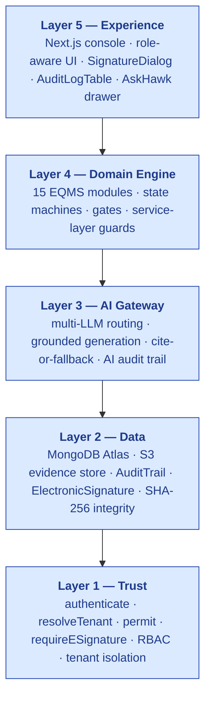
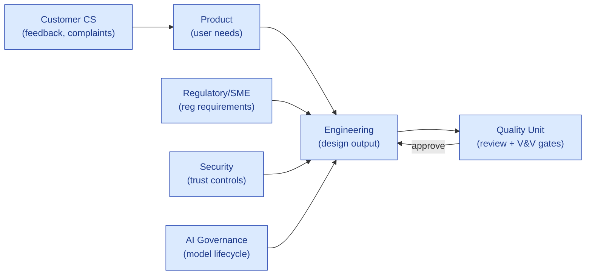
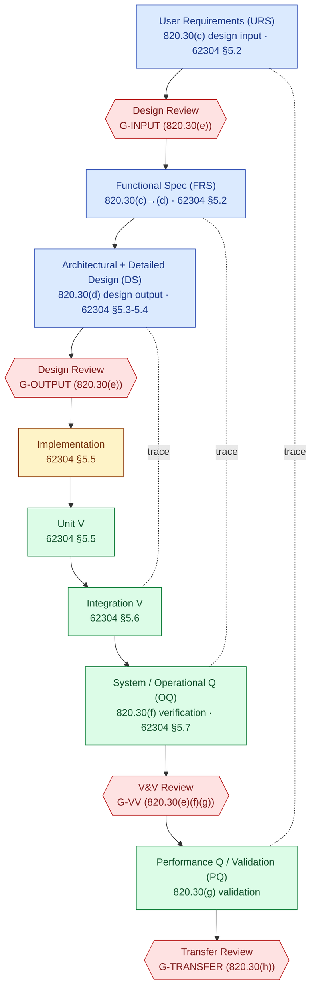
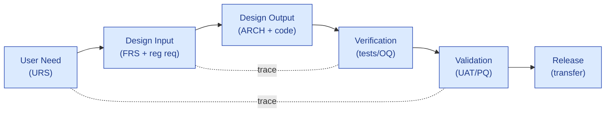

# Design & Development Plan (DDP)

## S.M.A.R.T. Hawk AI-Native EQMS Platform

---

> **Prepared for**
> The QA Director, Validation Lead, IT Compliance Lead, Regulatory Affairs Lead, and Supplier-Qualification team of any customer evaluating or deploying S.M.A.R.T. Hawk.
>
> **Prepared by**
> S.M.A.R.T. Hawk Transact Pvt. Ltd. — Platform Engineering & Quality / Regulatory Compliance, authored jointly by the Principal Software Architect (AI engineering) and the Pharma Quality Subject-Matter Expert (SME).
>
> **Document reference:** `HK-DDP-v1.0`
> **Issued:** 2026-06-13
> **Status:** Canonical — this is the authoritative Design & Development Plan for the S.M.A.R.T. Hawk platform as a GAMP 5 Category 4 configured software product.
> **Classification:** Confidential — for the sole use of the addressee under NDA.

---

## How to read this document

This Design & Development Plan (DDP) is the **master planning artifact** that governs how the S.M.A.R.T. Hawk platform is designed, developed, verified, validated, transferred to operations, and changed under control. It is written to satisfy **two audiences simultaneously**:

1. **S.M.A.R.T. Hawk's own design controls** — S.M.A.R.T. Hawk is a software product built under a design-controlled, GAMP-aligned SDLC. This DDP *is* the §820.30(b) / ISO 13485 §7.3.2 design-and-development plan for the product.
2. **The customer's supplier-qualification and CSV teams** — pharma and medical-device customers procuring S.M.A.R.T. Hawk need vendor evidence that the product is designed under recognised design controls. This DDP is delivered as part of the **Validation Accelerator Package** (see [GAMP-CAT-4-COMPLIANCE.md §9](../GAMP-CAT-4-COMPLIANCE.md)).

> 💡 **Format note.** This plan follows the canonical pharma **Design & Development Plan** structure (Approval → Project Overview → Product Overview → Objectives → Scope → References → Constraints → Deliverables → Revision History), and **elevates it for a GAMP Category 4 software product** by mapping every section to FDA 21 CFR 820.30 (Design Controls), the 2026 QMSR / ISO 13485 §7.3, IEC 62304 (medical-device software lifecycle), ISO 14971 (risk management), IEC 62366-1 (usability engineering), 21 CFR Part 11 (electronic records/signatures), EU GMP Annex 11, EU MDR 2017/745, and ISPE GAMP 5 (2nd Ed., 2022).

---

## 1.0 APPROVAL

This Design & Development Plan is not effective until reviewed and approved by all functions below. Approval is captured under **21 CFR Part 11–grade electronic signature** in the S.M.A.R.T. Hawk Document Control module (record type `DDP`, document number `HK-DDP-v1.0`); wet-ink signatures below are reproduced for offline review only.

| Function | Department | Name / Role | Responsibility on this plan | Signature | Date |
|---|---|---|---|---|---|
| **Prepared by** | Platform Engineering | Principal Software Architect | Authors lifecycle, architecture, V&V strategy, Part 11 design | _e-sig_ | _e-sig_ |
| **Prepared by** | Quality / Regulatory | Pharma Quality SME | Authors regulatory mapping, design-control conformance, risk strategy | _e-sig_ | _e-sig_ |
| **Reviewed by** | Product & Platform Development | Head of Product | Confirms scope, deliverables, milestones | _e-sig_ | _e-sig_ |
| **Reviewed by** | Engineering | Engineering Lead | Confirms SDLC, configuration management, technical feasibility | _e-sig_ | _e-sig_ |
| **Reviewed by** | Security & DevOps | Security Lead | Confirms Layer-1 trust controls, infrastructure qualification | _e-sig_ | _e-sig_ |
| **Reviewed by** | AI Governance | AI/ML Engineering Lead | Confirms Layer-3 AI lifecycle, grounding, AI audit trail | _e-sig_ | _e-sig_ |
| **Approved by** | Quality Assurance | Head of QA (Quality Unit) | Final approval; authorises plan as effective | _e-sig_ | _e-sig_ |

**Approval rule (design-control gate G-PLAN):** transition of this plan from `IN_REVIEW` → `EFFECTIVE` is blocked by `documentLifecycleService` until every reviewer + the approver signature is captured (Part 11 §11.10(j); §820.30(b) requires the plan to be reviewed, updated, and approved as design evolves).

---

## 2.0 DOCUMENT CONTROL

| Field | Value |
|---|---|
| Document number | `HK-DDP-v1.0` |
| Record type | `DDP` (Document Control module) |
| Owner | Head of QA (Quality Unit) — accountable; Platform Engineering — responsible |
| Review cycle | Annual, and on any material change to product architecture, the regulatory landscape, or the GAMP classification |
| Retention | Life of product + 10 years (configurable; ≥ retention of the longest-lived record the product manages) |
| Storage | S.M.A.R.T. Hawk Document Control (HawkVault), S3-backed, SHA-256 integrity-hashed; mirrored in Git (`Doc_V2`) |
| Distribution | Controlled — internal design team + customers under NDA; read receipts tracked |
| Supersedes | None (initial issue) |

This DDP is itself a **controlled document of external origin to the customer** and an **internal controlled document to S.M.A.R.T. Hawk** — it is managed under the same controls it describes (eat-your-own-dogfood: the plan lives in the product's own Document Control module).

---

## 3.0 PROJECT OVERVIEW

S.M.A.R.T. Hawk Transact Pvt. Ltd. designs and develops the **S.M.A.R.T. Hawk AI-Native EQMS Platform** — an industry-agnostic, AI-native electronic quality management system for regulated supply chains, with pharmaceuticals and medical devices as the forcing-function verticals. As a software manufacturer supplying GxP-impacting computerized systems, S.M.A.R.T. Hawk maintains **established design and development plans that describe and reference the design and development activities and define responsibility for implementation**, and that **identify and describe the interfaces** between the engineering, quality, security, AI-governance, regulatory, and customer-success groups that provide input to, or receive output from, the design process. These plans are **reviewed, updated, and approved as design and development evolves** (per §820.30(b) and ISO 13485 §7.3.2).

This DDP governs the platform as a whole and is the parent of the per-module design-control records (each EQMS module has a URS, ARCHITECTURE, and DESIGN document; see `06-modules/`). It is harmonised with:

- **[GAMP-CAT-4-COMPLIANCE.md](../GAMP-CAT-4-COMPLIANCE.md)** — the GAMP 5 Category 4 classification and the V-model validation responsibility split with the customer.
- **[PART-11.md](../frameworks/PART-11.md)** — the clause-by-clause 21 CFR Part 11 conformance matrix.
- **[PLATFORM-CONTROLS.md](../platform-controls/PLATFORM-CONTROLS.md)** — the C1–C15 control catalogue that implements the regulatory requirements this plan commits to.

### 3.1 Why a Design & Development Plan (not just an SDLC doc)

A conventional SDLC document describes *how engineers build software*. A **Design & Development Plan** is a quality-system instrument that additionally:

- Establishes **design inputs traceable to user needs and regulatory requirements** (820.30(c)).
- Mandates **formal, documented design reviews** at defined stages with an **independent reviewer** (820.30(e)).
- Separates **verification** ("did we build the product right?" — outputs meet inputs) from **validation** ("did we build the right product?" — product meets user needs and intended use) (820.30(f),(g)).
- Controls **design transfer** to operations and **design changes** post-release (820.30(h),(i)).
- Maintains a **Design History File (DHF)** as objective evidence the plan was followed (820.30(j)).

This DDP imposes all of the above on S.M.A.R.T. Hawk's own product development — which is precisely the evidence a customer's GAMP Cat 4 supplier-leverage relies on.

---

## 4.0 PRODUCT OVERVIEW

### 4.1 What S.M.A.R.T. Hawk is

The S.M.A.R.T. Hawk platform is a **multi-tenant, cloud-delivered (with sovereign-deployment option), AI-native EQMS**. It is a **GAMP 5 Category 4 configured product**: a common code base supplied to all customers, tailored per tenant through built-in configuration tools (vocabulary, standards registry, workflow definitions, RBAC, templates, AI prompt templates) **without source-code modification** (full classification basis in [GAMP-CAT-4-COMPLIANCE.md §1](../GAMP-CAT-4-COMPLIANCE.md)).

### 4.2 Five-layer reference architecture

### 4.3 Module inventory (15 default EQMS modules)

Audit Management · Document Control · CAPA · Change Control · Deviation & Event · Training · Risk Management · Supplier Quality / Prequalification · Management Review · Equipment / Asset Management · Complaint Management · Batch Records · **Design Control (medical-device vertical pack)** · Marketplace / RFQ & Procurement · AskHawk (regulatory intelligence assistant).

### 4.4 Compliance spine (the reusable controls)

The platform satisfies many regulators with a small set of unified controls (full catalogue in [PLATFORM-CONTROLS.md](../platform-controls/PLATFORM-CONTROLS.md)):

| Control | Implementation anchor | Primary regulatory driver |
|---|---|---|
| C1 Audit Trail (immutable, cross-module) | `AuditTrail` + `auditTrailService.writeAuditTrail()` | Part 11 §11.10(e); Annex 11 §9; ALCOA+ |
| C2 Electronic Signature | `ElectronicSignature` + `requireESignature` | Part 11 §11.50/70/100/200; Annex 11 §14 |
| C3 State Machine (forward-only + gates) | `auditPhaseService.canTransition()` / per-module phase service | Part 11 §11.10(f); ICH Q7 §13 |
| C4 RBAC + Tenant Isolation (4-layer middleware) | `authenticate` + `resolveTenant` + `permit` | Part 11 §11.10(d)(g)(h); Annex 11 §12 |
| C5 Document Control | Document Control module | Annex 11 §10; ISO 13485 §4.2.4; §820.40-Reserved → ISO 13485 §4.2.3 |
| C6 Validation Package | per-tenant IQ/OQ/PQ + templates | Part 11 §11.10(a); Annex 11 §4; GAMP 5 |
| C15 AI Decision Audit Trail | `recordAiDecision()` extends `AuditTrail` | Pre-emptive AI governance (GMLP, EMA AI reflection, Annex 22 draft) |

### 4.5 Technology baseline (qualified components)

| Component | Technology | Qualification basis |
|---|---|---|
| Backend services | Node.js / Express (JS strict mode) | S.M.A.R.T. Hawk SDLC; SAST (CodeQL), dependency scanning |
| Frontend console | Next.js / React (TypeScript strict) | S.M.A.R.T. Hawk SDLC; E2E (Playwright) |
| Primary datastore | MongoDB Atlas | Vendor-qualified hyperscaler; PITR backups |
| Evidence/object store | S3-compatible (lifecycle + versioning) | Hyperscaler-qualified; SHA-256 integrity |
| AI inference | Multi-LLM via AI Gateway (default: Anthropic Claude — most-capable model class) | Layer-3 AI governance; grounding + cite-or-fallback; AI audit trail |
| Transport / crypto | TLS 1.3 in transit; AES-256 at rest | Security policy; closed-system posture (Part 11 §11.30) |

---

## 5.0 PROJECT OBJECTIVES

The objectives of the design and development effort governed by this plan are to deliver a product that:

1. **Meets user needs and the applicable regulatory standard** for an EQMS used in GxP-regulated supply chains — with respect to **quality, safety, data integrity, and intended use** — at GAMP 5 Category 4 conformance.
2. **Is designed under recognised design controls** (21 CFR 820.30 / ISO 13485 §7.3 / IEC 62304) such that the Design History File provides objective evidence of conformance to a customer's auditor.
3. **Is 21 CFR Part 11 and EU GMP Annex 11 compliant by design** — every electronic record is attributable, time-stamped, audit-trailed, and (where it bears a decision) electronically signed, with the design records themselves managed under the same controls.
4. **Is data-integrity sound by design** — ALCOA+ attributes are designed-in, not bolted on (cross-cuts C1+C2+C4+C5).
5. **Carries customer-side validation effort to ~30–40% of a bespoke build** by supplying pre-executed vendor evidence (this DDP, the FRS, IQ/OQ scripts, traceability) under the GAMP 5 supplier-leverage clause and FDA CSA's risk-based assurance.
6. **Governs AI as a Category-4 configuration element** — AI augments human decisions but never makes an unattributable or ungrounded GxP decision; every AI invocation is logged with model version, prompt hash, retrieval set, confidence, and human disposition.
7. **Is accepted by a customer's QA / CSV / supplier-qualification team on first pass** — i.e., the deliverables of this plan are sufficient evidence for supplier qualification without source-code review (a Cat 5 obligation S.M.A.R.T. Hawk is explicitly not subject to).

---

## 6.0 SCOPE

### 6.1 In scope

- The S.M.A.R.T. Hawk SaaS platform across all five architectural layers (Trust · Data · AI Gateway · Domain Engine · Experience).
- All 15 default EQMS modules and their per-module design-control records.
- The end-to-end design-and-development lifecycle: planning → design input → architectural & detailed design → implementation → verification → validation → transfer → change control → DHF maintenance.
- The Part 11 / Annex 11 / ALCOA+ controls that the design must implement.
- Layer-3 AI capabilities as a Category-4 configuration element (AI lifecycle, grounding, AI audit trail).
- Vendor-side validation (product level) and the templates that enable customer-side configuration validation.

### 6.2 Out of scope (handed off / customer-owned)

| Out of scope | Owner / handoff |
|---|---|
| Customer infrastructure and non-S.M.A.R.T. Hawk systems | Customer IT |
| Customer-specific configuration validation (config-specific OQ/PQ) | Customer Validation Lead (templates provided) |
| Workflows the customer builds outside S.M.A.R.T. Hawk's configuration surface (would be Cat 5) | Customer; scoped separately by S.M.A.R.T. Hawk Engineering |
| Hardware / hyperscaler infrastructure qualification | Cloud provider (qualified by hyperscaler) |
| Customer-side staff training and SOP authoring | Customer (Training module + materials provided) |
| Clinical evaluation / PMS for the customer's own device | Customer (Design Control module supports the DHF) |

---

## 7.0 DEFINITIONS & ABBREVIATIONS

| Term | Definition |
|---|---|
| **DDP** | Design & Development Plan (this document) |
| **DHF** | Design History File — the compilation of records describing the design history of a finished design (820.30(j)) |
| **DMR / DHR** | Device Master Record / Device History Record (customer-device concepts the platform supports) |
| **URS / FRS / DS** | User Requirements / Functional Requirements / Design Specification |
| **IQ / OQ / PQ** | Installation / Operational / Performance Qualification |
| **CSV / CSA** | Computer System Validation / Computer Software Assurance (FDA's 2022 risk-based successor framing) |
| **GAMP** | ISPE Good Automated Manufacturing Practice (GAMP 5, 2nd Ed., 2022) |
| **ALCOA+** | Attributable, Legible, Contemporaneous, Original, Accurate + Complete, Consistent, Enduring, Available |
| **SOUP** | Software of Unknown Provenance (IEC 62304 term for third-party components) |
| **V&V** | Verification & Validation |
| **RMP / RMR** | Risk Management Plan / Risk Management Report (ISO 14971) |
| **QMSR** | FDA Quality Management System Regulation (2026 harmonisation of 21 CFR 820 with ISO 13485) |
| **SME** | Subject-Matter Expert |

---

## 8.0 REFERENCES

### 8.1 Internal SOPs / controlled documents

| Document Title | Reference |
|---|---|
| Vendor Quality Manual | `HK-VQM` (under NDA) |
| Procedure for Software Development Lifecycle (SDLC) | `HK-SOP-SDLC` |
| Procedure for Configuration & Release Management | `HK-SOP-CRM` |
| Procedure for Change Control | `HK-SOP-CC` |
| Procedure for Incident & Deviation Management | `HK-SOP-INC` |
| Procedure for CAPA Management | `HK-SOP-CAPA` |
| Procedure for Quality Risk Management | `HK-SOP-QRM` |
| Procedure for Design Control | `HK-SOP-DC` |
| Procedure for Computer System Validation | `HK-SOP-CSV` |
| Procedure for AI Governance & Model Lifecycle | `HK-SOP-AI` |
| Procedure for Data Integrity (ALCOA+) | `HK-SOP-DI` |
| GAMP 5 Category 4 Compliance Reference | [`HK-GAMP-CAT4-v1.0`](../GAMP-CAT-4-COMPLIANCE.md) |
| 21 CFR Part 11 Conformance Matrix | [`PART-11.md`](../frameworks/PART-11.md) |
| Platform Controls (C1–C15) | [`PLATFORM-CONTROLS.md`](../platform-controls/PLATFORM-CONTROLS.md) |

### 8.2 External guidance documents / regulatory standards

| Document Title | Reference |
|---|---|
| Quality System Regulation / Quality Management System Regulation (Design Controls §820.30) | **FDA 21 CFR Part 820** (QMSR, eff. 2 Feb 2026) |
| Electronic Records; Electronic Signatures | **FDA 21 CFR Part 11** |
| Medical devices — Quality management systems — Requirements for regulatory purposes | **ISO 13485:2016** (§7.3 Design & development; §4.2.3 Control of documents) |
| Medical devices — Application of risk management to medical devices | **ISO 14971:2019** |
| Medical device software — Software life cycle processes | **IEC 62304:2006/AMD1:2015** |
| Health software — General requirements for product safety | **IEC 82304-1:2016** |
| Medical devices — Application of usability engineering to medical devices | **IEC 62366-1:2015/AMD1:2020** |
| GAMP 5: A Risk-Based Approach to Compliant GxP Computerized Systems | **ISPE GAMP 5, 2nd Ed. (2022)** |
| Computer Software Assurance for Production and Quality System Software | **FDA CSA Guidance (2022)** |
| Computerised Systems | **EU GMP Annex 11** (and 2025 draft revision) |
| Artificial Intelligence (companion to Annex 11) | **EU GMP Annex 22 (draft)** |
| Medical Device Regulation | **EU MDR 2017/745** (Annex I GSPR; Annex II/III technical documentation) |
| Good Practices for Data Management and Integrity | **PIC/S PI 041-1** |
| GxP Data Integrity Definitions and Guidance | **MHRA (2018)** / **WHO TRS 1033 Annex 4 (2021)** |
| Quality Risk Management / Pharmaceutical Quality System | **ICH Q9(R1)** / **ICH Q10** |
| Good Machine Learning Practice for Medical Device Development | **FDA/Health Canada/MHRA GMLP (2021)** |
| Information security management systems | **ISO/IEC 27001** |

> 📌 **Note on the QMSR transition.** Under the 2026 QMSR, FDA incorporates ISO 13485 by reference. **§820.30 Design Controls is preserved** (FDA retained design-control specifics), while **§820.40 Document Controls is `[Reserved]`** because document control now flows from **ISO 13485 §4.2.3**. This plan maps to both the 820.30 clause structure and the ISO 13485 §7.3 structure so it remains valid pre- and post-transition.

---

## 9.0 ROLES, RESPONSIBILITIES & INTERFACES

### 9.1 Design team (S.M.A.R.T. Hawk)

| Role | Functional area | Responsibility | Design-control authority |
|---|---|---|---|
| **Head of QA (Quality Unit)** | Quality | Final approver of this plan, design reviews, V&V, transfer | Accountable; independent of development |
| **Principal Software Architect** | Engineering | Architecture, design outputs, V&V strategy, Part 11 design | Responsible for design output |
| **Pharma Quality SME** | Quality/Regulatory | Regulatory mapping, design input adequacy, risk strategy | Consulted; design-input gatekeeper |
| **Head of Product** | Product | User needs / URS, scope, milestones | Responsible for design input (user needs) |
| **Engineering Lead** | Engineering | SDLC execution, code review, unit/integration testing | Responsible for implementation + verification |
| **Security Lead** | Security/DevOps | Layer-1 controls, infra qualification, security testing | Responsible for security verification |
| **AI/ML Engineering Lead** | AI Governance | Layer-3 AI lifecycle, grounding, AI audit trail | Responsible for AI design + AI validation |
| **QA Design Reviewer** | Quality | **Independent** reviewer at each design-review gate | Independent reviewer (820.30(e)) |
| **Release Manager** | Engineering | Design transfer, release sign-off | Responsible for transfer |

### 9.2 Interfaces (groups that provide input to / receive output from design)

### 9.3 RACI (summary; full matrix in [GAMP-CAT-4-COMPLIANCE.md §8](../GAMP-CAT-4-COMPLIANCE.md))

| Deliverable | Architect | SME | Product | Eng Lead | QA Head |
|---|---|---|---|---|---|
| This DDP | R | R | C | C | **A** |
| Design Input (URS/regulatory) | C | R | R | C | A |
| Design Output (architecture, FRS, code) | **R** | C | C | R | A |
| Design Review (each gate) | C | C | C | C | **A** (independent reviewer) |
| Verification (V) | R | C | I | **R** | A |
| Validation (V) | C | **R** | C | C | A |
| Design Transfer | C | C | I | R | **A** |
| Risk Management (RMP/RMR) | C | **R** | C | C | A |

---

## 10.0 DESIGN & DEVELOPMENT LIFECYCLE

### 10.1 The unified lifecycle model

S.M.A.R.T. Hawk runs a **GAMP 5 V-model** for the product, overlaid with the **IEC 62304 software lifecycle** and gated by **21 CFR 820.30 design-control stages**. The three frameworks reconcile cleanly:

### 10.2 IEC 62304 software safety classification

Per IEC 62304 §4.3, software items are classified by the severity of harm a failure could cause. Because S.M.A.R.T. Hawk is an EQMS that records and gates GxP decisions (but is not itself a patient-contacting/therapeutic device), the platform is classified at the **system level as Class B** (non-serious injury possible if a quality decision is wrongly recorded/gated), with **safety-relevant items (audit trail integrity, e-signature binding, access control, AI grounding) treated to Class C rigour** as a conservative measure. Class is reviewed per release and per the customer's intended use (a customer using S.M.A.R.T. Hawk's Design Control module for a Class III device's DHF inherits stricter expectations, addressed via configuration + the customer's own validation).

### 10.3 Mapping of 820.30 stages to S.M.A.R.T. Hawk execution

| §820.30 | ISO 13485 §7.3 | IEC 62304 | S.M.A.R.T. Hawk execution | Gate |
|---|---|---|---|---|
| (b) Planning | 7.3.2 | §5.1 | This DDP + per-release plan | G-PLAN |
| (c) Design input | 7.3.3 | §5.2 | URS per module + regulatory requirements register | G-INPUT |
| (d) Design output | 7.3.4 | §5.3–5.5 | ARCHITECTURE.md + FRS + code + config schema | G-OUTPUT |
| (e) Design review | 7.3.5 | (cross) | Documented review with independent QA reviewer + e-sig | every gate |
| (f) Verification | 7.3.6 | §5.5–5.7 | Unit + integration + system tests; OQ scripts; traceability | G-VV |
| (g) Validation | 7.3.7 | (system) | PQ / UAT against user needs + intended use | G-VV |
| (h) Transfer | 7.3.8 | §5.8 | Release procedure; staging IQ/OQ; production deploy | G-TRANSFER |
| (i) Changes | 7.3.9 | §6, §8 | Change Control module + release classification | G-CHANGE |
| (j) DHF | 7.3.10 | (records) | Git history + Document Control + audit trail = the DHF | continuous |

---

## 11.0 PROJECT DELIVERABLES

The deliverables below are the **milestone artifacts** of this plan, mirroring the canonical pharma D&D Plan deliverable spine (Project plan → Design control plan → Life cycle plan → Regulatory strategy/usability → Risk management → QA plan → Design review plan), translated to a GAMP Cat 4 software product.

### 11.1 Deliverable 1 — Project plan
| Section | Artifact |
|---|---|
| Design & development plan | **This document (`HK-DDP-v1.0`)** + per-release mini-plan in the release record |

### 11.2 Deliverable 2 — Design control plan (820.30(c)(d))

| Section | Artifact | Where |
|---|---|---|
| **User needs / requirements** | Per-module URS (user needs, personas, intended use, regulatory anchors) | `06-modules/*/URS.md`; `03-product/02-urs/` |
| **Design input** | Functional requirements + regulatory requirements register + acceptance criteria | URS "Functional/Reg" sections; `04-engineering/03-api-contracts/` |
| **Design output** | Architecture, data model, API contracts, configuration schema, source code | `04-engineering/01-architecture/`, `02-data-model/`, `06-modules/*/ARCHITECTURE.md` |

**Design input adequacy rules (820.30(c)):** inputs must be (1) appropriate to intended use, (2) address user needs, (3) be complete/unambiguous/non-conflicting, (4) include applicable regulatory requirements, and (5) state acceptance criteria. Incomplete or conflicting inputs are resolved before G-INPUT sign-off; the resolution is recorded in the audit trail.

**Design output rules (820.30(d)):** outputs must (1) meet design inputs, (2) contain/reference acceptance criteria, (3) identify which outputs are essential to safe/proper functioning (here: audit-trail integrity, e-sig binding, access control, AI grounding — flagged `essentialOutput=true`), and (4) be reviewed and approved before release.

### 11.3 Deliverable 3 — Life cycle plan (820.30(i); ISO 13485 §7.3.9)

| Section | Artifact |
|---|---|
| **Product/R&D changes** | Change Control module records; release classification (functional/security/cosmetic) per [GAMP §4.3](../GAMP-CAT-4-COMPLIANCE.md) |
| **Feedback from field / customer studies** | Complaint Management + Customer Success feedback → roadmap intake |
| **Recalls / customer complaints** | Complaint module → CAPA linkage → design-change assessment |
| **Operations inputs** | DevOps incident telemetry, SLA performance, periodic evaluation (Annex 11 §11) |
| **Decommissioning / data migration & retention** | Retention policy config; export (JSON/CSV/PDF) for portability |

### 11.4 Deliverable 4 — Regulatory strategy & usability engineering plan

| Section | Artifact |
|---|---|
| **Classification & validation strategy** | GAMP 5 Category 4 classification statement; IEC 62304 Class B/C rationale (§10.2) |
| **Regulatory strategy** | Cross-standard mapping (Part 11 · Annex 11 · ALCOA+ · CSA · ICH Q9/Q10 · ISO 13485) in [GAMP-CAT-4-COMPLIANCE.md Part 6](../GAMP-CAT-4-COMPLIANCE.md) |
| **Usability / Human-Factors engineering (IEC 62366-1)** | Use specification, UI specification, formative + summative usability evaluation; accessibility (WCAG AA) per `05-design/accessibility/` |

**Usability engineering plan (IEC 62366-1):** identify use scenarios and **use-related hazards** (e.g., a user signs the wrong record, mis-reads a gate status, accepts an AI suggestion without review). Mitigations are designed into the UI (SignatureDialog confirms record identity + meaning + reason; AI suggestions require explicit human disposition; gate status uses WCAG-AA colour + text). Summative evaluation is run before release of safety-relevant UI changes.

### 11.5 Deliverable 5 — Risk management plan (ISO 14971 + ICH Q9)

| Section | Artifact |
|---|---|
| **Risk Management Plan (RMP)** | Scope, acceptability criteria, responsibilities, methods |
| **Hazard analysis (PHA / use-FMEA)** | Use-related and preliminary hazard analysis (links to usability) |
| **Application FMEA** | "Use of the system" failure modes (wrong sign, missed gate, AI over-trust) |
| **Design FMEA** | Architecture/feature failure modes (audit-trail bypass, tenant leakage, e-sig detach, integrity-hash mismatch) |
| **Process FMEA** | SDLC/release/deploy failure modes (bad migration, unreviewed merge, secret leak) |
| **AI-specific risk analysis** | Hallucination/ungrounded output, drift, prompt injection, training-data governance |
| **Risk Management Report (RMR)** | Residual-risk evaluation + overall acceptability conclusion |

Risk control follows the ISO 14971 hierarchy: **(1) inherently safe design** (forward-only state machines, immutable audit trail, cite-or-fallback AI), **(2) protective measures** (RBAC, e-sig gates, integrity hashing), **(3) information for safety** (UI warnings, training, AUP templates). Risk is the lever that scales V&V rigour (FDA CSA / GAMP 5 risk-based assurance): safety-relevant items get Class-C-level testing; low-risk cosmetic items get smoke tests.

### 11.6 Deliverable 6 — Quality assurance plan (V&V + transfer)

| Section | Artifact | Evidence |
|---|---|---|
| **Design verification (820.30(f))** | Unit (Jest/Mocha) + integration (supertest) + E2E (Playwright) + SAST/dependency/secrets scans; OQ scripts | CI reports; coverage ≥80% on critical paths; traceability output↔input |
| **Design validation (820.30(g))** | UAT / PQ against user needs + intended use, including AI-augmented workflows in actual use scenarios | Staging UAT records; PQ template for customer execution |
| **Design transfer (820.30(h))** | Release procedure; staging IQ + OQ pass; production deploy; release notes + classification; rollback capability | Signed release record; RELEASES.md |

**Verification ≠ Validation (kept explicit):** verification proves design outputs meet design inputs (e.g., the e-sig record contains name+UTC time+meaning per §11.50). Validation proves the product meets user needs/intended use under actual or simulated use (e.g., a QA Head can actually complete an audit closure with a compliant signature in their environment). Both are required; neither substitutes for the other.

### 11.7 Deliverable 7 — Design review plan (820.30(e))

Formal, documented design reviews are held at each gate, with **at least one reviewer who has no direct responsibility for the design stage under review** (independence requirement, 820.30(e)). Reviews are recorded with attendees, items reviewed, action items, dispositions, and an e-signature; the record is immutable in the audit trail.

| Review gate | Reviews | Independent reviewer | Output |
|---|---|---|---|
| **G-PLAN** | This plan | QA Head | Plan EFFECTIVE |
| **G-INPUT** | User-needs + design-input + regulatory-requirements adequacy | QA + SME | Inputs approved (e-sig) |
| **G-OUTPUT** | Design-output ↔ input trace; essential-output identification | QA Design Reviewer | Outputs approved (e-sig) |
| **G-VV** | Verification completeness + validation outcome + residual risk | QA Design Reviewer (independent) | V&V approved (e-sig); RMR accepted |
| **G-TRANSFER** | Production-readiness; transfer checklist; rollback | QA Head + Release Manager | Transfer approved (e-sig) |
| **G-CHANGE** | Post-release change impact + re-V&V scope | QA + Change Control | Change approved (e-sig) |

---

## 12.0 PART 11 / ANNEX 11 COMPLIANCE BUILT INTO THE DESIGN

The design records produced under this plan are **themselves managed as Part 11 electronic records** — the DHF is electronic, audit-trailed, and e-signed. Key design-level commitments (full clause-by-clause matrix in [PART-11.md](../frameworks/PART-11.md) and [GAMP §22-23](../GAMP-CAT-4-COMPLIANCE.md)):

| Requirement | Design commitment |
|---|---|
| §11.10(a) validation | Product validated per this V-model; customer leverages vendor evidence (Cat 4) |
| §11.10(e) audit trail | Every design-record state change → `AuditTrail` (actor, UTC time, before/after, reason); cannot be disabled by any role |
| §11.10(f) sequencing | Design phases enforced forward-only by `*PhaseService.canTransition()`; gates cannot be skipped |
| §11.50 / §11.70 | Design-review and V&V sign-offs carry name + UTC time + meaning, cryptographically linked (SHA-256) to the signed record |
| §11.100 / §11.200 | Signatures unique to one individual; ID + password (MFA on roadmap Q3 2026); reason mandatory |
| Annex 11 §9 | Design audit trails reviewed at each gate before progression |
| Annex 11 §14 | Electronic signatures equivalent to handwritten; permanently linked |

---

## 13.0 AI GOVERNANCE IN THE DESIGN (LAYER 3)

AI is a **Category-4 configuration element**, not a bespoke extension. The design constrains AI so it never makes an unattributable GxP decision:

- **Cite-or-fallback:** AI-generated content must cite grounded sources; if confidence < threshold (e.g., 0.6) it returns an honest "no confident answer" rather than fabricate (see ADR-003 in `04-engineering/08-adrs/`).
- **Human-in-the-loop:** AI proposes; a human disposes. Bulk/automated actions are gated by a single human e-signature.
- **AI audit trail (C15):** every invocation logs `modelVersion`, `promptHash`, `retrievalSet`, `confidence`, and the user's disposition via `recordAiDecision()` — making AI decisions reproducible and inspectable.
- **Forward regulatory alignment:** designed against FDA GMLP, the EMA AI reflection paper, ISPE Validation 4.0, and the draft EU GMP **Annex 22 (AI)** / Annex 11 2025 revision; re-attestation will follow final texts.

---

## 14.0 PROJECT MAJOR ISSUES / CONSTRAINTS

Anticipated constraints, assessed through the quality risk-management procedure (`HK-SOP-QRM`):

| # | Issue / constraint | Impact | Mitigation |
|---|---|---|---|
| 1 | **Regulatory flux** — QMSR (Feb 2026), Annex 11 2025 draft, Annex 22 (AI) not yet final | Mapping may shift | Dual mapping (820.30 + ISO 13485 §7.3); annual re-attestation; SME monitors |
| 2 | **AI validation maturity** — CSV for ML/LLM is an emerging discipline | Customer-acceptance friction | Conservative human-in-loop design; AI audit trail; GMLP alignment; AI treated as Cat-4 config |
| 3 | **MFA / SSO not yet shipped** (Q3 2026) | §11.200 strengthening pending | ID + password meets §11.200 letter today; roadmap published; tenant policy |
| 4 | **Per-tenant retention enforcement** (Q1 2027) | §11.10(c) partial | Field exists; backups + integrity hashing in place; enforcement on roadmap |
| 5 | **Availability of SME bandwidth** for design reviews | Review timeliness | Named independent reviewer + backup; fortnightly cadence (§15) |
| 6 | **Customer config drifting toward Cat 5** | Validation-scope creep | Configuration-vs-customization rule book ([GAMP §3](../GAMP-CAT-4-COMPLIANCE.md)) |

---

## 15.0 DESIGN GOVERNANCE — MEETINGS & CADENCE

| Meeting | Participants | Cadence | Purpose |
|---|---|---|---|
| Design review (gate) | Architect, SME, Eng Lead, QA Design Reviewer (independent), relevant leads | Per gate | 820.30(e) formal review + e-sig |
| Fortnightly design sync | QA Head, Architect, Product, Eng Lead | Every 2 weeks | Progress, risk, deliverable review |
| Risk review | SME, QA Head, Architect, Security, AI Lead | Per release + on new hazard | ISO 14971 risk re-evaluation |
| Release / transfer board | QA Head, Release Manager, Eng Lead | Per release | G-TRANSFER sign-off |
| Annual periodic evaluation | QA Head, Architect, SME, Security | Annual | Annex 11 §11 + plan re-approval |

---

## 16.0 TRACEABILITY & THE DESIGN HISTORY FILE (DHF)

The DHF is **electronic and continuous**, assembled from the product's own controlled records:

| DHF element | Source of record | Integrity control |
|---|---|---|
| Design plan | This DDP (Document Control) | Versioned, e-signed, SHA-256 |
| Design inputs | URS docs + requirements register | Git + Document Control |
| Design outputs | Architecture, code, config schema | Git history (signed commits); ≥2-approver PRs |
| Reviews | Design-review records | Audit trail (immutable) + e-sig |
| V&V | CI reports + OQ/PQ records | CI artifact store; traceability matrix |
| Changes | Change Control records + release notes | Audit trail + release classification |

**Traceability matrix:** every user need traces forward to the validation that confirms it, and every design output traces back to the input it satisfies. Orphan outputs (no linked input) hard-block gate progression — the same enforcement the Design Control module applies to customers' DHFs (`trace-matrix completeness % must be 100% before transfer`).

---

## 17.0 ACCEPTANCE CRITERIA (FOR THE CUSTOMER)

This plan and its deliverables are considered acceptable to a customer's QA / CSV / supplier-qualification team when:

1. The **GAMP 5 Category 4 classification** is confirmed and the configuration-vs-customization boundary is understood.
2. This DDP + the **Validation Accelerator Package** (Vendor QM, SDLC evidence, product FRS, IQ/OQ scripts, traceability template, security summary, pre-filled VAQ) are reviewed and accepted as **vendor design-control evidence** — eliminating the need for source-code review.
3. The **Part 11 / Annex 11 conformance matrices** are reviewed and any residual gaps (MFA, per-tenant retention enforcement) are accepted as roadmapped with compensating controls.
4. The customer's **config-specific URS / Configuration Specification / OQ / PQ** can be authored from the supplied templates and executed in their tenant.
5. The **right-to-audit** and periodic-evaluation provisions are accepted.

---

## 18.0 REVISION HISTORY

| Version | Effective date | Author | Reviewer | Reason for change |
|---|---|---|---|---|
| 1.0 | 2026-06-13 | Principal Architect + Pharma SME | QA Head | New document — initial issue of the platform Design & Development Plan |

---

## See also

- [GAMP-CAT-4-COMPLIANCE.md](../GAMP-CAT-4-COMPLIANCE.md) — GAMP 5 Cat 4 classification + V-model responsibility split
- [PART-11.md](../frameworks/PART-11.md) — 21 CFR Part 11 clause-by-clause conformance
- [PLATFORM-CONTROLS.md](../platform-controls/PLATFORM-CONTROLS.md) — C1–C15 control catalogue
- [EU-GMP.md](../frameworks/EU-GMP.md) · [ICH-Q-SERIES.md](../frameworks/ICH-Q-SERIES.md) · [ISO-9001.md](../frameworks/ISO-9001.md)
- [06-modules/design-control/](../../06-modules/design-control/) — the customer-facing Design Control module (URS · ARCHITECTURE · DESIGN)
- [04-engineering/06-security/SECURITY.md](../../04-engineering/06-security/SECURITY.md) — Layer-1 trust controls
