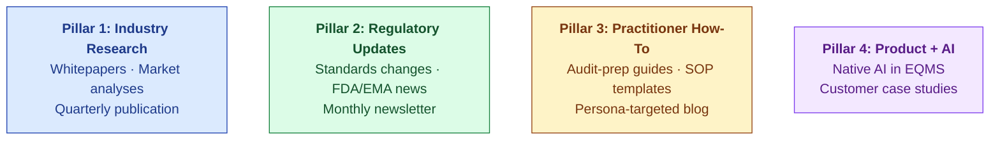
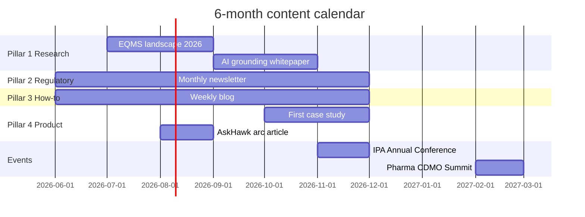
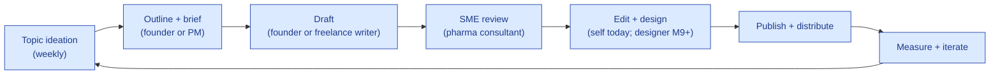

# Content Strategy

| Field | Value |
|---|---|
| Owner | Founders + Marketing (when hired) |
| Status | DRAFT v1.0 |
| Last updated | 2026-05-31 |

---

## 1. Content thesis

> 💡 **At pre-seed, content is a credibility play — not a lead-gen channel.** We publish substantive research on EQMS evolution, regulatory trends, and supplier-audit best practices to signal that "we know this industry deeply." That credibility shortens the discovery → demo conversation. Lead-gen at scale is a Series A activity.

## 2. Content pillars

## 3. Pillar 1: Industry research (the credibility play)

| Asset | Cadence | Audience | Format |
|---|---|---|---|
| **EQMS landscape paper** (annual) | 1×/yr | Industry analysts, investors, prospects | 8-12 page PDF |
| **Per-sector market analysis** | 2×/yr | Investors, partners | 6-8 page PDF |
| **Standards convergence whitepaper** | 1×/yr (post ISO 9001:2026 release) | Engineering + compliance leaders | 4-6 page PDF |
| **AI in regulated industries** | Quarterly | CTOs, AI leaders | 4 page PDF + blog series |

Existing canon: `00-strategy-and-pitch/market-and-strategy/per-sector-market-analysis.pdf` + `11-research-domain/`.

## 4. Pillar 2: Regulatory updates

| Channel | Cadence | Content |
|---|---|---|
| **Monthly newsletter** | Monthly | FDA-483 trend digest + EU GMP guidance changes + ICH Q-series updates + ISO 9001:2026 watch |
| **Regulatory alerts** | Ad-hoc | When something major drops (new FDA QMSR, new ICH guideline) |
| **Compliance Q&A** | Weekly blog | "What does X new regulation mean for your CAPA workflow?" |

## 5. Pillar 3: Practitioner how-to

Persona-targeted content for the people who actually use S.M.A.R.T. Hawk:

| Persona | Content type | Sample titles |
|---|---|---|
| Audit Program Manager | Audit-prep how-to | "5 things to do 30 days before an FDA inspection", "How to build a supplier-audit programme from scratch" |
| Lead Auditor | Observation drafting | "Writing regulator-grade observations: anatomy of a great finding", "The art of citation in audit reports" |
| Supplier QA Head | Response playbook | "Responding to an FDA-483: a 30-day playbook", "Building a CAPA that closes" |
| VP Quality | Board reporting | "QMS metrics that matter to your board", "Annual product review template" |
| Doc Control Officer | Document control | "AI in document control: where it helps, where it hurts" |

## 6. Pillar 4: Product + AI

| Asset | Audience | Format |
|---|---|---|
| Customer case studies (post-first-3-customers) | Prospects, investors | 2-page PDF per customer |
| Native AI architecture deep-dive | CTOs, AI investors | Long-form blog (~3K words) |
| AskHawk evolution series | Practitioners | Blog series + video demos |
| Compliance Health Score methodology | Customers, prospects | Blog + landing page |

## 7. Distribution channels

| Channel | Pillar | Cadence | KPI |
|---|---|---|---|
| **LinkedIn** (founder posts + company page) | All | 3×/week | Reach + engagement |
| **Industry email newsletter** | Pillar 2 | Monthly | Open + click rate |
| **Company blog** (hawkeye.io/blog) | Pillars 2, 3, 4 | Weekly | Traffic + scroll depth |
| **Webinars** | Pillars 1, 3 | Quarterly | Registration + attendance |
| **Industry conferences** | Pillars 1, 4 | 2-3/yr | Booth meetings + qualified leads |
| **Podcast appearances** | All | Opportunistic | Listens + leads |
| **Trade press articles** | Pillar 1 | Opportunistic | Mentions in pharma press |

## 8. Content calendar (next 6 months)

## 9. Content production process

## 10. KPIs

| Metric | Year 1 target | Year 2 target |
|---|---|---|
| LinkedIn followers (company page) | 2,000 | 10,000 |
| Newsletter subscribers | 500 | 5,000 |
| Blog traffic (monthly UV) | 1,000 | 15,000 |
| Industry-press mentions | 2 | 8 |
| Inbound leads from content | 5/mo | 30/mo |
| Webinar attendees | 50/event | 150/event |

## 11. Content investment (cost rough-order)

| Stage | Monthly content spend |
|---|---|
| M0-M6 | $500 (founder time + 1 freelance article/mo) |
| M6-M12 | $1.5K (1-2 freelance articles + design help) |
| M12-M18 | $3K (writer + designer freelance + tools) |
| M18+ (post-marketing-hire) | $8K (in-house writer + design + tools + paid promo) |

## 12. What we WON'T do at pre-seed

> 🚫 **Anti-patterns.**
>
> - **Aggressive SEO content farming** (low-quality blog posts at scale) — erodes brand
> - **Paid LinkedIn / Google ads at scale** — wait for proven funnel
> - **Whitepaper-for-email-gate at scale** — gates erode reach; ungate after distribution
> - **AI-generated content at scale** — would undermine our "native AI is honest" positioning
> - **Founder personal podcast** — too time-consuming; opportunistic guest spots only
> - **Branded swag** — wait for first 10 customers
> - **Conference booth at every event** — pick 2-3/year, go deep

---

## See also

- [SALES-PLAYBOOK.md](../pitch-materials/SALES-PLAYBOOK.md)
- [DEMO-INDEX.md](../demo-scripts/DEMO-INDEX.md)
- [GTM-PLAN.md](../../01-strategy/gtm-strategy/GTM-PLAN.md)
- [RESEARCH-INDEX.md](../../11-research-domain/industry-research/RESEARCH-INDEX.md)
