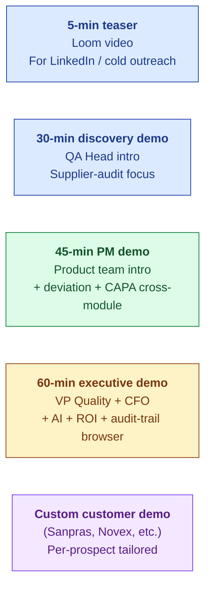

# Demo Index

| Field | Value |
|---|---|
| Owner | Sales + Product Marketing |
| Status | v1.0 |
| Last updated | 2026-05-31 |

---

## 1. Demo catalog

| Demo | Audience | Duration | Format | Source |
|---|---|---|---|---|
| **5-min teaser** | Cold outreach / LinkedIn | 5 min | Pre-recorded Loom | TBD |
| **30-min discovery** | QA Head first call | 30 min | Live (founder-led OR sales) | `00-strategy-and-pitch/demo-assets/07-pharma-demo-script.md` |
| **45-min PM demo** | Product team intro | 45 min | Live | Same script, extended |
| **60-min executive** | VP Quality + CFO | 60 min | Live + ROI calculator | Same script + ROI deck |
| **Sanpras-specific** | Sanpras Healthcare | Custom | Live | `customer-pitches/13-sanpras-demo-runbook` |
| **Novex-specific** | Novex Pharma | Custom | Live | `customer-pitches/novex-eqms-demo` |

## 2. The canonical demo flow (30-min cut)

Anchored on the supplier-audit wedge.

| Min | Section | Story | Key clicks |
|---|---|---|---|
| 0-3 | Setup | "Imagine you're hosting an FDA audit next month, you have 5 supplier audits running, your QA team is drowning in email…" | (None — anchoring) |
| 3-8 | Audit list | Show 8 active audits, phase visibility, filter to "at risk" | `/audits` list view |
| 8-15 | Single audit deep-dive | Open audit, walk phase stepper, show tab gates | `/audits/:id` → tabs |
| 15-22 | AI observation drafter | Live AI draft with citations + confidence; auditor coach feedback | `ObservationDrafterButton` + `AuditorCoachPanel` |
| 22-26 | Closure e-sig ceremony | SignatureDialog with password + reason | `/audits/:id/closure` |
| 26-30 | Wrap: ROI math + next steps | "For your org, this is ₹38L of savings. Want to run a 60-day PoC?" | (Whiteboard or slide) |

## 3. The 45-min PM cut (adds modules 2-3)

Add at min 22-30 (extending the demo):

| Min | Section | Story |
|---|---|---|
| 22-30 | Observation → CAPA | "This observation auto-spawned a CAPA. Watch the cross-module link." |
| 30-37 | CAPA workflow | Walk through CAPA intake → triage → action plan → effectiveness check |
| 37-42 | Cross-module audit-trail browser | "When the regulator asks 'show me everything about this CAPA over time' — here it is." |
| 42-45 | Wrap | ROI + PoC proposal |

## 4. The 60-min executive cut (adds AI + ROI deep dive)

Full sequence above + add:

| Min | Section | Story |
|---|---|---|
| 45-55 | AI defensibility | Show AI decision audit trail (modelVersion + promptHash + retrievalSet + confidence); compare to "incumbent retrofit AI" black box |
| 55-60 | ROI math | Walk through customer's specific savings calc; payback < 4 months; show pricing tiers |

## 5. Demo environment

| Tenant | Purpose | Login | URL |
|---|---|---|---|
| **acme-pharma-test** | Generic pharma demo (Asha Sharma + 5 personas) | TBD | TBD |
| **sanpras-demo** | Sanpras-specific pre-loaded data | TBD | TBD |
| **novex-demo** | Novex-specific (legacy) | TBD | TBD |
| Local dev | Engineering testing only | — | — |

## 6. Demo prep checklist

Before any live demo:

- [ ] Demo environment refreshed (sample data current)
- [ ] Internet stable (test 30 min before)
- [ ] Backup recording in case demo crashes
- [ ] Pharma SME consultant on call if technical Q&A expected
- [ ] ROI calculator pre-populated with prospect's numbers
- [ ] Customer/prospect's logo/screenshots NOT in demo (privacy)
- [ ] Audit-trail browser pre-loaded with rich history
- [ ] AI demo: pre-cached prompts (Anthropic latency can be 10+ sec cold)
- [ ] Follow-up email template ready (with PoC proposal)

## 7. Common demo questions + answers

| Question | Demo response |
|---|---|
| "Where does the AI's citation come from?" | Live click → show KbChunk source + actual regulation text |
| "How is data isolated between tenants?" | Open service-layer guard code in /api docs; show tenant filter on every query |
| "What happens if AI is wrong?" | Show skeleton fallback (low-confidence path); show user-disposition capture (USER_EDITED / USER_REJECTED) |
| "Can I export everything?" | JSON / CSV / PDF export buttons on every list view |
| "What if S.M.A.R.T. Hawk goes out of business?" | Source-code escrow + data export contract clause + multi-year contract option |
| "Is the AI making decisions OR helping?" | Always assists; user is in control; every AI action has user-disposition + audit trail |
| "Can I customize the audit template?" | Per-tenant audit-type catalog; templates editable by tenant_admin |

## 8. Post-demo follow-up

Within 24 hours:

| Item | Sent by |
|---|---|
| Thank-you email + meeting recap | Sales |
| PoC proposal (if interested) | Sales |
| ROI calculator with their numbers | Sales |
| Link to recorded demo (for sharing internally) | Sales |
| Calendar invite for Day 50 PoC review (if PoC accepted) | Sales |

---

## See also

- [SALES-PLAYBOOK.md](../pitch-materials/SALES-PLAYBOOK.md) — sales process
- [PITCH-DECK.md](../../02-fundraising/pitch-deck/PITCH-DECK.md) — investor pitch (different audience)
- [00-strategy-and-pitch/demo-assets/07-pharma-demo-script.md](../../../backend/docs/00-strategy-and-pitch/demo-assets/07-pharma-demo-script.md) (legacy) — source script
- [00-strategy-and-pitch/customer-pitches/](../../../backend/docs/00-strategy-and-pitch/customer-pitches/) (legacy) — customer-specific assets
