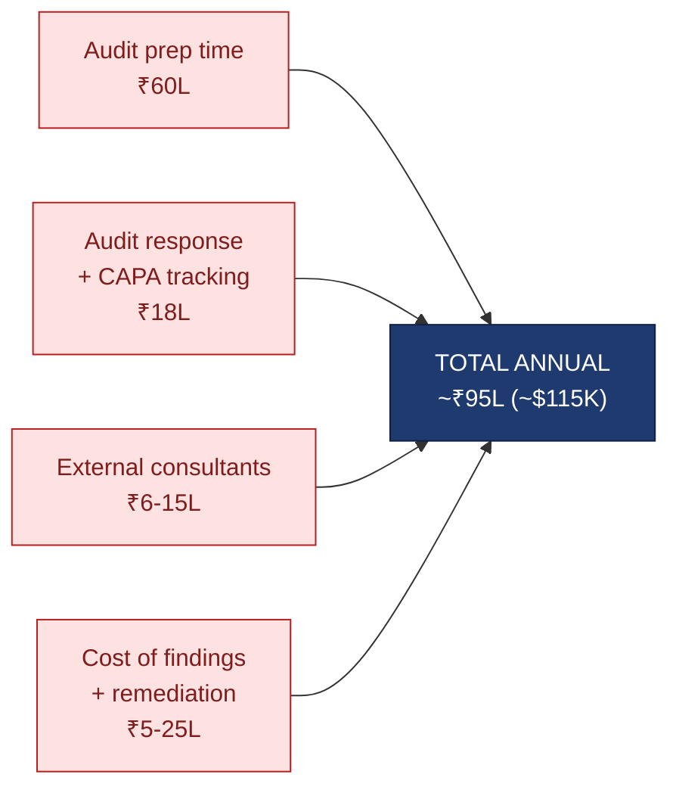
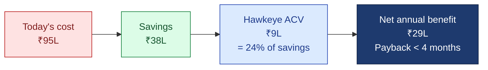
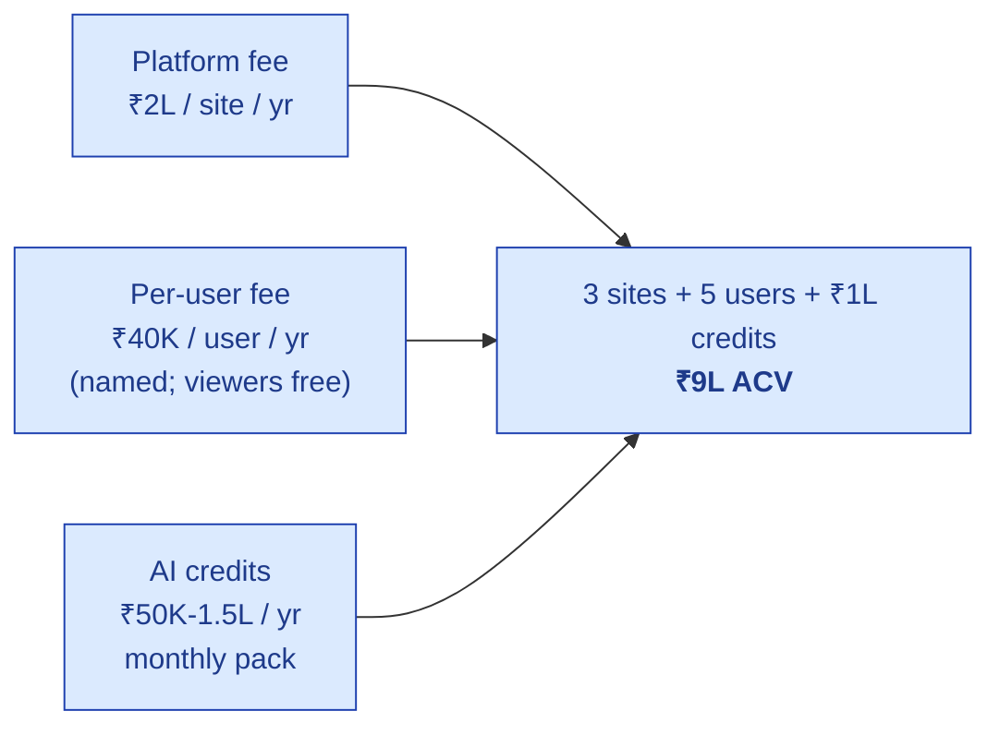

# Hawkeye — CFO Deck

| Field | Value |
|---|---|
| Audience | Buyer's CFO · Head of Finance · Head of Procurement |
| Use case | Procurement / financial approval for QA Head's Hawkeye purchase |
| Status | v1.0 — 2026-06-01 |
| Pairs with | [PRICING.md](../../01-strategy/pricing-and-packaging/PRICING.md) |
| Format | 17 slides · 25-min finance review |

---

## 1. $300K/yr EQMS · 60% of QA Time on Audit Prep — Where Is the Money?

> 💡 **The CFO question.** Your quality function is one of your three largest non-COGS line items. Half of it is audit prep, response, and remediation that doesn't make the product better. This deck shows you the math: what you spend today, what Hawkeye costs, what you save, and what the contract looks like.

| Today's quality spend (typical Tier-3 CDMO) | Annual |
|---|---|
| QA team loaded cost on audit prep + response | ~₹78L |
| External consultants on big audits | ~₹6-15L |
| Cost of audit findings + remediation | ~₹5-25L |
| EQMS / point tools / spreadsheets | varies (₹0-30L) |
| **Total annual quality cost** | **~₹95L+ ($115K+)** |

*Slide 1 / 17*

---

## 2. Your Current Quality Cost — Waterfall

**The math:** 5 QA × 30 audits × 4 days × ₹10K/day loaded cost = ₹60L on prep alone.

This is the addressable cost line — what Hawkeye reduces. Direct GMP manufacturing cost is unchanged.

*Slide 2 / 17*

---

## 3. The Savings Model — 40% Blended Reduction

| Cost line | Today | Hawkeye reduction | Mechanism |
|---|---|---|---|
| Audit prep time | ₹60L | 50-60% (₹30-36L saved) | AI prep · autofill · evidence reuse |
| Audit response + CAPA tracking | ₹18L | 30-40% (₹5-7L saved) | Cross-module wiring · auto-spawn |
| External consultants | ₹6-15L | 30% (₹2-5L saved) | Reduced reliance for routine audits |
| Findings + remediation | ₹5-25L | 20-30% (₹1-7L saved) | Earlier risk detection · public-data fusion |
| **Total** | **₹95L** | **~40% blended (₹38L / $46K saved)** | |

> 💡 **40% is the conservative case.** Even at 25% realized savings (₹24L / $29K), payback is still 6-7 months. We model and contract conservatively.

*Slide 3 / 17*

---

## 4. Hawkeye Annual Cost — Net Benefit Math

| Metric | Value |
|---|---|
| Hawkeye annual contract value | **₹9L (~$10.8K)** |
| As % of savings | 24% |
| As % of today's quality cost | 9.5% |
| Net annual benefit | **₹29L** |
| Payback period | **<4 months** |
| 3-year cumulative net benefit | **~₹85L** (after 5% annual escalator) |

*Slide 4 / 17*

---

## 5. 3-Year Cumulative TCO — Hawkeye vs Alternatives

| Vendor | Y1 ACV | Implementation | Y2 ACV | Y3 ACV | 3-yr TCO |
|---|---|---|---|---|---|
| **Hawkeye (Growth)** | $10.8K | $0 (included) | $11.3K | $11.9K | **~$34K** |
| Veeva Vault QMS | $50-100K | $50-200K | $50-100K | $50-100K | $200-500K |
| MasterControl | $40-80K | $40-150K | $40-80K | $40-80K | $160-390K |
| ComplianceQuest | $25-60K | $15-50K | $25-60K | $25-60K | $90-230K |
| TrackWise (Sparta) | $40-90K | $30-100K | $40-90K | $40-90K | $150-370K |
| **Status quo (spreadsheets)** | "$0" | "$0" | "$0" | "$0" | **Hidden: ~$345K** in QA time |

> 💡 **The status-quo trap.** "Free" spreadsheets cost you the full ₹95L/yr quality bill = ~$345K over 3 years. Hawkeye at $34K over 3 years saves you $300K+ in QA time alone. The lowest-cost option is the most expensive option.

*Slide 5 / 17*

---

## 5a. Hidden Cost #1 — Validation TCO (GAMP Cat 4 vs Cat 5)

Computer System Validation (CSV) is the second-largest cost line of any EQMS purchase. The vendor's GAMP classification determines whether you write months of validation paperwork or weeks.

| | Cat 3 — non-configured | **Cat 4 — Hawkeye** | Cat 5 — custom/bespoke |
|---|---|---|---|
| Customer validation effort | Install + UAT | **URS + risk + IQ/OQ/PQ of configuration only** | Full SDLC + source review + V-model |
| Vendor SDLC evidence leveraged | Minimal | **Extensive** (per GAMP 5 supplier-leverage + FDA CSA) | Limited |
| Customer effort vs Cat 5 | n/a | **~60% less** *(industry consultant consensus)* | Baseline (100%) |
| Typical validation cycle | 2-4 weeks | **6-12 weeks** | 6-12 months |
| Loaded cost @ ₹15K/day × QA + Eng | ₹6-12L | **₹18-30L one-time** | ₹50-150L one-time |

| Vendor | GAMP class | Your validation cost (one-time) |
|---|---|---|
| **Hawkeye** | **Cat 4** | **₹18-30L** (₹0 if you accept the Validation Accelerator Package as-is) |
| Veeva Vault QMS | Cat 4 | ₹30-80L (more config surface) |
| Custom-built (in-house dev) | Cat 5 | ₹50-150L (full V-model) |

> 💡 **What this means to the CFO.** Even if you ignored every other cost line, GAMP Cat 4 alone saves you ₹30-120L (~$36K-$144K) on the validation budget vs a Cat 5 custom build. That's typically 3-10× the Hawkeye Y1 ACV — paid back **before the platform even goes live**.

**The Validation Accelerator Package Hawkeye ships at no extra cost:** Vendor Quality Manual · SDLC evidence · FRS + Configuration Spec · IQ/OQ scripts pre-executed against vendor product · annual pentest summary · Vendor Assessment Questionnaire pre-filled · Release Notes per version · Periodic Vendor Audit pack. Reference: ISPE *GAMP 5 Guide, 2nd Edition* (Jul 2022); FDA *Computer Software Assurance* Final Guidance (Sep 2025).

> 📘 **Detailed Cat 4 reference for your QA/Procurement team:** **[GAMP-CAT-4-BRIEF.md](./GAMP-CAT-4-BRIEF.md)** (8 pages) and the canonical **[GAMP-CAT-4-COMPLIANCE.md](../../08-compliance-regulatory/GAMP-CAT-4-COMPLIANCE.md)** (~25 pages, available under NDA).

*Slide 6 / 17*

---

## 5b. Hidden Cost #2 — Data-Breach Risk (Layer 1 Trust Architecture)

The healthcare/pharma sector has had the highest cost per breach **for 14 consecutive years**. The vendor's security posture is, in effect, your own.

| Statistic | Value | Source |
|---|---|---|
| Average breach cost — healthcare sector | **USD 7.42M** | IBM *Cost of a Data Breach Report 2025* (Jul 2025) |
| Global cross-sector average | USD 4.44M | IBM 2025 |
| Mean breach lifecycle (identify + contain) | 241 days | IBM 2025 |
| "Shadow AI" cost premium per breach | +USD 308K | IBM 2025 |
| Cencora Feb 2024 incident | Data of **15+ pharma giants** exfiltrated (Bayer, GSK, Novartis, BMS, Regeneron, others) | Cencora 8-K · public reporting |
| Merck NotPetya (2017) | $1.4B total losses; national vaccine reserves released | SEC filings · public analyses |
| FDA Warning Letters citing data-integrity deficiencies (CDER 2021-2024) | ~60% of all CDER WLs | FDA enforcement data |

> 💡 **What Hawkeye Layer 1 reduces.** Per-tenant isolation · TLS 1.3 + AES-256 · BYOK on Enterprise · India/US/EU residency · NO model-training on your data (default contractual) · cite-or-fallback eliminates hallucinated citations · DPDP/GDPR-ready · SOC 2 Type II in progress. **A platform with weak Layer 1 is a $7.42M one-incident liability waiting to happen.**

*Slide 7 / 17*

---

## 6. Contract Structure — Predictable · Billed Quarterly

| Component | Charge | Example (3 sites, 5 users) |
|---|---|---|
| Platform fee per site | ₹2L / site / yr | ₹6L |
| Per-user fee (named full-edit) | ₹40K / user / yr | ₹2L |
| AI credit pack | ₹1L / yr | ₹1L |
| **Annual contract value** | | **₹9L (~$10.8K)** |
| Billing cadence | Quarterly | ₹2.25L / quarter |

No overage surprises. AI credit notifications at 50% / 80% / 100% with auto-suspend option (never auto-charge).

*Slide 8 / 17*

---

## 7. Discount Levers — How to Reduce the ACV

| Lever | Discount | Approval |
|---|---|---|
| Reference customer (first 10) | **40% Y1** · list Y2 | Founder approval |
| Multi-year commit · 2 yr | 10% off | Sales + Founder |
| Multi-year commit · 3 yr | 18% off | Founder |
| Multi-site rollout (4+ sites) | 5% per site beyond 3 | Sales |
| Annual upfront payment | 5% | Standard |
| Competitive displacement (Veeva / MasterControl) | up to 30% Y1 · 10% Y2 | Founder |

> 💡 **The big lever for you today.** Reference customer status (first 10) gives you 40% Y1 (~₹5.4L instead of ₹9L) in exchange for a 12-month commitment and reference call availability (4-6/yr). Your competitors don't get this offer.

*Slide 9 / 17*

---

## 8. What's INCLUDED in the ACV — No Surprise Costs

| Inclusion | Details |
|---|---|
| All 15 EQMS modules | Audit · Document Control · CAPA · Change Control · Deviation & Event · Training · Risk · Supplier Quality · Management Review · Asset & Equipment · Chain of Custody · Transaction Review · Regulatory Intel · AskHawk · RFQ Procurement |
| AskHawk cross-cutting AI | Regulations Q&A · SOPs · workflow playbooks · App Wizard |
| Implementation onboarding | 2 training sessions · evidence import support · go-live support |
| Validation pack (IQ/OQ/PQ templates) | Standard package · joint sign-off included |
| Standard SaaS support | 12×5 · 24h SLA on P1 · ticket portal |
| Audit-trail browser | Cross-module · queryable · part of platform |
| Quarterly business reviews | Founder-level for first 10 customers |
| Annual revalidation summary | Change-impact assessments per release |

*Slide 10 / 17*

---

## 9. What's NOT Included — Clear Line Items

> ⚠️ **The honesty register your procurement team will want.**

| Excluded | When you'd need it | Cost |
|---|---|---|
| Custom integrations (LIMS / ERP / MES not in standard list) | Tier-2 with specific stack | ₹2-5L scoped one-off |
| On-prem deployment | If cloud is non-starter (M18 availability) | +30% on base ACV |
| Validation execution (you run IQ/OQ — we provide scripts) | Always — by design | Your internal effort |
| 24×7 support | Production critical SLA | +20% on base ACV (Enterprise tier) |
| Dedicated Customer Success Manager | Growth tier | +₹3L/yr (included in Enterprise) |
| Customized validation summary | Beyond standard template | ₹1-3L one-time |
| Extra AI credits above pack | Heavy AI usage | ₹500 per 1,000 output tokens |
| Pentest report customization | Specific compliance attestation | Standard report included; custom = ₹1-2L |

*Slide 11 / 17*

---

## 10. Contract Terms — Clean SaaS

| Term | Default | Negotiable |
|---|---|---|
| Contract length | 1-year auto-renewal | 2yr (-10%) · 3yr (-18%) |
| Billing | Quarterly | Annual upfront (-5%) |
| Payment terms | Net 30 | Net 45 / 60 for enterprise |
| Termination | 60-day notice before renewal | Mid-term: material breach only |
| Data export | Always free · 90-day post-cancellation window | n/a |
| Price escalator | 5% annual | Frozen Y1-Y2 for first 10 customers |
| Auto-renewal | Yes (with 60-day notice option) | Can be removed in MSA |

> 💡 **Data portability guarantee.** If you ever leave, you take all your data — JSON · CSV · PDF · full audit trail. 90 days post-cancellation, free of charge. No hostage.

*Slide 12 / 17*

---

## 11. SLA + Uptime Credits

| Tier | Uptime SLA | Credit if missed |
|---|---|---|
| Standard (default Growth) | 99.5% | 5% monthly fee credit per 0.5% miss |
| Enterprise | 99.9% | 10% monthly fee credit per 0.1% miss |
| Planned maintenance | Excluded · 72h notice | n/a |

**Response SLAs:**

| Priority | First response | Resolution target |
|---|---|---|
| P1 (system down · production blocked) | 1 hour | 4 hours |
| P2 (major feature broken) | 4 hours | 24 hours |
| P3 (minor feature · workaround exists) | 1 business day | 5 business days |
| P4 (cosmetic · enhancement) | 3 business days | best effort |

*Slide 13 / 17*

---

## 12. Audit Trail of the Contract Itself

> 💡 **The meta-feature.** Hawkeye runs Hawkeye for its own customer contracts. Every change to your MSA, DPA, SLA, pricing, or scope is e-signed by both sides and lives in our customer-success tenant. You can request the full audit log of your account anytime.

| Change type | Captured |
|---|---|
| ACV / price changes | Yes · with effective date + reason |
| Site additions / removals | Yes · pro-rated billing entries |
| User adds / removals | Yes · per-quarter true-up |
| Module additions | Yes · with go-live e-sign |
| SLA invocations | Yes · with credit applied |
| MSA / DPA amendments | Yes · both parties' e-sig |

Everything contract-related is reproducible, queryable, and inspector-ready.

*Slide 14 / 17*

---

## 13. Procurement-Friendly — Standard Documents Ready

| Document | Status | Notes |
|---|---|---|
| Master Service Agreement (MSA) | Standard template ready | Customizations to legal review |
| Data Processing Agreement (DPA) | GDPR + DPDP-aligned · ready | Annexed to MSA |
| Privacy Policy | Published · GDPR + DPDP-aligned | Available pre-contract |
| Information Security Policy | Available under NDA | SOC 2 Type 1 M12 |
| Business Continuity / DR Plan | Available under NDA | RPO 1h · RTO 4h |
| Acceptable Use Policy | Standard template | Tenant signs at onboarding |
| Sub-processor list | Published · updated quarterly | AWS · Anthropic · OpenAI · Google · Atlas |
| SIG / CAIQ / VSA questionnaire | We complete · 5 business days | One-time per customer |

*Slide 15 / 17*

---

## 14. References — Post-PoC

> ⚠️ **The honest current state.** Pre-customer today (2 design partners in active PoC discovery — Sanpras + Novex). We will offer 3 reference calls with paid customers by M9-M12. Your reference status (first 10) means you may be one of the 3.

| Reference type | When available |
|---|---|
| Design partner discovery call | Today (under NDA) |
| Live PoC walkthrough at design partner | M6-M9 |
| Paid customer reference call | M9-M12 |
| Multi-customer round-table | M18 |
| Customer-led case study | M12+ (your name optional) |

If you sign before paid references exist, you become one. That's the 40% Y1 discount lever.

*Slide 16 / 17*

---

## 15. Approval-Ready Summary — For Board Review

> 💡 **The one-paragraph version.** Hawkeye replaces ~40% of our annual ₹95L audit-prep / response / consultant / findings cost (~₹38L / $46K saved per year) for an annual contract value of ₹9L ($10.8K) — 24% of savings, 9.5% of today's quality cost. Payback is under 4 months. The contract is per-site + per-user + AI credits, billed quarterly, 1-year auto-renewal with 60-day notice and free data export. We retain reference-customer pricing (40% Y1 discount) by signing within the first 10. Three-year cumulative net benefit ~₹85L. The vendor is pre-revenue but post-product (15 modules + AskHawk shipped), with founder-level support and a clean termination clause. Recommended: approve a 60-day no-cost PoC; convert to paid contract on success criteria met.

| Approval ask | Value |
|---|---|
| PoC contract (no $$ commitment) | 60 days · $0 |
| Conversion contract (if PoC succeeds) | ₹9L / yr · ₹5.4L Y1 with reference discount |
| Multi-year option | 2yr (-10%) or 3yr (-18%) |
| Risk if Hawkeye fails | Free data export · 60-day notice · move to spreadsheets or competitor |

**Contact:** sales@hawkeye.app · `[insert Calendly]`

**Read next:**
- [PRICING.md](../../01-strategy/pricing-and-packaging/PRICING.md) — full pricing model · sensitivity analysis
- Sample MSA + DPA on request

*Slide 17 / 17 · Thank you · Ready when you are*
