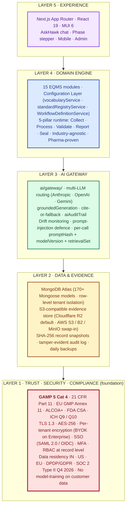
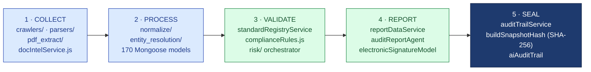
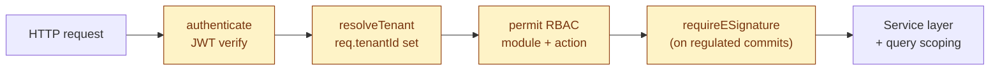
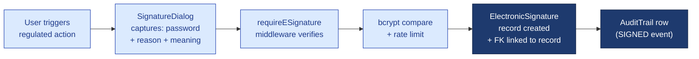
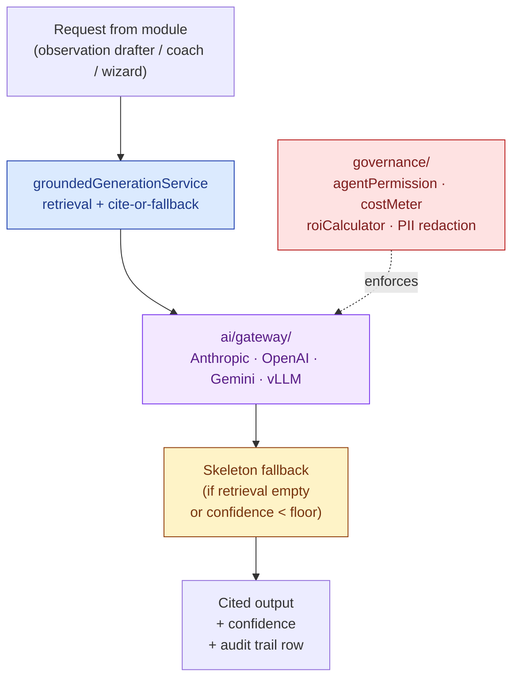
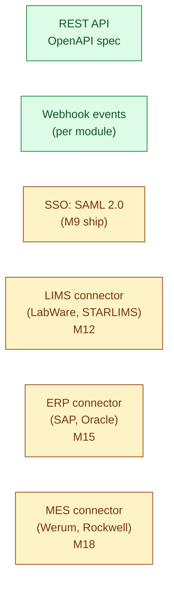
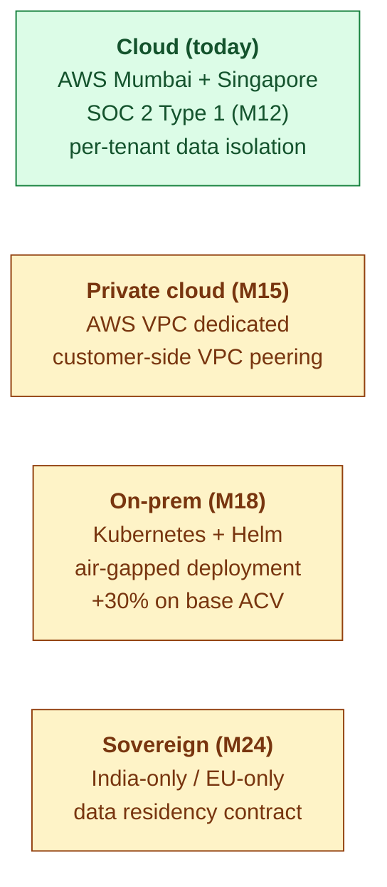
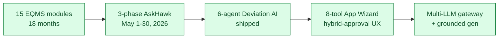

# Hawkeye — CTO / IT Lead Deck

| Field | Value |
|---|---|
| Audience | Buyer's CTO · Head of IT · Head of Engineering · Compliance IT |
| Use case | Technical buy-in for QA Head's Hawkeye decision |
| Status | v1.0 — 2026-06-01 |
| Pairs with | [PLATFORM-ENGINEERING.md](../../04-engineering/00-overview/PLATFORM-ENGINEERING.md) · [PART-11.md](../../08-compliance-regulatory/frameworks/PART-11.md) · [AI-ARCHITECTURE.md](../../04-engineering/07-ai/AI-ARCHITECTURE.md) |
| Format | 15 slides · 25-min technical session |

---

## 1. Hawkeye — Native-AI Compliance Engine, Code-Verified

> 💡 **The one-line technical positioning.** A **5-layer architecture** with Trust · Security · Compliance as Layer 1 (the foundation), Data + AI + Domain Engine + Experience stacked above. Built as a **GAMP 5 Category 4 configured product** with 21 CFR Part 11, EU GMP Annex 11, and ALCOA+ designed-in from day one — not retrofitted.

| Stack layer | Choice |
|---|---|
| Frontend | Next.js 15 App Router · React 19 · MUI 6 · TypeScript |
| API | Node.js 20 · Express · 4-layer middleware chain |
| Data | MongoDB Atlas · 170+ Mongoose models · tenant-scoped row-level isolation |
| AI | Multi-LLM gateway (Anthropic + OpenAI + Gemini + local-vLLM) · grounded generation · cite-or-fallback |
| Audit spine | Immutable cross-module log · Part 11 §11.10(e) / Annex 11 §9 · <2 sec query |
| Compliance class | **GAMP 5 Cat 4** (vendor-supplied Validation Accelerator Package) |

*Slide 1 / 15*

---

## 2. The Technical Problem — Why Incumbents' AI Retrofits Fail Validation

| Incumbent pattern | The validation failure |
|---|---|
| Legacy EQMS + bolted LLM (Veeva, MasterControl, ComplianceQuest) | Output has no citation; cannot reproduce; no `promptHash` in audit trail |
| Horizontal platform + GPT (ServiceNow, SAP) | No regulated-domain grounding; cannot defend "where did this answer come from" to FDA |
| Audit-network plays (Qualifyze) | Network owns the data; you don't; cannot validate per-tenant |
| In-house spreadsheets + ChatGPT | No audit trail at all; full non-compliance |

> ⚠️ **The validation question every CTO must answer.** When the regulator asks *"reproduce this AI-drafted observation 6 months from now,"* can your stack do it? Hawkeye: yes (`modelVersion + promptHash + retrievalSet + confidence` captured per call). Incumbents: no.

*Slide 2 / 15*

---

## 3. The 5-Layer Architecture — Trust as Layer 1

> 💡 **Why Trust is Layer 1.** In a regulated industry the security/compliance posture is not a feature — it is the substrate everything else depends on. Order matters in architecture diagrams; we put it at the foundation deliberately.

The 5-pillar runtime pipeline lives **inside Layer 4** as the universal per-module motion. Code paths:

- **Pillars 1-2 (Python data platform)** — collect + normalize structured/unstructured/public data
- **Pillars 3-5 (Node application)** — validate + report + seal, with human e-signature gating record commits
- Every box maps to a real file in the codebase — see [PLATFORM-ENGINEERING.md](../../04-engineering/00-overview/PLATFORM-ENGINEERING.md) for the full file index

*Slide 3 / 15*

---

## 4. Multi-Tenancy From Day One — 4-Layer Middleware

- Every request: authenticate → resolveTenant → RBAC permit → e-sig (when committing)
- **Service-layer guards** (`canUserAccessAudit`, etc.) — second check inside business logic in case middleware is bypassed
- **Query-level scoping** — all Mongoose queries `.find({ tenantId: req.tenantId, ... })` — no cross-tenant leak possible
- File paths: `backend/src/middlewares/{authMiddleware,tenantMiddleware,roleMiddleware,requireESignature}.js`

*Slide 4 / 15*

---

## 5. The Audit-Trail Spine — One Source of Truth

| Property | Implementation |
|---|---|
| Immutable | Append-only at service layer; no `update` or `delete` exposed |
| Cross-module | Every state change in every module writes to one `AuditTrail` collection |
| Queryable | `<2 sec` to answer any regulator question (composite index on `tenantId + recordType + recordId + timestamp`) |
| Captures | actorId · timestamp · IP · UA · reason · beforeState · afterState · linkedRecordType · linkedRecordId |
| Tamper-evident | Per-record SHA-256 `buildSnapshotHash`; mismatches detected on re-render |
| AI-specific | Additional row per AI decision: `modelVersion + promptHash + retrievalSet + confidence + userDisposition` |

> ⚠️ **Honest framing.** Tamper-evident, NOT blockchain. No chained ledger, no consensus. SHA-256 + append-only ALCOA+ is what regulators actually require under Part 11 §11.10(e).

*Slide 5 / 15*

---

## 6. E-Signature Ceremony — Part 11 §11.50 / §11.200 / §11.300

**Captured per signature:**
- signerId → printed name (§11.50(a))
- signedAt UTC + tenant tz
- signatureMeaning (APPROVED / AUTHORED / WITNESSED / REVIEWED / REJECTED)
- reason (mandatory free-text)
- IP address + User-Agent (§11.10(h))
- bcrypt-verified password (§11.200(a)(1))
- FK to record (cannot be detached — §11.70)

File: `backend/src/middlewares/requireESignature.js` · `models/ElectronicSignature.js`

*Slide 6 / 15*

---

## 7. AI Architecture — Multi-LLM Gateway + Grounded Generation

- **Grounded-or-fallback** — every output cites a source OR returns "insufficient evidence." Never asserts what it cannot cite.
- **Human-in-the-loop** — AI drafts, suggests, scores; AI never commits a record. A human e-signs.
- **Active learning** — every user disposition (accepted / edited / rejected) recorded for fine-tune corpus.

*Slide 7 / 15*

---

## 8. Reproducible AI — The Audit Trail Row

Every AI call writes one row to `aiAuditTrail`:

| Field | Example |
|---|---|
| `modelVersion` | `anthropic/claude-opus-4-7@2026-05-01` |
| `promptHash` | `sha256:7a4b...c91` |
| `retrievalSet` | `[{docId: "ICH-Q7-§5.3", chunkHash: "..."}, ...]` |
| `confidence` | `0.84` |
| `temperature` | `0.0` (deterministic for regulated paths) |
| `costTokens` | `{in: 1247, out: 318}` |
| `userDisposition` | `ACCEPTED` / `EDITED` / `REJECTED` |
| `editDelta` | (if edited) JSON diff |

> 💡 **Why this matters.** A regulator can ask *"reproduce this finding"* 18 months later. We can — modelVersion + promptHash + retrievalSet are sufficient to replay. **No incumbent ships this.**

*Slide 8 / 15*

---

## 9. Data Integrity — ALCOA+ Across All 9 Principles

| Principle | Implementation |
|---|---|
| **A**ttributable | Every record carries `createdBy` + audit-trail row with actorId |
| **L**egible | UTF-8 throughout · PDF generation with embedded fonts |
| **C**ontemporaneous | Server-side `Date.now()` UTC; client timestamps rejected |
| **O**riginal | `models/` are source of truth; exports are derivative copies |
| **A**ccurate | Schema validation · type guards · `complianceRules.js` business validation |
| **+ Complete** | Required fields enforced; partial saves rejected |
| **+ Consistent** | State machine enforces forward-only transitions (`auditPhaseService.canTransition()`) |
| **+ Enduring** | MongoDB Atlas PITR + S3 lifecycle policies + per-tenant retention (M18) |
| **+ Available** | <2 sec query SLA · 99.5% uptime today · 99.9% Enterprise tier |

*Slide 9 / 15*

---

## 10. Integration Story — Open API + SSO + Connectors

**Today (May 2026):**
- REST API with OpenAPI 3.1 spec · authenticated via JWT or API key
- Webhook events on every module's state change
- CSV bulk import/export for all modules

**Planned (M9-M18):**
- SAML 2.0 SSO (Okta · Azure AD · OneLogin)
- Pre-built connectors for LIMS · ERP · MES (top-3 vendors each)
- GraphQL endpoint for high-volume integrations

*Slide 10 / 15*

---

## 11. GAMP Cat 4 + Validation + Security Attestation Posture

| Area | Today (June 2026) | Roadmap |
|---|---|---|
| **GAMP 5 Cat 4 classification** | **Vendor-confirmed Cat 4 configured product**; same category as Veeva Vault, MasterControl, TrackWise | n/a — established |
| **Validation Accelerator Package** | Shipped to every PoC + paid customer at kickoff (Vendor Quality Manual · SDLC evidence · FRS + Config Spec · IQ/OQ scripts · annual pentest summary · VAQ pre-filled · Release Notes per version · Periodic Vendor Audit pack) | Continuous improvement per ISPE GAMP 5 2nd Ed (Jul 2022) updates |
| **21 CFR Part 11** clause-level | §11.10 (a/b/d/e/g) · §11.50 · §11.70 · §11.100 · §11.200 · §11.300 — all addressed by design ([PART-11.md](../../08-compliance-regulatory/frameworks/PART-11.md)) | Annual external attestation post-SOC 2 Type II |
| **EU GMP Annex 11** | All 17 clauses (2011 text); design anticipates 7 Jul 2025 draft revision | Re-assessment against final 2026 revision + new Annex 22 (AI) |
| **MHRA / WHO ALCOA+** | All 9 attributes (Attributable · Legible · Contemporaneous · Original · Accurate · Complete · Consistent · Enduring · Available) enforced by Layer 1 | n/a — designed-in |
| **FDA CSA** (Final Sep 2025; reissued Feb 2026) | Validation Accelerator designed for vendor-evidence-leveraged customer assurance | Reference customer case studies post-M12 |
| **SOC 2 Type I** | Self-assessed; attestation available under NDA | External auditor engaged; certified Q3 2026 |
| **SOC 2 Type II** | — | Q1 2027 (after 6-month observation window) |
| **ISO/IEC 27001:2022** | Aligned (informal) | Certification target 2027 |
| **HIPAA BAA** | Available on request (PHI handling typically out of EQMS scope) | Standardized template Q4 2026 |
| **AI governance** | FDA GMLP 10 Principles (Oct 2021) compliant · EMA AI Reflection Paper (Sept 2024) aligned · cite-or-fallback · AI audit trail per call (model · version · promptHash · retrievalSet · confidence · user disposition) | Independent third-party AI safety audit 2027 |
| **India DPDP Act 2023** | Data Processor obligations met; DPA template available | Re-attest against DPDP Rules at full effective date 13 May 2027 |
| **EU GDPR** | DPA executed at contract; EU residency option | DPO contact channel formalized Q4 2026 |

> 📘 **Detailed compliance evidence.** Full **[GAMP 5 Cat 4 Compliance Reference](../../08-compliance-regulatory/GAMP-CAT-4-COMPLIANCE.md)** (~25 pages) includes complete V-model lifecycle, vendor/customer RACI, Validation Accelerator Package inventory, pre-filled Vendor Assessment Questionnaire, AI-specific validation (Layer 3), and worked module-validation example. Customer-facing brief: **[GAMP-CAT-4-BRIEF.md](./GAMP-CAT-4-BRIEF.md)**.
| GDPR | Self-assessed (DPA template ready) | DPO designated at M12 |
| Pentest | Internal red-team | Annual third-party Q1 2027 |
| ISO 27001 | Not in scope | Series A trigger |
| Per-tenant validation pack | Template ready (IQ/OQ/PQ) | Customer-led execution; first delivery at first paid customer |

*Slide 11 / 15*

---

## 12. Known Gaps + Engineering Debt — Honest

> ⚠️ **What's not done.** Don't let your QA Head sign a contract before reading this.

| Gap | Severity | Plan |
|---|---|---|
| MFA not shipped (password + ID only today) | Medium | TOTP Q3 2026 |
| Per-tenant retention policy enforcement | Medium | Q4 2026 |
| Cross-tenant supplier intel UI | Low | Deferred (URS-B-006) |
| On-prem deployment | High for some buyers | M18 — Kubernetes + Helm charts |
| Mobile native app | Medium | Post-Series-A (responsive web today) |
| 7 URS open questions across modules | Mixed | Tracked in [04-engineering/03-urs/](../../04-engineering/03-urs/) |
| Veeva Vault migration tooling | Medium | M24 (after PMF) |

We'd rather show you the list than have you find it in production.

*Slide 12 / 15*

---

## 13. Deployment Options

| Option | Region | When |
|---|---|---|
| Multi-tenant SaaS | AWS Mumbai (default) + Singapore (failover) | Today |
| Dedicated VPC | Customer-specified AWS region | M15 |
| On-prem | Customer datacenter | M18 |
| Sovereign | India-only / EU-only / US-only | M24 |

*Slide 13 / 15*

---

## 14. Why Us — Engineering Velocity Proof

- **18 months bootstrapped** — full EQMS suite + AI from 2 founders + 2 PT advisors
- **3-phase AskHawk shipped in 30 days** (May 2026) — Regulations Q&A + SOPs + App Wizard with tool-use agent
- **6-agent stack on Deviation alone** — intake / similarity / disposition / CAPA recommend / trend / 5-Why
- Engineering choices the code shows: type-safe APIs, tenant-scoped queries, immutable audit trail, grounded AI by default

*Slide 14 / 15*

---

## 15. Q&A · Technical Deep-Dive Offer

| Next step | What you get | Timing |
|---|---|---|
| 90-min architecture deep-dive | Live walkthrough of code paths + your team's questions | This week |
| Sandbox tenant for your team | Full multi-tenant Hawkeye, your data, 30-day access | 48h |
| Validation pack preview | IQ/OQ/PQ templates · Part 11 compliance matrix | Email |
| Security questionnaire | We answer your standard SIG / CAIQ / VSA | Within 5 days |
| Pentest summary | Latest internal red-team report (signed NDA) | On request |

**Read next:**
- [PLATFORM-ENGINEERING.md](../../04-engineering/00-overview/PLATFORM-ENGINEERING.md) — 1-page CTO view
- [AI-ARCHITECTURE.md](../../04-engineering/07-ai/AI-ARCHITECTURE.md) — AI deep dive
- [PART-11.md](../../08-compliance-regulatory/frameworks/PART-11.md) — full compliance matrix

**Contact:** cto@hawkeye.app · `[insert Calendly]`

*Slide 15 / 15 · Thank you · Open the floor*
