# GAMP 5 Category 4 Compliance — Customer Brief

## S.M.A.R.T. Hawk AI-Native EQMS Platform

---

> **Prepared for** `[CUSTOMER LEGAL NAME]`
> **Audience:** QA Director · Procurement · IT Compliance Lead
> **Reference:** `HK-GAMP-BRIEF-v1.0` · **Issued:** 2026-06-05
> **Companion to:** POC Proposal · POC Agreement · POC Implementation Plan
> **Full technical reference:** GAMP 5 Category 4 Compliance Reference (`HK-GAMP-CAT4-v1.0`) — available on request
> **Confidential** — for the sole use of the addressee under NDA

---

## Purpose

This brief answers three questions a customer's QA Director typically asks during procurement:

1. **"What's S.M.A.R.T. Hawk's GAMP classification?"**
2. **"What's our validation burden — and what does S.M.A.R.T. Hawk provide to reduce it?"**
3. **"What evidence can we leverage to satisfy supplier qualification and regulatory inspections?"**

For the comprehensive ~25-page technical reference, request the full *GAMP 5 Category 4 Compliance Reference* (`HK-GAMP-CAT4-v1.0`) — provided as part of the Validation Accelerator Package at PoC kickoff or contract signing.

---

## 1. The Classification Statement

> 📜 **S.M.A.R.T. Hawk is a GAMP 5 Category 4 — Configured Product**
> per ISPE *GAMP 5: A Risk-Based Approach to Compliant GxP Computerized Systems, 2nd Edition* (July 2022). Reviewed annually.

**The same classification as:**

| Product | Vendor | GAMP Cat |
|---|---|---|
| Veeva Vault QMS | Veeva Systems | 4 |
| MasterControl Quality Excellence | MasterControl Inc. | 4 |
| Sparta TrackWise | Honeywell | 4 |
| ETQ Reliance | Hexagon | 4 |
| **S.M.A.R.T. Hawk** | **S.M.A.R.T. Hawk Transact Pvt. Ltd.** | **4** |

---

## 2. What Cat 4 Means for `[CUSTOMER NAME]`

| | Cat 3 — non-configured | **Cat 4 — S.M.A.R.T. Hawk** | Cat 5 — custom/bespoke |
|---|---|---|---|
| **Customer validation effort** | Install + UAT | **URS + risk + IQ/OQ/PQ of YOUR configuration** | Full SDLC + source review + V-model |
| **Source-code review by customer** | Not required | **Not required** | Required |
| **Vendor SDLC evidence leveraged** | Minimal | **Extensive** (per GAMP 5 supplier-leverage + FDA CSA) | Limited |
| **Typical validation effort vs Cat 5** | 10–15% | **30–40%** | 100% (baseline) |
| **Typical cycle time** | 1–2 weeks | **6–12 weeks** | 6–12 months |
| **Loaded validation cost (Tier-3 customer)** | ₹3–6L | **₹18–30L** (₹0 if Validation Accelerator accepted as-is) | ₹50–150L |
| **Customer effort savings vs Cat 5** | n/a | **~60% less** *(industry consultant consensus)* | Baseline |

---

## 3. The Five Deliverables That Save You 60% Validation Effort

These are the highest-impact items in the Validation Accelerator Package — what most customers leverage first:

| # | Deliverable | What it does for you |
|---|---|---|
| 1 | **Vendor Quality Manual + SDLC Evidence Pack** | Satisfies your supplier-qualification process. ~30 pages of vendor QMS + coding standards + peer-review records + CI/CD pipeline + automated testing + security testing. Replaces a from-scratch vendor audit. |
| 2 | **Pre-Executed IQ/OQ Scripts (against vendor product)** | Proof S.M.A.R.T. Hawk's product as supplied installs and operates per documented FRS. You leverage this as evidence; you only re-execute IQ in your tenant (smoke tests) and author OQ for your configuration. |
| 3 | **Configuration-Specific OQ Template + 50+ Pre-Authored Test Cases** | Drop-in test cases for common workflow patterns. You adapt 10–20 per module instead of authoring from scratch. |
| 4 | **Pre-Populated Traceability Matrix** | Every S.M.A.R.T. Hawk product feature already mapped to FRS section + product IQ/OQ test. You extend with rows for your config. Saves days of trace-matrix authoring. |
| 5 | **Pre-Filled Vendor Assessment Questionnaire (100+ questions)** | Drop-in answers to standard supplier-qualification questions, with evidence references. Reduces your supplier-audit team's effort from weeks to hours. |

---

## 4. Vendor / Customer Validation Split — Who Does What

```mermaid
flowchart LR
    classDef hk fill:#FEE2E2,stroke:#B91C1C,color:#7F1D1D
    classDef cust fill:#DBEAFE,stroke:#1E40AF,color:#1E3A8A

    subgraph V["S.M.A.R.T. HAWK PROVIDES (you leverage)"]
        H1["Vendor QM<br/>SDLC evidence"]:::hk
        H2["Product-level FRS<br/>per module"]:::hk
        H3["IQ scripts<br/>pre-executed"]:::hk
        H4["Base OQ scripts<br/>pre-executed"]:::hk
        H5["Security testing<br/>annual pentest"]:::hk
        H6["Pre-filled VAQ"]:::hk
        H7["Templates:<br/>URS · Config Spec<br/>· PQ · Trace · VSR"]:::hk
    end

    subgraph C["CUSTOMER AUTHORS (your scope)"]
        C1["URS"]:::cust
        C2["Configuration<br/>Specification"]:::cust
        C3["Risk Assessment"]:::cust
        C4["IQ in your tenant<br/>(smoke test)"]:::cust
        C5["Configuration-specific<br/>OQ"]:::cust
        C6["PQ tied to<br/>your SOPs"]:::cust
        C7["Traceability Matrix<br/>completion"]:::cust
        C8["Validation Summary<br/>Report + Signoff"]:::cust
    end

    V -.evidence + templates.-> C
```

**Reading the diagram:** S.M.A.R.T. Hawk produces 7 categories of vendor-side evidence and templates. You leverage them and author 8 customer-specific items. **That ratio is what makes Cat 4 a ~60% effort reduction vs Cat 5.**

---

## 5. Worked Estimate — Validating One Module (Audit Management)

| Activity | Effort |
|---|---|
| URS authoring (using S.M.A.R.T. Hawk template) | 2 days |
| Configuration Specification authoring | 1 day |
| IQ execution in your tenant | 0.5 day |
| OQ execution (configuration-specific) | 3 days |
| PQ execution (3 real audits over 4 weeks) | ~2 days focused effort |
| Traceability Matrix completion | 1 day |
| Validation Summary Report authoring + signoff | 1 day |
| **Total customer-side effort** | **~10.5 days over ~5 weeks** |
| **Equivalent Cat 5 effort** | **~8–12 weeks of focused validation** |

---

## 6. Compliance Coverage in One Table

Cat 4 isn't enough on its own — it has to deliver against the regulatory standards your auditor cares about. S.M.A.R.T. Hawk does:

| Standard | S.M.A.R.T. Hawk conformance |
|---|---|
| **21 CFR Part 11** | All applicable clauses: §11.10(a/b/d/e/g) · §11.50 (name + UTC + meaning) · §11.70 (sig/record linking) · §11.100 (unique to individual) · §11.200 (two distinct components) · §11.300 (password controls) |
| **EU GMP Annex 11** | All 17 clauses (2011 text); design anticipates 7 Jul 2025 draft revision + new **Annex 22 (AI)** expected 2026 |
| **MHRA ALCOA+** (Mar 2018) + **WHO TRS 1033** (2021) | All 9 attributes enforced by design at Layer 1 |
| **FDA CSA** (Final Sep 2025; re-issued Feb 2026) | Validation Accelerator Package designed for vendor-evidence-leveraged customer assurance per CSA's risk-based framework |
| **ICH Q9 / Q10** | Risk Management module operationalizes Q9; 15 default modules implement Q10 process elements |
| **FDA GMLP** (10 Principles, Oct 2021) | AI Audit Trail + cite-or-fallback + human-in-the-loop + drift monitoring |
| **EMA AI Reflection Paper** (CHMP/CVMP adopted Sept 2024) | Human oversight · data-integrity for AI · risk-based AI validation |
| **ISPE Validation 4.0** (Apr 2025) | Knowledge management · data-integrity-by-design · digital validation tooling |
| **India DPDP Act 2023** | Compliant ahead of 13 May 2027 hard deadline |
| **EU GDPR** | DPA at contract · EU residency option · DPO contact channel |

---

## 7. The Most-Asked Questions (Quick Reference)

**Q: "Do we have to re-validate after every S.M.A.R.T. Hawk release?"**
A: No. Risk-based per release classification (functional · security · cosmetic). Cosmetic releases require no action; security patches require smoke test only; functional releases require selective OQ re-execution for affected configured workflows.

**Q: "How do we validate AI features?"**
A: AI is part of the Cat 4 configured product. The AI Audit Trail (captures model · version · prompt hash · retrieved sources · confidence · user disposition per call) is validated as part of your OQ. The cite-or-fallback guarantee — "AI either cites a source or returns 'insufficient evidence'" — is structural to the product; you validate it once.

**Q: "What if our regulator asks for source-code review?"**
A: Source-code review is a Cat 5 obligation, not Cat 4. Regulators accept vendor SDLC evidence + supplier qualification for Cat 4 products. If specifically requested, S.M.A.R.T. Hawk can arrange a secure on-site review under NDA — but this is rare for Cat 4.

**Q: "Can we audit S.M.A.R.T. Hawk?"**
A: Yes — annual right-to-audit (remote default; on-site at customer cost). S.M.A.R.T. Hawk maintains a Pre-Prepared Audit Pack so a remote audit typically takes 4–6 hours of customer auditor time vs 2–3 days from cold.

**Q: "Will our data train your AI models?"**
A: Never without explicit written consent. Default contractual position: zero training-data use. Issuable as a formal no-training certification under your DPA.

**Q: "What about FDA CSA — is S.M.A.R.T. Hawk ready?"**
A: Yes — CSA was finalized Sept 2025 and re-issued Feb 2026. S.M.A.R.T. Hawk's Validation Accelerator Package was designed specifically for vendor-evidence-leveraged customer assurance, which is exactly what CSA's risk-based framework encourages.

**Q: "What's the SOC 2 status?"**
A: Type I attestation available under NDA today; external auditor engaged; Type I certified Q3 2026; Type II Q1 2027. ISO 27001 target 2027. SOC 2 is a complement to (not replacement for) the GAMP Cat 4 + Validation Accelerator Package evidence.

---

## 8. What You Get and When

| Stage | Document delivered |
|---|---|
| Before PoC sign | This brief · POC Proposal · architecture diagram |
| At PoC kickoff (Week 0) | **Full Validation Accelerator Package** (18 artifacts including Vendor QM, SDLC evidence, pre-executed IQ/OQ, templates, pre-filled VAQ, security testing summary) · GAMP 5 Cat 4 Compliance Reference (full ~25 pages) |
| Week 7 of PoC | Validation Summary Report (S.M.A.R.T. Hawk-produced, supports your customer-side VSR) |
| Annually | Refreshed Validation Accelerator Package · Periodic Vendor Audit Pack · annual pentest summary |
| Per release | Release Notes with classification + re-validation guidance |

---

## 9. Next Steps

1. **Review this brief** with your QA Director, Validation Lead, and Procurement.
2. **Request the full GAMP 5 Cat 4 Compliance Reference** (`HK-GAMP-CAT4-v1.0`) under NDA if you need depth before signing the PoC Agreement.
3. **At PoC kickoff** the full Validation Accelerator Package is delivered to your shared folder.
4. **Annual cadence** thereafter — refresh + Periodic Vendor Audit + updates for any regulatory change.

---

## Contact

**Compliance team** — `compliance@hawkeye.io`
**Founder direct** — `[FOUNDER EMAIL]` · `[FOUNDER PHONE]`

---

## Companion Documents

- **Full technical reference:** [GAMP-CAT-4-COMPLIANCE.md](../../08-compliance-regulatory/GAMP-CAT-4-COMPLIANCE.md) (~25 pages)
- **PoC engagement package:** [POC-PROPOSAL.md](./POC-PROPOSAL.md) · [POC-AGREEMENT.md](./POC-AGREEMENT.md) · [POC-IMPLEMENTATION-PLAN.md](./POC-IMPLEMENTATION-PLAN.md)
- **Related compliance frameworks:** [PART-11.md](../../08-compliance-regulatory/frameworks/PART-11.md) · [EU-GMP.md](../../08-compliance-regulatory/frameworks/EU-GMP.md) · [PLATFORM-CONTROLS.md](../../08-compliance-regulatory/platform-controls/PLATFORM-CONTROLS.md)

---

*S.M.A.R.T. Hawk Transact Pvt. Ltd. · GAMP 5 Category 4 Compliance — Customer Brief · v1.0 · 2026-06-05 · Confidential*
