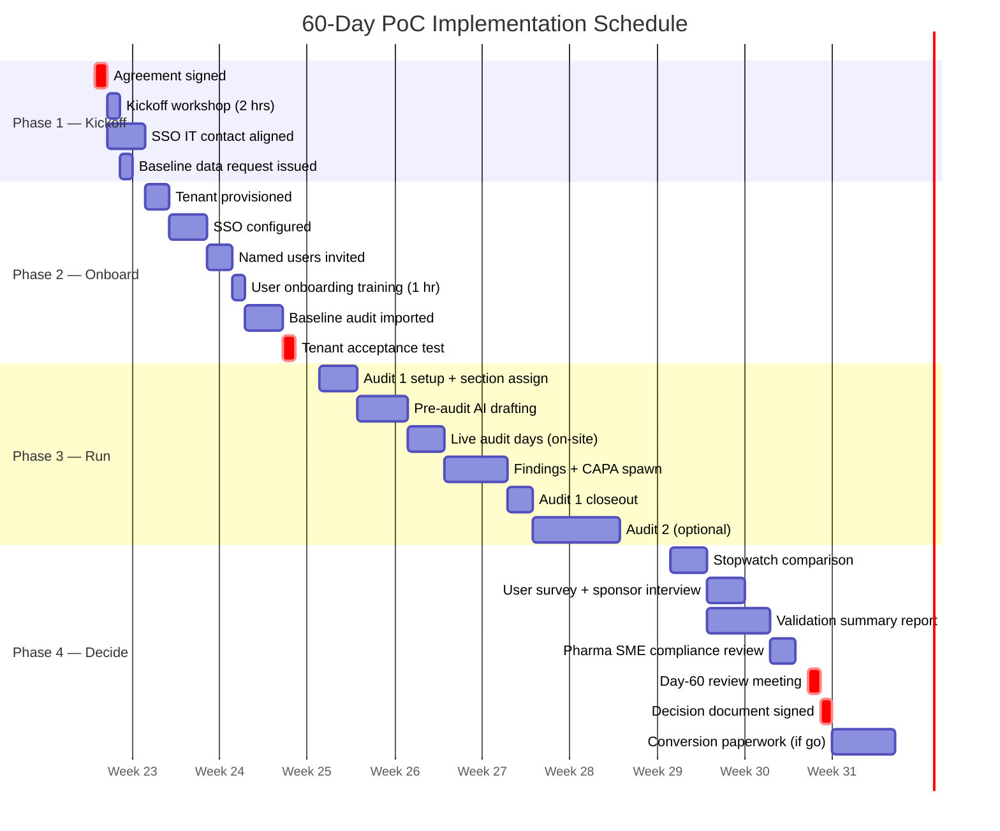
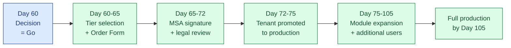

# Proof of Concept — Implementation Plan

## S.M.A.R.T. Hawk AI-Native EQMS Platform · 60-Day Engagement

---

> **Prepared for**
> `[CUSTOMER LEGAL NAME]`
> `[CUSTOMER ADDRESS]`
>
> **Prepared by**
> S.M.A.R.T. Hawk Transact Pvt. Ltd.
>
> **Reference:** `HK-POC-IMP-[YYYY-MM]-[NNN]`
> **Date issued:** `[DATE]`
> **Pairs with:** Proposal `HK-POC-[YYYY-MM]-[NNN]` and the PoC Agreement
> **Confidential** — for the sole use of the addressee

---

## Purpose of this Document

This Implementation Plan describes how the 60-day Proof of Concept will be executed: the week-by-week schedule, the deliverables and acceptance criteria, the responsibilities of each party, the access and tools required, the communication cadence, and the risks tracked throughout the engagement.

It is intended to be read alongside the **Proposal** (which sets out the offer) and the **PoC Agreement** (which sets out the binding terms). In case of conflict between this Plan and the PoC Agreement, the PoC Agreement controls.

---

## Table of Contents

1. Project Overview
2. Engagement Phases
3. Detailed Schedule
4. Deliverables & Acceptance Criteria
5. RACI Matrix
6. Communication Plan
7. Tools, Access & Pre-Requisites
8. Risk Register
9. Issue & Change Management
10. Quality Gates
11. Onboarding Checklist
12. Day-60 Decision Procedure
13. Post-PoC Transition

---

## 1. Project Overview

| Element | Detail |
|---|---|
| Project name | `[CUSTOMER NAME]` S.M.A.R.T. Hawk PoC |
| Duration | 60 calendar days from Effective Date |
| Effective Date | `[YYYY-MM-DD]` |
| PoC end date (Day 60) | `[YYYY-MM-DD]` |
| Conversion-window closes (Day 74) | `[YYYY-MM-DD]` |
| Project sponsor (`[CUSTOMER NAME]`) | `[SPONSOR NAME, TITLE]` |
| Project lead (`[CUSTOMER NAME]`) | `[LEAD NAME, TITLE]` |
| Engagement lead (S.M.A.R.T. Hawk) | `[FOUNDER NAME]`, Founder & CEO |
| Customer Success Engineer (S.M.A.R.T. Hawk) | `[CS ENGINEER NAME]` |
| Pharma SME Consultant (S.M.A.R.T. Hawk) | `[SME NAME, CREDENTIALS]` |
| Slack/Teams channel | Provisioned at kickoff |
| Status meeting cadence | Weekly 30-minute checkpoint (day/time agreed at kickoff) |

---

## 2. Engagement Phases

The PoC runs in four sequential phases. Each phase has a defined entry condition, a primary outcome, and an exit gate.

```mermaid
flowchart LR
    classDef phase1 fill:#FEE2E2,stroke:#B91C1C,color:#7F1D1D
    classDef phase2 fill:#FEF3C7,stroke:#92400E,color:#78350F
    classDef phase3 fill:#DBEAFE,stroke:#1E40AF,color:#1E3A8A
    classDef phase4 fill:#DCFCE7,stroke:#15803D,color:#14532D
    classDef gate fill:#F3E8FF,stroke:#7C3AED,color:#581C87

    P1["<b>Phase 1<br/>KICKOFF</b><br/>Week 0"]:::phase1
    G1["Gate 1<br/>Scope locked<br/>+ team confirmed"]:::gate
    P2["<b>Phase 2<br/>ONBOARD</b><br/>Weeks 1-2"]:::phase2
    G2["Gate 2<br/>Tenant live<br/>+ users active"]:::gate
    P3["<b>Phase 3<br/>RUN</b><br/>Weeks 3-6"]:::phase3
    G3["Gate 3<br/>Real audits<br/>completed"]:::gate
    P4["<b>Phase 4<br/>DECIDE</b><br/>Weeks 7-8"]:::phase4
    G4["Gate 4<br/>Decision<br/>document signed"]:::gate

    P1 --> G1 --> P2 --> G2 --> P3 --> G3 --> P4 --> G4
```

| Phase | Weeks | Entry condition | Primary outcome | Exit gate |
|---|---|---|---|---|
| 1 — Kickoff | Week 0 | Agreement signed | Scope and team locked at kickoff workshop | Kickoff minutes co-signed |
| 2 — Onboard | Weeks 1-2 | Gate 1 cleared | Platform ready for production use by `[CUSTOMER NAME]` users | Tenant acceptance test signed off |
| 3 — Run | Weeks 3-6 | Gate 2 cleared | 1-2 real audits completed end-to-end on the platform | Audit closeout reports issued |
| 4 — Decide | Weeks 7-8 | Gate 3 cleared | Day-60 decision: Go · Extend · No-Go | Decision document co-signed |

---

## 3. Detailed Schedule

### 3.1 Gantt overview

### 3.2 Week-by-week schedule

| Week | Calendar dates | Activities | Owner | Deliverable |
|---|---|---|---|---|
| **0** | `[DATES]` | Agreement signed · Kickoff workshop · SSO IT contact aligned · Baseline data request issued | Joint | Kickoff minutes; Success criteria document |
| **1** | `[DATES]` | Tenant provisioned · SSO configured · Named users invited · User onboarding training (1-hour live session) | S.M.A.R.T. Hawk | Tenant access confirmation; Training attendance log |
| **2** | `[DATES]` | Baseline audit imported · Tenant acceptance test executed · Pharma SME compliance review (session 1) | S.M.A.R.T. Hawk | Tenant acceptance test report; Compliance posture review note |
| **3** | `[DATES]` | Audit 1 kicked off in platform · Section assignments made · Pre-audit AI drafting begins | Joint | Audit 1 plan document |
| **4** | `[DATES]` | Pre-audit pack completed · Live audit days conducted | Joint | Audit 1 evidence pack |
| **5** | `[DATES]` | Audit 1 findings drafted with AI assistance · CAPAs spawned · E-signatures applied | Joint | Audit 1 findings report |
| **6** | `[DATES]` | Audit 1 closeout · Audit 2 kicked off (if scheduled) | Joint | Audit 1 closeout certificate |
| **7** | `[DATES]` | Stopwatch comparison vs baseline · User survey deployed · Validation summary report drafted · Pharma SME review (session 2) | S.M.A.R.T. Hawk | Stopwatch report; Survey results; Validation summary report |
| **8** | `[DATES]` | Day-60 review meeting · Decision document signed · (if go) Conversion paperwork begins | Joint | Day-60 decision document |

### 3.3 Critical path

The critical path (activities whose slippage directly delays the Day-60 review):

1. Agreement signing → Kickoff workshop (must happen Week 0)
2. SSO configuration → User onboarding (must complete by end of Week 1)
3. Baseline audit import (must complete by end of Week 2)
4. Audit 1 live days (must complete by end of Week 5)
5. Validation summary report (must complete by end of Week 7)
6. Day-60 review meeting (must happen Week 8)

Any 3+ day slippage on a critical-path activity triggers a re-plan conversation at the next weekly checkpoint.

---

## 4. Deliverables & Acceptance Criteria

| # | Deliverable | Owner | Due | Acceptance criterion |
|---|---|---|---|---|
| D1 | Kickoff minutes | S.M.A.R.T. Hawk | End of Week 0 | Co-signed by Sponsor and Founder Lead |
| D2 | Success criteria document (with locked targets) | S.M.A.R.T. Hawk | End of Week 0 | Co-signed by Sponsor and Founder Lead |
| D3 | Tenant provisioned with SSO | S.M.A.R.T. Hawk | End of Week 1 | All named users log in successfully via SSO |
| D4 | User onboarding training delivered | S.M.A.R.T. Hawk | End of Week 1 | All named users attend or receive recording within 48 hrs |
| D5 | Baseline audit imported | S.M.A.R.T. Hawk | End of Week 2 | `[CUSTOMER NAME]` PoC Lead confirms data fidelity |
| D6 | Tenant acceptance test report | S.M.A.R.T. Hawk | End of Week 2 | PoC Lead signs off on functional readiness |
| D7 | Pharma SME compliance review note (session 1) | S.M.A.R.T. Hawk | End of Week 2 | Note delivered to Sponsor |
| D8 | Audit 1 plan document | Joint | End of Week 3 | PoC Lead signs off |
| D9 | Audit 1 evidence pack | Joint | End of Week 4 | Pack passes platform-level validation (no broken links, all e-sigs applied) |
| D10 | Audit 1 findings report | Joint | End of Week 5 | All findings cite source · all signed · CAPAs spawned |
| D11 | Audit 1 closeout certificate | Joint | End of Week 6 | Issued by platform, signed by both parties |
| D12 | Stopwatch comparison report | S.M.A.R.T. Hawk | End of Week 7 | Methodology agreed at kickoff · raw data provided |
| D13 | User survey results | S.M.A.R.T. Hawk | End of Week 7 | All 5 PoC users surveyed · raw responses provided |
| D14 | Validation summary report (GAMP 5 Cat 4 supplier-leveraged) | S.M.A.R.T. Hawk | End of Week 7 | Covers 21 CFR Part 11 (clause-level: §11.10 · §11.50 · §11.70 · §11.100 · §11.200 · §11.300) · EU GMP Annex 11 (all 17 clauses) · MHRA/WHO ALCOA+ (9 attributes) · FDA CSA risk-based assurance · GAMP 5 Cat 4 Validation Accelerator Package |
| D15 | Pharma SME compliance review note (session 2) | S.M.A.R.T. Hawk | End of Week 7 | Note delivered to Sponsor |
| D16 | Day-60 decision document | Joint | End of Week 8 | Co-signed by Sponsor and Founder Lead |
| D17 | (If no-go) Data export package | S.M.A.R.T. Hawk | Within 7 business days of decision | Includes PDF (audit-trail-grade) + CSV (raw) + signed manifest |
| D18 | (If go) Master Services Agreement & Order Form | Joint | Within 14 calendar days of decision | Executed by both parties |

---

## 5. RACI Matrix

**Legend:** R = Responsible (does the work) · A = Accountable (signs off) · C = Consulted · I = Informed

| Activity | Sponsor (`[CUSTOMER NAME]`) | PoC Lead (`[CUSTOMER NAME]`) | Named Users (`[CUSTOMER NAME]`) | IT/InfoSec (`[CUSTOMER NAME]`) | Founder Lead (S.M.A.R.T. Hawk) | CS Engineer (S.M.A.R.T. Hawk) | Pharma SME (S.M.A.R.T. Hawk) |
|---|---|---|---|---|---|---|---|
| Sign PoC Agreement | A | C | I | C | A | I | I |
| Attend kickoff workshop | A | R | I | C | A | R | C |
| Lock success criteria | A | R | C | I | A | C | C |
| Designate named users | A | R | I | I | I | C | I |
| SSO configuration | I | C | I | R | I | A | I |
| Tenant provisioning | I | I | I | I | I | R/A | I |
| User onboarding training | I | R | A | I | I | R | I |
| Baseline audit data provision | A | R | C | I | I | C | I |
| Baseline audit import | I | C | I | I | I | R/A | I |
| Audit 1 execution | I | A | R | I | I | C | C |
| Pre-audit AI drafting | I | C | R | I | I | C | I |
| Findings drafting & e-signing | I | A | R | I | I | C | C |
| CAPA spawning | I | A | R | I | I | C | I |
| Stopwatch measurement | I | C | C | I | I | R/A | I |
| User survey | A | C | R | I | I | R | I |
| Validation summary report | A | C | I | C | A | C | R |
| Pharma SME sessions | I | C | I | I | A | C | R |
| Weekly checkpoints | C | R | I | I | A | R | I |
| Slack/Teams support | C | R | R | C | C | R/A | C |
| Day-60 review meeting | A | R | C | I | A | R | C |
| Decision document signing | A | C | I | I | A | I | I |
| Data export (if no-go) | A | C | I | C | A | R | I |
| Conversion paperwork (if go) | A | C | I | C | A | C | I |

---

## 6. Communication Plan

| Channel | Purpose | Frequency | Participants |
|---|---|---|---|
| Slack/Teams dedicated channel | Day-to-day questions, blockers, ad-hoc support | Continuous | PoC Lead + Named Users + CS Engineer + Founder Lead |
| Weekly checkpoint call (30 min) | Status update, blockers, decisions for the week ahead | Weekly (Weeks 1-8) | PoC Lead + CS Engineer + (occasionally) Sponsor and Founder Lead |
| Pharma SME sessions | Compliance posture review | Twice (Week 2 · Week 7) | Sponsor + PoC Lead + Pharma SME |
| Escalation hotline | P1 incidents (platform unreachable during audit) | On-demand | PoC Lead → CS Engineer / Founder Lead |
| Founder direct line | Escalation, commercial discussion, strategic question | On-demand | Sponsor / PoC Lead ↔ Founder Lead |
| Day-60 review (90 min) | Joint review of all success criteria · decision | Once (Week 8) | Sponsor + PoC Lead + (optionally) IT/InfoSec + Founder Lead + CS Engineer + (optionally) Pharma SME |
| End-of-PoC anonymous survey | Capture user sentiment for Criterion 5 | Once (Week 7) | All Named Users |

### 6.1 Reporting cadence

| Report | Author | Recipient | Cadence |
|---|---|---|---|
| Weekly status email | CS Engineer | PoC Lead + Sponsor | Friday of each week |
| Audit closeout certificate | Platform (automated) | PoC Lead + Sponsor | At each audit closeout |
| Stopwatch comparison report | CS Engineer | PoC Lead + Sponsor | End of Week 7 |
| Validation summary report | CS Engineer + Pharma SME | Sponsor + PoC Lead + IT/InfoSec | End of Week 7 |
| Day-60 decision document | Joint | Sponsor + Founder Lead | End of Week 8 |

---

## 7. Tools, Access & Pre-Requisites

### 7.1 What `[CUSTOMER NAME]` will provide

| Item | Required by | Provided by | Notes |
|---|---|---|---|
| Designated PoC site name | Kickoff | Sponsor | Single site for PoC |
| Named user list (up to 5, with email + role) | End of Week 0 | PoC Lead | Used for SSO provisioning |
| IT/InfoSec contact | End of Week 0 | Sponsor | For SSO configuration |
| SSO metadata (SAML or OIDC) | End of Week 1 | IT/InfoSec | Provided to CS Engineer |
| One historical supplier audit (PDFs, evidence, findings) | End of Week 2 | PoC Lead | For baseline benchmark |
| Baseline measurement data | End of Week 1 | PoC Lead | Hours by role, tools used, friction points |
| At least one real supplier audit scheduled within Weeks 3-6 | Confirmed at kickoff | Sponsor | Critical-path dependency |
| Slack or Teams account access for CS Engineer | End of Week 0 | PoC Lead | Or S.M.A.R.T. Hawk-hosted channel acceptable |
| NDA + Data Processing Agreement signed | Kickoff | Sponsor (legal) | Executed alongside PoC Agreement |

### 7.2 What S.M.A.R.T. Hawk will provide

| Item | Provided by | When |
|---|---|---|
| S.M.A.R.T. Hawk platform tenant (dedicated for PoC) | CS Engineer | End of Week 1 |
| Named user accounts (up to 5) | CS Engineer | End of Week 1 |
| AI credits (25,000) | CS Engineer | Pre-loaded at tenant provisioning |
| Onboarding training session (1 hour, live) | CS Engineer | End of Week 1 |
| Slack/Teams support channel | CS Engineer | Week 0 |
| Documentation access (User Guide, Admin Guide, API Reference) | CS Engineer | Week 0 |
| One custom integration (up to 16 engineering hours) | CS Engineer + S.M.A.R.T. Hawk Engineering | If requested at kickoff, delivered by Week 4 |
| Pharma SME consultancy (2 sessions) | Pharma SME | Week 2 · Week 7 |
| **GAMP 5 Cat 4 Validation Accelerator Package** (Vendor Quality Manual · SDLC evidence · FRS + Configuration Specification · IQ/OQ scripts · annual pentest summary · Vendor Assessment Questionnaire · Release Notes per version) | CS Engineer | Week 0 (at kickoff) |
| Validation summary report | CS Engineer + Pharma SME | End of Week 7 |
| Data export package (at PoC end) | CS Engineer | Within 7 business days of Day-60 |

### 7.3 Pre-PoC checklist (to complete before Effective Date)

| ✓ | Item | Owner |
|---|---|---|
| ☐ | PoC Agreement signed by both parties | Joint legal |
| ☐ | Mutual NDA signed | Joint legal |
| ☐ | Data Processing Agreement signed | Joint legal |
| ☐ | Kickoff workshop scheduled | Joint |
| ☐ | At least one real supplier audit confirmed within Weeks 3-6 | Sponsor |
| ☐ | IT/InfoSec contact identified | Sponsor |
| ☐ | Founder Lead direct contact details exchanged | Joint |
| ☐ | S.M.A.R.T. Hawk InfoSec questionnaire returned (if requested) | S.M.A.R.T. Hawk |

---

## 8. Risk Register

| # | Risk | Likelihood | Impact | Owner | Mitigation | Contingency |
|---|---|---|---|---|---|---|
| R1 | Scheduled real audit slips beyond Week 6 | Medium | High | PoC Lead | Confirm audit calendar at kickoff · weekly schedule review | 30-day extension included at no cost |
| R2 | SSO configuration delayed beyond Week 1 | Medium | Medium | IT/InfoSec | Engage IT/InfoSec at kickoff · pre-flight test | Local auth fallback for PoC duration |
| R3 | Baseline audit data unavailable | Low | High | PoC Lead | Identify baseline at kickoff | Use industry-benchmark default for measurement |
| R4 | Named users unavailable due to competing work | Medium | Medium | Sponsor | Weekly checkpoints surface adoption gaps | Substitute named users with Sponsor approval |
| R5 | AI generation produces inaccurate citation | Very Low | Very High | S.M.A.R.T. Hawk Engineering | Cite-or-fallback by design | Immediate platform-wide review · written incident report |
| R6 | Platform outage during scheduled audit | Very Low | High | S.M.A.R.T. Hawk Engineering | 99.5% SLA · daily backups · emergency hotline | Backup PDF export at any moment |
| R7 | Custom integration scope exceeds 16 hours | Medium | Low | CS Engineer | Scope at kickoff · early estimation | Defer integration to post-conversion |
| R8 | `[CUSTOMER NAME]` IT/InfoSec rejects deployment posture | Low | High | S.M.A.R.T. Hawk | InfoSec questionnaire pre-filled · architecture review on request | On-prem deployment available post-conversion |
| R9 | Regulator visit during PoC | Low | Medium | Sponsor | PoC data is parallel to production records | Pharma SME on standby to assist `[CUSTOMER NAME]` |
| R10 | Decision delayed past Day 74 | Medium | Medium (loss of conversion benefits) | Sponsor | Day-60 review forcing function · clear conversion window | Negotiated case-by-case extension |

Risks R1-R10 are reviewed at every weekly checkpoint. New risks identified during the PoC are added to the register with the next status email.

---

## 9. Issue & Change Management

### 9.1 Issue logging

All issues (defects, blockers, questions) are logged in the dedicated Slack/Teams channel with a brief description, severity, and impact. Severity definitions:

| Severity | Definition | Response SLA |
|---|---|---|
| P1 — Critical | Platform unreachable · cannot complete scheduled audit | 4 business hours acknowledgement |
| P2 — High | Major feature broken · workaround painful | Next business day |
| P3 — Medium | Minor feature broken · workaround acceptable | Within the week |
| P4 — Low | Cosmetic · enhancement request | Logged for backlog |

### 9.2 Change management

Any change to PoC scope, success criteria, or timeline requires:

1. A written change request in the Slack/Teams channel by either party
2. Joint review at the next weekly checkpoint (or sooner if urgent)
3. Co-signature by Sponsor and Founder Lead in the form of an updated kickoff minutes addendum
4. Update to this Implementation Plan as a versioned amendment

Changes that increase S.M.A.R.T. Hawk's cost burden (e.g., second custom integration, additional sites) may require commercial discussion before approval.

---

## 10. Quality Gates

Each phase concludes with a quality gate. Both parties must agree the gate is passed before the next phase begins.

| Gate | Phase exit | Pass criteria | Approver |
|---|---|---|---|
| Gate 1 | Kickoff | Scope locked · success criteria signed · team confirmed · access pre-reqs identified | Sponsor + Founder Lead |
| Gate 2 | Onboard | Tenant live · all named users active · baseline imported · acceptance test signed | PoC Lead + CS Engineer |
| Gate 3 | Run | At least one real audit completed end-to-end · all deliverables D8-D11 accepted | PoC Lead + CS Engineer |
| Gate 4 | Decide | All measurements complete · validation report delivered · Day-60 review held · decision document signed | Sponsor + Founder Lead |

If a gate is not passed, the parties hold a special review meeting within 5 business days to agree corrective action or trigger the change-management process.

---

## 11. Onboarding Checklist

The CS Engineer drives this checklist through Phase 2. The PoC Lead validates completion at the Gate 2 acceptance test.

| ✓ | Item |
|---|---|
| ☐ | Tenant provisioned in elected region (India / US / EU) |
| ☐ | SSO metadata exchanged and tested |
| ☐ | All 5 named users invited and have logged in |
| ☐ | Role assignments completed (QA Head, QA Analyst, Auditor, Auditee, IT) |
| ☐ | Onboarding training session delivered and recording shared |
| ☐ | Slack/Teams channel active with all parties |
| ☐ | Documentation access provided (User Guide, Admin Guide, API Reference) |
| ☐ | Baseline audit imported and validated |
| ☐ | Compliance posture review note (session 1) delivered |
| ☐ | Audit 1 calendar confirmed with assigned auditor and auditee |
| ☐ | Custom integration (if in scope) kicked off |
| ☐ | Gate 2 acceptance test executed and signed |

---

## 12. Day-60 Decision Procedure

### 12.1 Day-60 review meeting

- **Date:** `[YYYY-MM-DD]` (Day 60 of Effective Date)
- **Duration:** 90 minutes
- **Format:** Video conference or in-person at `[CUSTOMER NAME]` office
- **Required attendees:** Sponsor · PoC Lead · Founder Lead · CS Engineer
- **Optional attendees:** IT/InfoSec representative · Pharma SME Consultant

### 12.2 Agenda

| Time | Item | Owner |
|---|---|---|
| 0:00 – 0:05 | Welcome and meeting objectives | Founder Lead |
| 0:05 – 0:35 | Walk-through of all 6 success criteria with measured data | CS Engineer |
| 0:35 – 0:50 | Open issues and risks identified during PoC | Joint |
| 0:50 – 1:10 | Commercial conversion options (if applicable) | Founder Lead |
| 1:10 – 1:25 | Decision: Go · Extend · No-Go | Sponsor |
| 1:25 – 1:30 | Action items and signatures | Joint |

### 12.3 Decision outcomes

| Outcome | Trigger | Next step | Timeline |
|---|---|---|---|
| **Go** | All non-adjustable criteria met · ≤2 adjustable criteria below floor | Conversion paperwork begins | Master Services Agreement & Order Form signed within 14 calendar days |
| **Extend** | 4-5 of 6 criteria met · gap is closable | 30-day no-cost extension · re-run Day-60 review | New Day-60 date set |
| **No-Go** | More than 2 criteria below floor · or any non-adjustable criterion failed | Data export · amicable wind-down | Export delivered within 7 business days |

### 12.4 Decision document

The Day-60 decision is captured in a one-page Decision Document signed by both parties, recording:

- The measured value of each success criterion against its target
- The outcome (Go · Extend · No-Go)
- Next-step ownership and dates
- Any open commitments

---

## 13. Post-PoC Transition

### 13.1 If the decision is "Go"

### 13.2 If the decision is "Extend"

| Step | Owner | Duration |
|---|---|---|
| Agree gap-closure plan in writing | Joint | 1-2 days |
| Execute extension (typically focuses on the failed criterion) | Joint | 30 days |
| Re-run Day-60 review with same agenda | Joint | 1 day |

### 13.3 If the decision is "No-Go"

| Step | Owner | Duration |
|---|---|---|
| Data export package prepared (PDF + CSV + audit-trail manifest) | S.M.A.R.T. Hawk | Within 7 business days |
| Export package delivered via SFTP or secure download link | S.M.A.R.T. Hawk | On day 7 |
| `[CUSTOMER NAME]` confirms successful download | PoC Lead | Within 14 days |
| (If requested) Hard-deletion of all data including backups | S.M.A.R.T. Hawk | Within 30 calendar days |
| Certificate of deletion provided | S.M.A.R.T. Hawk | At deletion |
| Optional 30-minute feedback debrief | Joint | At `[CUSTOMER NAME]`'s convenience |

---

## Companion Documents

This Implementation Plan is one of three documents constituting the complete PoC engagement package:

1. **Proposal** — the offer and rationale
2. **This Implementation Plan** — execution detail (you are reading it)
3. **PoC Agreement** — binding contractual terms

Mutual Non-Disclosure Agreement and Data Processing Agreement are provided as separate documents.

---

## Contact

For questions on this Implementation Plan or any aspect of the PoC execution, please contact:

| Role | Name | Contact |
|---|---|---|
| Engagement Lead (S.M.A.R.T. Hawk) | `[FOUNDER NAME]` | `[FOUNDER EMAIL]` · `[FOUNDER PHONE]` |
| Customer Success Engineer (S.M.A.R.T. Hawk) | `[CS ENGINEER NAME]` | `[CS EMAIL]` |
| PoC Lead (`[CUSTOMER NAME]`) | `[POC LEAD NAME]` | `[POC LEAD EMAIL]` |

---

## Document Acceptance

By signing below, `[CUSTOMER NAME]` acknowledges receipt and review of this Implementation Plan and agrees to the responsibilities, deliverables, and schedule set out herein, subject to the binding terms of the PoC Agreement.

| For `[CUSTOMER NAME]` | For S.M.A.R.T. Hawk Transact Pvt. Ltd. |
|---|---|
| **Name:** `[POC LEAD NAME]` | **Name:** `[FOUNDER NAME]` |
| **Title:** PoC Lead | **Title:** Founder & CEO |
| **Signature:** _______________________ | **Signature:** _______________________ |
| **Date:** ___________________________ | **Date:** ___________________________ |

---

*S.M.A.R.T. Hawk Transact Pvt. Ltd. · Implementation Plan HK-POC-IMP-`[YYYY-MM]`-`[NNN]` · `[DATE ISSUED]` · Confidential*
