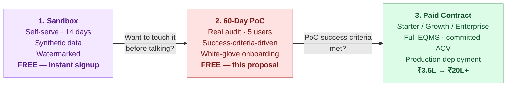
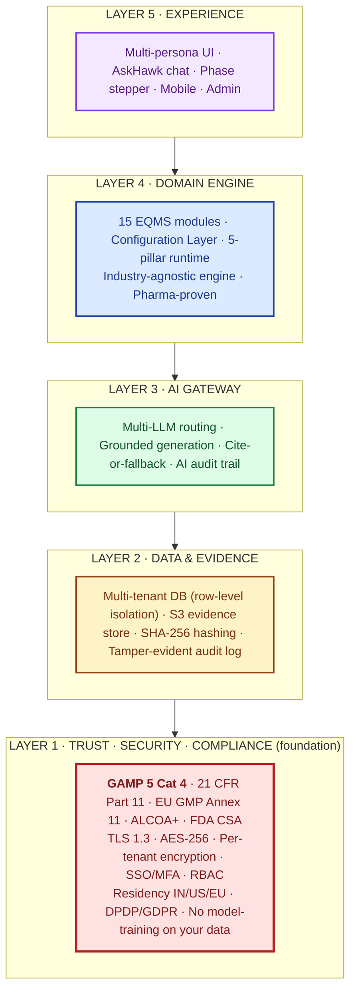
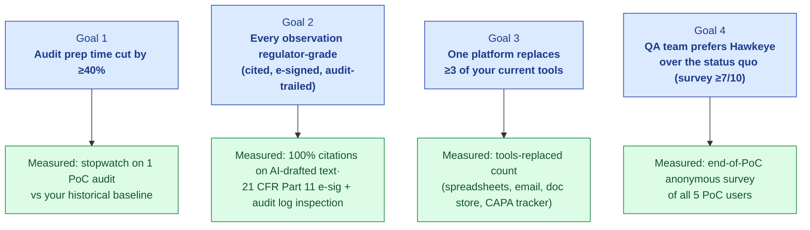
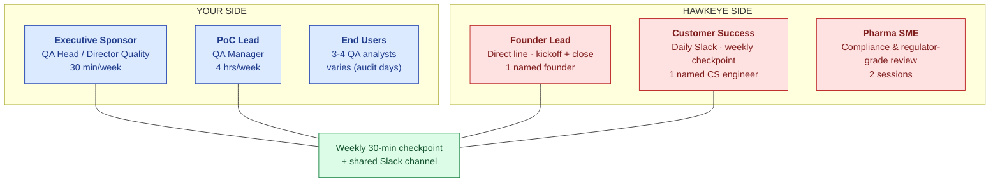
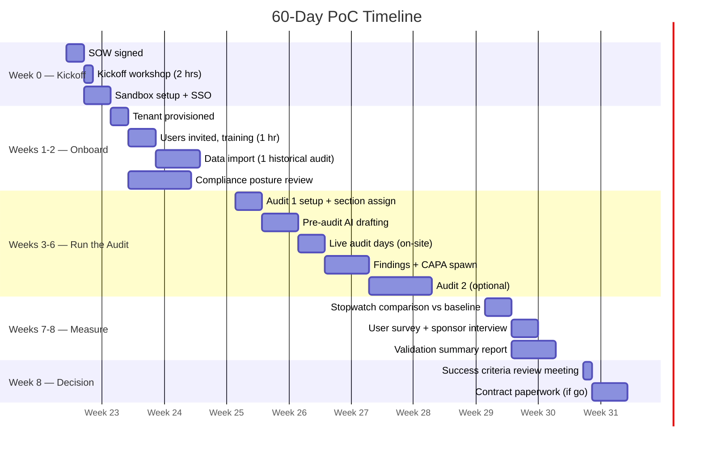
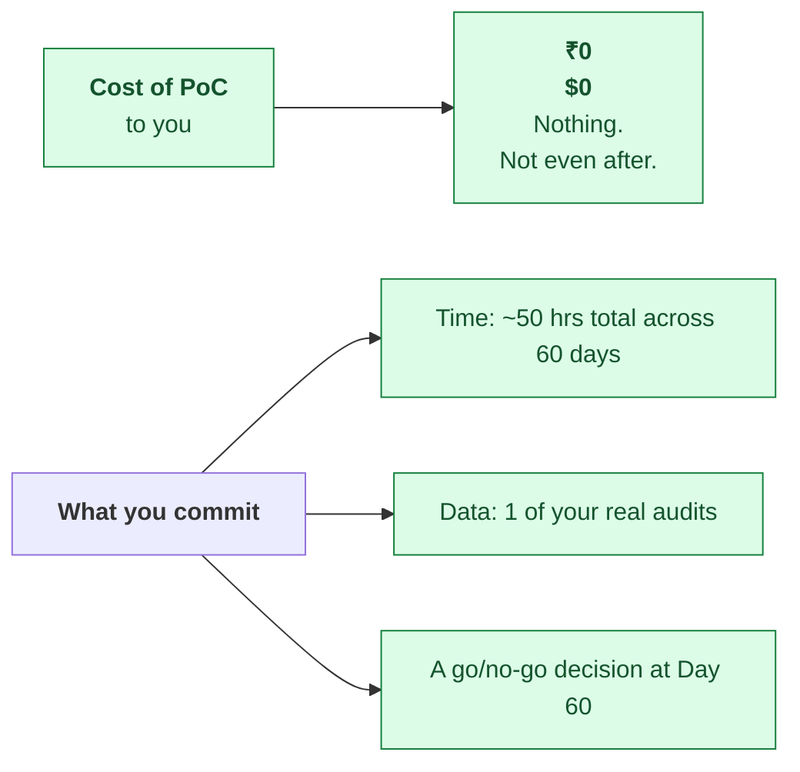
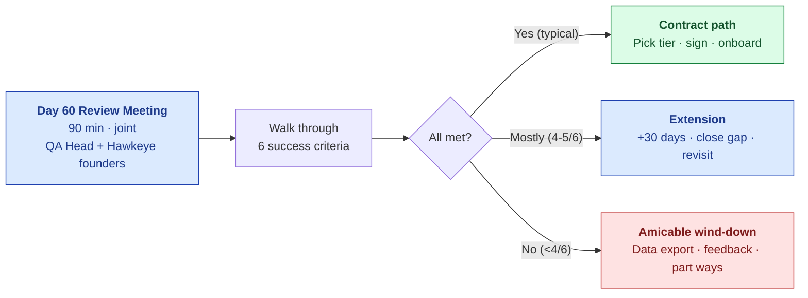
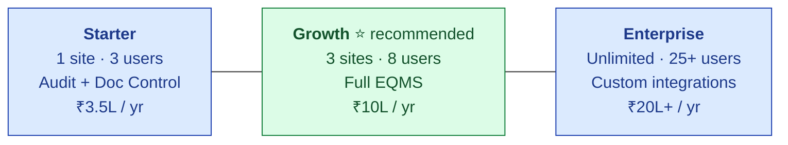
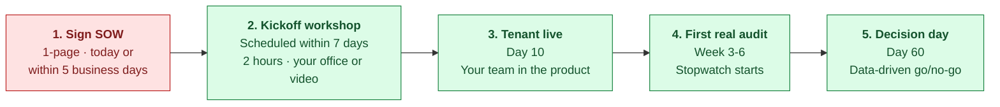

# 60-Day Proof of Concept

## Hawkeye AI-Native EQMS Platform

> **Prepared for:** `[CUSTOMER NAME]`
> **Prepared by:** Hawkeye Transact Pvt. Ltd.
> **Date:** `[DATE]`
> **Companion documents:** Proposal · Implementation Plan · PoC Agreement
> **Confidential** — for the sole use of the addressee

---

## 1. Stop Demoing. Start Proving.

> 💡 **The opener.** You've seen the demo. You've seen the screens. You probably have one question left: *will this actually work on MY audits, with MY suppliers, in MY regulator's eyes?* That is not a question we can answer with another demo. It is a question we answer with **one of your real audits, on Hawkeye, in the next 60 days — at zero cost to you.**

This deck is the proposal for that. By slide 18, you'll have:

| What you walk away with |
|---|
| 1. A clear scope: which audits, which modules, which users |
| 2. Measurable success criteria that *you* set |
| 3. A 60-day timeline with weekly checkpoints |
| 4. Zero financial commitment — no contract until success criteria are met |
| 5. A one-page SOW you can sign in the room |

*Slide 1 / 18*

---

## 2. The Three Ways to Try Hawkeye

| Lane | For whom | Time | Data | Cost |
|---|---|---|---|---|
| **Sandbox** | Explorers who want to click around first | 14 days | Synthetic / your test data only | **Free** · sign up in 60 sec |
| **60-Day PoC** *(this deck)* | Qualified prospects with real audit pain | 60 days | Your real supplier audit data | **Free** · we invest in your success |
| **Paid Contract** | Customers ready to deploy across team | 1-3 yrs | Production | ₹3.5L–₹20L+/yr |

> ℹ️ **Most customers come straight to the PoC** — they've already seen the demo, asked the hard questions, and want to prove the ROI on their own data. The Sandbox is for the curious. The PoC is for the serious.

*Slide 2 / 18*

---

## 3. The Pain You Came In With

A representative Tier-3 CDMO — your size, your audit volume:

| Pain | ₹ per year | $ per year |
|---|---|---|
| Audit prep time (5 QA × 30 audits × 4 days × ₹10K/day) | ₹60L | $72K |
| Audit response + CAPA tracking (manual) | ₹18L | $22K |
| External audit-prep consultants | ₹6–15L | $7–18K |
| Cost of audit findings + remediation (~1 critical/yr) | ₹5–25L | $6–30K |
| **Total annual quality cost** | **~₹95L** | **~$115K** |

**The PoC's job: prove we can cut 40% of this for you, on one of your real audits, in 60 days.**

*Slide 3 / 18*

---

## 4. What Hawkeye Is — the 5-Layer Architecture

> 💡 **Trust is Layer 1.** In a regulated industry, security is not a feature — it is the substrate. Everything higher in the stack depends on it.

The 5-pillar runtime (orthogonal — lives inside Layer 4): every module walks **Collect → Process → Validate → Report → Seal** end to end, with cite-or-fallback at every AI touchpoint and a human e-signature gating every record commit.

*Slide 4 / 18*

---

## 5. The Five Value Propositions

| # | Value | Quantified outcome | Validated by |
|---|---|---|---|
| 1 | **40% audit-prep cost reduction** | Payback < 4 months · ₹38L savings on ₹95L baseline | Measured on YOUR real audits during this PoC |
| 2 | **GAMP 5 Category 4 configured product** | ~60% less validation effort vs Cat 5 bespoke | ISPE GAMP 5 2nd Ed (Jul 2022) · FDA CSA Final (Sep 2025) |
| 3 | **Part 11 + Annex 11 + ALCOA+ by design** | 100% e-sig attribute coverage · 9 ALCOA+ attributes designed-in · tamper-evident audit trail | 21 CFR §11.10/§11.50/§11.200 · EU GMP Annex 11 · MHRA 2018 |
| 4 | **Trust-First Layer 1 architecture** | Per-tenant isolation · zero AI-training on your data · IN/US/EU residency · DPDP/GDPR | India DPDP 2023 · IBM 2025: healthcare breach avg $7.42M |
| 5 | **Cite-or-fallback grounded AI** | 100% of AI claims trace to source · zero hallucinated citations | FDA GMLP 10 Principles · EMA AI Reflection Paper (Sept 2024) |

> 💡 **In one sentence each.** (1) Pays for itself in under four months. (2) Cuts your validation burden by more than half versus custom. (3) Passes FDA / EMA / MHRA inspection by design. (4) Your data never trains anyone's model and stays in the region you choose. (5) The AI never fabricates a citation — ever.

*Slide 5 / 18*

---

## 6. GAMP Cat 4 — Why This Saves You ~60% Validation Effort

Hawkeye is a **GAMP 5 Category 4 configured product** (ISPE *GAMP 5 Guide, 2nd Edition*, Jul 2022). The same category as Veeva Vault QMS, MasterControl, TrackWise.

| | Cat 3 — non-configured | **Cat 4 — Hawkeye** | Cat 5 — custom/bespoke |
|---|---|---|---|
| Validation effort | Install + UAT | **URS + risk + IQ/OQ/PQ of configuration** | Full SDLC + source review + V-model |
| Vendor SDLC evidence leveraged | Minimal | **Extensive** (per GAMP supplier-leverage + FDA CSA) | Limited |
| YOUR effort vs Cat 5 | n/a | **~60% less** | Baseline |

**The Validation Accelerator Package Hawkeye ships to you** — used to satisfy GAMP Cat 4 supplier-leveraged validation:

| | Deliverable |
|---|---|
| 1 | Vendor Quality Manual |
| 2 | SDLC evidence (coding standards · peer review · version control · release process) |
| 3 | Functional Specification + Configuration Specification |
| 4 | IQ/OQ scripts (pre-executed against the vendor product) |
| 5 | Annual penetration test summary + SAST/Dependabot evidence |
| 6 | Release Notes per version (change classification: functional · security · cosmetic) |
| 7 | Vendor Assessment Questionnaire (pre-filled) |
| 8 | Periodic Vendor Audit pack (annual) |

**Part 11 clause-level conformance — the four most-cited 483 themes addressed by design:**

| 483 theme (top FDA observations 2023–2025) | Hawkeye built-in defence |
|---|---|
| Missing / disabled / non-reviewed audit trails | §11.10(e) audit trail cannot be disabled by any role; reviewer prompt at batch release |
| Shared / generic logins | §11.100 unique-to-individual; SSO + MFA from Day 1 |
| Deletable / overwriteable raw data | Versions append, never overwrite; per-record SHA-256 + ALCOA+ append-only |
| Audit trail not reviewed at batch release | "Review audit trail" e-signature gate built into release workflow |

> 💡 **Industry context (FDA enforcement 2024):** 105 drug-quality Warning Letters — up 11% YoY. ~60% of CDER WLs 2021-2024 cite data integrity, the bulk mapping to Part 11. **This is the #1 inspection risk your team faces. Hawkeye's Layer 1 enforcement is your defence.**

> 📘 **Detailed compliance evidence available.** See **[GAMP-CAT-4-BRIEF.md](./GAMP-CAT-4-BRIEF.md)** (8-page customer brief) and the full **[GAMP-CAT-4-COMPLIANCE.md](../../08-compliance-regulatory/GAMP-CAT-4-COMPLIANCE.md)** (~25-page canonical reference) — both delivered with this proposal.

*Slide 6 / 18*

---

## 7. What the PoC Will Prove

> 💡 **You set the targets.** During PoC kickoff (Week 0), we agree on the specific thresholds. If we don't hit them, we don't ask you to sign. That's the whole deal.

*Slide 7 / 18*

---

## 8. PoC Scope — What's Included

| Dimension | Scope | Notes |
|---|---|---|
| **Modules** | Audit Management + 1 of: Document Control · CAPA · Deviation | Pick the second module at kickoff based on your highest-pain area |
| **Sites** | 1 of your real sites | Pick the most representative |
| **Users** | Up to 5 named users with full edit access | Unlimited view-only users (auditors, observers) |
| **Audits** | 1–2 real supplier audits (in-progress or scheduled) | Hosted or conducted |
| **AI credits** | 25,000 (≈ 25 audit-grade AI runs) | Sufficient for 2 audits + exploration |
| **Integrations** | SSO (SAML/OIDC) · DigiLocker import · 1 custom connector if needed | Custom connector counts as in-scope |
| **Onboarding** | 2-hour kickoff workshop + weekly 30-min checkpoints | White-glove, founder + SME consultant |
| **Support** | Slack channel + 24-hr response SLA | Dedicated PoC engineer |
| **Compliance posture** | 21 CFR Part 11 · EU GMP Annex 11 · ALCOA+ — full validation summary at PoC end | Audit-trail-grade from day 1 |

**What is NOT in scope (and why):**
- More than 2 audits — keeps measurement clean
- More than 2 modules — depth over breadth in 60 days
- Custom-built workflows — out of scope (post-conversion add-on)
- On-prem deployment — Cloud only during PoC

*Slide 8 / 18*

---

## 9. Your PoC Team — Who's on the Call

**Your total time commitment over 60 days:** PoC Lead 32 hrs · Sponsor 4 hrs · End Users on actual audit days only. **That's it.**

*Slide 9 / 18*

---

## 10. PoC Timeline — 60 Days, Week-by-Week

| Week | Milestone | Owner |
|---|---|---|
| 0 | SOW signed · kickoff scheduled | Joint |
| 1–2 | Tenant live · users onboarded · 1 historical audit imported as benchmark | Hawkeye |
| 3–6 | Real audit runs end-to-end on Hawkeye | Joint |
| 7 | Measurement: stopwatch, survey, validation summary | Hawkeye |
| 8 | Success criteria review → go / no-go → contract paperwork if go | Joint |

*Slide 10 / 18*

---

## 11. The PoC Success Criteria — You Sign This in Week 0

We agree on these together at kickoff. **If we fail to hit any of them, you walk away. No invoice. No obligation.**

| # | Criterion | Default target | Adjustable? | Measured by |
|---|---|---|---|---|
| 1 | Audit-prep time reduction | ≥40% vs your baseline | Yes (floor 25%) | Stopwatch on PoC audit vs your historical |
| 2 | Findings citation completeness | 100% of AI-drafted observations cite source | No | Inspection of findings export |
| 3 | E-sig + audit-trail compliance | 21 CFR Part 11-grade on every signed object | No | Validation summary report |
| 4 | Tools replaced (spreadsheet · email · doc store · CAPA tracker) | ≥3 of 4 | Yes (floor 2) | Count at PoC end |
| 5 | End-user preference vs status quo | ≥7/10 average across 5 PoC users | Yes (floor 6/10) | Anonymous survey |
| 6 | QA-Head go/no-go | Subjective "would you sign?" | n/a | Sponsor interview |

> ⚠️ **The asymmetry.** You commit time and audit data. We commit engineering, SME hours, and infrastructure. If success criteria are not met, we eat the loss. **That's how confident we are that the platform will earn its place.**

*Slide 11 / 18*

---

## 12. What You're Paying During the PoC

| Question we get often | Honest answer |
|---|---|
| "Is there a hidden setup fee?" | No. Even SSO setup, custom connector, and validation summary are free during PoC. |
| "What if we extend past 60 days?" | We extend by 30 days once, at no cost, if a scheduled audit slips. Beyond that, paid contract or amicable wind-down. |
| "What if we say no after the PoC?" | We help you export all your data (PDF + CSV) within 30 days. No exit fee. |
| "What if we want to pilot more audits?" | More audits stay free during the 60 days. The credits limit is the only ceiling (25K is sufficient for ~5 audits). |

*Slide 12 / 18*

---

## 13. Data, Privacy, Security, Compliance — During Your PoC

> 💡 **Why this matters.** IBM 2025 reports healthcare-sector breaches average **$7.42M** — highest of any sector for 14 years running. Cencora's Feb 2024 incident affected 15+ pharma giants. Layer 1 of Hawkeye is the architectural answer.

| Concern | How we handle it during PoC |
|---|---|
| **Data residency** | Tenant runs in India (Mumbai · default), US-East, or EU — you pick at kickoff |
| **Tenant isolation** | Multi-tenant DB with row-level isolation enforced at the query layer; your data invisible to other tenants, always |
| **Encryption** | TLS 1.3 in transit · AES-256 at rest · per-tenant encryption keys (BYOK option, Enterprise tier) |
| **Access control** | SAML/OIDC SSO from Day 1 (Okta · Azure AD · Google) · MFA enforceable · RBAC at record level |
| **Audit trail** | Every action logged: user · UTC timestamp · reason · IP · session — Part 11 §11.10(e) compliant; cannot be disabled |
| **AI training on your data** | **NEVER** — without explicit written consent. Default contractual: zero training-data use. |
| **Hallucinated AI citations** | **Impossible by design** — cite-or-fallback at Layer 3; AI returns "insufficient evidence" rather than fabricate |
| **GAMP Cat 4 evidence package** | Vendor Quality Manual + SDLC evidence + IQ/OQ scripts + pentest summary + Validation Accelerator — delivered at PoC kickoff |
| **21 CFR Part 11** | E-sig per §11.50 (name + UTC + meaning) · §11.200 two distinct components (password + reason) · §11.10(e) audit trail |
| **EU GMP Annex 11** | All 17 clauses addressed by design · validation summary report Week 7 · ready for 2026 revision + Annex 22 (AI) |
| **ALCOA+ (9 attributes)** | Attributable · Legible · Contemporaneous · Original · Accurate · Complete · Consistent · Enduring · Available — Layer 1 enforced |
| **DPDP / GDPR** | DPA signed at kickoff · India DPDP (deadline May 2027) Data Processor obligations met · GDPR-compliant EU residency option |
| **Data export at exit** | PDF (audit-trail-grade) + CSV + JSON + signed manifest within 7 business days |
| **Data deletion** | Hard-delete within 30 days of written request + signed certificate of deletion |

> ✅ **NDA + DPA + PoC Agreement signed at PoC kickoff.** All three documents bundled with the proposal package.

*Slide 13 / 18*

---

## 14. The Decision Meeting — Day 60

| Outcome | Frequency we've seen *(target)* | Next step |
|---|---|---|
| **Convert to paid** | 70%+ | Sign Growth / Starter / Enterprise contract; data migrates in place |
| **Extend PoC** | 15-20% | 30-day extension, address gap, re-decide |
| **Walk away** | <15% | Data export + feedback session; both sides leave whole |

> 💡 **No hard sell on Day 60.** The review is data-driven: we open the dashboard, we read the survey, we look at the stopwatch. The decision practically makes itself.

*Slide 14 / 18*

---

## 15. Conversion Path — From PoC to Paid

If you say yes on Day 60, here's what the contract looks like for your size:

| For a Tier-3 CDMO like you | The math |
|---|---|
| Your current annual quality cost | ~₹95L |
| Hawkeye Growth tier ACV | ₹10L |
| Hawkeye-driven savings (40%) | ~₹38L |
| **Net annual benefit (Y1)** | **~₹28L** |
| **Payback period** | **< 4 months** |

> 🎁 **PoC-to-paid bonus.** Customers who convert within 14 days of PoC close get:
> - **First-renewal-locked pricing** (Y2 cannot be more than 5% above Y1)
> - **Free data migration** (any historical EQMS data we can ingest)
> - **Reference status discount: 15% off Y1** (in exchange for being a case study after 6 months — opt-in)

*Slide 15 / 18*

---

## 16. Why Now — The Cost of Waiting

| Cost of waiting 6 months to start | Quantified |
|---|---|
| Audits you'll host in the meantime | ~15 audits at status-quo cost |
| Sunk cost in those audits at ₹2L/audit prep | ~₹30L |
| Risk window for next FDA/EU inspection | ~50% of audit calendar passes |
| Competitive risk: a customer audit goes badly | One bad audit = ~₹5-25L in remediation |
| Net cost of inaction over 6 months | **~₹30-55L** |

> 💡 **Inverted ROI.** Even if we charged you for the PoC, the cost of starting six months later would dwarf it. The PoC is free **because the inaction cost is your real enemy, not us.**

*Slide 16 / 18*

---

## 17. Risks We're Willing to Own

| Risk | How we own it |
|---|---|
| "What if your AI hallucinates an observation citation?" | **Cite-or-fallback** by design. Every AI-drafted finding must cite source; if no source, AI returns "draft requires human input" — never a fabricated citation. |
| "What if your platform goes down during my audit?" | 99.5% SLA during PoC · 24-hr emergency hotline · backup PDF export of all evidence at any moment. |
| "What if your team doesn't know pharma?" | Pharma SME (ex-USFDA inspector consultant) joins kickoff + 2 review sessions during PoC. |
| "What if a regulator questions Hawkeye-generated evidence?" | We provide written **regulator-defense brief** for any inspection within 90 days of PoC end — at no cost. |
| "What if my IT/InfoSec rejects the deployment?" | InfoSec questionnaire pre-filled · SOC 2 Type 1 attestation · architecture review call within 48 hrs of request. |
| "What if we hate it?" | Walk away on Day 60. Free data export. Zero invoice. |

*Slide 17 / 18*

---

## 18. Sign the PoC Today

### Signature Block

| | |
|---|---|
| **For the Customer** | **For Hawkeye** |
| Name: ____________________ | Name: ____________________ |
| Title: ____________________ | Title: ____________________ |
| Signature: _______________ | Signature: _______________ |
| Date: ____________________ | Date: ____________________ |
| Effective date: __________ | Effective date: __________ |

> 📎 **Companion documents (provided alongside this deck):**
> - Full **Proposal** — context, scope, commercial terms, signature
> - Detailed **Implementation Plan** — week-by-week schedule, RACI, risk register
> - **PoC Agreement** — binding contractual terms, ready for signature
> - Mutual NDA · Data Processing Agreement · ROI calculator pre-filled with `[CUSTOMER NAME]`'s numbers · architecture diagram · Pharma SME bio

*Slide 18 / 18*

---

## Contact

**Hawkeye Transact Pvt. Ltd.**
`[HAWKEYE ADDRESS]` · `[HAWKEYE WEBSITE]`
`[FOUNDER NAME]`, Founder & CEO — `[FOUNDER EMAIL]` · `[FOUNDER PHONE]`

---

*Hawkeye Transact Pvt. Ltd. · 60-Day PoC Pitch Deck · `[DATE]` · Confidential*
