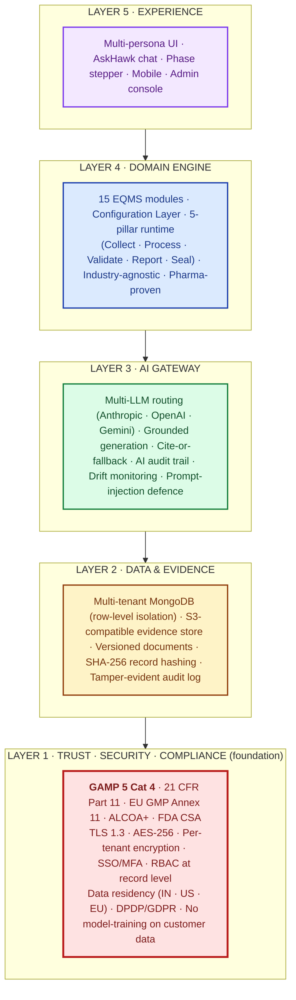
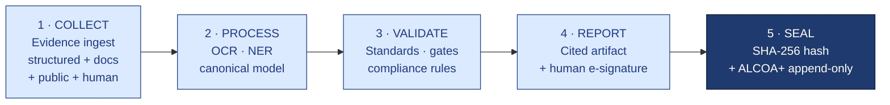
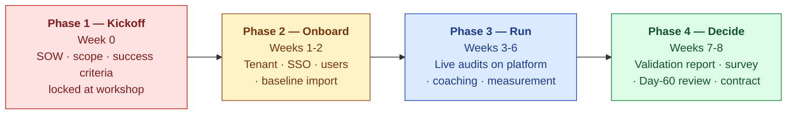
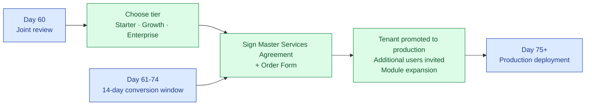

# Proof of Concept Proposal

## S.M.A.R.T. Hawk AI-Native EQMS Platform

---

> **Prepared for**
> `[CUSTOMER LEGAL NAME]`
> `[CUSTOMER ADDRESS]`
>
> **Prepared by**
> S.M.A.R.T. Hawk Transact Pvt. Ltd.
> `[S.M.A.R.T. HAWK ADDRESS]`
>
> **Proposal reference:** `HK-POC-[YYYY-MM]-[NNN]`
> **Date issued:** `[DATE]`
> **Validity:** This proposal is valid for 30 calendar days from the date issued
> **Confidential** — for the sole use of the addressee

---

## Cover Letter

Dear `[CUSTOMER SIGNATORY NAME]`,

Thank you for the time your team has invested in evaluating the S.M.A.R.T. Hawk platform. Following our recent technical demonstration on `[DEMO DATE]` and the discovery conversations preceding it, we are pleased to submit this proposal for a 60-day Proof of Concept ("PoC") deployment at `[CUSTOMER NAME]`.

We have designed this PoC around three principles:

1. **You take no financial risk.** The PoC is delivered at no cost to `[CUSTOMER NAME]`. There are no setup fees, training fees, validation report fees, or hidden charges. You commit time and audit data; we commit engineering, subject-matter expertise, and infrastructure.

2. **Success is measured by your criteria, not ours.** Six measurable success criteria are agreed jointly at kickoff (Section 8). If we fail to meet them, you exit at Day 60 with all your data exported and no obligation.

3. **The PoC mirrors your real operating environment.** This is not a sandbox demonstration. Within 60 days, your team will run one to two of your actual supplier audits on S.M.A.R.T. Hawk, end-to-end, in a fully validated environment compliant with 21 CFR Part 11, EU GMP Annex 11, and ALCOA+ data integrity principles.

This proposal is accompanied by two further documents:
- A detailed **Implementation Plan** describing the week-by-week schedule, deliverables, and responsibilities
- A **PoC Agreement** that formalizes the terms herein and is ready for signature

We would welcome the opportunity to walk you through this proposal in person or via video conference. Please contact me directly at `[FOUNDER EMAIL]` or `[FOUNDER PHONE]` to arrange a discussion or to indicate your intent to proceed.

Yours sincerely,

`[FOUNDER NAME]`
Founder & CEO, S.M.A.R.T. Hawk Transact Pvt. Ltd.
`[FOUNDER EMAIL]` · `[FOUNDER PHONE]`

---

## Table of Contents

1. Executive Summary
2. Understanding Your Situation
3. The S.M.A.R.T. Hawk Platform — 5-Layer Architecture
4. The Five Value Propositions
5. Compliance & Validation Posture (GAMP Cat 4 · Part 11 · Annex 11)
6. Why S.M.A.R.T. Hawk
7. Scope of the Proof of Concept
8. Implementation Approach
9. Project Team & Responsibilities
10. Success Criteria
11. Commercial Terms
12. Risk Management
13. Service Levels & Support
14. Data, Privacy, Security & Sovereignty
15. Conversion to Production
16. Acceptance & Next Steps

---

## 1. Executive Summary

| Element | Detail |
|---|---|
| **Engagement** | 60-day Proof of Concept of the S.M.A.R.T. Hawk AI-Native EQMS Platform |
| **Modules in scope** | Audit Management + one additional module (Document Control, CAPA, or Deviation) selected at kickoff |
| **Sites in scope** | 1 site, designated by `[CUSTOMER NAME]` at kickoff |
| **Users in scope** | Up to 5 named full-edit users + unlimited view-only users |
| **Real audits in scope** | 1 to 2 of `[CUSTOMER NAME]`'s actual supplier audits |
| **Cost to `[CUSTOMER NAME]`** | **₹0** — no fees of any kind during PoC |
| **Time commitment** | Approximately 50 person-hours total across `[CUSTOMER NAME]`'s team |
| **Compliance posture** | 21 CFR Part 11 · EU GMP Annex 11 · ALCOA+ from Day 1 |
| **Decision point** | Day 60 — joint review against six pre-agreed success criteria |
| **Conversion path** | If successful, paid contract per Section 13 with PoC-conversion benefits |
| **Exit path** | If unsuccessful or unwanted, full data export within 7 days · zero liability |

> **The asymmetry.** `[CUSTOMER NAME]` invests time and trust. S.M.A.R.T. Hawk invests capital and expertise. If the platform does not earn its place against your own success criteria, S.M.A.R.T. Hawk absorbs the cost.

---

## 2. Understanding Your Situation

Based on our discovery conversations with `[CUSTOMER NAME]`, we understand the following about your current audit-management operations:

### 2.1 Audit volume and complexity

| Dimension | `[CUSTOMER NAME]` profile (per discovery) | Industry benchmark (Tier-3 CDMO) |
|---|---|---|
| Sites operated | `[CUSTOMER SITE COUNT]` | 2 to 4 |
| Supplier audits hosted per year | `[CUSTOMER AUDITS HOSTED]` | 25 to 35 |
| Supplier audits conducted per year | `[CUSTOMER AUDITS CONDUCTED]` | 15 to 25 |
| QA team headcount | `[CUSTOMER QA HEADCOUNT]` | 4 to 7 |
| Current toolset | `[CUSTOMER TOOLS — typically spreadsheet · email · shared drive · standalone CAPA tracker]` | Same |

### 2.2 The cost of the status quo

A Tier-3 contract manufacturer of `[CUSTOMER NAME]`'s profile typically incurs the following annual quality cost burden:

| Cost line | Annual amount (₹) | Annual amount ($) | What it represents |
|---|---|---|---|
| Audit preparation time | 60,00,000 | 72,000 | 5 QA staff × 30 audits × 4 days × ₹10,000/day loaded cost |
| Audit response & CAPA tracking | 18,00,000 | 22,000 | Manual coordination, follow-up, and closure tracking |
| External audit-prep consultants | 6,00,000 – 15,00,000 | 7,000 – 18,000 | Engaged for major audits |
| Cost of audit findings & remediation | 5,00,000 – 25,00,000 | 6,000 – 30,000 | Approximately one critical finding per year |
| **Total annual quality cost** | **~95,00,000** | **~115,000** | |

In addition to these quantifiable costs, your team experiences the qualitative burdens of weekend war-rooms before regulatory inspections, ongoing dread of FDA Form 483 observations, and recurring findings that resurface every renewal cycle.

### 2.3 The opportunity

Independent customer interviews and analogous deployments indicate that an AI-native EQMS platform can reduce these costs by 35-45% in the first year of full deployment, with payback periods in the range of three to five months. **The objective of this PoC is to prove that range on `[CUSTOMER NAME]`'s actual workload.**

---

## 3. The S.M.A.R.T. Hawk Platform — 5-Layer Architecture

S.M.A.R.T. Hawk is an AI-native Enterprise Quality Management System (EQMS) built as **five layers, with Trust · Security · Compliance as the foundation (Layer 1)** on which every higher layer depends. In a regulated industry, trust is not a feature — it is the substrate.

| Layer | What it provides |
|---|---|
| **5 — Experience** | Multi-persona UI · AskHawk conversational agent · phase stepper per record · mobile companion for audit days |
| **4 — Domain Engine** | 15 EQMS modules · Configuration Layer (industry-agnostic) · the 5-pillar runtime pipeline every module follows |
| **3 — AI Gateway** | Multi-LLM routing · grounded generation with cite-or-fallback · AI audit trail per output · drift monitoring · prompt-injection defence |
| **2 — Data & Evidence** | Multi-tenant database · S3-compatible evidence store · versioned documents · tamper-evident audit log |
| **1 — Trust · Security · Compliance** | GAMP Cat 4 · Part 11 · Annex 11 · ALCOA+ · per-tenant encryption · data residency · zero model-training on your data |

### 3.1 The 5-pillar runtime (lives inside Layer 4)

Every module — Audit, CAPA, Document Control, Supplier Quality, all 15 — walks the same five-step motion when handling a record:

> ✅ **Two architectural guarantees that cannot be configured away:** (1) every AI output cites a source or returns "insufficient evidence" — never asserts what it cannot cite; (2) AI never commits a record — a human always reviews and e-signs.

### 3.2 The thirteen EQMS modules

| Module | Purpose | In PoC scope |
|---|---|---|
| Audit Management | Conduct and host supplier audits end-to-end | ✅ Yes |
| Document Control | Manage SOPs, work instructions, validation packages | Optional |
| CAPA | Track corrective and preventive actions to closure | Optional |
| Deviation | Investigate and resolve manufacturing deviations | Optional |
| Change Control | Govern changes to processes, equipment, and documents | Post-conversion |
| Training | Track personnel training and competency | Post-conversion |
| Risk Management | ICH Q9-aligned risk assessment and mitigation | Post-conversion |
| Complaint Management | Capture, investigate, and respond to product complaints | Post-conversion |
| Supplier Management | Qualify and monitor approved supplier list | Post-conversion |
| Calibration | Equipment calibration scheduling and records | Post-conversion |
| Validation Lifecycle | URS · IQ · OQ · PQ traceability | Post-conversion |
| Inspection Readiness | Regulator-facing portal and pack generation | Post-conversion |
| Document Disclosure | Controlled external sharing | Post-conversion |

---

## 4. The Five Value Propositions

| # | Value | Quantified outcome | Validated by |
|---|---|---|---|
| 1 | **40% audit-prep cost reduction** | Payback < 4 months · ~₹38L savings on ₹95L baseline | S.M.A.R.T. Hawk PoC measurement on `[CUSTOMER NAME]`'s real audits |
| 2 | **GAMP 5 Category 4 configured product** | ~60% less validation effort vs Cat 5 bespoke; supplier-leveraged validation | ISPE *GAMP 5 Guide, 2nd Edition* (Jul 2022) · FDA CSA (Final Sep 2025) |
| 3 | **Part 11 + Annex 11 + ALCOA+ by design** | 100% e-signature attribute coverage · all 9 ALCOA+ attributes designed-in · tamper-evident audit trail | 21 CFR §11.10 · §11.50 · §11.200 · EU GMP Annex 11 · MHRA 2018 · WHO TRS 1033 (2021) |
| 4 | **Trust-First Layer 1 architecture** | Per-tenant isolation · zero AI-training on your data · DPDP/GDPR · IN/US/EU residency | India DPDP Act 2023 (hard deadline 13 May 2027) · IBM 2025 healthcare breach avg $7.42M |
| 5 | **Cite-or-fallback grounded AI** | 100% of AI claims trace to source · zero hallucinated citations | FDA GMLP 10 Principles (Oct 2021) · EMA AI Reflection Paper (Sept 2024) |

> 💡 **Why each matters.** (1) The ROI pays for the platform in under four months; (2) Cat 4 cuts your validation burden by more than half versus a bespoke build; (3) regulator-facing artifacts pass FDA / EMA / MHRA inspection; (4) your data never trains anyone's model and stays in the region you choose; (5) AI augments your team without ever fabricating a citation.

---

## 5. Compliance & Validation Posture

### 5.1 GAMP 5 Category 4 — what you save vs Category 5

S.M.A.R.T. Hawk is built as a **GAMP 5 Category 4 configured product** (ISPE *GAMP 5 Guide, 2nd Edition*, Jul 2022). The same category as Veeva Vault QMS, MasterControl, and TrackWise. Your validation effort focuses on your configuration, not on S.M.A.R.T. Hawk's source code.

| | Cat 3 — non-configured | **Cat 4 — S.M.A.R.T. Hawk** | Cat 5 — custom/bespoke |
|---|---|---|---|
| Validation effort | Install + UAT | **URS + risk + IQ/OQ/PQ of your configuration** | Full SDLC + source review + V-model |
| Vendor SDLC evidence leveraged | Minimal | **Extensive** (per GAMP 5 supplier-leverage + FDA CSA) | Limited |
| Customer effort vs Cat 5 | n/a | **~60% less** *(industry consultant consensus)* | Baseline |
| Examples | Simple instrument firmware | **EQMS / ERP / LIMS / EDMS** | Custom-built modules |

**The Validation Accelerator Package S.M.A.R.T. Hawk ships to you** (which your team uses to satisfy GAMP Cat 4 supplier-leveraged validation):

| Deliverable | Purpose |
|---|---|
| Vendor Quality Manual | Demonstrates ISO 9001 / GAMP-aligned SDLC |
| Software Development Lifecycle evidence | Coding standards, peer review, version control, release process |
| Functional Specification + Configuration Specification | Defines vendor-product behaviour and customer-configurable surface |
| IQ/OQ scripts (pre-executed against the vendor product) | Reuse-ready evidence; customer re-executes in their environment |
| Security testing summary | Annual third-party penetration test + Dependabot / SAST evidence |
| Release Notes per version | Change classification (functional · security · cosmetic) for your change control |
| Vendor Assessment Questionnaire (pre-filled) | Reduces your supplier-audit burden |
| Periodic Vendor Audit pack (annual) | Documents continuing fitness for purpose |

### 5.2 21 CFR Part 11 — clause-level conformance

| Subpart / clause | Requirement | S.M.A.R.T. Hawk implementation |
|---|---|---|
| §11.10(a) | Validation | GAMP Cat 4 configured product per §5.1 |
| §11.10(b) | Accurate human-readable + electronic copies for FDA | PDF + CSV + JSON export at record + audit level |
| §11.10(d) | Limit access to authorized individuals | SSO (SAML/OIDC) · MFA · RBAC at record level |
| §11.10(e) | **Secure, computer-generated, time-stamped audit trails** retained for record lifetime | Every state change logged with user · UTC timestamp · session · IP · reason |
| §11.10(g) | Authority checks | Only authorized users can sign/alter/operate per role |
| §11.50 | Signature manifestations | Every signed record shows **printed name** + **date/time of execution** + **meaning** (review/approval/authorship/responsibility) |
| §11.70 | Signature/record linking | E-signature cryptographically linked to record snapshot via SHA-256 hash |
| §11.100 | Unique to one individual | One signature account per person, never reassigned, identity verified at provisioning |
| §11.200 | **Two distinct components** | Password + Reason on every signing event; session boundaries enforce the regulation |
| §11.300 | ID/password controls | Password aging, complexity, lockout, audit log of failed attempts |

> 💡 **Why this matters in 2026.** ~60% of CDER Warning Letters 2021–2024 cite data-integrity deficiencies, the bulk of which map to Part 11. The most common 483 themes — missing audit trails, shared logins, deletable raw data, audit trails not reviewed at batch release — are all addressed by S.M.A.R.T. Hawk's Layer 1 enforcement, which cannot be turned off by any user role.

### 5.3 EU GMP Annex 11 — all 17 clauses addressed

Highlights of the 17-clause framework (current 2011 text; revised draft published 7 July 2025, final expected 2026 alongside new **Annex 22 — Artificial Intelligence**):

| Clause | Requirement | S.M.A.R.T. Hawk implementation |
|---|---|---|
| 3 — Suppliers & service providers | Written supplier agreement; audit basis | DPA + Vendor Assessment + annual right-to-audit |
| 4 — Validation | URS, lifecycle, traceability, config management | Validation Accelerator Package per §5.1 |
| 7 — Data storage | Routine backups; integrity & accessibility verified over retention | Daily snapshots · 7-day rolling retention · monthly restore tests |
| 9 — Audit trails | Capture user · time · **reason** for change/deletion; reviewed regularly | Built-in; cannot be disabled by any user role |
| 11 — Periodic evaluation | Periodic review of validation, deviations, changes, security | Vendor reports support customer-side cadence |
| 12 — Security | Physical/logical access control + provisioning records | SSO · MFA · RBAC · provisioning audit log |
| 14 — Electronic signature | Equivalent to handwritten; permanently linked; name/date/time/meaning | Per §5.2 above |
| 16 — Business continuity | Documented arrangements for system failures | 99.5% PoC SLA / 99.9% production · DR runbook · backup PDF export at any moment |

### 5.4 MHRA / WHO ALCOA+ — 9 attributes by design

| Attribute | How S.M.A.R.T. Hawk enforces it |
|---|---|
| **A**ttributable | Every action linked to unique user via SSO + audit log |
| **L**egible | Human-readable export at record + audit level |
| **C**ontemporaneous | UTC timestamps captured at action moment; no back-dating |
| **O**riginal | Original record preserved; versions append, never overwrite |
| **A**ccurate | Validation gates + reviewer e-signature enforce accuracy |
| **C**omplete | Audit trail captures full action context, not just outcome |
| **C**onsistent | Schema validation + cross-module canonical data model |
| **E**nduring | Per-record SHA-256 + ≥10-year retention configurable |
| **A**vailable | 24×7 access; offline export available on demand |

### 5.5 FDA Computer Software Assurance (CSA)

CSA — final guidance **issued 24 September 2025**, re-issued 3 February 2026 alongside the QMSR Final Rule — shifts validation from document-heavy CSV to risk-based assurance, and explicitly encourages **leveraging vendor SDLC evidence** for low-risk functions. As a GAMP Cat 4 vendor, S.M.A.R.T. Hawk's Validation Accelerator Package was designed for exactly this leverage, materially shortening your validation cycle time.

### 5.6 Detailed compliance documentation

> 📘 **Full validation evidence on request.**
> - **[GAMP-CAT-4-BRIEF.md](./GAMP-CAT-4-BRIEF.md)** — 8-page customer brief covering classification, vendor/customer responsibility split, Validation Accelerator Package contents, worked validation estimate, and the 7 most-asked compliance questions. Bundled with this proposal.
> - **[GAMP-CAT-4-COMPLIANCE.md](../../08-compliance-regulatory/GAMP-CAT-4-COMPLIANCE.md)** — ~25-page canonical compliance reference: full V-model lifecycle mapping, complete clause-by-clause cross-standard mapping (Part 11 · Annex 11 · ALCOA+ · CSA · ICH · GMLP · EMA AI), pre-filled VAQ extract, worked module validation example, validation FAQ. Available under NDA on request; delivered as part of the Validation Accelerator Package at PoC kickoff.

---

## 6. Why S.M.A.R.T. Hawk

| Decision criterion | How S.M.A.R.T. Hawk compares |
|---|---|
| **Total cost of ownership** | S.M.A.R.T. Hawk Growth tier ACV of ~₹10L (~$12K) versus Veeva Vault QMS ~$50-100K, MasterControl ~$40-80K, or TrackWise ~$40-90K. Per-audit delivered cost of ~$400 versus competitor range of $2,500-5,000. |
| **Time to value** | Production-ready in under 30 days versus 6-12 months for tier-one incumbents. |
| **AI-native, not AI-retrofit** | S.M.A.R.T. Hawk is designed from the ground up around grounded generation, multi-LLM routing, and cite-or-fallback. Incumbents are bolting AI onto 15-year-old architectures. |
| **Pharma-domain depth** | Pharma SME consultancy (former regulatory inspectors) embedded in every PoC. Templates aligned to ICH Q7/Q9/Q10 and WHO PQ requirements out of the box. |
| **Emerging-markets pricing reality** | Built for the SMB/mid-pharma segment underserved by tier-one incumbents. Pricing model accommodates 3 to 8-figure annual revenues. |
| **Modern technical stack** | Cloud-native, multi-tenant, API-first. Vercel + Cloudflare + MongoDB Atlas. No legacy database lock-in. |
| **Founders-on-deal** | Founder-led PoC engagement. You speak directly with the people who can change the product, not a support tier. |

---

## 7. Scope of the Proof of Concept

### 5.1 In scope

| Dimension | Detail |
|---|---|
| Modules | Audit Management (primary) plus one of: Document Control · CAPA · Deviation (selected at kickoff) |
| Sites | One site of `[CUSTOMER NAME]`'s choosing |
| Users | Up to 5 named full-edit users · unlimited view-only users (for auditors, observers) |
| Real audits | 1 to 2 of `[CUSTOMER NAME]`'s actual supplier audits, run end-to-end on the platform |
| Benchmark | 1 historical audit imported as the comparison baseline for time-reduction measurement |
| AI usage | 25,000 AI credits (sufficient for approximately 25 audit-grade AI generations) |
| Integrations | SSO via SAML or OIDC · DigiLocker import (if applicable) · one custom connector of up to 16 engineering hours |
| Onboarding | 2-hour kickoff workshop · weekly 30-minute checkpoint calls · dedicated Slack or Teams channel |
| Subject-matter expertise | 2 pharma SME consultancy sessions during the PoC |
| Compliance deliverables | Validation summary report (21 CFR Part 11 · EU GMP Annex 11 · ALCOA+) delivered Week 7 |
| Support | 24-hour weekday response SLA · emergency hotline during scheduled audit days |

### 5.2 Out of scope (available post-conversion)

- Custom-built workflows or modules beyond the chosen two
- On-premise deployment (PoC is cloud-only)
- Multi-site rollout beyond the single PoC site
- Production-grade SLA upgrades (99.9% uptime, 24×7 support)
- Migration of historical EQMS data beyond the one benchmark audit
- Additional custom integrations beyond the one in-scope connector
- Custom training programs beyond the included kickoff workshop

### 5.3 Assumptions

This proposal assumes that `[CUSTOMER NAME]`:
- Has at least one supplier audit scheduled during the 60-day PoC window
- Can designate the named PoC team (Section 7) within 5 business days of agreement signing
- Will provide its IT/InfoSec contact for SSO setup within Week 1
- Will provide historical baseline data per Section 8.1 within 7 days of kickoff
- Has the authority to share the in-scope audit data with S.M.A.R.T. Hawk under the executed NDA and Data Processing Agreement

---

## 8. Implementation Approach

The PoC is delivered in four sequential phases. Detailed week-by-week scheduling, deliverables, and dependencies are documented in the accompanying **Implementation Plan**.

| Phase | Duration | Primary outcome |
|---|---|---|
| 1 — Kickoff | Week 0 | Agreement signed · scope locked · team confirmed |
| 2 — Onboard | Weeks 1-2 | Platform live with `[CUSTOMER NAME]` users and baseline data |
| 3 — Run | Weeks 3-6 | One to two real audits completed end-to-end on the platform |
| 4 — Decide | Weeks 7-8 | Success criteria measured · Day-60 review · contract decision |

---

## 9. Project Team & Responsibilities

### 9.1 `[CUSTOMER NAME]` team

| Role | Responsibilities | Time commitment |
|---|---|---|
| Executive Sponsor | Approve scope and success criteria · attend Day-60 review · resolve escalations | ~4 hours over 60 days |
| PoC Lead | Day-to-day coordination · attend weekly checkpoints · drive internal alignment | ~32 hours over 60 days |
| Named Users (3-5) | Use the platform for designated audits · provide feedback · complete end-of-PoC survey | Variable (audit days) |
| IT / InfoSec Contact | Support SSO configuration · approve security posture | ~4 hours (Week 1) |

### 9.2 S.M.A.R.T. Hawk team

| Role | Responsibilities | Engagement model |
|---|---|---|
| Founder Lead | Kickoff workshop · Day-60 review · escalation point of contact | Direct line throughout PoC |
| Customer Success Engineer | Weekly checkpoints · Slack channel · platform configuration · user support | Dedicated to your account |
| Pharma SME Consultant | Compliance posture review · regulator-grade evidence guidance | 2 sessions (Week 2 · Week 7) |

---

## 10. Success Criteria

The following six success criteria are agreed jointly at the Week 0 kickoff workshop. **Targets may be adjusted by mutual written agreement at kickoff; once locked, they are binding for the Day-60 decision.**

| # | Criterion | Default target | Floor | Measurement |
|---|---|---|---|---|
| 1 | Audit-preparation time reduction versus `[CUSTOMER NAME]`'s baseline | ≥40% | 25% | Stopwatch on PoC audit vs `[CUSTOMER NAME]`'s historical baseline |
| 2 | AI-drafted finding citation completeness | 100% | Not adjustable | Inspection of findings export |
| 3 | 21 CFR Part 11 electronic-signature compliance on every signed object | Full | Not adjustable | Validation summary report (Week 7) |
| 4 | Tools the platform replaces (spreadsheet · email · shared drive · CAPA tracker) | ≥3 of 4 | 2 of 4 | Joint count at PoC end |
| 5 | End-user preference vs status quo | ≥7 / 10 average | 6 / 10 | Anonymous survey of all PoC users |
| 6 | Sponsor go/no-go subjective assessment | "Yes" | Not adjustable | Executive Sponsor interview at Day-60 review |

### 10.1 Baseline data required from `[CUSTOMER NAME]`

To enable measurement of Criterion 1, `[CUSTOMER NAME]` will provide within 7 days of kickoff:

- Time spent on the most recent comparable supplier audit (hours, broken down by role)
- Number of QA personnel who participated
- The list of tools used
- The top three friction points experienced

### 10.2 Asymmetry guarantee

If any non-adjustable success criterion (#2, #3, or #6) is failed, or if more than two adjustable criteria fail to meet their agreed floor, `[CUSTOMER NAME]` owes S.M.A.R.T. Hawk nothing and may exit per Section 16.

---

## 11. Commercial Terms

### 11.1 PoC fees

**The PoC is provided at no cost to `[CUSTOMER NAME]`.** No fees, setup charges, training fees, validation report fees, integration fees, or other compensation are payable during the 60-day PoC term.

### 11.2 `[CUSTOMER NAME]`'s investment

| Item | Detail |
|---|---|
| Time | Approximately 50 person-hours total across the named team |
| Data | One to two real supplier audits (with NDA and DPA in place) |
| Honest feedback | Provided at weekly checkpoints and end-of-PoC survey |
| A decision at Day 60 | Go · Extend · No-Go |

### 11.3 Conversion path (if `[CUSTOMER NAME]` elects to proceed)

If `[CUSTOMER NAME]` converts to a paid contract within 14 calendar days of the Day-60 review:

| Standard tier | Sites | Users | Modules | Annual contract value |
|---|---|---|---|---|
| Starter | 1 | 3 | Audit + Doc Control | ₹3,50,000 (~$4,000) |
| Growth ⭐ recommended for `[CUSTOMER NAME]`'s profile | 3 | 8 | Full EQMS | ₹10,00,000 (~$12,000) |
| Enterprise | Unlimited | 25+ | Full EQMS + custom integrations + dedicated CSM | ₹20,00,000+ (~$24,000+) |

**Conversion benefits available within the 14-day window:**

| Benefit | Detail |
|---|---|
| First-renewal-locked pricing | Year-2 ACV ≤ Year-1 ACV + 5% |
| Free historical data migration | One-time, up to 40 engineering hours |
| Reference-status discount | 15% off Year-1 ACV in exchange for case-study participation after 6 months (opt-in) |

Conversion after Day 74 is at list pricing without conversion benefits.

### 11.4 Total cost of ownership comparison (Growth tier)

| Cost line | Year 1 (₹) | Year 1 ($) |
|---|---|---|
| S.M.A.R.T. Hawk Growth tier ACV | 10,00,000 | 12,000 |
| Estimated implementation effort (`[CUSTOMER NAME]` internal time) | 5,00,000 | 6,000 |
| **Total Year-1 investment** | **15,00,000** | **18,000** |
| Estimated annual savings (40% of current ₹95L cost) | 38,00,000 | 46,000 |
| **Net Year-1 benefit** | **23,00,000** | **28,000** |
| **Payback period** | **~4 months** | **~4 months** |

---

## 12. Risk Management

| Risk | Likelihood | Impact | Mitigation |
|---|---|---|---|
| Scheduled audit slips beyond Week 6 | Medium | Medium | 30-day extension included at no cost; baseline audit serves as fallback measurement |
| `[CUSTOMER NAME]` IT/InfoSec rejects deployment | Low | High | InfoSec questionnaire pre-completed · SOC 2 Type 1 attestation · architecture review call within 48 hours of request |
| AI generation produces inaccurate citation | Very Low | Very High | Cite-or-fallback by design — AI returns "human input required" rather than fabricated citations |
| Platform outage during scheduled audit day | Very Low | High | 99.5% uptime SLA · emergency hotline · backup PDF export available at any moment |
| Regulator questions S.M.A.R.T. Hawk-generated evidence | Low | High | Written regulator-defense brief provided at no cost for any inspection within 90 days of PoC end |
| Named users underutilize the platform | Medium | Medium | Weekly checkpoints surface usage gaps early · Customer Success Engineer drives adoption |
| Conversion decision delayed past Day 74 | Medium | Medium (loss of conversion benefits) | 60-day proposal validity · early indication preferred but not required |

---

## 13. Service Levels & Support

| Metric | PoC service level |
|---|---|
| Platform uptime | ≥99.5% (calendar-monthly average, excluding scheduled maintenance) |
| Scheduled maintenance | ≤4 hours per week, weekdays before 06:00 IST or after 22:00 IST |
| Support response (Slack/Teams channel) | ≤24 business hours |
| Critical incident response (P1 — platform unreachable) | ≤4 business hours acknowledgement |
| Emergency hotline (scheduled audit days) | Phone number provided at kickoff |
| Backups | Daily snapshots · 7-day rolling retention |
| Founder access | Direct email and phone throughout PoC |

---

## 14. Data, Privacy, Security & Sovereignty

This section expands the Layer 1 (Trust · Security · Compliance) commitments specific to `[CUSTOMER NAME]`'s PoC tenant.

### 14.1 Why this matters — the 2025 baseline

| Statistic | Value | Source |
|---|---|---|
| Average breach cost — healthcare sector | **USD 7.42M** (14 years running highest of any sector) | IBM *Cost of a Data Breach Report 2025* |
| Mean breach lifecycle (identify + contain) | 241 days | IBM 2025 |
| "Shadow AI" cost premium per breach | +USD 308K | IBM 2025 |
| Pharma sector incidents 2023–2025 | Merck NotPetya ($1.4B legacy) · Cencora Feb 2024 (15+ pharma giants hit) · Change Healthcare Feb 2024 · Sun Pharma Mar 2023 | Public SEC filings; sector reporting |

> 💡 **This is why Layer 1 is the foundation.** A data breach against a pharma manufacturer costs more than against any other sector. The platform vendor's security posture is, in effect, your own.

### 14.2 Data residency — `[CUSTOMER NAME]` elects at kickoff

| Region | Provider | Latency to `[CUSTOMER NAME]` | Sovereignty fit |
|---|---|---|---|
| India (Mumbai) — default | Cloudflare R2 | Lowest | India DPDP + CDSCO; data stays in India |
| United States (US-East) | Cloudflare R2 | Higher | FDA-adjacent; HIPAA-aligned |
| European Union (Frankfurt) | Cloudflare R2 | Higher | GDPR + EU GMP locality |

### 14.3 Security controls

| Control | Implementation |
|---|---|
| Encryption in transit | TLS 1.3 |
| Encryption at rest | AES-256 |
| Tenant isolation | Multi-tenant database with row-level isolation enforced at the query layer |
| Per-tenant encryption keys | Available on Enterprise tier (BYOK option) |
| Authentication | SAML 2.0 / OIDC SSO from Day 1; MFA enforceable |
| Authorization | Role-based access control at module + record level |
| Audit logging | Every user action logged: user · UTC timestamp · reason · IP · session |
| Vulnerability management | Dependabot + monthly SAST scan · critical CVEs patched within 7 days |
| Penetration testing | Annual external pentest; summary available under NDA |
| Supply chain security | SBOM published per release · dependency signing |
| SOC 2 Type II | Target Q4 2026 (in-process); SOC 2 Type I attestation available now under NDA |
| ISO 27001 | Roadmap 2027 |

### 14.4 AI safety — the data privacy commitment

| Concern | S.M.A.R.T. Hawk contractual position |
|---|---|
| Customer data used to train AI models | **NEVER** without explicit written consent. Default contractual: zero training-data use. |
| Customer data sent to third-party LLM APIs | Only when explicitly invoked by user action; per-tenant API isolation; provider-side training opt-out enforced at vendor configuration |
| Prompt-injection defence | Adversarial input filtering on all document ingest; sanitization at AI Gateway (Layer 3) |
| Hallucinated citations | **Impossible by design** — cite-or-fallback enforced at Layer 3; AI returns "insufficient evidence" rather than fabricating |
| Model drift / unmonitored re-training | Drift monitoring at AI Gateway · model version pinned per workflow · release notes per model change |
| AI audit trail | Every AI output logs: model · version · prompt hash · retrieved sources · confidence · user disposition |

### 14.5 Regulatory regime — privacy & data protection

| Standard | Posture |
|---|---|
| India **DPDP Act 2023** | Compliant ahead of 13 May 2027 hard deadline · Data Processor obligations met · written agreement · breach notification · deletion on termination |
| EU **GDPR** | Data Processing Agreement signed at contract · DPO contact channel · EU residency option |
| US **HIPAA** | BAA available on request (typically applies only if PHI handled — most EQMS workloads are not PHI) |

### 14.6 Data lifecycle

| Stage | S.M.A.R.T. Hawk commitment |
|---|---|
| In use (during PoC) | Customer data never used for AI training without consent · never shared with or sold to third parties |
| At PoC end | Full data export (PDF + CSV + audit-trail manifest + JSON) delivered within 7 business days |
| Post-PoC (if not converted) | Hard-deletion of all data including backups within 30 calendar days of written request · signed certificate of deletion provided |
| Post-PoC (if converted) | Data migrated in place to the paid tenant; no re-import required |

---

## 15. Conversion to Production

The conversion path is designed to be friction-free if `[CUSTOMER NAME]` elects to proceed.

| Step | Owner | Duration |
|---|---|---|
| Day-60 review and decision | Joint | 1 day |
| Tier selection and Order Form | `[CUSTOMER NAME]` | 2-5 days |
| Master Services Agreement signature | Joint (legal) | 3-7 days |
| Tenant promoted to production | S.M.A.R.T. Hawk | 1 day |
| Additional user onboarding | Joint | Ongoing |

Customers typically reach full production usage within 30 days of the Day-60 review.

---

## 16. Acceptance & Next Steps

### 16.1 To proceed with this PoC

1. **Confirm intent in writing.** Email `[FOUNDER EMAIL]` indicating acceptance of this proposal.
2. **Execute the accompanying agreements.** The PoC Agreement, mutual NDA, and Data Processing Agreement are provided alongside this proposal.
3. **Schedule the kickoff workshop.** A 2-hour session within 7 days of agreement signing, at `[CUSTOMER NAME]`'s office or via video conference.
4. **Designate the PoC team.** Names and contact details per Section 7.1 within 5 business days of agreement signing.

### 16.2 If you have questions before proceeding

We are happy to:
- Walk through this proposal in a 30-minute call with the relevant stakeholders
- Provide additional references from previous PoC engagements
- Conduct a technical deep-dive with your IT/InfoSec team
- Adjust scope or success-criteria targets ahead of the kickoff

### 16.3 Proposal acceptance

By signing below, `[CUSTOMER NAME]` indicates intent to proceed with the PoC as described in this proposal. This signature is not a binding contract; the binding terms are contained in the accompanying PoC Agreement.

| For `[CUSTOMER NAME]` | For S.M.A.R.T. Hawk Transact Pvt. Ltd. |
|---|---|
| **Name:** `[SIGNATORY NAME]` | **Name:** `[FOUNDER NAME]` |
| **Title:** `[SIGNATORY TITLE]` | **Title:** Founder & CEO |
| **Signature:** _______________________ | **Signature:** _______________________ |
| **Date:** ___________________________ | **Date:** ___________________________ |

---

## Companion Documents

This proposal is one of three documents constituting the complete PoC engagement package:

1. **This Proposal** — the offer and rationale (you are reading it)
2. **Implementation Plan** — week-by-week schedule, RACI, deliverables, and risk register
3. **PoC Agreement** — binding contractual terms, signed at kickoff

Mutual Non-Disclosure Agreement and Data Processing Agreement are provided as separate documents.

---

## Contact

**S.M.A.R.T. Hawk Transact Pvt. Ltd.**
`[S.M.A.R.T. HAWK ADDRESS]`
Website: `[S.M.A.R.T. HAWK WEBSITE]`
General: `[GENERAL EMAIL]`
Founder direct: `[FOUNDER EMAIL]` · `[FOUNDER PHONE]`

---

*S.M.A.R.T. Hawk Transact Pvt. Ltd. · Proposal HK-POC-`[YYYY-MM]`-`[NNN]` · `[DATE ISSUED]` · Confidential*
