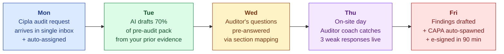
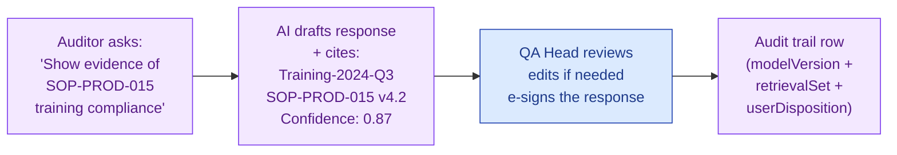
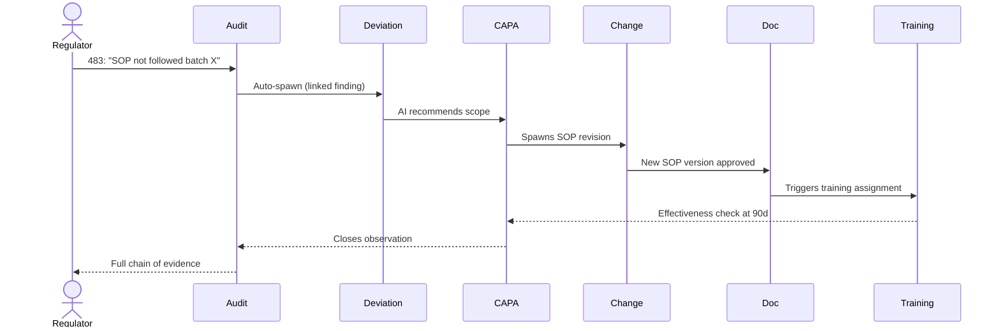
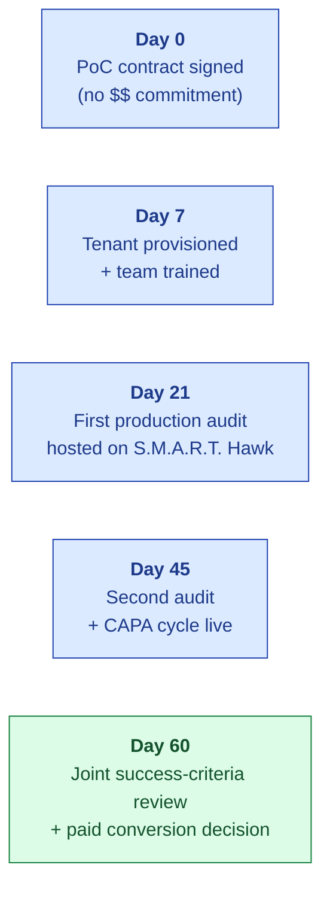
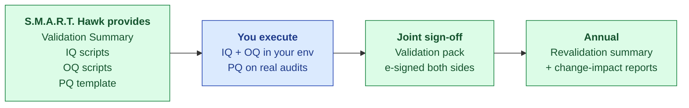

# S.M.A.R.T. Hawk — QA Head Deck

| Field | Value |
|---|---|
| Audience | Buyer's QA Head · Head of Compliance · Director of Quality |
| Use case | Decision-maker pitch — the QA Head who owns the budget for audit + EQMS |
| Status | v1.0 — 2026-06-01 |
| Pairs with | [STORYBOOK.md](../../06-modules/audit-management/STORYBOOK.md) · [PRICING.md](../../01-strategy/pricing-and-packaging/PRICING.md) |
| Format | 15 slides · 30-min in-person or video |

---

## 1. You Host 30+ Audits a Year. You Have Time for 5.

> 💡 **The opener.** This isn't a pitch about software. It's a pitch about getting your team's evenings back, your audit prep time cut in half, and the FDA inspection in your future being one you can actually look forward to.

| Your reality today | What it costs |
|---|---|
| 30+ audits/yr per site | 60% of QA team time on prep |
| Every customer wants their own format | Re-creating the same evidence pack 30 times |
| CAPAs tracked in email + spreadsheets | Findings re-litigated every renewal cycle |
| External consultants for big audits | ₹6-15L/yr for what your team already knows |

*Slide 1 / 15*

---

## 2. Your Pain — Quantified

A representative Tier-3 CDMO (3 sites, 5 QA staff, 30 audits/yr):

| Pain | ₹ per year | $ per year |
|---|---|---|
| Audit prep time (5 QA × 30 audits × 4 days × ₹10K/day) | ₹60L | $72K |
| Audit response + CAPA tracking (manual) | ₹18L | $22K |
| External audit-prep consultants | ₹6-15L | $7-18K |
| Cost of audit findings + remediation (~1 critical/yr) | ₹5-25L | $6-30K |
| **Total annual quality cost** | **~₹95L** | **~$115K** |

Plus the un-quantifiable: weekend war rooms before WHO-PQ audits · the dread of a 483 · the recurring findings you swore you fixed last cycle.

*Slide 2 / 15*

---

## 3. Your Week With S.M.A.R.T. Hawk — Storyboard

One platform. Five personas (QA Head · QA Analyst · Operations · Auditor · Auditee). Zero spreadsheets.

*Slide 3 / 15*

---

## 4. The Single Inbox — Supplier Portal

| Today | With S.M.A.R.T. Hawk |
|---|---|
| Email from Cipla auditor on Monday | One incoming audit on your supplier portal |
| Attachment chain across 11 emails | One audit object · all evidence linked |
| QA analyst re-creates the pre-audit pack | Auto-acceptance flow · auto section assignment |
| 4 days to assemble | 4 hours to validate (AI-pre-filled) |
| 3 follow-up email threads | 1 audit-trail row per question |

> 💡 **The single inbox.** Auditors send via portal. Sections auto-assign by tag (Quality Manual → QA Head · Production → Ops Manager). You see one queue, sorted by audit date. Done.

*Slide 4 / 15*

---

## 5. AI Observation Drafter — Live Today

- Every AI output **cites its sources** (with hyperlinks back to the SOP, training record, etc.)
- Every output shows **confidence score** — below floor, AI says "insufficient evidence" instead of guessing
- You **always e-sign** before the response is committed — AI is a drafter, never a decider
- The audit trail captures every AI call's `modelVersion + promptHash` — reproducible 18 months later

*Slide 5 / 15*

---

## 6. The Auditor Coach — Private · Never Punitive

> 💡 **The feature your team will love but never see in a demo deck from a competitor.** During an on-site audit, the Auditor Coach watches your team's responses **privately** and flags weak phrasings, missing evidence pointers, or risky volunteered information — **in their personal growth-plan view, never visible to your boss**.

- Coach activates only with the QA analyst's opt-in
- Suggestions appear in their private panel (not on the audit record)
- 90-day private growth plan tracks improvement
- Never logged to the auditee's permanent record · never visible to management
- Hard-coded ethical floor: cannot recommend "tell the auditor less" — only "show evidence X for question Y"

*Slide 6 / 15*

---

## 7. Cross-Module Audit Trail — <2 sec for Any Regulator Question

**The regulator's next question:** *"Show me from the audit finding to evidence of training completion."*
**Today:** 4 people · 3 days · 6 spreadsheets.
**With S.M.A.R.T. Hawk:** 1 click · 2 seconds.

*Slide 7 / 15*

---

## 8. Compliance Spine — Part 11 / Annex 11 / ALCOA+ at Clause Level

S.M.A.R.T. Hawk is a **GAMP 5 Category 4 configured product** (ISPE 2nd Ed, Jul 2022). The same category as Veeva Vault QMS, MasterControl, and TrackWise. Your validation effort drops by ~60% versus a Cat 5 custom build — and the Validation Accelerator Package we ship at kickoff is designed to be plugged straight into your own validation lifecycle.

### 21 CFR Part 11 — clause-by-clause defence (the top 4 FDA-483 themes addressed)

| 483 theme (top observations 2023–2025) | S.M.A.R.T. Hawk built-in defence | Clause |
|---|---|---|
| Missing / disabled / non-reviewed audit trails | `auditTrailService` cannot be disabled by any user role; "review audit trail" gate built into batch-release workflow | §11.10(e) |
| Shared / generic logins | One signature account per person, never reassigned, identity verified at provisioning; SSO + MFA | §11.100 |
| Deletable / overwriteable raw data | Versions append, never overwrite; per-record SHA-256 + ALCOA+ append-only trail | §11.10(a) + ALCOA+ Enduring |
| E-sig manifestation incomplete | Every signed record shows **printed name + UTC + meaning** (review/approval/authorship/responsibility) | §11.50 |
| Single-component e-sig | Password + Reason required on every signing event; session-boundary rule enforced | §11.200 |

### EU GMP Annex 11 (2011 + 2025 draft revision; new Annex 22 for AI expected 2026)

| Clause | Requirement | S.M.A.R.T. Hawk |
|---|---|---|
| §3 — Suppliers & service providers | Written agreement + audit basis | DPA + Vendor Assessment Questionnaire + annual right-to-audit |
| §4 — Validation | URS · lifecycle · traceability · config management | Validation Accelerator Package |
| §7 — Data storage | Backups + integrity over retention | Daily snapshots · 7-day rolling retention · monthly restore tests |
| §9 — Audit trails | User · time · **reason** for change/deletion | Built-in; cannot be disabled |
| §11 — Periodic evaluation | Review of validation, deviations, changes, security | Vendor reports support customer cadence |
| §12 — Security | Access control + provisioning records | SSO/MFA/RBAC + provisioning audit log |
| §14 — Electronic signature | Equivalent to handwritten; permanently linked; name/date/time/meaning | Per Part 11 §11.50 above |
| §16 — Business continuity | Documented arrangements for system failures | 99.5% PoC / 99.9% production SLA · DR runbook |

### MHRA / WHO ALCOA+ — 9 attributes (Mar 2018 + WHO TRS 1033, 2021)

| Attribute | How S.M.A.R.T. Hawk enforces it |
|---|---|
| **A**ttributable | Every action linked to unique user via SSO + audit log |
| **L**egible | Human-readable export at record + audit level |
| **C**ontemporaneous | UTC timestamps captured at action moment; no back-dating |
| **O**riginal | Original record preserved; versions append, never overwrite |
| **A**ccurate | Validation gates + reviewer e-signature |
| **C**omplete | Audit trail captures full action context, not just outcome |
| **C**onsistent | Schema validation + cross-module canonical model |
| **E**nduring | Per-record SHA-256 + ≥10-year retention configurable |
| **A**vailable | 24×7 access · offline export on demand |

> 💡 **The bigger picture.** ~60% of CDER Warning Letters (2021–2024) cite data-integrity deficiencies — the bulk mapping to Part 11. **This is the #1 inspection risk your team faces.** S.M.A.R.T. Hawk's Layer 1 enforcement is your defence.

> 💡 **Also satisfied by the same implementation:** ICH Q7 / Q9 / Q10 · ISO 9001 · ISO 13485 (med-device customers) · WHO-GMP / PIC/S. One audit trail, many regulators.

> 📘 **For your validation team.** The full **[GAMP 5 Cat 4 Compliance Reference](../../08-compliance-regulatory/GAMP-CAT-4-COMPLIANCE.md)** (~25 pages) provides V-model lifecycle mapping, vendor/customer responsibility matrix (RACI), Validation Accelerator Package inventory, pre-filled Vendor Assessment Questionnaire, worked module-validation example (Audit Management), and complete clause-by-clause cross-standard mapping. Customer-facing summary: **[GAMP-CAT-4-BRIEF.md](./GAMP-CAT-4-BRIEF.md)**.

*Slide 8 / 15*

---

## 9. The 60-Day PoC — Real Audits · No Obligation

| PoC inclusion | What you get |
|---|---|
| S.M.A.R.T. Hawk tenant | Full EQMS · 30-day access · your data |
| Onboarding training | 2 sessions × 2 hours · your QA team |
| 2 real audits hosted | Not demo data — your actual customer audits |
| Joint success criteria | Defined Day 0 · measured Day 60 · written |
| Validation pack | IQ/OQ/PQ templates · ready to execute |
| **Cost** | $0 — we eat the implementation |

*Slide 9 / 15*

---

## 10. Time to Value — Day 0 to Day 90

| Day | Milestone | Owner |
|---|---|---|
| 0 | Contract signed · tenant provisioned | S.M.A.R.T. Hawk |
| 7 | QA team trained · users active | S.M.A.R.T. Hawk + Customer |
| 14 | First evidence imported · doc control live | Customer |
| 21 | **First production audit hosted** | Customer |
| 30 | Audit closed · CAPA cycle running | Customer |
| 45 | Module 1 ROI demonstrable | Joint |
| 60 | PoC review · paid conversion | Joint |
| 90 | **Module 2 live** (CAPA or Deviation) | Joint |

> 💡 You see ROI inside 30 days. Most competitors take 6-12 months just to deploy.

*Slide 10 / 15*

---

## 11. Validation Summary — Your Inspector-Ready Package

- **Standard templates** — Part 11 / Annex 11 mapped · ALCOA+ traced · GAMP 5 risk-based
- **Customer-led execution** — you run IQ/OQ in your environment with our scripts
- **Joint sign-off** — co-signed by your QA Head + our compliance lead
- **Annual revalidation** — release-by-release impact assessments delivered by S.M.A.R.T. Hawk

*Slide 11 / 15*

---

## 12. Pricing for Your Org — Worked Example

**Your profile:** 3 sites · 5 named QA users · 30 audits/yr

| Cost / Saving | Annual |
|---|---|
| Today's quality cost (audit prep + response + consultants + findings) | ~₹95L |
| S.M.A.R.T. Hawk reduces by 40% blended | **savings: ~₹38L** |
| S.M.A.R.T. Hawk annual contract value | ~₹9L |
| **Net annual benefit** | **~₹29L** |
| **Payback period** | **<4 months** |

**The contract:**
- ₹6L = 3 sites × ₹2L (platform fee per site)
- ₹2L = 5 users × ₹40K (named full-edit; viewers free)
- ₹1L = AI credits (~150 audits/yr equivalent)
- **Total ₹9L (~$10.8K) ACV** — billed quarterly · 1-year auto-renewal

> 💡 24% of your savings · 76% stays with you · Year 2 same price · Year 3 you decide.

*Slide 12 / 15*

---

## 13. What We DON'T Do — Honest

> ⚠️ **The honesty register your procurement team will want.**

| What we don't do | Why we tell you upfront |
|---|---|
| Veeva Vault displacement (Tier-1) | We're a different price point for a different segment. If you have Veeva and it works, keep it. |
| On-prem deployment | Cloud only today. On-prem coming M18 (+30% on ACV when it arrives). |
| Mobile native app | Responsive web today. Native apps post-Series-A. |
| Custom code-level integrations | API + webhooks today. Custom connectors scoped at ₹2-5L. |
| Validation execution | We provide templates. You execute IQ/OQ. We co-sign. |
| MFA today | Password + ID code (Part 11 §11.200 compliant). TOTP shipping Q3 2026. |

If any of these are dealbreakers, tell us now — we'd rather lose a deal than oversell.

*Slide 13 / 15*

---

## 14. Reference Customer Offer — First 10

> 💡 **The deal for the first 10 customers.** We need 10 reference deployments to anchor our Series A story. You need a discount. We need permission to talk about you.

| What you give | What you get |
|---|---|
| Reference call availability (4-6/yr) | **40% discount Y1** · list rate Y2 |
| Named co-marketing case study | Founder-level access · weekly check-ins |
| Joint validation summary (white-labeled) | First feature priority on your URS asks |
| 12-month commitment | First module included on PoC conversion |

| Tier | List ACV | First-10 Y1 ACV |
|---|---|---|
| Starter | ₹3.5L | ~₹2.1L |
| Growth | ₹10L | **~₹6L** |
| Enterprise | ₹20L+ | ~₹12L+ |

*Slide 14 / 15*

---

## 15. Next Step — 60-Min Technical Demo with SME

| Step | Who attends | Outcome |
|---|---|---|
| Today | You + S.M.A.R.T. Hawk founder | Decision: schedule technical demo? |
| Week 1 | + Your QA analyst + IT lead | 60-min technical demo + Q&A · live module walk |
| Week 2 | + Your CFO + CTO | Pricing + contract review · validation pack preview |
| Week 3 | + Procurement | PoC contract signed · Day 0 begins |
| Week 12 | Joint review | PoC conversion decision |

**Contact:** sales@hawkeye.app · `[insert Calendly]`

**Read next:**
- [STORYBOOK.md](../../06-modules/audit-management/STORYBOOK.md) — full audit module walkthrough · 4 audience cuts
- [PART-11.md](../../08-compliance-regulatory/frameworks/PART-11.md) — compliance matrix for your CTO/IT lead

*Slide 15 / 15 · Thank you · Let's schedule the demo*
