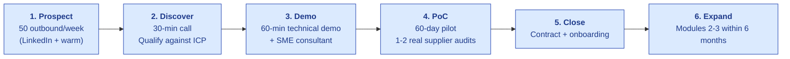
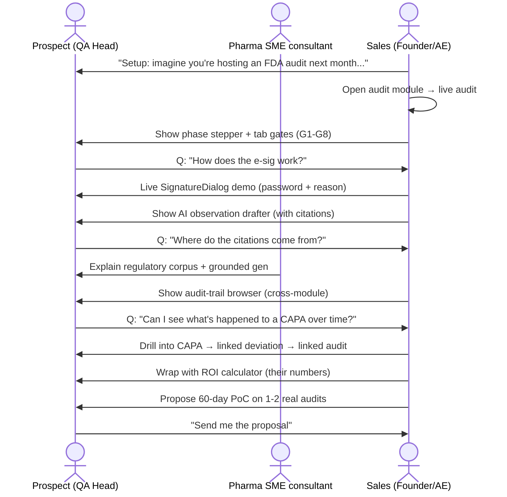

# Sales Playbook

| Field | Value |
|---|---|
| Owner | Founders + Sales |
| Status | v1.0 |
| Last updated | 2026-05-31 |
| Pairs with | [GTM-PLAN.md](../../01-strategy/gtm-strategy/GTM-PLAN.md), [PRICING.md](../../01-strategy/pricing-and-packaging/PRICING.md) |

---

## 1. The sale in one paragraph

> 💡 **You're selling a 40% reduction in audit-prep cost to a QA head at a mid-pharma or CDMO that hosts 30+ audits/year. The wedge is supplier audit (acute pain, single decision-maker). The land is a 60-day PoC on 1-2 real audits. The expand is into adjacent EQMS modules (deviation, CAPA, doc control) within 6 months. Net: $10K ACV against $46K of customer savings, payback under 4 months.**

## 2. The sales funnel

## 3. Discovery questions (the qualifier)

Before scheduling a demo, get answers to:

| Qualifying question | Why |
|---|---|
| "How many sites do you have?" | Drives ACV (₹2L/site) |
| "How many supplier audits do you host per year?" | Pain quantification (>15 = strong) |
| "How many audits do you conduct outbound per year?" | Buyer + auditor persona detection |
| "What tools do you use today for audit management?" | Spreadsheet/email/Veeva/MasterControl |
| "Who would champion this internally?" | Buying authority |
| "What's your current spend on audit prep / consultants?" | ROI calc input |
| "Any recent FDA-483 or EU GMP non-conformance?" | Compliance trigger |
| "When is your next regulator inspection?" | Time pressure |
| "How many QA staff?" | Hawkeye ACV per-user fee |
| "What's your annual compliance/quality budget?" | Affordability check |

If the prospect can't answer 5+ of these, they're not ready — schedule a follow-up educational call.

## 4. The 30-min discovery script

> "Thanks for the time. I'd like to start by understanding your current audit-management workflow — what's the most painful part of your week related to supplier audits?"

[Listen for: spreadsheets, email chaos, CAPA tracking, consultant dependence, regulator-time-pressure]

> "On a scale of 1-10, how big a deal is supplier audit management to your team's overall workload?"

[If 7+, continue. If <5, pivot to discovering their actual top quality pain.]

> "If I could show you a way to cut audit-prep time by 50-60% and get every observation regulator-grade with AI assistance, would that be worth 60 minutes of your time next week?"

[If yes, schedule demo. If no, send education content + nurture.]

## 5. The 60-min technical demo flow

## 6. The PoC design

| Component | Spec |
|---|---|
| Duration | 60 days |
| Scope | 1-2 real supplier audits run end-to-end |
| Personas | Buyer-side QA team + 1 supplier (with their consent) |
| Cost | Free during PoC; standard pricing post-conversion |
| Success criteria | Written + agreed before kickoff (e.g., "audit cycle time reduced from 8 weeks to 5 weeks") |
| Conversion event | Day 50 review meeting; decision by Day 60 |
| Reference asset | Customer agrees to be a named reference if PoC succeeds |
| Data ownership | Always customer's; full export available pre/post PoC |

## 7. Pricing conversation playbook

> 💡 **Lead with savings, close with structure.** Open the pricing slide with the ROI math:
>
> "For an organization your size, you're spending about ₹95L/year on audit prep, response, and findings. Hawkeye reduces that by 40% — about ₹38L of savings. We charge ₹9L. Your net annual benefit is ₹29L from year one, and the platform pays for itself in under 4 months."
>
> [Then show structure: per-site + per-user + AI credits = ₹9L total]
>
> "The contract is a clean SaaS subscription — annual, quarterly billing, 1-year term. No implementation fees if you're on the Growth tier. Multi-year saves 10-18%."

### The Five Value Propositions — your lead-with bullets

| # | Value | The 1-line pitch |
|---|---|---|
| 1 | **40% audit cost reduction** | "Payback in under 4 months on a ₹95L baseline — measured on your real audits during the PoC." |
| 2 | **GAMP 5 Cat 4 configured product** | "Same validation classification as Veeva and MasterControl — ~60% less validation effort than building it yourself." |
| 3 | **Part 11 + Annex 11 + ALCOA+ by design** | "Every e-sig meets §11.50 manifestation + §11.200 two-component rule. Every audit trail meets §11.10(e) and Annex 11 §9. All 9 ALCOA+ attributes enforced at Layer 1." |
| 4 | **Trust-First Layer 1 architecture** | "Security/privacy/compliance is the foundation of the architecture, not bolted on. Your data never trains anyone's model. Choose IN / US / EU residency." |
| 5 | **Cite-or-fallback grounded AI** | "Every AI claim cites its source. If the source is missing, the AI returns 'insufficient evidence' rather than fabricating a citation. Aligned with FDA GMLP + EMA AI Reflection Paper." |

### Handling pricing objections

| Objection | Response |
|---|---|
| "It's expensive" | "Compared to Veeva at $50K+ or MasterControl at $40K+, we're 1/5 the price for similar functionality. Same GAMP Cat 4 classification as both. ROI is documented in our case studies." |
| "We can build this ourselves" | "Sure — but a custom build is GAMP Cat 5: full SDLC, full V-model validation, source-code review. That's ~60% MORE validation effort than Cat 4. Typical in-house build is 18-24 months + $500K-1M, before ongoing maintenance. We've spent 18 months on the core engine. You inherit it for $10K/yr and get the Validation Accelerator Package — IQ/OQ scripts already executed against the vendor product." |
| "I need to think about it" | "Of course. What specifically would help you decide? Often it's a specific use case or a reference call." |
| "Can you do a free pilot?" | "Yes — we run 60-day PoCs at no cost, on 1-2 real audits, with written success criteria. The decision happens on Day 60." |
| "We need approval from the CFO" | "Happy to join that meeting. The CFO deck shows payback under 4 months — plus a one-time validation TCO saving of ₹30-120L versus Cat 5 bespoke. That usually carries the CFO conversation." |

### Handling compliance / validation objections (new — the most-asked questions)

| Objection / question | Response |
|---|---|
| "What GAMP category is this?" | "**GAMP 5 Category 4 configured product** — same as Veeva Vault QMS, MasterControl, TrackWise. We ship a Validation Accelerator Package at kickoff that includes Vendor Quality Manual, SDLC evidence, FRS + Configuration Spec, IQ/OQ scripts pre-executed against our product, annual pentest summary, Vendor Assessment Questionnaire pre-filled, Release Notes per version, and a Periodic Vendor Audit pack. You leverage all of this under the GAMP 5 supplier-leverage clause and FDA CSA's risk-based assurance framework." |
| "How do you handle 21 CFR §11.200 — the two-distinct-components rule?" | "Password + Reason required on every signing event. Session boundaries enforce the regulation — first sign in a session uses both components; subsequent signs in the same continuous session use the private component (password); a new session re-prompts both. We can show you the signature ceremony live." |
| "What about Annex 11's audit-trail-with-reason requirement (§9)?" | "Built in from Day 1 and cannot be disabled by any user role. Every change/delete event captures user + UTC + reason. The audit trail is reviewable as part of batch release with a dedicated 'review audit trail' e-signature gate." |
| "Are you ready for the 2026 Annex 11 revision + new Annex 22 (AI)?" | "Our Layer 1 design anticipates the draft's tightened cloud/SaaS provisions. AI governance — Layer 3 — already conforms to FDA GMLP 10 Principles (Oct 2021) and EMA AI Reflection Paper (Sept 2024). Cite-or-fallback at every AI touchpoint. Re-attestation against the final 2026 text is part of our roadmap." |
| "Will our data train your AI models?" | "**Never** without your explicit written consent. The default contractual position is zero training-data use. We can issue a no-training certification under your DPA if needed." |
| "What about data residency for our Indian operations?" | "Default region for Indian customers is Mumbai (Cloudflare R2 India). You can also elect US-East or EU-Frankfurt at provisioning. India DPDP Act 2023 — Data Processor obligations met ahead of the 13 May 2027 hard deadline. DPA template ready." |
| "What's your SOC 2 status?" | "Type I attestation available under NDA today. External auditor engaged; Type I certified Q3 2026, Type II Q1 2027. ISO 27001 target 2027. Annual third-party pentest already in place — summary under NDA." |
| "How do you defend AI outputs to a regulator?" | "Every AI call logs: model · version · prompt hash · retrieval set · confidence score · user disposition. We call this the AI Audit Trail. A regulator asking 'reproduce this AI-drafted observation 6 months from now' gets a yes from us — and a no from any vendor that bolts an LLM onto a legacy EQMS." |
| "Do you train on our SOPs?" | "Only retrieval, never training. Your SOPs become source documents for grounded generation — they are retrieved at inference time and cited verbatim. They are never sent to model providers for training or fine-tuning." |

## 8. Common deal-killers (early-warning signs)

| Signal | What it means | Action |
|---|---|---|
| Prospect can't articulate their current audit-prep cost | They haven't quantified the pain → unlikely buyer | Push to discovery; offer to run the ROI calc with them |
| Demo audience is IT only, no QA | Wrong stakeholder → won't get to buyer | Insist QA head joins or re-schedule |
| "We're standardizing on [Veeva/MasterControl]" | Already committed to incumbent | Position as supplier-collaboration overlay, not replacement |
| PoC dragging past 60 days | Champion losing momentum | Day 50 escalation call to budget owner |
| "Our QA team is too busy for a PoC" | Either pain isn't real OR org isn't ready | Park; nurture; revisit next quarter |

## 9. Closing checklist

Before sending the contract:

- [ ] Written success criteria documented (PoC outcome)
- [ ] Buying authority verified (signing party + budget approver)
- [ ] Reference customer commitment for post-go-live
- [ ] Implementation timeline agreed (typically 2-4 weeks)
- [ ] Pricing approved per [PRICING.md §9 discount policy](../../01-strategy/pricing-and-packaging/PRICING.md#9-discount-policy)
- [ ] Customer success contact identified
- [ ] Validation requirements clarified (IQ/OQ/PQ scope)
- [ ] Data residency confirmed (India / US / EU)

## 10. Post-close handoff (to Customer Success)

| Document | Owner |
|---|---|
| Customer profile (decision-makers, technical contacts, validation requirements) | Sales |
| Pricing summary + contract terms | Sales |
| PoC summary + success criteria met | Sales |
| Reference call commitment | Sales |
| Implementation kickoff scheduled within 7 days | Customer Success |

---

## See also

- [GTM-PLAN.md](../../01-strategy/gtm-strategy/GTM-PLAN.md) — strategic GTM
- [PRICING.md](../../01-strategy/pricing-and-packaging/PRICING.md) — ACV math
- [DEMO-INDEX.md](../demo-scripts/DEMO-INDEX.md) — demo script catalog
- [CONTENT-STRATEGY.md](../content/CONTENT-STRATEGY.md) — top-of-funnel content
- [ONBOARDING.md](../../10-customer-success/onboarding-guides/CUSTOMER-ONBOARDING.md) — post-close
