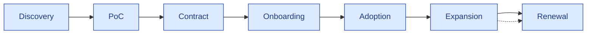

# Customer Accounts Index

| Field | Value |
|---|---|
| Owner | Customer Success + Sales |
| Status | DRAFT v0.1 (pre-customer; scaffold for future) |
| Last updated | 2026-05-31 |

---

## 1. Purpose

A per-customer file folder for **engagement-specific docs that don't live in product or sales playbooks**: kickoff notes, custom configs, validation packages, escalation history, renewal context. **One folder per customer**, structured consistently.

## 2. Current accounts

> ⏳ **Status as of 2026-05-31: pre-customer.** Below is the scaffold + 2 design-partner targets in active discovery.

| Customer | Stage | CSM | Folder | ARR |
|---|---|---|---|---|
| **Sanpras Healthcare** | Design partner in discovery | Founders (interim) | `customer-accounts/sanpras-healthcare/` (TBD) | $0 (LOI) |
| **Novex Pharma** | Past walkthrough; not signed | Founders (interim) | `customer-accounts/novex-pharma/` (TBD) | $0 |

## 3. Per-customer folder structure (template)

```
customer-accounts/<customer-slug>/
├── README.md                          # Customer profile + key contacts
├── 01-discovery/
│   ├── initial-meeting-notes.md
│   ├── discovery-questionnaire-responses.pdf
│   └── stakeholder-map.md
├── 02-poc/
│   ├── poc-success-criteria.pdf
│   ├── poc-kickoff-notes.md
│   ├── poc-day-30-review.md
│   ├── poc-day-50-review.md
│   └── poc-final-report.pdf
├── 03-contract/
│   ├── signed-msa.pdf
│   ├── pricing-summary.md
│   ├── purchase-order.pdf
│   └── invoice-history/
├── 04-onboarding/
│   ├── tenant-config.md              # Tenant-specific settings
│   ├── user-list.md                  # Onboarded users + roles
│   ├── data-import-log.md
│   └── validation-summary.pdf
├── 05-support/
│   ├── ticket-history.csv            # All support tickets
│   ├── escalation-log.md             # SEV-1+ incidents
│   ├── post-mortems/
│   └── custom-config-changes.md
├── 06-expansion/
│   ├── usage-metrics-monthly.csv
│   ├── expansion-conversations.md
│   ├── module-adoption-tracker.md
│   └── reference-calls-log.md
├── 07-renewal/
│   ├── renewal-review-notes.md
│   ├── expansion-proposal.pdf
│   └── renewed-contract.pdf
└── 08-correspondence/
    └── (email summaries; major decisions only)
```

## 4. Per-customer profile template (README.md)

Each customer's `README.md` follows this template:

```markdown
# <Customer Name>

## Profile
- Industry: <pharma / med-device / etc.>
- Size: <revenue tier / number of sites>
- Region: <India / US / EU>
- Tier: <2 mid-pharma | 3 CDMO | 4 SME>
- Veeva/MasterControl status: <not on / on for X module / displacing>

## Key contacts
- Champion: <name, role, contact>
- Executive sponsor: <name, role, contact>
- Procurement: <name, role, contact>
- Technical contact (IT): <name, role, contact>
- Customer Success lead: <Hawkeye name>

## Contract
- Tier: <Starter / Growth / Enterprise>
- ACV: $X
- Term: <1-year / 2-year / 3-year>
- Renewal date: YYYY-MM-DD
- Modules: <list>

## Status
- Health: <Green / Yellow / Red>
- NPS (latest): X
- Days since last login (any user): X
- Modules in active use: <list>

## Recent activity
- <date>: <event>
- <date>: <event>

## Open items
- [ ] <action item>
- [ ] <action item>
```

## 5. What gets documented (and what doesn't)

> ✅ **Document.**
> - Decisions that affect customer relationship (config changes, escalations, exceptions to standard pricing/terms)
> - Validation activities (per Part 11 requirements)
> - Reference call commitments + outcomes
> - SEV-1 incidents + post-mortems
> - Renewal context + risks

> 🚫 **Don't document here.**
> - Routine email threads (those live in inbox)
> - Real-time chat (lives in Slack Connect)
> - Day-to-day usage data (lives in product analytics, not docs)
> - Personally identifiable info (PII) beyond key contacts
> - Confidential customer business data (treat as customer's, not ours)

## 6. Access control on customer folders

| Role | Access |
|---|---|
| Hawkeye founders | All customer folders |
| Customer Success Manager (when hired) | Assigned customer folders |
| Sales | Read-only on assigned customer folders |
| Engineering | Read-only when actively supporting customer (not browsing) |
| Other staff | None |

## 7. Customer-specific configurations

Some customers will need custom configs. **These are documented IN the customer folder + summarized centrally**:

| Customer-specific config | Where it lives |
|---|---|
| Custom audit-type catalog (e.g., supplier-specific assessment types) | Customer's `04-onboarding/tenant-config.md` |
| Custom workflow templates (e.g., extra approval step) | Customer's `04-onboarding/tenant-config.md` + flag in central config registry |
| Custom integration (e.g., LIMS bridge) | Customer's `05-support/custom-config-changes.md` |
| Custom validation requirements | Customer's `04-onboarding/validation-summary.pdf` |
| Custom retention policy | Tenant settings + customer's `04-onboarding/tenant-config.md` |

## 8. Customer activity log (cross-customer view)

Centralized log of significant events across all customers:

| Event type | Logged in |
|---|---|
| New customer signed | Per-customer folder + central `customer-accounts/_activity-log.md` |
| Module expansion | Per-customer + central |
| SEV-1 incident | Per-customer + central + Slack #incidents |
| Renewal | Per-customer + central |
| Churn (NRR loss) | Per-customer + central + exit interview |
| Reference call | Per-customer + central |
| NPS submitted | Per-customer (CSM dashboard) |

## 9. Customer lifecycle stages



| Stage | Duration | Owner |
|---|---|---|
| Discovery | 2-8 weeks | Sales |
| PoC | 60 days | Sales (lead) + CS (shadow) |
| Contract | 1-3 weeks | Sales + Founder |
| Onboarding | 30 days | Customer Success |
| Adoption | 90 days post-onboarding | Customer Success |
| Expansion | Ongoing | Customer Success + Sales |
| Renewal | 120 days pre-renewal start | Customer Success + Sales |

---

## See also

- [ONBOARDING.md](../onboarding-guides/CUSTOMER-ONBOARDING.md) — Day 0-30 process
- [SUPPORT-MODEL.md](../support-runbooks/SUPPORT-MODEL.md) — ongoing support
- [SALES-PLAYBOOK.md](../../09-sales-marketing/pitch-materials/SALES-PLAYBOOK.md) — pre-customer engagement
- [00-strategy-and-pitch/customer-pitches/](../../../backend/docs/00-strategy-and-pitch/customer-pitches/) (legacy) — Sanpras + Novex pitch material
