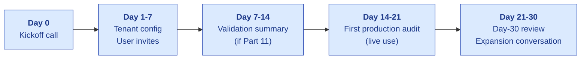
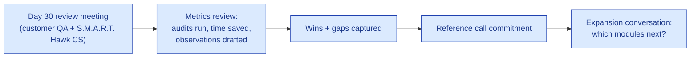

# Customer Onboarding

| Field | Value |
|---|---|
| Owner | Customer Success (when hired); Sales today |
| Status | DRAFT v1.0 |
| Last updated | 2026-05-31 |

---

## 1. Onboarding philosophy

> 💡 **Time-to-first-value < 30 days.** First production audit running in S.M.A.R.T. Hawk within 30 days of contract signature. Anything longer = sunk-cost erosion. The model isn't "Veeva-style 6-month implementation"; it's "fast setup, value in week 2, expand over months."

## 2. Onboarding journey

## 3. Day 0 — Kickoff call (60 min)

| Agenda item | Time |
|---|---|
| Introductions (customer's QA team + S.M.A.R.T. Hawk CS + Sales) | 5 min |
| Recap of PoC outcomes + decision criteria | 10 min |
| Walk-through of 30-day onboarding plan | 15 min |
| Validation requirements alignment | 10 min |
| Roles + responsibilities (RACI) | 10 min |
| Schedule Day 7, 14, 21, 30 checkpoints | 5 min |
| Q&A | 5 min |

**Deliverable:** signed onboarding plan with mutual commitments.

## 4. Tenant config checklist (Days 1-7)

| # | Task | Owner |
|---|---|---|
| 1 | Create tenant in S.M.A.R.T. Hawk admin | S.M.A.R.T. Hawk |
| 2 | Configure tenant settings (timezone, currency, e-sig mode) | S.M.A.R.T. Hawk + Tenant Admin |
| 3 | Invite tenant_admin user | S.M.A.R.T. Hawk |
| 4 | Tenant_admin invites their team (3-10 initial users) | Tenant Admin |
| 5 | Configure RBAC per persona | Tenant Admin |
| 6 | Configure audit-type catalog (per their assessment types) | Tenant Admin + S.M.A.R.T. Hawk SME |
| 7 | Set up Affiliation records (if 3rd-party auditors involved) | Tenant Admin |
| 8 | Configure notification preferences | Each user |
| 9 | Upload existing documents (Doc Control bulk upload) | Doc Control Officer |
| 10 | Test data import (suppliers, sites, products) | S.M.A.R.T. Hawk + Tenant Admin |

## 5. Validation summary (Days 7-14, if Part 11 customer)

| # | Task | Owner |
|---|---|---|
| 1 | S.M.A.R.T. Hawk provides validation summary template | S.M.A.R.T. Hawk |
| 2 | Customer signs validation kickoff | Tenant Admin + Customer QA Head |
| 3 | IQ (Installation Qualification) scripts run | Customer QA + S.M.A.R.T. Hawk support |
| 4 | OQ (Operational Qualification) scripts run | Customer QA |
| 5 | PQ (Performance Qualification) — first audit IS the PQ | Customer QA |
| 6 | Validation summary signed off | Joint |
| 7 | Validation package archived in customer's vault | Customer |

## 6. First production audit (Days 14-21)

> ✅ **The critical milestone.** First real supplier audit run in S.M.A.R.T. Hawk = customer commitment is real.

| Step | What happens |
|---|---|
| Day 14 | Buyer creates audit request for a real supplier |
| Day 14 | S.M.A.R.T. Hawk CS shadow + record session for feedback |
| Day 15 | Auditor assignment + supplier intimation sent |
| Day 16 | Supplier accepts intimation (with e-sig) |
| Day 17-18 | Supplier submits PAQ |
| Day 19 | Auditor reviews + drafts observations (with AI assist) |
| Day 20 | Auditor signs report |
| Day 21 | Buyer approves closure cert (dual e-sig) |
| Day 21 | Audit closed in S.M.A.R.T. Hawk |

If any step takes longer than expected, CS schedules immediate troubleshooting call.

## 7. Day 30 review

| Agenda item | Time |
|---|---|
| Metrics review (audits started, time saved per audit, AI usage) | 15 min |
| What worked well | 10 min |
| What needs improvement | 15 min |
| Reference call planning (when + with whom) | 5 min |
| Module expansion conversation (which adjacent module next?) | 10 min |
| Roadmap of next 60 days | 5 min |

## 8. Common onboarding blockers

| Blocker | Root cause | Mitigation |
|---|---|---|
| User invites not accepted | Email going to spam OR users don't know it's coming | Pre-announce; whitelist S.M.A.R.T. Hawk domain |
| Doc upload errors | File format incompatibility OR size limits | Pre-flight file validation; chunked uploads |
| Validation taking too long | Customer process bottleneck (multi-week approvals) | Parallel-track: start using product BEFORE validation finishes |
| First audit delays | Supplier not ready / doesn't accept intimation | CS calls supplier directly; provides supplier walkthrough |
| Confusion about RBAC | Tenant_admin unsure who needs what role | Default role suggestions per persona; "test as user X" feature |
| AI quality not what was demoed | Customer's KB not yet ingested | Day 7 KB ingestion review |

## 9. Onboarding KPIs

| Metric | Target |
|---|---|
| Time to first production audit | < 21 days |
| Day-30 customer NPS | > 50 |
| Day-30 reference call commitment | > 80% |
| Day-90 expansion conversation completion | > 90% |
| Day-90 second module adopted | > 60% |
| Onboarding CSAT | > 4.5/5 |

## 10. Self-serve onboarding (post-M12)

For Tier 4 / SME customers, lighter onboarding:

| Channel | Asset |
|---|---|
| In-app tutorial | Guided tour on first login |
| Onboarding video library | Per-module 5-min how-to videos |
| Quick-start guide | 2-page PDF per persona |
| Knowledge base | AskHawk pre-seeded with FAQs |
| Office hours | Weekly drop-in for new customers |

---

## See also

- [SUPPORT-MODEL.md](../support-runbooks/SUPPORT-MODEL.md) — ongoing support
- [CUSTOMER-ACCOUNTS-INDEX.md](../customer-accounts/CUSTOMER-ACCOUNTS-INDEX.md) — per-customer file index
- [SALES-PLAYBOOK.md §10](../../09-sales-marketing/pitch-materials/SALES-PLAYBOOK.md#10-post-close-handoff-to-customer-success) — handoff from Sales
- [03-user-guides/02-user-manual.md](../../../backend/docs/03-user-guides/02-user-manual.md) (legacy) — comprehensive user manual
