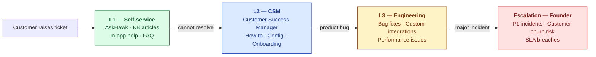
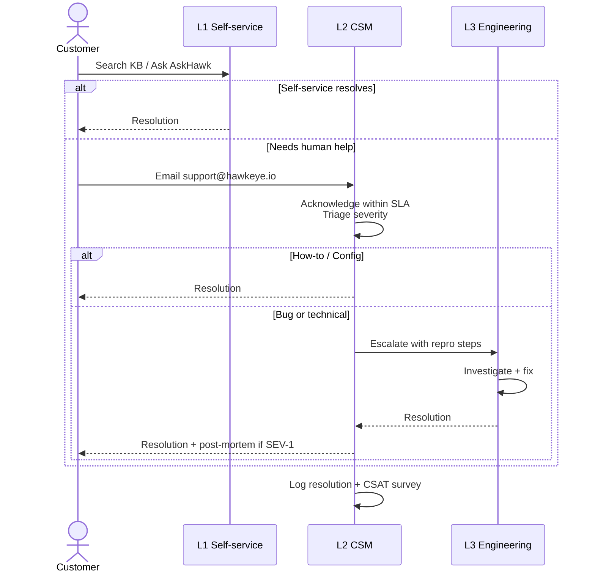
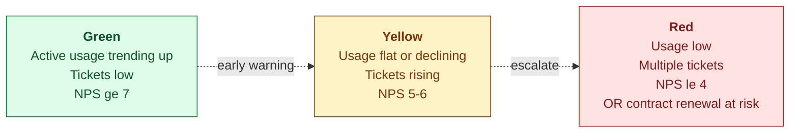

# Customer Support Model

| Field | Value |
|---|---|
| Owner | Customer Success (when hired); Founders today |
| Status | DRAFT v1.0 |
| Last updated | 2026-05-31 |

---

## 1. Support tiers

## 2. Support tiers per customer plan

| Plan | L1 self-service | L2 CSM | L3 engineering | Escalation |
|---|---|---|---|---|
| **Starter** ($4K) | ✅ | Shared (group queue) | Bug fixes only; no custom work | 24h response |
| **Growth** ($12K) | ✅ | Named CSM (50% allocation across portfolio) | Bug fixes + minor configs | 4h response |
| **Enterprise** ($24K+) | ✅ | Dedicated CSM | Bug fixes + integrations | 1h response |

## 3. SLA

| Severity | Response time | Resolution target |
|---|---|---|
| **SEV-1** (system down, data integrity issue, security incident) | < 1 hour | < 4 hours |
| **SEV-2** (major feature broken, blocks customer workflow) | < 4 hours | < 24 hours |
| **SEV-3** (minor feature broken, workaround exists) | < 24 hours | < 5 days |
| **SEV-4** (cosmetic, enhancement request) | < 72 hours | Roadmap |

## 4. Support channels

| Channel | Purpose | Hours |
|---|---|---|
| **In-app help** (AskHawk + KB) | Self-service | 24/7 |
| **Email** (support@hawkeye.io) | All ticket creation | 24/7 monitored 9-9 IST + 9-5 ET |
| **Slack Connect** (Enterprise only) | Real-time chat with CSM | Business hours |
| **Phone hotline** (Enterprise SEV-1 only) | Critical incidents | 24/7 |
| **Office hours** (Wednesday 4pm IST) | Open Q&A for all customers | Weekly |
| **Quarterly business reviews** | Roadmap + adoption review | Quarterly per customer |

## 5. Ticket lifecycle

## 6. Self-service resources (L1)

| Resource | Where | Maintenance |
|---|---|---|
| AskHawk (Regulations Q&A, SOPs, App Wizard) | In-app drawer | Continuous (KB sync) |
| Knowledge base articles | hawkeye.io/help | Quarterly review |
| Video tutorials | YouTube + in-app | Quarterly updates |
| Status page | status.hawkeye.io | Real-time |
| Changelog | hawkeye.io/changelog | Per release |
| Community forum (post-Series A) | TBD | Moderated weekly |

## 7. Common ticket categories (anticipated)

| Category | % of tickets (estimated) | L1 deflection |
|---|---|---|
| How-to questions (config, workflow) | 40% | 70% via AskHawk |
| Login / auth issues | 15% | 60% via FAQ |
| Permission / RBAC questions | 12% | 50% via FAQ |
| AI quality concerns (drafts, confidence) | 10% | 30% (needs CSM) |
| Bug reports | 8% | 0% (escalate to L3) |
| Feature requests | 8% | 0% (roadmap) |
| Integration / API questions | 5% | 20% via API docs |
| Validation / Part 11 questions | 2% | 10% (need compliance) |

## 8. SEV-1 incident response

(See [07-operations/incident-response/](../../07-operations/incident-response/) for full runbook — TBD.)

```mermaid
flowchart LR
    classDef step fill:#dbeafe,stroke:#1e40af,color:#1e3a8a
    classDef alert fill:#fee2e2,stroke:#b91c1c,color:#7f1d1d

    A["SEV-1 detected<br/>(monitoring / customer / staff)"]:::alert
    B["Page on-call engineer<br/>(< 5 min)"]:::step
    C["Incident commander<br/>declared"]:::step
    D["Customer notification<br/>(< 30 min)"]:::step
    E["Investigation<br/>+ mitigation"]:::step
    F["Resolution + restore"]:::step
    G["Post-mortem<br/>(< 5 days)"]:::step
    H["Customer notification<br/>+ status page"]:::step

    A --> B --> C --> D --> E --> F --> G --> H
```

| Step | Owner | Time |
|---|---|---|
| Detection | Monitoring / customer / staff | T+0 |
| Page on-call | Sentry / PagerDuty | T+5 min |
| Incident commander declared | On-call (escalates to founder for P1) | T+15 min |
| Status page updated | On-call | T+15 min |
| Customer notification (Enterprise) | CSM | T+30 min |
| Investigation + mitigation | Engineering | T+30 min onward |
| Resolution + restore | Engineering | Target < 4h |
| Status page resolved | On-call | At resolution |
| Customer post-mortem | CSM + Engineering | Within 5 days |
| Root cause analysis archive | Engineering | Within 5 days |

## 9. Customer health monitoring

| Health score input | Weight |
|---|---|
| Monthly active users (% of seats) | 25% |
| Audits completed (vs baseline) | 25% |
| Days since last login (any user) | 15% |
| Tickets opened in last 30 days | 15% |
| NPS (latest survey) | 10% |
| Module adoption count | 10% |

CSM gets weekly health-score report; red accounts get immediate intervention.

## 10. Renewals + expansion

| Trigger | Action | Owner |
|---|---|---|
| 120 days before renewal | Renewal review meeting | CSM |
| 90 days before renewal | Expansion proposal (additional sites / modules / users) | CSM + Sales |
| 60 days before renewal | Contract draft sent | Sales |
| 30 days before renewal | Renewal signed OR escalation | Sales + Founder |
| Renewed | Update plan + welcome to next year | CSM |
| Not renewed | Exit interview + data export | CSM |

---

## See also

- [ONBOARDING.md](../onboarding-guides/CUSTOMER-ONBOARDING.md)
- [CUSTOMER-ACCOUNTS-INDEX.md](../customer-accounts/CUSTOMER-ACCOUNTS-INDEX.md)
- [SALES-PLAYBOOK.md](../../09-sales-marketing/pitch-materials/SALES-PLAYBOOK.md)
- [07-operations/incident-response/](../../07-operations/incident-response/) — incident runbook (TBD)
- [04-engineering/06-security/SECURITY.md §12](../../04-engineering/06-security/SECURITY.md#12-incident-response) — security incident SLAs
